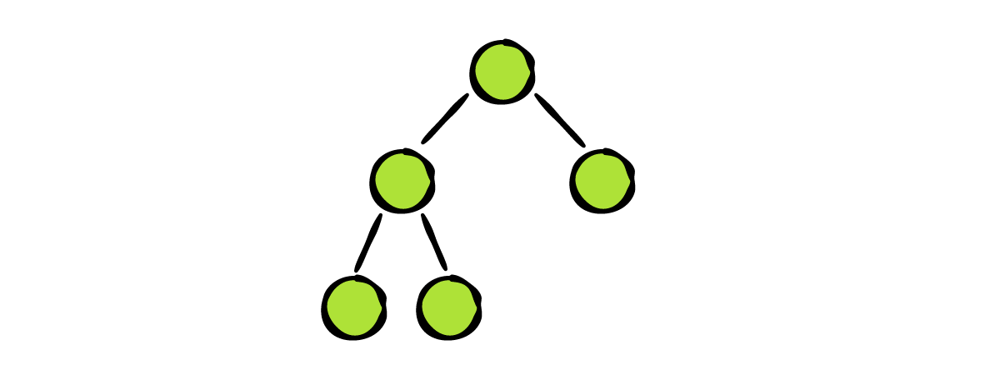
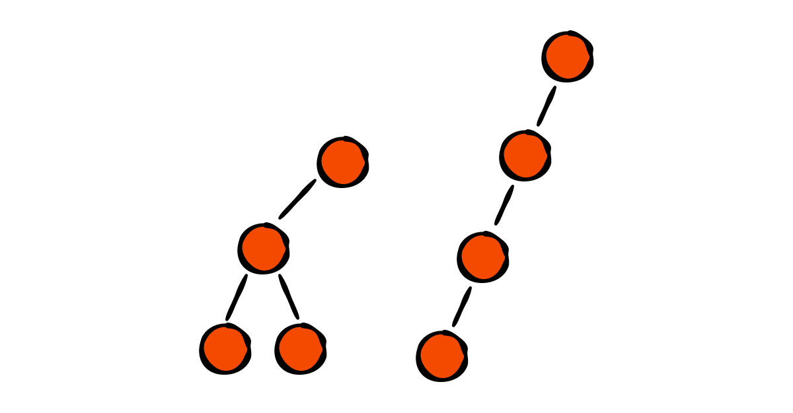
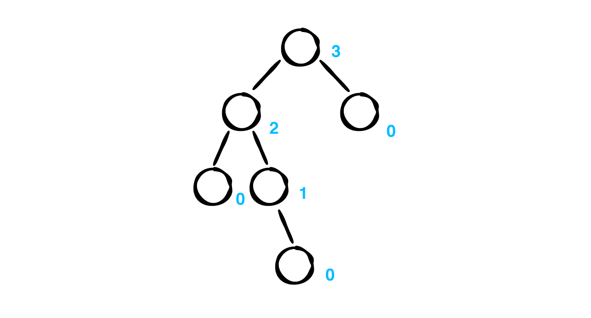
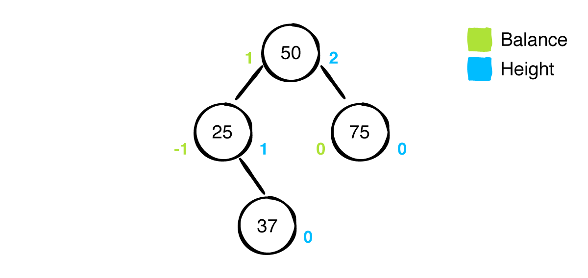
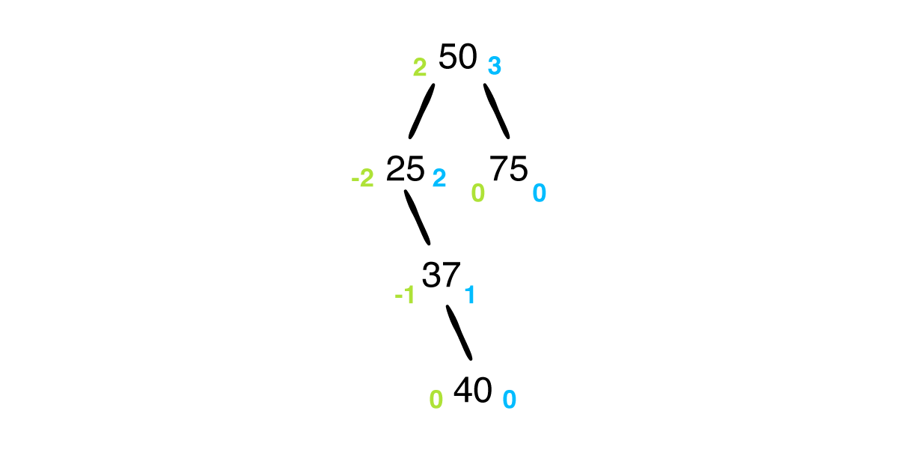
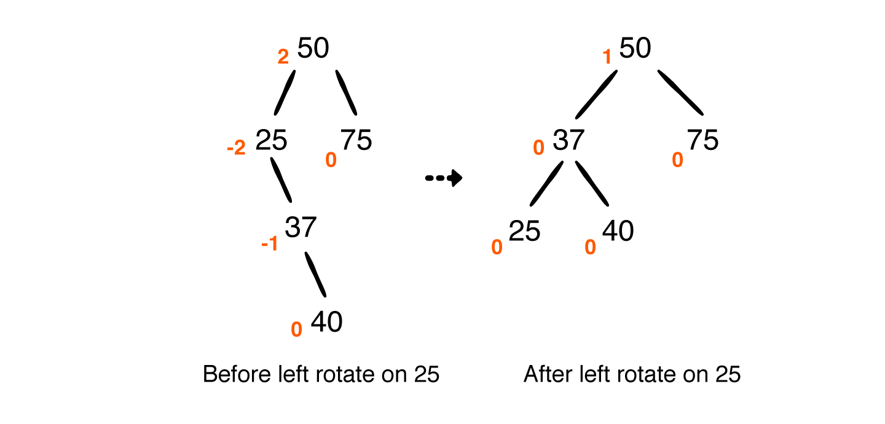
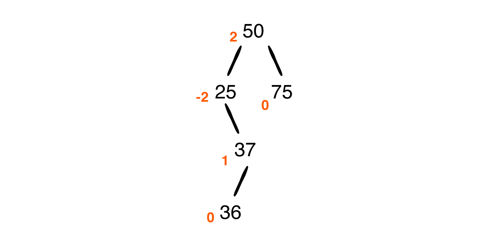
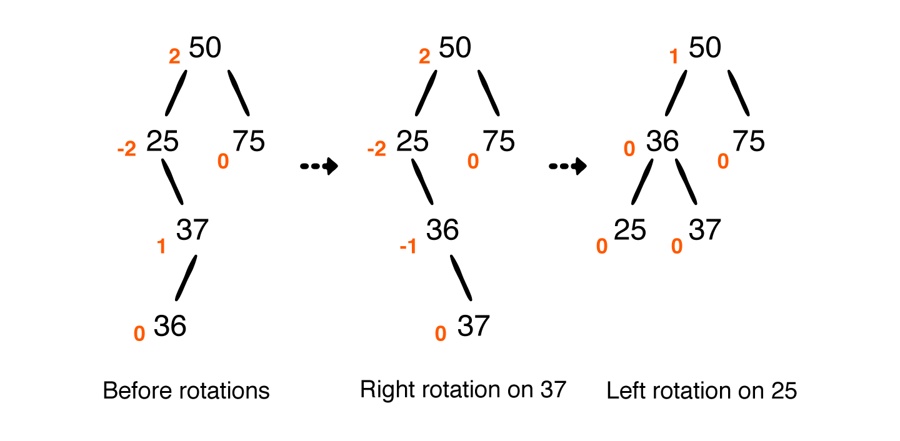
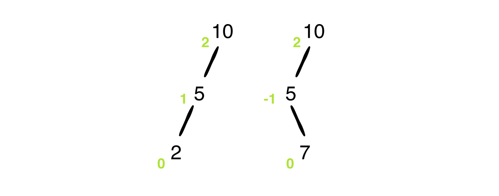

上一篇文章[二叉搜索树 Binary Search Tree](https://github.com/pro648/tips/blob/master/sources/%E4%BA%8C%E5%8F%89%E6%90%9C%E7%B4%A2%E6%A0%91%20Binary%20Search%20Tree.md)介绍了其性能为`O(log n)`，但不平衡的二叉树可能导致其性能下降，最差变为`O(n)`。

1962年，G. M. Adelson-Velsky 和 Evgenii Landis 在他们的论文*An algorithm for the organization of information*中首次公开 AVL 树这一数据结构。AVL 树是最早被发明的自平衡二叉搜索树。在 AVL 树中，任一节点对应的两颗子树最大高度差为1，因此，AVL 树也称为高度平衡树。查找、删除、插入平均、最坏复杂度都是`O(log n)`，增加和删除元素的操作可能触发一次或多次树旋转。

这篇文章将介绍二叉搜索树的平衡如何影响性能，以及实现一个 AVL 树。

## 1. 平衡

优化二叉搜索树的关键是平衡，下面介绍三种平衡状态。

#### 1.1 完美平衡

二叉搜索树最理想的状态就是完美平衡，即所有非叶子节点的度都是2，同时所有叶子节点都在最后一层，被称为完美二叉树（Perfect Binary Tree），也就是国内教材中的满二叉树。


#### 1.2 非完美平衡

虽然完美平衡是最理想的，但其很难实现。满二叉树必须包含指定数量的节点，以便填满每一层。例如，节点数量为1、3、7时是满二叉树；节点数量为2、4、5、6时，由于不能填满最后一层，不能成为满二叉树。



左子树高度减去右子树高度是该节点的平衡因子。通常，认为平衡因子1、0、-1的节点是平衡的。

#### 1.3 不平衡

不平衡二叉搜索树会有性能损失，并且随不平衡程度而异。



保持树平衡可以确保插入、移除、查找操作保持`O(log n)`复杂度。AVL 树通过调整自身结构确保树保持平衡状态。

## 2. 实现 AVL 树

AVL 树和二叉搜索树有很多共同点，只是 AVL 树增加了自平衡的部分。因此，这里使用上一篇文章[二叉搜索树 Binary Search Tree](https://github.com/pro648/BasicDemos-iOS/tree/master/BinarySearchTree)的源码，在其基础上增加平衡部分即可。此外，为方便理解将demo中`BinaryNode`重命名为`AVLNode`，将`BinarySearchTree`重命名为`AVLTree`。

#### 2.1 平衡因子

AVL 树使用节点中的高度（height）属性测量节点是否平衡。高度是节点到最远叶子节点的距离。



在`AVLNode.swift`中增加以下属性：

```
    public var height = 0
```

指定节点 children 的相对高度决定该节点是否平衡，左右子树高度相差最大为1，高度差被称为平衡因子。

在上述`height`属性下添加以下代码：

```
    public var balanceFactor: Int {
        leftHeight - rightHeight
    }
    
    public var leftHeight: Int {
        leftChild?.height ?? -1
    }
    
    public var rightHeight: Int {
        rightChild?.height ?? -1
    }
```

`balanceFactor`计算左右子树的高度，如果子树为nil，则其高度为-1。

下面是一颗 AVL 树：



蓝色表示高度，绿色表示平衡因子。

插入40后如下所示：



插入40后，平衡因子出现了大于等于2，或小于等于-2，即树失去平衡。虽然多个节点会失去平衡，但只需平衡最底部失去平衡的节点，树就会恢复平衡。

#### 2.2 旋转

让二叉搜索树恢复平衡的过程，称为旋转（Rorations）。旋转有两大基础操作：左旋和右旋。共有四种失去平衡类型：LL型、RR型、LR型、RL型。

###### 2.2.1 RR型 左旋转 单旋

所谓的RR型就是节点的右子树的右子树导致其失去平衡，即下图中的 Z 导致其失去平衡。

插入40导致失去平衡可以通过左旋解决，对 x 节点左旋操作如下：


旋转前后有以下两个要点：

- 中序遍历结果保持不变。
- 旋转后树的深度减一。

在`AVLTree.swift`文件`insert(from:value:)`方法下添加以下代码：

```
    /// 左旋
    private func leftRotate(_ node: AVLNode<Element>) -> AVLNode<Element> {
        // 节点右子树作为枢纽
        let pivot = node.rightChild!
        
        // 要旋转的节点会被设置为枢纽的左子树，pivot现在的左子树被设置为node的右子树。
        node.rightChild = pivot.leftChild
        pivot.leftChild = node
        
        // 更新pivot和node的高度
        node.height = max(node.leftHeight, node.rightHeight) + 1
        pivot.height = max(pivot.leftHeight, pivot.rightHeight) + 1
        
        // 返回 pivot，用以替换旋转的节点。
        return pivot
    }
```

对25左旋前后对比如下：



###### 2.2.2 LL型 右旋 单旋

所谓的LL型就是节点的左子树的左子树导致其失去平衡，即下图中的 Z 导致其失去平衡。

LL型与RR型相反，当一系列左子树导致失衡，需进行右旋。

对 X 进行右旋操作如下：


具体算法如下：

```
    /// 右旋
    private func rightRotate(_ node: AVLNode<Element>) -> AVLNode<Element> {
        let pivot = node.leftChild!
        node.leftChild = pivot.rightChild
        pivot.rightChild = node
        
        node.height = max(node.leftHeight, node.rightHeight) + 1
        pivot.height = max(pivot.leftHeight, pivot.rightHeight) + 1
        
        return pivot
    }
```

与RR型类似，只是左右子树进行了互换。

###### 2.2.3 RL 型 右旋+左旋 双旋

RL 就是将节点插入到了右子树的左子树上，导致失去平衡。

前面遇到的都是子树在同一侧（左侧或右侧），当向其插入36时，将出现以下情况：



此时，左旋无法恢复平衡。需先对右子树右旋，再进行左旋。如下所示：



1. 先对37右旋。
2. 目前，25、36、37都是右子树，执行左旋可以恢复平衡。

算法如下：

```
    /// 先右旋，在左旋
    private func rightLeftRotate(_ node: AVLNode<Element>) -> AVLNode<Element> {
        guard let rightChild = node.rightChild else { return node }
        
        node.rightChild = rightRotate(rightChild)
        return leftRotate(node)
    }
```

稍后会介绍何时调用上述算法。

###### 2.2.4 LR 型 左旋+右旋 双旋

LR 型和RL型刚好相反，如下所示：


1. 对10左旋。
2. 节点25、15、10都是左子树，执行右旋恢复平衡。

算法如下：

```
    /// Left-Right
    private func leftRightRotate(_ node: AVLNode<Element>) -> AVLNode<Element> {
        guard let leftChild = node.leftChild else { return node }
        
        node.leftChild = leftRotate(leftChild)
        return rightRotate(node)
    }
```

上面是可进行的旋转类型，下一步将分析何时使用何种旋转方式。

#### 2.3 平衡因子

根据`balanceFactor`决定节点是否平衡，具体方法如下：

```
    /// 平衡
    private func balanced(_ node: AVLNode<Element>) -> AVLNode<Element> {
        switch node.balanceFactor {
        case 2: // 2表示左子树高度大于右子树高度
            // ...
        case -2:    // -2表示右子树高度大于左子树高度
            // ...
        default:    // 节点已经平衡，无序调节。
            return node
        }
    }
```

`balanceFactor`的符号用于判断子树需要进行一次旋转，还是两次旋转。



更新`update(node:)`方法如下：

```
    /// 平衡
    private func balanced(_ node: AVLNode<Element>) -> AVLNode<Element> {
        switch node.balanceFactor {
        case 2: // 2表示左子树高度大于右子树高度
            if let leftChild = node.leftChild, leftChild.balanceFactor == -1 {
                return leftRightRotate(node)
            } else {
                return rightRotate(node)
            }
        case -2:    // -2表示右子树高度大于左子树高度
            if let rightChild = node.rightChild, rightChild.balanceFactor == 1 {
                return rightLeftRotate(node)
            } else {
                return leftRotate(node)
            }
        default:    // 节点已经平衡，无序调节。
            return node
        }
    }
```

上述方法根据`balanceFactor`决定要执行的平衡类型。目前，只需在合适时机调用`balance(:node)`即可。

#### 2.4 插入后恢复平衡

二叉搜索树中已经处理了插入的逻辑，这里只需在插入后查看高度，恢复平衡即可。

`insert(from:value:)`方法更新后如下：

```
    private func insert(from node: AVLNode<Element>?, value: Element) -> AVLNode<Element> {
        // 如果节点为nil，则找到了插入点，返回节点，结束递归。
        guard let node = node else { return AVLNode(value: value) }
        
        // Element 遵守 Comparable，比较值大小。
        if value < node.value { // 值小于当前节点，继续与左子树比较。
            node.leftChild = insert(from: node.leftChild, value: value)
        } else {    // 大于等于当前节点值，继续与右子树比较。
            node.rightChild = insert(from: node.rightChild, value: value)
        }
        
        // 恢复平衡
        let balancedNode = balanced(node)
        balancedNode.height = max(balancedNode.leftHeight, balancedNode.rightHeight) + 1
        
        return balancedNode
    }
```

插入后、返回节点前旋转节点，使其恢复平衡。同时，更新节点的高度。

在 playground page 中增加以下方法，查看树是否保持了平衡：

```
example(of: "repeated insertions in sequence") {
    var tree = AVLTree<Int>()
    for i in 0..<15 {
        tree.insert(i)
    }
    print(tree)
}
```

控制台输出如下：

```
--- Example of repeated insertions in sequence ---
  ┌──14
 ┌──13
 │ └──12
┌──11
│ │ ┌──10
│ └──9
│  └──8
7
│  ┌──6
│ ┌──5
│ │ └──4
└──3
 │ ┌──2
 └──1
  └──0
```

如果没有执行平衡措施，该二叉树会退化成链表。

#### 2.5 移除后恢复平衡

移除后恢复平衡与插入后恢复平衡类似，只需在移除操作的return前恢复平衡即可。

将`remove(node:value:)`的`return`语句使用以下代码替换：

```
        // 删除后恢复平衡
        let balancedNode = balanced(node)
        balancedNode.height = max(balancedNode.leftHeight, balancedNode.rightHeight) + 1
        return balancedNode
```

在 playground page 中使用以下代码验证移除后是否恢复了平衡：

```
example(of: "removing a value") {
    var tree = AVLTree<Int>()
    tree.insert(15)
    tree.insert(10)
    tree.insert(16)
    tree.insert(18)
    print(tree)
    tree.remove(10)
    print(tree)
}
```

执行后控制台输出如下：

```
--- Example of removing a value ---
 ┌──18
┌──16
│ └──nil
15
└──10

┌──18
16
└──15
```

移除10后，15的高度变为-2，触发左旋。

AVL 树的自平衡属性确保了插入、删除、查找复杂度永远保持在`O(log n)`。

## 3. AVL 树算法题

#### 3.1 树遍历协议

由于树有多种不同类型，把通用功能放入单独协议会更简洁，例如遍历功能。

创建`TraversableBinaryNode`协议，在协议内提供遍历方法的默认实现。二叉树遵守该协议就自动获得了遍历功能。

首先，创建协议：

```
protocol TraversableBinaryNode {
    associatedtype Element
    var value: Element { get }
    var leftChild: Self? { get }
    var rightChild: Self? { get }
    
    func traverseInOrder(visit: (Element) -> Void)
    func traversePreOrder(visit: (Element) -> Void)
    func traversePostOrder(visit: (Element) -> Void)
}
```

`AVLNode`遵守`TraversableBinaryNode`protocol：

```
extension AVLNode: TraversableBinaryNode {
    func traverseInOrder(visit: (Element) -> Void) {
        leftChild?.traverseInOrder(visit: visit)
        visit(value)
        rightChild?.traverseInOrder(visit: visit)
    }
    
    func traversePreOrder(visit: (Element) -> Void) {
        visit(value)
        leftChild?.traversePreOrder(visit: visit)
        rightChild?.traversePreOrder(visit: visit)
    }
    
    func traversePostOrder(visit: (Element) -> Void) {
        leftChild?.traversePreOrder(visit: visit)
        rightChild?.traversePreOrder(visit: visit)
        visit(value)
    }
}
```

由于协议使用了`Self`，`AVLNode`应禁止继承、重写。更新`AVLNode`类的声明，增加`final`关键字：

```
public final class AVLNode<Element> {
```

最后，尝试调用遍历方法：

```
example(of: "using TraversableBinaryNode") {
    var tree = AVLTree<Int>()
    for i in 0..<15 {
        tree.insert(i)
    }
    tree.root?.traverseInOrder(visit: {
        print($0)
    })
}
```

可以看到中序遍历 AVL 树，其按照升序进行了输出，如下所示：

```
--- Example of using TraversableBinaryNode ---
0
1
2
3
4
5
6
7
8
9
10
11
12
13
14
```

## 总结

插入、删除后，自平衡的树会通过四种不同类型旋转恢复平衡，这样可以避免性能下降。

Demo名称：AVLTree  
源码地址：<https://github.com/pro648/BasicDemos-iOS/tree/master/AVLTree>

