> 这是关于自动布局的第二篇文章。    
> [<< Auto Layout的使用](https://github.com/pro648/tips/wiki/Auto%20Layout%E7%9A%84%E4%BD%BF%E7%94%A8)

[上一篇](https://github.com/pro648/tips/wiki/Auto%20Layout%E7%9A%84%E4%BD%BF%E7%94%A8)文章介绍了如何使用Auto Layout，这一篇文章主要介绍*堆栈视图(Stack View)*。*Stack View*提供了一种轻松的方式来使用Auto Layout，不需要引入复杂的约束。单个堆栈视图定义用户界面的行或列，堆栈视图根据以下属性来排列其子视图。

- **axis**：定义*Stack View*的方向，水平方向或竖直方向，只适用于`UIStackView`。`NSStackView`中定义方向使用`orientation`属性。
- **distribution**：设定视图沿轴线的排布方式。
- **alignment**：设定如何沿轴线垂直方向排布子视图。
- **spacing**：设定子视图间距。


> `UIStackView`适用于iOS 9.0+和tvOS 9.0+，`NSStackView`适用于macOS 10.9+。这篇文章只讲解`UIStackView`。

使用*Stack View*时可以先从对象库中拖拽出*Horizontal Stack View*或*Vertical Stack View*到*storyboard*，后把需要添加的视图放进*Stack View*；也可以先添加视图，后点击Auto Layout工具*Embed in Stack*，Auto Layout会根据视图布局插入水平或垂直堆栈视图，也可以点击*Editor* > *Embed In* > *Stack View*插入堆栈视图，与点击*Embed In Stack*插入没有区别。

## 1. 创建demo

这里使用*Tabbed Application*的模板创建demo，*Product Name*为*StackView*，选择文件位置，创建工程。

下面通过三个示例来学习*Stack View*。

## 2. 示例1

打开刚创建demo的*Main.storyboard*，在*First Scene*添加以下视图：第一行为`UILabel`和`UISwitch`，第二行为两个`UIImageView`。

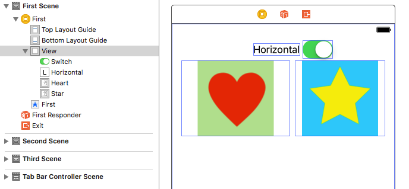

选中第一行的`UILabel`和`UISwitch`，点击*Embed In Stack*插入*Stack View*。打开*Attributes Inspector*，设置*Stack View*的属性如下：

- Axis：Horizontal，自动创建的应该为*Horizontal*，不需要修改。
- Alignment：Center
- Distribution：Fill，不需要修改。
- Spacing：`16`

选中两个`UIImageView`，重复上面插入*Stack View*步骤并修改属性，属性与上面相同。`UIImageView`中图片的*Content Mode*属性为*Aspect Fit*。

选中刚添加的两个*Stack View*，点击*Embed In Stack*再次插入一个堆栈视图。堆栈视图可以嵌入堆栈视图。界面构建器会自动插入一个垂直堆栈视图。修改其属性如下：

- Axis：Vertical，不需要修改。
- Alignment：Center
- Distribution：Fill，不需要修改。
- Spacing：`16`

堆栈视图根据子视图大小来调整自身大小，这里子视图保持固有内容大小，所以只需要添加约束指定堆栈视图位置，不需要约束堆栈视图大小。

添加约束指定堆栈视图水平居中，与*Top*距离为`20`points。如果添加过程遇到问题，你可以点击[这里](https://github.com/pro648/BasicDemos-iOS/tree/master/StackView)查看demo，也可以查看上一篇文章学习如何[添加约束](https://github.com/pro648/tips/wiki/Auto%20Layout%E7%9A%84%E4%BD%BF%E7%94%A8)。添加完毕后视图层级如下：

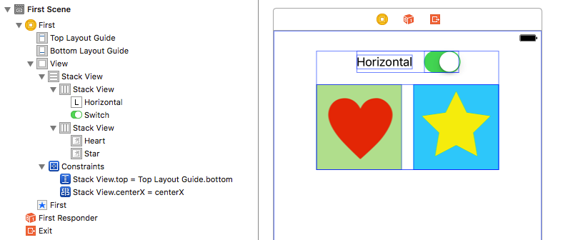

> 使用*Stack View*时一般只需要指定堆栈视图位置，堆栈视图大小会根据子视图大小动态调整。
>
> 堆栈视图中子视图显示顺序由其在`arrangedSubviews`数组的顺序决定。在水平堆栈视图中，视图显示方向与阅读方向一致，`arrangedSubviews`数组中低索引号视图先显示。在垂直堆栈视图中，视图从上向下显示，低索引号视图在上，高索引号视图在下。

当向`arrangedSubviews`数组中添加、移除视图时，或视图被隐藏时，*Stack View*会自动调整布局。

下面从`UISwitch`连接出一个*IBAction*的属性，当点击`UISwitch`时，调整`imageStackView`的`axis`。`imageStackView`为*storyboard*中图片堆栈视图的*IBOutlet*属性。

```
- (IBAction)axisChange:(UISwitch *)sender
{
    [UIView animateWithDuration:0.25 animations:^{
        [self updateConstraintsForAxis];
    }];
}

- (void)updateConstraintsForAxis
{
    // 在水平、垂直堆栈视图间切换
    if (self.imageStackView.axis == UILayoutConstraintAxisHorizontal)
    {
        self.imageStackView.axis = UILayoutConstraintAxisVertical;
    }
    else
    {
        self.imageStackView.axis = UILayoutConstraintAxisHorizontal;
    }
}
```

使用`animateWithDuration: animations: `方法可以让视图的变换以动画形式呈现。

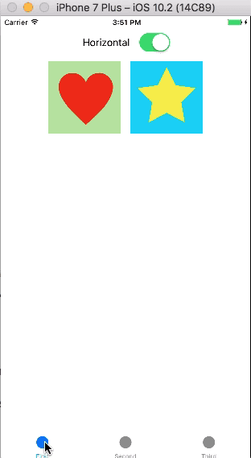

## 3. 示例2

通过`示例1`我们可以在*runtime*手动修改堆栈视图`axis`，但更好的方式是*Stack View*自动跟随设备旋转。例如，当设备从*竖屏(portrait)*旋转为*横屏(landscape)*时，堆栈视图`axis`属性自动从`UILayoutConstraintAxisVertical`调整为`UILayoutConstraintAxisHorizontal`。

进入*Second Scene*，添加两个`UIImageView`，其`contentMode`属性为*Aspect Fit*，图片分别为*Heart*、*Star*，可以通过文章底部网址下载源码获取图片。选中两个`UIImageView`插入一个*Horizontal*堆栈视图。堆栈视图与*Leading*、*Trailing*、*Top*、*Bottom*距离分别为`0`、`0`、`Standard Value`、`Standard Value`。*Stack View*其它属性如下：

- Axis：Horizontal
- Alignment：Center
- Distribution：Fill Proportionally
- Spacing：`0`

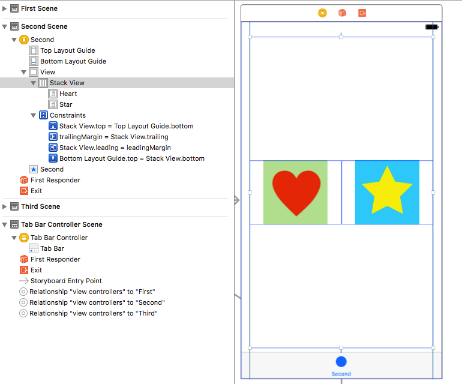

上面的*Distribution*有*Fill*、*Fill Equally*、*Fill Proportionally*、*Equal Spacing*、*Equal Centering*五个属性，这五个属性的区别：

- **UIStackViewDistributionFill**：*Stack View*调整子视图大小以便填充所有可用空间。当子视图大小大于可用空间时，根据*Compression Resistance*优先级压缩视图；当子视图不能填充满可用空间时，根据*Content Hugging*优先级拉伸视图。如果优先级相同，优先调整`arrangedSubviews`数组中*index*小的视图。
- **UIStackViewDistributionFillEqually**：调整所有子视图为相同大小，占用所有可用空间。
- **UIStackViewDistributionFillProportionally**：会保持每一个子视图的固有大小，但如果有可用空间、或需要压缩视图，会按比例拉伸、压缩。如一个视图宽为`100`，另一个视图宽为`200`，*Stack View*想要拉伸视图以便填充可用空间，第一个视图宽被拉伸为`150`，第二个视图宽就会被拉伸为`300`。
- **UIStackViewDistributionEqualSpacing**：不调整子视图大小，通过移动子视图位置让子视图间距相等。如果子视图大于可用空间，会按照*Compression Resistance*优先级压缩。如果优先级相同，优先调整`arrangedSubviews`数组中*index*小的视图。
- **UIStackViewDistributionEqualCentering**：让子视图的中心距离相等。如果视图大于可用空间，会压缩*spacing*属性直到设定的最小值，如果此时仍旧大于可用空间，会根据子视图*Compression Resistance*优先级压缩子视图。如果优先级相同，优先调整`arrangedSubviews`数组中*index*小的视图。

选中*Stack View*，打开*Attributes Inspector*，你会发现每一个*Stack View*属性前会有一个`+`。

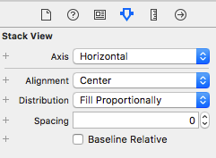

点击这些`+`，可以自定义水平、垂直堆栈视图的属性。下面添加一个当宽度为*compact*、高度为*regular*时`axis`为垂直的属性。

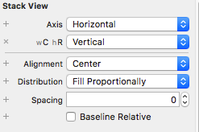

你还可以通过相同方式，添加一个当宽度为*compact*、高度为*regular*时`spacing`属性，一般不需要添加其它属性。

现在运行app，当竖屏时，堆栈视图的*axis*是垂直的；当横屏时，堆栈视图的*axis*是水平的。

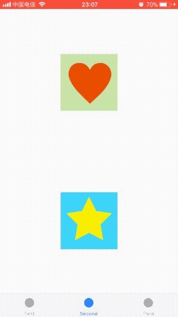


## 4. 示例3

*Stack View*主要优点之一是会自动为其每个子视图创建自动布局约束，也可以对这些子视图的大小和位置进行设置。

为刚创建的demo添加一个*View Controller*，并连接到选项卡控制器，设定*Bar Item*的标题为`Third`。

打开*Third Scene*，自上而下添加`UILabel`、`UIImageView`、`UIButton`，并插入到一个垂直堆栈视图中。堆栈视图属性设置如下：

- Axis: Vertical
- Alignment: Center
- Distribution: Equal Spacing
- Spacing: `0`

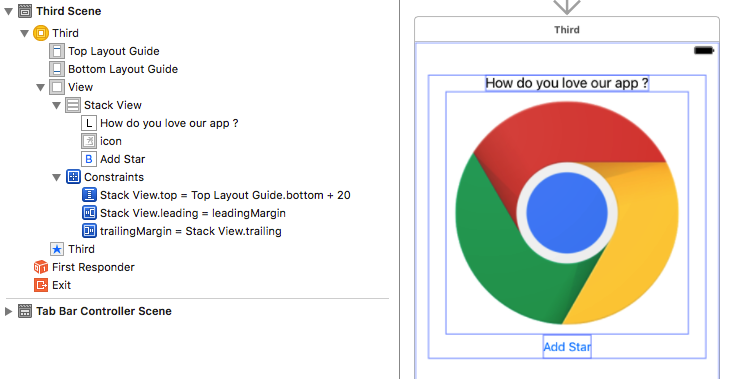

其中`UIImageView`的`contentMode`为*Aspect Fit*，为上面*Stack View*添加约束，与*Leading*、*Trailing*、*Top*距离分别为`0`、`0`、`20`。

在上图*Add Star*下面添加一个水平堆栈视图，属性设置如下：

- Axis: Horizontal
- Alignment: Center
- Distribution: Fill Equally
- Spacing: `10`

完成后为其添加约束，与*Leading*、*Trailing*、*Top*、*Bottom*距离分别为`0`、`0`、`Standard Value`、`20`，高度为`120`。

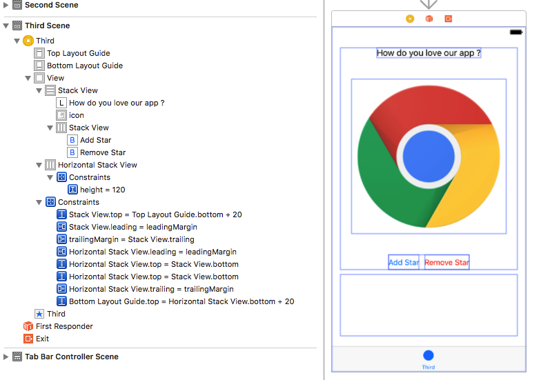

虽然`UIStackView`继承自`UIView`，但它只管理子视图的位置和大小，不提供用户界面，也就是有些属性不适用于`UIStackView`，如`backgroundColor`，也不能重写`drawRect: `方法。

堆栈视图中有`subviews`和`arrangedSubviews`两个属性，其遵守以下规则。

- 当*Stack View*向`arrangedSubviews`数组添加视图时，也会将该视图添加为`subviews`。
- 从*Stack View*移除一个视图，该视图也会被从`arrangedSubviews`数组移除。
- 从`arrangedSubviews`数组移除一个视图，该视图依然存在于`subviews`数组。*Stack View*不在管理被移除视图的位置和大小，但它会存在于视图层级中。

所以，通过调用`addArrangedSubview: `或`insertArrangedSubview: atIndex: `方法向`arrangedSubviews`数组添加元素，该元素同时会被加入`subviews`数组。通过`removeFromSuperView`方法移除的视图，会被同步从`arrangedSubviews`数组移除。通过`removeArrangedSubview: `移除的视图，还会存在于`subviews`数组。

从`UIButton`连接出一个名为`addStar`的*IBAction*点击事件。当点击时，在底部的`horizontalStackView`添加一个五角星。

```
- (IBAction)addStar:(UIButton *)sender
{
    UIImageView *filledStarView = [[UIImageView alloc] initWithImage:[UIImage imageNamed:@"filledStar"]];
    
    // 添加视图到堆栈视图
    [self.horizontalStackView addArrangedSubview:filledStarView];
    filledStarView.contentMode = UIViewContentModeScaleAspectFit;
    
    [UIView animateWithDuration:0.25 animations:^{
        [self.horizontalStackView layoutIfNeeded];
    }];
}
```

现在增加移除五角星的功能。从对象库拖拽一个`UIButton`到*Add Star*下方。选中`UIButton`和*Add Star*，点击*Embed In Stack*按钮插入堆栈视图。修改刚插入堆栈视图属性如下：

- Axis: Horizontal
- Alignment: Center
- Distribution: Equal Spacing
- Spacing: `10`

刚添加`UIButton`标题为`Remove Star`，文字颜色为`red`。

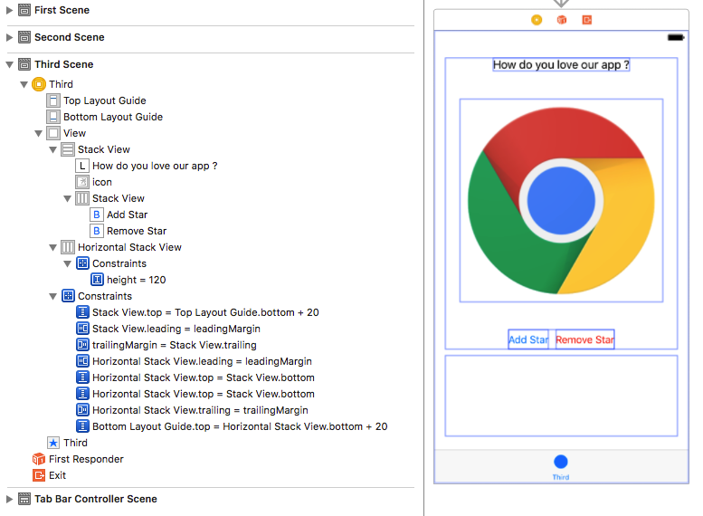

为刚添加的`UIButton`创建名为`removeStar`的IBAction点击事件，并实现移除方法。

```
- (IBAction)removeStar:(UIButton *)sender
{
    UIView *filledView = self.horizontalStackView.arrangedSubviews.lastObject;
    
    // 如果视图存在，移除视图
    if (filledView)
    {
        [filledView removeFromSuperview];   // 会自动从arrangedSubviews移除
        [UIView animateWithDuration:0.25 animations:^{
            [self.horizontalStackView layoutIfNeeded];
        }];
    }
}
```

运行app，现在可以添加、移除五角星，且视图会随着设备旋转自动调整布局。

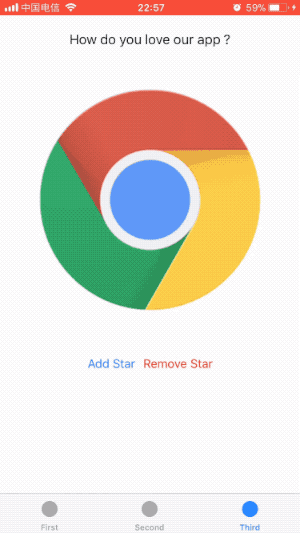

## 总结

通过这篇文章，可以看到`UIStackView`极大降低了用户界面开发难度，简化了许多工作，仅仅添加少量约束便可实现自动布局。在布局时，应该优先考虑使用*Stack View*来布局界面。

Demo名称：StackView   
源码地址：<https://github.com/pro648/BasicDemos-iOS>

参考资料：

1. [Stacks](https://github.com/kharrison/CodeExamples/tree/master/Stacks)
2. [iOS 9: Getting Started with UIStackView](https://code.tutsplus.com/tutorials/ios-9-getting-started-with-uistackview--cms-24193)
3. [What are the different UIStackView distribution types?](https://www.hackingwithswift.com/example-code/uikit/what-are-the-different-uistackview-distribution-types)


