> 这是关于自动布局的第一篇文章。    
> [>> Stack View的使用](https://github.com/pro648/tips/wiki/Auto%20Layout%E4%B8%ADStack%20View%E7%9A%84%E4%BD%BF%E7%94%A8)

自动布局(Auto Layout)能够根据对视图的约束(Constraint)，动态地计算视图层次结构中所有视图的大小和位置。

基于约束的Auto Layout使我们能够搭建动态响应内部、外部变化的用户界面。外部变化包括用户改变窗口大小（OS X）、旋转设备（iOS）、在iPad上进入或离开分割视图（iOS）、不同屏幕尺寸，内部变化包括app显示内容长度变化、字体大小变化、对国际化的支持等。

大部分的外部变化会在运行时发生，这就要求app要动态的调整视图布局。尽管屏幕尺寸不会改变，但创建一个自动布局的界面就可以适用于iPhone SE、iPhone 7 Plus、甚至iPad不同尺寸屏幕的设备。

当用户界面中视图或控件大小变化时会导致内部变化。如对国际化的支持，把用户界面上的文字改变为其他语言时，新的语言可能占用不同大小空间；不同的语言有不同布局方向，如英语、中文都是自左向右，而阿拉伯语自右向左，这时中、英文界面右下角的按钮在阿拉伯语中应在左下角。如app支持调整字体大小，调整后用户界面中任何文本的高度和宽度都会发生变化，此时需要调整布局。

## 1. Auto Layout与Frame-Based Layout比较

布局用户界面方式有三种，第一种是代码方式，第二种是使用Autoresizing masks，第三种是使用Auto Layout。

通过代码方式来布局用户界面时需要设定视图在其父视图坐标系中的位置和大小。

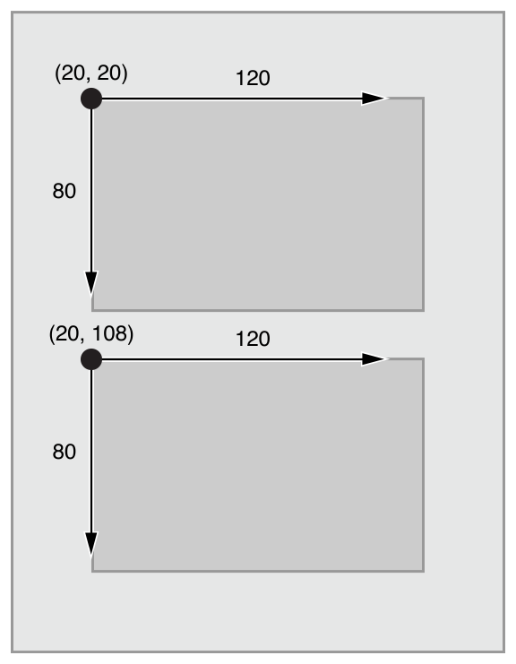

为布局界面，你必须计算视图层级中每一个视图的位置和大小。如果其中一个发生了改变，你就需要再次计算所有受影响的视图。在许多方面，以代码方式构建的界面会更灵活、更强大。当界面有变化时，你可以操作其它视图的变化。也正因为你需要控制其它视图的变化，构建一个简单的界面可能需要大量工作，构建一个自适应的界面就变的更加困难。

第二种方式是使用Autoresizing masks来构建界面，Autoresizing masks指定视图如何随父视图的变化而改变，这简化了适应外部变化布局的复杂度。Autoresizing masks用于较小数量的可能布局，对于复杂的用户界面，需要结合使用代码布局。另外，Autoresizing masks只适用于外部变化，不响应内部变化。

第三种方式为使用Auto Layout添加一系列约束来构建界面，这些约束代表两个视图间的关系，最后Auto Layout根据这些约束计算出视图的位置和大小。Auto Layout动态的响应内部、外部变化。

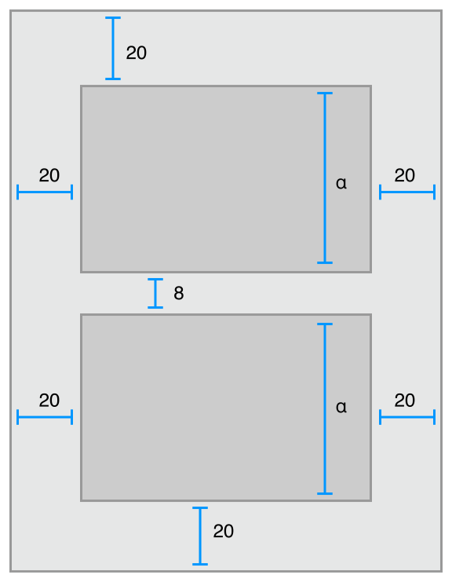

视图层次结构布局被定义为一系列线性方程。每个约束表示一个方程。目标是声明一系列方程，最后只有一个可能的布局方案。下图是一个示例方程。


这个约束表示*Red*视图的*Leading*必须在*Blue*视图*Trailing*后`8`points，该方程由以下几部分组成：

- **Item 1**：方程式中的第一项，这里指*Red*视图。第一项必须是视图或布局参考线（Layout Guide）。
- **Attribute 1**：在**Item 1**添加约束的位置。在这里是*Red*视图的*Leading*。
- **Relationship**：左右两侧的关系，可以是*equal*、*greater than or equal*和*less than or equal*之一。在这里左右两侧相等。
- **Multiplier**：第二项的值乘以该浮点值。在这里，乘数是`1.0`。
- **Item 2**：方程式中的第二项，在这里是*Blue*视图。与第一项不同，这一项可以为空。
- **Attribute 2**：在**Item 2**添加约束的位置。在这里是*Blue*视图的*Trailing*。如果**Item 2**为空，这里也要为空。
- **Constant**：浮点类型的常量。在这里是`8.0`，该值被添加到**Attribute 2**。

通过创建这样的方程可以创建多种约束，可以定义两个视图间的距离，对齐视图、定义两个视图大小关系、定义视图宽高比(Aspect Ratio)。

需要说明的是上面方程式中的`=`是相等，不是赋值。当Auto Layout布局界面时，会计算**Attribute 1**和**Attribute 2**的值直到等式成立，而不会直接把右侧的值赋值给左侧。因此我们可以互换等式左右两侧的值，但遵守下面规则的约束更易于维护。不符合下面规则的约束可以通过互换等式两侧解决。

- **Multiplier**优先使用整数而非分数。
- 常量优先使用正数而非负数。
- 如果可能，视图更应该自上而下，自左向右布局。

约束既可以用来描述界面中两个视图间的关系，也可以定义一个视图中不同属性间的关系。例如设置视图高度和宽度的高宽比。

在自动布局中，可供约束的属性有左右上下四边（leading,trailing,top和bottom)、宽、高、水平居中和垂直居中等。

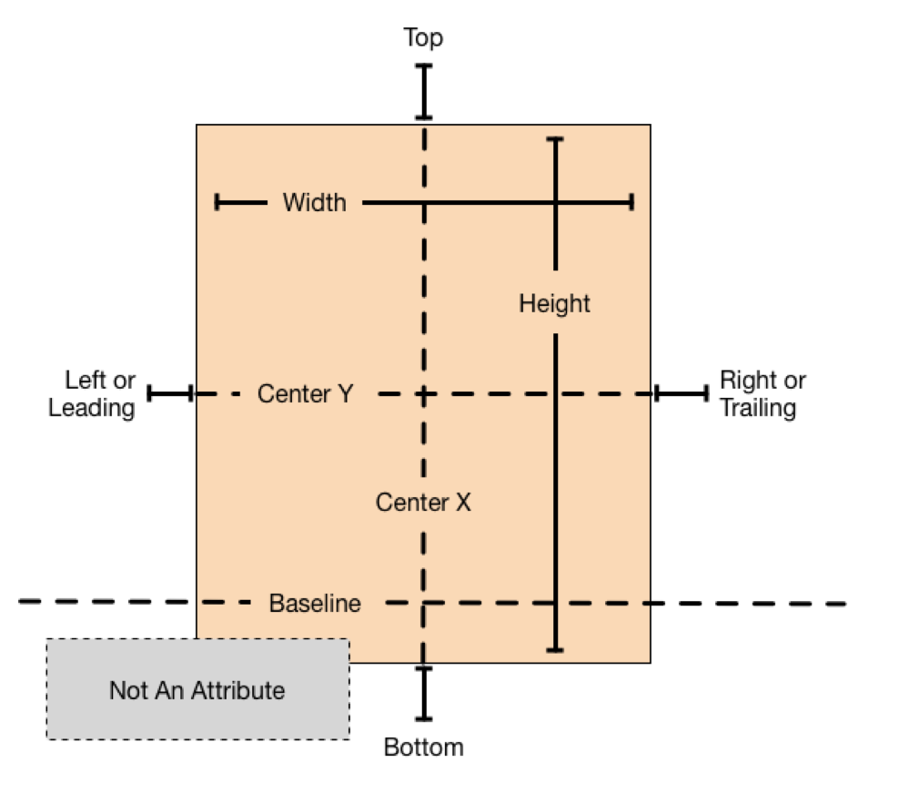


## 2. 创建demo

这里创建一个*Single View Application*模板的应用，*Product Name*为`AutoLayout`，*Language*为*Objective-C*，*Devices*为*Universal*，选择文件位置，创建工程。

下面通过几个示例来体验Auto Layout。

## 3. 示例1

打开*Main.storyboard*，添加5个`UILabel`。如下图所示，一个在中心，其余每个角各一个。拖放`UILabel`时会出现蓝色虚线，放在这些蓝色虚线位置。

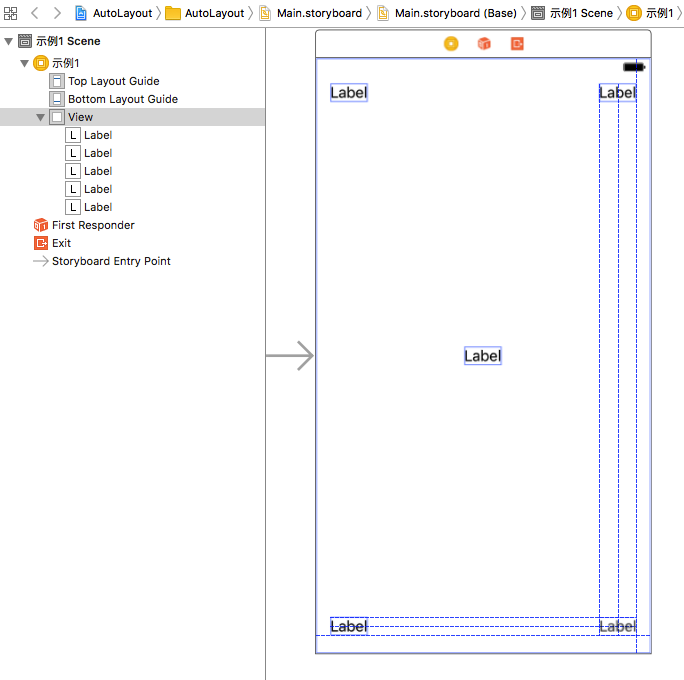

点击Xcode右上角的*Assistant editor*，这时一般显示的是你所选中视图控制器的代码，点击左上角的*Automatic*，从弹出菜单中选择*Preview > Main.storyboard(Preview)*。

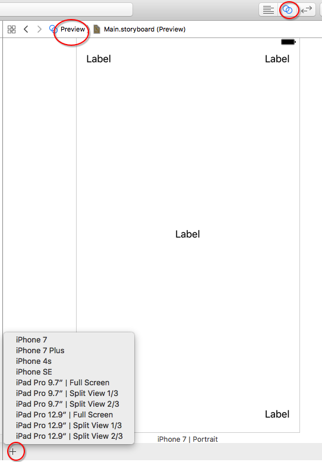

可以通过点击上图左下角的`+`按钮添加多个设备的预览，这里只添加iPhone SE。

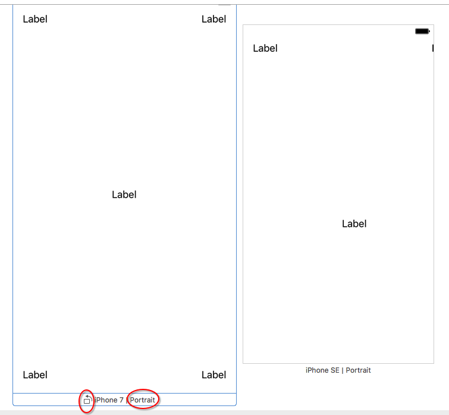

通过上图可以看到，在4英寸的iPhone SE中，只有左上角一个`Label`显示正常。这是因为如果视图没有任何约束，在*Build Time*系统会自动为视图添加至左上角、目前大小的约束。当你添加第一个约束时，系统会自动清除所有系统添加的约束，此时系统会出现红色警告提示约束不足。当你添加了一个约束时，你就需要添加可满足布局的所有约束。

还记得之前我们说到的蓝色虚线吗？它们不是这里说到的约束，它们是Xcode提供的布局参考线。

在*Interface Builder*里有三种添加约束的方式。第一种是在视图间`control`+鼠标左键拖拽，也可以在*Document Outline*拖拽，在视图间拖拽的好处是弹出菜单会根据拖拽方向改变。第二种是使用*Align*和*Add New Constraints*工具，第三种是让*Interface Builder*设置约束之后我们修改约束。自动布局菜单共以下五项:

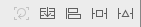

自左向右依次为：

- **Update Frame**：用于在约束更新后，更新*frame*。
- **Embed in Stack**：用于嵌入*Stack View*，会根据目前选中视图自动嵌入*Horizontal Stack View*或*Vertical Stack View*。
- **Align**：用于设置视图水平中心、垂直中心、基线等。
- **Add New Constraints**：用于设置视图与最近视图、或控制器*Margin*距离，视图宽、高、宽高比等。
- **Resolve Auto Layout issues**：添加建议约束、删除约束，其中上半部分对选中视图有效，下半部分对所有视图有效。

选中左上角`Label`，点击*Add New Constraints*，在弹出的菜单顶部一栏左侧和上部分别填写`0`和`20`，点击底部*Add 2 Constraints*添加约束。

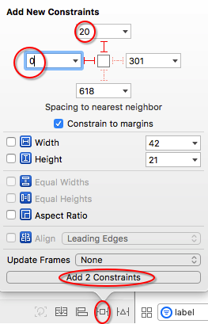

用同样方式为另外三个角落处的`Label`添加约束，约束均是到距离自己最近的边缘，其中*Leading*和*Trailing*为`0`，*Top*和*Bottom*为`20`。

>  应尽量使用`Leading`和`Trailing`，避免使用`Left`和`Right`，这样布局会适应视图的阅读方向。阅读方向随用户设定的当前语言而变，你也可以自己设定。

最后选中视图中心的`Label`，点击*Align*，勾选弹出窗口中*Horizontally in Container*和*Vertically in Container*选项框，后面数字均为`0`，点击*Add 2 Constraints*添加约束。

现在进入*Preview*查看，一切正常。可以点击红色标记处的旋转按钮，查看*横屏(Landscape)*状态下`Label`位置、大小。

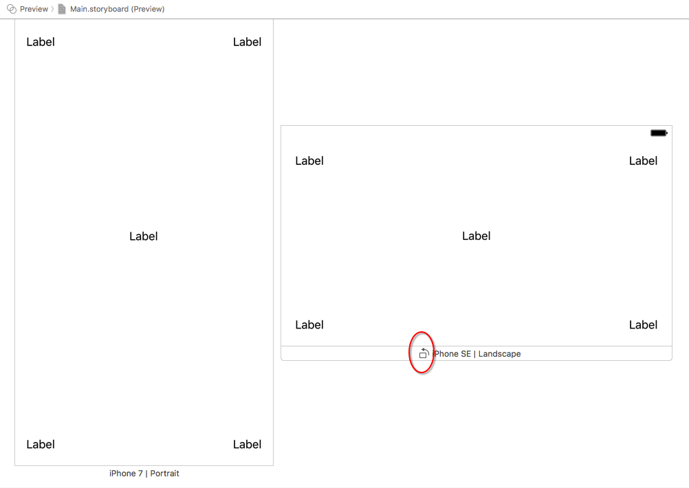

## 4. 示例2

继续在刚才的demo中进行操作，打开*Main.storyboard*，从对象库拖拽出一个*View Controller*，在上面添加两个`UIView`，左右各一个，左侧颜色为*Blue*，右侧颜色为*Orange*。

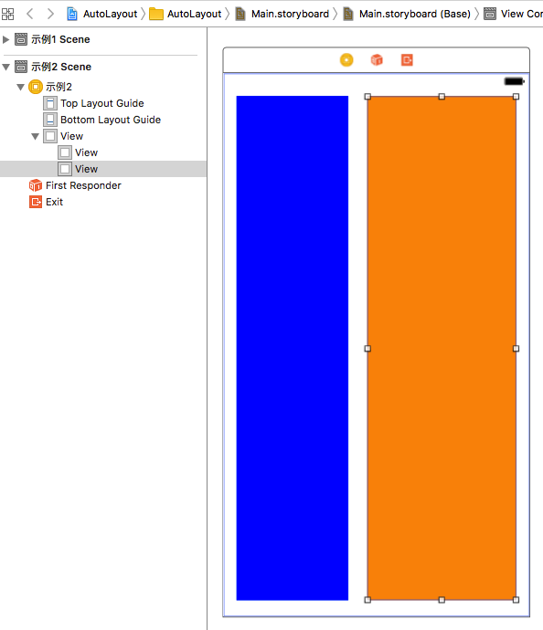

两个视图布局约束是：*Blue*视图与*Top*和*Bottom*距离是`20`，与*Leading*距离`0`，与*Orange*视图距离是*standard*。*Orange*视图与*Top*和*Bottom*距离是`20`，与*Trailing*距离`0`。同时*Orange*视图宽度是*Blue*视图宽度的二倍。

因为这里设置*Leading*、*Trailing*、*Top*和*Bottom*约束与前面相同，不再叙述。如果遇到问题，可以在[我的Github](https://github.com/pro648/BasicDemos-iOS/tree/master/AutoLayout)中查看。另外，文章底部也会提供demo地址。

下面添加两个视图间间距的约束。选中*Blue*视图，点击*Add New Constraints*按钮，在弹出窗顶部点击*Trailing*文本框内的下三角，选择*Use Standard Value*，最后点击*Add 1 Constraint*。另外，*Standard Value*默认为`8`。

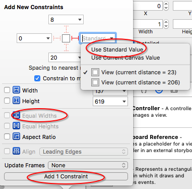

现在添加两个视图宽度的约束。同时选中两个视图，点击*Add New Constraints*按钮，在弹出窗中勾选上图中的*Equal Widths*选项。最后点击*Add 1 Constraint*。如果视图出现黄色警告线，表示当前位置与视图约束位置不同，点击*Update Frames*更新视图位置。

现在添加*Orange*视图宽度为*Blue*视图宽度二倍的约束。选中任意一个视图，点击底部`=`约束线，右侧会自动打开*Attribute Inspector*，鼠标放在*First Item*会看到选中的是*Orange*视图，所以这里的等式为

```
Orange View.Width = 2.0 x Blue View.Width
```

所以，修改*Multiplier*为`2`。

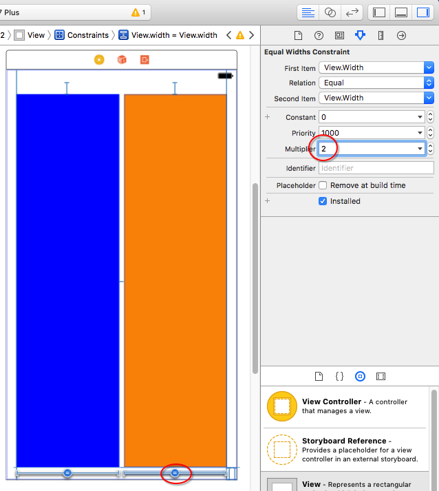

在*Preview*查看如下，在模拟器查看效果一样。

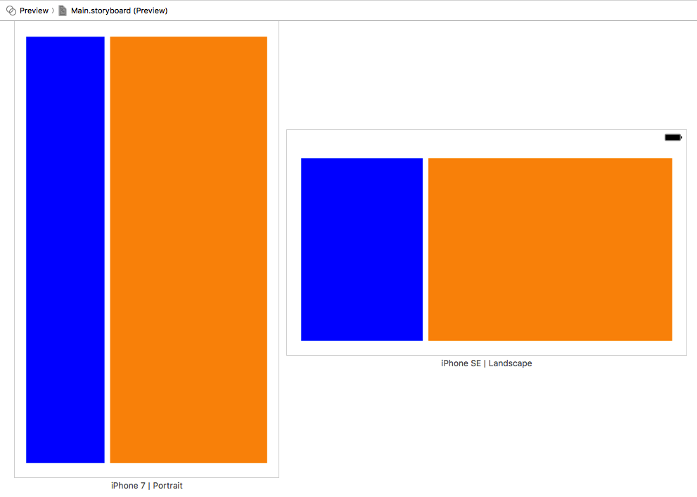

在*Add New Constraints*一项中顶部有*Constrain to margins*选项框。如果勾选上，约束添加到父视图的*margin*属性；如果取消勾选，约束添加到父视图的*edge*属性。如果在一个控制器上添加一个`UIView`，设置背景色为*Red*，到四边的约束均为`0`，下面第一个图为勾选*Constrain to margins*，第二个为不勾选。想要了解详细区别，点击[这里](https://stackoverflow.com/questions/25807545/what-is-constrain-to-margin-in-storyboard-in-xcode-6)。

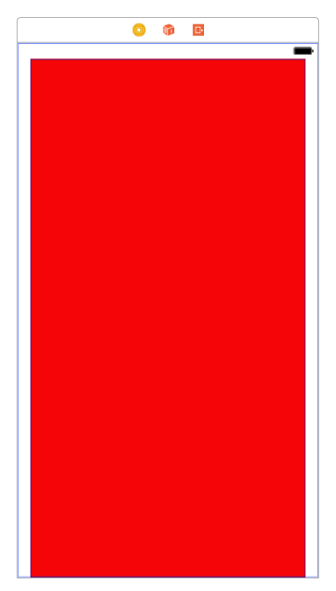
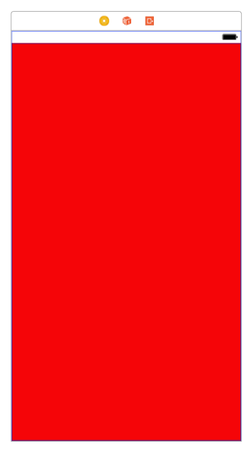

## 5. 示例3

继续对示例2中的视图进行操作，这次限定*Blue*视图宽度大于或等于`150`。只有当屏幕足够宽时*Orange*视图宽度为*Blue*视图宽度二倍才实现，也就是可选实现。

选中*Blue*视图，点击*Add New Constraints*添加宽度为`150`的约束。保持*Blue*视图选中状态，打开*Size Inspector*，双击*Constraints*一栏中宽度为`150`的约束。也可以单击*Edit*按钮。

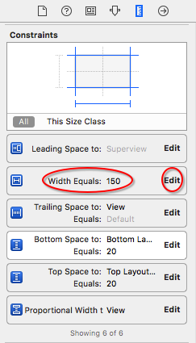

双击后弹出如下：

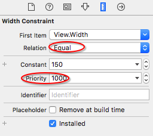

把上图中的*Equal*修改为*Greater than or Equal*，这样宽度就会大于等于`150`。

上图中的*Priority*为约束优先级。所有约束默认必须实现(Required)，也可以创建可选实现(Optional)的约束。

所有约束有一个优先级属性，它的值在`1`和`1000`间。优先级为`1000`的约束必须实现，其它优先级的约束为可选实现。当自动布局计算布局方式时，会优先满足高优先级的约束。如果不能满足低优先级的约束，该约束会被跳过，但被跳过的约束不是完全无效，Auto Layout计算布局方案时会选择最接近被跳过约束的方案。

虽然优先级的值是`1`到`1000`，但系统把优先级划分成了低(250)、中(500)、高(750)和必需(1000)四类，你只需要把约束优先级设定为高于或低于这些值一到两个点即可。

现在*storyboard*出现红色警告，提示*Blue*视图宽度大于等于`150`与*Orange*视图宽度为*Blue*视图宽度二倍冲突，把后者优先级设定为`750`。*Preview*显示如下：

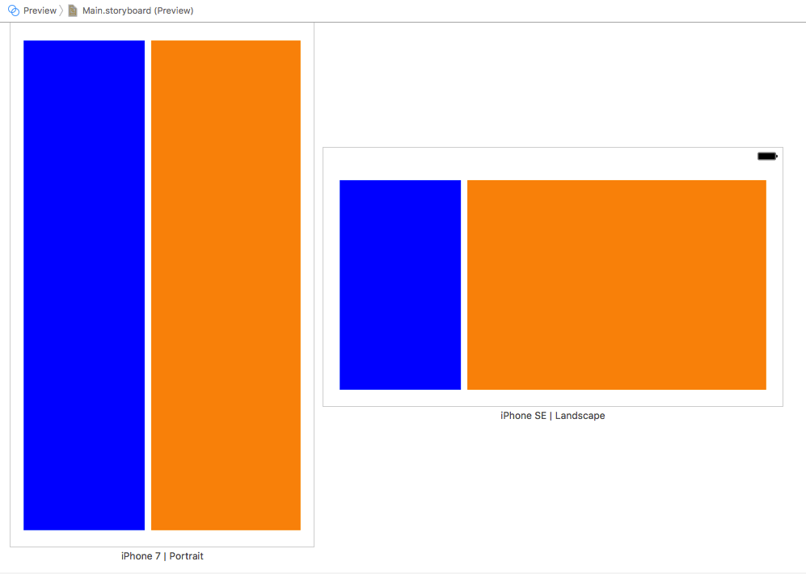

可以看到，在iPhone的*竖屏(Portrait)*中两个视图宽度几乎一样宽，在*横屏(Landscape)*中，*Orange*视图宽度是*Blue*视图宽度二倍。即优先满足了*Blue*视图宽度大于等于`150`这一约束。

## 6. 示例4

目前为止，所有示例均用约束指定视图的位置和大小，但有些视图的大小根据内容变化，这称为固有内容大小(Intrinsic Content Size)。例如，`UIButton`的*intrinsic content size*是标题大小外加很小margin。

不是所有的视图都有*intrinsic content size*。如：`UIView`和`NSView`不具有固有内容大小，`UILabel`、`UIButton`、`UISwitch`和`UITextField`高和宽都具有固有内容大小，`UIImageView`没有添加图片时不具有*intrinsic content size*，添加图片后固有内容大小与图片大小一致。

Auto Layout在每个维度使用一对约束来表示视图的*intrinsic content size*。内容拥抱(Content hugging)将视图向内拉，使其紧贴内容。内容压缩阻力(Content Compression Resistance)将视图向外推，使其内容能够完整显示、不被压缩。

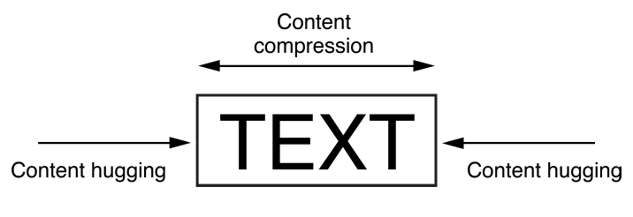

固有内容大小的约束有自身的优先级。一般，*content hugging*优先级为`250`，*content compression resistance*优先级`750`。因此，一般拉伸视图比压缩视图容易。例如：你可以把*button*拉伸一些，不影响使用。但如果压缩一些，内容可能无法完整显示。

继续在刚才的demo里操作，从对象库拖拽出一个*View Controller*，在顶部添加一个`UILabel`和一个`UITextField`。

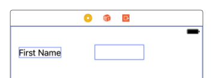

添加约束，让*Label*与*Leading*距离为`0`，与*Text Field*的*Leading*距离为*Standard*值，与*Text Field*基线在同一水平位置；让*Text Field*与*Top*距离`20`，与*Trailing*距离为`0`。两个视图宽和高均为固有内容大小。

这里添加约束与前面示例相同，不再叙述添加过程。只说一下添加基线约束。选中两个视图，点击*Align*，勾选*Baselines*，点击添加*Add 1 Constraint*。

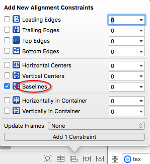

`UILabel`和`UITextField`在一起时，一般`UILabel`保持自身宽度，拉伸`UITextField`，以此填充可用空间。所以，应当设置`UILabel`的*content hugging*优先级为`251`，`UITextField`的为`250`。

在*Size Inspector*检查*content hugging*，你会发现*Interface Builder*已经设置好了优先级。另外，如果你是用代码添加自动布局，需要手动设定这里的优先级。

点击*Update Frames*更新*frame*。在*Preview*查看布局。

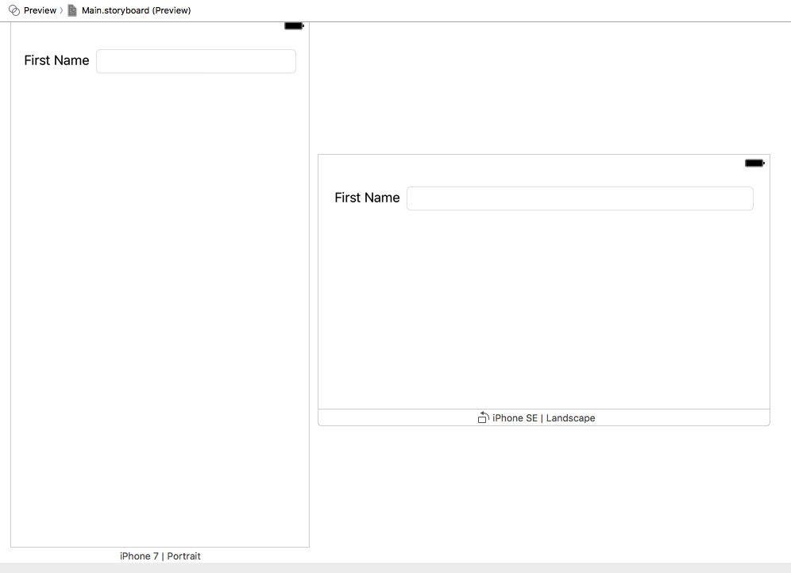

> 只有当高为固有内容大小时基线才可以正确对齐。如果高被压缩或拉伸，基线将不能正确对齐。

一般在处理`示例4`中的约束时应该使用*Stack View*。*Stack View*提供了一种轻松的方式利用自动布局的功能，而不会引入复杂的约束，在下一篇文章我们将详细介绍[*Stack View*的使用](https://github.com/pro648/tips/wiki/Auto-Layout%E4%B8%ADStack-View%E7%9A%84%E4%BD%BF%E7%94%A8)。

Demo名称：AutoLayout  
源码地址：<https://github.com/pro648/BasicDemos-iOS>

参考资料：

1. [Auto Layout Guide](https://developer.apple.com/library/content/documentation/UserExperience/Conceptual/AutolayoutPG/index.html#//apple_ref/doc/uid/TP40010853-CH7-SW1)
2. [What is “Constrain to margin” in Storyboard in Xcode 6](https://stackoverflow.com/questions/25807545/what-is-constrain-to-margin-in-storyboard-in-xcode-6)

