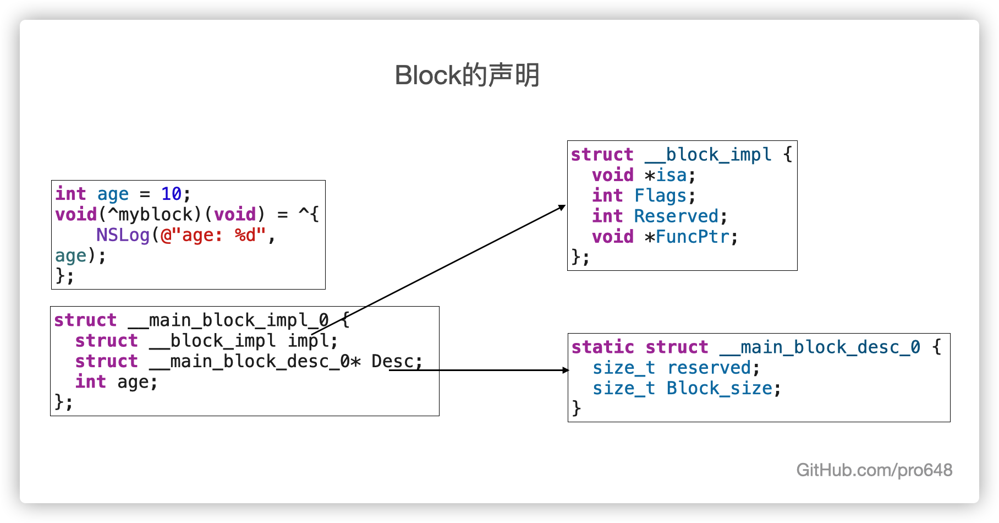
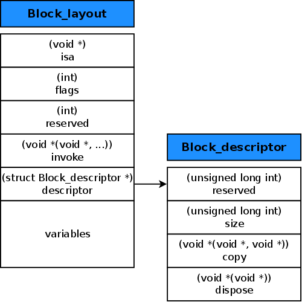
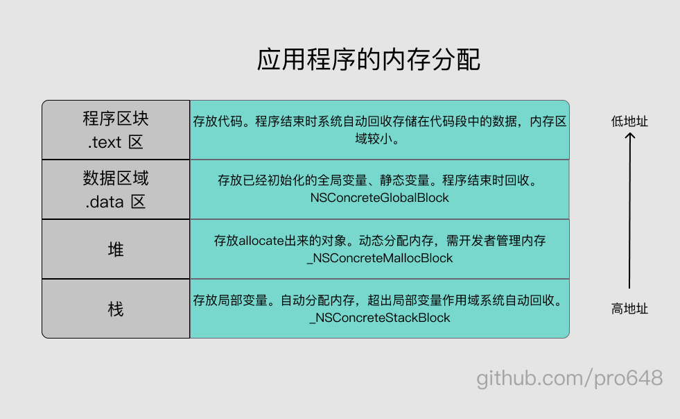
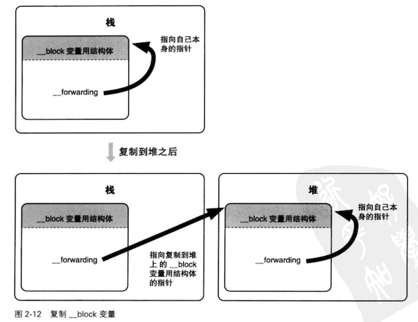

当需要执行异步操作，或同步多个操作时，块（Block）会非常有用。这一篇文章将介绍 Block 的本质。如果你对 block 还不了解，推荐先查看[Block的用法](https://github.com/pro648/tips/blob/master/sources/Block%E7%9A%84%E7%94%A8%E6%B3%95.md)。

## 1. Block的本质

Block 是封装了函数调用及函数调用环境的 Objective-C 对象，内部也有一个 isa 指针。即 Block 本质上也是一个 Objective-C 对象。

下面写一个简单的 block：

```
        int age = 10;
        void(^myblock)(void) = ^{
            NSLog(@"age: %d", age);
        };
        myblock();
```

使用 clang 命令将上述代码转化为 C++，方便查看 block 内部结构：

```
xcrun -sdk iphoneos clang -arch arm64 -rewrite-objc main.m
```

转化后如下：

```
        int age = 10;
        // 定义block变量
        void(*myblock)(void) = ((void (*)())&__main_block_impl_0((void *)__main_block_func_0, &__main_block_desc_0_DATA, age));
        // 调用block
        ((void (*)(__block_impl *))((__block_impl *)myblock)->FuncPtr)((__block_impl *)myblock);
```

#### 1.1 声明 block



###### 1.1.1 __main_block_impl_0

通过转化的 C++ 代码可以看到，block定义中调用了`__main_block_impl_0`函数，并将其地址赋值给`myblock`。进一步查看`__main_block_impl_0`函数：

```
struct __main_block_impl_0 {
  struct __block_impl impl;
  struct __main_block_desc_0* Desc;
  int age;
  
  // 该构造函数最终返回__main_block_impl_0。会将传入的_age赋值给成员age。
  __main_block_impl_0(void *fp, struct __main_block_desc_0 *desc, int _age, int flags=0) : age(_age) {
    impl.isa = &_NSConcreteStackBlock;
    impl.Flags = flags;
    impl.FuncPtr = fp;
    Desc = desc;
  }
};
```

`__main_block_impl_0`结构体内的构造函数对变量进行赋值，最终返回`__main_block_impl_0`结构体，也就是最终返回给`myblock`变量的是`__main_block_impl_0`结构体。

###### 1.1.2 __main_block_func_0

`__main_block_impl_0`函数的第一个参数是`__main_block_func_0`，其定义如下：

```
static void __main_block_func_0(struct __main_block_impl_0 *__cself) {
    int age = __cself->age; // bound by copy
    
    NSLog((NSString *)&__NSConstantStringImpl__var_folders_05_pj1lwvjs50j3gx6vjtvxcvf80000gn_T_main_63c9df_mi_0, age);
}
```

`__main_block_func_0`函数内存储着 block 内代码。其函数内部先取出局部变量 age，后面调用`NSLog`。

也就是将 block 内的代码封装到`__main_block_func_0`函数，将`__main_block_func_0`函数地址传递给`__main_block_impl_0`。

###### 1.1.3 __main_block_desc_0

`__main_block_impl_0`函数的第二个参数是`__main_block_desc_0`，其定义如下：

```
static struct __main_block_desc_0 {
  size_t reserved;
  size_t Block_size;
} __main_block_desc_0_DATA = { 0, sizeof(struct __main_block_impl_0)};
```

`__main_block_desc_0`中存储着两个成员，`reserved`和`Block_size`。并且为`reserved`赋值0，为`Block_size`赋值`sizeof(struct __main_block_impl_0)`，即block的大小。

最终，将`__main_block_desc_0`结构体传给`__main_block_impl_0`中，赋值给desc。

###### 1.1.4 age

`__main_block_impl_0`函数的第三个参数是`age`，即定义的局部变量。

如果在 block 中使用了局部变量，block 声明的时候会将 age 作为参数传入，即 block 会捕获（capture）age。如果 block 中没有使用 age，则只会给`__main_block_impl_0`函数传入`__main_block_func_0`和`__main_block_desc_0_DATA`参数。

由于 block 在声明时捕获了局部变量，在声明后、调用前修改局部变量值，不会影响 block 内捕获到的局部变量值。如下所示：

```
        int age = 10;
        void(^myblock)(void) = ^{
            NSLog(@"age: %d", age);
        };
        age = 11;
        myblock();
```

执行后，控制台打印如下：

```
age: 10
```

block 在定义之后已将局部变量age值存储在`__main_block_impl_0`结构体，调用时直接从结构体中取出。声明后修改局部变量的值不会影响`__main_block_impl_0`结构体捕获的值。

###### 1.1.5 __block_impl

`__main_block_impl_0`结构体第一个成员是`__block_impl`结构体，`__block_impl`结构体如下：

```
struct __block_impl {
  void *isa;
  int Flags;
  int Reserved;
  void *FuncPtr;
};
```

`isa`指针指向类对象，`FuncPtr`指针存储着`__main_block_func_0`函数地址，即 block 内代码地址。

`__block_impl`结构体第一个成员就是 isa 指针。Objective-C对象本质上也是结构体，第一个成员也是 isa 指针。因此，block 本质上也是一个 OC 对象。`__main_block_impl_0`函数的构造函数将传入 block 的值存储到`__main_block_impl_0`结构体中，最终将`__main_block_impl_0`结构体地址赋值给myblock。

分析`__main_block_impl_0`构造函数，特点如下：

- `__main_block_func_0`封装了函数地址，其中先取出局部变量，再调用 block 内代码。
- `__main_block_desc_0_DATA`封装 block 大小。
- `age`是 block 捕获的局部变量。
- `__main_block_impl_0`结构体中的`__block_impl`结构体包含了isa指针、FuncPtr。

#### 1.2 调用 block

```
        // 调用block
        ((void (*)(__block_impl *))((__block_impl *)myblock)->FuncPtr)((__block_impl *)myblock);
```

将上述代码中的强制转换移除后，变为下面的代码：

```
        (myblock->FuncPtr)(myblock);
```

调用myblock就是通过myblock找到`FuncPtr`指针，然后进行调用。

myblock是指向`__main_block_impl_0`结构体的指针，内部并没有`FuncPtr`指针，为什么这里可以直接访问？这是因为`__main_block_impl_0`结构体第一个成员是`__block_impl`，而`__block_impl`也是一个结构体，即`__main_block_impl_0`可以改为以下内容：

```
struct __main_block_impl_0 {
  // 使用__block_impl直接替换
  void *isa;
  int Flags;
  int Reserved;
  void *FuncPtr;
  
  struct __main_block_desc_0* Desc;
  int age;
  __main_block_impl_0(void *fp, struct __main_block_desc_0 *desc, int _age, int flags=0) : age(_age) {
    impl.isa = &_NSConcreteStackBlock;
    impl.Flags = flags;
    impl.FuncPtr = fp;
    Desc = desc;
  }
};
```

另一方面，`__main_block_impl_0`结构体第一个成员是`__block_impl`，`__main_block_impl_0`结构体地址就是`__block_impl`的地址，这样也可以查找到`FuncPtr`指针。

block 底层的数据结构也可以使用下面图片表示：



## 2. 变量捕获

除了包含可执行代码，块还具有捕获块以外值的能力。如果在一个方法内声明了一个块，该块可以获取方法内任何变量，也就是可以捕获局部变量。


#### 2.1 局部变量

###### 2.1.1 auto变量

局部变量默认是 automatic variable 类型，简写为`auto`，一般省略不写。当程序进入、离开局部变量作用域时，会自动分配、释放内存。

`auto`会自动捕获到 block 内，`__main_block_impl_0`结构体内增加了存储局部变量的成员。block 内访问`auto`变量的方式是值传递，即直接将`auto`变量传递给`__main_block_impl_0`函数。

###### 2.1.2 static变量

`static`变量会一直存储在内存中。block 会捕获`static`修饰的局部变量，访问时使用指针访问。

下面分别添加使用`auto`、`static`修饰的局部变量：

```
        auto int age = 10;
        static int weight = 125;
        void(^myblock)(void) = ^{
            NSLog(@"age: %d, weight: %d", age, weight);
        };
        myblock();
```

生成C++后如下：

```
struct __main_block_impl_0 {
  struct __block_impl impl;
  struct __main_block_desc_0* Desc;
  // 捕获了age、weight。
  int age;
  int *weight;
  __main_block_impl_0(void *fp, struct __main_block_desc_0 *desc, int _age, int *_weight, int flags=0) : age(_age), weight(_weight) {
    impl.isa = &_NSConcreteStackBlock;
    impl.Flags = flags;
    impl.FuncPtr = fp;
    Desc = desc;
  }
};
static void __main_block_func_0(struct __main_block_impl_0 *__cself) {
  int age = __cself->age; // bound by copy
  int *weight = __cself->weight; // bound by copy

            NSLog((NSString *)&__NSConstantStringImpl__var_folders_05_pj1lwvjs50j3gx6vjtvxcvf80000gn_T_main_e2f202_mi_0, age, (*weight));
        }

static struct __main_block_desc_0 {
  size_t reserved;
  size_t Block_size;
} __main_block_desc_0_DATA = { 0, sizeof(struct __main_block_impl_0)};
int main(int argc, const char * argv[]) {
    /* @autoreleasepool */ { __AtAutoreleasePool __autoreleasepool; 

        auto int age = 10;
        static int weight = 125;
        // age直接传递值，weight传递指针。
        void(*myblock)(void) = ((void (*)())&__main_block_impl_0((void *)__main_block_func_0, &__main_block_desc_0_DATA, age, &weight));

        ((void (*)(__block_impl *))((__block_impl *)myblock)->FuncPtr)((__block_impl *)myblock);
    }
    return 0;
}
```

可以看到，`__main_block_impl_0`捕获了age、weight，并且给`__main_block_impl_0`函数传递age时直接传递值，传递weight时传递的是指针。

#### 2.2 全局变量

block 是否会捕获全局变量？以及如何使用？

添加以下全局变量：

```
int height = 170;
static int number = 11;
```

生成C++代码如下：

```
struct __main_block_impl_0 {
  struct __block_impl impl;
  struct __main_block_desc_0* Desc;
  int age;
  int *weight;
  // 并没有捕获全局变量
  __main_block_impl_0(void *fp, struct __main_block_desc_0 *desc, int _age, int *_weight, int flags=0) : age(_age), weight(_weight) {
    impl.isa = &_NSConcreteStackBlock;
    impl.Flags = flags;
    impl.FuncPtr = fp;
    Desc = desc;
  }
};
static void __main_block_func_0(struct __main_block_impl_0 *__cself) {
  int age = __cself->age; // bound by copy
  int *weight = __cself->weight; // bound by copy

            // 直接使用height、number
            NSLog((NSString *)&__NSConstantStringImpl__var_folders_05_pj1lwvjs50j3gx6vjtvxcvf80000gn_T_main_964e22_mi_0, age, (*weight), height, number);
        }

static struct __main_block_desc_0 {
  size_t reserved;
  size_t Block_size;
} __main_block_desc_0_DATA = { 0, sizeof(struct __main_block_impl_0)};
int main(int argc, const char * argv[]) {
    /* @autoreleasepool */ { __AtAutoreleasePool __autoreleasepool; 

        auto int age = 10;
        static int weight = 125;
        void(*myblock)(void) = ((void (*)())&__main_block_impl_0((void *)__main_block_func_0, &__main_block_desc_0_DATA, age, &weight));

        ((void (*)(__block_impl *))((__block_impl *)myblock)->FuncPtr)((__block_impl *)myblock);
    }
    return 0;
}
```

可以看到`__main_block_func_0`并没有添加任何全局变量，而是直接使用。这是因为全局变量会一直存放在内存中，全局都可以使用。

## 3. Block 的类型

既然 block 也是 OC 对象，那么 block 是什么类型呢？

声明一个 block，并打印其父类，如下所示：

```
        void(^myblock)(void) = ^{
            NSLog(@"github.com/pro648");
        };
        NSLog(@"%@", [myblock class]);
        NSLog(@"%@", [[myblock class] superclass]);
        NSLog(@"%@", [[[myblock class] superclass] superclass]);
        NSLog(@"%@", [[[[myblock class] superclass] superclass] superclass]);
```

输出如下：

```
__NSGlobalBlock__
NSBlock
NSObject
(null)
```

即 block 的继承关系是：`__NSGlobalBlock__` ： `NSBlock` ： `NSObject`。进一步证实了 block 本质上也是一个 OC 对象。

定义三个不同的 block，分别打印其类型：

```
        // 没有调用外部变量的block
        void(^myblock1)(void) = ^{
            NSLog(@"github.com/pro648");
        };
        
        // 访问auto变量
        int age = 10;
        void(^myblock2)(void) = ^{
            NSLog(@"age: %d", age);
        };
        
        // 直接调用block的 class
        NSLog(@"%@ %@ %@", [myblock1 class], [myblock2 class], [^{
            NSLog(@"%d", age);
        } class]);
```

打印如下：

```
__NSGlobalBlock__ __NSMallocBlock__ __NSStackBlock__
```

将上述代码转换为C++，可以看到三个 block 类型都是`_NSConcreteStackBlock`类型。这可能是 runtime 运行时进行了某种转换，使用 clang 生成的C++代码仅供参考，不能保证和运行时完全一致。

三种类型的block在内存中的位置如下：



`__NSGlobalBlock__`、`__NSStackBlock__`、`__NSMallocBlock__`三种类型的block是按照以下规则产生的：

| block 类型          | 环境                             |
| ------------------- | -------------------------------- |
| `__NSGlobalBlock__` | 没有访问auto变量                 |
| `__NSStackBlock__`  | 访问了auto变量                   |
| `__NSMallocBlock__` | `__NSStackBlock__`调用了copy方法 |

#### 3.1 `__NSGlobalBlock__`

当 block 内没有访问`auto`变量时，block 为`__NSGlobalBlock__`类型，`__NSGlobalBlock__`存在数据段中，程序结束才会回收内存。但因为其与普通函数没有区别，很少使用`__NSGlobalBlock__`类型的 block。

#### 3.2 `__NSStackBlock__`

在 block 内访问了`auto`变量为`__NSStackBlock__`类型。

`__NSStackBlock__`类型的 block 存放在栈中。栈的内存由系统自动分配和释放，超出变量作用域后自动释放。由于栈中代码超出作用域之后，内存就会被销毁，而有可能内存销毁之后才去调用它，此时就会出现问题。

ARC 自动管理内存时会帮助我们做很多事情，为了方便理解其本质，先关闭 ARC 使用 MRC 管理内存。进入TARGETS > Build Settings > Objective-C Automatic Reference Counting，修改其值为 NO。

关闭 ARC 后，使用以下代码验证问题：

```
void (^myblock)(void);

void test() {
    // __NSStackBlock__
    int age = 10;
    myblock = ^{
        NSLog(@"age: %d", age);
    };
}

int main(int argc, const char * argv[]) {
    @autoreleasepool {
        test();
        myblock();
    }
    return 0;
}
```

执行后控制台输出如下：

```
age: -272632840
```

这是因为myblock是在栈中的，即`__NSStackBlock__`类型的。当`test`函数执行完毕后，栈内存中 block 已经被系统回收。

#### 3.3 `__NSMallocBlock__`

为了避免函数执行完毕栈内存立即被回收，可以将`__NSStackBlock__`block copy 到堆中。以下是修改后的代码：

```
void (^myblock)(void);

void test() {
    // __NSMallocBlock__
    int age = 10;
    // 将 block 从栈中复制到堆中。
    myblock = [^{
        NSLog(@"age: %d", age);
    } copy];
}

int main(int argc, const char * argv[]) {
    @autoreleasepool {
        test();
        myblock();
    }
    return 0;
}
```

执行后控制台输出如下：

```
age: 10
```

block 调用 copy 后，类型改变如下所示：

| block类型           | 内存区域 | 调用copy的效果                            |
| ------------------- | -------- | ----------------------------------------- |
| `__NSGlobalBlock__` | 数据段   | 什么都不做，类型不变。                    |
| `__NSStackBlock__`  | 栈       | 从栈复制到堆，类型变为`__NSMallocBlock__` |
| `__NSMallocBlock__` | 堆       | 引用计数加一，类型不变。                  |

使用 MRC 管理内存时，经常需要使用 copy 保存 block，将栈上的 block 复制到堆上，超出作用域时 block 不会被释放，后续需调用 release 销毁 block。ARC 环境下，系统会自动调用 copy 操作，使 block 不被销毁；不再使用时，自动调用 release 引用计数减一。

## 4. ARC 在某些情况下会对 block 自动进行一次 copy 操作，将其从栈区移动到堆区

出现以下情况时，ARC 会自动对 block 执行一次 copy 操作，将其从栈区移动到堆区：

1. 当 block 作为函数返回值时。
2. 当 block 被强指针引用时。
3. 当 Cocoa API 方法名包含usingBlock，且 block 作为参数时，或 block 作为 GCD API 方法参数。

#### 4.1 当 block 作为函数返回值时

```
typedef void (^MyBlock)(void);

MyBlock test() {
    int age = 10;
    // myblock 作为函数返回值，ARC 会自动进行copy。
    MyBlock myblock = ^{
        NSLog(@"age: %d", age);
    };
    return myblock;
}

int main(int argc, const char * argv[]) {
    @autoreleasepool {
        MyBlock myblock = test();
        NSLog(@"%@", [myblock class]);
    }
    return 0;
}
```

在 ARC 环境下，参数返回值为 block 类型时，系统会对 ARC 自动执行一次 copy 操作，使其变为`__NSMallocBlock__`类型。在 MRC 环境下，超出作用域后 block 会被销毁，此时再调用会引起闪退。

#### 4.2 当 block 被强指针引用时

```
int main(int argc, const char * argv[]) {
    @autoreleasepool {
        int age = 10;
        MyBlock myblock = ^{
            NSLog(@"age: %d", age);
        };
        NSLog(@"%@",[myblock class]);
    }
    return 0;
}
```

由于 block 访问了`auto`变量，其是`__NSStackBlock__`类型。在 MRC 环境中，不会自动进行 copy 操作，输出是`__NSStackBlock__`；在 ARC 环境中，有强指针引用时会自动执行 copy 操作，将 block 从栈中移动到堆中。

修改上述代码如下，即取消强指针对 block 的引用：

```
        int age = 10;
        // 取消强指针的引用
        NSLog(@"%@",[^{
            NSLog(@"age: %d", age);
        } class]);
```

可以看到输出为：

```
__NSStackBlock__
```

手动调用 copy，如下所示：

```
        int age = 10;
        NSLog(@"%@", [[^{
            NSLog(@"age: %d", age);
        } copy] class]);
```

输出为：

```
__NSMallocBlock__
```

这也进一步证明了 ARC 环境下，有强指针引用 block 时会自动调用 copy 方法。

#### 4.3 当 Cocoa API 方法名包含usingBlock，且 block 作为参数时，或 block 作为 GCD API 的方法参数

当 Cocoa API 方法名包含usingBlock，且 block 作为参数时，或 block 作为 GCD API 的方法参数。ARC 会根据情况自动将栈上的 block copy到堆上。

```
        // Cocoa API
        NSArray *arr = @[@1];
        [arr enumerateObjectsUsingBlock:^(id  _Nonnull obj, NSUInteger idx, BOOL * _Nonnull stop) {
            // 这个 block 在堆上
        }];

        // GCD API
        dispatch_after(dispatch_time(DISPATCH_TIME_NOW, (int64_t)(1.0 * NSEC_PER_SEC)), dispatch_get_main_queue(), ^{
            // 这个 block 在堆上
        });
```

block 作为属性时与其它属性类似，但 MRC 环境下，只能使用`copy`修饰。因为，block 访问`auto`变量时，block 是`__NSStackBlock__`类型，超出作用域 block 会被自动销毁。如果想要在外部继续访问、调用 block，就需要将 block 从栈中复制到堆中，因此需用`copy`修饰。

在 ARC 环境下，系统会在需要时自动进行 copy 操作。此时属性可以使用`strong`，但`copy`更能表明用意。

## 5. Block 内引用对象

之前 block 内只引用过基本数据类型，这一部分介绍 block 内引用对象类型。如下所示：

```
int main(int argc, const char * argv[]) {
    @autoreleasepool {
        {
            Person *person = [[Person alloc] init];
            person.age = 10;
            ^{
                NSLog(@"person.age = %d", person.age);
            }();
        }
        NSLog(@"--------");
    }
    return 0;
}
```

执行后控制台输出如下：

```
person.age = 10
-[Person dealloc]
--------
```

可以看到在打印虚线前`person`已经释放。此时，block 是栈类型 block，即`__NSStackBlock__`。栈区 block 即便引用了对象，也会在超出作用域时一起释放。

更新上述代码如下：

```
int main(int argc, const char * argv[]) {
    @autoreleasepool {
        MyBlock myblock;
        {
            Person *person = [[Person alloc] init];
            person.age = 10;
            myblock = ^{
                NSLog(@"person.age = %d", person.age);
            };
            myblock();
        }
        NSLog(@"--------");
    }
    return 0;
}
```

执行后输出如下：

```
person.age = 10
--------
-[Person dealloc]
```

可以看到执行到虚线位置时，person对象并没有释放。这是因为 block 内部对person对象进行了强引用，block 又被 myblock 强指针引用，即 block 是堆类型。堆类型的 block 会对外部对象强引用。

使用以下命令生成 C++ 代码，查看其底层实现：

```
xcrun -sdk iphoneos clang -arch arm64 -rewrite-objc -fobjc-arc -fobjc-runtime=ios-14.0.0 main.m
```

查看 C++ 代码，block 定义如下：

```
struct __main_block_impl_0 {
  struct __block_impl impl;
  struct __main_block_desc_0* Desc;
  Person *__strong person;
  __main_block_impl_0(void *fp, struct __main_block_desc_0 *desc, Person *__strong _person, int flags=0) : person(_person) {
    impl.isa = &_NSConcreteStackBlock;
    impl.Flags = flags;
    impl.FuncPtr = fp;
    Desc = desc;
  }
};
```

`__main_block_desc_0`定义如下：

```
static struct __main_block_desc_0 {
  size_t reserved;
  size_t Block_size;
  void (*copy)(struct __main_block_impl_0*, struct __main_block_impl_0*);
  void (*dispose)(struct __main_block_impl_0*);
} __main_block_desc_0_DATA = { 0, sizeof(struct __main_block_impl_0), __main_block_copy_0, __main_block_dispose_0};
```

与 block 内引用基本数据类型相比，`__main_block_desc_0`内增加了`copy`和`dispose`两个参数，用于管理对象内存。

`copy`操作调用的是`__main_block_copy_0`，如下所示：

```
static void __main_block_copy_0(struct __main_block_impl_0*dst, struct __main_block_impl_0*src) {
    _Block_object_assign((void*)&dst->person,
                         (void*)src->person,
                         3/*BLOCK_FIELD_IS_OBJECT*/);
}
```

最终调用`_Block_object_assign`函数，`_Block_object_assign`会对引用的对象`person`进行引用计数操作。如果引用的对象是`__strong`修饰（默认是`__strong`，即忽略时就是`__strong`），则引用计数加一；如果使用的`__weak`修饰，则引用计数不变。

当 block 执行完毕，会调用`dispose`方法，`dispose`底层会调用以下方法：

```
static void __main_block_dispose_0(struct __main_block_impl_0*src) {
    _Block_object_dispose((void*)src->person,
                          3/*BLOCK_FIELD_IS_OBJECT*/);
}
```

`__main_block_dispose_0`内部会调用`_Block_object_dispose`方法。如果之前 copy 时使用了强引用，此时引用计数减一；如果之前使用了弱引用，直接取消对原来对象的弱引用。

## 6. Block 内修改外部变量

如果外部变量是`auto`类型，block 通过值传递的方式捕获变量。由于是值传递的方式进行的，其不能修改外部变量。如果需要外部变量，可以通过以下两种方式：

- 使用 static 修饰外部变量。
- 使用`__block`修饰外部变量。

#### 6.1 使用 static 修饰外部变量

使用 static 修饰的变量会一直存在内存中，程序结束前不会被释放。block 捕获时通过引用方式进行，即传递地址。因此，使用 static 修饰的外部变量可以直接修改值。

#### 6.2 使用`__block`修饰外部变量

使用 static 修饰的变量会一直存放在内存中，直到程序结束，这不利于性能优化。

使用`__block`修饰外部变量，也可以达到在 block 内修改成员变量的目的，那`__block`底层是如何实现的呢？

> `__block`不能修饰全局变量、静态变量。

下面代码使用`__block`修饰局部变量：

```
        __block int age = 10;
        MyBlock myblock = ^{
            age = 20;
            NSLog(@"age: %d", age);
        };
        myblock();
```

使用以下命令将其转换为 C++：

```
xcrun -sdk iphoneos clang -arch arm64 -rewrite-objc -fobjc-arc -fobjc-runtime=ios-14.0.0 main.m
```

转换后的 block 定义如下：

```
struct __main_block_impl_0 {
  struct __block_impl impl;
  struct __main_block_desc_0* Desc;
  // age 被封装成了对象。
  __Block_byref_age_0 *age; // by ref
  __main_block_impl_0(void *fp, struct __main_block_desc_0 *desc, __Block_byref_age_0 *_age, int flags=0) : age(_age->__forwarding) {
    impl.isa = &_NSConcreteStackBlock;
    impl.Flags = flags;
    impl.FuncPtr = fp;
    Desc = desc;
  }
};
```

可以看到使用`__block`修饰的外部变量被封装成了`__Block_byref_age_0`对象类型，`__Block_byref_age_0`声明如下：

```
struct __Block_byref_age_0 {
	// 也有isa指针，即也是对象类型。
  void *__isa;
__Block_byref_age_0 *__forwarding;
 int __flags;
 int __size;
 // 值
 int age;
};
```

`__Block_byref_age_0`结构体也有isa指针，即也是对象类型。

使用`__block`修饰的`age`被转换为：

```
        __attribute__((__blocks__(byref))) __Block_byref_age_0 age = {
            (void*)0,(__Block_byref_age_0 *)&age,
            0,
            sizeof(__Block_byref_age_0),
            10
        };
```

`__main_block_func_0`函数被转换为：

```
static void __main_block_func_0(struct __main_block_impl_0 *__cself) {
    __Block_byref_age_0 *age = __cself->age; // bound by ref
    
    // 使用age的forwarding指向age。
    (age->__forwarding->age) = 20;
    NSLog((NSString *)&__NSConstantStringImpl__var_folders_05_pj1lwvjs50j3gx6vjtvxcvf80000gn_T_main_d88942_mi_0, (age->__forwarding->age));
}
```

使用`age`的`__forwarding`取出变量地址，这样即使 block 从栈移动到了堆上，也可以正确修改变量值。



## 7. 对象类型的`auto`变量、`__block`变量

在 block 内访问了使用`auto`、`__block`修饰的对象类型的变量：

- 如果 block 在栈上，将不会对变量产生强引用。

- 如果 block 被拷贝到堆上

  - 会调用 block 内部的copy函数。

  - copy函数内部会调用`_Block_object_assign`函数。

  - `_Block_object_assign`函数会根据变量修饰符`__strong`、`__weak`、`__unsafe_unretained`做出相应操作，类似于 retain（形成强引用、弱引用）。

    > 使用`__block`修饰的变量只有在 ARC 环境中会根据`__strong`、`__weak`、`__unsafe_unretained`修饰符进行强引用，在 MRC 环境中不会进行强引用。

- 如果 block 从堆上移除：

  - 会调用 block 内部的 dispose 函数。
  - dispose 函数内部会调用`_Block_object_dispose`函数。
  - `_Block_object_dispose`函数会自动释放引用的变量，类似于 release。

## 8. Block 的循环引用

使用 block 容易产生循环引用。如果类中定义了一个 block，在 block 内又访问了类的属性，就会导致循环引用。

`Person`类中声明了属性`age`和 myblock，`main.m`文件中为 block 赋值，如下所示：

```
typedef void(^MyBlock)(void);
@interface Person : NSObject
@property (nonatomic, assign) int age;
@property (nonatomic, copy) MyBlock myblock;
@end

int main(int argc, const char * argv[]) {
    @autoreleasepool {
        Person *person = [[Person alloc] init];
        person.age = 10;
        person.myblock = ^{
            NSLog(@"age: %d", 20);
        };
    }
    NSLog(@"-------");
    return 0;
}
```

执行后输出如下：

```
-[Person dealloc]
-------
```

可以看到`person`先释放，后打印虚线。

更新`myblock`赋值语句如下：

```
        person.myblock = ^{
            NSLog(@"age: %d", person.age);
        };
```

再次执行后，控制台只输出了虚线，`person`类没有被释放。

因为`person`强引用了`myblock`，此时`myblock`在堆上；`myblock`内访问了`person`对象，堆上的 block 会对对象进行强引用。此时`person`强引用`myblock`，`myblock`强引用`person`，形成了循环引用。

> 不止访问`person`会产生循环引用，在`person`类里的 block 内访问成员变量也会产生循环引用，因为访问成员变量本质上是在调用`self->instance`，即仍然访问了`self`。
>
> 此外，OC 方法转换为 C 语言方法后，默认带有两个参数。第一个是 id 类型的`self`，第二个参数是`SEL`类型的`_cmd`，因此，平常访问的`self`也是局部变量。
>
> ```
> void test(id self, SEL _cmd) {
>     
> }
> ```

ARC 环境下有以下三种解决循环引用的方案：

- 使用`__weak`修饰变量。
- 使用`__unsafe_unretained`修饰变量。
- 使用`__block`修饰变量，同时在 block 内将变量设置为nil，最后确保调用 block。

下面详细介绍解决循环引用的方案。

#### 8.1 使用`__weak`修饰变量

使用`__weak`修饰变量，更新如下：

```
        __weak typeof(person) weakPerson = person;
        person.myblock = ^{
            NSLog(@"age: %d", weakPerson.age);
        };
```

将其转换为 C++ 代码，`__main_block_impl_0`函数如下：

```
struct __main_block_impl_0 {
  struct __block_impl impl;
  struct __main_block_desc_0* Desc;
  // 对捕获的person进行弱引用。
  Person *__weak weakPerson;
  __main_block_impl_0(void *fp, struct __main_block_desc_0 *desc, Person *__weak _weakPerson, int flags=0) : weakPerson(_weakPerson) {
    impl.isa = &_NSConcreteStackBlock;
    impl.Flags = flags;
    impl.FuncPtr = fp;
    Desc = desc;
  }
};
```

此时执行后，超出`person`作用域，`person`就会释放。

#### 8.2 使用`__unsafe_unretained`修饰变量

使用`__unsafe_unretained`修饰变量也可以解决循环引用问题。

`__unsafe_unretained`与`__weak`区别在于：

- `__weak`：不会产生强引用。指向的对象销毁时，会自动让指针置为nil。
- `__unsafe_unretained`：不会产生强引用，但没有`__weak`安全。指向对象销毁时，指针存储地址不变，但内存已经被回收，再次访问时产生野指针错误。

#### 8.3 使用`__block`修饰变量，同时在 block 内将变量设置为nil，最后确保调用 block

使用`__block`也可以解决循环引用问题：

```
        // 1.添加__block修饰符
        __block Person *person = [[Person alloc] init];
        person.age = 10;
        person.myblock = ^{
            NSLog(@"age: %d", person.age);
            // 2.置为nil
            person = nil;
        };
        // 3.调用block()
        person.myblock();
```

使用`__block`解决循环引用问题时，上述三步缺一不可。其缺点就是必须调用 block，如果没有调用 block，就无法在 block 执行完毕后将`person`置为nil，就无法解决循环引用问题。

在 MRC 环境中，有以下两种方案解决循环引用问题：

- 使用`__unsafe_unretained`，MRC 不支持弱指针`__weak`。
- 直接使用`__block`。在 MRC 环境中，`__block`结构体不会对结构体内对象进行强引用，不会产生循环引用。

参考资料：

1. [Cocoa blocks as strong pointers vs copy](https://stackoverflow.com/questions/27152580/cocoa-blocks-as-strong-pointers-vs-copy)
2. [A look inside blocks: Episode 3 (Block_copy)](https://www.galloway.me.uk/2013/05/a-look-inside-blocks-episode-3-block-copy/)
3. [How blocks are implemented (and the consequences)](https://www.cocoawithlove.com/2009/10/how-blocks-are-implemented-and.html)
4. [Objective-C Blocks Ins And Outs](https://oliver-hu.medium.com/objective-c-blocks-ins-and-outs-840a1c12fb1e)

