> 这是 Core Animation 的系列文章，介绍了 Core Animation 的用法，以及如何进行性能优化。
>
> 1. [CoreAnimation基本介绍](https://github.com/pro648/tips/blob/master/sources/CoreAnimation%E5%9F%BA%E6%9C%AC%E4%BB%8B%E7%BB%8D.md)
> 2. [CGAffineTransform和CATransform3D](https://github.com/pro648/tips/blob/master/sources/CGAffineTransform%E5%92%8CCATransform3D.md)
> 3. [CALayer及其各种子类](https://github.com/pro648/tips/blob/master/sources/CALayer%E5%8F%8A%E5%85%B6%E5%90%84%E7%A7%8D%E5%AD%90%E7%B1%BB.md)
> 4. [CAAnimation：属性动画CABasicAnimation、CAKeyframeAnimation以及过渡动画、动画组](https://github.com/pro648/tips/blob/master/sources/CAAnimation%EF%BC%9A%E5%B1%9E%E6%80%A7%E5%8A%A8%E7%94%BBCABasicAnimation%E3%80%81CAKeyframeAnimation%E4%BB%A5%E5%8F%8A%E8%BF%87%E6%B8%A1%E5%8A%A8%E7%94%BB%E3%80%81%E5%8A%A8%E7%94%BB%E7%BB%84.md)
> 5. [图层时间CAMediaTiming](https://github.com/pro648/tips/blob/master/sources/%E5%9B%BE%E5%B1%82%E6%97%B6%E9%97%B4CAMediaTiming.md)
> 6. [计时器CADisplayLink](https://github.com/pro648/tips/blob/master/sources/%E8%AE%A1%E6%97%B6%E5%99%A8CADisplayLink.md)
> 7. [影响动画性能的因素及如何使用 Instruments 检测](https://github.com/pro648/tips/blob/master/sources/%E5%BD%B1%E5%93%8D%E5%8A%A8%E7%94%BB%E6%80%A7%E8%83%BD%E7%9A%84%E5%9B%A0%E7%B4%A0%E5%8F%8A%E5%A6%82%E4%BD%95%E4%BD%BF%E7%94%A8%20Instruments%20%E6%A3%80%E6%B5%8B.md)
> 8. [图像IO之图片加载、解码，缓存](https://github.com/pro648/tips/blob/master/sources/%E5%9B%BE%E5%83%8FIO%E4%B9%8B%E5%9B%BE%E7%89%87%E5%8A%A0%E8%BD%BD%E3%80%81%E8%A7%A3%E7%A0%81%EF%BC%8C%E7%BC%93%E5%AD%98.md)
> 9. [图层性能之离屏渲染、栅格化、回收池](https://github.com/pro648/tips/blob/master/sources/%E5%9B%BE%E5%B1%82%E6%80%A7%E8%83%BD%E4%B9%8B%E7%A6%BB%E5%B1%8F%E6%B8%B2%E6%9F%93%E3%80%81%E6%A0%85%E6%A0%BC%E5%8C%96%E3%80%81%E5%9B%9E%E6%94%B6%E6%B1%A0.md)

上一篇文章介绍了 Core Animation 的各种图层类，这一篇文章将介绍显式动画（explicit animation），显式动画允许为指定属性添加动画，或创建非线性动画（如沿指定曲线运动）。

## 1. CAAnimation

`CAAnimation`是 Core Animation 中所有动画的超类，是抽象类。

`CAAnimation`提供了对`CAMediaTiming`和`CAAction`协议的支持。不要创建`CAAnimation`实例管理 Core Animation 图层动画或 SceneKit 对象，一般使用`CABasicAnimation`、`CAKeyframeAnimation`、`CASpringAnimation`、`CAAnimationGroup`或`CATransition`动画。

`isRemovedOnCompletion`属性决定动画完成后是否自动将动画图层从层级结构中移除，默认为`true`。如果设置为`false`，需手动移除，否则会有内存泄漏。

`timingFunction`定义了动画的时间函数，默认为`nil`，即线性动画。

`delegate`属性指定委托对象，默认为`nil`。`CAAnimationDelegate`协议提供了动画开始、结束事件。

## 2. CAPropertyAnimation

继承自`CAAnimation`的抽象类，用于创建可操纵图层属性值的动画。

不要使用`CAPropertyAnimation`实例管理 Core Animaiton 的属性动画，应使用`CAPropertyAnimation`的子类`CABasicAnimation`或`CAKeyframeAnimation`，或`CABasicAnimation`的子类`CASpringAnimation`。

使用`keyPath`指定要设置动画的属性，`keyPath`是用点表示法指向层级关系中任意属性，而非仅仅是属性名称。例如，不仅可以对`position`添加动画，还可以对`position.x`添加动画。

## 3. CABasicAnimation

`CABasicAnimation`继承自`CAPropertyAnimation`，为图层单个属性提供动画。

使用继承的`init(keyPath:)`方法指定属性，以在 render tree 中执行动画。

#### 3.1 常用属性

`CABasicAnimation`增加了`fromValue`、`toValue`和`byValue`，这三个属性定义了动画要插入的值，所有这些属性都是可选的，但不能同时使用三个。属性值类型应与`keyPath`类型匹配。因为属性动画可能是颜色渐变、位置移动、变换等，所以，`fromValue`、`toValue`和`byValue`类型都是Any。

有以下几种组合使用方式：

- `fromValue`和`toValue`非空，动画在`fromValue`和`toValue`之间插入。
- `fromValue`和`byValue`非空，动画在`fromValue`和`fromValue + byValue`之间插入。
- `byValue`和`toValue`非空，动画在`toValue - byValue`和`toValue`之间插入。
- `fromValue`非空，动画在`fromValue`和当前 presentation 值之间插入。
- `toValue`非空，动画在 presentation 当前值和`toValue`值之间插入。
- `byValue`非空，动画在 presentation 当前值和 presentation + byValue 之间插入。
- 所有值都为空，动画在 presentation layer 之前值和 presentation layer 当前值之间插入。

#### 3.2 设置动画属性

`CABasicAnimation`可用动画形式改变标量属性，如`opacity`：

```
        let animation = CABasicAnimation(keyPath: "opacity")
        animation.fromValue = 0
        animation.toValue = 1
        layerView.layer.add(animation, forKey: nil)
```

非标量属性也可以设置动画，如`backgroundColor`。Core Animation 会自动在`fromValue`和`toValue`之间插入中间值。下面代码使用动画将背景色从当前颜色更改为红色：

```
        let animation = CABasicAnimation(keyPath: "backgroundColor")
        animation.toValue = UIColor.red.cgColor
        layerView.layer.add(animation, forKey: nil)
```

具有多个值的非标量属性（如`bounds`、`position`），为`fromValue`、`byValue`和`toValue`传入数组：

```
        let animation = CABasicAnimation(keyPath: "position")
        animation.fromValue = [0, 100]
        animation.toValue = [100, view.bounds.size.height]
        layerView.layer.add(animation, forKey: nil)
```

`keyPath`可以访问属性单独组件。下面代码拉伸了图层`transform`的`y`：

```
        let animation = CABasicAnimation(keyPath: "transform.scale.y")
        animation.duration = 2
        animation.byValue = 0.5
        animation.toValue = 3
        layerView.layer.add(animation, forKey: nil)
```

可以看到动画插入值是从 y 值为 3-0.5（即2.5）开始，3结束。

#### 3.3 更新 layer model

隐式动画是修改图层属性时自动产生的动画，修改视图的属性不会产生隐式动画。显式动画只是动画，不会修改图层 model，动画结束后默认自动从图层移除。因此，需要更新 layer model。

如上面的缩放 y 可以使用下面任一方法更新 layer model：

```
        // 1. 使用CATransform3D更新 layer model
        var transform = CATransform3DIdentity
        transform = CATransform3DScale(transform, 1, 3, 1)
        layerView.layer.transform = transform
        
        // 2. 使用 CGAffineTransform 更新 layer model
        layerView.transform = CGAffineTransform(scaleX: 1, y: 3)
```

虽然，通过设置`isRemovedOnCompletion`为`false`也可以达到同样效果，但应避免这样做。一方面，将动画保留到屏幕中会影响性能；另一方面，presentation layer 与 model layer 一致可以降低复杂度，有利于后期维护。

> 你可以自行更新其他动画 model，如果有问题可以在文章底部下载源码查看。

## 4. CASpringAnimation

`CASpringAnimation`可以将弹簧类似弹性效果添加到图层属性。`CASpringAnimation`继承自`CABasicAnimaiton`。

可以把`CASpringAnimation`设想为摆钟，在理想状态下（即没有阻力），会持续同样振幅的摆动：

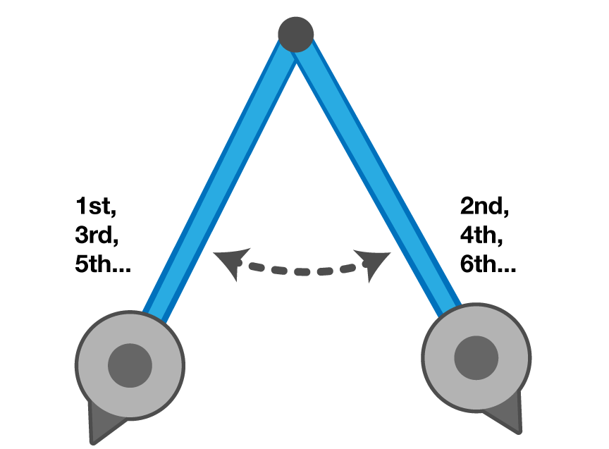

震动曲线如下：

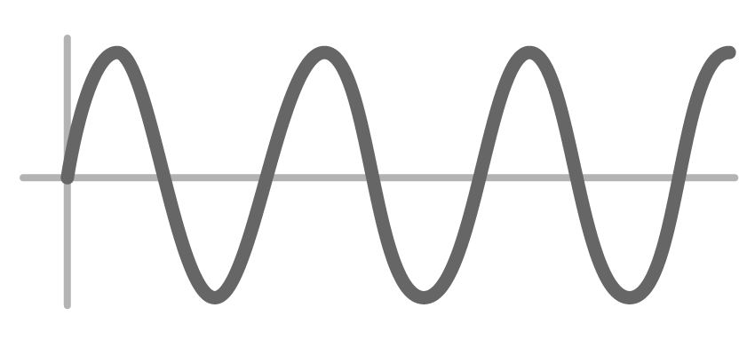

在真实世界中，由于阻力的作用，其摆动效果如下：

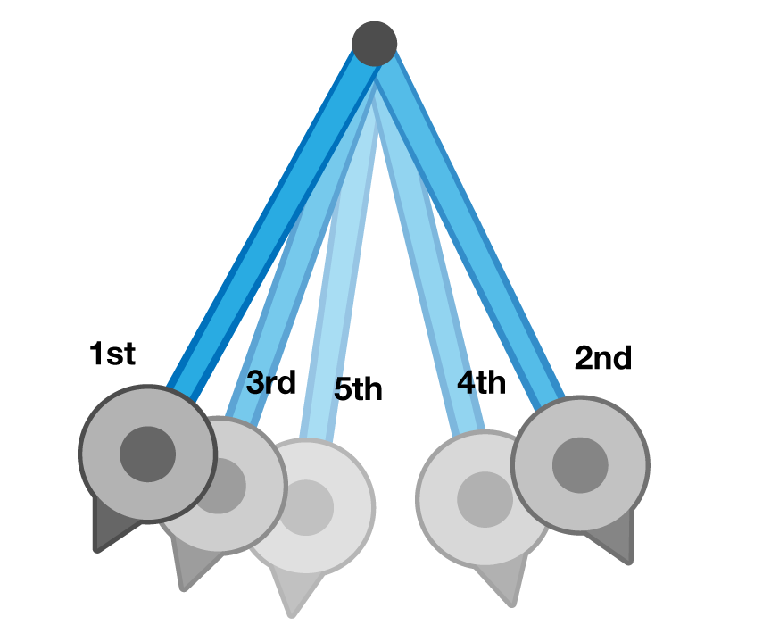

震动曲线如下：

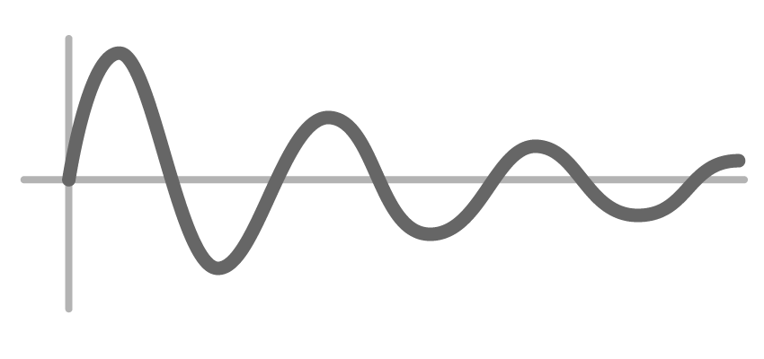

#### 4.1 常用属性

`CASpringAnimation`的以下属性可以控制弹性效果：

- `damping`：减震。`damping`属性定义抑制弹簧运动的摩擦力大小。默认值为10。减小`damping`值摩擦力变小，弹簧晃动次数增加，`settlingDuration`可能大于`duration`。增大`damping`值阻力变大，弹簧晃动次数减少，`settlingDuration`比`duration`小。
- `initialVelocity`：初始速度，默认为0，表示静止的对象。负值表示与目标位置相反方向的初始速度，正值表示与目标位置相同方向的初始速度。
- `mass`：附着在弹簧末端物体的重量，默认值为1。增加该值会增大弹性效果，即震动次数更多、幅度更大，`settlingDuration`也会增加。减小`mass`会减弱弹性效果。
- `settlingDuration`：弹性动画完全静止所需预期时间，可能和`duration`不一致。
- `stiffness`：弹簧钢性系数，默认值为100。增大`stiffness`会减少震动次数，减小`settlingDuration`时间。减少`stiffness`会增加震动次数，增加`settlingDuration`时间。

#### 4.2 设置弹簧动画

下面使用`CASpringAnimation`创建一个弹簧动画，点击按钮时上下摆动文本框，并使用红色描边。如下所示：

```
    private func testSpringAnimation() {
        let jump = CASpringAnimation(keyPath: "position.y")
        jump.fromValue = textField.layer.position.y + 1.0
        jump.toValue = textField.layer.position.y
        jump.duration = 0.25
        textField.layer.add(jump, forKey: nil)
    }
```

目前，动画只会将文本框向下移动1point，然后回到初始位置。

为`CASpringAnimation`添加以下属性：

```
				jump.initialVelocity = 100.0
        jump.mass = 10.0
        jump.stiffness = 1500.0
        jump.damping = 50.0
```

> 修改弹簧变量可能并不容易，你可以反复修改这些值，观察其中区别以实现最佳效果。

多次运行demo，会发现动画运行到一定位置后直接跳到了终点。这是由于`duration`设置为了0.25秒，但弹簧动画在0.25秒内并不能完成。下图显示了弹簧动画如何被切断：

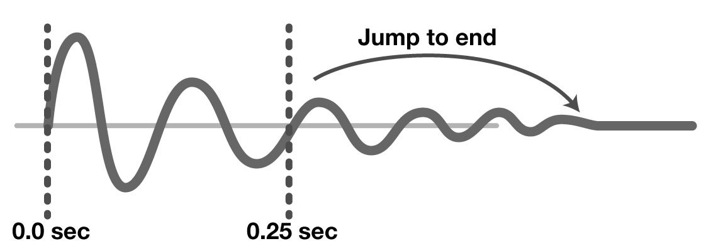

想要修复这一问题，只需设置`duration`为`settlingDuration`即可。

```
        jump.duration = jump.settlingDuration
```

此外，还可以弹性设置描边颜色。如下所示：

```
        textField.layer.borderWidth = 2.0
        textField.layer.borderColor = UIColor.clear.cgColor

        let flash = CASpringAnimation(keyPath: "borderColor")
        flash.damping = 7.0
        flash.stiffness = 200.0
        flash.fromValue = UIColor(red: 1.0, green: 0.27, blue: 0.0, alpha: 1.0).cgColor
        flash.duration = flash.settlingDuration
        textField.layer.add(flash, forKey: nil)

        textField.layer.cornerRadius = 5
```

效果如下：

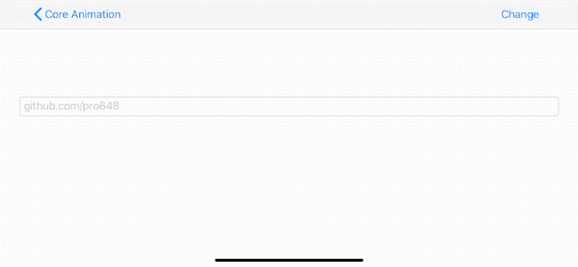

## 5. CAKeyframeAnimation

`CABasicAnimation`渐进式修改图层指定属性，在指定时间内从`fromValue`修改到`toValue`。例如，将图层从45度旋转到-45度，只需指定开始、结束值，layer 自动渲染中间状态以完成动画。

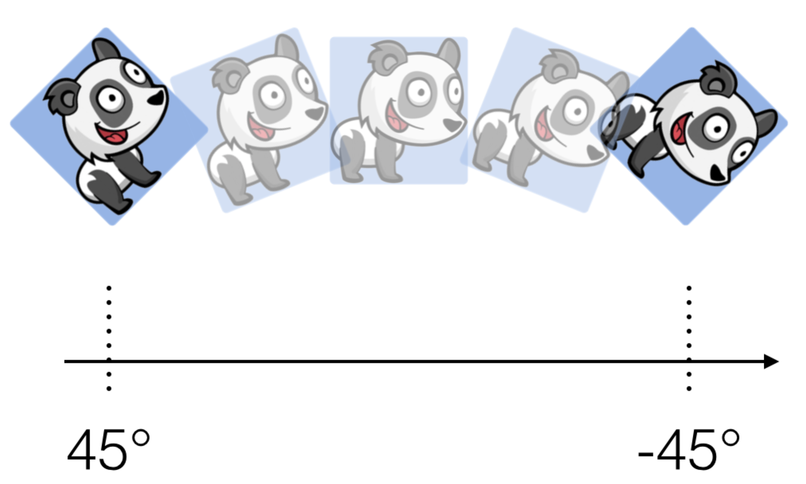

`CAKeyframeAnimation`使用数组`values`取代`fromValue`、`byValue`、`toValue`，`values`数组元素是动画需经过的点。此外，还需提供经过上述点的`keyTimes`。`CAKeyframeAnimation`继承自`CAPropertyAnimation`，为图层对象提供关键帧（keyframe）动画。

查看以下`CAKeyframeAnimation`动画：

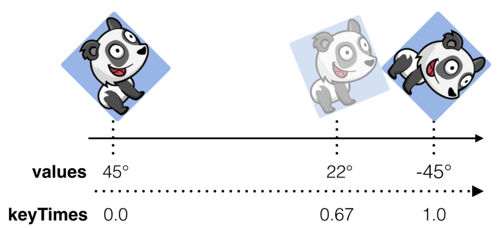

上图中，动画从45度旋转至-45度，但分为两个阶段。第一阶段，前三分之二时间从45度旋转到22度，后三分之一时间从22度旋转至-45度。

使用 keyframe 动画时，需提供属性的 key values，同时提供与之匹配数量的 key times，时间为相对比例，范围为0.0至1.0。

#### 5.1 常用属性

`CAKeyframeAnimation`有以下常用属性：

- `values`：数组类型，指定用于动画的`keyframe`。`keyframe`指定了动画必须经过的位置，图层何时经过指定`keyframe`由动画时间函数决定，即`calculationMode`、`keyTimes`、`timingFunctions`属性等。`keyframe`之间的值自动插入，除非`calculationMode`被设置为了`discrete`。只有当`path`属性为`nil`时才会采用`values`属性的值。

- `path`：`CGPath`类型，动画属性类型为`CGPoint`时，可以使用`path`指定点动画的路径。使用了`path`属性后，动画会忽略`values`属性。`path`可以包含move-to、line-to、curve-to等片段。

- `keyTimes`：数组类型，可选实现。指定动画进行到指定`keyframe`的时间。数组元素为浮点值，范围为0.0至1.0，即指定动画进行到总持续时间百分比。后一个时间必须大于等于前一个时间。通常，`keyTimes`元素数量与`values`、`path`元素数量应一致。否则，动画时间可能不符合预期。

  `keyTimes`数组元素值与`calculationMode`相关：

  - 如果`calculationMode`设置为`linear`或`cubic`，则数组第一个元素需是0.0，最后一个元素需是1.0。中间部分值表示开始时间和结束时间之间的时间点。
  - 如果`calculationMode`设置为`discrete`，数组第一个元素必须是0.0，最后一个元素必须是1.0。`keyTimes`数组元素必须比`values`数组元素数量多一个。
  - 如果`calculationMode`设置为`cubicPaced`、`paced`，则自动忽略`values`数组。

  如果`keyTimes`数组对当前`calculationMode`无效或不合适，则会被自动忽略。

- `timingFunctions`：数组类型，可选设置，数组元素为`CAMediaTimingFunction`类型。通过`timingFunctions`数组可以设置两个`keyframe`之间动画为淡入、淡出、自定义。如果`values`数组有n个元素，则该数组应包含n-1个元素。

  如果已经为`keyTimes`赋值，`timingFunctions`属性会对时间函数进一步优化。如果未设置`keyTimes`属性，则使用`timingFunctions`属性替换 Core Animation 默认时间函数。

- `calculationMode`：指定`CAKeyframeAnimation`如何计算 keyframe 中间值。默认值为`linear`，即线性插入。此外，还有`cubic`、`cubicPaced`、`discrete`、`linear`、`paced`。

- `rotationMode`：对象沿指定path运动过程中，绕切线旋转模式。默认为`nil`，即无需旋转。


#### 5.2 对非 struct 属性进行动画

以下代码使用`CAKeyframeAnimation`晃动`UILabel`：

```
        let wobble = CAKeyframeAnimation(keyPath: "transform.rotation")
        wobble.duration = 0.25
        wobble.repeatCount = 2
        wobble.values = [0.0, -.pi/4.0, 0.0, .pi/4.0, 0.0]
        wobble.keyTimes = [0.0, 0.25, 0.5, 0.75, 1.0]
        titleLabel.layer.add(wobble, forKey: nil)
```

创建`CAKeyframeAnimation`与创建`CABasicAnimation`方式一致，指定`keyPath`、`duration`、`repeatCount`即可。

旋转角度从0度到-45度，回归到0度，旋转到45度，回到0度。动画开始、结束位置相同，方便重复动画。确保`keyTimes`开始、结束分别是0.0、1.0。

效果如下：

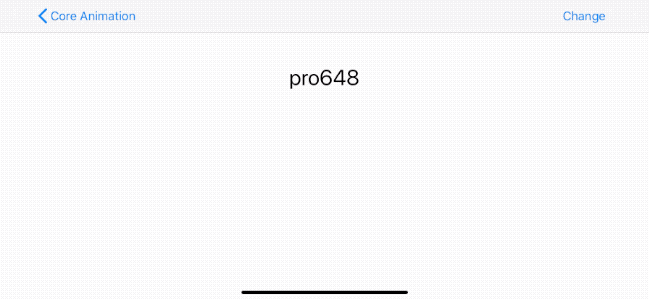

#### 5.3 对 struct 属性进行动画

结构体（struct）在 swift 中是一等公民，与 class 的使用几乎没有区别。

但 Core Animation 是一个基于 C 的 Objective-C framework。这意味着，结构体的处理会有些不同。Objective-C API 喜欢处理对象，因此，struct 属性动画需要一些特殊处理。

`CALayer`的很多属性是结构体，如`position`、`transform`、`bounds`等。为了解决这个问题，Cocoa 提供了`NSValue`类，用于将结构体包装为对象。`NSValue`提供了以下方法包装结构体：

```
init(cgPoint: CGPoint)
init(cgSize: CGSize)
init(cgRect rect: CGRect)
init(caTransform3D: CATransform3D)
```

如果直接为`fromValue`、`toValue`赋值结构体，将无法得到预期的动画。

首先，添加`CALayer`到视图：

```
        let balloon = CALayer()
        balloon.frame = CGRect(x: -50, y: 100, width: 50, height: 50)
        balloon.contents = UIImage(named: "balloon")!.cgImage
        view.layer.addSublayer(balloon)
```

将`balloon`图层放到了左上角的可见区域外。使用以下代码添加 keyframe 动画：

```
        let flight = CAKeyframeAnimation(keyPath: "position")
        flight.duration = 3.0
        flight.values = [
            CGPoint(x: -50.0, y: 0.0),
            CGPoint(x: view.bounds.width + 50, y: view.bounds.height / 2.0),
            CGPoint(x: -50.0, y: view.bounds.height - 100)
        ].map({ NSValue(cgPoint: $0) })
        flight.keyTimes = [0.0, 0.5, 1.0]
        balloon.add(flight, forKey: nil)
        balloon.position = CGPoint(x: -50.0, y: view.bounds.height - 100)
```

动画经过了三个指定点。运行后效果如下：

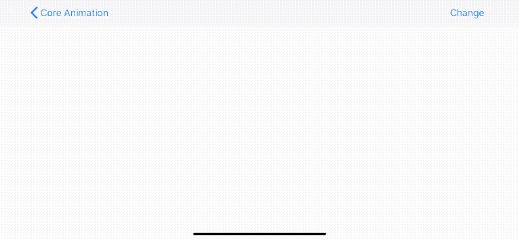

还可使用上述方法对`bounds`、`position`、`transform`等结构体添加动画。

## 6. CATransition

`CATransition`对象提供 layer 状态切换的动画。`CATransition`继承自`CAAnimation`。

默认 transition 是交叉淡入淡出（cross fade）。通过创建、添加`CATransition`对象，可以选取不同 transition 效果。

#### 6.1 常用属性

`CATransition`有以下常用属性：

- `startProgress`：指定动画起点处于整个 transition 的百分比。Float 类型，值范围是0.0至1.0，默认为0。

- `endProgress`：指定动画终点处于整个 transition 的百分比。Float 类型，值范围是0.0至1.0，默认为0。`endProgress`值必须大于等于`startProgress`，并不大于1.0。如果`endProgress`小于`startProgress`，则结果不可预期。默认值为1.0。

- `type`：预定义的 transition type，为`CATransitionType`类型。如果设置了`filter`属性，则会忽略`type`属性。

  `CATransitionType`有以下类型：

  - `fade`：淡入淡出，默认属性。
  - `moveIn`：图层内容在现有内容之上滑入。`moveIn`与`subType`一起使用。
  - `push`：图层内容推动着现有内容进入。`push`与`subType`一起使用。
  - `reveal`：图层内容根据`subType`指定方向逐渐显示。

- `subType`：指定 transition 方向。`CATransitionSubtype`类型，默认为`nil`。如果设置了`filter`属性，则会忽略`subType`属性。

  `CATransitionSubtype`有以下类型：

  - `fromBottom`：transition 从图层底部开始。
  - `fromLeft`：transition 从图层左侧开始。
  - `fromRight`：transition 从图层右侧开始。
  - `fromTop`：transition 从图层顶部开始。

- `filter`：可选 Core Image Filter 对象提供 transition。只可用于macOS和 Mac Catalyst 13.0，不可用于 iOS。

#### 6.2 对 CATextLayer 添加 transition

下面代码演示了如何过渡`CATextLayer`。过渡前，`backgroundColor`为红色，`string`为Red。过渡时，创建了一个新的`CATransition`并添加到图层，图层背景色过渡为蓝色，文本内容过渡为Blue。代码如下：

```
        let transition = CATransition()
        transition.duration = 2
        transition.type = .push
        transitioningLayer.add(transition, forKey: nil)
        
        // Transition to "blue" state
        transitioningLayer.backgroundColor = UIColor.blue.cgColor
        transitioningLayer.string = "Blue"
```

效果如下：

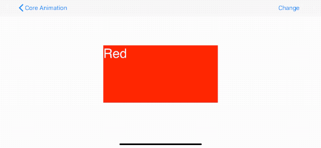

#### 6.3 对 NavigationController 添加 transition

这一部分使用`CATransition`为控制器之间导航添加过渡动画。

首先为`UINavigationController`添加以下 extension：

```
extension UINavigationController {
    func pushTransition() {
        let transition = CATransition()
        transition.duration = 1.0
        transition.timingFunction = CAMediaTimingFunction(name: .easeInEaseOut)
        transition.type = .push
        transition.subtype = .fromTop
        view.layer.add(transition, forKey: nil)
    }
    
    func popTransition() {
        let transition = CATransition()
        transition.duration = 1.0
        transition.timingFunction = CAMediaTimingFunction(name: .easeInEaseOut)
        transition.type = .push
        transition.subtype = .fromBottom
        view.layer.add(transition, forKey: nil)
    }
}
```

> 可以尝试不同`type`、`subType`，查看不同效果。

当执行push、pop时，先调用`pushTransition()`和`popTransition()`函数。如下所示：

```
    @objc private func handlePushButtonTapped() {
        navigationController?.pushTransition()
        
        let explicitlyVC = ExplicitlyViewController()
        navigationController?.pushViewController(explicitlyVC, animated: false)
    }
    
    @objc private func handlePopButtonTapped() {
        navigationController?.popTransition()
        
        navigationController?.popViewController(animated: false)
    }
```

效果如下：

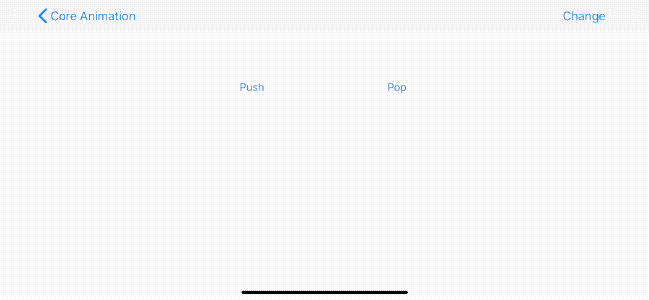

> 如果是 present 视图控制器，可以使用`modalTransitionStyle`修改呈现方式。

## 7. CAAnimationGroup

`CAAnimationGroup`允许多个动画在一个组中同时运行。`CAAnimationGroup`继承自`CAAnimation`。

添加到 animation group 的动画，它的时间不会缩放到`CAAnimationGroup`的`duration`，而是将超出`CAAnimationGroup`的`duration`部分直接裁剪掉。例如，`CAAnimationGroup`动画`duration`时间为5秒，添加到该 group 动画`duration`为10秒，则仅显示前5秒钟动画。

下面代码将改变不透明度、缩放、旋转三个动画添加到`CAAnimationGroup`：

```
        let fadeOut = CABasicAnimation(keyPath: "opacity")
        fadeOut.fromValue = 0
        fadeOut.toValue = 1
        
        let expandScale = CABasicAnimation(keyPath: "transform")
        expandScale.valueFunction = CAValueFunction(name: .scale)
        expandScale.fromValue = [1, 1, 1]
        expandScale.toValue = [1.5, 1.5, 1.5]
        
        let rotate = CABasicAnimation(keyPath: "transform")
        rotate.valueFunction = CAValueFunction(name: .rotateZ)
        rotate.fromValue = Float.pi / 4.0
        rotate.toValue = 0.0
        
        let group = CAAnimationGroup()
        group.animations = [fadeOut, expandScale, rotate]
        group.duration = 0.5
        group.beginTime = CACurrentMediaTime() + 0.5
        group.fillMode = .backwards
        group.delegate = self
        
        layerView.layer.add(group, forKey: nil)
```

> 添加到`CAAnimationGroup`的动画将忽略`delegate`和`isCompletedOnCompletion`属性，`CAAnimationGroup`会接收这些信息。

效果如下：


## 8. CAAnimationDelegate

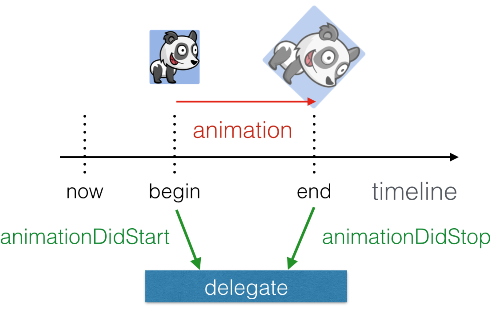

`CAAnimation`遵守了`CAAnimationDelegate`协议。`CAAnimationDelegate`协议包含了下面两个可选实现的方法：

- `optional func animationDidStart(_ anim: CAAnimation)`动画开始时调用。
- `optional func animationDidStop(_ anim: CAAnimation, finished flag: Bool)`动画结束时调用。动画结束可能是因为到达`duration`，也可能是因为添加动画的图层被移除。如果是达到指定`duration`，flag为true；反之，flag为false。

为`CAAnimationGroup`添加`delegate`：

```
        group.delegate = self
```

添加以下 delegate 方法：

```
extension ExplicitlyViewController: CAAnimationDelegate {
    func animationDidStop(_ anim: CAAnimation, finished flag: Bool) {
        print(#function)
    }
}
```

动画结束后会输出以下内容：

```
animationDidStop(_:finished:)
```

实际应用时可能有多个动画同时遵守`CAAnimationDelegate`协议，但如何区分是哪个动画结束调用的`CAAnimationDelegate`方法呢？

#### 8.1 键值编码 Key-value coding compliance

`CAAnimation`类和子类都是使用 Objective-C 编写的，都遵守[KVC](https://github.com/pro648/tips/blob/master/sources/KVC%E5%92%8CKVO%E5%AD%A6%E4%B9%A0%E7%AC%94%E8%AE%B0.md)。也就是可以像字典一样在运行时添加属性。

我们将使用KVO机制为动画添加属性，以便在需要时可以对动画进行区分。

```
        let flyRight = CABasicAnimation(keyPath: "position.x")
        flyRight.fromValue = -view.bounds.size.width/2
        flyRight.toValue = view.bounds.size.width/2
        flyRight.duration = 2
        flyRight.delegate = self
        flyRight.setValue("form", forKey: "name")
        flyRight.setValue(titleLabel.layer, forKey: "layer")
        titleLabel.layer.add(flyRight, forKey: "title")
        
        flyRight.beginTime = CACurrentMediaTime() + 0.3
        flyRight.fillMode = .both
        flyRight.setValue(textField.layer, forKey: "layer")
        textField.layer.add(flyRight, forKey: "field")
        
        titleLabel.layer.position.x = view.bounds.size.width / 2
        textField.layer.position.x = view.bounds.size.width / 2
```

在上述代码中，添加了键`form`，值为`name`。这样可以在`CAAnimationDelegate`回掉方法中根据`form`区分动画。

> Core Animation 动画对象只是数据模型，创建后只需修改所需属性即可。
>
> `CABasicAnimation`实例描述了动画，可以现在执行、稍后执行，也可以不执行。动画不关联特定 layer，可以复用 animation 到其他 layer，每个 layer 都将获得单独的 animation，

#### 8.2 animationDidStop(_:finished:)

目前已经为动画设置了 key，在`animationDidStop(_:finished:)`方法中添加以下代码：

```
    func animationDidStop(_ anim: CAAnimation, finished flag: Bool) {
        print(#function)
        
        if !flag {
            print("Did not reached the end of the duration")
            return
        }
        
        guard let name = anim.value(forKey: "name") as? String else { return }
        
        if name == "form" { // form field found
            let layer = anim.value(forKey: "layer") as? CALayer
            anim.setValue(nil, forKey: "layer")
            
            let pulse = CABasicAnimation(keyPath: "transform.scale")
            pulse.fromValue = 1.5
            pulse.toValue = 1.0
            pulse.duration = 0.25
            layer?.add(pulse, forKey: nil)
        }
    }
```

如果动画不是因为到达`duration`结束，则不再添加动画。使用`value(forKey:)`从动画中获取值，并转为`String`类型。

> `value(forKey:)`返回值类型是`AnyObject?`，需转换为所需类型，且转换可能失败。

最终，当动画结束后添加了一个放大动画。

#### 8.3 Animation Keys

`add(_:forKey:)`函数有以下两个参数：

- anim：第一个参数是要添加到 render tree 的动画。render tree 对该参数进行复制、而非引用。因此，随后对动画的修改不会改变 render tree 中的动画。
- key：标记该动画的 key。每个单独 key 只添加一个动画到图层，对于 transition animation 会自动使用`kCATransition`特殊key。该参数可以为nil。使用 key 可以在动画开始后获取、管理动画。

如果动画`duration`为0或负值，则`duration`会被设置为当前的`kCATransactionAnimationDuration`（如果设置了该值），或采用动画默认时长，即0.25秒。

在上面的键值编码部分，为`titleLabel`设置的key是`title`，为`textField`设置的key是`field`。这里使用以下代码移除运行中的动画：

```
        titleLabel.layer.removeAnimation(forKey: "title")
        textField.layer.removeAnimation(forKey: "field")
```

当titleLabel、textField向右移动过程中，点击chang按钮时调用上述方法，会立即移除动画。效果如下：

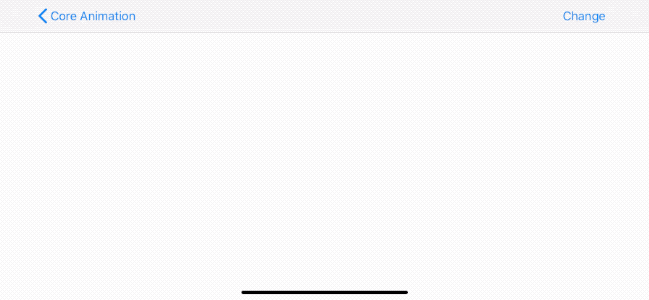

Demo名称：CoreAnimation  
源码地址：<https://github.com/pro648/BasicDemos-iOS/tree/master/CoreAnimation>

> 上一篇：[CALayer及其各种子类](https://github.com/pro648/tips/blob/master/sources/CALayer%E5%8F%8A%E5%85%B6%E5%90%84%E7%A7%8D%E5%AD%90%E7%B1%BB.md)
>
> 下一篇：[图层时间CAMediaTiming](https://github.com/pro648/tips/blob/master/sources/%E5%9B%BE%E5%B1%82%E6%97%B6%E9%97%B4CAMediaTiming.md)

参考资料：

1. [Animations](https://medium.com/if-let-swift-programming/animations-2b7390315d4c)
2. [Core Animation](https://developer.apple.com/documentation/quartzcore)

