> 这是 Core Animation 的系列文章，介绍了 Core Animation 的用法，以及如何进行性能优化。
>
> 1. [CoreAnimation基本介绍](https://github.com/pro648/tips/blob/master/sources/CoreAnimation%E5%9F%BA%E6%9C%AC%E4%BB%8B%E7%BB%8D.md)
> 2. [CGAffineTransform和CATransform3D](https://github.com/pro648/tips/blob/master/sources/CGAffineTransform%E5%92%8CCATransform3D.md)
> 3. [CALayer及其各种子类](https://github.com/pro648/tips/blob/master/sources/CALayer%E5%8F%8A%E5%85%B6%E5%90%84%E7%A7%8D%E5%AD%90%E7%B1%BB.md)
> 4. [CAAnimation：属性动画CABasicAnimation、CAKeyframeAnimation以及过渡动画、动画组](https://github.com/pro648/tips/blob/master/sources/CAAnimation%EF%BC%9A%E5%B1%9E%E6%80%A7%E5%8A%A8%E7%94%BBCABasicAnimation%E3%80%81CAKeyframeAnimation%E4%BB%A5%E5%8F%8A%E8%BF%87%E6%B8%A1%E5%8A%A8%E7%94%BB%E3%80%81%E5%8A%A8%E7%94%BB%E7%BB%84.md)
> 5. [图层时间CAMediaTiming](https://github.com/pro648/tips/blob/master/sources/%E5%9B%BE%E5%B1%82%E6%97%B6%E9%97%B4CAMediaTiming.md)
> 6. [计时器CADisplayLink](https://github.com/pro648/tips/blob/master/sources/%E8%AE%A1%E6%97%B6%E5%99%A8CADisplayLink.md)
> 7. [影响动画性能的因素及如何使用 Instruments 检测](https://github.com/pro648/tips/blob/master/sources/%E5%BD%B1%E5%93%8D%E5%8A%A8%E7%94%BB%E6%80%A7%E8%83%BD%E7%9A%84%E5%9B%A0%E7%B4%A0%E5%8F%8A%E5%A6%82%E4%BD%95%E4%BD%BF%E7%94%A8%20Instruments%20%E6%A3%80%E6%B5%8B.md)
> 8. [图像IO之图片加载、解码，缓存](https://github.com/pro648/tips/blob/master/sources/%E5%9B%BE%E5%83%8FIO%E4%B9%8B%E5%9B%BE%E7%89%87%E5%8A%A0%E8%BD%BD%E3%80%81%E8%A7%A3%E7%A0%81%EF%BC%8C%E7%BC%93%E5%AD%98.md)
> 9. [图层性能之离屏渲染、栅格化、回收池](https://github.com/pro648/tips/blob/master/sources/%E5%9B%BE%E5%B1%82%E6%80%A7%E8%83%BD%E4%B9%8B%E7%A6%BB%E5%B1%8F%E6%B8%B2%E6%9F%93%E3%80%81%E6%A0%85%E6%A0%BC%E5%8C%96%E3%80%81%E5%9B%9E%E6%94%B6%E6%B1%A0.md)

我们已经介绍了`CALayer`类、CGAffineTransform、CATransform3D，但 Core Animation 图层不止用于设置图片、背景色。这一篇文章介绍一些图层类，进一步扩展 Core Animation 的能力。

## 1. CAShapeLayer

在第一篇文章[CoreAnimation基本介绍](https://github.com/pro648/tips/blob/master/sources/CoreAnimation%E5%9F%BA%E6%9C%AC%E4%BB%8B%E7%BB%8D.md)中，介绍了使用`CGPath`创建任意形状的阴影，无需使用图片。如果可以创建任意形状图层就更好了。

`CAShapeLayer`在其坐标空间中绘制三次贝塞尔曲线图层，继承自`CALayer`。

`CAShapeLayer`在 layer 的 contents 和第一个 sublayer 之间合成，`CAShapeLayer`通过矢量图形而非位图绘制。使用`CGPath`指定颜色、线宽和形状，`CAShapeLayer`自动渲染图层。你也可以使用 Core Graphics 直接向`CALayer`的`contents`绘制路径，但使用`CAShapeLayer`有以下这些优点：

- 快速。`CAShapeLayer`使用硬件加速，比使用 Core Graphics 绘制速度快。
- 节省内存。`CAShapeLayer`无需像`CALayer`那样创建 backing image。因此，不会随着 layer 变大，占用更大内存。

- 超出 layer 边框部分不会被裁剪。`CAShapeLayer`可以在`bounds`外绘制，不会像使用 Core Graphics 在`CALayer`绘制的图形一样被裁剪掉。
- 旋转、缩放等变换操作后不会失真。由于`CAShapeLayer`是矢量图（Vector graphics），可以通过数学公式计算获得。放大时，不会像位图（bitmap）那样放大单个像素，也就不会出现线条或形状锯齿化的问题。

#### 1.1 创建 CGPath

`CAShapeLayer`可用于绘制任何可用`CGPath`表示的形状。图形不一定闭合，路径不一定连续，可以在一个`CAShapeLayer`中添加多个 shape。

设置一些属性可以改变`CAShapeLayer`样式，如`fillColor`、`strokeColor`、`lineWidth`、`lineCap`（线末端样式）、`lineJoin`（线之间接头样式）等，但一个`CAShapeLayer`只能有一个`fillColor`、`lineDashPattern`、`lineJoin`等。如果需使用不同样式、颜色，需创建多个 shape layer。

下面代码显示了使用`CAShapeLayer`绘制线笔画，`CAShapeLayer`的`path`属性是`CGPathRef`类型。这里使用`UIBezierPath`创建 path，省去了手动释放`CGPath`的步骤。如下所示：

```
        // Create path
        let path = UIBezierPath()
        path.move(to: CGPoint(x: 175, y: 100))
        path.addArc(withCenter: CGPoint(x: 150, y: 100), radius: 25, startAngle: 0, endAngle: .pi * 2, clockwise: true)
        path.move(to: CGPoint(x: 150, y: 125))
        path.addLine(to: CGPoint(x: 150, y: 175))
        path.addLine(to: CGPoint(x: 125, y: 225))
        path.move(to: CGPoint(x: 150, y: 175))
        path.addLine(to: CGPoint(x: 175, y: 225))
        path.move(to: CGPoint(x: 100, y: 150))
        path.addLine(to: CGPoint(x: 200, y: 150))
        
        // Create shape layer
        let shapelLayer = CAShapeLayer()
        shapelLayer.strokeColor = UIColor.red.cgColor
        shapelLayer.fillColor = UIColor.clear.cgColor
        shapelLayer.lineWidth = 5
        shapelLayer.lineJoin = .bevel
        shapelLayer.lineCap = .round
        shapelLayer.path = path.cgPath
        
        // Add it to our view
        view.layer.addSublayer(shapelLayer)
```

效果如下：

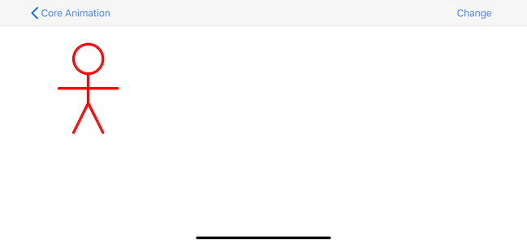

#### 1.2 圆角

使用`CAShapeLayer`可以创建圆角矩形。与`cornerRadius`相比，`CAShapeLayer`允许指定单个角半径。下面代码创建三个圆角、一个直角的矩形：

```
        let rect = CGRect(x: 0, y: 0, width: 100, height: 100)
        let radii = CGSize(width: 20, height: 20)
        let path = UIBezierPath.init(roundedRect: rect, byRoundingCorners: [.topRight, .bottomRight, .bottomLeft], cornerRadii: radii)
```

为`CAShapeLayer`的`path`属性设置上述贝塞尔曲线，可以获得圆角、直角组合的矩形。如果想要将 layer 的`contents`设置为同样图形，可以将`CAShapeLayer`赋值给`mask`属性。如下所示：

```
        // Create path
        let rect = CGRect(x: 0, y: 0, width: 100, height: 100)
        let radii = CGSize(width: 20, height: 20)
        let path = UIBezierPath.init(roundedRect: rect, byRoundingCorners: [.topRight, .bottomRight, .bottomLeft], cornerRadii: radii)
        
        let layer = CALayer()
        layer.backgroundColor = UIColor.gray.cgColor
        layer.position = view.center
        layer.bounds = CGRect(x: 0, y: 0, width: 100, height: 100)
        
        // Create mask layer
        let maskLayer = CAShapeLayer()
        maskLayer.path = path.cgPath
        layer.mask = maskLayer
        
        view.layer.addSublayer(layer)
```

效果如下：

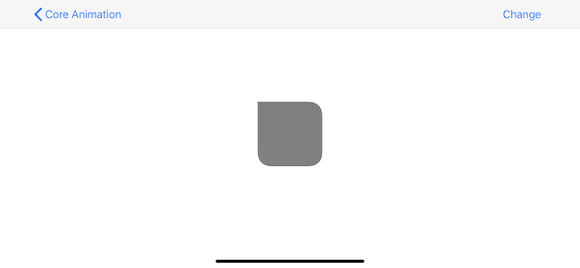

`CALayer`的`mask`属性是`CALayer`类，使用方法与 sublayer 类似，相对于拥有它的图层布局自身位置。与普通 sublayer 不同，`mask`不是在父图层内绘制，其决定了父图层的可见区域。

`mask`的颜色不重要，重要的是它的轮廓。与`mask`重合部分会被保留下来，`mask`以外部分会被隐藏。


如果`mask`layer小于父图层，则只有与`mask`相交的父图层部分可见，其他部分都会被隐藏。

## 2. CATransformLayer

在 3D 场景中，创建对象的层级结构并将变换应用于根视图，整个层级结构会随之变换。

向容器中添加四个图层，不添加任何变换。如下所示：

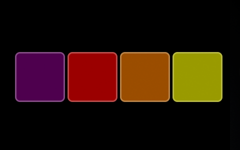

旋转每个 layer Y轴后，得到如下四个图层：

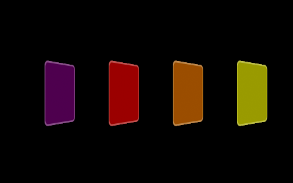

`CALayer`不能管理 3D 层级结构中的深度，其只能将Z轴场景展平到单个层级。为了解决这个问题，需使用`CATransformLayer`。

与其他 layer 不同，`CATransformLayer`不会将 sublayer 展平到 Z=0 的平面中，因此，它不支持`CALayer`的众多功能：

- 只渲染`CATransformLayer`的 sublayer。transform layer 的`backgroundColor`、`contents`、边缘样式、描边样式等都不会生效。
- 2D 图像处理的属性会被忽略。包含`filters`、`backgroundFilters`、`compositingFilter`、`mask`、`masksToBounds`和阴影样式等。
- `opacity`属性会被单独应用到每个 sublayer，transform layer 不会形成合成组。
- Transform layer 没有 2D 坐标空间概念，不能将自身点映射到二维空间。因此，不要对 transform layer 应用`hitTest:`方法。

下面代码创建了四个 layer，其具有相同的x、y坐标，不同z坐标。

```
    private func testTransformLayerA() {
        // Create the container as a CATransformLayer
        let container = CATransformLayer()
        
        // 如果使用CALayer，不能得到三维图层。
//        let container = CALayer()
        container.frame = view.frame
        view.layer.addSublayer(container)
        
        // Planes data
				let planesPosition = view.layer.position
        let planeSize = CGSize(width: 100, height: 100)
        
        // Create 4 planes
        let purplePlane = addPlane(to: container, size: planeSize, position: planesPosition, color: UIColor.purple)
        let redPlane = addPlane(to: container, size: planeSize, position: planesPosition, color: UIColor.red)
        let orangePlane = addPlane(to: container, size: planeSize, position: planesPosition, color: UIColor.orange)
        let yellowPlane = addPlane(to: container, size: planeSize, position: planesPosition, color: UIColor.yellow)
        
        // Apply transform to the container
        var t = CATransform3DIdentity
        t.m34 = 1.0 / -500
        t = CATransform3DRotate(t, .pi/3, 0, 1, 0)
        container.transform = t
        
        // Apply transform to the planes
        t = CATransform3DIdentity
        t = CATransform3DTranslate(t, 0, 0, 0)
        purplePlane.transform = t
        
        // Apply transform to the planes
        t = CATransform3DIdentity
        t = CATransform3DTranslate(t, 0, 0, -40)
        redPlane.transform = t
        
        // Apply transform to the planes
        t = CATransform3DIdentity
        t = CATransform3DTranslate(t, 0, 0, -80)
        orangePlane.transform = t
        
        // Apply transform to the planes
        t = CATransform3DIdentity
        t = CATransform3DTranslate(t, 0, 0, -120)
        yellowPlane.transform = t
    }
    
    private func addPlane(to container: CALayer, size: CGSize, position: CGPoint, color: UIColor) -> CALayer {
        let plane = CALayer()
        plane.backgroundColor = color.cgColor
        plane.opacity = 0.6
        plane.frame = CGRect(x: 0, y: 0, width: size.width, height: size.height)
        plane.position = position
        plane.borderColor = UIColor.init(white: 1.0, alpha: 0.5).cgColor
        plane.borderWidth = 3
        plane.cornerRadius = 10
        container.addSublayer(plane)
        
        return plane
    }
```

运行结果如下：

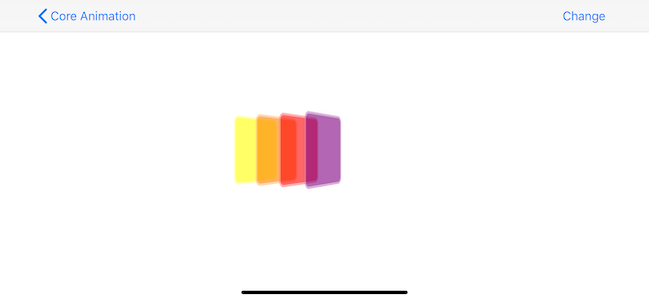

如果使用`CALayer`替代`CATransformLayer`，效果如下：

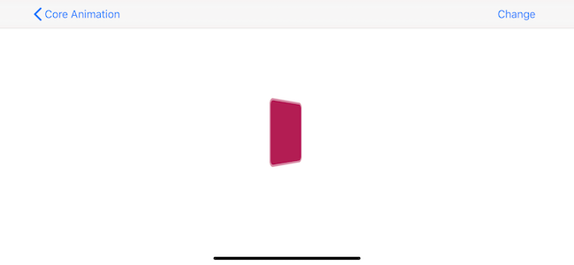

## 3. CAGradientLayer

`CAGradientLayer`绘制背景色渐变的图层。

Gradient layer 用于创建包含任意数量颜色的颜色渐变。默认情况下，颜色均匀分布在整个图层上，但可以使用`locations`属性指定颜色位置。

`CAGradientLayer`有以下属性：

- `locations`：元素为浮点类型的数组，值范围为0至1，且只能递增。如果为`nil`，则均匀排布。默认为`nil`。
- `colors`：元素为`CGColorRef`类型的数组，默认为`nil`。
- `startPoint`：在图层坐标空间绘制时，渐变的起点。使用单位坐标系，并在绘制时映射到 layer 点坐标。默认值为(0.5, 0.5)。
- `endPoint`：在图层坐标空间绘制时，渐变的终点。使用单位坐标系，并在绘制时映射到 layer 点坐标。默认值为(0.5, 1.0)。

下面代码展示了如何创建包含三种颜色、指定渐变位置的图层：

```
				gradient.colors = [UIColor.red.cgColor, UIColor.yellow.cgColor, UIColor.green.cgColor]
        gradient.locations = [0.0, 0.25, 0.5]
        
        gradient.startPoint = CGPoint(x: 0, y: 0)
        gradient.endPoint = CGPoint(x: 1, y: 1)
```

效果如下：

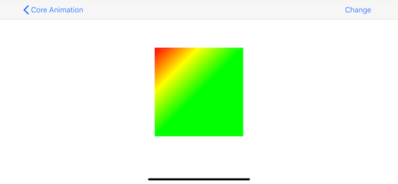

## 4. CAReplicatorLayer

`CAReplicatorLayer`用于创建 layer 的指定数量副本，副本间有不同的几何坐标、显示属性（delay、transform）和颜色等。常用属性如下：

- `instanceCount`：要创建的副本数，包括原始 layer。默认值时1，即不创建副本。
- `instanceDelay`：指定副本显示延时。默认值为0.0秒，即同步显示。
- `instanceTransform`：向前一个副本添加 transform，得到当前副本。默认为`CATransform3DIdentity`。
- `preservesDepth`：是否将子图层展平到平面中。默认为`false`。如果为`true`，则`CAReplicatorLayer`表现与`CATransformLayer`相似，同时受`CATransformLayer`同样限制。
- `instanceColor`：指定原始图层的颜色。默认为不透明白色。
- `instanceRedOffset`：指定颜色红色通道偏移量。向 k-1 实例添加偏移，得到 k 实例颜色。默认为0.0。

> `instanceGreenOffset`、`instanceBlueOffset`、`instanceAlphaOffset`与`instanceRedOffset`类似，只是通道不同。

下面的代码在屏幕中央创建一个白色的 layer，使用`CAReplicatorLayer`创建由十个 layer 构成圆形的图案。

```
        var replicatorLayer = CAReplicatorLayer()
        replicatorLayer.bounds = CGRect(x: 0, y: 0, width: view.bounds.size.width, height: view.bounds.size.height)
        view.layer.addSublayer(replicatorLayer)
        
        // Configure the replicator
        replicatorLayer.instanceCount = 10
        
        // Apply a transform for each instance
        var transform = CATransform3DIdentity
        transform = CATransform3DTranslate(transform, 0, 200, 0)
        transform = CATransform3DRotate(transform, .pi / 5.0, 0, 0, 1)
        transform = CATransform3DTranslate(transform, 0, -200, 0)
        replicatorLayer.instanceTransform = transform
        
        // Apply a color shift for each instance
        replicatorLayer.instanceBlueOffset = -0.1
        replicatorLayer.instanceGreenOffset = -0.1
        
        // Create a sublayer and place it inside the replicator
        let layer = CALayer()
        layer.bounds = CGRect(x: 0, y: 0, width: 100, height: 100)
        layer.position = view.layer.position
        layer.backgroundColor = UIColor.white.cgColor
        
        replicatorLayer.addSublayer(layer)
```

效果如下：

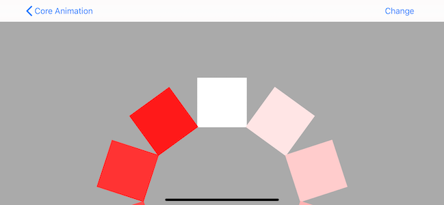

`CAReplicatorLayer`可用于游戏中导弹发射后轨迹、粒子发射效果。此外，还可以用于镜像图片。

设置负值的缩放因子可以获得镜像。这里将其封装为单独视图，后续使用时只需继承自`ReflectionView`即可。

```
class ReflectionView: UIView {
    
    override class var layerClass: AnyClass {
        return CAReplicatorLayer.self
    }
    
    override init(frame: CGRect) {
        super.init(frame: frame)
        
        setup()
    }
    
    required init?(coder: NSCoder) {
        super.init(coder: coder)
        setup()
    }
    
    private func setup() {
        let layer = self.layer as! CAReplicatorLayer
        layer.instanceCount = 2
        
        // Move reflection instance below original and flip vertically
        var transform = CATransform3DIdentity
        let verticalOffset = self.bounds.size.height + 2
        transform = CATransform3DTranslate(transform, 0, verticalOffset, 0)
        transform = CATransform3DScale(transform, 1, -1, 0)
        layer.instanceTransform = transform
        
        // Reduce alpha of reflection layer
        layer.instanceAlphaOffset = -0.6
    }
}
```

效果如下：

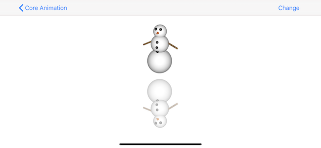

开源项目[ReflectionView](https://github.com/nicklockwood/ReflectionView)实现了自适应渐变淡出效果，淡出效果使用`CAGradientLayer`和 mask 实现。

## 5. CAScrollLayer

对于没有进行变换的 layer，`bounds`的大小与`frame`的大小一致。`frame`是由`bounds`、`position`派生而来。因此，改变一个会影响另一个。

如果想展示大图层的一部分应该如何做？例如，有一个很大的图片，或者一个长列表、文本，希望用户可以随意滑动。在 iOS 中，可以使用`UITableView`或`UIScrollView`，Core Animation 中对应的 layer 是什么呢？

想要展示大图一部分时，可以使用`contentsRect`属性，但当你的图层有 sublayer 时，每次滑动时都需要手动计算、更新所有 sublayer 位置，这样非常麻烦。

这时可以使用`CAScrollLayer`，`CAScrollLayer`的`scroll(to:)`方法自动调整`bounds`的原点，使图层内容看起来是在滑动。由于 Core Animation 不能识别用户手势，因此其不能将手势转换为滑动事件，另外也不会渲染滑动状态条和滑动弹性效果。

下面使用`CAScrollLayer`创建一个类似`UIScrollView`的替代控件。创建一个自定义`UIView`，使用`CAScrollLayer`作为 backing layer，使用`UIPanGestureRecognizer`处理手势。代码如下：

```
class ScrollView: UIView {
    
    override class var layerClass: AnyClass {
        return CAScrollLayer.self
    }
    
    private func setup() {
        // Enable clipping
        layer.masksToBounds = true
        backgroundColor = UIColor.lightGray
        
        // Attach pan gesture recognizer
        let recognizer = UIPanGestureRecognizer(target: self, action: #selector(self.pan(_:)))
        addGestureRecognizer(recognizer)
    }
    
    override init(frame: CGRect) {
        super.init(frame: frame)
        
        setup()
    }
    
    required init?(coder: NSCoder) {
        super.init(coder: coder)
        
        setup()
    }
    
    @objc func pan(_ recognizer: UIPanGestureRecognizer) {
        // Get the offset by subtracting the pan gesture
        // Transform from the current bounds origin
        var offset = self.bounds.origin
        offset.x -= recognizer.translation(in: self).x
        offset.y -= recognizer.translation(in: self).y
        
        // Scroll the layer
        layer.scroll(offset)
        
        // Reset the pan gesture translation
        recognizer.setTranslation(CGPoint.zero, in: self)
    }
}
```

如下所示：

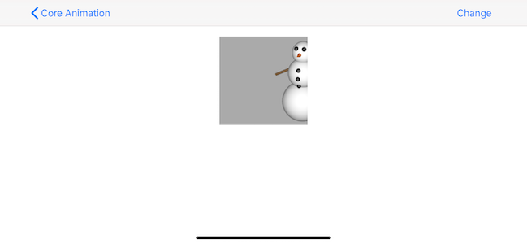

`CAScrollLayer`类的以下方法实现了滚动功能：

- `scroll(to: CGPoint)`：将 layer 的原点设置为指定点。
- `scroll(to: CGRect)`：滚动内容，确保指定矩形区域可见。

我们使用`CAScrollLayer`实现的 ScrollView 类没有进行任何边界检测，内容可能会划出可见区域并可继续滚动。`CAScrollLayer`没有`UIScrollView`中`contentSize`概念，因此没有总可滑动区域概念。也就是划动`CAScrollLayer`时，它只是调整`bounds`原点到指定位置。

既然可以通过调整`CALayer`的`bounds`获得同样效果，什么情况下需要使用`CAScrollLayer`？事实上很少使用`CAScrollLayer`，`UIScrollView`没有使用`CAScrollLayer`，而是直接操控 layer 的`bounds`进行滚动。

## 6. CATiledLayer

有时需要绘制的图片特别大，而移动设备内存非常有限，因此读取整个图片到内存不是一种好的解决方案。

载入大图会非常慢，常用的`init(named:)`和`contentsOfFile:`方法会堵塞主线程，导致卡顿。图片最大大小受设备内存限制。屏幕上显示的图片最终都会被转换为 OpenGL texture，而 OpenGL texture 有一个最大的大小（通常为2048\*2048或4096\*4096，因设备而异）。

如果要显示的图片大于单个 texture，即使图片已经存在于内存中了，Core Animation 也必须使用 CPU 而非 GPU 处理图片，这时会明显感受到内存问题。

`CATiledLayer`通过把大图分割为小图解决上述性能问题。当需要渲染更多区域时，在一个或多个后台线程调用`draw(in:)`方法，为绘制操作提供数据。Drawing context 提供了 clip bounds 和 transform matrix，用于确定请求图块的分辨率和 bounds。

使用`setNeedsDisplay(_:)`方法使图层指定区域无效，但更新是异步的。且下一次的更新很可能不包含更新的内容，但后续的更新会包含。

#### 6.1 显示多个小图

下面展示一张大图（2048\*2048）。为了获得`CATiledLayer`的性能提升，需将大图分割为多张小图。虽然可以使用代码分割图片，但如果在运行时加载图片并分割，将会失去`CATiledLayer`提供的性能提升。这里直接使用分割好的小图，小图大小为256\*256，共64张。

把`CATiledLayer`添加到`UIScrollView`使用，并实现`draw(in:)`方法。当`CATiledLayer`需要加载新图片时，会调用`draw(in:)`方法。

```
    private func testTiledLayer() {
        view.addSubview(scrollView)
        
        // Add the tiled layer
        let tileLayer = CATiledLayer()
        tileLayer.frame = CGRect(x: 0, y: 0, width: 2048, height: 2048)
        tileLayer.delegate = self
        scrollView.layer.addSublayer(tileLayer)
        
        // Configure the scroll view.
        scrollView.contentSize = tileLayer.frame.size
        
        // Draw layer
        tileLayer.setNeedsDisplay()
    }
    
extension LayersViewController: CALayerDelegate {
    func draw(_ layer: CALayer, in ctx: CGContext) {
        guard let layer = layer as? CATiledLayer else  {
            return
        }
        
        // Determine tile coordinate
        let bounds = ctx.boundingBoxOfClipPath
        let x: Int = Int(floor(bounds.origin.x / layer.tileSize.width))
        let y: Int = Int(floor(bounds.origin.y / layer.tileSize.height))
        
        // Load tile image
        let imgName = "Snowman_0\(x)_0\(y)"
        let imgPath = Bundle.main.path(forResource: imgName, ofType: "jpg")
        guard let imgLocation = imgPath else { return }
        let tileImage = UIImage(contentsOfFile: imgLocation)
        
        // Draw tile
        UIGraphicsPushContext(ctx)
        tileImage?.draw(in: bounds)
        UIGraphicsPopContext()
    }
}
```

如下所示：

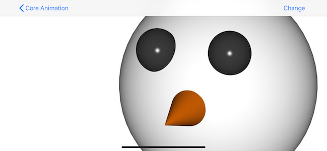

当滑动图片，会发现`CATiledLayer`载入小图的时候会淡入到屏幕中，这是`CATiledLayer`的默认行为，可以使用`fadeDuration`属性改变淡入时长或直接禁用掉。`CATiledLayer`不同于大部分`UIKit`和 Core Animation API，它支持多线程绘制，`draw(in:)`方法可能在多线程并行调用，需确保该方法内的绘制代码线程安全。

> 不要尝试直接修改`CATiledLayer`的`contents`属性，因为这样会禁用它的异步机制，使其和普通的`CALayer`没有区别。

## 7. CAEmitterLayer

`CAEmitterLayer`是一个高性能的粒子引擎，用来创建实时粒子动画。例如，烟雾、火、雨等。

`CAEmitterLayer`是`CAEmitterCell`实例的容器，`CAEmitterCell`定义了粒子效果。创建一个或多个`CAEmitterCell`对象作为不同类型粒子的模版，`CAEmitterLayer`基于模版产生粒子流。

`CAEmitterCell`继承自`NSObject`，和`CALayer`非常类似。`CAEmitterCell`的`contents`属性可以定义为一个`CGImage`，还有很多属性用于配制粒子的外观和行为。这里不会详细介绍每一个属性，你可以在`CAEmitterCell`文档中查看详细介绍。

下面创建拥有不同速度、透明度的粒子，以视图中心为`emitterPosition`向四周发射的爆炸效果。

```
        // Create particle emitter layer
        var replicatorLayer = CAReplicatorLayer()
        emitter.position = view.layer.position
        emitter.bounds = view.bounds
        view.layer.addSublayer(emitter)

        // Configure emitter
        emitter.renderMode = .additive
        emitter.emitterPosition = view.center

        // Create a particle template
        let cell = CAEmitterCell()
        cell.contents = UIImage(named: "Spark")?.cgImage
        cell.birthRate = 150
        cell.lifetime = 5
        cell.color = UIColor(red: 1.0, green: 0.5, blue: 0.1, alpha: 1.0).cgColor
        cell.alphaSpeed = -0.4
        cell.velocity = 50
        cell.velocityRange = 50
        cell.emissionRange = .pi * 2.0

        // Add particle template to emitter
        emitter.emitterCells = [cell]
```

如下所示：

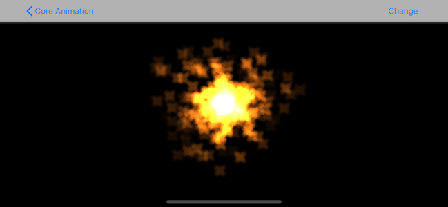

`CAEmitterCell`属性可分为三类：

- 属性初始值，如`color`属性指定一个可以混合`contents`图片的颜色。在上述示例中，`color`被设置为橘色。
- 属性的变化范围。上述示例中，`emissionRange`被设置为360度，表示粒子可以向任意方向发射，粒子之间角度具有一定差值。可以通过设置一个小角度创建锥形效果。
- 属性随时间的变化。上述示例中，`alphaSpeed`值为`-0.4`，表示粒子的`alpha`每秒减少0.4，创建一种粒子远离过程中逐渐消失的效果。

`CAEmitterLayer`属性控制整个粒子系统的位置和形状。`CAEmitterLayer`的有些属性与`CAEmitterCell`属性相同，设置`CAEmitterLayer`的属性后，会与`CAEmitterCell`属性相乘。使用`CAEmitterLayer`属性可以控制整个粒子系统效果。还有以下两个重要属性：

- preservesDepth：定义是否将粒子展平到平面中，默认为`false`。如果为`true`，则该图层将其粒子渲染为位于该图层上层的三维坐标空间。启用后，layer 的`filters`、`backgroundFilters`和阴影相关属性效果是未定义的。
- renderMode：控制粒子图层在视觉上如何融合，默认值为`unordered`。示例中使用`additive`，即重叠部分亮度增加。

> 像`CAEmitterLayer`的`scale`、`seed`、`spin`等属性乘数，只影响新创建的粒子，已经发射出粒子不受影响。例如，emitter 的`scale`值为1，发射一些粒子后修改`scale`为2。此时，已经发射出去的粒子大小不受影响，仍保持原来大小，新创建的粒子大小变为原来二倍。

## 总结

这一部分介绍了多种图层，以及使用这些图层可以实现的效果。像`CATiledLayer`、`CAEmitterLayer`等类都可以单独写成一篇文章，这里只作简单介绍。另外，`CATextLayer`、`CAMetaLayer`、`AVPlayerLayer`也是`CALayer`的子类，这篇文章并未介绍，可以自行查阅文档。

`CALayer`并没有针对所有情况都进行性能优化。如果想要达到最佳性能，需根据需求选择合适子类。下一篇文章[CAAnimation：属性动画CABasicAnimation、CAKeyframeAnimation以及过渡动画、动画组](https://github.com/pro648/tips/blob/master/sources/CAAnimation%EF%BC%9A%E5%B1%9E%E6%80%A7%E5%8A%A8%E7%94%BBCABasicAnimation%E3%80%81CAKeyframeAnimation%E4%BB%A5%E5%8F%8A%E8%BF%87%E6%B8%A1%E5%8A%A8%E7%94%BB%E3%80%81%E5%8A%A8%E7%94%BB%E7%BB%84.md)将介绍显式动画。

Demo名称：CoreAnimation  
源码地址：<https://github.com/pro648/BasicDemos-iOS/tree/master/CoreAnimation>

> 上一篇：[CGAffineTransform和CATransform3D](https://github.com/pro648/tips/blob/master/sources/CGAffineTransform%E5%92%8CCATransform3D.md)
>
> 下一篇：[CAAnimation：属性动画CABasicAnimation、CAKeyframeAnimation以及过渡动画、动画组](https://github.com/pro648/tips/blob/master/sources/CAAnimation%EF%BC%9A%E5%B1%9E%E6%80%A7%E5%8A%A8%E7%94%BBCABasicAnimation%E3%80%81CAKeyframeAnimation%E4%BB%A5%E5%8F%8A%E8%BF%87%E6%B8%A1%E5%8A%A8%E7%94%BB%E3%80%81%E5%8A%A8%E7%94%BB%E7%BB%84.md)

参考资料：

1. [Introduction to 3D drawing in Core Animation (Part 1)](https://www.thinkandbuild.it/introduction-to-3d-drawing-in-core-animation-part-1/)

   