> 这是 Core Animation 的系列文章，介绍了 Core Animation 的用法，以及如何进行性能优化。
>
> 1. [CoreAnimation基本介绍](https://github.com/pro648/tips/blob/master/sources/CoreAnimation%E5%9F%BA%E6%9C%AC%E4%BB%8B%E7%BB%8D.md)
> 2. [CGAffineTransform和CATransform3D](https://github.com/pro648/tips/blob/master/sources/CGAffineTransform%E5%92%8CCATransform3D.md)
> 3. [CALayer及其各种子类](https://github.com/pro648/tips/blob/master/sources/CALayer%E5%8F%8A%E5%85%B6%E5%90%84%E7%A7%8D%E5%AD%90%E7%B1%BB.md)
> 4. [CAAnimation：属性动画CABasicAnimation、CAKeyframeAnimation以及过渡动画、动画组](https://github.com/pro648/tips/blob/master/sources/CAAnimation%EF%BC%9A%E5%B1%9E%E6%80%A7%E5%8A%A8%E7%94%BBCABasicAnimation%E3%80%81CAKeyframeAnimation%E4%BB%A5%E5%8F%8A%E8%BF%87%E6%B8%A1%E5%8A%A8%E7%94%BB%E3%80%81%E5%8A%A8%E7%94%BB%E7%BB%84.md)
> 5. [图层时间CAMediaTiming](https://github.com/pro648/tips/blob/master/sources/%E5%9B%BE%E5%B1%82%E6%97%B6%E9%97%B4CAMediaTiming.md)
> 6. [计时器CADisplayLink](https://github.com/pro648/tips/blob/master/sources/%E8%AE%A1%E6%97%B6%E5%99%A8CADisplayLink.md)
> 7. [影响动画性能的因素及如何使用 Instruments 检测](https://github.com/pro648/tips/blob/master/sources/%E5%BD%B1%E5%93%8D%E5%8A%A8%E7%94%BB%E6%80%A7%E8%83%BD%E7%9A%84%E5%9B%A0%E7%B4%A0%E5%8F%8A%E5%A6%82%E4%BD%95%E4%BD%BF%E7%94%A8%20Instruments%20%E6%A3%80%E6%B5%8B.md)
> 8. [图像IO之图片加载、解码，缓存](https://github.com/pro648/tips/blob/master/sources/%E5%9B%BE%E5%83%8FIO%E4%B9%8B%E5%9B%BE%E7%89%87%E5%8A%A0%E8%BD%BD%E3%80%81%E8%A7%A3%E7%A0%81%EF%BC%8C%E7%BC%93%E5%AD%98.md)
> 9. [图层性能之离屏渲染、栅格化、回收池](https://github.com/pro648/tips/blob/master/sources/%E5%9B%BE%E5%B1%82%E6%80%A7%E8%83%BD%E4%B9%8B%E7%A6%BB%E5%B1%8F%E6%B8%B2%E6%9F%93%E3%80%81%E6%A0%85%E6%A0%BC%E5%8C%96%E3%80%81%E5%9B%9E%E6%94%B6%E6%B1%A0.md)

上一篇文章[CoreAnimation基本介绍](https://github.com/pro648/tips/blob/master/sources/CoreAnimation%E5%9F%BA%E6%9C%AC%E4%BB%8B%E7%BB%8D.md)介绍了`CALayer`的基本特性、几何信息、图层树状态，以及`CALayer`和`UIView`区别。这篇文章将介绍`CGAffineTransform`和`CATransform3D`，`CGAffineTransform`在二维层面操控图层，`CATransform3D`在三维层面操控图层。

## 1. 仿射变换 Affine Transform

2D 图像常见坐标变换如下：

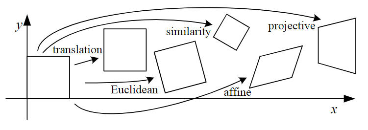

`CGAffineTransform`仿射变换矩阵（Affine transformation matrix）用于绘制2D图形。可以旋转（rotate）、缩放（scale）、平移（translate）或倾斜（skew）图形，`CGAffineTransform`提供了创建、连接、添加仿射变换的功能。

仿射变换由 3*3 的矩阵表示：

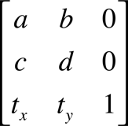

因为第三列永远是(0, 0, 1)，`CGAffineTransform`数据结构只有前两列包含数据。

仿射变换将图形中每个点的行向量乘以该矩阵，从而产生代表相应点(x<sup>'</sup>,  y<sup>'</sup>)的向量。

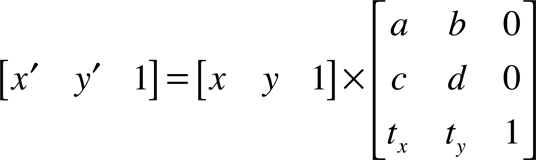

如果矩阵是 3*3 的，可以使用下面公式将点(x, y)从原来坐标系转换到另一坐标系(x<sup>'</sup>, y<sup>'</sup>)。即：将矩阵每一列的值乘以行向量，并将结果相加。

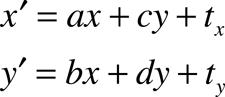

矩阵可以连接两个坐标系统，即指定一个坐标系中的点如何映射到另一个坐标系中。

通常，不需要直接创建 matrix。如需对图形进行缩放、旋转，一般借助 Core Graphics 提供的`translateBy(x:y:)`、`scaleBy(x:y:)`或`rotate(by:)`方法即可，无需手动创建矩阵。

对 layer 添加变换矩阵后，每个点都会执行变换，进而产生新的四边形。`CGAffineTransform`中的仿射（affine）表示无论矩阵使用什么值，变换前平行的线变换后依然平行。下图显示了 affine transform 和 nonaffine transform：

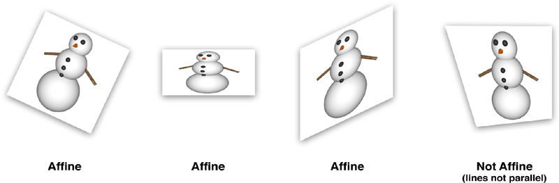

#### 1.1 创建 CGAffineTransform

这篇文章不会对矩阵进行全面介绍，如果你对矩阵不了机，可以自行搜索相关资料。Core Graphics 提供了创建仿射变换的简便方法，无需开发者进行复杂的数学计算。

- `init(rotationAngle:)`：返回一个将坐标系旋转指定弧度的矩阵。在 iOS 中，正数逆时针旋转，负数顺时针旋转。macOS 与 iOS 相反。
- `init(scaleX:y:)`：返回一个将坐标系缩放指定值的矩阵。
- `init(translationX:y:)`返回一个将坐标系平移指定值的矩阵。

`UIView`的`transform`属性是`CGAffineTransform`类型的。`CALayer`的`transform`是`CATransform3D`类型的，并非`CGAffineTransform`类型的，与`UIView`的`transform`属性对应的是`affineTransform`属性。

使用下面代码对 layer 进行旋转：

```
        if modified {
            imgLayer.setAffineTransform(CGAffineTransform(rotationAngle: -1))
        } else {
            imgLayer.setAffineTransform(CGAffineTransform(rotationAngle: 1))
        }
```

效果如下：

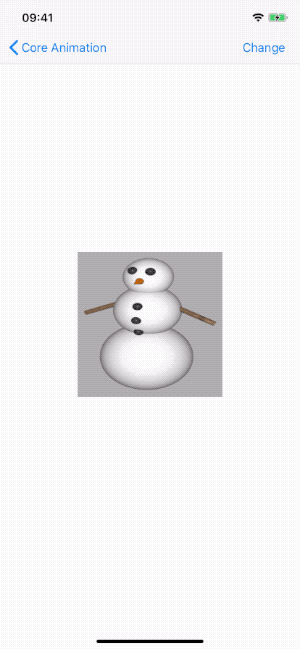

在 iOS 中，transform 函数使用弧度（radian）而非度（degree）作为角度单位。通常使用数学常数π (pi)来指定弧度，π弧度等于180度。

#### 1.2 组合变换

Core Graphics 提供了对矩阵进一步变换的功能。当想要创建既缩放又旋转等多个操作的矩阵时会非常有用。

当管理矩阵时，先创建一个不执行任何转换的矩阵，称为单位矩阵。Core Graphics 提供了创建的简便方法`CGAffineTransform.identity`。

如果想合并两个现有的矩阵，则可以使用`concatenating(_:)`方法。

```
        let t1 = CGAffineTransform.identity
        let t2 = CGAffineTransform.identity
        let t3 = t1.concatenating(t2)
```

> 可以通过多次拼接，将多个矩阵合并为一个矩阵。

在数学中，A\*B 等价于 B\*A。矩阵中 A\*B 可能不等于 B\*A。下面的代码中，改变添加 transform 顺序，得到不同结果。

```
            var transform = CGAffineTransform.identity
            // 先旋转，后平移。
            transform = transform.rotated(by: .pi / 4)
            transform = transform.translatedBy(x: 100, y: 0)
            purpleLayer.transform = transform
            
            // 先平移，后旋转。
            transform = CGAffineTransform.identity
            transform = transform.translatedBy(x: 100, y: 0)
            transform = transform.rotated(by: .pi / 4)
            redLayer.transform = transform
```

效果如下：

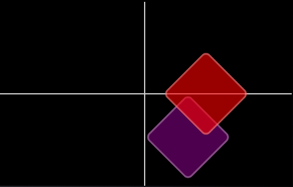

可以看到，transformation 的顺序决定了对象的最终位置。

紫色 layer 先旋转，改变了自身坐标系，之后在新的坐标系中平移紫色 layer。下图详细说明了变换过程：

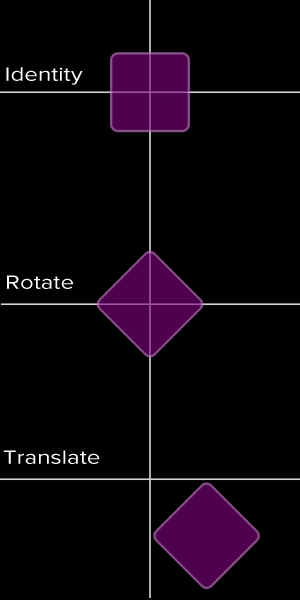

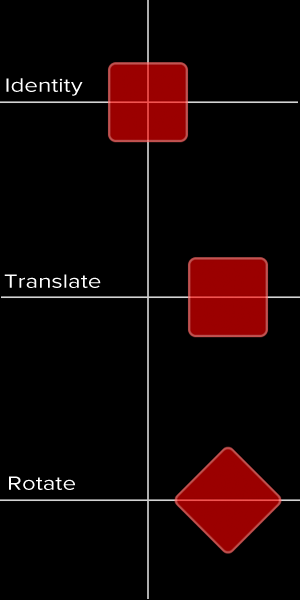

这也意味着，添加 transform 的顺序会影响最终结果。平移后旋转，与旋转后平移效果不同。

#### 1.3 剪切变换 The Shear Transform

Core Graphics 提供了常用矩阵函数，很少需要手动设置`CGAffineTransform`字段。创建剪切变换需手动设置`CGAffineTransform`字段。

剪切变换是仿射变换的一种，与平移、旋转、缩放相比，更少使用。这可能是 Core Graphics 没有内置剪切变换函数的原因。

剪切变换效果如下：

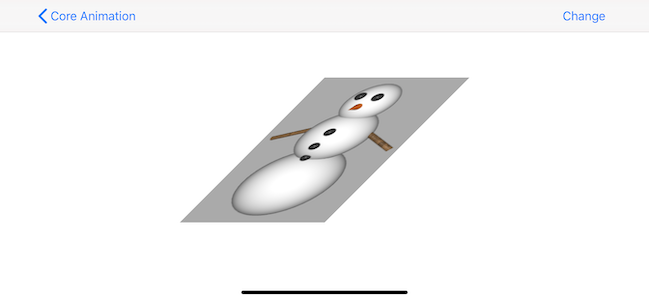

实现如下：

```
    /// 剪切变换
    private func testShearTransform() {
        if modified {
            imgLayer.setAffineTransform(CGAffineTransform.identity)
        } else {
            imgLayer.setAffineTransform(makeShear(with: 1, y: 0))
        }
    }
    
    private func makeShear(with x:CGFloat, y: CGFloat) -> CGAffineTransform {
        var transform = CGAffineTransform.identity
        transform.c = -x
        transform.b = -y
        return transform
    }
```

## 2. 3D 变换

Core Graphics 是 2D 绘制 API，`CGAffineTransform`只用于 2D 变换。`CATransform3D`允许在三维空间操控 layer。

`CATransform3D`是个 4*4 矩阵，能够对任意点进行 3D 变换。

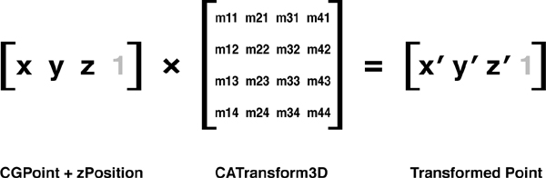

Core Animation 提供了一系列函数，可用于创建、管理`CATransform3D`矩阵。这一点与`CGAffineTransform`矩阵类似，但`CATransform3D`额外提供了 z 轴。

创建`CATransform3D`简便方法如下：

- `CATransform3DMakeRotation(angle, x, y, z)`：返回围绕向量(x, y, z) 旋转 angle 弧度的变换。
- `CATransform3DMakeScale(sx, sy, sz)`：返回缩放比例为(sx, sy, sz) 的变换。
- `CATransform3DMakeTranslation(tx, ty, tz)`：返回平移为 (tx, ty, tz) 的变换。

我们已经很熟悉x、y轴，z 轴垂直于x、y轴，并向外延伸。

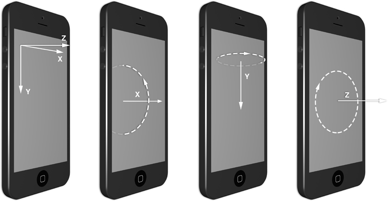

z 轴的旋转与 2D 仿射旋转效果一致。绕x、y轴的旋转，会出现 layer 从屏幕消失的视觉效果。

下面的代码绕 y 轴旋转45度，期望出现视图向右倾斜的效果：

```
            imgLayer.transform = CATransform3DMakeRotation(.pi / 4.0, 0, 1, 0)
```

效果如下：

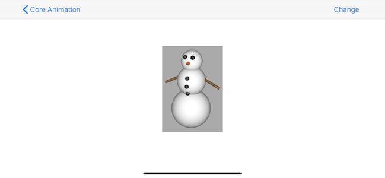

看不出上图有旋转的效果，更像是横向压缩。这是因为我们是面向屏幕观看的，没有透视（perspective）。

> 如果旋转180度，你会发现图片变成了原来的镜面。这是因为 layer 是双面的，反面是镜面。如果 layer 内容是文字，这会非常奇怪。`CALayer`有一个`doubleSided`属性，默认为 true，即默认背面也绘制内容。

#### 2.1 透视投影 Perspective Projection

在现实世界中，当物体距离变远时，由于视角的原因物体看起来在逐渐变小。距离我们远的一侧小一些、近的一侧大一些更接近真实世界。

在技术制图和工程制图中，在二维平面呈现三维物体的方法，属于轴测投影的一种，三条坐标轴的投影缩放比例相同，并且任意两条坐标轴投影之间的角度都是120度，称之为等轴测投影（Isometric projection）。

在等轴测投影中，距离较远的物体与距离较近的物体比例相同。可用于建筑图纸、从上向下视角的伪3D游戏，但不是我们目前需要的。

为解决此问题，还需修改变换矩阵以包含透视变换，也称为z变换。`CATransform3D`的`m34`控制着透视效果，`m34`的值在变换计算中用于按比例缩放x和y的值，其反映了距离视点的距离。

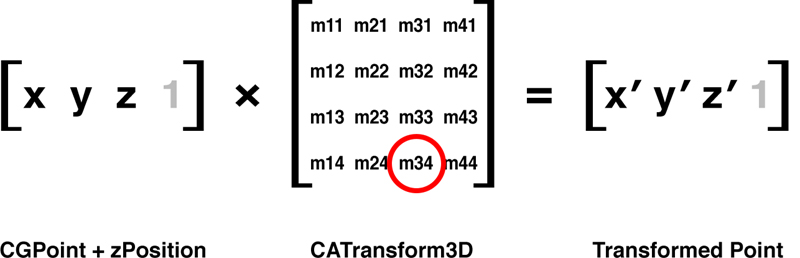

`m34`默认值为0，为其赋值 -1.0/d 以添加透视投影，d 为设想中视点与屏幕的距离，单位为 point。通常，500到1000之间会有很好效果，有时大值或小值对某些 layer 排布效果更好，减少距离可以增加透视效果。因此，很小的值看起来会非常失真，而很大的值看起来就像根本没有透视。

为矩阵添加透视：

```
            var transform = CATransform3DIdentity
            transform.m34 = -1.0 / 500.0
            transform = CATransform3DRotate(transform, .pi / 4.0, 0, 1, 0)
            
            imgLayer.transform = transform
```

效果如下：

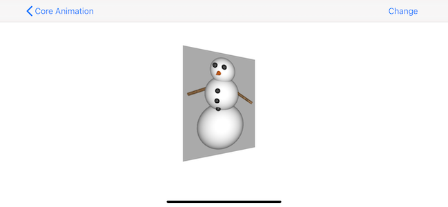

#### 2.2 消失点

当沿着铁路线去看两条铁轨，或者沿着公路线看两遍整齐的树木时，其连线相交于很远很远的某一点，这点在透视投影中称为消失点（vanishing point），又称为灭点。

在真实世界中，消失点一般位于视野的中心。想要在 app 中添加灭点效果，灭点应位于屏幕中心，或者包含所有 3D 视图的中心。

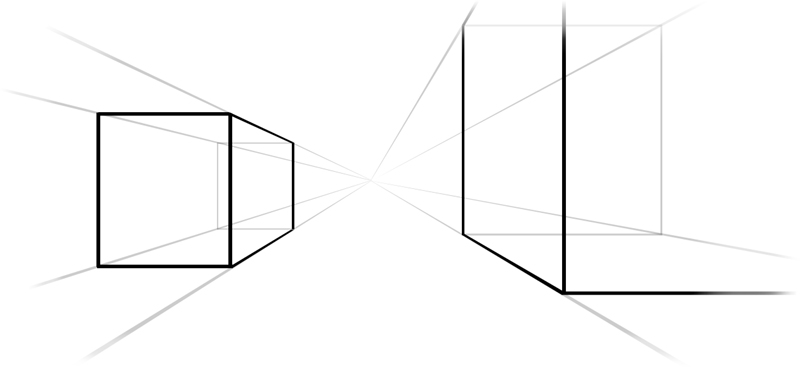

Core Animation 消失点位于未进行变换的 layer 的`anchorPoint`处。如果图层添加了平移变换，layer 平移到了其他位置，`anchorPoint`仍然位于平移前位置，灭点也位于平移前的位置。

改变`position`属性会修改 vanishing point。因此，想要修改 layer 的`m34`属性时，应先将 layer 放置于屏幕中心，后使用 translation transform 平移 layer 到目标位置，这样其可以与其他 3D 图层共享同一个消失点。

###### 2.2.1 sublayerTransform

如果有多个 view 或 layer，每个都需添加 3D 变换，则必须对所有 view、layer 应用相同`m34`，并确保变换前处于屏幕中心同样位置。可以通过同一函数创建位于同一位置的 view、layer，但下面有更好的方法。

`CALayer`的`sublayerTransform`属性是`CATransform3D`类型，但其不是 transform 当前 layer，而是添加到 sublayer。因此，你可以为一个容器 layer 添加 perspective transform，所有子图层都会自动继承该 perspective 。

使用`sublayerTransform`的另一好处是子图层的消失点为 container layer 的中点，这样就无需将 layer 放到屏幕中心再平移，可以直接使用`position`和`frame`布局 layer。

下面示例使用左右各一张图片，设置其 container layer 的 perspective transform，这样左右图片的 perspective 和 vanishing point 相同。

```
    /// sublayerTransform 设置
    private func testSublayerTransform() {
        var perspective = CATransform3DIdentity
        perspective.m34 = -1.0 / 500.0
        view.layer.sublayerTransform = perspective
        
        if modified {
            imgLayer.transform = CATransform3DIdentity
            imgLayer2.transform = CATransform3DIdentity
        } else {
            let transform1 = CATransform3DMakeRotation(.pi/4.0, 0, 1, 0)
            imgLayer.transform = transform1
            
            let transform2 = CATransform3DMakeRotation(-.pi/4.0, 0, 1, 0)
            imgLayer2.transform = transform2
        }
    }
```

效果如下：

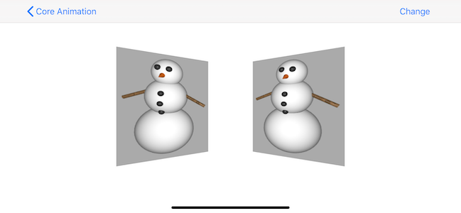

#### 2.3 扁平化图层

如果父图层顺时针变换、子图层逆时针变换，会发生什么？如下图所示：

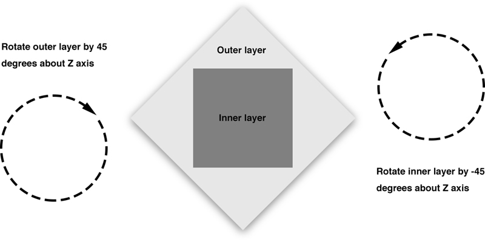

可以看到，Inner layer 逆时针变换后，抵消了 outer layer 的变换。如下所示：

```
            outerLayer.transform = CATransform3DMakeRotation(.pi/4, 0, 0, 1)
            innerLayer.transform = CATransform3DMakeRotation(-.pi/4, 0, 0, 1)
```

效果如下：

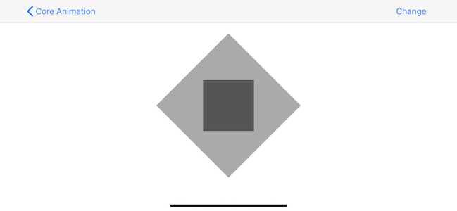

> 如绕 y 轴旋转，会得到 outer layer 倾斜，inner layer 没有任何旋转的视觉效果吗？你可以自行测试。

## 总结

这一篇文章涉及了 2D、3D 变换，学习了一些矩阵数学的知识，以及如何使用 Core Animation 创建 3D 场景，另外，添加图层的顺序决定哪个图层截获触摸事件，与3D空间的 z 轴没有关系。即使图层完全被覆盖，也可能截获触摸事件。

Demo名称：CoreAnimation  
源码地址：<https://github.com/pro648/BasicDemos-iOS/tree/master/CoreAnimation>

> 上一篇：[CoreAnimation基本介绍](https://github.com/pro648/tips/blob/master/sources/CoreAnimation%E5%9F%BA%E6%9C%AC%E4%BB%8B%E7%BB%8D.md)
>
> 下一篇：[CALayer及其各种子类](https://github.com/pro648/tips/blob/master/sources/CALayer%E5%8F%8A%E5%85%B6%E5%90%84%E7%A7%8D%E5%AD%90%E7%B1%BB.md)

参考资料：

1. [变换](https://github.com/qunten/iOS-Core-Animation-Advanced-Techniques/blob/master/5-%E5%8F%98%E6%8D%A2/%E5%8F%98%E6%8D%A2.md)
2. [Explaining the CATransform3D Matrix: Translation, Scale and Rotation (Swift, iOS, Xcode)](https://sketchytech.blogspot.com/2014/12/explaining-catransform3d-matrix.html)
3. [A Swift Perambulation through the World of CATransform3D: Translation, Rotation and Scaling (CALayer, iOS, Xcode)](https://sketchytech.blogspot.com/2014/12/a-swift-perambulation-through-world-of.html)
4. [A Swift Perambulation through the World of CATransform3D (Part II): Concatenation, Inversion and Affine Transforms (CALayer, iOS, Xcode)](https://sketchytech.blogspot.com/2014/12/a-swift-perambulation-through-world-of_2.html)
5. [Explaining the CGAffineTransform Matrix (Swift, Xcode, iOS)](https://sketchytech.blogspot.com/2014/12/explaining-cgaffinetransform-matrix.html)
6. [CATransform3D vs. CGAffineTransform?](https://stackoverflow.com/questions/567829/catransform3d-vs-cgaffinetransform)

