> 这是 Core Animation 的系列文章，介绍了 Core Animation 的用法，以及如何进行性能优化。
>
> 1. [CoreAnimation基本介绍](https://github.com/pro648/tips/blob/master/sources/CoreAnimation%E5%9F%BA%E6%9C%AC%E4%BB%8B%E7%BB%8D.md)
> 2. [CGAffineTransform和CATransform3D](https://github.com/pro648/tips/blob/master/sources/CGAffineTransform%E5%92%8CCATransform3D.md)
> 3. [CALayer及其各种子类](https://github.com/pro648/tips/blob/master/sources/CALayer%E5%8F%8A%E5%85%B6%E5%90%84%E7%A7%8D%E5%AD%90%E7%B1%BB.md)
> 4. [CAAnimation：属性动画CABasicAnimation、CAKeyframeAnimation以及过渡动画、动画组](https://github.com/pro648/tips/blob/master/sources/CAAnimation%EF%BC%9A%E5%B1%9E%E6%80%A7%E5%8A%A8%E7%94%BBCABasicAnimation%E3%80%81CAKeyframeAnimation%E4%BB%A5%E5%8F%8A%E8%BF%87%E6%B8%A1%E5%8A%A8%E7%94%BB%E3%80%81%E5%8A%A8%E7%94%BB%E7%BB%84.md)
> 5. [图层时间CAMediaTiming](https://github.com/pro648/tips/blob/master/sources/%E5%9B%BE%E5%B1%82%E6%97%B6%E9%97%B4CAMediaTiming.md)
> 6. [计时器CADisplayLink](https://github.com/pro648/tips/blob/master/sources/%E8%AE%A1%E6%97%B6%E5%99%A8CADisplayLink.md)
> 7. [影响动画性能的因素及如何使用 Instruments 检测](https://github.com/pro648/tips/blob/master/sources/%E5%BD%B1%E5%93%8D%E5%8A%A8%E7%94%BB%E6%80%A7%E8%83%BD%E7%9A%84%E5%9B%A0%E7%B4%A0%E5%8F%8A%E5%A6%82%E4%BD%95%E4%BD%BF%E7%94%A8%20Instruments%20%E6%A3%80%E6%B5%8B.md)
> 8. [图像IO之图片加载、解码，缓存](https://github.com/pro648/tips/blob/master/sources/%E5%9B%BE%E5%83%8FIO%E4%B9%8B%E5%9B%BE%E7%89%87%E5%8A%A0%E8%BD%BD%E3%80%81%E8%A7%A3%E7%A0%81%EF%BC%8C%E7%BC%93%E5%AD%98.md)
> 9. [图层性能之离屏渲染、栅格化、回收池](https://github.com/pro648/tips/blob/master/sources/%E5%9B%BE%E5%B1%82%E6%80%A7%E8%83%BD%E4%B9%8B%E7%A6%BB%E5%B1%8F%E6%B8%B2%E6%9F%93%E3%80%81%E6%A0%85%E6%A0%BC%E5%8C%96%E3%80%81%E5%9B%9E%E6%94%B6%E6%B1%A0.md)

Core Animation 是一个令人误解的名字，会被误认为只能用来做动画。实际上，Core Animation 是 iOS、macOS上的图形渲染和动画的基础设施，是一个合成引擎（Compositing Engine），以尽可能快的速度将屏幕上的不同视觉内容进行合成。不同内容存储在不同图层（layer），层次结构中的 layer 构成图层树（layer tree）。Layer tree 构成`UIKit`及屏幕上所有内容的基础。

使用 Core Animation 创建动画时，只需配置一些动画参数（如起点、终点），并告诉 Core Animation 开始执行，其余工作由 Core Animation 完成。动画过程中每一帧的绘制都由 Core Animation 完成，Core Animation 将绘制工作交由 GPU 以实现硬件加速。这种自动借助硬件加速功能可以实现高帧率、流畅的动画效果，不会给 CPU 造成负担或影响 app 运行速度。

如果你在开发 iOS app，那么你就在使用 Core Animation。如果你在开发 macOS app，你也可以很方便的使用 Core Animation。Core Animation 位于`AppKit`、`UIKit`之下，集成于 Cocoa、CocoaTouch 工作流中。Core Animation 具有扩展 app 视图功能的接口，并为动画提供更精细化控制。

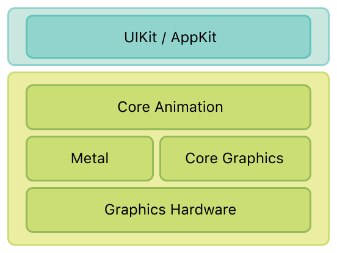

## 1. 基础信息

Core Animation 是对 app 视图和其它视觉元素进行动画处理的通用系统。Core Animation 不是为了替代 view，而是与 view 集成，提供更好的性能和动画效果。Core Animation 通过将 view 内容缓存为位图，以便 GPU 可以直接管理。在某些情况下，由于 Core Animation 的缓存特性，你可能需要重新考虑如何展示、管理 app 内容，但多数情况下，你在没有意识到的情况时就已在使用 Core Animation 了。除了缓存视图内容，Core Animation 还提供了指定视觉内容，将该内容与视图集成，并应用动画的方法。

使用 Core Animation 为 app 的视图和视觉对象进行动画处理，大多数修改与视觉对象的属性有关。例如，可以使用 Core Animation 为视图的位置、大小、不透明度进行动画处理。当进行此类更改时，Core Animation 将在属性当前值和指定值之间进行动画处理。

如果你为 iOS、macOS 开发过app，你就会熟悉 view 的概念。view 是一个用以展示内容（如图片、文本、视频）的矩形对象，可以截取用户输入（如鼠标点击、手势触摸）。view 可以嵌套使用构建复杂层级，每个 view 管理子视图的位置。下面是一个常见的视图层级：

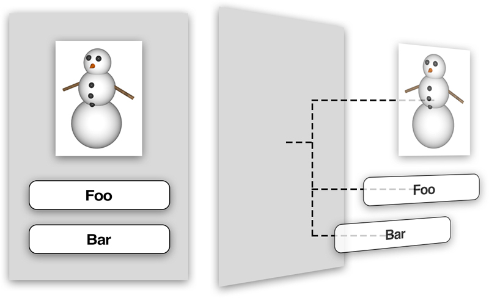

在 iOS 中，view 都继承自同一个基类`UIView`，`UIView`可以处理触摸事件，支持 Core Graphics 绘制、仿射变换、淡入淡出动画等。

`UIView`本身并未处理多数这些任务。渲染、动画都由 Core Animation 的`CALayer`类处理。

#### 1.1 CALayer

`CALayer`在概念上和`UIView`很像，也是矩形对象，可以排布为层级树、包含内容、管理子图层的位置。`CALayer`的属性、方法提供了执行动画、仿射变换的功能。与`UIView`相比，`CALayer`缺少的主要功能是响应用户交互事件。

`CALayer`尽管提供了判断点击位置是否在 layer 内的方法，但其并不清楚具体的响应链。

#### 1.2 平行层级关系

每个`UIView`有一个`CALayer`类型的`layer`属性，被称为backing layer。View 负责创建、管理 layer，以确保子视图添加、移除时，其关联的图层也在相应层级中进行同样操作。

屏幕内容的显示和动画都是由 backing layer 负责的，`UIView`仅仅是它的封装，提供一些针对 iOS 的功能（如响应手势事件）和核心动画底层功能的高级封装。

为什么 iOS 有两个平行层级的`UIView`和`CALayer`？为什么不使用一个层级处理所有事件？同时使用`UIView`和`CALayer`是为了职责分离，避免代码重复。iOS 和 macOS 中事件和用户交互的处理逻辑有很多不同。多点触摸的触控屏与鼠标、键盘控制的完全不同，这也是 iOS 使用`UIKit`的`UIView`，macOS 使用`AppKit`的`NSView`的原因，它们功能相同，但实现方式不同。

在 iOS 和 macOS 中，都有渲染、布局、动画这些共同概念，将这些基础功能独立到 Core Animation framework，可以在 iOS、macOS 间共享代码，方便 Apple 系统开发人员开发系统，以及第三方开发者开发跨平台应用。

> 实际中，这里不是两个平行层级，而是四个平行层级，各自执行不同功能。层级如下：
>
> - 视图层级（View tree）。
> - 图层树（Layer tree）。
> - 呈现树（Presentation Tree）。
> - 渲染树（Render Tree）。

## 2. 图层动画

#### 2.1 Layer 提供了绘制、动画基础功能

Layer 对象是在3D空间中组织的2D画面，是核心动画的核心。与 view 类似，layer 管理几何坐标、内容和视觉属性信息。

###### 2.1.1 基于图层的绘图模型

大部分 layer 并不执行绘制工作。相反，layer 捕获 app 提供的内容，并缓存为位图。随后修改 layer 属性时，只需修改该 layer 对象的状态信息。当修改会触发动画时，Core Animation 将 layer 的位图和状态信息传递给 GPU，GPU 根据传入信息渲染位图。使用硬件操控位图比使用软件快很多。

Core Animation 绘制内容流程如下：

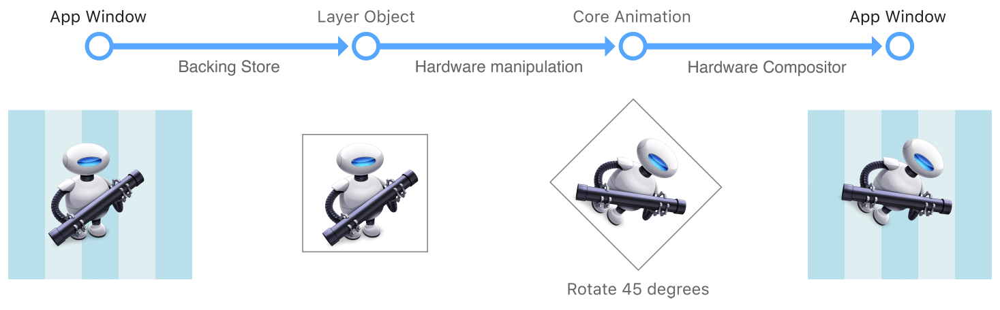

这里操纵的是静态位图，基于 layer 绘制与基于 view 绘制技术有着明显不同。使用基于 view 的绘制时，改变 view 属性会导致调用`draw(_:)`方法重绘视图，这种重绘在主线程使用 CPU 进行，因此非常昂贵。Core Animation 通过在硬件中操控缓存的位图避免这些昂贵开销。

###### 2.1.2 基于图层的动画

Layer 的数据和状态信息与该 layer 在屏幕上的视觉呈现是分离的。这种解耦可以让 Core Animation 将动画从原来状态逐步变更为新状态。

下图显示了部分类型动画：

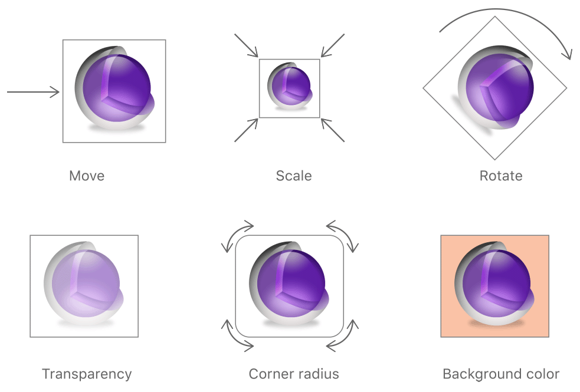

动画过程中，核心动画自动在硬件中完成每一帧的绘制。你只需指定开始、结束位置，Core Animation 负责其他所有工作。也可以指定动画时间信息或其他参数，如果你没有提供这些信息，Core Animation 会采用默认值。

#### 2.2 可动画属性

`CALayer`中的某些可动画属性与`UIView`中可动画属性对应，如`frame`、`position`、`opacity`。

###### 2.2.1 Position and size

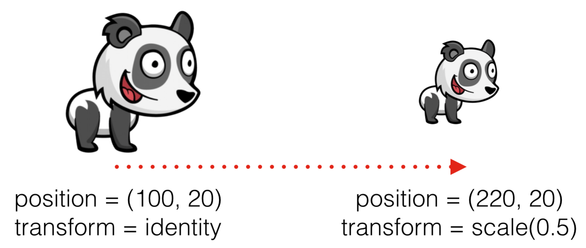

修改 layer 的`position`、`size`、`transform`，会同等修改关联的 view，与直接修改 view 中这些属性动画一样。

- `bounds`：以动画形式修改边框。
- `position`：在父图层中，以动画形式修改图层位置。也可以通过`position.x`、`position.y`只修改一个维度位置。
- `transform`：移动、缩放、旋转图层。使用 layer 的`transform`可以在3D空间使用动画，view 属性动画不能使用3D动画。

`CALayer`可以单独使用，使用以下方法添加到 view：

```
        let layer = CALayer()
        layer.position = view.layer.position
        layer.bounds = CGRect(x: 0, y: 0, width: width * 2, height: width * 2)
        layer.backgroundColor = UIColor.darkGray.cgColor
        view.layer.addSublayer(layer)
```

使用以下代码修改 layer 的`bounds`、`position.y`、`transform`：

```
            layer.bounds = CGRect(x: 0, y: 0, width: width * 2, height: width * 2)
            layer.position.y = layer.position.y + width
            layer.transform = CATransform3DMakeRotation(.pi / 4.0, 0, 0, 1)
```

修改后效果如下：

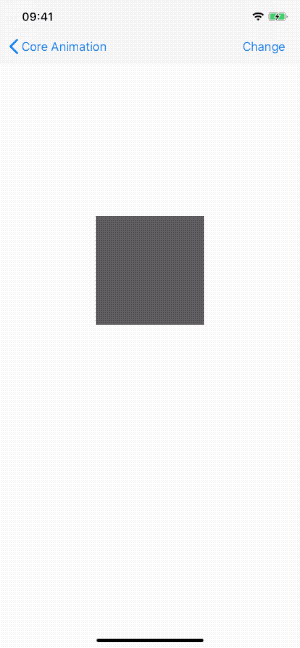

> 虽然`bounds`、`position`类型都是`CGFloat`，但使用时应尽可能使用整数。因为不能把边界放到一个像素的中间或者三分之一等位置，也就是像素不能再被分割。遇到小数时，设备会尽量模拟这种效果，但会耗费性能。

###### 2.2.2 Border

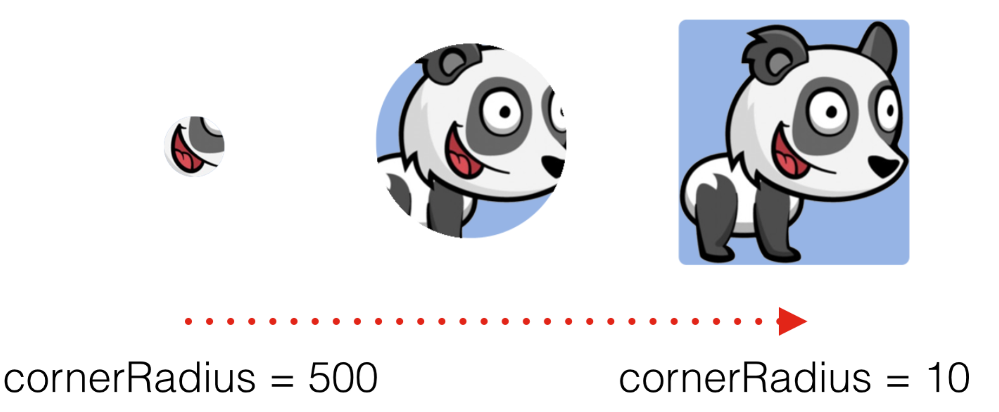

通过修改图层的 border，可以实现动画修改颜色、宽度、拐角半径。

- `borderColor`：修改 border 颜色。
- `borderWidth`：当值大于0时，layer 使用`borderColor`绘制边框。绘制时，从`bounds`向内偏移`borderWith`宽度绘制。边框覆盖在`contents`和子图层之上，包含`cornerRadius`属性效果。`borderWidth`默认值为0.0。
- `cornerRadius`：当值大于0时，layer 开始使用圆角裁剪背景。默认情况下，`cornerRadius`不裁剪`contents`，只对`backgroundColor`和 border有效。当`masksToBounds`属性为`true`时，`contents`会被裁减为圆角。`cornerRadius`默认值为0.0。

`cornerRadius`效果如下：

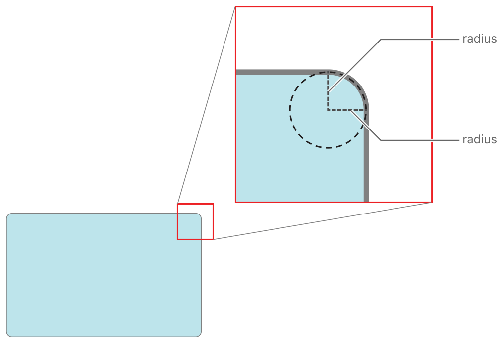

修改方法如下：

```
            layer.borderColor = UIColor.orange.cgColor
            layer.borderWidth = 5
            layer.cornerRadius = 15
```

效果如下：

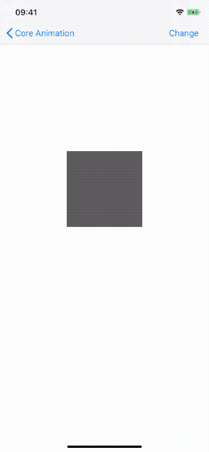

Border 是跟随着图层边界变化的，而不是图层里面的内容。如果子图层超过了边界，边框仍然会沿着图层的边界绘制出来。超出图层边框的`content`和子图层，会显示在 border 之下：

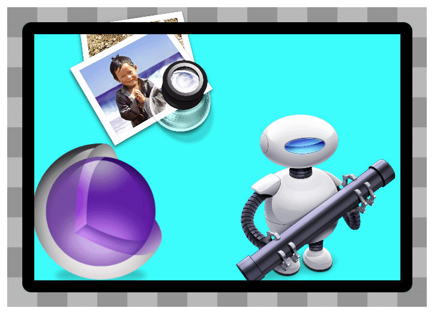

###### 2.2.3 Shadow

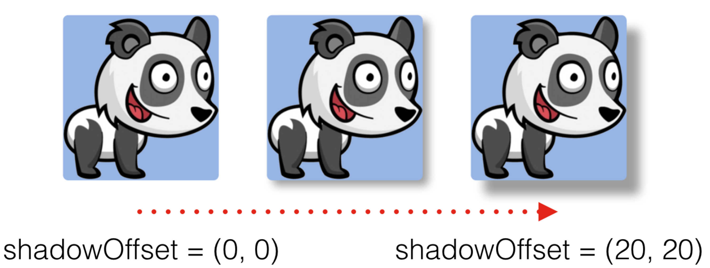

可以修改`shadow`的以下属性：

- `shadowOffset`：layer 阴影偏移量。默认为(0.0, -3.0)。
- `shadowOpacity`：阴影的不透明度。`shadowOpacity`值范围是0.0（透明，即不显示阴影）至1.0（不透明）。该值默认为0.0。
- `shadowPath`：修改 layer 的阴影形状。`shadowPath`属性默认值为`nil`，这时采用标准的阴影形状。如果为`shadowPath`属性指定了值，layer 会采用该值生成阴影。path 定义了阴影的边框，内容采用`shadowOpacity`、`shadowColor`、`shadowRadius`合成。
- `shadowRadius`：渲染 layer 阴影的模糊半径。默认值为3.0。

使用`shadowOffset`方法如下：

```
            layer.shadowOffset = CGSize(width: 15, height: 20)
            layer.shadowOpacity = 0.5
```

效果如下：

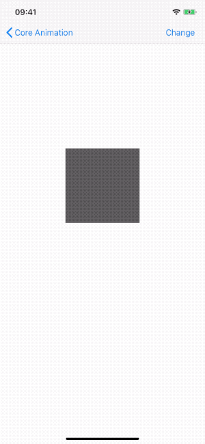

> 如果没有设置`backgroundColor`，shadow 会显示到`content`上；如果有`backgroundColor`，shadow 显示到`content`下，也就是 border 内不显示，只在边框外显示阴影。

使用`shadowPath`不会触发[离屏渲染](https://github.com/pro648/tips/blob/master/sources/%E5%9B%BE%E5%B1%82%E6%80%A7%E8%83%BD%E4%B9%8B%E7%A6%BB%E5%B1%8F%E6%B8%B2%E6%9F%93%E3%80%81%E6%A0%85%E6%A0%BC%E5%8C%96%E3%80%81%E5%9B%9E%E6%94%B6%E6%B1%A0.md#2.%20离屏渲染%20Offscreen%20Rendering)，性能更好。方法如下：

```
            layer.shadowOpacity = 0.8
            
            let shadowHeight: CGFloat = 20
            let shadowPath = CGPath(ellipseIn: CGRect(x: -shadowHeight,
                                                      y: layer.bounds.size.height,
                                                      width: layer.bounds.width + shadowHeight * 2,
                                                      height: shadowHeight),
                                    transform: nil)
            layer.shadowPath = shadowPath
```

效果如下：

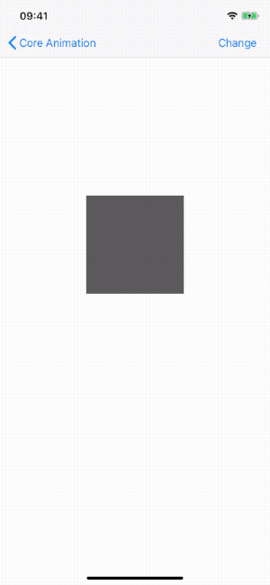

> 使用`masksToBounds`会裁剪掉超出边框所有内容，包含阴影。可以使用两个叠加的 layer 实现阴影效果。

###### 2.2.4 Contents

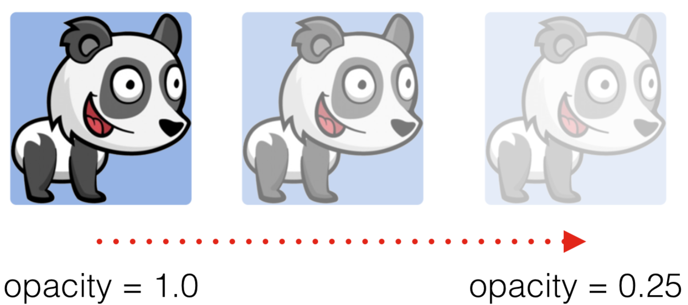

以下属性影响 layer contents 渲染：

- `contents`：将 TIFF 或 PNG 数据赋值给`contents`属性。
- `mask`：用于遮盖图层可见内容的形状或图像。
- `opacity`：不透明度。值范围是0.0（透明的）至1.0（不透明的）。超出范围的值会被限制为最小值或最大值。`opacity`属性默认值为1.0。

`contents`属性用法如下：

```
            layer.contents = UIImage(named: "Ball")?.cgImage
            layer.cornerRadius = 20
            layer.masksToBounds = true
```

效果如下：


上述这些属性只是部分可动画属性，`CALayer`的子类可能有额外可动画属性。[Animatable Properties](https://developer.apple.com/library/archive/documentation/Cocoa/Conceptual/CoreAnimation_guide/AnimatableProperties/AnimatableProperties.html#//apple_ref/doc/uid/TP40004514-CH11-SW1)列出了所有可以使用动画效果的属性。

直接修改 layer 的属性，会使用隐式动画（implicit animation）。隐式动画采用默认时间信息和其他属性执行动画。`UIView`默认禁用了 layer 动画，只在 animation block 内开启了动画。因此，直接修改单独 layer 的上述属性，会以动画形式执行。只有在 animation block 中修改视图属性，才会开启动画。

## 3. Layer 定义了自身的几何信息

Layer 的功能之一就是管理其内容的几何信息。几何信息包含`bounds`、`position`、旋转、缩放和变换等。与 view 类似，layer 也使用`bounds`、`position`信息决定内容位置。此外，Layer 还具有 view 没有的属性，如`anchorPoint`。`anchorPoint`定义了 layer 的锚点。

#### 3.1 Layer 使用两种坐标系统

Layer 同时使用点坐标系（point-based coordinate system）和单位坐标系（unit coordinate system）指定内容位置。根据位置信息类型决定使用哪种坐标系。当映射到屏幕或相对于其他图层时（如`position`），使用点坐标系。当值不应绑定到屏幕时（如`anchorPoint`属性），即相对于其它值的，使用单位坐标系。

Point-based coordinate 最常见用途是指定 layer 的大小和位置，`bounds`属性指定 layer 在屏幕上的大小，`position`属性指定 layer 相对父图层的位置。虽然 layer 也有`frame`属性，但`frame`是从`bounds`和`position`派生而来，很少使用。

`bounds`和`frame`的方向因平台而已。在 iOS 中，`bounds`原点在左上角；在 macOS 中，`bounds`原点在左下角。

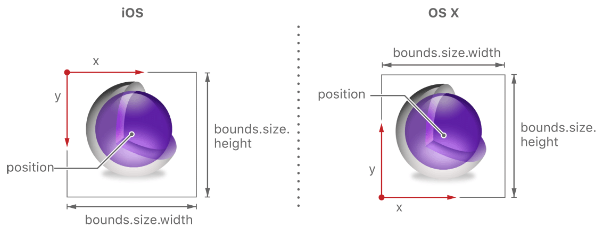

在上图中，`position`位于 layer 的中心，`position`属性随`anchorPoint`而变。`anchorPoint`默认值是(0.5, 0.5)，表示 layer 矩形的中心。所有对 view 的操作均以该点为中心执行。例如，`anchorPoint`为默认值时，旋转围绕中心进行。改变`anchorPoint`后，旋转以新设置点为中心进行。

Anchor point 是少数几个使用单位坐标系的属性之一。单位坐标系值范围是0.0至1.0。例如，在x轴上，左侧为0.0，右侧为1.0。在y轴上，单位坐标系的方向因平台而异。

> `CAGradientLayer`的`startPoint`、`stopPoint`也使用单位坐标系。

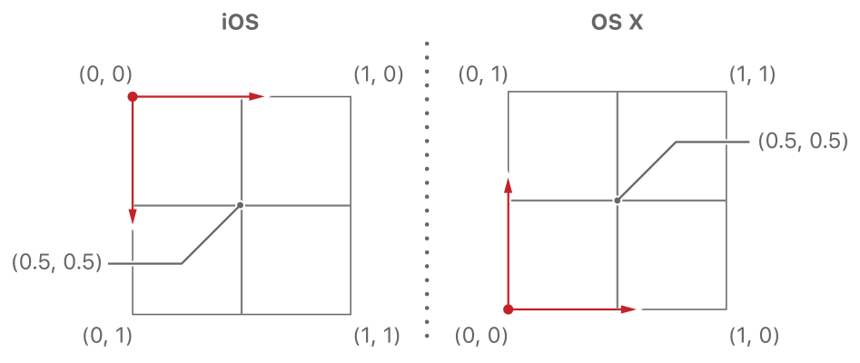

#### 3.2 Anchor point 影响操作几何信息

对几何信息的操作都以 anchor point 为中心进行，使用`anchorPoint`属性获取 layer 的 anchor point。当操作`position`、`transform`时，anchor point 的影响尤为明显。

对 layer 添加旋转变换后，旋转以 anchor point 为中心执行。因为`anchorPoint`默认位于图层中心，旋转围绕中心进行，但可以通过修改`anchorPoint`改变旋转的中心，如下图所示：

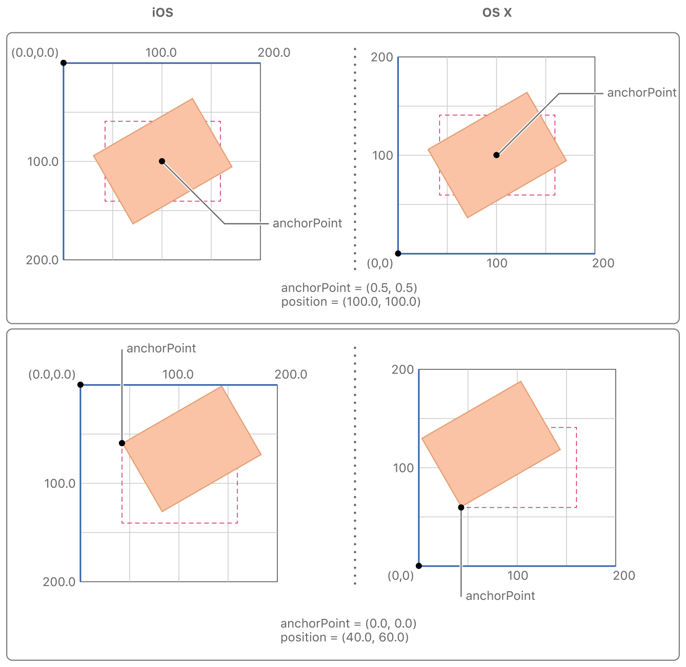

设置 layer 的`anchorPoint`为(0.0, 0.0)，并进行旋转：

```
        layer.anchorPoint = CGPoint(x: 0.0, y: 0.0)
        layer.transform = CATransform3DMakeRotation(.pi / 4.0, 0, 0, 1)
```

效果如下：

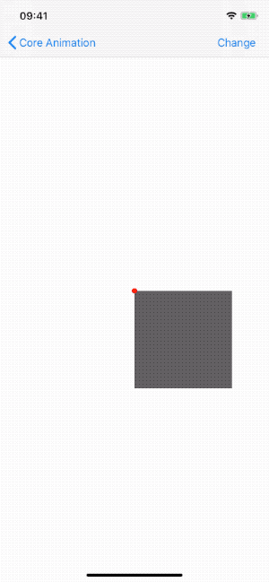


> 可以指定`anchorPoint`的x、y值小于0、大于1，使`anchorPoint`置于图层之外。

视图的`frame`、`bounds`和`center`属性仅仅是存取方法。操纵视图的`frame`时，实际上是在改变位于视图下方`CALayer`的`frame`，不能够独立于图层之外改变视图的`frame`。

对于视图或图层来说，`frame`并不是一个非常清晰的属性，它其实是一个虚拟属性，由`bounds`、`position`和`transform`计算得出。任何一个值变化，`frame`都可能发生变化。改变`frame`同样可能会影响到它们的值。

对图层做变换的时候（如旋转、缩放），`frame`实际上代表了覆盖在图层旋转之后整个轴对齐的矩形区域。此时，`frame`的宽高可能和`bounds`的宽高不一致。


#### 3.3 从三个维度操纵图层

每个 layer 有两个变换矩阵（Transform Matrices），变换矩阵可以用以操纵 layer 和 contents。`CALayer`的`transform`属性指定图层及其子图层的变换矩阵。通常使用`transform`对图层进行临时缩放、旋转、偏移。`sublayerTransform`定义子图层额外的变换矩阵。

Transform 通过将坐标乘以矩阵值，得出变换后的坐标。因为 Core Animation 的值由三个维度指定，每个坐标点有四个值，这些点需乘以4*4矩阵。Core Animation 提供了缩放、偏移、旋转的矩阵。

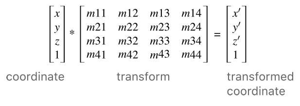

下图显示了一些常见变换矩阵配置。任何矩阵乘以 transform identify，都会返回相同坐标。对于其他转换，根据改变类型选取矩阵。例如，要偏移x轴，提供非零的`tx`，值为0的`ty`、`yz`矩阵。对于旋转，提供合适的 sine 和 cosine 值和旋转角度。

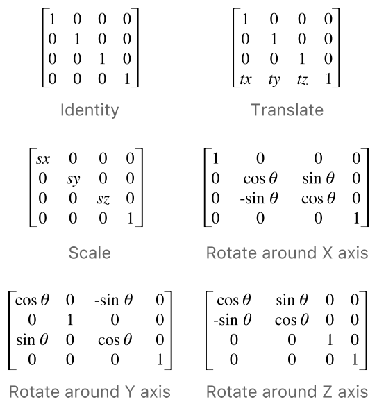

## 4. 图层树反应不同方面的动画状态

使用 Core Animation 的 app 具有三组图层对象，每组对象具有不同作用。

- Model layer tree：app 与 model layer tree 交互最为频繁，存储了动画的目标值。
- Presentation tree：动画进行过程中此刻的值，不要尝试修改 presentation tree 中的值。用该对象读取动画当前位置的值，可以用以从当前位置开启新的动画。
- Render tree：真正执行动画的图层，为 Core Animation 私有。

每一组图层都组织为一个层次结构。对于所有图层都关联视图的应用，图层和视图的初始层次结构相同。想要避免视图相关开销，且确定不需要视图相关功能时，可以单独创建、添加图层。下图显示了一个 iOS app 分解图。窗口包含一个 content view，content view 包含 button view 和两个 layer 对象。layer 层级如下：

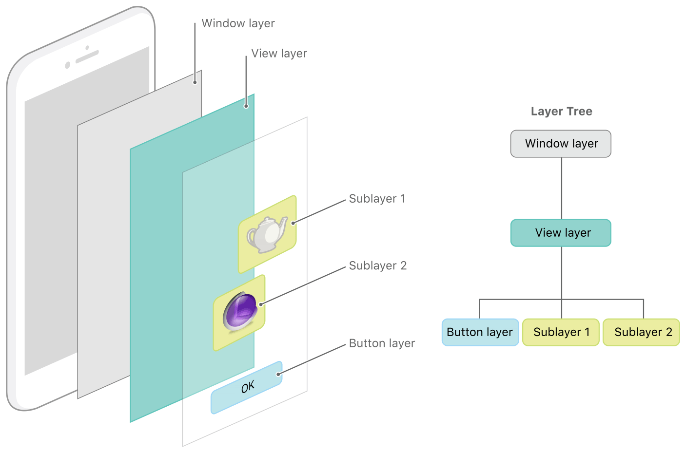

Layer tree 中的对象，在 presentation tree 和 render tree 中有对应对象。App 主要使用 layer tree 中图层，有时使用 presentation tree 中对象。通过 layer tree 对象的`presentation()`属性获取 presentation tree 中对应的 layer，这样可以获取到动画此刻的值。如下所示：

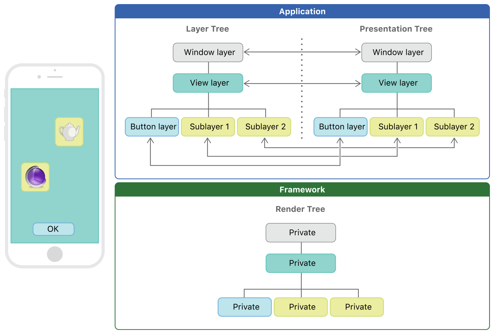

> 只有动画正在进行时，才可以使用`presentation()`属性获取 presentation tree 中对象。其他时刻调用`presentation()`可能产生无法预期的结果。Layer tree 对象的值代表最后一次用代码设置的值。

## 5. Layer 和 View 关系

在 iOS 中，每个`UIView`都由 Core Animation 的`CALayer`支持。因此，使用`UIView`时就在使用`CALayer`。这一点与 macOS 上的`NSView`不同，`NSView`在 Core Animation 之前就已存在。`UIView`是对`NSView`的轻量级包装。

View 特点如下：

- 复杂层级结构，自动布局。
- 与用户交互，响应链。
- 在主线程的 CPU 中执行自定义绘制逻辑。
- 灵活、强大，有很多子类。

Layer 特点如下：

- 层级结构简单，渲染速度快，不支持自动布局。
- 没有响应链的开销。
- 在 GPU 中渲染。
- 不太灵活，子类偏少。

直接使用`CALayer`并不能获得明显性能提升。相比使用`UIView`，使用`CALayer`可以开发同时在 iOS、macOS 上运行的app。`UIView`和`NSView`有很多不同，但`CALayer`在 iOS、macOS 上几乎相同。

`UIView`的 animation 可以满足大部分动画需求，遇到`UIView`不能实现的复杂动画时，需要借助 Core Animation实现。在 iOS 10 中，Apple在`UIKit`中增加了[UIViewPropertyAnimator](https://github.com/pro648/tips/blob/master/sources/UIViewPropertyAnimator%E7%9A%84%E4%BD%BF%E7%94%A8.md)类，使用该类实现的动画可以在结束前进行暂停、恢复、停止等操作。`UIViewPropertyAnimator`借助物理引擎，实现了碰撞、弹性等效果。

Demo名称：CoreAnimation  
源码地址：<https://github.com/pro648/BasicDemos-iOS/tree/master/CoreAnimation>

> 下一篇：[CGAffineTransform和CATransform3D](https://github.com/pro648/tips/blob/master/sources/CGAffineTransform%E5%92%8CCATransform3D.md)

参考资料：

1. [What are the differences between a UIView and a CALayer?](https://stackoverflow.com/questions/7826306/what-are-the-differences-between-a-uiview-and-a-calayer)
2. [iOS Brownbag: View vs. Layers (including Clock Demo)](http://raptureinvenice.com/ios-brownbag-view-vs-layers-including-clock-demo/)
3. [Core Animation Basics](https://developer.apple.com/library/archive/documentation/Cocoa/Conceptual/CoreAnimation_guide/CoreAnimationBasics/CoreAnimationBasics.html#//apple_ref/doc/uid/TP40004514-CH2-SW3)
4. [图层几何学](https://github.com/qunten/iOS-Core-Animation-Advanced-Techniques/blob/master/3-%E5%9B%BE%E5%B1%82%E5%87%A0%E4%BD%95%E5%AD%A6/%E5%9B%BE%E5%B1%82%E5%87%A0%E4%BD%95%E5%AD%A6.md)
5. [Always use integral numbers for the width and height of your layer.](https://stackoverflow.com/questions/20989339/always-use-integral-numbers-for-the-width-and-height-of-your-layer)