Core Graphics 框架也称为 Quartz 2D，是基于 Quartz 的高级渲染引擎，它提供了底层轻量级 2D 渲染引擎，可以进行高保真输出。

Quartz 2D 简单易用，提供了强大的功能。例如，基于路径的绘制，变换，颜色管理，离屏渲染，模式（pattern），渐变，阴影，图像数据管理、图像创建和mask，还可以处理 PDF 文档的创建、渲染和解析。

这篇文章将创建一个demo，用来记录每日喝了几杯水，并且会用折线图汇总显示本周饮水量。

## 1. 在视图上添加自定义绘制

创建一个名称为`CoreGraphics-1`的 iOS app。添加一个`UIView`，并在其中绘制自定义内容，步骤如下：

1. 创建`UIView`子类。
2. 重写`draw(_:)`方法，添加 Core Graphics 绘制代码。

先绘制一个如下的按钮：


创建名称为`PushButton`的类，其继承自`UIButton`。

> 这篇文章只介绍CoreGraphics部分，将忽略与此无关的部分。如果在此过程中遇到问题，可以在文章底部获取源码查看。

## 2. 绘制 Button

要在 Core Graphics 中绘制图形，需定义一条路径（path），用以告诉 Core Graphics 如何跟踪绘制。例如，两条垂直的线画加号，填充圆画圆形。

path有以下三个基础知识：

- path可以被描边（stroke）和填充（fill）。
- stroke使用当前的颜色勾勒出path。
- fill使用当前颜色填充闭合path。

使用`UIBezierPath`可以很方便的创建 Core Graphics path。`UIBezierPath`提供的 API 简单易用，可以基于直线、曲线、矩形，或一系列点绘制 path。

首先，使用`UIBezierPath`创建一个椭圆，并用绿色填充。打开`PushButton.swift`文件，添加以下代码：

```
    override func draw(_ rect: CGRect) {
        let path = UIBezierPath(ovalIn: rect)
        UIColor.green.setFill()
        path.fill()
    }
```

`UIBezierPath(ovalIn:)`根据参数矩形的大小创建椭圆。由于 path 不会自动绘制任何内容，因此可以在没有绘制上下文（drawing context）的地方定义 path。想要绘制 path，在当前 context 设置 fill color 并填充 path。

运行后如下：

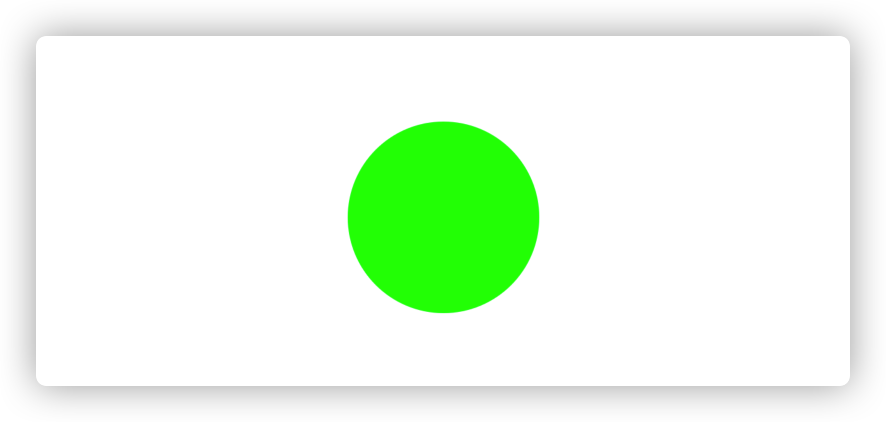

每个`UIView`都有 graphics context。在传输到屏幕中之前，视图所有绘制操作都在 graphics 上下文中进行。

当视图需要重绘时，系统调用`draw(_:)`方法。例如：

- 将视图添加到屏幕中。
- 移动视图上子视图位置。
- 视图的`isHidden`属性发生改变。
- 视图滑动出屏幕后，再次滑动到屏幕上。
- 手动调用了`setNeedsDisplay()`、`setNeedsDisplayInRect()`。

系统提供的视图会自动进行重绘。自定义的视图需重写`draw(_:)`方法，在该方法中执行所有绘制代码。视图首次显示时，传递给`draw(_:)`方法的`rect`参数为视图的所有可见区域。后续调用`draw(_:)`方法时，只传递需重绘的rect。为优化性能，应只重绘受影响区域。

调用`draw(_:)`方法后，view会被标记为已更新，等待新的修改操作，然后触发下一个更新循环。如果想更新视图内容，需调用`setNeedsDisplay()`或`setNeedsDisplay(_:)`方法触发更新循环。`draw(_:)`方法只能在重绘时，由系统调用。其它时间，graphics context 是不存在的。因此，不能手动调用`draw(_:)`方法。

> `draw(_:)`中的所有绘制操作都会进入视图的绘制上下文中。在`draw(_:)`之外绘制，需单独创建 graphics context。

`UIKit`对 Core Graphics 的部分 API 进行了封装。例如，`UIBezierPath`是对`CGMutablePath`的封装。因此，到目前为止还没有涉及到 Core Graphics 相关 API。

## 3. 画家模型 The Painter's Model

Core Graphics 使用一种被称之为「画家模型」的方式工作。在画家模型中，每个连续的绘图操作将一个图层绘制应用到画布，通常被称为 page。通过添加额外的绘制可以覆盖原来绘制的内容，达到修改原来绘制内容的目的。通过使用画家模型，基于少量的基础操作可以构建复杂的图像。

下图显示了画家模型如何工作。图片中的上半部分，先绘制左侧图形、后绘制右侧实心区域。右侧图形会覆盖左侧图形，遮挡了左侧图形周边以外的区域。下半部分以相反顺序绘制，最终结果有所不同。在画家模型中，绘制顺序很重要。

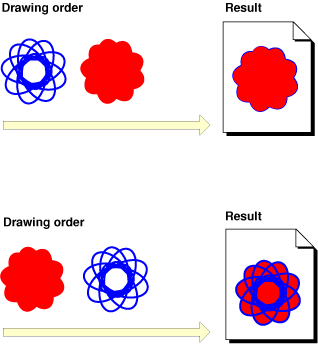

> Page 会根据输出设备而变。如果输出设备是打印机，则page是真正的纸；如果输出设备是 PDF 文件，则 page 是虚拟的纸；如果显示到屏幕中，则 page 可能是位图。page 随当前的 context 而变。

我们需要绘制的图形加号位于蓝色圆之上。因此，需要先绘制蓝色圆，后绘制加号。

在`PushButton`中添加以下常量：

```
    private struct Constants {
        static let plusLineWidth: CGFloat = 3.0
        static let plusButtonScale: CGFloat = 0.6
        static let halfPointShift: CGFloat = 0.5
    }
    
    private var halfWidth: CGFloat {
        return bounds.width / 2
    }
    
    private var halfHeight: CGFloat {
        return bounds.height / 2
    }
```

在`draw(_:)`添加以下代码，绘制加号中的横线：

```
    override func draw(_ rect: CGRect) {
        ...
        
        // Set up the width and height variables for the horizontal stroke
        let plusWidth = min(bounds.width, bounds.height) * Constants.plusButtonScale
        let halfPlusWidth = plusWidth / 2
        
        // Create the path
        let plusPath = UIBezierPath()
        
        // Set the path's line width to the height of the stroke
        plusPath.lineWidth = Constants.plusLineWidth
        
        // Move the initial point of the path to the start of the horizontal stroke
        plusPath.move(to: CGPoint(x: halfWidth - halfPlusWidth, y: halfHeight))
        
        // Add a point to the path at the end of the stroke
        plusPath.addLine(to: CGPoint(x: halfWidth + halfPlusWidth, y: halfHeight))
        
        // Set the stroke color
        UIColor.white.setStroke()
        
        // Draw the stroke
        plusPath.stroke()
    }
```

上述代码创建了一个`UIBezierPath`，设置其在圆上的起点、终点，最后使用白色描边。效果如下：

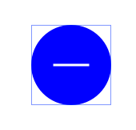

在iPad 2、iPhone 8 Plus模拟器中运行demo，可以看到该横线不是很清晰，有一条淡蓝色的线围绕它。如下所示：

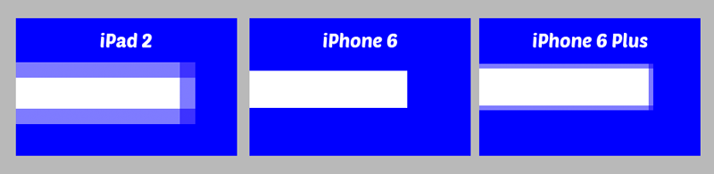

## 4. Points VS Pixels

初代iPhone发布时，points和pixels占据同样空间，大小一致。Retain 屏iPhone发布后，一个point不再占据一pixels。

下图是12*12像素，point使用灰色、白色显示的表格，iPad 2使用1x图，即1point占据1pixel；iPhone 8使用2x图，即1point占据2pixel；iPhone 8 Plus使用3x图，即1point占据3pixel。

绘制线时从path的中心开始。绘制线高度为3point时，则每侧有1.5point。可以看到，1x、3x显示屏渲染时，会有半像素需要渲染的情况。显然，屏幕无法将一个像素渲染为两种颜色。iOS 的抗锯齿化会将该像素渲染为两种颜色的中间值。最终，颜色边界变得模糊。

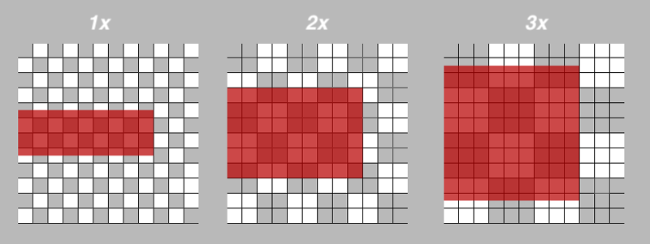

开发过程中，retain 显示屏3x拥有超高分辨率，不太容易注意到抗锯齿产生的模糊。但如果app需支持1x屏，抗锯齿会很明显，需格外注意。

path位置需为整数加减0.5，以防止抗锯齿。正如上图中看到的，0.5point在1x屏幕中向上移动0.5pixel，在2x屏幕中移动1.0pixel，在3x屏幕中移动1.5pixel。

更新`draw(_:)`中的`move(to:)`和`addLine(to:)`如下：

```
        // Move the initial point of the path to the start of the horizontal stroke
        plusPath.move(to: CGPoint(x: halfWidth - halfPlusWidth + Constants.halfPointShift, y: halfHeight + Constants.halfPointShift))
        
        // Add a point to the path at the end of the stroke
        plusPath.addLine(to: CGPoint(x: halfWidth + halfPlusWidth + Constants.halfPointShift, y: halfHeight + Constants.halfPointShift))
```

因为path偏移了0.5point，其在三种不同屏幕上都不会产生抗锯齿。

在上述代码后，stroke前添加以下代码，绘制竖线：

```
        // Vertical line
        plusPath.move(to: CGPoint(x: halfWidth + Constants.halfPointShift, y: halfHeight - halfPlusWidth + Constants.halfPointShift))
        plusPath.addLine(to: CGPoint(x: halfWidth + Constants.halfPointShift, y: halfHeight + halfPlusWidth + Constants.halfPointShift))
```

用户有时可能误操作，点击两次加号。做为开发者，应该提供减少次数的功能。 你可以复用`PushButton`，绘制一个减号按钮。遇到问题可以下载源码查看。最终效果如下图：

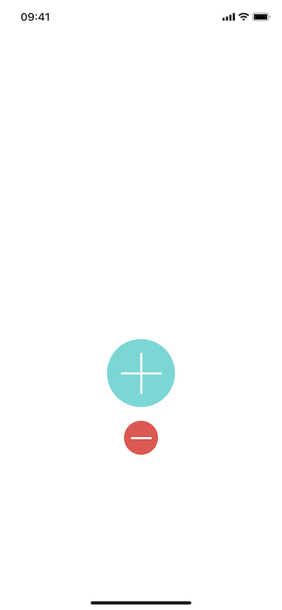

## 5. 弧线

这一部分将绘制如下的图像：

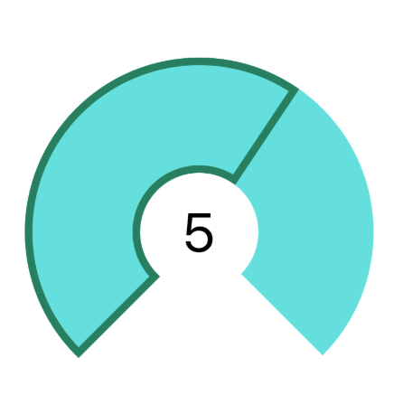

创建`CounterView`，其继承自`UIView`。添加以下代码，稍后用于绘制：

```
class CounterView: UIView {
    
    private struct Constants {
        static let numberOfGlasses = 8
        static let lineWidth: CGFloat = 5.0
        static let arcWidth: CGFloat = 76
        
        static var halfOfLineWidth: CGFloat {
            lineWidth / 2
        }
    }
    
    var counter = 5
    var outlineColor = UIColor.blue
    var counterColor = UIColor.orange
}
```

使用[Auto Layout](https://github.com/pro648/tips/blob/master/sources/Auto%20Layout%E7%9A%84%E4%BD%BF%E7%94%A8.md)布局CounterView，设置其宽高230point，中点位于水平中心，底部距离`pushButton`顶部40point。添加约束后，运行如下：

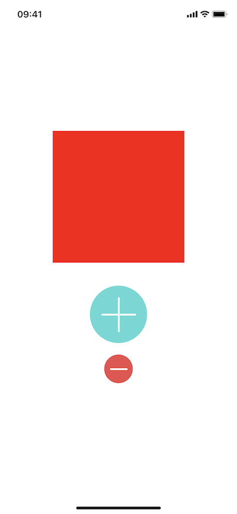

在`CounterView.swift`的`draw(_:)`方法中，添加以下代码：

```
    override func draw(_ rect: CGRect) {
        // 弧线的center
        let center = CGPoint(x: bounds.width / 2, y: bounds.height / 2)
        
        // 根据视图最大尺寸计算半径
        let radius = max(bounds.width, bounds.height)
        
        // 弧线起始弧度
        let startAngle: CGFloat = 3 * .pi / 4
        let endAngle: CGFloat = .pi / 4
        
        // 根据center、radius、angle创建贝塞尔曲线
        let path = UIBezierPath(arcCenter: center, radius: radius / 2 - Constants.arcWidth / 2, startAngle: startAngle, endAngle: endAngle, clockwise: true)
        
        // 设置path宽度、颜色，最后stroke path
        path.lineWidth = Constants.arcWidth
        counterColor.setStroke()
        path.stroke()
    }
```

可以将上面绘制圆弧的方式想象成圆规画圆。将带有钢芯的脚放到center，两只脚的距离为半径，旋转绘制图形即可。使用 Core Graphics 绘制时，圆规的钢芯是 center，圆规两脚的距离减去笔宽的一半是 radius。笔的宽度是圆弧的宽度。

运行后效果如下：

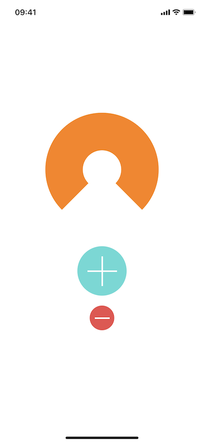

## 6. 勾画弧线

使用弧线标志喝了几杯水。弧线包含一条外线，一条内线，以及连接它们的线。

在`CounterView.swift`文件的`draw(_:)`方法中添加以下代码：

```
    override func draw(_ rect: CGRect) {
        ...
        
        // 绘制外边缘
        
        // 计算弧度，确保其为正值。
        let angleDifference: CGFloat = 2 * .pi - startAngle + endAngle
        // 每杯水对应弧度
        let arcLengthPerGlass = angleDifference / CGFloat(Constants.numberOfGlasses)
        // 弧线终点弧度
        let outlineEndAngle = arcLengthPerGlass * CGFloat(counter) + startAngle
        
        //  绘制外边缘
        let outerArcRadius = bounds.width / 2 - Constants.halfOfLineWidth
        let outlinePath = UIBezierPath(arcCenter: center, radius: outerArcRadius, startAngle: startAngle, endAngle: outlineEndAngle, clockwise: true)
        
        // 绘制内边缘
        let innerArcRadius = bounds.width / 2 - Constants.arcWidth + Constants.halfOfLineWidth
        outlinePath.addArc(withCenter: center, radius: innerArcRadius, startAngle: outlineEndAngle, endAngle: startAngle, clockwise: false)
        
        // 关闭path
        outlinePath.close()
        
        outlineColor.setStroke()
        outlinePath.lineWidth = Constants.lineWidth
        outlinePath.stroke()
    }
```

`CounterView`的`counter`设置为5时，效果如下：

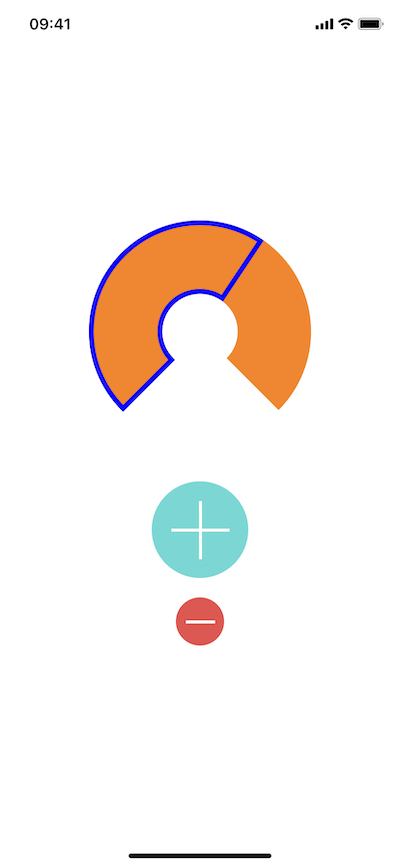

> 最后，在`CounterView`中心添加`UILabel`，显示当前喝了几杯水。为加减按钮添加点击事件。因为，只有在自身`isHidden`变化、子视图移动，首次添加到屏幕中，才会调用`draw(_:)`。因此，需要重绘时，需调用`setNeedsDisplay()`、`setNeedsDisplayInRect()`方法。

如果遇到问题，可以下载源码查看。运行后效果如下：

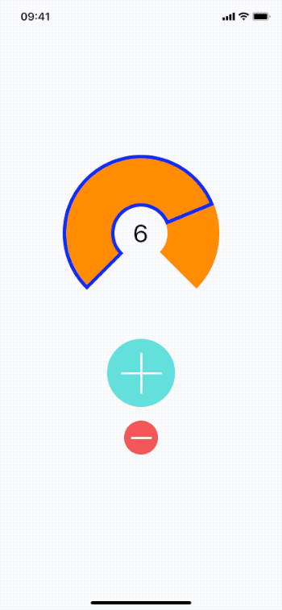

## 总结

这篇文章介绍了基础的绘图操作，可以用来绘制各种形状的图案。

下一篇文章[CoreGraphics系列二：gradient和context](https://github.com/pro648/tips/blob/master/sources/CoreGraphics%E7%B3%BB%E5%88%97%E4%BA%8C%EF%BC%9Agradient%E5%92%8Ccontext.md)将进一步介绍 Core Graphics 的 context，绘制一个折线图。

Demo名称：CoreGraphics1  
源码地址：<https://github.com/pro648/BasicDemos-iOS/tree/master/CoreGraphics-1>

参考资料：

1. [Core Graphics Tutorial: Getting Started](https://www.raywenderlich.com/8003281-core-graphics-tutorial-getting-started)
2. [iOS Drawing Concepts](https://developer.apple.com/library/archive/documentation/2DDrawing/Conceptual/DrawingPrintingiOS/GraphicsDrawingOverview/GraphicsDrawingOverview.html)
