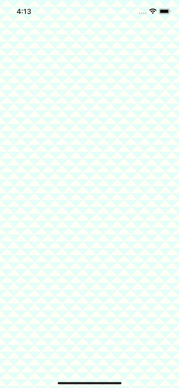
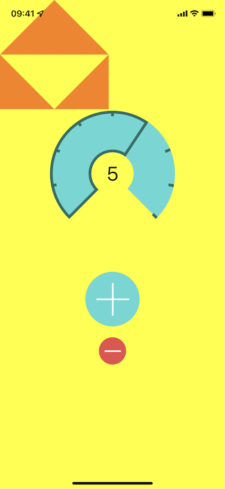
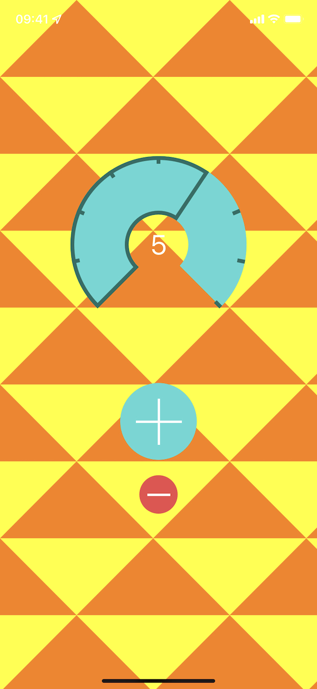
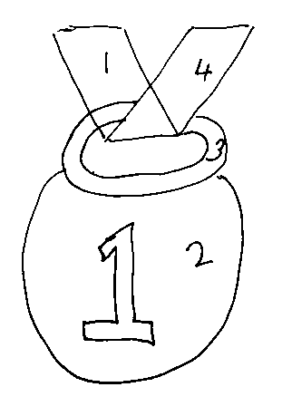
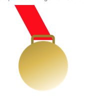
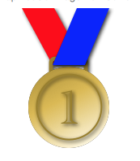
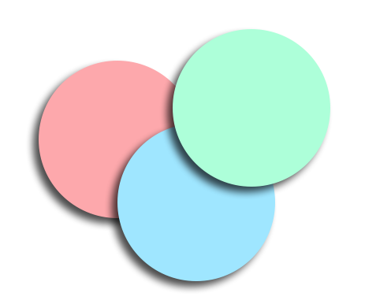
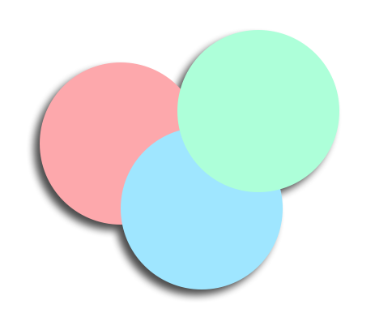
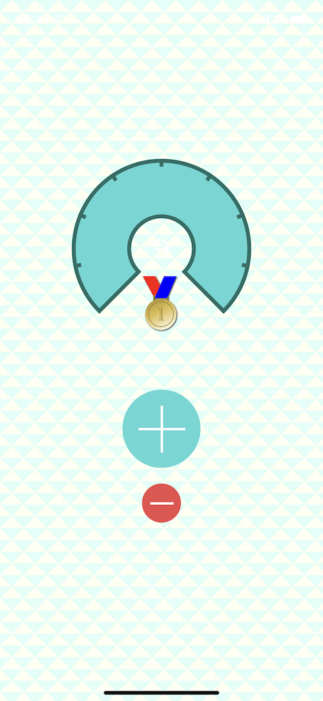

这篇文章将介绍如何在视图的背景上绘制重复的 pattern，为多个layer绘制一个阴影。

这篇文章基于前两篇文章[CoreGraphics系列一：path](https://github.com/pro648/tips/blob/master/sources/CoreGraphics%E7%B3%BB%E5%88%97%E4%B8%80%EF%BC%9Apath.md)和[CoreGraphics系列二：gradient和context](https://github.com/pro648/tips/blob/master/sources/CoreGraphics%E7%B3%BB%E5%88%97%E4%BA%8C%EF%BC%9Agradient%E5%92%8Ccontext.md)。如果你对`CoreGraphics`还不熟悉，可以先查看前面两篇文章。这篇文章所使用的demo从[CoreGraphics系列二：gradient和context](https://github.com/pro648/BasicDemos-iOS/tree/master/CoreGraphics-2)的结尾开始。

这篇文章主要涉及以下几点：

- 为背景创建重复 pattern。
- 绘制一个奖牌，奖励喝八杯水的用户。

## 1. 创建重复 pattern

这一部分使用`UIKit`提供的方法创建背景 pattern：



#### 1.1 设置背景视图

创建继承自`UIView`的自定义视图`BackgroundView`，将其设置为`ViewController`的root view。更新`BackgroundView`如下：

```
import UIKit

class BackgroundView: UIView {
    
    // 暂时使用以下颜色和大小，其可以清晰看出绘制内容。
    let lightColor: UIColor = .orange
    let darkColor: UIColor = .yellow
    let patternSize: CGFloat = 200

    // Only override draw() if you perform custom drawing.
    // An empty implementation adversely affects performance during animation.
    override func draw(_ rect: CGRect) {
        // Drawing code
        guard let context = UIGraphicsGetCurrentContext() else {
            fatalError("\(#function): \(#line) Failed to get current context")
        }
        
        context.setFillColor(darkColor.cgColor)
        // 未设置path时，fill会填充整个rect。
        context.fill(rect)
    }
}
```

#### 1.2 绘制三角形

下面使用`UIBezierPath`绘制下图中的黄色三角形，数字表示代码中点的顺序。


在`BackgroundView.swift`文件的`draw(_:)`方法底部添加以下代码：

```
        let drawSize = CGSize(width: patternSize, height: patternSize)
        
        // Insert code here
        
        let trianglePath = UIBezierPath()
        // 1
        trianglePath.move(to: CGPoint(x: drawSize.width / 2.0, y: 0))
        trianglePath.addLine(to: CGPoint(x: 0, y: drawSize.height / 2.0))
        trianglePath.addLine(to: CGPoint(x: drawSize.width, y: drawSize.height / 2.0))
        
        // 4
        trianglePath.move(to: CGPoint(x: 0, y: drawSize.height / 2.0))
        // 5
        trianglePath.addLine(to: CGPoint(x: drawSize.width / 2.0, y: drawSize.height))
        // 6
        trianglePath.addLine(to: CGPoint(x: 0, y: drawSize.height))
        
        // 7
        trianglePath.move(to: CGPoint(x: drawSize.width, y: drawSize.height / 2.0))
        // 8
        trianglePath.addLine(to: CGPoint(x: drawSize.width / 2.0, y: drawSize.height))
        // 9
        trianglePath.addLine(to: CGPoint(x: drawSize.width, y: drawSize.height))
        
        lightColor.setFill()
        trianglePath.fill()
```

上述代码使用同一 path，绘制了三个三角形。`move(to:)`就像提笔移动到另一点一样。

运行后效果如下：



目前，直接向 view 的 context 绘制内容。想要重复该 pattern，必须在该 context 之外创建 image，然后使用该 image 在背景视图的 context 中绘制重复 pattern。

在`Insert code here`行后添加以下代码：

```
        // Insert code here
        // 创建图片上下文。
        UIGraphicsBeginImageContextWithOptions(drawSize, true, 0.0)
        // 获取上面创建上下文的引用。
        guard let drawingContext = UIGraphicsGetCurrentContext() else {
            fatalError("\(#function):\(#line) Failed to get current context.")
        }

        // Set the fill color for the new context.
        darkColor.setFill()
        drawingContext.fill(CGRect(x: 0, y: 0, width: drawSize.width, height: drawSize.height))
```

如果此时再次运行demo，会发现三角形不见了。这是因为`UIGraphicsBeginImageContextWithOptions(_:_:_:)`创建了一个新的 context，并被设置为当前的绘制上下文。因此，目前的绘制操作都绘制到了新创建的 context 中。

`UIGraphicsBeginImageContextWithOptions(_:_:_:)`方法参数如下：

- size：context的大小。`UIGraphicsGetImageFromCurrentImageContext()`返回图片大小由该参数决定。如果想要获得图片像素大小，需乘以参数scale值。
- opaque：位图是否是不透明的。如果位图是不透明的，设置为`true`可以忽略alpha通道，优化位图存储空间；`false`表示位图必须包含alpha通道，用来处理半透明。
- scale：位图的 scale。如果设置为`0.0`，则采用设备 main screen 的 scale。

#### 1.3 从context中创建图片

在`draw(_:)`底部添加以下代码：

```
        // 从当前context中提取图片
        guard let image = UIGraphicsGetImageFromCurrentImageContext() else {
            fatalError("""
            \(#function):\(#line) Failed to \
            get an image from current context.
            """)
        }
        // 关闭context后，context将恢复到视图自身context，所有绘制操作都会直接在视图中进行。
        UIGraphicsEndImageContext()
```

下面使用从context中创建的image，创建重复 pattern。在`draw(_:)`方法底部添加以下代码：

```
        UIColor(patternImage: image).setFill()
        context.fill(rect)
```

运行后效果如下：



目前，重复 pattern 各项功能都已完成，可以将其颜色、大小修改为以下值，即可得到文章开头部分的背景：

```
    let lightColor = UIColor(red: 255.0 / 255.0, green: 255.0 / 255.0, blue: 242.0 / 255.0, alpha: 1.0)
    let darkColor = UIColor(red: 223.0 / 255.0, green: 255.0 / 255.0, blue: 247.0 / 255.0, alpha: 1.0)
    let patternSize = 30
```

## 2. 绘制图片

这一部分将绘制一个奖牌，奖励一天喝够八杯水的用户。


这里将在 playground 中绘制奖牌，绘制完成后再将代码复制到工程中。

#### 2.1 创建 playground

创建 playground，设置其名称为`MedalDrawing`。

在 playground 中添加以下代码：

```
import UIKit

let size = CGSize(width: 120, height: 200)

UIGraphicsBeginImageContextWithOptions(size, false, 0.0)

guard let context = UIGraphicsGetCurrentContext() else {
    fatalError("\(#function):\(#line) Failed to get current context.")
}

// 从当前context中创建图片
let image = UIGraphicsGetImageFromCurrentImageContext()
UIGraphicsEndImageContext()
```

与创建 pattern 图片一样，这里也创建了绘制上下文。

点击`UIGraphicsGetImageFromCurrentImageContext()`右侧的矩形，可以看到目前context中图形。

#### 2.2 绘制先后次序

绘制图片前需先确定好绘制顺序。奖牌绘制顺序应如下图所示：



1. 后面的丝带，即红丝带。
2. 奖牌垂饰。
3. 搭扣。
4. 蓝丝带。
5. 数字1。

整个绘制过程中，从 context 中获取图片、关闭上下文的代码应始终处于最底部。

首先，定义绘制过程中用到的颜色：

```
// Gold colors
let darkGoldColor = UIColor(red: 0.6, green: 0.5, blue: 0.15, alpha: 1.0)
let midGoldColor = UIColor(red: 0.86, green: 0.73, blue: 0.3, alpha: 1.0)
let lightGoldColor = UIColor(red: 1.0, green: 0.98, blue: 0.9, alpha: 1.0)
```

#### 2.3 红丝带

下面绘制红丝带：

```
// 红丝带
let lowerRibbonPath = UIBezierPath()
lowerRibbonPath.move(to: CGPoint(x: 0, y: 0))
lowerRibbonPath.addLine(to: CGPoint(x: 40, y: 0))
lowerRibbonPath.addLine(to: CGPoint(x: 78, y: 70))
lowerRibbonPath.addLine(to: CGPoint(x: 38, y: 70))
lowerRibbonPath.close()
UIColor.red.setFill()
lowerRibbonPath.fill()
```

上述代码创建了 path 并填充。可以在`UIGraphicsGetImageFromCurrentImageContext()`预览区看到绘制的红丝带。

#### 2.4 搭扣

下面绘制搭扣：

```
// 搭扣
let claspPath = UIBezierPath(roundedRect: CGRect(x: 36, y: 62, width: 43, height: 20), cornerRadius: 5)
claspPath.lineWidth = 5
darkGoldColor.setStroke()
claspPath.stroke()
```

这里使用`UIBezierPath(rounedRect:cornerRadius:)`创建搭扣的弧线。

#### 2.5 垂饰

下面绘制垂饰：

```
// 奖牌垂饰
let medallionPath = UIBezierPath(ovalIn: CGRect(x: 8, y: 72, width: 100, height: 100))
//context.saveGState()
//medallionPath.addClip()

let colors = [
    darkGoldColor.cgColor,
    midGoldColor.cgColor,
    lightGoldColor.cgColor
] as CFArray
guard let gradient = CGGradient(colorsSpace: CGColorSpaceCreateDeviceRGB(), colors: colors, locations: [0, 0.51, 1]) else {
    fatalError("""
        Failed to instantiate an instance \
        of \(String(describing: CGGradient.self))
        """)
}
context.drawLinearGradient(gradient, start: CGPoint(x: 40, y: 40), end: CGPoint(x: 40, y: 162), options: [])
//context.restoreGState()
```

绘制图片如下：


想要渐变成一定角度，如从左上角到右下角，可通过调整end point的 x 坐标实现，如下：

```
context.drawLinearGradient(gradient, start: CGPoint(x: 40, y: 40), end: CGPoint(x: 100, y: 160), options: [])
```


取消绘制渐变中注释掉的`saveGState()`、`addClip()`、`restoreGState()`。渐变会被限制在圆形区域中。另外，因为在 clip 前保存了context，clip后又restore了context，当前的 context 没有被裁切。



绘制奖牌垂饰内环时，可以使用垂饰圆弧，只需在绘制前对 path 进行缩放即可。

继续添加以下代码，绘制内环：

```
// 创建transform
// 缩放、向右下平移
var transform = CGAffineTransform(scaleX: 0.8, y: 0.8)
transform = transform.translatedBy(x: 15, y: 30)
medallionPath.lineWidth = 2.0

// 应用transform
medallionPath.apply(transform)
medallionPath.stroke()
```

#### 2.6 蓝丝带

使用以下代码绘制蓝丝带：

```
// 蓝丝带
let upperRibbonPath = UIBezierPath()
upperRibbonPath.move(to: CGPoint(x: 68, y: 0))
upperRibbonPath.addLine(to: CGPoint(x: 108, y: 0))
upperRibbonPath.addLine(to: CGPoint(x: 78, y: 70))
upperRibbonPath.addLine(to: CGPoint(x: 38, y: 70))
upperRibbonPath.close()

UIColor.blue.setFill()
upperRibbonPath.fill()
```

这一部分与绘制红丝带类似，创建path并填充即可。

#### 2.7 数字1

最后需要绘制的是数字1：

```
// 数字1
let numberOne = "1" as NSString // 必现是NSString类型，否则无法使用draw(in:)
let numberOneRect = CGRect(x: 47, y: 100, width: 50, height: 50)
guard let font = UIFont(name: "Academy Engraved LET", size: 60) else {
    fatalError("""
      \(#function):\(#line) Failed to instantiate font \
      with name \"Academy Engraved LET\"
      """)
}
let numberOneAttributes = [
    NSAttributedString.Key.font: font,
    NSAttributedString.Key.foregroundColor: darkGoldColor
]
numberOne.draw(in: numberOneRect, withAttributes: numberOneAttributes)
```


如果添加上阴影，使其更有立体感就更美观了。

#### 2.8 Transparency Layer 和阴影

绘制阴影需要三元素：颜色、偏移量和模糊。

在定义颜色后、绘制红丝带前添加以下代码，绘制阴影：

```
// 阴影
let shadow = UIColor.black.withAlphaComponent(0.80)
let shadowOffset = CGSize(width: 2.0, height: 2.0)
let shadowBlurRadius: CGFloat = 5

context.setShadow(offset: shadowOffset, blur: shadowBlurRadius, color: shadow.cgColor)
```

上述代码绘制了阴影，但其效果可能不是我们期望的：



向当前context绘制图像时，`setShadow(offset:blur:color:)`会为每个图像创建阴影。



奖牌由五个对象构成，会产生五个阴影。可以将所有对象组合到一个透明的layer上，这样就只会绘制一个阴影了。



在创建阴影后添加以下代码，将所有layer组合到一个透明图层：

```
// 开启transparency layer
context.beginTransparencyLayer(auxiliaryInfo: nil)
```

开启 group 后，也需要关闭group。在从context中获取图片前添加以下代码：

```
// 关闭transparency layer
context.endTransparencyLayer()
```

现在，奖牌添加了阴影，更显得有立体感：


#### 2.9 添加到app中

目前，已经可以绘制奖牌。只需将其添加到demo中。

创建继承自`UIImageView`的类`MedalView`，将其添加到`counterView`中。在`MedalView.swift`中添加以下方法：

```
    private func createMedalImage() -> UIImage {
        // 创建图片时进行打印，这样就可以知道何时创建了图片。
        debugPrint("Creating Medal Image")
    }
```

将 playground 中所有绘制代码复制到`createMedalImage()`方法中，并将最后两行代码替换成以下代码：

```
        // 从当前context中创建图片
        guard let image = UIGraphicsGetImageFromCurrentImageContext() else {
            fatalError("""
              \(#function):\(#line) Failed to get an \
              image from current context.
              """)
        }
        UIGraphicsEndImageContext()
        
        return image
```

在`MedalView`类顶部添加以下lazy属性：

```
    lazy var medalImage = createMedalImage()
```

使用`lazy`修饰的属性在首次调用时才会创建。使用`lazy`修饰一些昂贵操作，能够提升性能。用户喝到8杯水时，绘制一次奖牌；如果一直没有喝到8杯，则永不创建。

添加以下代码显示、隐藏奖牌：

```
    func showMedal(show: Bool) {
        image = (show == true) ? medalImage : nil
    }
```

最后，将其添加到`counterView`上，并且在`ViewController.swift`的`viewDidLoad`和`pushButtonPressed(_:)`方法中根据counter决定是否展示奖牌。如果遇到问题，可以在文章底部获取源码查看。

完成后，最终效果如下：



## 总结

这篇文章介绍了如何在视图的背景上绘制重复的 pattern，为多个layer绘制一个阴影。如果你在绘制过程中遇到了问题，可以通过下面的链接获取源码查看。

Demo名称：CoreGraphics3  
源码地址：<https://github.com/pro648/BasicDemos-iOS/tree/master/CoreGraphics-3>

参考资料：

1. [Core Graphics Tutorial: Patterns and Playgrounds](https://www.raywenderlich.com/19164942-core-graphics-tutorial-patterns-and-playgrounds)