上一篇文章[CoreGraphics系列一：path](https://github.com/pro648/tips/blob/master/sources/CoreGraphics%E7%B3%BB%E5%88%97%E4%B8%80%EF%BC%9Apath.md)介绍了如何使用 CoreGraphics 绘制线和圆弧。这一篇文章将深入介绍 Core Graphics，学习绘制渐变，使用 transformation 操控`CGContexts`。

## 1. Core Graphics

下图介绍了 Core Graphics 与相关框架的层级关系：

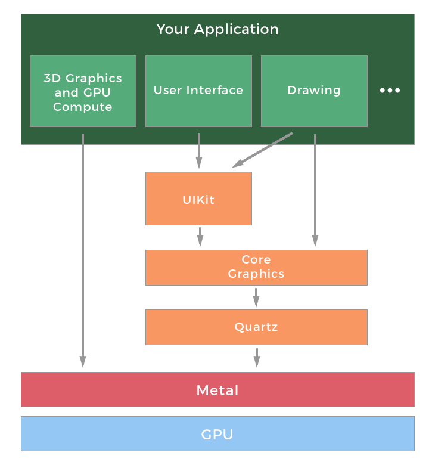

`UIKit`位于最顶层，也是最常用的一层。`UIKit`提供了对 Core Graphics 的封装。例如，`UIBezierPath`是`UIKit`对 Core Graphics 中`CGPath`的封装。Core Graphics 中的对象和方法通常以`CG`开头。

这篇文章结束的时候，会创建一个如下图的图形：

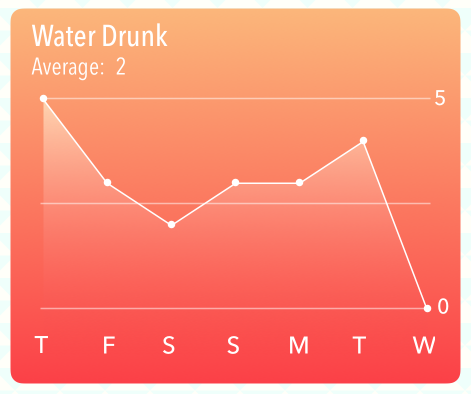

完整视图层级如下：

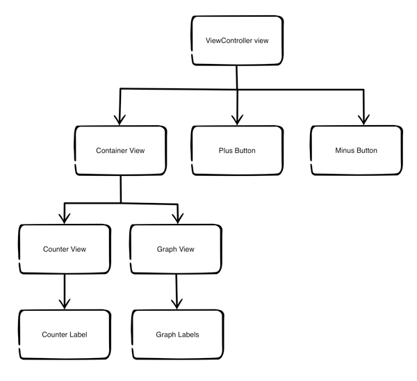

从[CoreGraphics-2模版](https://github.com/pro648/BasicDemos-iOS/tree/master/CoreGraphics-2%E6%A8%A1%E7%89%88)下载这篇文章的模版。模版与上一篇文章[CoreGraphics系列一：path](https://github.com/pro648/tips/blob/master/sources/CoreGraphics%E7%B3%BB%E5%88%97%E4%B8%80%EF%BC%9Apath.md)结束时没有太大区别，只是`CounterView`放到了另一个黄色视图里。运行后如下所示：

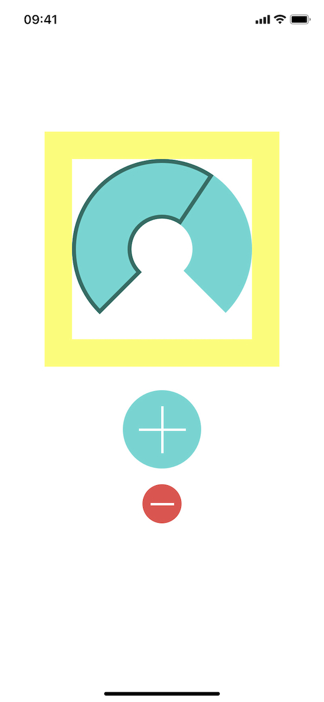

## 2. 设置切换动画

在`ViewController.swift`文件顶部添加以下属性，标记当前展示的视图类型：

```
    private var isGraphViewShowing = false
```

在`counterViewTap(_ gesture:)`方法中使用动画切换`counterView`和`graphView`：

```
    @objc func handleCounterViewTap(_ gesture: UITapGestureRecognizer?) {
        if isGraphViewShowing { // Hide Graph
            UIView.transition(from: graphView, to: counterView, duration: 1.0, options: [.transitionFlipFromLeft, .showHideTransitionViews], completion: nil)
        } else {    // Show Graph
            UIView.transition(from: counterView, to: graphView, duration: 1.0, options: [.transitionFlipFromRight, .showHideTransitionViews], completion: nil)
        }
        
        isGraphViewShowing.toggle()
    }
```

`UIView.transition(from:to:duration:options:completion:)`执行了水平反转动画。其他可选动画还有：交叉溶解、垂直翻转、向上卷曲、向下卷曲。transition使用了`showHideTransitionViews`，以便在动画过程中隐藏视图，无需移除视图。

在`pushButtonPressed(_:)`方法底部添加以下代码：

```
        if isGraphViewShowing {
            handleCounterViewTap(nil)
        }
```

## 3. GraphView的构成

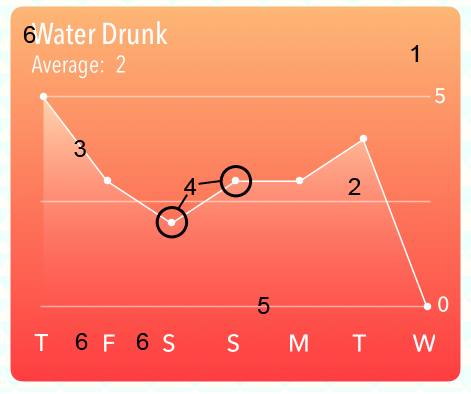

如上一篇文章介绍的[画家模型](https://github.com/pro648/tips/blob/master/sources/CoreGraphics%E7%B3%BB%E5%88%97%E4%B8%80%EF%BC%9Apath.md#3-%E7%94%BB%E5%AE%B6%E6%A8%A1%E5%9E%8B-the-painters-model)，在 CoreGraphics 中绘制图形时从后向前绘制。在编码前需思考绘制顺序。

1. 背景视图的渐变。
2. 折线下的渐变。
3. 折线。
4. 折线中的圆点。
5. 横向参考线。

## 4. 绘制渐变

下面在`GraphView`中绘制渐变。进入`GraphView.swift`文件，添加以下代码：

```
    override func draw(_ rect: CGRect) {
        // Drawing code
        guard let context = UIGraphicsGetCurrentContext() else { return }
        let colors = [startColor.cgColor, endColor.cgColor]
        let colorSpace = CGColorSpaceCreateDeviceRGB()
        // colors的每个位置
        let colorLocations: [CGFloat] = [0.0, 1.0]
        
        // 创建gradient
        guard let gradient = CGGradient(colorsSpace: colorSpace, colors: colors as CFArray, locations: colorLocations) else { return }
        
        let startPoint = CGPoint.zero
        let endPoint = CGPoint(x: 0, y: bounds.height)
        // 绘制gradient
        context.drawLinearGradient(gradient, start: startPoint, end: endPoint, options: [])
    }
```

创建`CGGradient`的方法`init(colorsSpace:colors:locations:)`有以下参数：

- `space`：gradient使用的 color space。
- `colors`：元素类型为`CGColor`的非空数组，其应在`space`的 color space。如果 color space 不为`NULL`，color会被转换到该 color space；反之，color会被转换到`GenericRGB` color space。
- `locations`：`colors`每个颜色位置。`locations`数组元素是`CGFloat`类型，值范围是0到1。如果数组不包含0和1，Quartz使用数组中最接近0和1的元素。如果`locations`是`NULL`，`colors`第一个元素赋值到位置0，最后一个元素赋值到位置1，其它元素均匀分布。`locations`数组和`colors`数组元素数量应一致。

使用`drawLinearGradient(_:start:end:options:)`绘制渐变，其包含以下参数：

- `gradient`：包含了`color space`、`colors`、`locations`的 gradient。
- `startPoint`：gradient 开始的位置。
- `endPoint`：gradient结束的位置。
- `options`：控制填充是否超过开始`drawsBeforeLocation`、结束`drawsAfterEndLocation`位置。

运行后gradient效果如下：

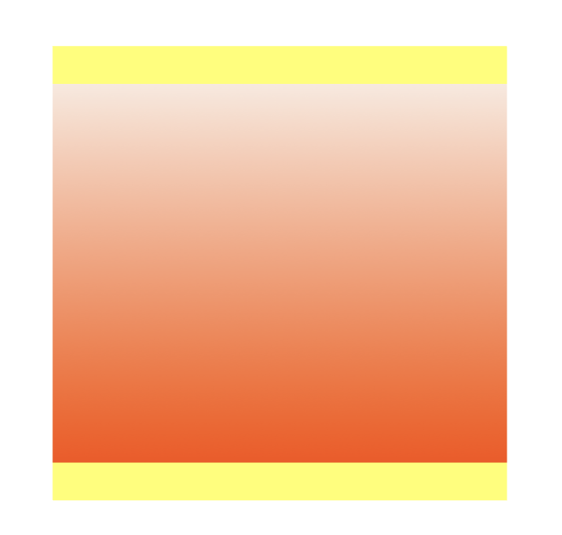

目前，已经不需要`containerView`的背景色，可以将其设置为`clearColor`。

## 5. 裁剪

上面绘制渐变时，填满了整个区域。如果只需绘制部分区域，可以创建 path 裁剪绘制区域。

进入`GraphView.swift`文件，在`GraphView`类顶部添加以下常量：

```
    private enum Constants {
        static let cornerRadiusSize = CGSize(width: 8.0, height: 8.0)
        static let margin: CGFloat = 20.0
        static let topBorder: CGFloat = 60.0
        static let bottomBorder: CGFloat = 50.0
        static let colorAlpha: CGFloat = 0.3
        static let circleDiameter: CGFloat = 5.0
    }
```

在`GraphView`的`draw(_:)`方法开始位置添加以下代码：

```
    override func draw(_ rect: CGRect) {
        let path = UIBezierPath(roundedRect: rect, byRoundingCorners: .allCorners, cornerRadii: Constants.cornerRadiusSize)
        path.addClip()
        ...
    }
```

裁剪后的区域限制了绘制渐变的区域。后续会使用该策略在指定 path 以下绘制渐变。

运行后，`GraphView`的渐变有了圆角。如下所示：

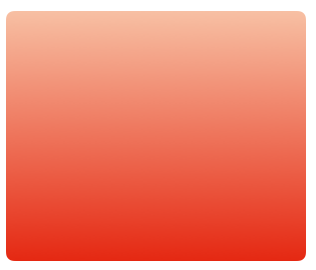

> 通常，使用`CoreGraphics`绘制静态视图速度很快。但是，如果视图需要移动，或频繁重绘，则应使用[CoreAnimation](https://github.com/pro648/tips/blob/master/sources/CoreAnimation%E5%9F%BA%E6%9C%AC%E4%BB%8B%E7%BB%8D.md)。CoreAnimation 经过了优化，使用 GPU 处理绘制任务，而非 CPU。`CoreGraphics`中的`draw(_:)`使用 CPU 处理绘制任务。
>
> Core Animation 中的圆角应使用`CALayer`的`cornerRadius`，而非裁剪。

## 6. 计算绘制点

下面将绘制七个小圆点，其x轴代表星期几，y轴代表几杯水。

在`GraphView.swift`文件`GraphView`类顶部添加以下属性，代表一周中每天喝了几杯水。

```
    var graphPoints = [4, 2, 6, 4, 5, 8, 3]
```

在`draw(_:)`顶部添加以下代码：

```
        let width = rect.width
        let height = rect.height
```

在`draw(_:)`尾部添加以下代码，计算x位置：

```
        // Calculate the x point
        let margin = Constants.margin
        let graphWidth = width - margin * 2 - 4
        let columnXPoint = { (column: Int) -> CGFloat in
            let spacing = graphWidth / CGFloat(self.graphPoints.count - 1)
            return CGFloat(column) * spacing + margin + 2
        }
```

x轴包含七个等距的点，上面使用闭包表达式计算（closure expression）x位置。也可以使用函数计算x位置，但此类简单计算写成闭包更简洁。

`columnXPoint`入参为列，返回其在x轴的位置。

在`draw(_:)`底部添加以下代码，计算y轴位置：

```
        // Calculate the y point
        let topBorder = Constants.topBorder
        let bottomBorder = Constants.bottomBorder
        let graphHeight = height - topBorder - bottomBorder
        guard let maxValue = graphPoints.max() else { return }
        let columnYPoint = { (graphPoint: Int) -> CGFloat in
            let yPoint = CGFloat(graphPoint) / CGFloat(maxValue) * graphHeight
            return graphHeight + topBorder - yPoint
        }
```

`columnYPoint`也是一个闭包表达式，根据天数和水量计算出对应y轴位置。

`CoreGraphics`的原点位于左上角，绘制折线时原点位于左下角。因此，需调整y值，以便图表方向符合预期。

继续在`draw(_:)`添加以下代码，绘制折线：

```
        // Draw the line graph
        UIColor.white.setFill()
        UIColor.white.setStroke()
        
        // Set up the points line
        let graphPath = UIBezierPath()
        
        // Go to start of line
        graphPath.move(to: CGPoint(x: columnXPoint(0), y: columnYPoint(graphPoints[0])))
        
        // Add points for each item in the graphPoints array at the correct (x, y) for the point
        for i in 1..<graphPoints.count {
            let nextPoint = CGPoint(x: columnXPoint(i), y: columnYPoint(graphPoints[i]))
            graphPath.addLine(to: nextPoint)
        }
        graphPath.stroke()
```

上述代码根据x、y位置，创建`UIBezierPath`，进而利用path创建折线。

运行后折线图如下：

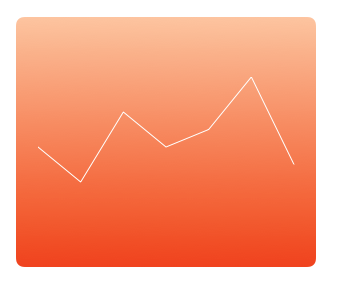

可以看到，绘制的折线符合预期，移除 stroke 代码：

```
        graphPath.stroke()
```

## 7. 在折线下绘制渐变

下面使用上面的折线作为 clipping path，在折线下绘制渐变。

首先，在`draw(_:)`底部创建clipping path：

```
        // Create the clipping path for the graph gradient
        
        // 1. Save the state of the context (commented out for now)
//        context.saveGState()
        
        // 2. Make a copy of the path
        guard let clippingPath = graphPath.copy() as? UIBezierPath else { return }
        
        // 3. Add lines to the copied path to complete the clip area.
        clippingPath.addLine(to: CGPoint(x: columnXPoint(graphPoints.count - 1), y: height))
        clippingPath.addLine(to: CGPoint(x: columnXPoint(0), y: height))
        clippingPath.close()
        
        // 4. Add the clipping path to the context
        clippingPath.addClip()
        
        // 5. Check clipping path - Temporary code
        UIColor.green.setFill()
        let rectPath = UIBezierPath(rect: rect)
        rectPath.fill()
        // End temporary code
```

运行后，效果如下：

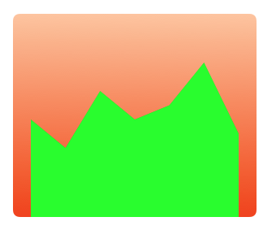

下面把填充的绿色更换为渐变。使用以下代码替换 temporary code：

```
        // 使用y最大值作为渐变的起点
        let highestYPoint = columnYPoint(maxValue)
        let graphStartPoint = CGPoint(x: margin, y: highestYPoint)
        let graphEndPoint = CGPoint(x: margin, y: bounds.height)
        
        context.drawLinearGradient(gradient, start: graphStartPoint, end: graphEndPoint, options: [])
//        context.restoreGState()
```

这次绘制的渐变区域不是整个rect，而是从`context`的顶部到底部，

> 注意到其中注释掉的`restoreGState()`，当绘制圆点时会移除注释。

在裁切的渐变顶部绘制折线，代码如下：

```
        // Draw the line on top of the clipped gradient
        graphPath.lineWidth = 2.0
        graphPath.stroke()
```

折线图变得逐渐清晰起来，如下图所示：

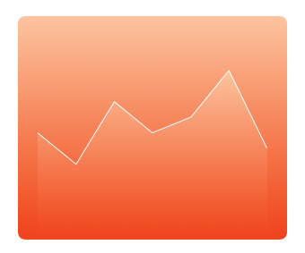

## 8. 填充规则

路径填充有两种规则：非零环绕数（nonzero winding number rule）和奇偶规则（even-odd rule）。填充规则超越了语言，普世通用。

用三个点连成一个三角形，两种填充规则填充后没有区别：

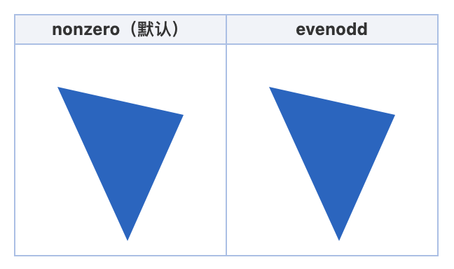

如果是两个重叠的三角形，两种填充规则填充后可能产生不同：

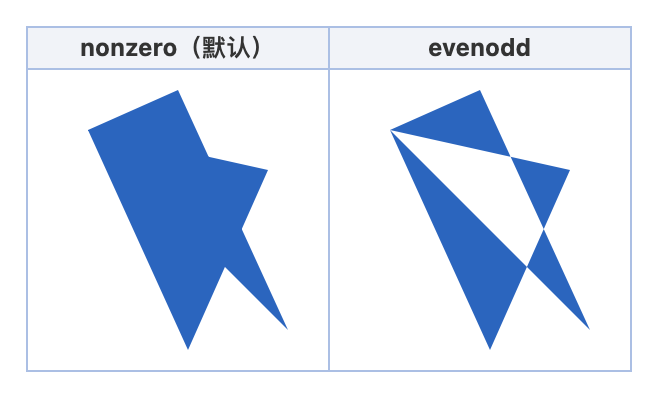

填充的关键是确定图形哪些是内部、哪些是外部，然后只填充内部。

#### 8.1 非零环绕数

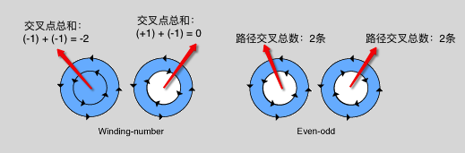

对于给定的曲线C和给定的点P，构造一条无限长的射线，从P指向任意方向。找出C与这条射线的所有交点。按照如下方式计算环绕数：

- 对于每个顺时针交叉点（从P射线方向看，曲线从左到右穿过射线），计数减一。
- 对于每个逆时针交叉点，计数加一。

如果最终环绕数为零，则P在C之外，无需填充；否则，在曲线内，需要填充。

SVG 计算机图形矢量标准绘制多边形时默认使用非零规则。

#### 8.2 奇偶规则

对于给定的曲线C和给定的点P，构造一条无限长的射线，从P指向任意方向。找出C与这条射线的所有交点。如果交点数为奇数，则认为该点在路径内，需要填充；如果交点数为偶数，则认为该点在路径外，无需填充。路径方向不影响交计算交点数量。

非零环绕数和奇偶规则会出现矛盾的情况。如下图所示，左侧用奇偶规则填充，环绕数为2，即在多边形外，无需填充；右侧使用非零环绕数规则，环绕数为-2，即非零，在多边形内，需要填充。

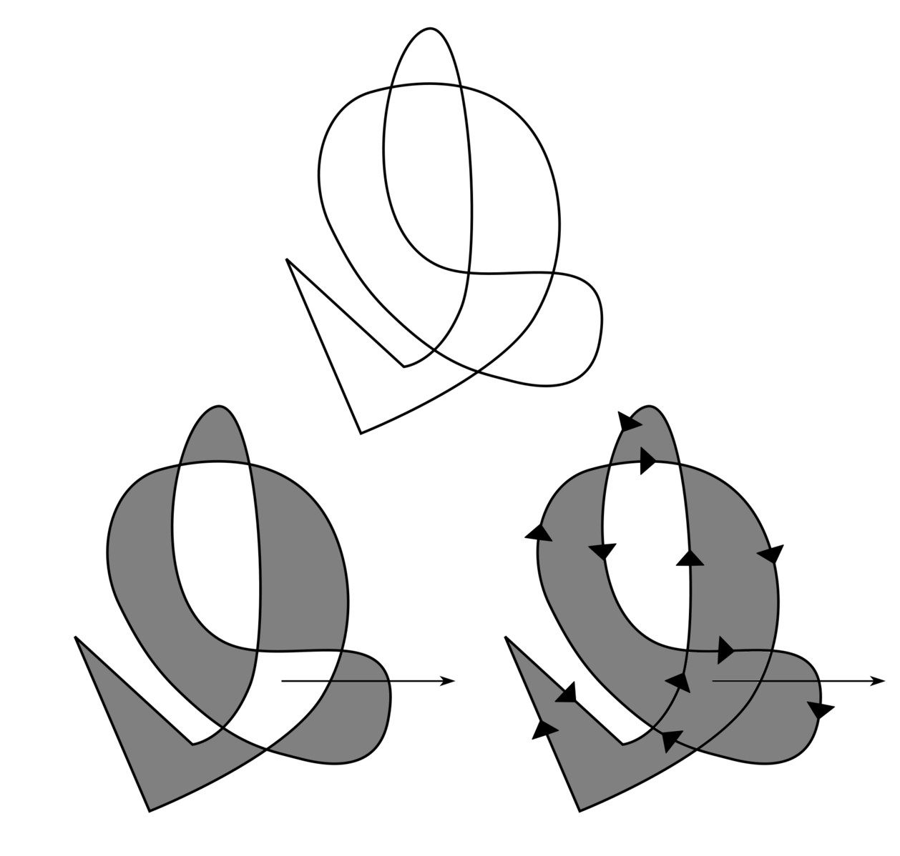

`usesEvenOddFillRule`决定绘制路径时是否使用奇偶规则，默认值为`false`。

## 9. 绘制数据点

在`draw(_:)`尾部添加以下代码，绘制数据点。

```
        // Draw the circles on top of the graph stroke
        for i in 0..<graphPoints.count {
            var point = CGPoint(x: columnXPoint(i), y: columnYPoint(graphPoints[i]))
            point.x -= Constants.circleDiameter / 2
            point.y -= Constants.circleDiameter / 2
            
            let circle = UIBezierPath(ovalIn: CGRect(origin: point, size: CGSize(width: Constants.circleDiameter, height: Constants.circleDiameter)))
            circle.fill()
        }
```

上述代码，根据每个点的x、y坐标计算点的位置，最终通过填充圆路径绘制圆点。

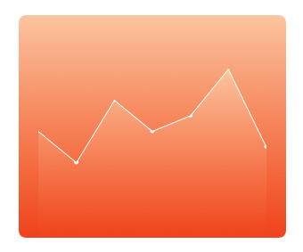

折线中的圆点看起来并不是圆的。

## 10. Context State

折线中的圆点不是圆形的和 context state 有关。Graphics context 可以保存 state。因此，设置context的 fill color、transformation matrix、color space、clip region等属性，就是在设置当前 graphics state。

使用`context.saveGState()`保存state，它会将当前 graphics state 添加到栈上。`saveGState()`后仍可以对 context 的属性进行修改，当调用`context.restoreGState()`后，原始的 state 会从 Stack 中取出，revert掉所有保存state后的修改。

进入`GraphView.swift`文件的`draw(_:)`方法，取消创建clipping path前`context.saveGState()`的注释。另外，取消注释使用 clipping path前的`context.restoreGState()`。

通过`saveGState()`、`restoreGState()`达到了以下效果：

1. 使用`context.saveGState()`保存 graphics state 到 Stack。
2. 对当前的 graphics state 添加 clipping path，达到一种新的 state。
3. 在 clipping path 内绘制渐变。
4. 使用`context.restoreGState()`恢复 graphics state，即添加 clipping path 前的状态。

折线图和圆点应变得清晰了。

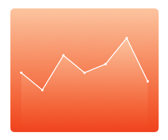

在`draw(_:)`尾部，添加以下代码，绘制三条横线：

```
        // Draw horizontal graph lines on the top of everything
        let linePath = UIBezierPath()
        
        // Top line
        linePath.move(to: CGPoint(x: margin, y: topBorder))
        linePath.addLine(to: CGPoint(x: width - margin, y: topBorder))
        
        // Center line
        linePath.move(to: CGPoint(x: margin, y: graphHeight / 2 + topBorder))
        linePath.addLine(to: CGPoint(x: width - margin, y: graphHeight / 2 + topBorder))
        
        // Bottom line
        linePath.move(to: CGPoint(x: margin, y: height - bottomBorder))
        linePath.addLine(to: CGPoint(x: width - margin, y: height - bottomBorder))
        let color = UIColor(white: 1.0, alpha: Constants.colorAlpha)
        color.setStroke()
        
        linePath.lineWidth = 1.0
        linePath.stroke()
```

效果如下：


## 11. 变换矩阵 Transformation Matrix

这一部分通过添加标记来指示每杯水的位置，进而提升视图效果。

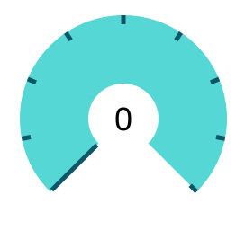

目前，我们已经掌握了一些 CG 函数。下面将使用`CoreGraphics`旋转、偏移 drawing context。

这些标记都是从中心辐射出：

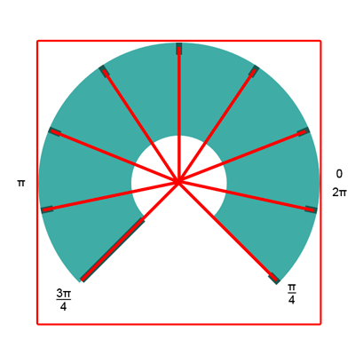

就像向 context 中绘制内容，还可以通过旋转、缩放、平移 context 的变换矩阵（transformation matrix）来操控 context。

变换矩阵的顺序很重要，下面的图片将介绍都进行哪些操作？如果你对变换（transform）还不了解，可以查看我的另一篇文章：[CGAffineTransform和CATransform3D](https://github.com/pro648/tips/blob/master/sources/CGAffineTransform%E5%92%8CCATransform3D.md)。

下图是旋转 context，然后在中心绘制矩形：


旋转前绘制了黑色矩形，旋转后分别绘制了绿色、红色矩形。有两点需要注意：

1. 旋转context时，锚点位于左上角。
2. 旋转context后，矩形仍位于context的中心。

绘制 counter view 的指示时，将先平移后旋转 context。

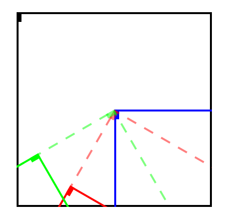

上图中，矩形位于context的左上角，蓝色矩形是平移context后的；红色虚线是旋转后的，最后对context平移。

在context中绘制红色矩形时，会以一定角度绘制。绘制完成后，需要重设context的中心，以便旋转、偏移context，绘制另一个指示。

正如之前绘制 clipping path 时，save、restore 上下文的变换矩阵，绘制指示也需要进行同样操作。

```
        guard let context = UIGraphicsGetCurrentContext() else { return }
        
        // 1. 保存当前 state
        context.saveGState()
        outlineColor.setFill()
        
        let markerWidth: CGFloat = 5.0
        let markerSize: CGFloat = 10.0
        
        // 2. marker矩形位于左上角
        let markerPath = UIBezierPath(rect: CGRect(x: -markerWidth / 2, y: 0, width: markerWidth, height: markerSize))
        
        // 3. 将context平移到中心
        context.translateBy(x: rect.width / 2, y: rect.height / 2)
        
        for i in 1...Constants.numberOfGlasses {
            // 4. 保存位于中心的state
            context.saveGState()
            // 5. 计算旋转角度
            let angle = arcLengthPerGlass * CGFloat(i) + startAngle - .pi / 2
            // 旋转、平移。
            context.rotate(by: angle)
            context.translateBy(x: 0, y: rect.height / 2 - markerSize)
            
            // 6. 填充指示矩形
            markerPath.fill()
            // 7. 恢复至中心零角度位置，以便进行下一次的计算。
            context.restoreGState()
        }
        
        // 8. 恢复至初始状态，以便进行其它绘制。
        context.restoreGState()
```

运行后效果如下：

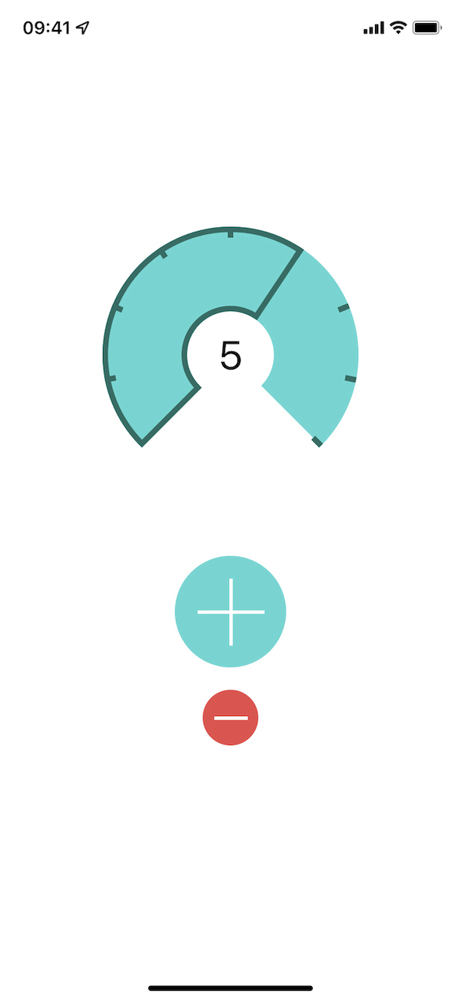

## 总结

这篇文章介绍了`CoreGraphics`的context，绘制了折线图、渐变，了解了`saveGState()`、`restoreGState()`。下一篇文章[CoreGraphics系列三：pattern和transparency layer](https://github.com/pro648/tips/blob/master/sources/CoreGraphics%E7%B3%BB%E5%88%97%E4%B8%89%EF%BC%9Apattern%E5%92%8Ctransparency%20layer.md)将介绍 pattern 和 transparency layer相关内容。

Demo名称：CoreGraphics2  
源码地址：<https://github.com/pro648/BasicDemos-iOS/tree/master/CoreGraphics-2>

参考资料：

1. [Core Graphics Tutorial: Gradients and Contexts](https://www.raywenderlich.com/10946920-core-graphics-tutorial-gradients-and-contexts)
2. [Nonzero-rule](https://en.wikipedia.org/wiki/Nonzero-rule)
3. [UIBezierPath绘图](https://github.com/darkjoin/Learning/blob/master/sources/UIBezierPath%E7%BB%98%E5%9B%BE.md)
