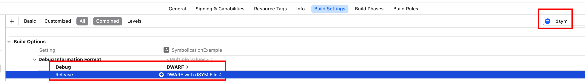
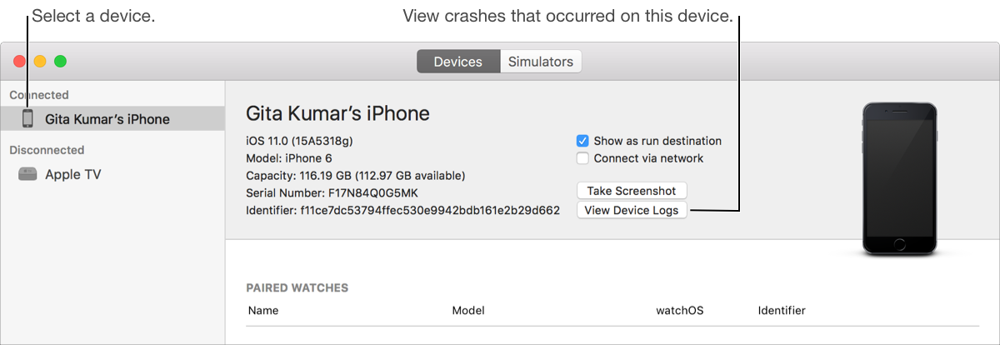
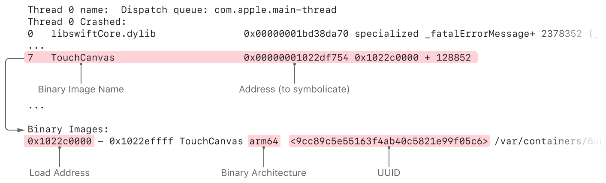

我们都希望app能稳定运行，但因为软件的复杂性，永远不能保证线上代码不会出错。无论是开发人员错误、系统缺陷，或者是第三方库错误，crash不可避免的会出现。

## 1. 什么是Crash日志

App crash后，系统会生成crash 日志，保存到设备中。日志包含了崩溃时每个线程堆栈。但堆栈信息以十六进制地址形式呈现，对开发者很不友好，必须将其转化为函数名、行号，这个过程称为符号化。

## 2. 获取Crash日志

如果app通过App Store、TestFlight发布，用户同意分享诊断数据后，可以直接在Window > Organizer > Crashes中获取。TestFlight版本app还会自动分享crash日志。

对于特定用户的crash，可以直接在设备的设置 > 隐私与安全性 > 分析与改进 > 分析数据，其会包含当前设备上app所有使用数据。在顶部搜索app名称，过滤得到指定app日志，点击打开日志后点击右上角分享发送即可。

## 3. Crash日志分析

Crash日志内容如下：

```
Incident Identifier: 1EE31E08-BACA-4EE4-B530-BEAFC1646BBC
CrashReporter Key:   6c88bbe45c0d6ad5afb5a266b0974edd82632bce
Hardware Model:      iPhone11,8
Process:             SymbolicationExample [769]
Path:                /private/var/containers/Bundle/Application/036F18BC-A4FD-4DAB-85FE-10C467E484A1/SymbolicationExample.app/SymbolicationExample
Identifier:          pro648.SymbolicationExample
Version:             1.0 (1)
Code Type:           ARM-64 (Native)
Role:                Foreground
Parent Process:      launchd [1]
Coalition:           pro648.SymbolicationExample [951]

Date/Time:           2023-05-14 10:03:39.4043 +0800
Launch Time:         2023-05-14 10:03:37.9698 +0800
OS Version:          iPhone OS 16.4.1 (20E772520a)
Release Type:        User
Baseband Version:    5.02.02
Report Version:      104

Exception Type:  EXC_BREAKPOINT (SIGTRAP)
Exception Codes: 0x0000000000000001, 0x00000001977e06f0
Termination Reason: SIGNAL 5 Trace/BPT trap: 5
Terminating Process: exc handler [769]

Triggered by Thread:  0

Kernel Triage:
VM - (arg = 0x0) pmap_enter retried due to resource shortage
VM - (arg = 0x0) pmap_enter retried due to resource shortage
VM - (arg = 0x0) pmap_enter retried due to resource shortage
VM - (arg = 0x0) pmap_enter retried due to resource shortage
VM - (arg = 0x0) pmap_enter retried due to resource shortage


Thread 0 name:   Dispatch queue: com.apple.main-thread
Thread 0 Crashed:
0   libswiftCore.dylib            	       0x1977e06f0 closure #1 in closure #1 in closure #1 in _assertionFailure(_:_:file:line:flags:) + 292
1   libswiftCore.dylib            	       0x1977e0588 closure #1 in closure #1 in _assertionFailure(_:_:file:line:flags:) + 332
2   libswiftCore.dylib            	       0x1977dff14 _assertionFailure(_:_:file:line:flags:) + 184
3   libswiftCore.dylib            	       0x1977bfbf8 Array._checkSubscript(_:wasNativeTypeChecked:) + 156
4   libswiftCore.dylib            	       0x1977c047c Array.subscript.getter + 88
5   SymbolicationExample          	       0x10478bab0 ViewController.handleButtonTapped() + 76
6   SymbolicationExample          	       0x10478bae8 @objc ViewController.handleButtonTapped() + 36
7   UIKitCore                     	       0x19fd11114 -[UIApplication sendAction:to:from:forEvent:] + 100
8   UIKitCore                     	       0x19fd10e14 -[UIControl sendAction:to:forEvent:] + 112
9   UIKitCore                     	       0x19fd107a8 -[UIControl _sendActionsForEvents:withEvent:] + 324
10  UIKitCore                     	       0x19fd1064c -[UIButton _sendActionsForEvents:withEvent:] + 124
11  UIKitCore                     	       0x19fd1020c -[UIControl touchesEnded:withEvent:] + 400
12  UIKitCore                     	       0x19fbc0adc -[UIWindow _sendTouchesForEvent:] + 776
13  UIKitCore                     	       0x19fbbff30 -[UIWindow sendEvent:] + 3280
14  UIKitCore                     	       0x19fbbf1e4 -[UIApplication sendEvent:] + 676
15  UIKit                         	       0x227bda358 -[UIApplicationAccessibility sendEvent:] + 96
16  UIKitCore                     	       0x19fbbd4d0 __dispatchPreprocessedEventFromEventQueue + 1768
17  UIKitCore                     	       0x19fc06130 __processEventQueue + 5576
18  UIKitCore                     	       0x19ff0b114 __eventFetcherSourceCallback + 160
19  CoreFoundation                	       0x19db2c208 __CFRUNLOOP_IS_CALLING_OUT_TO_A_SOURCE0_PERFORM_FUNCTION__ + 28
20  CoreFoundation                	       0x19db38864 __CFRunLoopDoSource0 + 176
21  CoreFoundation                	       0x19dabd6c8 __CFRunLoopDoSources0 + 244
22  CoreFoundation                	       0x19dad31c4 __CFRunLoopRun + 828
23  CoreFoundation                	       0x19dad84dc CFRunLoopRunSpecific + 612
24  GraphicsServices              	       0x1d8d4435c GSEventRunModal + 164
25  UIKitCore                     	       0x19fe6437c -[UIApplication _run] + 888
26  UIKitCore                     	       0x19fe63fe0 UIApplicationMain + 340
27  libswiftUIKit.dylib           	       0x1a64de0b0 UIApplicationMain(_:_:_:_:) + 104
28  SymbolicationExample          	       0x10478c858 static UIApplicationDelegate.main() + 104
29  SymbolicationExample          	       0x10478c7e0 static AppDelegate.$main() + 44
30  SymbolicationExample          	       0x10478c8dc main + 28
31  dyld                          	       0x1bcf6cdec start + 2220

Thread 1:
0   libsystem_pthread.dylib       	       0x1fd3f7b74 start_wqthread + 0

Thread 2:
0   libsystem_pthread.dylib       	       0x1fd3f7b74 start_wqthread + 0

Thread 3:
0   libsystem_pthread.dylib       	       0x1fd3f7b74 start_wqthread + 0

Thread 4 name:  com.apple.uikit.eventfetch-thread
Thread 4:
0   libsystem_kernel.dylib        	       0x1dc771c84 mach_msg2_trap + 8
1   libsystem_kernel.dylib        	       0x1dc784b54 mach_msg2_internal + 80
2   libsystem_kernel.dylib        	       0x1dc784e2c mach_msg_overwrite + 540
3   libsystem_kernel.dylib        	       0x1dc7721c8 mach_msg + 24
4   CoreFoundation                	       0x19dad2114 __CFRunLoopServiceMachPort + 160
5   CoreFoundation                	       0x19dad3340 __CFRunLoopRun + 1208
6   CoreFoundation                	       0x19dad84dc CFRunLoopRunSpecific + 612
7   Foundation                    	       0x197d760c4 -[NSRunLoop(NSRunLoop) runMode:beforeDate:] + 212
8   Foundation                    	       0x197d75fac -[NSRunLoop(NSRunLoop) runUntilDate:] + 64
9   UIKitCore                     	       0x19ff96dac -[UIEventFetcher threadMain] + 416
10  Foundation                    	       0x197d8f634 __NSThread__start__ + 716
11  libsystem_pthread.dylib       	       0x1fd3f86b8 _pthread_start + 148
12  libsystem_pthread.dylib       	       0x1fd3f7b88 thread_start + 8
...
```

顶部展示了进程信息，incident identifier标记本次crash，`CrashReporterKey`映射crash设备id，`Hardware Model`是硬件名称，`Process`是app名称。此外，还有app版本、发生时间、系统版本等。

`Exception Type`提供了crash类型信息，`Triggered by Thread`提供了导致crash的线程。

最后是线程回溯（thread backtrace），提供崩溃发生时所有活动线程帧。

## 4. 崩溃日志是否符号化了

符号化（symbolication）是将内存地址转换为函数、方法名称的过程，未符号化的日志都是内存地址。

编译源码时，编译器将人眼可识别的代码转换为机器码，编译完成后创建一个二进制产物，同时也会创建符号表。符号表将机器码与源码建立映射关系。

想要根据崩溃日志查看crash原因，需要符号化、部分符号化的日志，未符号化的日志几乎没有用途。

#### 4.1 完全符号化

完全符号化崩溃日志回溯（backtrace）的每一帧都有函数名称和行号，而非十六进制的内存地址。每一帧代表当前线程正在执行的函数，提供了app crash时app、操作系统正在执行的函数。完全符号化的日志对crash提供了最深入的信息。

如下是完全符号化日志的示例：

```
Thread 0 name:  Dispatch queue: com.apple.main-thread
Thread 0 Crashed:
0   libswiftCore.dylib                0x00000001bd38da70 specialized _fatalErrorMessage+ 2378352 (_:_:file:line:flags:) + 384
1   libswiftCore.dylib                0x00000001bd38da70 specialized _fatalErrorMessage+ 2378352 (_:_:file:line:flags:) + 384
2   libswiftCore.dylib                0x00000001bd15958c _ArrayBuffer._checkInoutAndNativeTypeCheckedBounds+ 66956 (_:wasNativeTypeChecked:) + 200
3   libswiftCore.dylib                0x00000001bd15c814 Array.subscript.getter + 88
4   TouchCanvas                       0x00000001022cbfa8 Line.updateRectForExistingPoint(_:) (in TouchCanvas) + 656
5   TouchCanvas                       0x00000001022c90b0 Line.updateWithTouch(_:) (in TouchCanvas) + 464
6   TouchCanvas                       0x00000001022e7374 CanvasView.updateEstimatedPropertiesForTouches(_:) (in TouchCanvas) + 708
7   TouchCanvas                       0x00000001022df754 ViewController.touchesEstimatedPropertiesUpdated(_:) (in TouchCanvas) + 304
8   TouchCanvas                       0x00000001022df7e8 @objc ViewController.touchesEstimatedPropertiesUpdated(_:) (in TouchCanvas) + 120
9   UIKitCore                         0x00000001b3da6230 forwardMethod1 + 136
10  UIKitCore                         0x00000001b3da6230 forwardMethod1 + 136
11  UIKitCore                         0x00000001b3e01e24 -[_UIEstimatedTouchRecord dispatchUpdateWithPressure:stillEstimated:] + 340
```

#### 4.2 部分符号化

部分符号化的日志有些回溯帧是函数名称，有些是十六进制地址。部分符号化对理解crash原因可能也是有帮助的，取决于哪些帧进行了符号化。你仍然可以对其进行符号化，以方便掌握完整堆栈。

以下是部分符号化日志示例：

```
Thread 0 name:  Dispatch queue: com.apple.main-thread
Thread 0 Crashed:
0   libswiftCore.dylib                0x00000001bd38da70 specialized _fatalErrorMessage+ 2378352 (_:_:file:line:flags:) + 384
1   libswiftCore.dylib                0x00000001bd38da70 specialized _fatalErrorMessage+ 2378352 (_:_:file:line:flags:) + 384
2   libswiftCore.dylib                0x00000001bd15958c _ArrayBuffer._checkInoutAndNativeTypeCheckedBounds+ 66956 (_:wasNativeTypeChecked:) + 200
3   libswiftCore.dylib                0x00000001bd15c814 Array.subscript.getter + 88
4   TouchCanvas                       0x00000001022cbfa8 0x1022c0000 + 49064
5   TouchCanvas                       0x00000001022c90b0 0x1022c0000 + 37040
6   TouchCanvas                       0x00000001022e7374 0x1022c0000 + 160628
7   TouchCanvas                       0x00000001022df754 0x1022c0000 + 128852
8   TouchCanvas                       0x00000001022df7e8 0x1022c0000 + 129000
9   UIKitCore                         0x00000001b3da6230 forwardMethod1 + 136
10  UIKitCore                         0x00000001b3da6230 forwardMethod1 + 136
11  UIKitCore                         0x00000001b3e01e24 -[_UIEstimatedTouchRecord dispatchUpdateWithPressure:stillEstimated:] + 340
```

#### 4.3 未符号化

未符号化的崩溃日志包含已加载镜像执行代码的十六进制内存地址，日志堆栈不包含函数名称。未符号化日志对排查问题没有价值，必须进行符号化。

以下是未符号化日志示例：

```
Thread 0 name:  Dispatch queue: com.apple.main-thread
Thread 0 Crashed:
0   libswiftCore.dylib                0x00000001bd38da70 0x1bd149000 + 2378352
1   libswiftCore.dylib                0x00000001bd38da70 0x1bd149000 + 2378352
2   libswiftCore.dylib                0x00000001bd15958c 0x1bd149000 + 66956
3   libswiftCore.dylib                0x00000001bd15c814 0x1bd149000 + 79892
4   TouchCanvas                       0x00000001022cbfa8 0x1022c0000 + 49064
5   TouchCanvas                       0x00000001022c90b0 0x1022c0000 + 37040
6   TouchCanvas                       0x00000001022e7374 0x1022c0000 + 160628
7   TouchCanvas                       0x00000001022df754 0x1022c0000 + 128852
8   TouchCanvas                       0x00000001022df7e8 0x1022c0000 + 129000
9   UIKitCore                         0x00000001b3da6230 0x1b3348000 + 10871344
10  UIKitCore                         0x00000001b3da6230 0x1b3348000 + 10871344
11  UIKitCore                         0x00000001b3e01e24 0x1b3348000 + 11247140
```

下面是帧每部分代表的信息：

```
3   libswiftCore.dylib                0x00000001bd15c814 0x1bd149000 + 79892
```

- 第一列3是帧号
- 第二列libswiftCore.dylib是模块名称
- 第三列0x00000001bd15c814是调用函数内存地址
- 第四列0x1bd149000是函数所在文件地址
- 第五列79892是函数在该文件内的偏移

## 5. 查找符号表

构建分为两种类型，一种是调试构建，一种是发布构建。

- 调试构建符号表位置：通过Xcode > Product > Show Build Folder in Finder可以找到调试产物文件夹，符号表位于Products > Debug-iphonesimulator文件夹中，路径为~/Library/Developer/Xcode/DerivedData。

  调试构建默认不生成符号表，如需生成可以手动设置。

  
- 发布构建符号表位置：通过Archives > 右键Show in Finder > 右键显示包内容 找到发布构建dSYMs文件，文件路径为：~/Library/Developer/Xcode/Archives。

调试构建的符号表和二进制可执行文件是关联的，每次构建都会产生新的UUID，用于唯一标记本次构建的app。

#### 5.1 Bitcode

Bitcode是LLVM的中间语言。使用LLVM编译源码时，源码被转换为中间语言，称为bitcode。最后对bitcode进行分析、优化，最终转换为目标架构的机器码。

Bitcode具有以下优势：

- LLVM前端只需要将源码转换为bitcode，后续流程都是一致的，不用关心是哪种语言编译产生的bitcode。
- 后续可以根据bitcode支持新架构CPU，无需再次编译源码。例如，上传app时只支持x86架构，后续苹果推出了arm架构，无需开发者再次打包上传，直接根据bitcode创建arm架构app。如果没有bitcode，只能所有开发者重新构建app，有了bitcode Apple可以为新架构自动构建app。编译器有了新特性后，使用新特性自动构建app。

但bitcode从来就不是固定格式，LLVM每次更新也会更新bitcode，并且不能保证向后兼容。另一个问题是bitcode不兼容汇编代码。

尽管bitcode具有一些优势，但Apple从来没有利用过这些优势。尽管上传的app包含bitcode，但同时也包含了支持架构的胖二进制（fa t binary）。app瘦身过程中移除其他架构和bitcode，但没有bitcode，Apple依然可以移除其他架构相关代码。尽管利用bitcode可以构建出其它架构的app，但Apple从来没有这样操作过，没有32位app自动变为64位app。Mac芯片从Intel迁移到M1后，没有app自动转变为原生支持ARM。

因此，Xcode 14弃用了bitcode。app开启bitcode后，所有framework、library都需要开启bitcode，否则符号化将不能正常进行。开启bitcode后，可以在app store connect下载dSYM文件。

#### 5.2 mdfind命令

崩溃日志顶部`slice_uuid`是本次crash符号表UUID，其格式为8-4-4-4-12（XXXXXXXX-XXXX-XXXX-XXXX-XXXXXXXXXXXX）。

所有字母转为大写后，使用`mdfind`命令查找查找符号表在本地路径：

```
$ mdfind "com_apple_xcode_dsym_uuids == <UUID>"
```

如果`mdfind`命令查找不到匹配的dSYM，需进行以下操作：

- 确保本地仍然保留了crash版本的archive。如果删除了该版本的archive，则不能符号化。

- 确保Xcode archive存放在Spotlight可以找到的地方，例如macOS的根目录。

- 确保构建时生成了符号表。默认情况下，调试构建不生成dSYM文件。

  

#### 5.3 dwarfdump命令

找到dSYM文件后，可以使用`dwarfdump`命令查看符号表UUID，查看是否与crash中UUID匹配，只有符号表uuid与crash uuid匹配才可以符号化crash日志。

```
$ dwarfdump --uuid <PathTodSYMFile>
```

如下所示：

```
$ dwarfdump --uuid SymbolicationExample.app.dSYM
UUID: DC3884DB-A50D-3AB4-B853-8E80855D9059 (arm64) SymbolicationExample.app.dSYM/Contents/Resources/DWARF/SymbolicationExample
```

使用以下命令可以查看符号表内容：

```
$ dwarfdump <PathTodSYMFile> | open -f
```

下面是代码和生成的符号表：

```
// 源代码
		@objc func handleButtonTapped() {
        let arr = [Int]()
        _ = arr[10]
    }
    
// 符号表
0x000512d5:       DW_TAG_subprogram
                    DW_AT_low_pc	(0x0000000100003904)
                    DW_AT_high_pc	(0x0000000100003964)
                    DW_AT_frame_base	(DW_OP_reg29 W29)
                    DW_AT_linkage_name	("$s20SymbolicationExample14ViewControllerC18handleButtonTappedyyF")
                    DW_AT_name	("handleButtonTapped")
                    DW_AT_decl_file	("~/Downloads/SymbolicationExample/SymbolicationExample/ViewController.swift")
                    DW_AT_decl_line	(29)
                    DW_AT_type	(0x00051656 "$sytD")
                    DW_AT_external	(true)
```

符号表会包含符号、行号、文件名称等信息。

- `DW_AT_low_pc`、`DW_AT_high_pc`分别代表函数起始、结束pc地址。
- `DW_AT_name`描述函数的名称。
- `DW_AT_decl_file`描述函数所在文件。
- `DW_AT_decl_line`描述函数在文件中的行号。
- `DW_AT_type`描述函数返回值类型。这里返回值类型是Void。

`DW_AT_low_pc`、`DW_AT_high_pc`描述的机器码地址并不等价于程序运行时地址，可以将其称为file_address。操作系统基于安全考虑，会应用一种地址空间布局随机化的技术（Address Space layout Randomization，简写为ASLR）。如果你对地址空间布局随机化还不了解，可以查看我的另一篇文章：[地址空间布局随机化ASLR及iOS内核如何实现随机化](https://github.com/pro648/tips/blob/master/sources/%E5%9C%B0%E5%9D%80%E7%A9%BA%E9%97%B4%E5%B8%83%E5%B1%80%E9%9A%8F%E6%9C%BA%E5%8C%96ASLR%E5%8F%8AiOS%E5%86%85%E6%A0%B8%E5%A6%82%E4%BD%95%E5%AE%9E%E7%8E%B0%E9%9A%8F%E6%9C%BA%E5%8C%96.md)。

地址空间布局随机化是一种针对缓冲区溢出的安全保护技术。通过对堆、栈、共享库映射等线性区布局的随机偏移（下文称为load_address），增加攻击者预测目的地址难度，防止攻击者直接定位攻击代码位置，进而达到阻止溢出攻击的一种技术。获取到偏移后还需要加上`__Text`Segment的vmaddr才可以还原出运行时地址。vmaddr可以通过size指令或`otool -l`指令拿到。vmaddr一般跟架构相关，armv7架构通常是0x4000，arm64架构通常是0x100000000。将函数运行时的地址称为runtime_address。

上述地址之间计算公式为：

```
file_address = runtime_address - load_address + vm_address
```

## 6. 如何符号化crash日志

这里介绍三种符号化的方案：

- 使用Xcode符号化日志

- 使用`atos`符号化特定行
- 使用`symbolicatecrash`符号化整个日志

#### 6.1 使用Xcode符号化

使用Xcode直接符号化日志是最为推荐、简洁的方法。其会使用所有可用dSYM文件直接符号化crash日志。

点击Devices and Simulator中的`View Device Logs`，将日志拖拽到左侧列表中。



如果符号化失败，或部分符号化，可能是未能找到dSYM文件，可以查找到dSYM文件后使用下面方案手动符号化。

#### 6.2 atos

使用`atos`命令可以将十六进制地址转换为函数名称、行号信息。流程如下：

1. 确定要符号化的帧，如第二列的模块名称，第三行的函数地址。

2. 在日志底部查找该模块架构和加载地址。

3. 查找该模块符号表。

4. 使用以下命令符号化日志：

   `$ atos -arch <BinaryArchitecture> -o <PathToDSYMFile>/Contents/Resources/DWARF/<BinaryName>  -l <LoadAddress> <AddressesToSymbolicate>`

   > dSYM文件是macOS包，包内包含调试符号。使用`atos`命令时，必须提供符号文件路径，而非dSYM文件路径。

查看下面crash日志高亮部分：



完整的`atos`命令和输出如下：

```
$ atos -arch arm64 -o TouchCanvas.app.dSYM/Contents/Resources/DWARF/TouchCanvas -l 0x1022c0000 0x00000001022df754
ViewController.touchesEstimatedPropertiesUpdated(_:) (in TouchCanvas) + 304
```

#### 6.3 symbolicatecrash

`symbolicatecrash`是Apple提供的符号化命令行工具，与Xcode一起提供。使用以下命令查找到`symoblicatecrash`工具：

```
$ find /Applications/Xcode.app -name symbolicatecrash -type f
/Applications/Xcode.app/Contents/SharedFrameworks/DVTFoundation.framework/Versions/A/Resources/symbolicatecrash
```

复制`symbolicatecrash`到新建的文件夹中，将crash日志、匹配的dSYM也放到同一文件夹中。

定义Developer_DIR：

```
export DEVELOPER_DIR=/Applications/Xcode.app/Contents/Developer
```

执行符号化操作：

```
$ ./symbolicatecrash ./appName.crash ./appName.app.dSYM > customName.log
```

## 7. 常见crash类型

#### 坏内存访问 Bad Memory Access EXC_BAD_ACCESS

访问已经释放的对象是导致坏内存访问的常见原因。

#### 异常退出 Abnormal Exit SIGABRT

开发者异常结束app运行，这种类型的异常通常是未捕获的异常。可以通过`abort()`、`assert()`触发此类异常。

#### 跟踪陷阱 Trace Trap [SIGTRAP]

Trace trap不展示crash来源，异常被抛到主线程runloop，主要用于断点调试。

#### 非法指令 LLLegal Instruction [SIGILL]

非法指令指格式错误、未知的指令。如果代码跳转到无效但可执行的内存地址，会导致非法指令错误。

#### 浮点异常 SIGFPE

FPE是floating point exception首字母缩写。当进程执行了一个错误的算数操作时会触发。常见的例子是整数除以零。

#### 总线错误 SIGBUS

总线错误的常见原因由：不存在的地址、未对齐的访问、分页错误等。

#### 段违例 Segmentation violation [SIGSEGV]

内核检测到进程访问无效的内存地址时，可能抛出SIGSEGV。例如释放非法指针。

#### SIGQUIT

另一个具有管理进程权限的进程结束了当前进程。虽然当前进程并没有crash，但出现了非预期的行为。

> 用户从多任务中心结束app、系统杀死处于后台的app，并不会产生crash日志。

参考资料：

1. [How To Symbolicate Crash Logs in iOS](https://betterprogramming.pub/how-to-symbolicate-crash-logs-in-ios-b05637591364)

2. [Understanding of Crash Log Symbolication](https://medium.com/@iboudhayan/understanding-of-crash-log-symbolication-a0c00c6e86f0)

3. [Adding identifiable symbol names to a crash report](https://developer.apple.com/documentation/xcode/adding-identifiable-symbol-names-to-a-crash-report#)

4. [Understanding Crashes and Crash Logs](https://medium.com/@jjuou2/understanding-crashes-and-crash-logs-fff9781a5df4)

5. [Xcode 14 deprecates bitcode - but why?](https://stackoverflow.com/questions/72543728/xcode-14-deprecates-bitcode-but-why)

6. [iOS基础之崩溃日志符号化](https://juejin.cn/post/6844903641036357640)

7. [iOS 符号解析重构之路](https://mp.weixin.qq.com/s/TVRYXhiOXIsMmXZo9GmEVA)

   
