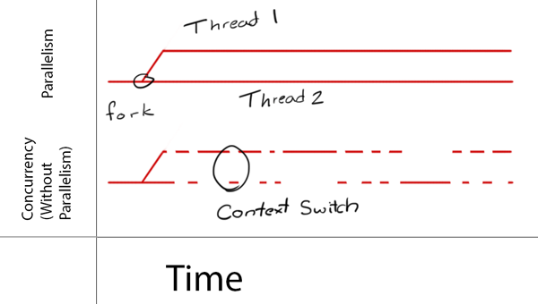
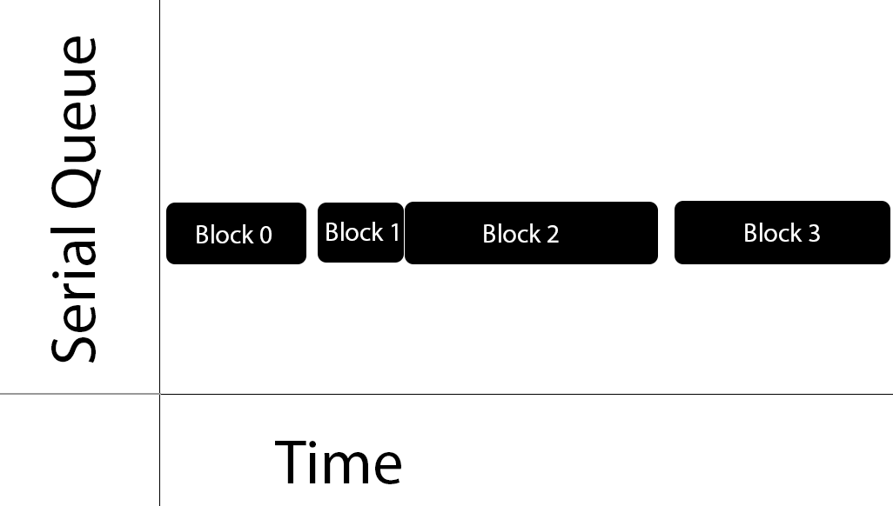
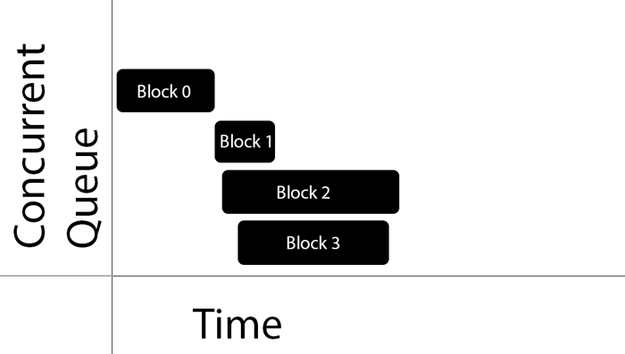
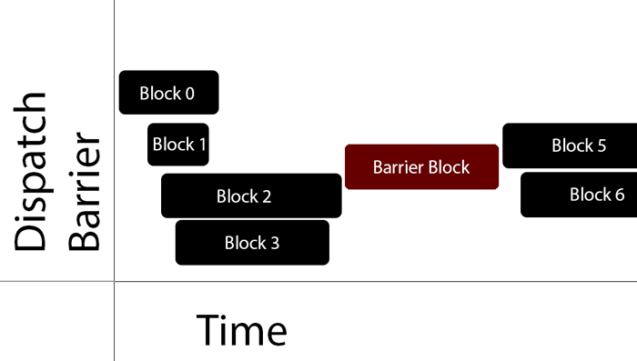
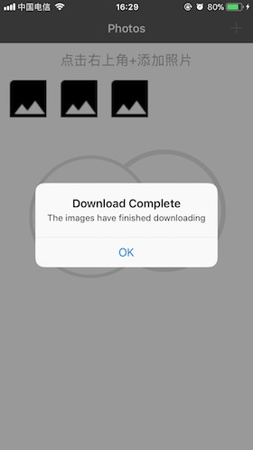

在计算机的早期，中央处理器（Central Processing Unit，简称CPU）的主频（即时钟频率， clock speed ）决定单位时间可执行任务数量。随着技术的进步，处理器的设计变得更加紧凑，散热和其他物理因素开始限制CPU的时钟频率。因此，芯片（chip）制造商寻求其他途径来提高芯片的整体性能，最终解决方案就是增加芯片上处理器的内核数。通过增加内核数量，单个芯片每秒可执行更多指令（instruction），而不需要增加CPU主频、改变芯片大小。唯一的问题是如何利用额外的核心。

对于像macOS、iOS这样的多任务操作系统，任一时刻都会有上百个程序在运行。因此，需要安排不同程序在不同核心上。然而，大部分正在运行的程序要么是系统守护进程（ system daemon）要么是后台应用，只需要占用非常短的处理器时间。相反，用户当前使用的app，占用CPU主要资源。

应用程序使用多核的传统方式是创建多个线程（multiple thread），但线程代码最大问题是不能很好扩展到任意数量的内核。你不能创建与内核一样多的线程，并期望程序运行良好。系统当前负载和硬件共同决定当前最佳线程数量，即当前最佳线程数量会动态变化。因此，计算出当前最佳线程数量将非常具有挑战性。即使你的计算是正确的，使这些线程高效运行、互不干扰也是非常具有挑战性的。

macOS和iOS不依赖线程，而是采用了异步（asynchronous）设计方案来解决并发（concurrency）问题。异步函数已在操作系统中使用了很多年，通常用于处理耗时的任务，如读取磁盘数据。异步函数调用任务后立即返回，不需要等待任务执行。通常，这项工作包括以下三部分：

1. 获取后台线程。
2. 在获取到的后台线程开始任务。
3. 当任务执行完毕时通过回调通知调用者。

在过去，如果没有满足需求的后台线程，就需要自己编写异步函数，创建、管理后台线程。这类多线程方案如下：

- pthread：是一套通用的多线程API，由C语言编写。适用于Unix、Linux、Windows等系统，具有跨平台、可移植优点，但使用难度大，需开发者管理线程生命周期，平常几乎不使用。
- NSThread：由 Objective-C 语言编写。使用简单，更加面向对象，可直接操作线程对象。生命周期由开发者控制，偶尔使用`NSThread`。

现在，macOS和iOS提供以下技术支持异步执行任何任务，而不需要自己管理线程。

- Grand Central Dispatch简称GCD ，GCD是基于C语言开发的，其结合了语言特点、运行时库（runtime library），可以为macOS、iOS、watchOS和tvOS系统上的多核设备提供系统级的并发支持，可以更好协调所有正在运行app的需求，并以均衡的方式分配可用资源。使用GCD时应用程序只需要定义需要执行的任务，然后交由系统执行，而不再需要创建线程。通过让系统管理线程，app获得了原线程编程方式无法实现的伸缩性，开发人员也可以实现更简单、更高效的编程模型。
- 操作队列（Operation Queue）是Objective-C API，是在GCD之上实现了一些方便的功能，即`NSOperation`API是GCD的高级抽象。如果你在使用`NSOperation`，那么你在隐式使用GCD。使用`NSOperation`时只需要定义要执行的任务，将其添加到`NSOperationQueue`队列即可，`NSOperationQueue`负责这些任务的调度和执行。与GCD一样，`NSOperationQueue`负责所有的线程管理，以确保系统、app尽可能高效的运行。`NSOperation`是基类，不能直接使用，需继承后使用其子类，或使用系统提供的子类来执行任务。例如`NSInvocationOperation`和`NSBlockOperation`。如需了解更多，可以查看[Operation、OperationQueue的使用](https://github.com/pro648/tips/wiki/Operation%E3%80%81OperationQueue%E7%9A%84%E4%BD%BF%E7%94%A8)。

这一篇文章只涉及GCD的使用。

## 1. GCD术语

在学习GCD之前，需要学习几个与此相关的概念。

#### 1.1 串行Serial

任务串行执行时，一次只能执行一个任务。

> 在应用程序中，术语任务（task）有广泛的应用，但在这篇文章中，可以把一个任务理解为一个[块（Block）](https://github.com/pro648/tips/wiki/Block%E7%9A%84%E7%94%A8%E6%B3%95)。在函数中也可以使用GCD，但因块更为简单、直观，所以，更常使用块。

#### 1.2 并发Concurrent

并发指task同时（simultaneously）发生，可以被同时执行，但具体是否同时执行由GCD根据当前负载决定。

#### 1.3 并行Parallelism

并行指多个任务同时执行。

通过并行技术，多核设备可以同时执行多个线程；单核设备如果想要并行执行任务，就需要运行一个线程，执行环境切换（也称上下文切换，context switch），运行另外一个线程或进程（process），这通常很快发生，足以形成并行执行的错觉。如下图所示：



比如很多人同时在候车室排队检票，可以理解为并发。如果候车室开通多个检票口同时检票，这时一次可为多位旅客检票，可理解为并行。

并行的反义词是串行，并发实际上是关于结构。当使用GCD编写代码时，需要构建可以同时运行的任务，不能同时运行的任务。可以同时运行的任务是否并行，及并行时同时执行几项任务由GCD来决定。并行的任务必须并发，但并发的任务并不保证得到并行。

#### 1.4 同步Synchronous

同步执行会等待提交的task执行完毕后，再继续执行后面任务。我们平常调用的方法都是同步方法，如第一行调用`doSomething:`方法，程序执行第二行时，`doSomething:`方法肯定执行完毕了。同步执行一些耗时操作时会堵塞当前线程。调用`dispatch_sync`函数并将任务提交到当前队列（即`dispatch_sync`函数所在队列）会导致死锁。

因为是同步调用，目标队列不会复制块（Block_copy），而只引用块。为提高性能，同步函数一般尽可能在当前线程调用块。

#### 1.5 异步Asynchronous

异步指调用任务后立即返回，不需要等待任务执行。异步不会堵塞当前线程。

#### 1.6 临界区块Critical Section

Critical section的代码不能被同时执行，即不同线程、进程同时访问。通常是因为代码操纵共享资源，如果被多线程同时访问，会损坏数据。如对`NSMutableArray`进行写操作时，不能同时进行读取操作。

#### 1.7 竟态条件Race Condition

在race condition条件下，软件系统的行为取决于任务的执行顺序，而任务执行顺序不受控。Race condition可能产生不可预知行为，且通过代码检查时不易显现出来。

#### 1.8 死锁Dead Lock

两个或多个任务、线程都在等待对方完成操作。第一个任务无法完成，因为它在等待第二个任务完成。第二个任务无法完成，因为它在等待第一个任务完成。两个任务相互等待，这就形成了死锁。

#### 1.9 线程安全Thread Safe

线程安全的代码可以在多个线程或并发任务中同时执行。非线程安全的代码一次只能在一个环境中运行。例如，`NSArray`是线程安全的，可以同时在多个线程或并发任务中执行。而`NSMutableArray`不是线程安全的，一次只能在一个环境中运行。

#### 1.10 环境切换Context Switch

Context switch指当在同一个处理器处理不同线程时，存储和恢复执行状态的过程。编写多任务应用程序时，进行上下文切换非常常见，但会产生额外的开销。

## 2. GCD队列

GCD提供的调度队列（ dispatch queue）是一个类似于对象的结构，用于管理向其提交的任务。所有的dispatch queue都是先进先出（first in, first out. 简称FIFO）的数据结构。因此，队列中任务运行顺序与添加顺序一致，即第一个进入队列的任务，第一个被执行；第二个进入队列的任务，第二个被执行；以此类推。

所有dispatch queue自身都是线程安全的，因此，你可以从多个线程访问它们。当你了解了调度队列如何为你编写的代码提供线程安全时，GCD的好处就显而易见了。使用GCD的关键在于把要执行的任务提交到正确的dispatch queue或调度函数。

GCD的队列分为串行队列（Serial Queues）和并发队列（Concurrent Queues）两种。

#### 2.1 串行队列Serial Queues

在Serial Queues中，一次执行一个任务，一个任务完成后另一个任务才会开始。两个任务间隔时间无法确定。



串行队列中任务执行时间由GCD控制，唯一可以保证的是任务执行顺序和添加顺序一致。

> 因为serial queues中任务一次只能运行一个，所以不会产生同时访问critical section，产生race condition的风险。

#### 2.2 并发队列Concurrent Queues

GCD只能保证并发队列中的任务按照添加的顺序开始执行。至于task结束顺序，两个task间时间间隔，任一时间正在运行task数量都无法保证。



上图中的Block 0开始一段时间后Block 1才开始执行，Block 1、Block 2、Block 3开始时间相差很短。虽然Block 3比Block 2开始的晚，但结束的早。

GCD决定什么时间开始执行任务。如果两项任务执行时间重合，由GCD决定是否在另一个内核上（如果目前有空闲内核）运行任务，还是执行context switch来执行另一任务。

## 3. 创建和管理Dispatch Queues

在提交任务到dispatch queue之前，必须确定要使用的队列类型以及如何使用。如果有特殊用途，可以自定义配置队列。

为了方便使用，GCD默认提供了主队列`dispatch_get_main_queue`和全局队列`dispatch_get_global_queue`。

#### 3.1 获取主队列`dispatch_get_main_queue` 

主队列是一个全局的串行队列，运行在应用程序的主线程上。主队列与[run loop](https://github.com/pro648/tips/wiki/RunLoop%E4%BB%8E%E5%85%A5%E9%97%A8%E5%88%B0%E8%BF%9B%E9%98%B6)协同工作，交错执行主队列中任务和run loop中其他响应事件。

```
    // 获取主队列
    dispatch_queue_t mainQueue = dispatch_get_main_queue();
```

#### 3.2 获取全局队列`dispatch_get_global_queue`

全局队列是并发队列。

系统为每个应用程序提供了四个不同优先级的全局队列。因为这些队列是全局的，可以直接使用`dispatch_get_global_queue`函数请求队列，不需要显式创建。

```
    // 获取优先级为QOS_CLASS_USER_INITIATED的全局队列
    dispatch_queue_t aQueue = dispatch_get_global_queue(QOS_CLASS_USER_INITIATED, 0);
```

`dispatch_get_global_queue`函数的第一个参数指定Quality of Service（简称 QoS），第二个参数是为未来扩展保留的。目前，总是设置为`0`。

指定优先级的四个参数如下：

| QoS Class                  | 用途                                                         | 任务所需时间                   |
| -------------------------- | ------------------------------------------------------------ | ------------------------------ |
| QOS_CLASS_USER_INTERACTIVE | 优先级与主线程任务相同，用于处理用户正在等待、需要立即反馈的任务。追求性能和响应速度。 | 接近瞬间完成。                 |
| QOS_CLASS_USER_INITIATED   | 用于用户发起的，需要立即获得结果的任务。例如，打开磁盘上的文档，用户点击界面时执行相应操作，即用户交互的下一步需要这一步的执行结果。对响应和性能有较高要求的。 | 几乎瞬间完成，如几秒钟或更少。 |
| QOS_CLASS_UTILITY          | 需要一些时间来完成，不需要立即返回结果。例如，下载或导入数据。一般有提示进度的进度条。追求响应和能源效率的平衡。 | 几秒钟至几分钟。               |
| QOS_CLASS_BACKGROUND       | 在后台运行，不需要用户看到。例如：索引、同步、备份。关注能源效率。 | 几分钟到几个小时。             |

> `QOS_CLASS_USER_INTERACTIVE`的优先级与主线程相同，但`QOS_CLASS_USER_INTERACTIVE`仍然是在全局队列，更新UI只能在主线程中。
>
> 没有用户交互时，app中任务应当至少90%时间在utility及以下级别运行。

#### 3.3 自定义队列

除了使用系统提供的队列，还可以手动创建队列。

```
    // 创建串行队列
    dispatch_queue_t serialQueue = dispatch_queue_create("com.GCD.serialQueue", DISPATCH_QUEUE_SERIAL);
    
    // 创建并发队列
    dispatch_queue_t conQueue = dispatch_queue_create("com.GCD.conQueue", DISPATCH_QUEUE_CONCURRENT);
```

`dispatch_queue_create`函数有两个参数，第一个参数指定队列名称，debugger和性能工具会显示此处队列名称以帮助跟踪任务执行情况。第二个参数指定是串行还是并发队列。在iOS 4.3之前，该参数默认为`NULL`，队列为串行队列。

你可以创建任意数量串行队列，但这些串行队列之间是并发关系。例如，创建了四个串行队列，每个串行队列执行一个任务，系统可能同时执行这四个任务。

> 虽然你可以创建任意数量的串行队列，但不要寄希望于串行队列间并发运行这一特性来提高性能，而应该提交多个任务到并发队列。

## 4. 通过demo学习GCD

由于这篇文章的目的是优化代码，以及从不同线程安全地调用代码。因此，你将通过下面网址下载一个模版文件。

Demo名称：GrandCentralDispatch模板  
源码地址：<https://github.com/pro648/BasicDemos-iOS/tree/master/GrandCentralDispatch模板>

该模板文件是一个未优化、非线程安全的demo。在该demo内，可以通过相册或设定的网址获取图片，使用Core Image的`CIDetector`API为图片中的眼睛添加标记。

运行下载的模版，如下所示：


可以看到当通过网络获取图片时，`UIAlertController`过早的弹出，稍后会修复这一问题。

这个demo主要有以下四部分：

- CollectionViewController：启动程序后的第一个视图控制器，通过略缩图显示所有照片。
- DetailViewController：为眼睛添加图像，并在`UIImageView`中显示图片。
- Photo：为来自`NSURL`类或`ALAsset`类的对象实例化照片，最后提供照片、略缩图。如果是通过网络下载的照片，还会提供下载状态。
- PhotoManager：管理Photo实例。

## 5. 使用`dispatch_async`处理后台任务

再次打开app，从相册添加照片，或从网络下载照片。

点击`CollectionViewController`中的略缩图，观察从略缩图跳转到`DetailViewController`的过程，可以观察到有明显滞后。这是因为`viewDidLoad`中添加了过多的任务，导致初始化`DetailViewController`时间变长。如果可能，最好减少`viewDidLoad`中工作量，加快视图控制器加载速度。`dispatch_async`适合用来处理这一任务。

进入`DetailViewController.m`文件，使用下面代码替换`viewDidLoad`中代码：

```
- (void)viewDidLoad {
    [super viewDidLoad];
    
    self.imageView.image = self.image;
    NSAssert(self.image, @"Image not set; required to use view controller");
    
    // 1.将代码从主线程移入全局队列，因为是异步执行，不会堵塞主线程。
    dispatch_async(dispatch_get_global_queue(QOS_CLASS_USER_INTERACTIVE, 0), ^{
        UIImage *overlayImage = [self faceOverlayImageFromImage:self.image];
        
        // 2.目前已经获取到新的照片，在主线程更新UI。
        dispatch_async(dispatch_get_main_queue(), ^{
            [self fadeInNewImage:overlayImage];
        });
    });
}
```

再次运行demo，选择略缩图，可以看到`DetailViewController`初始化速度变快了，短暂延迟之后为眼睛添加图像。如果加载一张更大照片，app也不会卡在加载视图控制器环节了。

`dispatch_async`提交任务到队列后立即返回，由GCD决定任务具体执行时间。当需要获取网络资源或进行大量计算时，应当使用`dispatch_async`避免堵塞主线程。

`dispatch_async`常用队列：

- 自定义串行队列Custom Serial Queue：和`dispatch_async`结合是很好的方案。
- 主队列Main Queue（Serial）：完成并发队列任务后常用主队列更新UI，这时的代码通常在之前的并发队列块内。如果当前在主队列中，又以主队列为目标调用`dispatch_async`，则会在当前方法结束后才执行此任务。
- 并发队列Concurrent Queue：在后台执行非UI工作的常用选择。


## 6. 使用`dispatch_after`推迟任务

现在考虑下app的UE，当用户第一次打开应用时会疑惑这个应用是做什么的？当`PhotoManager`类没有任何photo实例时，应该添加一个提示帮助用户了解如何使用这个app。同时需要注意的是，如果提示弹出太快，用户注意力可能在其他位置，将不能捕捉到提示。延迟一秒显示提示足以吸引到用户的注意力。

进入`CollectionViewController.m`文件，更新`showOrHideNavPrompt`方法，如下所示：

```
- (void)showOrHideNavPrompt {
    NSUInteger count = [[PhotoManager sharedManager] photos].count;
    double delayInSeconds = 1.0;
    // 声明需要延迟的时间，单位为纳秒nanosecond，一秒的十亿分之一。
    dispatch_time_t popTime = dispatch_time(DISPATCH_TIME_NOW, (int64_t)(delayInSeconds * NSEC_PER_SEC));
    
    // 等待popTime时长后，异步提交block到主队列。
    dispatch_after(popTime, dispatch_get_main_queue(), ^{
        if (count) {
            self.headerSize = CGSizeZero;
            [self.collectionView reloadData];
        }
        else
        {
            self.headerSize = CGSizeMake(40, 40);
            [self.collectionView reloadData];
        }
    });
}
```

运行app，稍有延迟后，`sectionHeader`部分会出现如何操作的提示。

`dispatch_after`的时间参数支持设置为`DISPATCH_TIME_NOW`，但不如直接使用`dispatch_async`；时间参数不支持设置为`DISPATCH_TIME_FOREVER`。

`dispatch_after`常用队列：

- 自定义串行队列：需要小心使用，最好用在主队列中。
- 主队列：这是`dispatch_after`的最佳队列。Xcode有一个自动完成模版用来在主队列使用`dispatch_after`。
- 并发队列：很少需要在并发队列使用`dispatch_after`。

## 7. `dispatch_once`让单例线程安全

单例（Singleton）常被同时从多个控制器调用，因此，必须确保单例线程安全。

单例模式的线程问题包括初始化、读取、写入等。`PhotoManager`类被设计为单例，但其目前并不是线程安全的。可以通过创建race condition来验证该问题。

打开`PhotoManager.m`文件，`sharedManager`方法如下所示：

```
+ (instancetype)sharedManager {
    // 创建单例
    static PhotoManager *sharedPhotoManager = nil;
    if (!sharedPhotoManager) {
        sharedPhotoManager = [[PhotoManager alloc] init];
        // 初始化私有photosArray数组
        sharedPhotoManager->_photosArray = [NSMutableArray array];
    }
    return sharedPhotoManager;
}
```

由于`if`语句不是线程安全的，多次调用会出现以下情况：一个线程（称为线程A）进入`if`语句，在`sharedManager`分配内存前进行了context switch，另一线程（称为线程B）进入了`if`语句，初始化了一个`sharedManager`并结束。当系统再次context switch回线程A时，会再次初始化一个`sharedManager`。目前为止，我们有两个单例对象，而这不是我们想要的。

为强制出现上面的情况，更新`sharedManager`方法代码如下：

```
+ (instancetype)sharedManager {
    // 创建单例
    static PhotoManager *sharedPhotoManager = nil;
    if (!sharedPhotoManager) {
        // 通过使用sleepForTimeInterval:方法强制进行环境切换。
        [NSThread sleepForTimeInterval:2.0];
        sharedPhotoManager = [[PhotoManager alloc] init];
        NSLog(@"%i %s",__LINE__, __PRETTY_FUNCTION__);
        NSLog(@"Singleton has memory address at: %@",sharedPhotoManager);
        [NSThread sleepForTimeInterval:2.0];
        // 初始化私有photosArray数组
        sharedPhotoManager->_photosArray = [NSMutableArray array];
    }
    return sharedPhotoManager;
}
```

进入`AppDelegate.m`文件，导入`PhotoManager.h`文件，更新`application:didFinishLaunchingWithOptions:`方法如下：

```
- (BOOL)application:(UIApplication *)application didFinishLaunchingWithOptions:(NSDictionary *)launchOptions {
    // Override point for customization after application launch.
    [[UINavigationBar appearance] setBarStyle:UIBarStyleBlack];
    
    // 创建两个异步并发调用，来实例化单例，以产生race condition。通过输出可以看出初始化了几个单例对象。
    dispatch_async(dispatch_get_global_queue(QOS_CLASS_USER_INTERACTIVE, 0), ^{
        [PhotoManager sharedManager];
    });
    dispatch_async(dispatch_get_global_queue(QOS_CLASS_USER_INTERACTIVE, 0), ^{
        [PhotoManager sharedManager];
    });
    return YES;
}
```

运行app，控制台输出如下：

```
GrandCentralDispatch[1349:412491] 28 +[PhotoManager sharedManager]
GrandCentralDispatch[1349:412490] 28 +[PhotoManager sharedManager]
GrandCentralDispatch[1349:412490] Singleton has memory address at: <PhotoManager: 0x1c0010f60>
GrandCentralDispatch[1349:412491] Singleton has memory address at: <PhotoManager: 0x1c0010f60>
GrandCentralDispatch[1349:412376] 28 +[PhotoManager sharedManager]
GrandCentralDispatch[1349:412376] Singleton has memory address at: <PhotoManager: 0x1c40114f0>
```

可以看到代码的critical condition（即初始化单例部分）执行了不止一次，虽然这里是强制产生race condition，但这种情况也会无意中发生。

> 线程问题可能难以调试，因为它们往往难以重现。

为解决该错误，实例化代码应只执行一次，并在初始化的过程中阻止其他线程进入critical section，这正是`dispatch_once`所做的。

更新`sharedManager`方法如下：

```
+ (instancetype)sharedManager {
    // 创建单例
    static PhotoManager *sharedPhotoManager = nil;
    static dispatch_once_t onceToken;
    dispatch_once(&onceToken, ^{
        // 通过使用sleepForTimeInterval:方法强制进行环境切换。
        [NSThread sleepForTimeInterval:2.0];
        sharedPhotoManager = [[PhotoManager alloc] init];
        NSLog(@"%i %s",__LINE__, __PRETTY_FUNCTION__);
        NSLog(@"Singleton has memory address at: %@",sharedPhotoManager);
        [NSThread sleepForTimeInterval:2.0];
        // 初始化私有photosArray数组
        sharedPhotoManager->_photosArray = [NSMutableArray array];
    });
    return sharedPhotoManager;
}
```

运行demo，通过控制台可以看到单例只有一个实例。

最后，移除`AppDelegate.m`中的`dispatch_async`部分代码，移除`sharedManager`方法内强制产生race condition的代码和`NSLog` 输出。

> `dispatch_once`只是使共享的实例（即`sharedManager`）线程安全，而不会使类（即PhotoManager）线程安全，类中可能还会有其他critical section，如对数据操作部分。这些critical section也需要使用其他方式实现线程安全，比如使用[synchronize](https://github.com/pro648/tips/wiki/%E7%BA%BF%E7%A8%8B%E5%90%8C%E6%AD%A5%E4%B9%8B%E8%87%AA%E6%97%8B%E9%94%81)方式访问数据。

## 8. 单例读写线程安全

在处理单例时，如果单例中的属性是可变对象，那么需要考虑该对象本身是否线程安全。如果该属性是Foundation中容器类，则答案是不一定线程安全。一般不可变对象是线程安全，可变对象是非线程安全，这里的非线程安全很多时候指可以通过多个线程使用，但不能同时使用，具体是否线程请查阅Apple[文档](https://developer.apple.com/library/content/documentation/Cocoa/Conceptual/Multithreading/ThreadSafetySummary/ThreadSafetySummary.html)。

在`PhotoManager`单例中使用的`NSMutableArray`是非线程安全的。当多个线程同时读取`NSMutableArray`时不会出现问题，但当有线程正在写时，其他线程进行读取就会出现问题。目前，`PhotoManager`单例并不能阻止这种情况发生。

现在查看`PhotoManager.m`文件中的`addPhoto:`和`photos`方法：

```
// 这是一个写方法，其修改了私有可变数组对象。
- (void)addPhoto:(Photo *)photo {
    if (photo) {
        [_photosArray addObject:photo];
        dispatch_async(dispatch_get_main_queue(), ^{
            [self postContentAddedNotification];
        });
    }
}

// 这是一个读方法，通过获取不可变副本防止调用者改变数据。
- (NSArray *)photos {
    return [NSArray arrayWithObject:self.photosArray];
}
```

在读方法中，通过获取不可变副本可以防止调用者改变数据，但不能阻止一个线程调用`addPhoto:`，同时另一线程调用`photos`。

这是软件开发中经典的[Readers-Writes问题](https://en.wikipedia.org/wiki/Readers%E2%80%93writers_problem)，GCD提供了一个优雅的解决方案，那就是使用dispatch barriers创建[Readers-write lock](https://en.wikipedia.org/wiki/Readers%E2%80%93writer_lock)。

当dispatch barriers在concurrent queues队列上使用时，其充当了串行风格的队列。使用GCD的barrier API可以确保提交到指定队列的块运行时，该队列上其他任务不会运行。这意味着，执行到dispatch barrier时，dispatch barrier的任务不会立即执行，会等待其他任务执行完毕后才开始执行。

当dispatch barrier开始执行任务时，队列不会执行其他任务。dispatch barrier任务执行完毕后，队列立即恢复至原来状态。GCD提供了同步屏障`dispatch_barrier_sync`和异步屏障`dispatch_barrier_async`两种方法。

下图说明了barrier函数对异步块的影响：



从上图可以看到，在进入dispatch barrier前，队列就像正常的并发队列。当进入dispatch barrier队列后，队列变为了串行队列，barrier block是唯一在执行的任务。当barrier block结束后，队列立即恢复为原来的并发队列。

创建一个自定义并发队列，使用barrier函数区分开`PhotoManager`中读写操作，在自定义并发队列中将允许多个线程同时读取数据。

进入`PhotoManager.m`文件，在私有接口部分声明一个并发队列，并更新`addPhoto:`方法：

```
@interface PhotoManager ()

@property (strong, nonatomic) NSMutableArray *photosArray;
@property (strong, nonatomic) dispatch_queue_t concurrentPhotoQueue;    // 添加此属性。

@end

- (void)addPhoto:(Photo *)photo {
    if (photo) {
        // 将写操作添加到barrier函数，以便执行到写操作时队列只执行这一项任务。
        dispatch_barrier_async(self.concurrentPhotoQueue, ^{
            // 由于dispatch_barrier_async函数的存在，执行到下面操作时，concurrentPhotoQueue队列不会执行其他任务。
            [_photosArray addObject:photo];
            
            // 因为要更新UI，所以在主队列发送通知。
            dispatch_async(dispatch_get_main_queue(), ^{
                [self postContentAddedNotification];
            });
        });
    }
}
```

另外，还需要将读操作添加到`concurrentPhotoQueue`队列。当读操作执行完毕后，写操作才会开始，所以这里的读操作没有必要异步提交，`dispatch_sync`适用目前的情况。

使用`dispatch_sync`和dispatch barrier可以用来跟踪任务进度，或者用于等待操作完成才能获取数据的情况。如果是第二种情况，需要在`dispatch_sync`块外用`__block`修饰变量，点击[这里](https://github.com/pro648/tips/wiki/Block%E7%9A%84%E7%94%A8%E6%B3%95#34-%E7%94%A8__block%E4%BF%AE%E9%A5%B0%E5%B1%80%E9%83%A8%E5%8F%98%E9%87%8F)查看详细介绍。

`dispatch_sync`常用队列：

- 自定义串行队列：需要谨慎使用。如果`dispatch_sync`函数将任务提交至当前队列，将产生死锁。
- 主队列：与自定义串行队列一样，需要谨慎使用。
- 并发队列：非常好的选择。通过dispatch barrier同步任务，或等待任务完成以便进一步处理数据。

继续在`PhotoManager.m`文件内，更新`photos`方法如下：

```
- (NSArray *)photos {
    //  使用__block修饰，以便块可以修改array内容。
    __block NSArray *array;
    
    // 同步执行读操作。
    dispatch_sync(self.concurrentPhotoQueue, ^{
        // 将读操作结果保存到array，以便返回给调用者。
        array = self.photosArray;
    });
    return array;
}
```

最后，初始化`concurrentPhotoQueue`属性，更新`sharedManager`方法如下：

```
+ (instancetype)sharedManager {
    ...
    dispatch_once(&onceToken, ^{
        ...
        // 初始化concurrentPhotoQueue。
        sharedPhotoManager->_concurrentPhotoQueue = dispatch_queue_create("com.GCD.photoQueue", DISPATCH_QUEUE_CONCURRENT);
    });
    return sharedPhotoManager;
}
```

现在，`PhotoManager`已经线程安全了，可以从任意线程读取、写入数据。

Dispatch barrier常用队列：

- 自定义串行队列：因为串行队列每次执行一个任务，所以没有必要在串行队列使用barrier函数。
- 全局并发队列：因为其他部分可能也在使用global concurrent queue，而执行barrier函数部分时可能会堵塞线程，所以不要在全局并发队列使用barrier函数。
- 自定义全局队列：实现barrier函数的最佳队列。

## 9. 使用dispatch group修复弹窗过早问题

当使用Internet获取图片时，[UIAlertController](https://github.com/pro648/tips/wiki/UIAlertController%E7%9A%84%E4%BD%BF%E7%94%A8)会在图片下载完成之前就弹出，如下所示：



错误出现在`PhotoManager.m`的`downloadPhotoWithCompletionBlock:`方法中：

```
- (void)downloadPhotosWithCompletionBlock:(BatchPhotoDownloadingCompletionBlock)completionBlock {
    __block NSError *error;
    for (int i=0; i<3; ++i) {
        NSURL *url;
        switch (i) {
            case 0:{
                NSString *urlString = [NSString stringWithFormat:@"%@%@",baseURLString,@"Penny.jpg"];
                url = [NSURL URLWithString:urlString];
                break;
            }
                
            case 1:{
                NSString *urlString = [NSString stringWithFormat:@"%@%@",baseURLString,@"Friends.jpg"];
                url = [NSURL URLWithString:urlString];
                break;
            }
                
            case 2:{
                NSString *urlString = [NSString stringWithFormat:@"%@%@",baseURLString,@"NightKing.jpg"];
                url = [NSURL URLWithString:urlString];
                break;
            }
                
            default:
                break;
        }
        
        Photo *photo = [[Photo alloc] initWithURL:url withCompletionBlock:^(UIImage *image, NSError *_error) {
            if (_error) {
                error = _error;
            }
        }];
        
        [[PhotoManager sharedManager] addPhoto:photo];
    }
    
    if (completionBlock) {
        completionBlock(error);
    }
}
```

在上面方法的最后调用了`completionBlock`块，这时我们在假设下载已经完成。但`Photo`类初始化方法下载图片时使用的`NSURLSession`类是异步的，即调用下载后立即返回，导致出现上面错误。

`downloadPhotosWithCompletionBlock:`方法应该在所有图片下载完毕后才调用自身的`completionBlock`，但是如何获取异步并发任务的下载进度呢？我们无法获知异步并发任务什么时间完成，也不知道其完成的顺序。

也许，你可以写很多`BOOL`属性来跟踪每一个下载任务，但那样会产生很多代码，也很容易出错。GCD中的dispatch group刚好可以解决这个问题。

在dispatch group内任务完成时，GCD API提供了两种通知方式：

- `dispatch_group_wait`：该函数会等待与dispatch group关联的块完成。如果在指定时间完成，返回0，dispatch group变为空的；如果超时没有完成，返回非0，dispatch group恢复初始状态；如果dispatch group没有关联任务，则该函数立即返回。
- `dispatch_group_notify`：当dispatch group关联块完成时，该函数会将任务提交到指定队列。如果dispatch group没有关联任务，则立即提交任务到指定队列。提交任务后，group变为空的，可以通过`dispatch_release`释放，或重用于其他块对象。

#### 9.1 `dispatch_group_wait`的使用

进入`PhotoManager.m`文件，更新`downloadPhotosWithCompletionBlock:`方法如下：

```
- (void)downloadPhotosWithCompletionBlock:(BatchPhotoDownloadingCompletionBlock)completionBlock {
    // 因为是在主线程中执行dispatch_group_wait，使用dispatch_async将整个代码添加到其他队列避免堵塞主线程。
    dispatch_async(dispatch_get_global_queue(QOS_CLASS_USER_INITIATED, 0), ^{
        // 创建dispatch group,其更像是未完成任务的计数器。
        dispatch_group_t downloadGroup = dispatch_group_create();
        
        __block NSError *error;
        for (int i=0; i<3; ++i) {
            NSURL *url;
            switch (i) {
                case 0:{
                    NSString *urlString = [NSString stringWithFormat:@"%@%@",baseURLString,@"Penny.jpg"];
                    url = [NSURL URLWithString:urlString];
                    break;
                }
                    
                case 1:{
                    NSString *urlString = [NSString stringWithFormat:@"%@%@",baseURLString,@"Friends.jpg"];
                    url = [NSURL URLWithString:urlString];
                    break;
                }
                    
                case 2:{
                    NSString *urlString = [NSString stringWithFormat:@"%@%@",baseURLString,@"NightKing.jpg"];
                    url = [NSURL URLWithString:urlString];
                    break;
                }
                    
                default:
                    break;
            }
            
            // 增加dispatch group中未完成任务数，必须与dispatch_group_leave成对使用。
            dispatch_group_enter(downloadGroup);
            Photo *photo = [[Photo alloc] initWithURL:url withCompletionBlock:^(UIImage *image, NSError *_error) {
                if (_error) {
                    error = _error;
                }
                
                // 减小dispatch group中未完成任务数，必须与dispatch_group_enter成对使用。
                dispatch_group_leave(downloadGroup);
            }];
            
            [[PhotoManager sharedManager] addPhoto:photo];
        }
        
        // 等待downloadGroup内任务完成。
        dispatch_group_wait(downloadGroup, DISPATCH_TIME_FOREVER);
        
        // 目前，所有图片已下载完成。在主队列中调用完成处理程序。
        dispatch_async(dispatch_get_main_queue(), ^{
            if (completionBlock) {
                completionBlock(error);
            }
        });
    });
}
```

>  一项任务可以添加到多个dispatch group，

运行demo，通过网络获取图片，可以看到图片下载完成后才出现的弹窗。

> 如果网络速度太快，不能清晰看到图片下载进度和弹窗顺序，可以打开设置 > 开发者 > Network Link Conditioner，选取其中的Very Bad Network开启网速限制，使用完毕后记得关闭网速限制。

#### 9.2 `dispatch_group_notify`的使用

使用`dispatch_group_wait`会堵塞当前线程，`dispatch_group_notify`可以避免这种情况。

进入`PhotoManager.m`文件，更新`downloadPhotosWithCompletionBlock:`方法如下：

```
- (void)downloadPhotosWithCompletionBlock:(BatchPhotoDownloadingCompletionBlock)completionBlock {
    // 因为dispatch_group_notify不会堵塞主线程，这里不需要使用dispatch_async。
    dispatch_group_t downloadGroup = dispatch_group_create();
    
    __block NSError *error;
    for (int i=0; i<3; ++i) {
        NSURL *url;
        switch (i) {
            case 0:{
                NSString *urlString = [NSString stringWithFormat:@"%@%@",baseURLString,@"Penny.jpg"];
                url = [NSURL URLWithString:urlString];
                break;
            }
                
            case 1:{
                NSString *urlString = [NSString stringWithFormat:@"%@%@",baseURLString,@"Friends.jpg"];
                url = [NSURL URLWithString:urlString];
                break;
            }
                
            case 2:{
                NSString *urlString = [NSString stringWithFormat:@"%@%@",baseURLString,@"NightKing.jpg"];
                url = [NSURL URLWithString:urlString];
                break;
            }
                
            default:
                break;
        }
        
        dispatch_group_enter(downloadGroup);
        Photo *photo = [[Photo alloc] initWithURL:url withCompletionBlock:^(UIImage *image, NSError *_error) {
            if (_error) {
                error = _error;
            }
            
            dispatch_group_leave(downloadGroup);
        }];
        
        [[PhotoManager sharedManager] addPhoto:photo];
    }
    
    // 当downloadGroup内任务完成时，将completionBlock块提交到主队列。
    dispatch_group_notify(downloadGroup, dispatch_get_main_queue(), ^{
        if (completionBlock) {
            completionBlock(error);
        }
    });
}
```

当`downloadGroup`没有关联任务时，`dispatch_group_notify`立即将task提交到指定队列。

除手动添加任务到dispatch group外，还可以使用`dispatch_group_async`提交任务到队列的同时将任务添加到group。

```
- (void)doSomething {
    dispatch_group_t testGroup = dispatch_group_create();
    
    dispatch_group_async(testGroup, dispatch_get_global_queue(QOS_CLASS_USER_INITIATED, 0), ^{
        // Do some work here.
    });
    
    dispatch_group_notify(testGroup, dispatch_get_main_queue(), ^{
        // Won't get here untill everything has finished.
    });
}
```

`dispatch_group_async`并不适合我们上面遇到的情况。因为图片下载完成前就会返回，会导致dispatch group误认为已经完成任务，因此，必须在图片下载的完成处理程序中手动调用`dispatch_group_leave`。

dispatch group常用队列：

- 自定义串行队列：当一组任务完成后，使用dispatch group是很好选择。
- 主队列：可以很好使用。如果不想堵塞主线程，应谨慎使用`dispatch_group_wait`。当多个长时间运行任务完成后（如网络调用），异步模型更新UI是有吸引力的方式。
- 并发队列：这也是完成通知的理想选择。

## 10. 使用`dispatch_apply`枚举

继续查看`downloadPhotosWithCompletionBlock:`方法，可以看到该方法内有一个`for`循环，`for`循环每次只能枚举一个对象，依次枚举。使用`dispatch_apply`可以并发枚举，提高效率。

`dispatch_apply`函数提交block到指定队列以进行多个调用，并在所有块完成后返回。如果指定队列是由`dispatch_get_global_queue`返回的并发队列，则该块可以并发调用。在并发队列使用该函数时可以将其作为高效的`for`循环，但`dispatch_apply`内块完成顺序是无法确定的。

更新`downloadPhotosWithCompletionBlock:`方法如下：

```
- (void)downloadPhotosWithCompletionBlock:(BatchPhotoDownloadingCompletionBlock)completionBlock {
    dispatch_group_t downloadGroup = dispatch_group_create();
    __block NSError *error;
    
    // 使用dispatch_apply并发枚举。
    dispatch_apply(3, dispatch_get_global_queue(QOS_CLASS_USER_INITIATED, 0), ^(size_t i) {
        NSURL *url;
        switch (i) {
            case 0:{
                NSString *urlString = [NSString stringWithFormat:@"%@%@",baseURLString,@"Penny.jpg"];
                url = [NSURL URLWithString:urlString];
                break;
            }
                
            case 1:{
                NSString *urlString = [NSString stringWithFormat:@"%@%@",baseURLString,@"Friends.jpg"];
                url = [NSURL URLWithString:urlString];
                break;
            }
                
            case 2:{
                NSString *urlString = [NSString stringWithFormat:@"%@%@",baseURLString,@"NightKing.jpg"];
                url = [NSURL URLWithString:urlString];
                break;
            }
                
            default:
                break;
        }
        
        dispatch_group_enter(downloadGroup);
        Photo *photo = [[Photo alloc] initWithURL:url withCompletionBlock:^(UIImage *image, NSError *_error) {
            if (_error) {
                error = _error;
            }
            
            dispatch_group_leave(downloadGroup);
        }];
        
        [[PhotoManager sharedManager] addPhoto:photo];
    });
    
    dispatch_group_notify(downloadGroup, dispatch_get_main_queue(), ^{
        if (completionBlock) {
            completionBlock(error);
        }
    });
}
```

> 虽然`PhotoManager`单例线程安全，但下载图片完成的进度可能不一致，最终图片顺序不同。

运行demo，查看通过网络获取图片是否更快了呢？

在这个demo中，真的有必要使用`dispatch_apply`吗？

- `dispatch_apply`应当用来迭代每一个循环都非常耗时的操作。在这个demo中，可能创建线程的开销大于并发带来的性能提升。
- 不要过度优化代码，应当把有限的时间放在更值得的地方。使用Instruments查看性能瓶颈在哪里，优化那些能显著提高性能的地方。
- 通常，优化代码会使代码更加复杂、难以维护，请确保增加的这些代码是值得的。

`dispatch_apply`常用队列：

- 自定义串行队列：在串行队列中，`dispatch_apply`无法并发枚举，不如直接使用`for`循环。
- 主队列：和自定义串行队列一样，不是一个好的选择。
- 并发队列：`dispatch_apply`在并发队列可以并发枚举，能够提高效率，还可以跟踪任务进度。

## 11. 使用dispatch semaphores

信号量（semaphore）是持有计数的信号。

假设有一个房子（对应进程概念），房子里住有多个人（对应线程概念），一个房子可以住多个人（一个进程可以包括多个线程），这个房子（进程）的很多资源（如客厅、厨房）是所有人（线程）共享的。但有些地方（如卧室）最多只能有两个人进去，这时可以在卧室门口挂上两把钥匙，进去的人拿着钥匙进去，出来时把钥匙挂回门口，没有钥匙不能进入卧室。

这时门口钥匙数量就是信号量（semaphore）。很明显，信号量为0时需要等待，信号量大于0时，无需等待且减去一。

进入`GrandCentralDispatchTests.m`文件，添加以下代码：

```
// Xcode会在主线程测试所有以test开头的方法。
- (void)testPennyImageURL {
    NSString *urlString = [NSString stringWithFormat:@"%@%@",baseURLString, @"Penny.jpg"];
    [self downloadImageURLWithString:urlString];
}

- (void)testFriendsImageURL {
    NSString *urlString = [NSString stringWithFormat:@"%@%@",baseURLString,@"Friends.jpg"];
    [self downloadImageURLWithString:urlString];
}

- (void)testNightKingImageURL {
    NSString *urlString = [NSString stringWithFormat:@"%@%@",baseURLString,@"NightKing.jpg"];
    [self downloadImageURLWithString:urlString];
}

- (void)downloadImageURLWithString:(NSString *)urlString {
    // 创建信号，参数指信号量初始值。
    dispatch_semaphore_t semaphore = dispatch_semaphore_create(0);
    
    NSURL *url = [NSURL URLWithString:urlString];
    __unused Photo *photo = [[Photo alloc] initWithURL:url withCompletionBlock:^(UIImage *image, NSError *error) {
        if (error) {
            XCTFail(@"%@ failed. %@",urlString, error);
        }

        // 增加信号量。
        dispatch_semaphore_signal(semaphore);
    }];
    
    dispatch_time_t timeOutTime = dispatch_time(DISPATCH_TIME_NOW, (int64_t)(10 * NSEC_PER_SEC));
    // 等待信号10秒钟（即timeOutTime）。这会堵塞线程，直到信号量大于0。当超时没有完成时，返回非零值，即测试失败。在指定时间完成时，返回零。
    if (dispatch_semaphore_wait(semaphore, timeOutTime)) {
        XCTFail(@"%@ timed out",urlString);
    }
}
```

点击Product > Test测试（快捷键⌘+U）。断开网络再次测试，10秒中后会失败。

Xcode中的测试是在XCTestCase子类上执行的，会运行任何以`test`开头的方法。测试是在主线程进行的，所以多个测试是以串行方式进行的。

当测试返回后，`XCTest`会认为该方法已完成，并进行下一个测试方法。这意味着下一个测试运行时，来自先前测试的异步代码将继续运行。

通过网络获取代码的方法通常是异步的，这使测试网络相关代码变得困难。这时我们可以像上面那样使用`dispatch_semaphore_wait`阻止测试代码完成。

## 总结

通过这篇文章，相信你对Grand Central Dispatch有一个整体的了解。以下是关于GCD的几点总结：

- Dispatch queues之间是并发执行任务的，串行仅限于串行队列内部。
- GCD决定每刻同时执行任务数量。因此，一个app中有100个队列，每个队列1个任务，但这100个任务并不会同时执行，除非其有100个内核。
- 当要开始新任务时，任务的优先级Quality of Service会是一个参考要素。
- Dispatch queues会复制添加到队列的块，并在完成时释放该块。也就是说，不需要先显式复制块，再提交到队列。因`dispatch_sync`同步执行任务，提交到`dispatch_sync`的块不会执行block_copy。
- Dispatch queues自身是线程安全的。也就是说，你可以将任务从任何线程提交到dispatch queue，无需先锁定或同步对队列的访问。
- 不要使用`dispatch_sync`将任务提交给当前队列，那样会产生死锁。如果需要将任务添加到当前队列，请使用`dispatch_async`。

尽管`NSOperation`和dispatch queues是执行任务的首选方式，但你仍有可能需要创建自定义的线程。例如：必须实时（real time）运行的代码。GCD会尽可能快速运行任务，但其不是实时的。如果你确定需要自己创建线程，那么应当创建尽可能少的线程。

Demo名称：GrandCentralDispatch  
源码地址：<https://github.com/pro648/BasicDemos-iOS>

参考资料：

1. [Grand Central Dispatch In-Depth: Part 1/2](https://www.raywenderlich.com/60749/grand-central-dispatch-in-depth-part-1)
2. [iOS多线程编程总结](https://bestswifter.com/multithreadconclusion/)
3. [Concurrency Programming Guide](https://developer.apple.com/library/content/documentation/General/Conceptual/ConcurrencyProgrammingGuide/Introduction/Introduction.html#//apple_ref/doc/uid/TP40008091-CH1-SW1)
4. [global_queue with qos_class_user_interactive](https://stackoverflow.com/questions/36735946/global-queue-with-qos-class-user-interactive)
5. [Prioritize Work with Quality of Service Classes](https://developer.apple.com/library/content/documentation/Performance/Conceptual/EnergyGuide-iOS/PrioritizeWorkWithQoS.html)
6. [Using dispatch groups to wait for multiple web services](http://commandshift.co.uk/blog/2014/03/19/using-dispatch-groups-to-wait-for-multiple-web-services/)