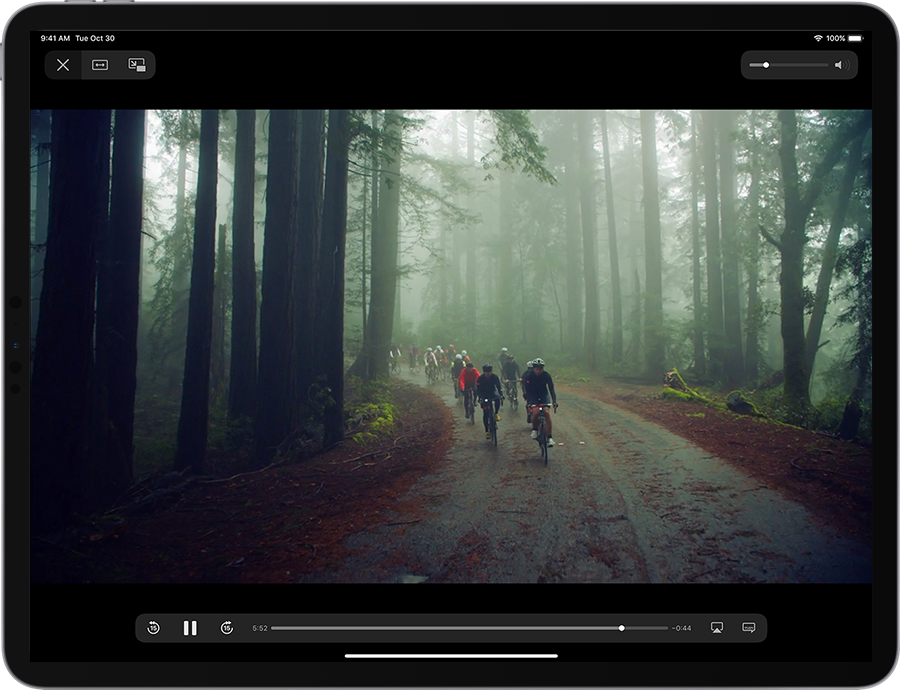
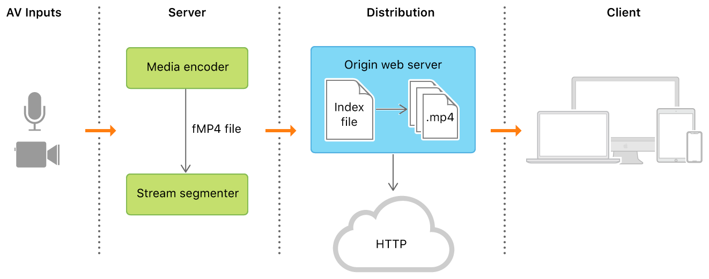
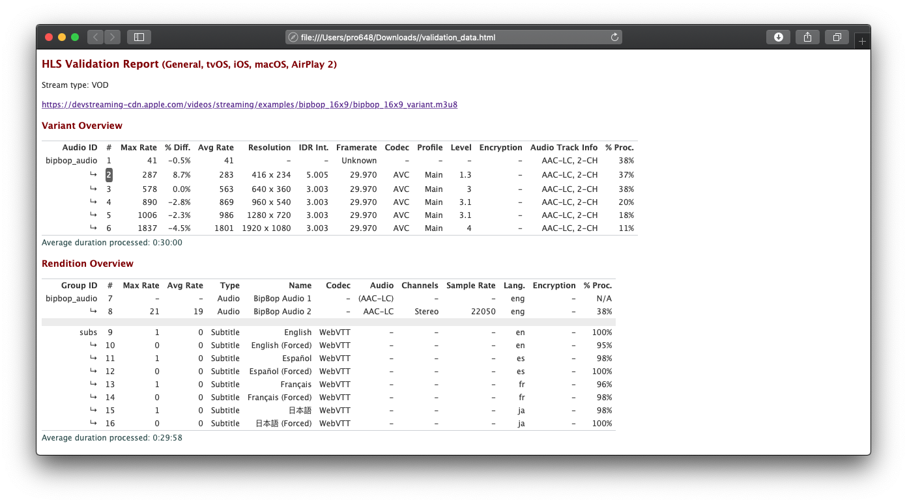

HTTP Live Streaming 是 Apple 实现的基于 HTTP 的自适应比特率流通信协议，使用 HLS 可以直播（live）和点播（on-demand）音、视频。由于 HLS 采用了 HTTP 协议，使用普通 web 服务器和内容分发网络（Content Delivery Network，简写 CDN）即可。HLS 专为可靠性而设计，可以根据网络状况动态播放当前可播放最佳质量音视频。

目前，iOS、macOS、tvOS、PC、Android 等均支持 HLS 协议，HLS 是应用最为广泛的流协议。



HLS 支持以下功能：

- 直播（Live broadcasts）和点播（video on demand，简写 VOD，即预录内容）。
- 具有不同比特率的多个备用流。
- 根据网络变化对流进行智能切换。
- 数据加密和用户身份验证。

下图显示了 HTTP Live Stream 的组成部分：



Apple 提供了几个支持 HTTP Live Streaming 的框架，包括`AVKit`、`AVFoundation`、`WebKit`。

## 1. 术语

在学习 HLS 之前，需要先了解几个相关概念。

#### 1.1 MPEG

动态图像专家组（Moving Picture Experts Group，简称 MPEG）原本是一个研究视频、音频编码标准的组织，成立于1988年，致力于开发视频、音频压缩编码技术。现在我们所说的MPEG泛指该小组制定的一系列视频编码标准正式审核程序。至今已制定了MPEG-1、MPEG-2、MPEG-3、MPEG-4、MPEG-7、MPEG-21、MPEG-H、MEPG-DASH等标准。

#### 1.2 MPEG-2

MPEG-2 由 ITU 定义，也称为 H.222 / H.262，是运动图像和相关音频信息的通用编码标准，它描述了视频、音频有损压缩的组合方法，该方法允许使用当前可用的存储媒体和传输宽带来存储、传输电影。常用在数字卫星电视、数字有线电视，以及 DVD 视频光盘中。

MPEG-2 标准作为 ISO / IEC 12818 的一部分发布。MPEG-2 包含多个标准，每个部分涵盖整个规范的某个方面。例如，Part 1 系统描述音视频同步和多路复用；Part 7 部分描述了有损数字音频压缩的音频编码标准，称为高级音频编码（Advanced Audio Coding，简称 AAC）。AAC 被设计为 MP3 格式的后继产品，在相同的比特率下，其声音质量通常比 MP3 更好。

#### 1.3 MPEG-4

MPEG-4 定义了音视频数字数据的压缩方法。于1998年推出，并指定了一组音频、视频编码格式的标准和相关技术。MPEG-4 由 ISO/IEC MEPG 组织在 ISO / IEC 14496 标准发布。MPEG-4 标准压缩的数据可用于网络流媒体、CD 分发、电话、可视电话和广播电视。

与 MPEG-2 类似，MPEG-4 也包含多个部分，每个部分涵盖整个规范的某个方面。例如，Part 2 描述了视觉数据的压缩格式；Part 10 描述了视频信号的压缩格式，在技术上与 ITU-T H.264 标准相同。

#### 1.4 H.264

H.264 被称为高级视频编码（Advanced Video Coding，简称 AVC，也称为 H.264、MPEG-4 Part 10、MPEG-4 AVC），是一种面向块、基于运动补偿的视频编码标准。在2004年时 H.264 已成为高精度视频录制、压缩、发布最常用格式之一。第一版标准的最终草案于2003年5月完成。

H.264 / MPEG-4 AVC 项目的目的是为了创建一个更佳的视频压缩标准，在更低的比特率下依然能提供良好视频质量，同时不会大幅度增加设计的复杂性。广泛用于网络流媒体、各种高清晰度电和卫星。

#### 1.5 H.265

H.265 被称为高效率视频编码（High Efficiency Video Coding，简称 HEVC），是 MPEG-H 规范的第二部分。H.265 是一种视频压缩标准，被视为 H.264 标准的继任者。与AVC相比，HEVC 在相同视频质量下数据可以压缩 25% 至 50%，或相同比特率下可显著提高视频质量。HEVC 支持高达 8192*4320 的分辨率，HEVC 的高保真 Main10 配置文件已经集成到几乎所有支持的硬件中。HEVC 正在与 IETF 的 AV1 编码格式竞争。

#### 1.6 AC-3

AC-3 是音频编码（Audio Coding）的缩写，是杜比数字音频编码器（Dolby Digital audio codec）的同义词。除 Dolby TrueHD 外，音频均为有损压缩。通常，AC-3 几乎只用于视频，并且通常需要特殊许可的软件或硬件才能进行编码、解码。除非用于电影、DVD和蓝光项目，否则没有理由使用AC-3。

#### 1.7 AAC

AAC 被称为高级音频编码（Advanced Audio Coding），用于有损数字音频压缩的音频编码标准，被设计为 MP3 格式的继任者。在相同比特率下，AAC 通常比 MP3 可以获得更好的声音质量。AAC 是 iOS、Android 等系统的默认或标准音频格式。

## 2. HLS 架构

这一部分介绍 HLS 主要组件如何协同工作以传递流媒体。从概念上讲，HTTP Live Streaming 包含三部分：服务器组件、分发组件和客户端软件。

在常见配置中，硬件编码器接受输入的音视频，将其编码为 HEVC 视频、AC-3 音频，输出片段化（fragmented）MPEG-4 文件或 MPEG-2 传输流，分段器（segmenter）软件将 stream 分割成系列短媒体文件，然后将短媒体文件放在 web 服务器上。segmenter 还会创建并维护一个包含媒体文件列表的索引文件（index file）。索引文件的 URL 在 web 服务器上发布，客户端读取索引文件，按顺序读取列出的媒体文件并播放，各片段间没有任何暂停或间隔。

#### 2.1 服务器组件

服务器组件负责获取媒体输入流并对其进行数字编码，将其封装成适合传输的格式，并为分发做准备。

对于直播，服务器需要媒体编码器（可以是现有的硬件），以及一种将编码的媒体分割成片段并保存为文件的方法，该方法可以是由 Apple 提供的 media stream segmented，也可以是第三方解决方案。

#### 2.2 分发组件

分发系统是 web 服务器或 web 缓存系统，通过 HTTP 将媒体文件和索引文件传输到客户端。HTTP Live Streaming 协议不需要对服务器模块进行任何自定义即可用于传输内容，且 web 服务器只需要很少的配置。要实际使用 HTTP Live Streaming，需要将 HTML 页面或 app 作为接收器，还需要使用 web 服务器，以及将实时流编码为 HEVC 或 H.264视频、 ACC 或 AC-3 音频的分段 MPEG-4 媒体文件。

#### 2.3 客户端软件

客户端软件负责确定所请求媒体资源类型、下载所需资源、重新组合资源，最后将媒体连续的呈现给用户。目前，Windows 10、macOS 10.6+、iOS 3.0+、Android 4.1+ 等均原生支持 HLS，大部分浏览器也支持HLS。点击[这里](https://en.wikipedia.org/wiki/HTTP_Live_Streaming#Clients)可以查看各浏览器起始支持 HLS 版本。

客户端软件使用标志流媒体位置的 URL 获取 index file，index file 指定可用媒体文件位置、解密密钥和可选流。选定流后，客户端按顺序下载可用媒体文件，每个文件包含一段连续的 stream。当拥有足够数据后，客户端播放重组的 stream。

客户端负责获取解密密钥、身份认证，根据需要解密媒体文件。

这些过程会一直持续，直到在 index file 遇到 EXT-X-ENDLIST tag。如果没有 EXT-X-ENDLIST tag，则 index file 是直播的一部分。在直播期间，客户端会定期拉去 index file 的新版本，并在新版本的 index file 中查找新的媒体文件和加密密钥，并将这些 URL 添加到队列。

## 3. 部署基础的 HTTP Live Stream

部署 HTTP Live Stream 需要满足以下三点：

- HTML 网页或客户端作为接收者。
- Web 服务器或 CDN 作为主机。
- 一种将媒体文件或直播流编码为包含 HEVC 或 H.264 视频、 AAC 或 AC-3 音频的 MPEG-4 片段文件的方式。尽管也可以将 MP3 音频或 MPEG-2 用于传输 H.264 视频，但通常不推荐使用这些格式。

#### 3.1 创建 HLS 媒体接收器

分发 HTTP Live Streaming 媒体最简单的方法是使用 M3U8 播放列表文件作为视频源，创建包含 HTML5 <video> 标签的网页，对于不支持 HTML5 视频元素的浏览器，或不支持 HTTP Live Streaming 的浏览器，可以在 <video> 和</video> 标签之间添加降级代码。例如，可以使用 QuickTime 插件回退到渐进式下载或 RTSP 流。以下示例显示了常见 HTML 网页代码：

```
<html>
    <head>
        <title>HTTP Live Streaming Example</title>
    </head>
    <body>
        <video controls="controls" autoplay="" src="https://devstreaming-cdn.apple.com/videos/streaming/examples/bipbop_adv_example_hevc/master.m3u8" type="video/x-m4v">
        </video>
    </body
></html>
```

如果你在开发 iOS app，则可以使用`AVKit`框架直接播放：

```
    func playHLSVideo() {
        guard let videoURL = URL(string: "https://devstreaming-cdn.apple.com/videos/streaming/examples/bipbop_adv_example_hevc/master.m3u8") else {
            return
        }
        let player = AVPlayer(url: videoURL )
        let playerViewController = AVPlayerViewController()
        playerViewController.player = player
        present(playerViewController,
                animated: true) {
                    playerViewController.player?.play()
        }
    }
```

#### 3.2 配置服务器

普通的 web 服务器即可提供 HTTP Live Streaming。对服务器进行常规配置，然后将要提供文件的 MIME 类型与文件扩展名相关联。下表显示了 HTTP Live Streaming 的 MIME 类型：

| 扩展名 | MIME 类型         |
| ------ | ----------------- |
| .m3u8  | vnd.apple.mpegURL |
| .ts    | video/MP2T        |
| .mp4   | video/mp4         |

如果 web 服务器需要遵守 MIME 类型约束，则可以提供以 .m3u 结尾 MIME 类型为 audio/mpegURL 的文件，以实现兼容性。

索引文件通常很长，经常被重新下载，但由于他们是文本文件，因此可以非常高效地进行压缩。通过启用 M3U8 索引文件的实时 gzip 压缩来减少服务器开销。HTTP Live Streaming 客户端会自动进行解压缩。

对于点播类型视频，索引文件格式如下：

```
#EXTM3U
#EXT-X-PLAYLIST-TYPE:VOD
#EXT-X-TARGETDURATION:10
#EXT-X-VERSION:4
#EXT-X-MEDIA-SEQUENCE:0
#EXTINF:10.0,
http://example.com/movie1/fileSequenceA.ts
#EXTINF:10.0,
http://example.com/movie1/fileSequenceB.ts
#EXTINF:10.0,
http://example.com/movie1/fileSequenceC.ts
#EXTINF:9.0,
http://example.com/movie1/fileSequenceD.ts
#EXT-X-ENDLIST
```

各标记用途如下：

**EXTM3U**：表示此播放列表是扩展为 M3U 的文件列表。通过将第一行标记改为 EXTM3U，可以将这种类型的文件与基本的 M3U 文件区分开。所有 HLS 播放列表都必须以此标签开头。

**EXT-X-PLAYLIST-TYPE**：提供使用于整个播放列表的文件是否可变信息。此标签内容为 EVENT 或 VOD。如果标签为 EVENT，则服务器不能改变、删除索引文件的任何部分，但可以向尾部拼接。如果标记为 VOD，则播放列表不可更改。

**EXT-X-TARGETDURATION**：指定媒体文件最大时长。

**EXT-X-VERSION**：表示播放列表文件的兼容版本。播放列表媒体和服务器必须符合该版本协议的 IETF Internet-Draft 最新规定。

**EXT-X-MEDIA-SEQUENCE**：要播放的第一个媒体文件序列号。播放列表中的每个媒体文件 URL 都有一个唯一的整数序列号，URL 的序列号是其前面的 URL 序列号加一，序列号与文件名无关。

**EXTINF**：记录标记，描述紧随其后的 URL 所标识媒体文件。每个媒体文件 URL 之前都必须有一个 EXTINF 标记。该标记包含一个 duration 属性。duration 属性是一个整数或浮点数，指定媒体段的持续时间（以秒为单位），该值必须小于等于目标持续时间。

> 始终使用浮点 EXTINF 时长（协议版本 3 中增加的），这将使客户端在流中搜素时减少出现错误。

**EXT-X-ENDLIST**：标记媒体文件结束，不会再添加新的媒体文件到播放列表。

上面的 VOD 播放列表使用完整路径描述媒体文件。尽管可以使用绝对路径，但更推荐使用相对路径。相对路径是相对于播放列表文件的位置，使用绝对路径会导致更多文本，且相对路径比绝对路径更可移植。下面是使用相对路径的同一播放列表：

```
#EXTM3U
#EXT-X-PLAYLIST-TYPE:VOD
#EXT-X-TARGETDURATION:10
#EXT-X-VERSION:4
#EXT-X-MEDIA-SEQUENCE:0
#EXTINF:10.0,
fileSequenceA.ts
#EXTINF:10.0,
fileSequenceB.ts
#EXTINF:10.0,
fileSequenceC.ts
#EXTINF:9.0,
fileSequenceD.ts
#EXT-X-ENDLIST
```

> 直播和 event session 播放列表会有所不同，具体可以查看：[Live Playlist (Sliding Window) Construction](https://developer.apple.com/documentation/http_live_streaming/example_playlists_for_http_live_streaming/live_playlist_sliding_window_construction?language=objc) 和 [Event Playlist Construction](https://developer.apple.com/documentation/http_live_streaming/example_playlists_for_http_live_streaming/event_playlist_construction?language=objc)。

对于点播来说，整个媒体文件已经存在。因此，索引文件是静态的，只会被下载一次。对于直播来说，索引文件不断更新，当新媒体资源可用时，会替换掉原来媒体资源。对于 event session 来说，新媒体文件可用时会拼接到索引文件结尾，与点播不同的是，不能移除索引文件任何内容，只能向文件尾部拼接新的媒体片段，event session 允许用户跳转到已经播放过片段任一时刻，即等效于点播+直播，常用于演唱会、运动会。

#### 3.3 验证流

Apple 提供的 [HTTP Live Streaming Tools](https://developer.apple.com/download/more/?=HLS) 包含 Media Stream Segmenter、Media File Segmenter、Media Subtitle Segmenter、Variant Playlist Creator、Media Stream Validator、 HLS Report、ID3 Tag Generator 几种工具。

Media Stream Validator 工具模拟 HTTP Live Streaming 会话，并验证索引文件和媒体片段是否符合 HTTP Live Streaming 规范。其会执行多次检查以确保流传输可靠，如果发现错误、问题，会在诊断报告中列出。在提供流服务前，请始终运行验证程序。

mediastreamvalidator 命令如下：

```
$ mediastreamvalidator https://devstreaming-cdn.apple.com/videos/streaming/examples/bipbop_16x9/bipbop_16x9_variant.m3u8
```

上述命令执行完毕后，会产生一个 validation_data.json 的诊断报告，但其内容并不方便阅读，可以使用下面的 python script 将其转换为 html 格式：

```
$ hlsreport.py validation_data.json
```

生成的 validation_data.html 如下图所示：



> mediastreamvalidator 命令即可以验证 HTTP URLs 的资源，也可以验证本地资源。
>
> 使用 mediastreamvalidator 命令时如需帮助，输入`mediastreamvalidator -h`命令即可查看文档。

此前，HLS 缺点一直是高延迟。但 Apple 在 WWDC 2019 发布了新的解决方案，可以将延迟从8秒降低到1至2秒。具体可以查看[Introducing Low-Latency HLS](https://developer.apple.com/videos/play/wwdc2019/502/)。

参考资料：

1. [HTTP Live Streaming](https://developer.apple.com/streaming/)
2. [Validating HTTP Live Streams](https://developer.apple.com/videos/play/wwdc2016/510/)
3. [How is AAC better than AC3?](https://www.quora.com/How-is-AAC-better-than-AC3)
4. [What is the difference between AAC and AC3 in quality? How can it be determined?](https://www.quora.com/What-is-the-difference-between-AAC-and-AC3-in-quality-How-can-it-be-determined)