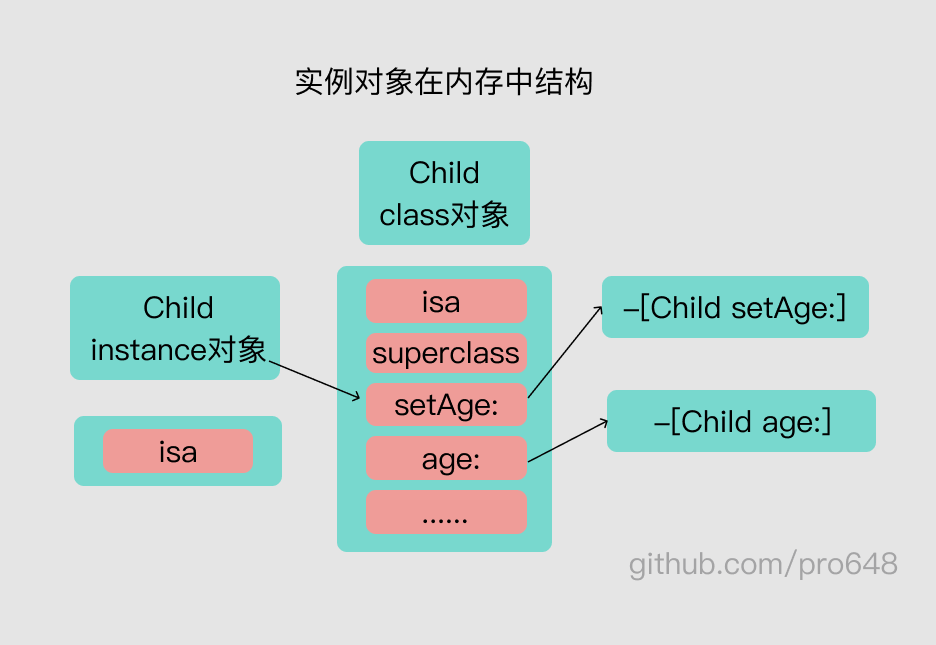
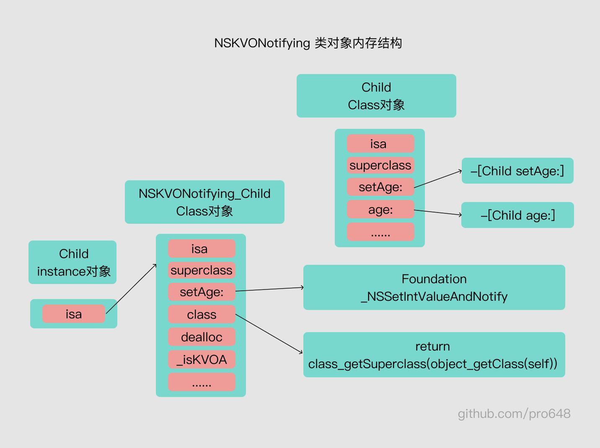
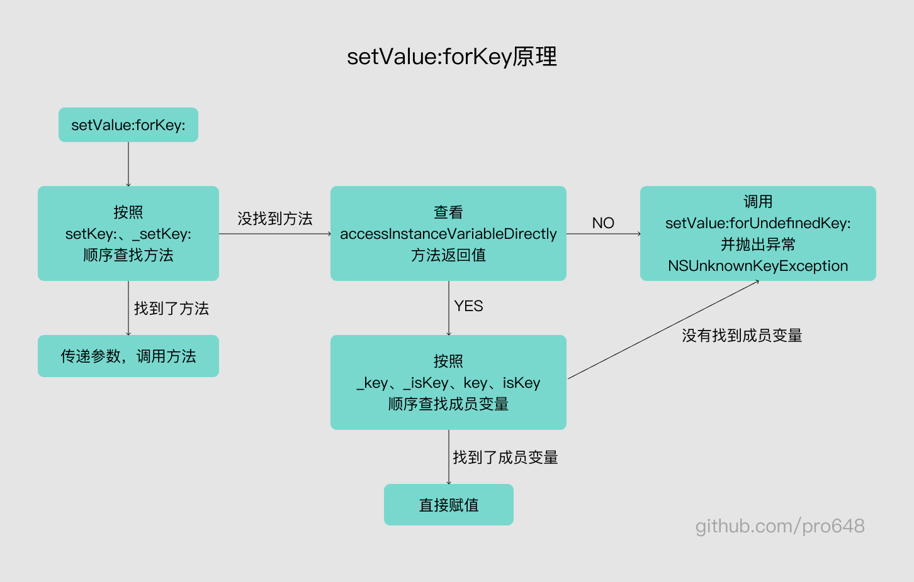
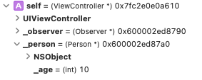
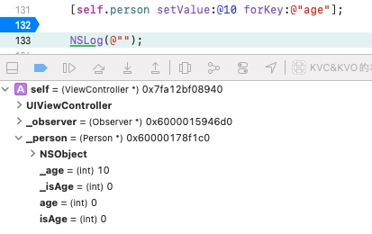

这篇文章介绍KVC、KVO的本质。如果你对KVC、KVO不了解，推荐先查看其用法：[KVC和KVO学习笔记](https://github.com/pro648/tips/blob/master/sources/KVC%E5%92%8CKVO%E5%AD%A6%E4%B9%A0%E7%AC%94%E8%AE%B0.md)。

## 1. KVO的本质

KVO 是 Key Value Observing 的缩写，称为健值观察。用于监听对象属性值的改变。

#### 1.1 KVO的实现

观察者模式使用示例如下：

```
@interface ViewController ()
@property (nonatomic, strong) Child *child1;
@property (nonatomic, strong) Child *child2;
@end

@implementation ViewController

- (void)viewDidLoad {
    [super viewDidLoad];
    
    self.child1 = [[Child alloc] init];
    self.child1.age = 1;
    
    self.child2 = [[Child alloc] init];
    self.child2.age = 2;
    
    // 添加观察者
    [self.child1 addObserver:self
                  forKeyPath:@"age"
                     options:NSKeyValueObservingOptionNew | NSKeyValueObservingOptionOld
                     context:@"123context"];
}

// 观察到键值发生改变
- (void)observeValueForKeyPath:(NSString *)keyPath ofObject:(id)object change:(NSDictionary *)change context:(void *)context {
    NSLog(@"监听到 %@ 的 %@ 属性值发生改变 - %@ - %@", object, keyPath, change, context);
}

- (void)dealloc {
    // 移除观察者
    [self.child1 removeObserver:self
                     forKeyPath:@"age"];
}
@end
```

#### 1.2 runtime动态创建NSKVONotifying_XXX类

通过上述代码可以看到，`age`属性发生改变后，会通知监听者，即触发`observeValueForKeyPath:ofObject:change:context:`方法。我们知道赋值操作是通过调用set方法实现，进入`Child`类，重写`setAge:`方法，查看KVO是否通过修改set方法实现。

```
@implementation Child
- (void)setAge:(int)age {
    _age = age;
    
    NSLog(@"KVO是否通过重写setAge:方法实现？age:%d", age);
}
@end
```

测试后发现，修改`child1`和`child2`都会触发`setAge:`方法，但`child1`会额外触发KVO。说明KVO在运行时对`child1`进行了修改，使得`child1`在调用`setAge:`时，进行了额外的操作。

根据 runtime 的原理，向实例对象发送消息时，先根据实例对象的 [isa](https://github.com/pro648/tips/blob/master/sources/Runtime%E4%BB%8E%E5%85%A5%E9%97%A8%E5%88%B0%E8%BF%9B%E9%98%B6%E4%B8%80.md#221-isa) 查找到类对象，在类对象的方法列表中查找方法实现。因此，可以查看`child1`和`child2`是否指向同一个类对象：

```
    // 打印添加观察者前实例对象的isa
    NSLog(@"添加Observer前 child1: %@ - child2: %@", object_getClass(self.child1), object_getClass(self.child2));
    
    // 添加观察者
    [self.child1 addObserver:self
                  forKeyPath:@"age"
                     options:NSKeyValueObservingOptionNew | NSKeyValueObservingOptionOld
                     context:@"123context"];
    
    // 打印添加观察者后实例对象的isa
    NSLog(@"添加Observer后 child1: %@ - child2: %@", object_getClass(self.child1), object_getClass(self.child2));
```

打印结果如下：

```
添加Observer前 child1: Child - child2: Child
添加Observer后 child1: NSKVONotifying_Child - child2: Child
```

> 如果你对 runtime、isa不了解，可以查看我的另一篇文章：[Runtime从入门到进阶一](https://github.com/pro648/tips/blob/master/sources/Runtime%E4%BB%8E%E5%85%A5%E9%97%A8%E5%88%B0%E8%BF%9B%E9%98%B6%E4%B8%80.md)。

`child1`添加观察者后，isa指针由之前的指向`Child`，变为了`NSKVONotifying_Child`，而`child2`实例对象 isa 的指向没有发生改变。

添加观察者之前，`child1`实例在内存中的结构如下：



添加观察者后，`child1`对象的isa指针指向了`NSKVONotifying_Child`类。`NSKVONotifying_Child`的`superclass`指针指向`Child`类。

`NSKVONotifying_Child`的`setAge:`方法调用了`_NSSetIntValueAndNotify`函数，该函数依次执行以下三步：

1. 先调用`willChangeValueForKey:`
2. 后调用`[super setAge:]`
3. 最后调用`didChangeValueForKey:`触发监听

下面打印添加观察者前后`setAge:`方法实现的变化：

```
    NSLog(@"添加Observer前 child1: %p - child2: %p", [self.child1 methodForSelector:@selector(setAge:)], [self.child2 methodForSelector:@selector(setAge:)]);
    
    // 添加观察者
    ...
    
    NSLog(@"添加Observer后 child1: %p - child2: %p", [self.child1 methodForSelector:@selector(setAge:)], [self.child2 methodForSelector:@selector(setAge:)]);
```

控制台输出如下：

```
添加Observer前 child1: 0x10b247190 - child2: 0x10b247190
添加Observer后 child1: 0x7fff207bb2b7 - child2: 0x10b247190
```

可以看到，添加观察者后，`child1`的`setAge:`地址发生了变化，`child2`的`setAge:`地址没有发生变化。继续打印其具体实现：

```
(lldb) p (IMP)0x10b247190
(IMP) $0 = 0x000000010b247190 (KVC&KVO的本质`-[Child setAge:] at Child.m:12)
(lldb) p (IMP)0x7fff207bb2b7
(IMP) $1 = 0x00007fff207bb2b7 (Foundation`_NSSetIntValueAndNotify)
```

可以看到，添加观察者后，`child1`的`setAge:`方法实现转换成了C语言`Foundation`框架中的`_NSSetIntValueAndNotify`函数。如果`setAge:`参数类型是double，其会自动调用`_NSSetDoubleValueAndNotify`函数，也就是会根据类型自动转换。

#### 1.3 NSKVONotifying_Child具体实现

`NSKVONotifying_Child`继承自`Child`，`NSKVONotifying_Child`内部重写了`setAge:`方法，通过 runtime 的`class_copyMethodList()`函数可以查看对象的方法列表：

如下所示：

```
- (void)printMethodList:(Class)cls {
    unsigned int methodCount;
    // 获取方法数组
    Method *methodList = class_copyMethodList(cls, &methodCount);
    
    NSMutableString *name = [NSMutableString string];
    for (int i=0; i<methodCount; ++i) {
        // 获得方法
        Method method = methodList[i];
        // 获得方法名
        NSString *methodName = NSStringFromSelector(method_getName(method));
        
        [name appendString:methodName];
        [name appendString:@", "];
    }
    
    // C语言中使用copy、create创建的对象需释放。
    free(methodList);
    NSLog(@"%@ %@", cls, name);
}
```

添加观察者后，分别打印`child1`、`child2`：

```
NSKVONotifying_Child setAge:, class, dealloc, _isKVOA,
Child setAge:, age,
```

可以看到，`NSKVONotifying_Child`对象有四个方法，分别为

- `setAge:`：触发观察者的具体逻辑。
- `class`：重写`class`方法，直接返回父类名称。这样可以屏蔽KVO内部实现，隐藏`NSKVONOtifying_Child`类的存在。
- `dealloc`：释放时进行收尾工作。
- `_isKVOA`：当前类是否是添加KVO后系统使用runtime创建的。

添加观察者之后，`child1`实例在内存中的结构如下：



另外，还可以手动创建名称为`NSKVONotifying_Child`、继承自`Child`的类。添加后，注册观察者时会报以下错误：

```
[general] KVO failed to allocate class pair for name NSKVONotifying_Child, automatic key-value observing will not work for this class
```

这也从侧面证明了runtime会动态创建`NSKVONOtifying_Child`类。

#### 1.4 验证didChangeValueForKey:内部会调用observeValueForKeyPath:ofObject:change:context:方法

在`Child`类中重写`willChangeValueForKey:`、`didChangeValueForKey:`，查看哪一步调用`observeValueForKeyPath:ofObject:change:context:`方法：

```
- (void)setAge:(int)age {
    NSLog(@"begin - setAge:%d", age);
    _age = age;
    NSLog(@"end - setAge:%d", age);
}

- (void)willChangeValueForKey:(NSString *)key {
    NSLog(@"willChangeValueForKey: - begin");
    [super willChangeValueForKey:key];
    NSLog(@"willChangeValueForKey: - end");
}

// 验证didChangeValueForKey:调用了KVO
- (void)didChangeValueForKey:(NSString *)key {
    NSLog(@"didChangeValueForKey: - begin");
    [super didChangeValueForKey:key];
    NSLog(@"didChangeValueForKey: - end");
}
```

控制台输出如下：

```
begin - setAge:11
end - setAge:11
didChangeValueForKey: - begin
监听到 <Child: 0x600000168250> 的 age 属性值发生改变 - {
    kind = 1;
    new = 11;
    old = 1;
} - 123context
didChangeValueForKey: - end
```

可以看到，`didChangeValueForKey:`方法内部调用了observer的`observeValueForKeyPath:ofObject:change:context:`方法。

> 如果没有实现`willChangeValueForKey:`，只调用`didChangeValueForKey:`，其并不会调用observer的`observeValueForKeyPath:ofObject:change:context:`方法。

#### 1.5 KVO 面试题

###### 1.5.1 iOS 使用什么方式实现对一个对象的kvo？即KVO的本质是什么。

KVO是利用runtime API 动态生成一个子类，并且让 instance 对象的isa指向这个全新的子类，该子类的superclass指针指向原来的类。

当修改instance对象的属性时，会调用Foundation的`_NSSetXXValueAndNotify`函数。其内部会依次执行以下方法：

1. 调用`willChangeValueForKey:`
2. 调用父类的 setter。
3. 调用`didChangeValueForKey:`，该方法内部会触发监听器的`observeValueForKeyPath:ofObject:change:context:`。

###### 1.5.2 如何手动触发KVO？

手动调用`willChangeValueForKey:`和`didChangeValueForKey:`。

###### 1.5.3 直接修改成员变量会触发KVO吗？

由于 runtime 是通过创建子类，重写setter方法实现的监听值改变，直接修改成员变量并不会调用setter方法。因此，直接修改成员变量不会触发KVO。

## 2. KVC的本质

KVC 是 Key Value Coding 的缩写，称为健值编码。

#### 2.1 设值原理setValue:forKey:

KVC设值方法有以下两个API：

```
- (void)setValue:(id)value forKeyPath:(NSString *)keyPath;
- (void)setValue:(id)value forKey:(NSString *)key;
```

`setValue:forKey:`原理如下图所示：



`setValue:forKey:`原理如下：

- 先查找`setKey:`、`_setKey:`方法，如果找到了，直接传递参数，调用方法；如果找不到，进入下一步。
- 查看`accessInstanceVariableDirectly`方法返回值，如果返回`NO`，即不允许访问成员变量，则调用`setValue:forUndefinedKey:`方法，并抛出`NSUnknownKeyException`异常；如果返回`YES`，进入下一步。
- 按照`_key`、`_isKey`、`key`、`isKey`顺序查找成员变量，如果找到了成员变量，直接赋值。如果找不到，则调用`setValue:forUndefinedKey:`方法，并抛出`NSUnknownKeyException`异常。

###### 2.1.1 有set方法

有set方法时，直接调用set方法：

```
@interface Person : NSObject
@property (nonatomic, assign) int age;
@end

@implementation Person
- (void)setAge:(int)age {
    _age = age;
    NSLog(@"%s %d", __PRETTY_FUNCTION__, age);
}
@end
```

执行后，控制台输出如下：

```
-[Person setAge:] 10
-[Observer observeValueForKeyPath:ofObject:change:context:] - {
    kind = 1;
    new = 10;
    old = 0;
}
```

可以看到，KVC先调用了set方法，然后触发了KVO。

如果将属性设置为`readonly`，在其他类中将不能通过访问器方法修改属性值，但可以使用KVC修改。这是因为设置为`readonly`后，虽然不会生成set方法，但会生成`_key`成员变量。此时，KVC直接为`_key`赋值，具体原理可以查看后面部分内容。



###### 2.1.2 没有set方法

没有set方法时，会先查看`accessInstanceVariableDirectly`方法返回值，如果返回`NO`，则调用`setValue:forUndefinedKey:`方法，并抛出`NSUnknownKeyException`异常；如果返回`YES`，则按照`_key`、`_isKey`、`key`、`isKey`顺序查找成员变量。如果找到了成员变量，直接赋值；如果找不到，则调用`setValue:forUndefinedKey:`方法，并抛出`NSUnknownKeyException`异常。

添加以下成员变量，并移除属性：

```
{
    @public
    // 如果没有set方法，按照下面顺序查找。
    int _age;
    int _isAge;
    int age;
    int isAge;
}
```

使用`setValue:forKey:`设置成员变量值后，会按顺序查找上述成员变量，找到后直接赋值。其顺序是固定的，与声明成员变量的先后次序无关。



#### 2.2 KVC 内部实现willChangeValueForKey: 和didChangeValueForKey:方法

在`Person`类添加以下代码：

```
- (void)willChangeValueForKey:(NSString *)key {
    [super willChangeValueForKey:key];
    
    NSLog(@"%s %@", __PRETTY_FUNCTION__, key);
}

- (void)didChangeValueForKey:(NSString *)key {
    NSLog(@"%s - begin - %@", __PRETTY_FUNCTION__, key);
    
    [super didChangeValueForKey:key];
    
    NSLog(@"%s - end - %@", __PRETTY_FUNCTION__, key);
}
```

再次为`age`设值，控制台输出如下：

```
-[Person willChangeValueForKey:] age
-[Person didChangeValueForKey:] - begin - age
- {
    kind = 1;
    new = 10;
    old = 0;
}
-[Person didChangeValueForKey:] - end - age
```

与KVO类似，其内部也实现了`willChangeValueForKey:`和`didChangeValueForKey:`方法，并且是在`didChangeValueForKey:`后触发观察者的`observeValueForKeyPath:ofObject:change:context:`方法。

#### 2.3 取值原理valueForKey:

KVC取值方法有以下两个API：

```
- (id)valueForKeyPath:(NSString *)keyPath;
- (id)valueForKey:(NSString *)key;
```

`valueForKey:`原理如下图所示：


`valueForKey:`原理如下：

- 按照`getKey:`、`key`、`isKey`、`_key`顺序查找方法，找到后直接调用方法；如果找不到，则进入下一步。
- 查看`accessInstanceVariableDirectly`方法返回值，如果返回`NO`，则调用`setValue:forUndefinedKey:`方法，并抛出`NSUnknownKeyException`异常；如果返回`YES`，则进入下一步。
- 按照`_key`、`_isKey`、`key`、`isKey`顺序查找成员变量。如果找到了，直接取值；如果找不到，则调用`setValue:forUndefinedKey:`方法，并抛出`NSUnknownKeyException`异常。

在`Person`类中，添加以下方法：

```
- (int)getAge {
    return 22;
}
```

使用以下方法取值：

```
NSLog(@"age: %@", [self.person valueForKey:@"age"]);
```

可以看到其取出的是`getAge`的值。你可以自行添加`age`、`isAge`、`_age`、`_isAge`方法，验证其取值顺序。

#### 2.4 KVC面试题

###### 2.4.1 通过KVC修改属性会触发KVO吗？

会触发。其内部调用了`willChangeValueForKey:`、`didChangeValueForKey:`，并在调用`didChangeValueForKey:`方法后触发观察者的`observeValueForKeyPath:ofObject:change:context:`方法。

###### 2.4.2 KVC取值、赋值过程是怎么样的？原理是什么？

取值、赋值过程和原理即为上面两个图片内容。

Demo名称：KVC&KVO的本质  
源码地址：<https://github.com/pro648/BasicDemos-iOS/tree/master/KVC&KVO的本质>

