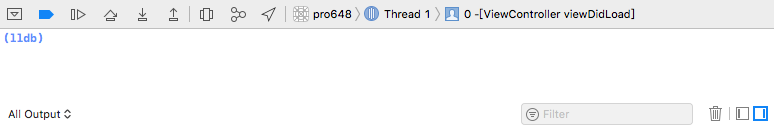
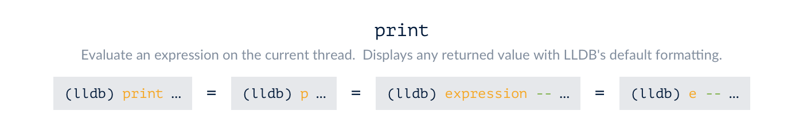
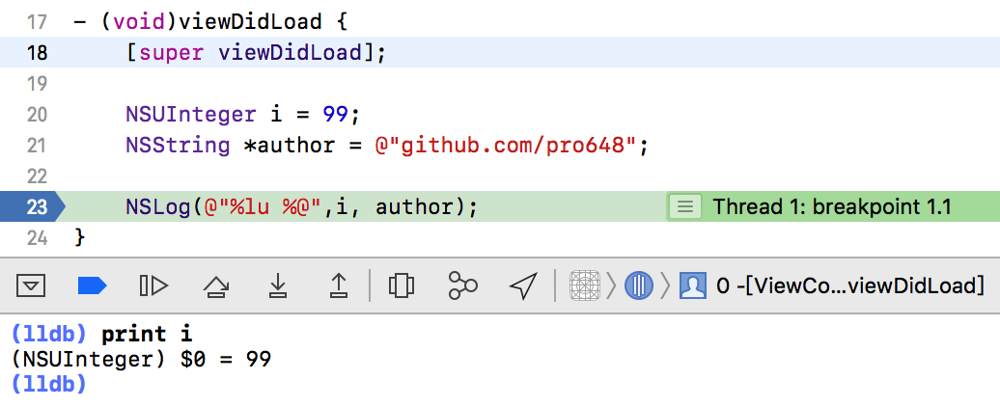
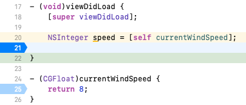
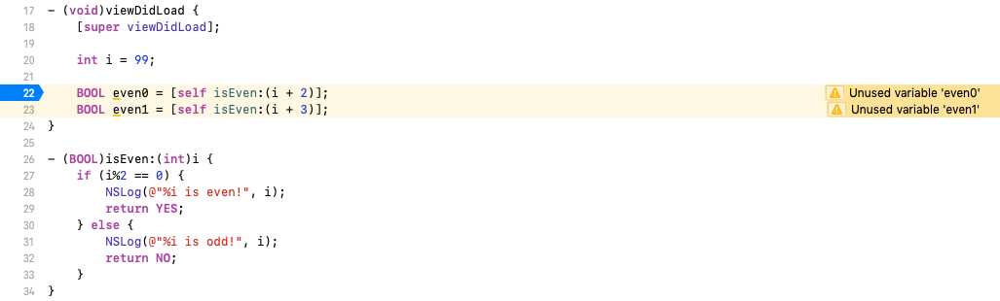
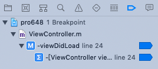
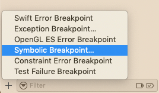
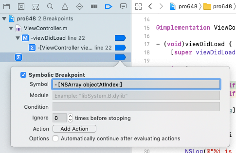
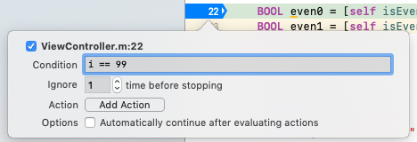
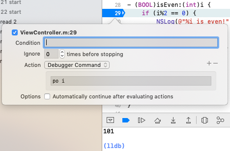

LLDB Debugger (LLDB) 是一个开源、底层调试器(low level debugger)，具有REPL (Read-Eval-Print Loop，交互式解释器)、C++和Python插件，位于Xcode窗口底部控制台中，也可以在terminal中使用。具有流向控制 (flow control) 和数据检查 (data inspection) 功能。



LLDB使用了LLVM项目中的一些组件，如编译器、解释器、构建器等。LLDB是非常强大的工具，可以输出代码中变量，访问macOS系统底层的Unix，进行个性化配置等，且整个过程无需终止会话。

## 1. 命令结构

通过在调试会话中输入命令与LLDB进行交互。LLDB命令语法具有统一结构和规则，每个LLDB命令 (command) 由零个或多个子命令 (subcommand) 组成，并且可以另外指定一个或多个选项、参数。如下：

```
<command> [<subcommand>...] [--<option> [<option-value>]]... [argument]...
```

#### 1.1 子命令subcommands

*command*和*subcommand*是LLDB调试命令，其按照层级结构排列：*command*命令为其后*subcommand*创建上下文，后者再次为下一层级*subcommand*创建上下文，依此类推。

子命令以空格分隔，用于组织相关操作。一般，最后一个subcommand为动词，表示要执行的操作。例如，`breakpoint list`和`breakpoint delete`命令分别表示显示所有breakpoint和删除breakpoint。

#### 1.2 参数arguments

一个命令可能需要一个或多个参数，参数以空格分隔，用于指示要执行的操作。例如，`breakpoint disable`命令参数传递要禁用的breakpoint。`breakpoint disable 1 2`表示禁用breakpoint ID为`1`和`2`的断点。

#### 1.3 选项Options

一个命令可能包含一个或多个选项 (option) 。选项以空格分隔，以双短划线 (--)开头，组合修改要执行的操作。有些option还提供使用单个短划线 (-) 的简写形式。例如，第一次导致程序停止后自动删除breakpoint的`breakpoint set --one-shot`命令，可以写为`breakpoint set -o`。

有些option还会传递值，option和值用空格分隔。例如，为`breakpoint set`命令传递`--name`option，选项值为函数、方法名称，这样就可以为指定函数、方法添加breakpoint。

有些命令组合使用options。例如，`breakpoint set`命令组合使用`--file`和`--line`options，并为其指定对应文件名称和行号。

Option values和arguments中的空格用双引号保护。如果参数中有双引号，则可以使用反斜杠 ( \ )标志双引号。LLDB等效的使用单引号和双引号。例如：

```
（lldb）command [subcommand] -option "some \"quoted\" string"
```

也可以写为：

```
(lldb) command [subcommand] -option 'some "quoted" string'
```

这样的命令解析设计有助于LLDB命令语法在所有命令中保持统一。

> 如果命令即接受options，又接受自由形式 (freeform) 的arguments，则必须在最后一个option和第一个argument间放置以空格分隔的双短划线，如`expression`命令。这样能够确保以短划线开头的argument被解释为argument，而不会因其与option都以短划线开头而被错误解释。

#### 1.4 命令形式

同一LLDB命令可以用不同形式表示。例如，以下命令表示同一操作：验证变量*someVariable*描述，并输出结果。

- 规范形式 canonical form：`expression --object-description -- someVariable`。
- 缩写形式 abbreviated form：`e -O -- someVariable`。
- 别名 alias：`po someVariable`。可以为任何命令创建别名，以方便执行常见操作。

#### 1.5 Raw Input

LLDB命令解析器支持原始 (raw) 输入，即*options*后字符会被移除，不经解析直接传递。这对于参数是复杂表达式的命令很方便。能够减少反斜杠保护带来的困扰。例如，`expression`命令支持raw input。

支持Raw输入的命令也可以有*options*。如果命令本身有破折号 (dashes, 即 -- ) ，需要在命令名称后、字符串前添加`--`标志出其不是*option* ,

## 2. help

`help`命令可以查看LLDB的帮助文档，方便进一步了解LLDB命令结构。

只输入`help`命令，将返回所有命令列表，如下是部分命令：

```
(lldb) help
Debugger commands:
  breakpoint        -- Commands for operating on breakpoints (see 'help b' for
                       shorthand.)
  expression        -- Evaluate an expression on the current thread.  Displays
                       any returned value with LLDB's default formatting.
  frame             -- Commands for selecting and examing the current thread's
                       stack frames.
  help              -- Show a list of all debugger commands, or give details
                       about a specific command.
  process           -- Commands for interacting with processes on the current
                       platform.
  quit              -- Quit the LLDB debugger.
  thread            -- Commands for operating on one or more threads in the
                       current process.
  watchpoint        -- Commands for operating on watchpoints.
  continue  -- Continue execution of all threads in the current process.
  next      -- Source level single step, stepping over calls.  Defaults to
               current thread unless specified.
  step      -- Source level single step, stepping into calls.  Defaults to
               current thread unless specified.
  finish    -- Finish executing the current stack frame and stop after
               returning.  Defaults to current thread unless specified.
  image     -- Commands for accessing information for one or more target
               modules.
               
... and so forth ...
```

如果忘记命令用途，或想要了解更详细信息，可以通过以下命令获取：

```
help <command>
```

例如：

```
help print
help thread
```

`apropos`命令搜索LLDB文档中单词，并显示匹配命令摘要信息。例如：

```
(lldb) apropos file
The following commands may relate to 'file':
  breakpoint clear             -- Delete or disable breakpoints matching the
                                  specified source file and line.
  breakpoint read              -- Read and set the breakpoints previously saved
                                  to a file with "breakpoint write".  
  breakpoint write             -- Write the breakpoints listed to a file that
                                  can be read in with "breakpoint read".  If
                                  given no arguments, writes all breakpoints.
  command source               -- Read and execute LLDB commands from the file
                                  <filename>.
  frame variable               -- Show variables for the current stack frame.
                                  Defaults to all arguments and local variables
                                  in scope. Names of argument, local, file
                                  static and file global variables can be
                                  specified. Children of aggregate variables
                                  can be specified such as 'var->child.x'.
  renderscript allocation load -- Loads renderscript allocation contents from a
                                  file.
  renderscript allocation save -- Write renderscript allocation contents to a
                                  file.
  platform file                -- Commands to access files on the current
                                  platform.
  platform file close          -- Close a file on the remote end.
  platform file open           -- Open a file on the remote end.
  
... and so forth ...
```

另外，还可以通过`help breakpoint command add`命令查看`breakpoint command add`命令详细信息：

```
(lldb) help breakpoint command add
     Add LLDB commands to a breakpoint, to be executed whenever the breakpoint
     is hit.  If no breakpoint is specified, adds the commands to the last
     created breakpoint.

Syntax: 

Command Options Usage:
  breakpoint command add [-D] [-o <one-line-command>] [-e <boolean>] [-s <none>] [<breakpt-id>]
  breakpoint command add [-D] [-e <boolean>] [-s <none>] [-F <python-function>] [<breakpt-id>]
  
... and so forth ...
```

在Help文档中，使用尖括号包围arguments表示其为共用参数类型 (common argument type) ，可以使用`help`命令查看进一步介绍。例如，查看`<breakpt-id>`参数：

```
(lldb) help <breakpt-id>
  <breakpt-id> -- Breakpoints are identified using major and minor numbers; the
                  major number corresponds to the single entity that was
                  created with a 'breakpoint set' command; the minor numbers
                  correspond to all the locations that were actually found/set
                  based on the major breakpoint.  A full breakpoint ID might
                  look like 3.14, meaning the 14th location set for the 3rd
                  breakpoint.  You can specify all the locations of a
                  breakpoint by just indicating the major breakpoint number. A
                  valid breakpoint ID consists either of just the major number,
                  or the major number followed by a dot and the location number
                  (e.g. 3 or 3.2 could both be valid breakpoint IDs.)
```

经常使用`help`命令查看LLDB文档是熟悉LLDB命令的好方法。

## 3. 输出

当程序停止在breakpoint后，我们就可以控制其下一步执行的命令。LLDB提供了以下三种输出变量方法：

| 命令                               | 是否运行代码 | 输出格式                                                     |
| ---------------------------------- | ------------ | ------------------------------------------------------------ |
| `expression --` 简写为`p`、`print` | YES          | 默认格式                                                     |
| `expression -O —` 简写为`po`       | YES          | 若存在自定义格式，以自定义格式输出。否则，使用默认格式输出。 |
| `frame variable` 简写为`f v`       | NO           | 默认格式                                                     |

#### 3.1 print

在当前线程验证表达式，使用LLDB默认格式输出返回值。支持raw输入。

语法为：

```
print <expr>
```



使用`print`命令可以输出值。如下：



LLDB能够进行前缀匹配，因此可以使用`prin`、`pri`和`p`命令进行输出。但不能使用`pr`命令，因为LLDB无法将其与`process`命令进行区分。幸运的是`p`已经被消除歧义。

控制台打印结果中任何以`$`开头的输出都可以被再次引用。

```
(lldb) print i
(NSUInteger) $0 = 99
(lldb) print $0 + 10
(unsigned long) $1 = 109
```

输入`help print`，滑动到底部，可以看到

```
'print' is an abbreviation for 'expression --'
```

`print`命令可以指定输出格式，命令格式为`print/<fmt>`，也可以简写为`p/<fmt>`。如下：

默认格式为：

```
p 16
(int) $7 = 16
```

十六进制格式：

```
(lldb) p/x 16
(int) $8 = 0x00000010
```

二进制格式（`t`代表`two`）：

```
(lldb) p/t 16
(int) $9 = 0b00000000000000000000000000010000
```

点击[这里](https://sourceware.org/gdb/onlinedocs/gdb/Output-Formats.html)查看所有支持格式。

#### 3.2 po

`po`命令在当前线程验证表达式，以自定义格式（如果存在）输出返回值。支持raw input。

语法为：

```
po <expr>
```

运行`p`命令：

```
(lldb) p author
```

输出内容非常详细，如下：

```
(__NSCFConstantString *) $3 = 0x00000001063b2068 @"github.com/pro648"
```

如果输出更为复杂结构，其会更加复杂：

```
(lldb) p @[ @"pro", @"648"]
(__NSArrayI *) $4 = 0x0000600000228120 @"2 elements"
```

事实上，这里调用对象的`description`方法更为有效。为`expression`命令添加`--object-description`（简写为`-O`）标记可以输出对象：

```
(lldb) e -O -- $4
<__NSArrayI 0x600000038580>(
pro,
648
)
```

`e -O —`的别名为`po`（print object)，我们可以直接使用`po`：

```
(lldb) po $4
<__NSArrayI 0x600000038580>(
pro,
648
)

(lldb) po @"September"
September

(lldb) p @"September"
(NSTaggedPointerString *) $6 = 0xa140091001a00059 @"September"
```

#### 3.3 frame variable

`frame variable`命令显示当前堆栈的变量。默认输出当前堆栈所有参数和所有局部变量。

语法为：

```
frame variable <cmd-options> [<variable-name> ...]
```

在LLDB输入`frame variable`命令，如下所示：

```
(lldb) frame variable
(ViewController *) self = 0x00007fd365707800
(SEL) _cmd = "viewDidLoad"
(NSUInteger) i = 99
(__NSCFConstantString *) author = 0x000000010a50d068 @"github.com/pro648"
```

因为`p`和`po`会在目标进程执行代码，可能因此产生副作用。另外，有时断点位置无法运行代码。如果`p`运行代码一次，`po`则会运行代码两次。因为`po`不只验证表达式，还要按照指定格式输出。

`frame variable`命令可以避免`p`、`po`运行代码带来的副作用。正因为`frame variable`不执行任何代码，其提供的语法非常有限。

## 4. expression

Debugger的基本功能就是查看、修改变量值，这也就是`expression`命令的用途。

`expression`命令在当前线程验证表达式，使用LLDB默认格式显示返回结果。支持raw输入。

语法为：

```
expression <cmd-options> -- <expr>
```

运行下面代码：



#### 4.1 修改变量值

使用`expression`命令可以修改speed变量值：

```
(lldb) expression speed = 11
(NSInteger) $0 = 11
(lldb) print speed
(NSInteger) $1 = 11
```

`expression`命令不只在debugger中改变了变量值，程序中的值也发生了改变。

#### 4.2 验证表达式中断点

`expression`验证表达式时默认忽略表达式中断点，可以通过`--ignore-breakpoints <boolean>` (简写为`-i`)选项指定在验证表达式时是否忽略断点。

启用上图25行断点，运行如下命令：

```
(lldb) exp --ignore-breakpoints false -- [self currentWindSpeed]
error: Execution was interrupted, reason: breakpoint 2.1.
The process has been left at the point where it was interrupted, use "thread return -x" to return to the state before expression evaluation.
Warning: hit breakpoint while running function, skipping commands and conditions to prevent recursion.
(lldb) exp -i true -- [self currentWindSpeed]
(CGFloat) $3 = 8
```

如果使用了`-i false`选项，验证表达式时遇到breakpoint程序会停止。验证完成后可以使用`thread return`命令将当前帧从堆栈移除；如果想要获取表达式结果，可以使用`continue`命令继续，完成后使用`thread.completed-expression`key输出结果。

#### 4.3 声明变量

截至目前，已经可以通过`expression`命令打印对象、修改对象值。在LLDB中，我们还可以像代码中一样声明变量，只是变量需以$开头。

```
(lldb) e int $a = 2
(lldb) p $a * 5
(int) $10 = 10
(lldb) e NSArray *$array = @[ @"Monday", @"Tuesday", @"Wednesday"]
(lldb) po $array
<__NSArrayI 0x600000445fa0>(
Monday,
Tuesday,
Wednesday
)

(lldb) po [[$array objectAtIndex:0] uppercaseString]
MONDAY

(lldb) p [[$array objectAtIndex:$a] characterAtIndex:0]
error: no known method '-characterAtIndex:'; cast the message send to the method's return type
```

LLDB无法推测出对象类型，需要通过添加提示解决这一问题：

```
(lldb) p (char)[[$array objectAtIndex:$a] characterAtIndex:0]
(char) $12 = 'W'
(lldb) p/d (char)[[$array objectAtIndex:$a] characterAtIndex:0]
(char) $13 = 87
```

> `p/d`会以十进制有符号整型输出。

#### 4.4 时间限制

如果验证表达式时无需运行代码，其会直接验证；如果必须运行代码，则会在当前堆栈运行，默认不得超过0.25秒。如果规定时间内验证没有完成，则当前线程的验证会被终止，并恢复所有线程的运行。使用`-a <boolean>`选项（即`--all-threads <boolean`）可以禁止在所有线程运行。使用`-t <unsigned-integer>`（即`--timeout <unsigned-integer>`）选项可以指定验证表达式时长，单位为毫秒。

## 5. 流程控制 Flow Control

当在Xcode装订线 (gutter) 中插入断点，程序运行到这里时会停止。调试栏中有四个按钮可以用于控制程序流程：


自左至右依次为：

- Continue：继续执行当前进程中的所有线程，直到遇到下一个断点。在LLDB中，可以通过`process continue`命令执行该操作，简写为`continue`和`c`。
- Step over：如果代码是调用函数、方法，其不会进入该函数、方法，step over会在执行完函数、方法后继续运行。默认在当前线程执行。在LLDB中，可以通过`thread step-over`命令执行该操作，简写为`next`和`n`。
- Step into：如果想要进入函数或方法内部检查其执行过程，可以使用第三个按钮。默认在当前线程执行。在LLDB中，可以通过`thread step-in`命令执行该操作，简写为`step`和`s`。当代码不是调用函数或方法时，`next`和`step`作用一致。
- Step out：使用`step`进入函数或方法后，使用`step`或`next`都只能执行下一行，不能退出当前函数或方法。Step out可以执行当前stack frame，并在返回后停止。默认在当前线程执行。在LLDB中，可以通过`thread step-out`执行该命令，简写为`finish`。

查看下面的代码：



运行上面代码，其会在断点位置停止。执行如下命令：

```
$ p i
$ n
$ s
$ p i
$ finish
$ p i
$ frame info
```

`frame info`会输出当前行号、文件名称和方法名称等信息。可以通过`help frame info`、`help frame`、`help process`、`help thread`等命令查看文档。

输出如下：

```
(lldb) p i
(int) $0 = 99
(lldb) n
2018-10-16 18:30:53.165609+0800 pro648[88189:4413172] 101 is odd!
(lldb) s
(lldb) p i
(int) $1 = 102
(lldb) finish
2018-10-16 18:31:11.421615+0800 pro648[88189:4413172] 102 is even!
(lldb) p i
(int) $3 = 99
(lldb) frame info
frame #0: 0x0000000107c42452 pro648`-[ViewController viewDidLoad](self=0x00007fc928704350, _cmd="viewDidLoad") at ViewController.m:23
```

运行`finish`命令后，其停留在23行。这是因为其会运行至`isEven:`方法返回，且返回后立即停止。此时虽然停留在23行，但该行代码已经运行完毕。

## 6. thread return

`thread return`命令可以从堆栈帧 (stack frame) 提前返回，不再执行后续帧，并且可选返回指定值。默认退出当前stack frame。接受raw input。

因为`thread return`命令不再执行后续stack frame，因此在ARC下其可能产生问题。例如，该方法内引用计数异常，不能释放对象。但在方法开始处使用该命令不会产生问题。

对上面代码执行如下命令：

```
$ p i
$ s
$ n
$ p even0
$ frame info
```

输出如下：

```
(lldb) p i
(int) $0 = 99
(lldb) s
(lldb) thread return YES
(lldb) n
(lldb) p even0
(BOOL) $2 = YES
(lldb) frame info
frame #0: 0x0000000105c6f42e pro648`-[ViewController viewDidLoad](self=0x00007f9926516c10, _cmd="viewDidLoad") at ViewController.m:23
```

## 7. breakpoint

使用断点 (breakpoint) 可以让程序停止、检查当前状态、查找错误，但断点可以执行更多任务。例如，在方法开始位置添加断点，使用`thread return`命令改变方法运行结果。通过断点，可以让这一切自动完成。

Xcode提供了多种添加、管理断点方式，我们会依次介绍每种方式，并提供对应LLDB命令。

#### 7.1 管理breakpoint

Breakpoint navigator可以管理所有断点：



在breakpoint navigator可以查看所有断点，对应LLDB中`breakpoint list` (简写为`br li`) 命令。可以点击单个断点开启、禁用该断点，对应LLDB中`breakpoint enable <breakpointID>`和`breakpoint disable <breakpointID>`命令。

```
(lldb) breakpoint list
Current breakpoints:
1: file = '/Users/dubhe/Desktop/Temp/pro648/pro648/ViewController.m', line = 24, exact_match = 0, locations = 1, resolved = 1, hit count = 1

  1.1: where = pro648`-[ViewController viewDidLoad] + 187 at ViewController.m:24, address = 0x0000000106e683eb, resolved, hit count = 1 

(lldb) bre dis 1
1 breakpoints disabled.
(lldb) br li
Current breakpoints:
1: file = '/Users/dubhe/Desktop/Temp/pro648/pro648/ViewController.m', line = 24, exact_match = 0, locations = 1 Options: disabled 

  1.1: where = pro648`-[ViewController viewDidLoad] + 187 at ViewController.m:24, address = 0x0000000106e683eb, unresolved, hit count = 1 

(lldb) br en 1
1 breakpoints enabled.
(lldb) br li 
Current breakpoints:
1: file = '/Users/dubhe/Desktop/Temp/pro648/pro648/ViewController.m', line = 24, exact_match = 0, locations = 1, resolved = 1, hit count = 1

  1.1: where = pro648`-[ViewController viewDidLoad] + 187 at ViewController.m:24, address = 0x0000000106e683eb, resolved, hit count = 1 

(lldb) br de 1
1 breakpoints deleted; 0 breakpoint locations disabled.
(lldb) br li 
No breakpoints currently set.
```

> 通过breakpoint navigator拖拽删除时，拖拽方法名称可以删除该方法内所有断点，拖拽文件名称可以删除该文件内所有断点，拖拽项目名称可以删除项目内所有断点。

#### 7.2 创建断点

在上面的示例中，通过点击gutter添加断点，点击gutter中断点开启、禁用断点。拖拽断点离开gutter删除断点。

在LLDB中，使用`breakpoint set`命令添加breakpoint：

```
(lldb) breakpoint set -f ViewController.m -l 22
Breakpoint 2: where = pro648`-[ViewController viewDidLoad] + 187 at ViewController.m:24, address = 0x0000000106e683eb
```

`breakpoint`最短缩写为`br`，因为`b`是`_regexp-break`的缩写。`_regexp-break`命令使用正则表达式指定断点位置，<linenum>为十进制，<address>为十六进制。

使用`_regexp-break`命令添加breakpoint语法如下：

- `_regexp-break <filename>:<linenum> `：在指定文件指定行添加断点。`_regexp-break ViewController.m:22`在`ViewController.m`文件12行添加断点。
- `_regexp-break <linenum>`：在当前文件指定行添加断点。`_regexp-break 19`在当前文件19行添加断点。
- `_regexp-break <address>`：在指定地址添加断点。`_regexp-break 0x000000010ee584ed`在0x000000010ee584ed添加断点。
- `_regexp-break <name>`：在方法序幕 (prologue) 位置添加断点。`_regexp-break -[ViewController viewDidLoad]`进入方法后第一行添加断点。
- `_regexp-break &<name>`：在方法第一个指令位置添加断点。`_regex-break &-[ViewController doSomething]`在方法第一个指令位置添加断点。
- `_regexp-break <source-regex>`：当前文件所有匹配<source-regex>正则表达式的行添加断点。`b "isEven:"`在所有符合`isEven:`正则表达式的行添加断点。

不指定行号为方法添加断点，可以在进入方法时立即停止：

```
(lldb) b -[ViewController doSomething]
Breakpoint 2: where = pro648`-[ViewController doSomething] + 28 at ViewController.m:39, address = 0x000000010b89c59c
(lldb) br s -F "-[ViewController doSomething]"
Breakpoint 3: where = pro648`-[ViewController doSomething] + 28 at ViewController.m:39, address = 0x000000010b89c59c
(lldb) breakpoint list
Current breakpoints:
1: file = '/Users/dubhe/Desktop/Temp/pro648/pro648/ViewController.m', line = 22, exact_match = 0, locations = 1, resolved = 1, hit count = 1

  1.1: where = pro648`-[ViewController viewDidLoad] + 61 at ViewController.m:22, address = 0x000000010b89c48d, resolved, hit count = 1 

2: name = '-[ViewController doSomething]', locations = 1, resolved = 1, hit count = 0
  2.1: where = pro648`-[ViewController doSomething] + 28 at ViewController.m:39, address = 0x000000010b89c59c, resolved, hit count = 0 

3: name = '-[ViewController doSomething]', locations = 1, resolved = 1, hit count = 0
  3.1: where = pro648`-[ViewController doSomething] + 28 at ViewController.m:39, address = 0x000000010b89c59c, resolved, hit count = 0 
```

设置breakpoint会创建逻辑断点 (logical breakpoint) ，可能会解析到多个位置。比如`b "viewDidLoad"`命令。

每个逻辑断点 (logical breakpoint) 都有一个顺序分配的整数值，从`1`开始，称为breakpoint ID。每个断点位置由逻辑ID开始，随后是点 (.) ，最后是顺序分配的整数值，从`1`开始，称为location ID。如`1.2`。

Logical breakpoint是活的 (live) ，即：程序加载其他代码时，会在对应位置自动创建breakpoint。如果设置的breakpoint不能被解析到任何位置，就会创建一个挂起断点 (pending breakpoint) 。Pending breakpoint可能是因为设置断点命令有拼写错误，也可能是因为文件、共享库还未加载。

```
(lldb) breakpoint set -f ViewController.m -l 16
Breakpoint 2: no locations (pending).
WARNING:  Unable to resolve breakpoint to any actual locations.
```

如果要在Xcode UI中添加符号断点 (symbolic breakpoint) ，点击breakpoint navigator左下角`+`按钮：



选择第四个选项*Symbolic Breakpoint...*：



在弹窗Symbol行输入`-[NSArray objectAtIndex:]`方法，以后你的app和系统每次调用该方法时程序都会停止。

通过右击Xcode gutter断点，选择*Edit Breakpoint*选项，也可以实现类似功能：



这里已经将断点设置为当`i`值为`99`，且第二次及以上时停止程序。即，Ignore表示前n次不停止程序。

#### 7.3 Action

程序每次运行到上述断点位置时，你或许想要输出`i`的值。可以使用action选项`po i`，每次运行到该断点会先运行action，再将控制权交给你。



还可以点击`+`按钮添加多个action，action可以为shell command、Debugger Command、Log Message等。

添加Log Message类型action *The value of i is:@i@*，运行到该断点时会打印*The value of i is:101*。

使用LLDB命令完成上述功能：

```
(lldb) breakpoint set -F "[ViewController isEven:]"
Breakpoint 3: where = pro648`-[ViewController isEven:] + 24 at ViewController.m:29, address = 0x000000010dc43518
(lldb) br modify -c "i == 99" 3
(lldb) breakpoint command add 3
Enter your debugger command(s).  Type 'DONE' to end.
> p i
> DONE
(lldb) br li 3
3: names = {'[ViewController isEven:]', '[ViewController isEven:]'}, locations = 1, resolved = 1, hit count = 0
    Breakpoint commands:
      p i

Condition: i == 99

  3.1: where = pro648`-[ViewController isEven:] + 24 at ViewController.m:29, address = 0x000000010dc43518, resolved, hit count = 0 
```

使用LLDB管理断点时，如没有指定breakpoint ID，则默认管理最新创建的断点。

要为断点添加单个命令，可以为`breakpoint command add`命令传递`--line-liner` (即`-o`)选项，使用双引号包围命令，而无需使用交互式命令。

```
(lldb) breakpoint command add 3 -o "p i"
```

#### 7.4 Continueing after Evaluation

*Edit Breakpoint*弹窗底部有一个*Automatically continue after evaluating actions*复选框。勾选后，Xcode执行完毕action后会继续运行程序。除非action需要大量时间，否则不会感受到执行了断点。

此复选框作用与最后一个action为`continue`效果一致，只是复选框更为简单。在调试器中命令如下：

```
(lldb) breakpoint set -F "[ViewController isEven:]"
Breakpoint 3: where = pro648`-[ViewController isEven:] + 24 at ViewController.m:29, address = 0x000000010d4e5518
(lldb) bre command add 3
Enter your debugger command(s).  Type 'DONE' to end.
> p i
> continue
> DONE
(lldb) br li 3
3: names = {'[ViewController isEven:]', '[ViewController isEven:]'}, locations = 1, resolved = 1, hit count = 0
    Breakpoint commands:
      p i
      continue

  3.1: where = pro648`-[ViewController isEven:] + 24 at ViewController.m:29, address = 0x000000010d4e5518, resolved, hit count = 0 
```

利用这一功能，可以使用breakpoint修改程序。例如，在某一行添加breakpoint，使用`expression`命令修改变量值并继续运行。

使用断点输出变量值而非每次使用下面这种打印方法：

```
    NSLog(@"%i",i);
```

使用断点和`thread return`命令验证在不同返回值时其他程序运行情况，而非每次修改代码：

```
- (NSInteger)currentWindSpeed {
//    return 5;
    return 10;
}
```

#### 7.5 为breakpoint命名

`breakpoint set -N <breakpoint-name>`命令可以为断点指定名称。多个breakpoint可以使用同一个名称，这样就可以一次禁用、启用、删除多个断点。

```
(lldb) br set -n "-[ViewController currentWindSpeed]" -N groupA
Breakpoint 2: where = pro648`-[ViewController currentWindSpeed] + 20 at ViewController.m:30, address = 0x000000010eea4504
(lldb) br set -n "-[ViewController doSomething]" -N groupA
Breakpoint 3: where = pro648`-[ViewController doSomething] + 28 at ViewController.m:34, address = 0x000000010eea452c
(lldb) br disable groupA
2 breakpoints disabled.
```

#### 7.6 不使用断点进入调试模式

当应用程序正在运行时，Xcode调试工具栏显示暂停按钮而非*continue*按钮。


点击*Pause program execution*按钮app将进入调试模式。由于当前范围(scope)没有变量，也没有特定代码区域可供查看，因此看起来没有太多可进行的操作。

如果你正在运行iOS app，尝试下面命令：

```
(lldb) po [[[UIApplication sharedApplication] keyWindow] recursiveDescription]
<UIWindow: 0x7fb210c0e230; frame = (0 0; 414 896); gestureRecognizers = <NSArray: 0x6000027320d0>; layer = <UIWindowLayer: 0x60000293f640>>
   | <UIView: 0x7fb210c0f040; frame = (0 0; 414 896); autoresize = W+H; layer = <CALayer: 0x60000293fd60>>
```

根据上面的输出，我们可以引用视图控制器的view：

```
(lldb) e id $myView = (id)0x7fb210c0f040
```

修改myView背景颜色：

```
(lldb) e (void)[$myView setBackgroundColor:[UIColor purpleColor]]
```

然而，视图颜色并没有发生变化。这是因为颜色改变需要发送至渲染引擎，之后显示才会发生改变。

渲染引擎是另一个进程（称为`backboardd`），虽然正在调试的进程被中断了，但`backboardd`进程并没有中断。这意味着无需继续进程，执行以下命令就可以更新UI：

```
(lldb) e (void)[CATransaction flush]
```

## 8. watchpoint

Watchpoint是一种设置在内存地址或变量上的断点，在访问该值时停止运行，而不是像breakpoint一样设置在指定位置。

Watchpoint数量受运行被调试程序设备寄存器 (register) 数量限制。

程序运行时，使用watchpoint观察变量何时发生改变，对于多个组件共用代码特别有效。知道变量何时、如何变化后，在引起变化的位置添加断点，并移除watchpoint。

`watchpoint`语法如下：

```
watchpoint <subcommand> [<command-options>]
```

#### 8.1 设置watchpoint

有以下两种添加`watchpoint`方法：

- `watchpoint set variable`：为变量设置watchpoint。
- `watchpoint set expression`：通过提供的表达式为地址设置breakpoint。

使用上述命令时，使用`—watch`（简写为`-w`）选项指定watchpoint类型，可选类型有`read`、`write`和`read_write`。如果没有指定watchpoint类型，默认为`write`类型。

使用`—size`（简写为`-s`）指定观察的字节大小，可选大小有`1`、`2`、`4`和`8`。如果没有指定字节大小，默认使用目标指针大小。

为变量`i`设置watchpoint，为变量`speed`设置`read-write`类型watchpoint：

```
(lldb) watchpoint set variable i
Watchpoint created: Watchpoint 1: addr = 0x7ffee0945a3c size = 4 state = enabled type = w
    declare @ '/Users/dubhe/Desktop/Temp/pro648/pro648/ViewController.m:44'
    watchpoint spec = 'i'
    new value: 99
(lldb) watchpoint set variable -w read_write speed
Watchpoint created: Watchpoint 2: addr = 0x7ffee0945a30 size = 8 state = enabled type = rw
    declare @ '/Users/dubhe/Desktop/Temp/pro648/pro648/ViewController.m:82'
    watchpoint spec = 'speed'
    new value: 4653476256375898112
```

#### 8.2 显示所有watchpoint

和breakpoint命令类似，使用`watchpoint list`命令设置查看所有已设置watchpoint：

```
(lldb) watchpoint list
Number of supported hardware watchpoints: 4
Current watchpoints:
Watchpoint 1: addr = 0x7ffee0945a3c size = 4 state = enabled type = w
    declare @ '/Users/dubhe/Desktop/Temp/pro648/pro648/ViewController.m:44'
    watchpoint spec = 'i'
    new value: 99
Watchpoint 2: addr = 0x7ffee0945a30 size = 8 state = enabled type = rw
    declare @ '/Users/dubhe/Desktop/Temp/pro648/pro648/ViewController.m:82'
    watchpoint spec = 'speed'
    new value: 4653476256375898112
```

和breakpoint类似，watchpoint也有一个整数编号。与breakpoint不同的是，watchpoint不固定于某一位置，而是用来观察变量或地址变化。

#### 8.3 修改watchpoint

使用`watchpoint modify`命令配置停止程序条件，在`--condition`选项后添加watchpoint ID参数可以修改指定watchpoint。

```
(lldb) watchpoint modify --condition "i == 99" 1
1 watchpoints modified.
```

#### 8.4 为watchpoint添加命令

使用`watchpoint command add`命令添加触发watchpoint时要执行的命令，将watchpoint ID作为参数传递：

```
(lldb) watchpoint command add 1
Enter your debugger command(s).  Type 'DONE' to end.
> bt
> p i
> DONE
```

#### 8.5 删除watchpoint

由于watchpoint数量受硬件限制，因此在不需要后必须删除。使用`watchpoint delete`命令删除watchpoint，并将要删除watchpoint ID作为参数传递：

```
(lldb) watchpoint delete 1 2
2 watchpoints deleted.
```

## 9. Backtrace

回溯 (backtrace) 是当前函数调用列表。通过`thread backtrace`命令，可以更详细了解程序再次停止前的事件链。

语法为:

```
thread backtrace <cmd-options>
```

默认显示当前线程调用堆栈，可以将线程序号以参数形式传递，`all`显示所有线程。

```
(lldb) thread backtrace
* thread #1, queue = 'com.apple.main-thread', stop reason = breakpoint 5.1
  * frame #0: 0x0000000107b2557a pro648`-[ViewController isEven:](self=0x00007f8a1441c250, _cmd="isEven:", i=103) at ViewController.m:104
    frame #1: 0x0000000107b25477 pro648`-[ViewController viewDidLoad](self=0x00007f8a1441c250, _cmd="viewDidLoad") at ViewController.m:84
    frame #2: 0x000000010be4c781 UIKitCore`-[UIViewController loadViewIfRequired] + 1186
    frame #3: 0x000000010be4cbe0 UIKitCore`-[UIViewController view] + 27
    frame #4: 0x000000010bf2dee3 UIKitCore`-[UIWindow addRootViewControllerViewIfPossible] + 122
    
    ...
    
    frame #36: 0x000000010a80d551 libdyld.dylib`start + 1
    frame #37: 0x000000010a80d551 libdyld.dylib`start + 1
(lldb) 
```

`thread backtrace`命令显示了程序停止在breakpoint前当前线程所有帧。没有必要完全看懂上述输出，但可以识别出堆栈顶部符号，也就是`viewDidLoad`方法。堆栈中其他帧都是由系统中`UIKit`框架提供。

*frame0*是最后押入堆栈的帧。在*frame0*中，可以看到当前线程相关信息，如thread ID(tid)、程序停止运行行号。

在大型项目中，可以使用`bt`命令查看程序如何运行到当前位置。

传递`--count <count>`选项可以指定显示帧数：

```
(lldb) thread backtrace -c 3
* thread #1, queue = 'com.apple.main-thread', stop reason = breakpoint 5.1
  * frame #0: 0x0000000107b2557a pro648`-[ViewController isEven:](self=0x00007f8a1441c250, _cmd="isEven:", i=103) at ViewController.m:104
    frame #1: 0x0000000107b25477 pro648`-[ViewController viewDidLoad](self=0x00007f8a1441c250, _cmd="viewDidLoad") at ViewController.m:84
    frame #2: 0x000000010be4c781 UIKitCore`-[UIViewController loadViewIfRequired] + 1186
```

`bt`为`_regexp-bt`简写，也是用来查看调用堆栈，但其支持raw input。用法与`thread backtrace`类似：

```
// 输出当前线程调用堆栈
(lldb) thread backtrace
(lldb) bt

// 输出所有线程调用堆栈
(lldb) thread backtrace all
(lldb) bt all

// 输出当前线程的前三帧
(lldb) thread backtrace -c 5
(lldb) bt 5
(lldb) bt -c 5
```

## 10. 显示所有线程

程序通常在多个线程同时执行代码，要获取当前线程所在处理器线程列表，使用`thread list`命令：

```
(lldb) thread list
Process 1209 stopped
* thread #1: tid = 0x41057, 0x000000010006e5a4 pro648`-[ViewController isEven:](self=0x000000010030b080, _cmd="isEven:", i=103) at ViewController.m:104, queue = 'com.apple.main-thread', stop reason = breakpoint 5.1
  thread #3: tid = 0x410ad, 0x0000000184c09a88 libsystem_kernel.dylib`__workq_kernreturn + 8
  thread #4: tid = 0x410ae, 0x0000000184c09a88 libsystem_kernel.dylib`__workq_kernreturn + 8
  thread #5: tid = 0x410af, 0x0000000184c09a88 libsystem_kernel.dylib`__workq_kernreturn + 8
  thread #6: tid = 0x410b0, 0x0000000184c09a88 libsystem_kernel.dylib`__workq_kernreturn + 8
  thread #7: tid = 0x410b1, 0x0000000184c09a88 libsystem_kernel.dylib`__workq_kernreturn + 8
  thread #8: tid = 0x410b3, 0x0000000184beb224 libsystem_kernel.dylib`mach_msg_trap + 8, name = 'com.apple.uikit.eventfetch-thread'
```

## 11. 别名 alias

使用LLDB中别名 (alias) 机制可以为长命令、多个单词命令创建快捷方式。例如，如果经常输入如下命令：

```
(lldb) breakpoint set -f ViewController.m -l 70
```

你可以使用如下命令：

```
(lldb) command alias bfl breakpoint set -f %1 -l %2
(lldb) bfl ViewController.m 70
```

LLDB已经添加了一些alias（例如，step、next、continue），但并未为所有命令添加alias，因为每个命令可以使用一个或两个单独字母表示更为方便，即命令的简写形式更为方便。

然而，用户可以根据个人偏好设置LLDB别名。用户配置的别名会保存在`~/.lldbinit`文件，LLDB启动时会读取该文件。`help`命令会索引别名以方便查看已设置的别名。

使用如下命令移除已添加的别名：

```
(lldb) command unalias bfl
```

## 12. Debug快捷键

Debug时，使用快捷键可以提高调试效率，下面是一些常用快捷键：

| 功能               | 快捷键          | 命令                                      |
| ------------------ | --------------- | ----------------------------------------- |
| 显示、隐藏控制台   | Cmd + Shift + Y |                                           |
| 启用、禁用所有断点 | Cmd + Y         | `breakpoint enable`、`breakpoint disable` |
| 光标移动到控制台   | Cmd + Shift + C |                                           |
| 清空控制台         | Cmd + K         |                                           |
| 暂停、继续         | Cmd + Ctrl + Y  | `continue`                                |
| step over          | F6              | `next`                                    |
| step into          | F7              | `step`                                    |
| step out           | F8              | `finish`                                  |

参考资料：

1. [Dancing in the Debugger — A Waltz with LLDB](https://www.objc.io/issues/19-debugging/lldb-debugging/#poking-around-without-a-breakpoint)
2. [About LLDB and Xcode](https://developer.apple.com/library/archive/documentation/IDEs/Conceptual/gdb_to_lldb_transition_guide/document/Introduction.html)
3. [The LLDB Debugger](https://lldb.llvm.org/index.html)
4. [_regexp-break command](http://lists.llvm.org/pipermail/lldb-commits/Week-of-Mon-20150302/017043.html)
5. [Debugging Swift code with LLDB](https://medium.com/flawless-app-stories/debugging-swift-code-with-lldb-b30c5cf2fd49)