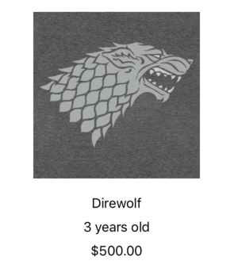
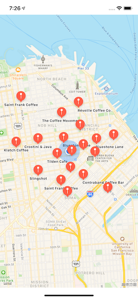
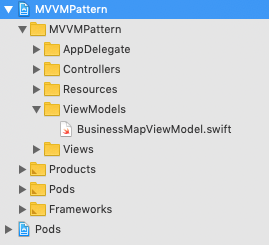
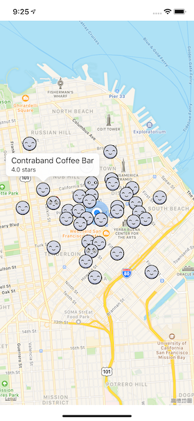

Model-View-ViewModel（简称MVVM）是一种结构设计模式（structural design pattern），将对象分成三个不同的组：


1. Models：持有用户数据。通常为 struct 或 class。
2. Views：在屏幕上显示视觉元素和控件。通常为`UIView`的子类。
3. View models：将模型转换为可在视图上直接显示的值。为了方便传递时进行引用，通常为 class。

MVVM 和 Model-View-Controller（简称MVC）很像。上面 MVVM UML 图中包含视图控制器。也就是，MVVM 模式包含 view controller，只是其作用被弱化了。

在这篇文章中，将介绍如何实现 view model，并重构项目以使用 MVVM 模式。开始部分是一个关于视图模型的简单示例。最后，将获取一个 MVC 项目并重构为 MVVM。

## 1. 何时使用 MVVM 模式

当模型需要转换后才可以在视图显示时，使用 MVVM。例如，使用视图模型（view model）将`Date`转换为日期格式的`String`，将十进制转换为货币格式的`String`等。

MVVM 模式与 MVC 模式并无冲突。如果没有 view model 部分，则将 model-to-view 转换代码放到控制器。但视图控制器已经做了像视图生命周期、IBAction 处理视图回调等各种任务，低耦合变得难以实现。MVC 也就成为了 Massive View Controller。

如何避免过度使用视图控制器？可以在使用 MVC 模式之外，组合使用其他设计模式。Model-View-ViewModel就是其中之一。

## 2. Playground example

在 Xcode 中创建 playground。这部分示例将会创建一个宠物收养视图。

#### 2.1 Model

Model 代码如下：

```
import PlaygroundSupport
import UIKit

// MARK: - Model
public class Pet {
    public enum Rarity {
        case common
        case uncommon
        case rare
        case veryRare
    }
    
    public let name: String
    public let birthday: Date
    public let rarity: Rarity
    public let image: UIImage
    
    public init(name: String,
                birthday: Date,
                rarity: Rarity,
                image: UIImage) {
        self.name = name
        self.birthday = birthday
        self.rarity = rarity
        self.image = image
    }
}
```

这里声明了一个 Pet model，每个 pet 都有`name`、`birthday`、`rarity`、`image`四种属性。需要把这些属性显示到视图中，但`birthday`和`rarity`不能直接显示，需要使用 view model 进行转换。

#### 2.2 ViewModel

ViewModel 代码如下：

```
// MARK: - ViewModel
public class PetViewModel {
    
    // 创建两个属性，并在初始化方法中设值。
    private let pet: Pet
    private let calendar: Calendar
    
    public init(pet: Pet) {
        self.pet = pet
        self.calendar = Calendar(identifier: .gregorian)
    }
    
    // 声明 name 和 image 为计算属性。
    public var name: String {
        return pet.name
    }
    
    public var image: UIImage {
        return pet.image
    }
    
    // 计算属性转换后，将可以使用显示。
    public var ageText: String {
        let today = calendar.startOfDay(for: Date())
        let birthday = calendar.startOfDay(for: pet.birthday)
        let components = calendar.dateComponents([.year],
                                                 from: birthday,
                                                 to: today)
        let age = components.year!
        return "\(age) years old"
    }
    
    // 根据 rarity 决定价格。
    public var adoptionFeeText: String {
        switch pet.rarity {
        case .common:
            return "$50.00"
        case .uncommon:
            return "75.00"
        case .rare:
            return "150.00"
        case .veryRare:
            return "$500.00"
        }
    }
}
```

`name`和`image`直接返回，没有进行任何转换。若后期需要修改`name`（如添加前缀），可以直接在此修改。`ageText`和`adoptionFeeText`转换后直接返回需要显示的字符串。

#### 2.3 View

View 代码如下：

```
// MARK: - View
public class PetView: UIView {
    public let imageView: UIImageView
    public let nameLabel: UILabel
    public let ageLabel: UILabel
    public let adoptionFeeLabel: UILabel
    
    public override init(frame: CGRect) {
        var childFrame = CGRect(x: 0,
                                y: 16,
                                width: frame.width,
                                height: frame.height / 2)
        imageView = UIImageView(frame: childFrame)
        imageView.contentMode = .scaleAspectFit
        
        childFrame.origin.y += childFrame.height + 16
        childFrame.size.height = 30
        nameLabel = UILabel(frame: childFrame)
        nameLabel.textAlignment = .center
        
        childFrame.origin.y += childFrame.height
        ageLabel = UILabel(frame: childFrame)
        ageLabel.textAlignment = .center
        
        childFrame.origin.y += childFrame.height
        adoptionFeeLabel = UILabel(frame: childFrame)
        adoptionFeeLabel.textAlignment = .center
        
        super.init(frame: frame)
        
        backgroundColor = .white
        addSubview(imageView)
        addSubview(nameLabel)
        addSubview(ageLabel)
        addSubview(adoptionFeeLabel)
    }
    
    @available(*, unavailable)
    public required init?(coder aDecoder: NSCoder) {
        fatalError("init?(coder:) is not supported")
    }
}
```

这里创建了一个`PetView`，其有四个子视图。`imageView`显示宠物图片，另外三个 label 分别显示宠物`name`、`age`、adoption fee。最后，在调用`init?(coder:)`时抛出`fatalError`异常来表明不能使用该方法。

#### 2.4 具体应用

现在，可以将其付诸实践。具体应用如下：

```
// MARK: - Example
let birthday = Date(timeIntervalSinceNow: (-3 * 86400 * 366))
let image = UIImage(named: "direwolf")!
let direwolf = Pet(name: "Direwolf",
                 birthday: birthday,
                 rarity: .veryRare,
                 image: image)

// 使用 direwolf 创建 viewModel
let viewModel = PetViewModel(pet: direwolf)

let frame = CGRect(x: 0,
                   y: 0,
                   width: 300,
                   height: 420)
let view = PetView(frame: frame)

// 使用 viewModel 直接显示
view.nameLabel.text = viewModel.name
view.imageView.image = viewModel.image
view.ageLabel.text = viewModel.ageText
view.adoptionFeeLabel.text = viewModel.adoptionFeeText

PlaygroundPage.current.liveView = view
```

要看具体效果，选择 View > Assistant Editor > Show Assistant Editor，运行后如下：



最后，还有一点可以改进。在`PetViewModel`类关闭花括号后添加以下扩展：

```
extension PetViewModel {
    public func configure(_ view: PetView) {
        view.nameLabel.text = name
        view.imageView.image = image
        view.ageLabel.text = ageText
        view.adoptionFeeLabel.text = adoptionFeeText
    }
}
```

现在，可以使用`configure(_ view:)`方法设置 view。

找到以下代码：

```
view.nameLabel.text = viewModel.name
view.imageView.image = viewModel.image
view.ageLabel.text = viewModel.ageText
view.adoptionFeeLabel.text = viewModel.adoptionFeeText
```

并用以下代码替换：

```
viewModel.configure(view)
```

这样可以把所有视图显示逻辑放到 view model 中。在实际应用中，是否这样操作需根据实际情况而定。如果只有一个视图使用此 view model，把`configure(_ view:)`方法放入视图模型中会很有用；如果有多个视图在使用此 ViewModel，把所有显示逻辑放到 view model 会让 view model 混乱。在这种情况下，为每个视图单独配置显示代码可能更为简洁。

> 点击<https://github.com/pro648/BasicDemos-iOS/blob/master/Model-View-ViewModel>获取这一部分的源码。

## 3. 使用 MVVM 重构已有项目

在这一部分，将为 MVVMPattern app 添加功能。

首先，在 [github.com/pro648/BasicDemos-iOS/tree/master/MVVMPattern模版](https://github.com/pro648/BasicDemos-iOS/tree/master/MVVMPattern模版) 下载这篇文章所需要的demo。MVVMPattern app 显示附近的咖啡店，数据由 Yelp 的 YelpAPI 提供，使用 CocoaPods 安装 YelpAPI。

> 如果你对 CocoaPods 不熟悉，可以查看[CocoaPods的安装与使用](https://github.com/pro648/tips/wiki/CocoaPods的安装与使用)、[使用CocoaPods创建公开、私有pod](https://github.com/pro648/tips/wiki/使用CocoaPods创建公开、私有pod)这两篇文章。

在运行 app 前，需要先注册 Yelp API key。在浏览器打开 <https://www.yelp.com/developers/v3/manage_app> 网页，根据提示填写注册信息。将获取到的 key 粘贴到 Resources/APIKeys.swift 文件提示的位置。

运行后如下：



模拟器默认位置是 San Francisco，可以在模拟器菜单栏 Debug > Location 选择其他位置，也可以在 Xcode 调试区域直接选择其他城市。

地图上只显示图钉体验不好，直接显示咖啡店评分信息会更好。

打开`MapPin.swift`文件，`MapPin`类包含`coordinate`、`title`、`rating`三个属性，并对其进行转换以便 map view 可以直接显示。这里就是 view model 的功能。

首先，更改类名称。在 MapPin 上右键，选择 Refactor > Rename。新的名称为 BusinessMapViewModel，这样会同时修改文件名称和类名称，更改 Models 组名称为 ViewModels。更改名称后使用 Sort by name 对文件系统重新排序。如下所示：



这样能清晰表明你在使用 MVVM 模式。

`BusinessMapViewModel`需要更多属性才能显示更为有效的地图注释（map annotation），而非使用 MapKit 提供的普通图钉（pin）。

把`BusinessMapViewModel.swift`文件中的 import Foundation 替换为：

```
import UIKit
```

继续添加以下属性：

```
    public let image: UIImage
    public let ratingDescription: String
```

将使用`image`替换 MapKit 默认的图钉图片，并在用户点击 annotation 时以副标题的形式显示`ratingDescription`。

使用以下代码替换`init(coordinate:name:rating:)`方法：

```
    public init(coordinate: CLLocationCoordinate2D,
                         name: String,
                         rating: Double,
                         image: UIImage) {
        self.coordinate = coordinate
        self.name = name
        self.rating = rating
        self.image = image
        self.ratingDescription = "\(rating) stars"
    }
```

通过初始化程序接受`image`，使用`rating`设置`ratingDescription`。

在`MKAnnotation` extension 添加以下计算属性（computed property）：

```
    public var subtitle: String? {
        return ratingDescription
    }
```

当点击 annotation 时，使用`ratingDescription`作为副标题。

进入`ViewController.swift`文件，使用以下代码替换`addAnnotations()`方法：

```
    private func addAnnotations() {
        for business in businesses {
            guard let yelpCoordinate = business.location.coordinate else {
                continue
            }
            
            let coordinate = CLLocationCoordinate2D(latitude: yelpCoordinate.latitude,
                                                    longitude: yelpCoordinate.longitude)
            let name = business.name
            let rating = business.rating
            let image: UIImage
            
            switch rating {
            case 0.0..<3.5:
                image = UIImage(named: "bad")!
            case 3.5..<4.0:
                image = UIImage(named: "meh")!
            case 4.0..<4.75:
                image = UIImage(named: "good")!
            case 4.75..<5.0:
                image = UIImage(named: "great")!
            default:
                image = UIImage(named: "bad")!
            }
            
            let annotation = BusinessMapViewModel(coordinate: coordinate,
                                    name: name,
                                    rating: rating,
                                    image: image)
            mapView.addAnnotation(annotation)
        }
    }
```

`addAnnotations()`方法与之前没有太大区别，只是添加了 switch 评分，以决定使用那张图片。

如果此时运行 app，你会发现 map view 没有任何变化。这是因为需要在代理方法中提供自定义的 pin，annotation image 才可以显示。

在`addAnnotations()`方法下面添加以下方法：

```
    public func mapView(_ mapView: MKMapView, viewFor annotation: MKAnnotation) -> MKAnnotationView? {
        guard let viewModel = annotation as? BusinessMapViewModel else {
            return nil
        }
        
        let identifier = "business"
        let annotationView: MKAnnotationView
        if let existingView = mapView.dequeueReusableAnnotationView(withIdentifier: identifier) {
            annotationView = existingView
        } else {
            annotationView = MKAnnotationView(annotation: viewModel, reuseIdentifier: identifier)
        }
        
        annotationView.image = viewModel.image
        annotationView.canShowCallout = true
        return annotationView
    }
```

上述代码创建了`MKAnnotationView`，用以显示 annotation 图片。

运行 app，可以看到自定义 annotation，点击 annotation 可以看到咖啡店名称和评分。



> 点击 <https://github.com/pro648/BasicDemos-iOS/tree/master/MVVMPattern> 获取重构后源码。

## 总结

以下是 Model-View-ViewModel 模式的关键点：

- MVVM 有助于减少视图控制器功能，使其易于使用、维护。避免 Massive View Controller 的出现。
- View models 类能够将对象转换为其他类型对象，将转换后的对象传递到视图控制器并显示在视图上。这对于将像`Date`、`Decimal`类型 computed property 转换为类似于`String`类型，并直接显示到`UILabel`、`UIView`中特别有效。
- 如果只有一个视图使用该 view model，可以将所有配置放入视图模型；但是，如果多个视图使用该 view model，将所有显示逻辑放到 view model 可能使其混乱不堪。此时，将显示逻辑放到视图中更为简洁。
- 如果 app 刚开始开发，MVC 可能是一个更好的起点，后续可以根据 app 需求的变化选择不同的设计模式。

Demo名称：MVVMPattern  
源码地址：<https://github.com/pro648/BasicDemos-iOS>

参考资料：

1. [Design Patterns by Tutorials: MVVM](https://www.raywenderlich.com/34-design-patterns-by-tutorials-mvvm)
2. [Model–view–viewmodel](https://en.wikipedia.org/wiki/Model–view–viewmodel)
3. [Introduction to MVVM](https://www.objc.io/issues/13-architecture/mvvm/)