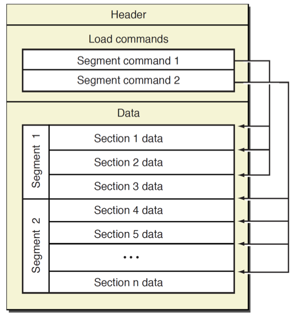
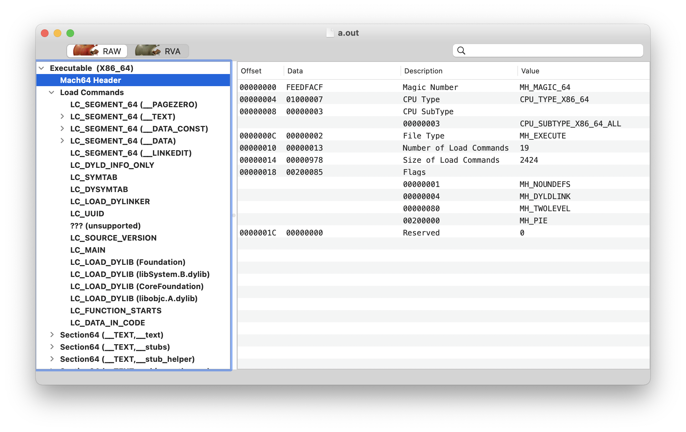

Mach-O是Mach object的缩写，是iOS、macOS上用于存储程序、库的标准格式。可执行文件格式决定了二进制内代码、数据读取到内存中顺序。代码和数据的次序影响着内存占用和 page 活动情况，进而影响到app性能。

这篇文章会介绍编译器执行了哪些操作，可执行文件内部包含了哪些内容。分析编译、可执行文件的过程中，直接使用命令行调用相关命令而非Xcode，这样可以更好理解可执行文件如何工作的。Xcode也只是调用了一系列命令。

iOS、macOS中的可执行文件也称为Mach-O executable。

## 1. xcrun

`xcrun`命令用来调用其它命令。例如，不要直接输入下面命令：

```
$ clang -v
```

应输入以下命令：

```
$ xcrun clang -v
```

`xcrun`的作用就是找到`clang`，调用并传递参数。

你可能会想为什么要添加`xcrun`？看起来没有意义。当同时存在多个版本Xcode时，`xcode-select`和`xcrun`支持选择指定版本Xcode、SDK。

## 2. 不使用IDE开发 Hello World

创建一个名称为`helloworld.c`的文件，并添加以下代码：

```
#include <stdio.h>
int main(int argc, char *argv[])
{
    printf("Hello World!\n");
    return 0;
}
```

使用以下`clang`命令编译`helloworld.c`：

```
$ xcrun clang helloworld.c
```

编译后产生了一个Mach-O二进制文件`a.out`。没有指定编译文件名称时，系统默认使用该名称。

运行`a.out`二进制文件，如下所示：

```
$ ./a.out
Hello World!
```

下面介绍`a.out`二进制文件如何产生的。

## 3. 编译器

`clang`是一个C、C++、Objective-C、Objective-C++编程语言的编译器前端，作者是Chris Lattner。Swift也是由Chris Lattner主导设计。

简而言之，编译器接收`helloworld.c`输入，输出`a.out`可执行文件。整个处理过程包含多个阶段，编译时依次执行。

- 预处理 preprocessing
  - 符号化 tokenization
  - 宏展开 macro expansion
  - `#include`展开
- 语法语义分析 parsing and semantic analysis
  - 将符号化的内容转化为解析树（parse tree）
  - 对解析树进行语义分析
  - 输出抽象语法树（abstract syntax tree，简写为AST）
- 生成代码和优化
  - 将AST转换为更低级的中间码（LLVM IR）
  - 优化中间码
  - 生成特定平台代码
  - 输出汇编代码

- 汇编器
  - 将汇编代码转化为目标对象文件

- 链接器
  - 将多个目标文件链接为一个可执行文件或动态库


#### 3.1 预处理 preprocessing

编译过程中，编译器做的第一项任务就是预处理。通过预处理后暂停执行后续任务，可以看到预处理后的代码：

```
$ xcrun clang -E helloworld.c | open -f
```

在打开文件的最顶部，可以看到很多`#`，即linemarker，它标记出以下行来自哪个文件。再次查看`helloworld.c`文件，其第一行是：

```
#include <stdio.h>
```

`#include`和`import`的作用是告诉预处理器将`stdio.h`的内容插入到`#include`语句所在的位置。插入过程中会递归插入`stdio.h`依赖的文件。

插入时会有多个递归插入，预处理后的文件需要记录源文件中行号。当发生变更后，预处理会在开头插入行标记`#`，`#`后面的数字是源文件中的行号，最后的数字是在新文件中的行号。

滚动到文件末尾，可以看到`helloworld.c`预处理后代码：

```
# 2 "helloworld.c" 2
int main(int argc, char *argv[])
{
    printf("Hello World!\n");
    return 0;
}
```

Xcode 中的*Product* > *Perform Action* > *Preprocess* 可以用来查看预处理后的文件。

#### 3.2 编译

下一步就是分析和生成汇编码。使用`clang`生成汇编码命令如下：

```
 $ xcrun clang -S -o - helloworld.c | open -f
```

查看输出文件，可以看到一些以`.`开头的汇编指令，其它部分是x86_64汇编码，也包含一些标签。

输出文件前四行如下：

```
	.section	__TEXT,__text,regular,pure_instructions
	.build_version macos, 12, 0	sdk_version 12, 1
	.globl	_main                           ## -- Begin function main
	.p2align	4, 0x90
```

前四行都是汇编指令，而非汇编代码。`.section`指令指定后续代码存储在`section`，后续会继续介绍`section`。

`.global`指令标记`_main`函数是一个外部符号，`_main`就是`main()`函数，其需要在二进制文件外部可见，以便系统可以调用执行二进制文件。

`.align`指令指定后续代码对齐方式。在上述代码中，会按照2^4，即16byte方式对齐，用`0x90`补齐。

接下来是`main`函数的header：

```
_main:                                  ## @main
	.cfi_startproc
## %bb.0:
	pushq	%rbp
	.cfi_def_cfa_offset 16
	.cfi_offset %rbp, -16
	movq	%rsp, %rbp
	.cfi_def_cfa_register %rbp
	subq	$16, %rsp
```

上述代码包含一些与C语言类似的标签（label），其是汇编代码特定部分的符号链接。首先是`_main`函数真正开始的地址，这个符号会被export，二进制文件会记录该地址。

`.cfi_startproc`指令常用于函数开始的地方，CFI是调用帧（Call Frame Information）的缩写，帧松散的对应函数。当使用调试器 step in、step out，本质上是step in、step out 调用帧。`.cfi_startproc`指令给了函数一个`.eh_frame`入口，这个入口包含了一些调用栈信息，抛出异常也是用其来展开调用帧堆栈。`.cfi_startproc`指令也会发送一些和具体平台相关的指令，它与`.cfi_endproc`指令相匹配，标记`main()`函数结束。

接着是另一个标签`## %bb.0:`，紧随其后的是第一句汇编代码：`pushq	%rbp`。在macOS上，x86_64架构的应用二进制接口（Application Binary Interface，简写为ABI）指定了函数调用是如何在汇编代码层面上工作的。ABI指定了函数调用之间如何保留`rbp`寄存器数据，`main()`函数需要确保函数调用返回后，`rbp`寄存器的值和之前一样，`pushq %rbp`将`rbp`的值push到栈中，以便后续可以pop出来。

接下来还有另外两个CFI指令，`.cfi_def_caf_offset 16`和`.cfi_offset %rbp, -16`。其将会输出调用堆栈展开和调试的信息。当改变栈和指针指向时，`.cfi_def_caf_offset 16`和`.cfi_offset %rbp, -16`指令为调试器提供当前上下文环境信息。

`movq %rsp, %rbp`将局部变量存储到栈上，`subq $16, %rsp`移动栈指针32字节，以便函数可以使用。先将原来栈指针存储到`rbp`，将此作为局部变量的基址，接着更新堆栈指针到将会使用的位置。

之后调用了`printf()`：

```
  movl	$0, -4(%rbp)
	movl	%edi, -8(%rbp)
	movq	%rsi, -16(%rbp)
	leaq	L_.str(%rip), %rdi
	movb	$0, %al
	callq	_printf
```

最终，`.cfi_endproc`指令与`.cfi_startproc`指令平衡：

```
	xorl	%eax, %eax
	addq	$16, %rsp
	popq	%rbp
	retq
	.cfi_endproc
```

接下来是输出字符串：

```
	.section	__TEXT,__cstring,cstring_literals
L_.str:                                 ## @.str
	.asciz	"Hello World!\n"
```

`.section`指令指出下面代码需要放入的section。`L_.str`标签存储字符串指针，`.asciz`指令指定编译器输出一个以`\0`结尾的字符串。

`__TEXT __cstring` section包含了 C 字符串。

最后的`.subsections_via_symbols`指令是供静态链接编辑器使用的。

#### 3.3 汇编器

汇编器将可读的汇编代码转为机器码，创建一个目标文件（object file），文件扩展名为`.o`。使用Xcode编译后，目标文件位于derived data文件内的`Objects-normal`文件夹中。

#### 3.4 链接器

链接器（linker）解决目标文件、库之间的符号。如下：

```
callq   _printf
```

`printf()`是libc库中的函数。可执行文件需要知道`printf()`在内存中的地址，如`_print`符号的地址。linker管理所有目标文件、库和未知符号，编码到最终的可执行文件中。

## 4. Section

Mach-O二进制文件由多个segment组织而成，每个segment包含一个或多个section。不同类型code、data，存储到不同section。segment 总是从page边界开始，section不一定page对齐。segment大小由它包含所有section大小决定，并向上取整到虚拟内存page边界。因此，segment大小总是4096比特倍数，最小4096byte。

Segment、section名称根据用途确定。segment约定使用双下划线加大写字母，例如`__TEXT`；section约定使用双下划线加小写字母，例如：`__text`。

一个可执行文件包含多个section，可执行文件的不同部分归属于不同section，不同的section归属于不同的segment。这一规则适用于所有app。

使用`size`工具查看下`a.out`二进制文件：

```
$ xcrun size -x -l -m a.out
Segment __PAGEZERO: 0x100000000 (zero fill)  (vmaddr 0x0 fileoff 0)
Segment __TEXT: 0x4000 (vmaddr 0x100000000 fileoff 0)
	Section __text: 0x2c (addr 0x100003f50 offset 16208)
	Section __stubs: 0x6 (addr 0x100003f7c offset 16252)
	Section __stub_helper: 0x1a (addr 0x100003f84 offset 16260)
	Section __cstring: 0xe (addr 0x100003f9e offset 16286)
	Section __unwind_info: 0x48 (addr 0x100003fac offset 16300)
	total 0xa2
Segment __DATA_CONST: 0x4000 (vmaddr 0x100004000 fileoff 16384)
	Section __got: 0x8 (addr 0x100004000 offset 16384)
	total 0x8
Segment __DATA: 0x4000 (vmaddr 0x100008000 fileoff 32768)
	Section __la_symbol_ptr: 0x8 (addr 0x100008000 offset 32768)
	Section __data: 0x8 (addr 0x100008008 offset 32776)
	total 0x10
Segment __LINKEDIT: 0x4000 (vmaddr 0x10000c000 fileoff 49152)
total 0x100010000
```

`a.out`文件包含五个segment，有的segment包含section。

当执行可执行文件时，虚拟内存（virtual memory，简写为VM）系统将segment映射到进程内存地址空间中。映射不同于日常的认知，如果你对虚拟内存不熟悉，可以认为VM将整个可执行文件载进内存，现实中VM会使用一些技巧避免这样操作。

VM进行映射时，segment、section会被赋予不同的属性、权限。

`__TEXT`段包含代码，它被以只读和可执行的方式映射，即进程可以执行代码，但不能修改代码。代码也不能修改自身，因此，page永远不会dirty。

`__DATA`段是可读可写的，但不能执行，包含可被更新的值。

第一个段是`__PAGEZERO`，大小为4GB，其并不会文件的真实大小，但进程地址空间前4GB被映射为不可读、不可写、不可执行的。这就是为什么从`NULL`指针、或较小地址，读取，或向其写入数据会抛出`EXC_BAD_ACCESS`异常。这是操作系统防止开发者产生严重[破坏](https://xkcd.com/371/)的措施。

segment内包含section，section包含可执行文件的不同部分。在`__TEXT`段内，`__text`section包含编译好的机器码。`__stubs`和`__stub_helper`section用于动态链接器（dyld），这样链接动态链接代码时，可以延迟链接。另外，常见的还有`__const`，其是常量；`__cstring`包含可执行文件中字面量字符串。

`__DATA`段包含可读、可写的数据。`__nl_symbol_ptr`是非懒加载符号指针，`__la_symbol_ptr`是懒加载符号指针。懒加载符号指针用于调用可执行文件中未定义的符号。非懒加载的符号指针在可执行文件加载时就已经加载了。

`__DATA`段中常见的section还有：

- `__const`：包含一些需要重定向的常量数据。如`char * const p = "foo";`被`p`指针指向的数据不是常量。
- `__bss`：包含未初始化的静态变量。如`static int a`。
- `__common`：包含未初始化的外部全局变量。如函数外的`int a`。
- `__dyld`：是占位section，用于动态链接器。

> [OS X Assembler Reference](https://developer.apple.com/library/archive/documentation/DeveloperTools/Reference/Assembler/000-Introduction/introduction.html)包含更多section介绍。

#### 4.1 Section内容

使用`otool`可以查看section内容：

```
$ xcrun otool -s __TEXT __text a.out
a.out:
(__TEXT,__text) section
0000000100003f50 55 48 89 e5 48 83 ec 10 c7 45 fc 00 00 00 00 89
0000000100003f60 7d f8 48 89 75 f0 48 8d 3d 31 00 00 00 b0 00 e8
0000000100003f70 08 00 00 00 31 c0 48 83 c4 10 5d c3
```

上面就是`a.out`中的代码。`-s __TEXT __text`非常常用，`otool`提供了快捷键`-t`参数，添加`-v`可以查看汇编代码：

```
$ xcrun otool -v -t a.out
a.out:
(__TEXT,__text) section
_main:
0000000100003f50	pushq	%rbp
0000000100003f51	movq	%rsp, %rbp
0000000100003f54	subq	$0x10, %rsp
0000000100003f58	movl	$0x0, -0x4(%rbp)
0000000100003f5f	movl	%edi, -0x8(%rbp)
0000000100003f62	movq	%rsi, -0x10(%rbp)
0000000100003f66	leaq	0x31(%rip), %rdi
0000000100003f6d	movb	$0x0, %al
0000000100003f6f	callq	0x100003f7c
0000000100003f74	xorl	%eax, %eax
0000000100003f76	addq	$0x10, %rsp
0000000100003f7a	popq	%rbp
0000000100003f7b	retq
```

上述汇编代码与之前编译后代码有些像，只是这次的没有汇编指令，只包含二进制可执行文件。

也可以查看其它section内容：

```
$ xcrun otool -v -s __TEXT __cstring a.out
a.out:
Contents of (__TEXT,__cstring) section
0000000100003f9e  Hello World!\n
```

#### 4.2 `__DATA`和`__TEXT`段对性能的影响

`__DATA`和`__TEXT`段对性能有所影响。如果二进制文件非常大，可以参照[Mach-O Performance Implications](https://developer.apple.com/library/archive/documentation/Performance/Conceptual/CodeFootprint/Articles/MachOOverview.html#//apple_ref/doc/uid/20001860-BAJGJEJC)文档，将数据移动到`__TEXT`段。因为`__TEXT`段永远不会dirty，性能更好。

## 5 Mach-O

macOS、iOS上可执行文件的格式为Mach-O：

```
$ file a.out
a.out: Mach-O 64-bit executable x86_64
```

#### 5.1 file命令

`file`命令用来查看Mach-O文件类型。

GUI app可执行文件格式也是Mach-O：

```
$ file /System/Applications/Calendar.app/Contents/MacOS/Calendar
/System/Applications/Calendar.app/Contents/MacOS/Calendar: Mach-O universal binary with 2 architectures: [x86_64:Mach-O 64-bit executable x86_64] [arm64e]
/System/Applications/Calendar.app/Contents/MacOS/Calendar (for architecture x86_64):	Mach-O 64-bit executable x86_64
/System/Applications/Calendar.app/Contents/MacOS/Calendar (for architecture arm64e):	Mach-O 64-bit executable arm64e
```

#### 5.2 Mach-O的基本结构

一个Mach-O文件包含三个主要区域：

- Header：包含文件类型、目标架构类型等。
- Load commands：描述文件在虚拟内存中的逻辑结构、布局。
- Raw segment data：在load commands中定义的segment的原始数据。



#### 5.3 Mach-O文件格式类型

在[xnu](https://opensource.apple.com/tarballs/xnu/)源码的EXTERNAL_HEADERS/mach-o/loader.h文件中，可以看到Mach-O格式的文件类型有以下13种：

```
#define	MH_OBJECT	0x1		/* relocatable object file */
#define	MH_EXECUTE	0x2		/* demand paged executable file */
#define	MH_FVMLIB	0x3		/* fixed VM shared library file */
#define	MH_CORE		0x4		/* core file */
#define	MH_PRELOAD	0x5		/* preloaded executable file */
#define	MH_DYLIB	0x6		/* dynamically bound shared library */
#define	MH_DYLINKER	0x7		/* dynamic link editor */
#define	MH_BUNDLE	0x8		/* dynamically bound bundle file */
#define	MH_DYLIB_STUB	0x9		/* shared library stub for static */
					/*  linking only, no section contents */
#define	MH_DSYM		0xa		/* companion file with only debug */
					/*  sections */
#define	MH_KEXT_BUNDLE	0xb		/* x86_64 kexts */
#define	MH_FILESET	0xc		/* set of mach-o's */
```

文件类型决定文件布局。`MH_OBJECT`之外的类型，segment会被填充，并在边界对齐，以实现高效的分页。`MH_EXECUTE`、`MH_FVMLIB`、`MH_DYLIB`、`MH_DYLINKER`、`MH_BUNDLE`文件类型也有header，包含在第一个segment中。

`MH_OBJECT`文件类型是一种紧凑格式，作为汇编器的输出、动态连接器的输入。所有section都位于一个无名的segment，segment没有padding。当可执行文件很小，segment padding会大大增加文件大小时，会使用`MH_OBJECT`作为可执行文件格式。目标文件（.o）、静态库文件（.a）都是`MH_OBJECT`格式。

`MH_PRELOAD`文件类型是一种可执行格式，用于不在内核执行的文件。其也可在内核中执行，但需分页，无需预加载。

`MH_DYLIB`类型的文件有`.dylib`、`.framework/xx`。

`MH_DYLINKER`类型的文件有动态链接器`/usr/lib/dyld`。

`MH_DSYM`类型文件用来存储二进制文件符号信息，用来分析app crash信息，`.dSYM/Contents/Resources/DWARF/xx`。

#### 5.4 otool

`otool`工具用来查看Mach-O特定部分和段的内容。例如，查看文件的header，header指定了文件类型、如何加载。使用`-h`标记打印header信息：

```
$ otool -v -h a.out
a.out:
Mach header
      magic  cputype cpusubtype  caps    filetype ncmds sizeofcmds      flags
MH_MAGIC_64   X86_64        ALL  0x00     EXECUTE    16       1368   NOUNDEFS DYLDLINK TWOLEVEL PIE
```

`cputype`和`cpusubtype`指定了可执行文件可运行的目标架构。`ncmds`和`sizeofcmds`是加载命令，可以通过`-l`来查看加载命令：

```
$ otool -v -l a.out | open -f
a.out:
Load command 0
      cmd LC_SEGMENT_64
  cmdsize 72
  segname __PAGEZERO
   vmaddr 0x0000000000000000
   vmsize 0x0000000100000000
  fileoff 0
 filesize 0
  maxprot ---
 initprot ---
   nsects 0
    flags (none)
Load command 1
      cmd LC_SEGMENT_64
  cmdsize 472
  segname __TEXT
   vmaddr 0x0000000100000000
   vmsize 0x0000000000004000
  fileoff 0
 filesize 16384
  maxprot r-x
 initprot r-x
   nsects 5
    flags (none)
……
```

load command指定了文件的逻辑结构，以及在虚拟内存中的布局。`otool`打印出的大部分信息都来自于load command。查看`Load command 1`部分，可以看到`init-prot r-x`指定了`__TEXT`段可读、可执行，不可写入。

对于每个segment，以及每个segment中的section，load command指定了其虚拟内存地址，以及其它权限等。如下是`__TEXT __text`section：

```
Section
  sectname __text
   segname __TEXT
      addr 0x0000000100003f50
      size 0x000000000000002c
    offset 16208
     align 2^4 (16)
    reloff 0
    nreloc 0
      type S_REGULAR
attributes PURE_INSTRUCTIONS SOME_INSTRUCTIONS
 reserved1 0
 reserved2 0
```

代码内存地址是`0x0000000100003f50`，在文件内偏移是16208。使用`xcrun otool -v -t a.out`命令查看汇编代码，可以看到代码内存地址也是`0x0000000100003f50`。

还可以查看可执行文件使用了哪些动态库：

```
$ xcrun otool -v -L a.out
a.out:
	/usr/lib/libSystem.B.dylib (compatibility version 1.0.0, current version 1311.0.0)
	time stamp 2 Thu Jan  1 08:00:02 1970
```

上面就是可执行文件查找`_printf`符合的地方。

#### 5.5 lipo

`lipo`常用于多架构Mach-O文件的处理。一般，包含多种架构的可执行文件被称为通用二进制文件（Universal Binary），也称为胖二进制（Fat Binary）。

因为需要存储多种架构的代码，通用二进制文件通常比单一平台二进制程序要大。但不同架构会有一些共用资源，所以不会达到单一架构的二倍。执行过程中，只调用一部分代码，通过二进制文件运行时无需额外内存。

###### 5.5.1 查看架构信息

` lipo -info`命令查看系统app提醒事项的可执行文件架构信息：

```
$ lipo -info /System/Applications/Reminders.app/Contents/MacOS/Reminders
Architectures in the fat file: /System/Applications/Reminders.app/Contents/MacOS/Reminders are: x86_64 arm64e
```

可以看到其是胖二进制文件，支持x86_64和arm64e两种架构。

###### 5.5.2 导出特定架构 

`lipo 文件路径 -thin 架构类型 -output 输出文件路径`命令能够从fat binary中导出特定架构。下面导出提醒事项的x86_64架构：

```
$ lipo Reminders -thin x86_64 -output Reminders_x86_64
$ lipo -info Reminders_x86_64
Non-fat file: Reminders_x86_64 is architecture: x86_64
```

可以看到成功导出了x86_64架构的Mach-O文件。

###### 5.5.3 合并多种架构

`lipo -create 文件路径1 文件路径2 -output 输出文件路径`命令可以合并多种单一架构Mach-O文件为一个胖二进制文件。

```
$ lipo -create Reminders_x86_64 Reminders_arm64e -output Reminders_fat
$ lipo -info Reminders_fat
Architectures in the fat file: Reminders_fat are: x86_64 arm64e
```

#### 5.6 MachOView

[MachOView](https://github.com/gdbinit/MachOView)工具可以查看Mach-O文件信息，可视化图形界面非常方便。



## 6 一个更复杂的示例

下面是有三个文件的示例。

`Foo.h`文件内容如下：

```
#import <Foundation/Foundation.h>

NS_ASSUME_NONNULL_BEGIN

@interface Foo : NSObject

- (void)run;

@end

NS_ASSUME_NONNULL_END
```

`Foo.m`文件内容如下：

```
#import "Foo.h"

@implementation Foo

- (void)run {
    NSLog(@"%@", NSFullUserName());
}

@end
```

`helloworld.m`文件内容如下：

```
#import "Foo.h"

int main(int argc, char *argv[]) {
    @autoreleasepool {
        Foo *foo = [[Foo alloc] init];
        [foo run];
        return 0;
    }
}
```

#### 6.1 编译多个文件

这里有多个源代码文件，需要先将每个源代码文件使用`clang`生成目标文件：

```
$ xcrun clang -c Foo.m
$ xcrun clang -c helloworld.m
```

头文件无需编译，其作用就是在实现文件之间共享代码。`Foo.m`和`helloworld.m`通过`#import Foo.h`将头文件的内容添加到实现中。

最终得到两个目标文件：

```
$ file helloworld.o Foo.o
helloworld.o: Mach-O 64-bit object x86_64
Foo.o:        Mach-O 64-bit object x86_64
```

将两个目标文件、Foundation框架链接到一起，创建可执行文件：

```
$ xcrun clang helloworld.o Foo.o -Wl,`xcrun --show-sdk-path`/System/Library/Frameworks/Foundation.framework/Foundation
```

执行可执行文件：

```
$ ./a.out
a.out[32258:1293551] ad
```

#### 6.2 符号和链接

上面的简单app是由两个目标文件构成的。`Foo.o`目标文件包含`Foo`类的实现，`helloworld.o`目标文件包含`main()`函数，及调用`Foo`类。

此外，两个目标文件都用到了Foundation框架。`helloworld.o`目标文件的自动释放池、消息机制都用到了Objective-C runtime的`libobjc.dylib`。`Foo.o`目标文件类似。

所有这些都被称为符号（symbol）。可以将符号理解为指针，但本质上又有所不同。

每个函数、全局变量、类都是通过符号的形式来定义、调用。将目标文件链接为可执行文件时，动态链接器负责解析目标文件之间、动态库之间的符号。

可执行文件和目标文件的符号表指定了符号。使用`nm`工具查看`helloworld.o`目标文件，如下所示：

```
$ xcrun nm -nm helloworld.o
                 (undefined) external _OBJC_CLASS_$_Foo
                 (undefined) external _objc_alloc_init
                 (undefined) external _objc_autoreleasePoolPop
                 (undefined) external _objc_autoreleasePoolPush
                 (undefined) external _objc_msgSend
0000000000000000 (__TEXT,__text) external _main
0000000000000060 (__DATA,__objc_classrefs) non-external _OBJC_CLASSLIST_REFERENCES_$_
0000000000000070 (__DATA,__objc_selrefs) non-external _OBJC_SELECTOR_REFERENCES_
```

上述是`helloworld.o`的符号表。`_OBJC_CLASS_$_Foo`是`Foo`类的符号，其是未定义、外部符号。外部（external）意味着对于当前目标文件，该类不是私有的；相反，非外部（non-external）对于当前目标文件，该类是私有的。`helloworld.o`目标文件引用了`Foo`类，但并未实现该类。因此，符号表将其标记为undefined。

`main()`函数的符号`_main`需要能够在外部调用，因此也被标记为external。`main()`函数的实现在`helloworld.o`目标文件，函数地址为`0x00`，编译后被存储到`__TEXT, __text`section。另外四个runtime函数也被链接器解析，并被标记为undefined。

查看`Foo.o`的符号表：

```
$ xcrun nm -nm Foo.o
                 (undefined) external _NSFullUserName
                 (undefined) external _NSLog
                 (undefined) external _OBJC_CLASS_$_NSObject
                 (undefined) external _OBJC_METACLASS_$_NSObject
                 (undefined) external ___CFConstantStringClassReference
                 (undefined) external __objc_empty_cache
0000000000000000 (__TEXT,__text) non-external -[Foo run]
0000000000000058 (__DATA,__objc_const) non-external __OBJC_METACLASS_RO_$_Foo
00000000000000a0 (__DATA,__objc_const) non-external __OBJC_$_INSTANCE_METHODS_Foo
00000000000000c0 (__DATA,__objc_const) non-external __OBJC_CLASS_RO_$_Foo
0000000000000108 (__DATA,__objc_data) external _OBJC_METACLASS_$_Foo
0000000000000130 (__DATA,__objc_data) external _OBJC_CLASS_$_Foo
0000000000000168 (__DATA,__objc_classlist) non-external l_OBJC_LABEL_CLASS_$
```

对于`Foo.o`来说，`_OBJC_CLASS_$_Foo`是定义的、外部符号，它的实现在`Foo.o`目标文件中。

`Foo.o`也包含未定义的符号，例如：`NSFullUserName()`、`NSLog()`、`NSObject`。

当链接`Foo.o`和`helloworld.o`目标文件，以及Foundation框架时，动态链接器解析所有未定义的符号。

当链接器解析了链接动态库的符号后，其会在链接后的镜像中记录该符号。链接器记录最终的可执行文件依赖该动态库，及动态库的路径。在上述示例中，`_NSFullUserName`、`_NSLog`、`_OBJC_CLASS_$_NSObject`和`_objc_autoreleasePoolPop`符号都遵循这个过程。

现在，可以查看下最终的可执行文件`a.out`的符号表，看链接器是如何解析符号的：

```
$ xcrun nm -nm a.out
                 (undefined) external _NSFullUserName (from Foundation)
                 (undefined) external _NSLog (from Foundation)
                 (undefined) external _OBJC_CLASS_$_NSObject (from libobjc)
                 (undefined) external _OBJC_METACLASS_$_NSObject (from libobjc)
                 (undefined) external ___CFConstantStringClassReference (from CoreFoundation)
                 (undefined) external __objc_empty_cache (from libobjc)
                 (undefined) external _objc_alloc_init (from libobjc)
                 (undefined) external _objc_autoreleasePoolPop (from libobjc)
                 (undefined) external _objc_autoreleasePoolPush (from libobjc)
                 (undefined) external _objc_msgSend (from libobjc)
                 (undefined) external dyld_stub_binder (from libSystem)
0000000100000000 (__TEXT,__text) [referenced dynamically] external __mh_execute_header
0000000100003eb0 (__TEXT,__text) external _main
0000000100003f10 (__TEXT,__text) non-external -[Foo run]
0000000100008028 (__DATA,__objc_const) non-external __OBJC_METACLASS_RO_$_Foo
0000000100008070 (__DATA,__objc_const) non-external __OBJC_$_INSTANCE_METHODS_Foo
0000000100008090 (__DATA,__objc_const) non-external __OBJC_CLASS_RO_$_Foo
00000001000080e8 (__DATA,__objc_data) external _OBJC_METACLASS_$_Foo
0000000100008110 (__DATA,__objc_data) external _OBJC_CLASS_$_Foo
0000000100008138 (__DATA,__data) non-external __dyld_private
```

可以看到，所有Foundation和runtime符号都是未定义的，但符号表知道如何解析。例如，在哪个动态库中查找该符号。

可执行文件中也记录了在哪里查找这些库：

```
$ xcrun otool -L a.out
a.out:
	/System/Library/Frameworks/Foundation.framework/Versions/C/Foundation (compatibility version 300.0.0, current version 1856.105.0)
	/usr/lib/libSystem.B.dylib (compatibility version 1.0.0, current version 1311.0.0)
	/System/Library/Frameworks/CoreFoundation.framework/Versions/A/CoreFoundation (compatibility version 150.0.0, current version 1856.105.0)
	/usr/lib/libobjc.A.dylib (compatibility version 1.0.0, current version 228.0.0)
```

动态链接器（dynamic linker，即dyld）在运行时解析未定义的符号。当运行可执行文件时，`dyld`确保符号指向其实现。例如，`_NSFullUserName`指向Foundation中的实现。

`dyld`只能加载以下类型的Mach-O文件，并不能加载自身：

- MH_EXECUTE
- MH_DYLIB
- MH_BUNDLE

> dyld源码中`static ImageLoader* loadPhase6(int fd, const struct stat& stat_buf, const char* path, const LoadContext& context)`方法进行了文件类型判断：
>
> ```
> 	if ( isCompatibleMachO(firstPages, path, fd, fileOffset, fileLength) ) {
> 
> 		// only MH_BUNDLE, MH_DYLIB, and some MH_EXECUTE can be dynamically loaded
> 		const mach_header* mh = (mach_header*)firstPages;
> 		switch ( mh->filetype ) {
> 			case MH_EXECUTE:
> 			case MH_DYLIB:
> 			case MH_BUNDLE:
> 				break;
> 			default:
> 				throw "mach-o, but wrong filetype";
> 		}
> ```

App的可执行文件、动态库都是由dyld负责加载的。

还可以使用`nm`命令查看Foundation中是否定义了指定符号：

```
$ xcrun nm -nm `xcrun --show-sdk-path`/System/Library/Frameworks/Foundation.framework/Foundation | grep NSFullUserName
0000000000007f3e (__TEXT,__text) external _NSFullUserName
```

#### 6.3 动态链接器 The Dynamic Link Editor

有一些环境变量可以用来帮助`dyld`输出信息。例如，设置了`DYLD_PRINT_LIBRARIES`后，`dyld`会打印出加载了哪些库：

```
$ (export DYLD_PRINT_LIBRARIES=; ./a.out )
dyld[34527]: <2D6C24B9-5116-3119-8817-6FE939E115DE> /Users/ad/Downloads/mach-o/a.out
dyld[34527]: <D97BFBA6-8818-33C6-A511-66F5C432FBD7> /System/Library/Frameworks/Foundation.framework/Versions/C/Foundation
dyld[34527]: <33F2DC54-09F1-377F-9273-5DA971AAA102> /usr/lib/libobjc.A.dylib
dyld[34527]: <77EEBAFC-AD12-3973-B95A-7F1A847F631C> /System/Library/Frameworks/CoreFoundation.framework/Versions/A/CoreFoundation
dyld[34527]: <695A0001-FD8C-3E5D-A10D-E30E54D46D1D> /System/Library/PrivateFrameworks/CoreAutoLayout.framework/Versions/A/CoreAutoLayout
```

#### 6.4 dyld共享缓存

开发app时，需要链接大量framework，这些framework会使用framework和动态库。需要加载的动态库列表会迅速变大，相互依赖的符号也会变多。最后，需要解析的符号可能有几千个，整个加载过程可能需要几秒钟。

为了减少解析符号耗时，macOS、iOS在`/var/db/dyld/`中使用了共享缓存（shared cache）。每种架构都有一个文件，包含所有已经解析的符号。当加载新的Mach-O文件时，dyld会先在共享缓存中查找。如果找到了，直接使用；如果找不到，添加到共享缓存中。这样可以极大提高app启动速度。

参考资料：

1. [Mach-O Executables](https://www.objc.io/issues/6-build-tools/mach-o-executables/)
2. [Overview of the Mach-O Executable Format](https://developer.apple.com/library/archive/documentation/Performance/Conceptual/CodeFootprint/Articles/MachOOverview.html#//apple_ref/doc/uid/20001860-BAJGJEJC)
3. [Mach-O Programming Topics](https://developer.apple.com/library/archive/documentation/DeveloperTools/Conceptual/MachOTopics/0-Introduction/introduction.html#//apple_ref/doc/uid/TP40001827-SW1)
3. [Apple 操作系统可执行文件 Mach-O](https://ming1016.github.io/2020/03/29/apple-system-executable-file-macho/)
