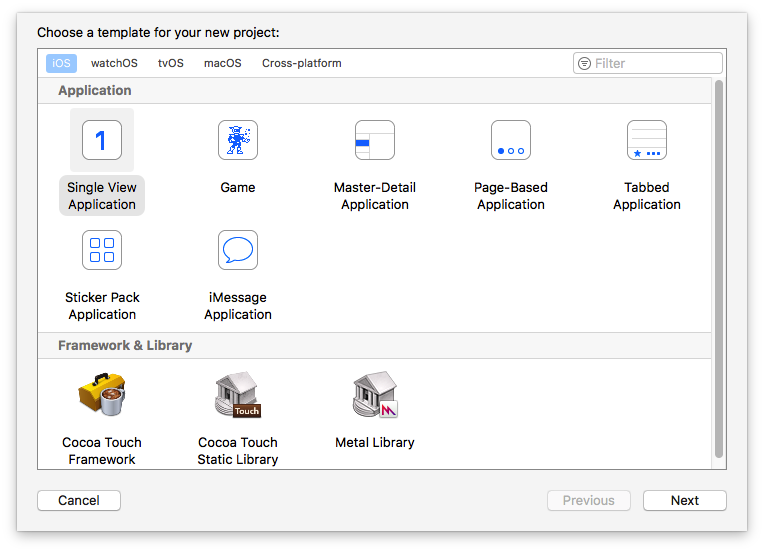
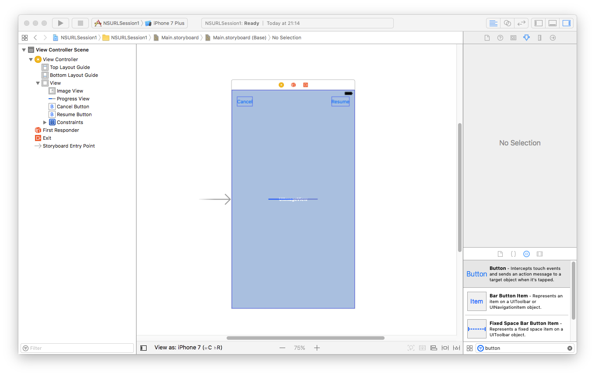
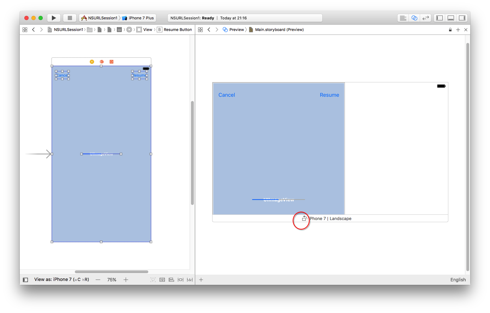
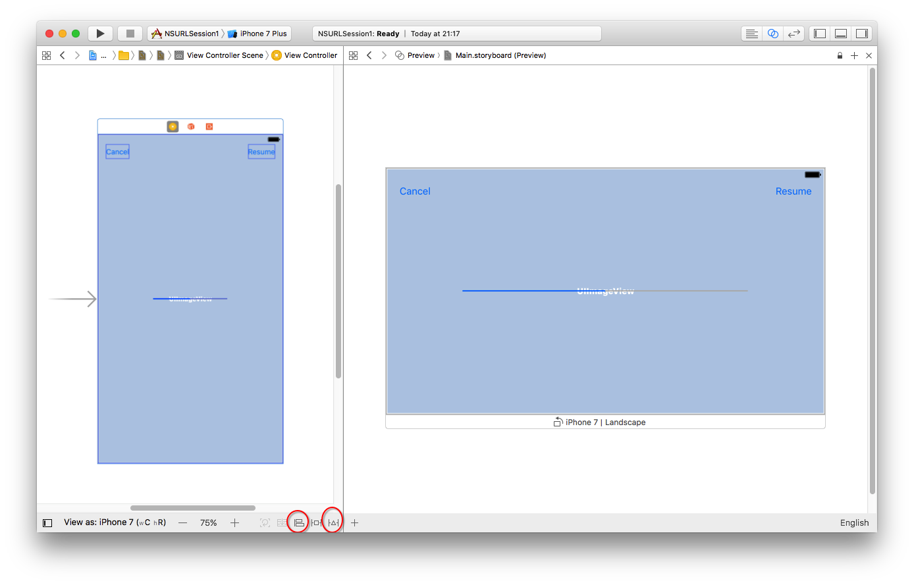

> 这一篇文章不够全面，推荐查看我的另一篇文章：[URLSession详解](https://github.com/pro648/tips/wiki/URLSession%E8%AF%A6%E8%A7%A3)

`NSURLSession`提供了一个可供通过网络下载内容的API，并且具有丰富的代理方法。在iOS中，`NSURLSession`支持在app未运行或挂起时进行后台下载。此外，`NSURLSession`原生的支持data、file、ftp、http和https URL方案，以及用户首选项中代理和socks网关。

使用`NSURLSession`，你的app可以创建一个或多个会话，每一个会话协调一组数据传输任务。例如：你正在开发一个浏览器，你可以为每一个标签页或窗口创建一个会话，或者一个会话用于交互，一个会话用于后台下载。在每一个会话内，可以添加一系列任务，每一个任务代表对特定网址的请求。

## 1. Session类型
会话由创建配置对象时调用的方法决定。可以分为以下几类：

- Shared Session：获取单例对象。使用全局共享的会话，并且不能调整cache、cookie和证书等；也不能使用代理方法，因此将不能检测下载进度一类事件。
- Default Session：默认会话配置使用基于磁盘持久缓存，将凭据保存在用户的钥匙串中，默认将cookie存储在与`NSURLConnection`相同的共享cookie存储中。通过调用`NSURLSessionConfiguration`类中的`defaultSessionConfiguration`方法创建默认会话。
- Ephemeral Session：会把cacehe、cookie和用户凭据保存在RAM中而不是用户磁盘中，只有在你主动保存某个URL的内容到某个文件时才会保存数据，因此最大好处是可以保护用户隐私，适用于无痕浏览。可以缓存的数据大小取决于剩余RAM大小，当会话销毁后，所有临时数据均会清除。另外，在iOS中，应用程序挂起时保存在内存中的数据不会被清除，但在应用程序终止或系统内存不足时会被清除。通过调用`NSURLSessionConfiguration`类中的`ephemeralSessionConfiguration`创建Ephmeral Session。
- Background Session：允许在后台执行HTTP和HTTPS上传或下载任务。`backgroundSessionConfigurationWithIdentifier:`配置的会话由系统在单独的进程中控制数据传输。在iOS中，`backgroundSessionConfigurationWithIdentifier:`配置的会话可以使应用程序挂起或终止后依然进行传输数据。如果app是由系统终止并重新启动，app可以使用相同标志符创建新配置对象和会话，并恢复到终止时的传输状态；如果用户从多任务屏幕中终止app，系统会取消所有后台传输任务，此外，系统也不会重新启动app，必须由用户启动app后传输任务才会继续。通过调用`NSURLSessionConfiguration`类中的`backgroundSessionConfigurationWithIdentifier:`创建Background Session。

```
    // 创建Shared Session
    NSURLSession *sharedSession = [NSURLSession sharedSession];   // 只能在completionHandler的块中获取数据
    
    // 创建Default Session
    NSURLSessionConfiguration *defaultSessionConfiguration = [NSURLSessionConfiguration defaultSessionConfiguration];
    NSURLSession *defaultSession = [NSURLSession sessionWithConfiguration:defaultSessionConfiguration delegate:self delegateQueue:nil]; // 在代理方法中获取数据
    
    // 创建Ephemeral Session
    NSURLSessionConfiguration *ephemeralSessionConfiguration = [NSURLSessionConfiguration ephemeralSessionConfiguration];
    NSURLSession *ephemeralSession = [NSURLSession sessionWithConfiguration:ephemeralSessionConfiguration]; // 在completionHandler的块中获取数据
    
    // 创建Background Session
    NSURLSessionConfiguration *backgroundSessionConfiguration = [NSURLSessionConfiguration backgroundSessionConfigurationWithIdentifier:@"identifier"];
    NSURLSession *backgroundSession = [NSURLSession sessionWithConfiguration:backgroundSessionConfiguration];   // 在completionHandler的块中获取数据
```
会话对象配置还包括对URL缓存和cookie存储对象引用，这些对象用于发出请求、处理响应时使用，具体情况取决于配置和请求类型。

>
>会话对象会对代理保持强引用，直到你退出app或显式销毁会话。如果没有销毁会话，会造成内存泄漏直至退出app。

## 2. Task类型
在会话中，创建任务用于上传数据到服务器，然后从服务器取回文件到本地磁盘或NSData对象到内存中，`NSURLSession`API提供三种Task类型。

- Data Task：发送和接收NSData类型数据，一般用于交互式请求。
- Upload Task：继承自Data Task，一般以文件格式传输数据。支持app未运行时上传数据。
- Download Task：取回的数据是文件格式，支持app未运行时上传、下载。

和其他网络请求API一样，`NSURLSession`也是异步的，根据你Session配置的不同，以下面两种方式之一返回数据。

- 从`completionHandler`的块中获取数据，当传输完成或失败后调用块。
- 在代理方法中获取数据。有多种代理方法可供选择使用，比上面的方法功能强大些，例如可以检测下载进度。

## 3. NSURLSession的使用步骤
1. 创建会话配置。对于`Background Session`必须包含一个单独的标志符，标志符不能为nil或空字符串，用于在app崩溃、终止或挂起后将会话再次匹配。
2. 选择会话配置类型，创建会话。
3. 创建任务。根据想要实现的功能选择Task类型。
4. 执行任务。所有创建的任务默认都是挂起状态，必须调用`resume`方法任务才会执行。

## 4. 简单应用
学习新的API最好的方法就是使用代码练习，下面通过一个小例子来学习`NSURLSession`。

### 4.1 新建工程
启动Xcode8.2，点击*Create a new Xcode project*，在iOS模板列表里选择*Single View Application*模板。



填写工程名称，我这里命名为*NSURLSession1*，选择文件位置，最后点击*Create*。


### 4.2 创建会话
使用`NSURLSession`最重要的一点是理解`NSURLSession`的实例对象是一切的核心，这个对象处理请求和响应、配置请求、管理会话存储和状态。有多种创建会话的方法，最快速的创建方法是使用`NSURLSession`的`sharedSession`类方法，如下所示：

```
- (void)viewDidLoad
{
    [super viewDidLoad];
    
    NSURLSession *session = [NSURLSession sharedSession];
}
```

如上面代码所示，在`ViewController.m`的`viewDidLoad`方法内创建一个`session`对象。

### 4.3 创建任务
我们将使用`session`对象查询[iTunes Search API](https://affiliate.itunes.apple.com/resources/documentation/itunes-store-web-service-search-api/#searching)上的软件。iTunes Search API不需要身份验证，因此特别适合我们的例子。想要查询iTunes Search API我们需要向 `https://itunes.apple.com/search`发送请求、传递参数。创建一个`NSURLSessionDataTask`的实例`dataTask`用来查询iTunes Search API，查看更新后的`viewDidLoad`方法。

```
- (void)viewDidLoad
{
    [super viewDidLoad];
    
    NSURLSession *session = [NSURLSession sharedSession];
    NSURLSessionDataTask *dataTask = [session dataTaskWithURL:[NSURL URLWithString:@"https://itunes.apple.com/search?term=apple&media=software"] completionHandler:^(NSData * _Nullable data, NSURLResponse * _Nullable response, NSError * _Nullable error) {
        NSDictionary *json = [NSJSONSerialization JSONObjectWithData:data options:0 error:nil];
        NSLog(@"%@",json);
    }];
}
```

在这个实例中，我们调用`dataTaskWithURL: completionHandler:`方法，并传递一个`NSURL`的实例和一个完成处理程序。完成处理程序有三个参数，分别是响应的数据（`NSData`）、响应对象（`NSURLResponse`）和错误（`NSError`）。如果请求成功，`error`为`nil`。因为我们知道返回的是JSON格式数据，将取回的数据使用`JSONObjectWithData: options: error: `方法解析数据并输出到控制台。

> 使用`NSURLSession`和`NSURLConnection`时还有一点需要理解。如果请求失败，完成处理程序中的`error`包含错误信息；如果请求返回`404`(404表示客户端可以与服务器通信，但服务器找不到请求内容），则请求成功，只是服务器没有找到请求内容，此时 `error`为`nil`。

### 4.4 执行任务

所有新创建的任务都是挂起状态，必须调用`resume`方法才会执行。更新后的`viewDidLoad`如下。

```
- (void)viewDidLoad
{
    [super viewDidLoad];
    
    NSURLSession *session = [NSURLSession sharedSession];
    NSURLSessionDataTask *dataTask = [session dataTaskWithURL:[NSURL URLWithString:@"https://itunes.apple.com/search?term=apple&media=software"] completionHandler:^(NSData * _Nullable data, NSURLResponse * _Nullable response, NSError * _Nullable error) {
        NSDictionary *json = [NSJSONSerialization JSONObjectWithData:data options:0 error:nil];
        NSLog(@"%@",json);
    }];
    [dataTask resume];
}
```

运行demo，可以看到控制台输出的数据。

## 5. 进阶应用

在上一个示例中，通过完成处理处理程序获取返回的数据，另外还可以通过`NSURLSessionDownloadDelegate`方法获取数据。下面通过使用`NSURLSession`和`NSURLSessionDownloadDelegate`获取图片，利用`UIProgressView`显示图片下载进度，下载过程中可以点击*Cancel* 按钮暂停下载，点击*Resume* 按钮恢复下载。利用观察者（Key Value Observing）实现不同状态时*Cancel* 按钮和*Resume* 按钮的显示或隐藏状态。

### 5.1 创建用户界面

打开Main.storyboard，从组件库（Object Library）中拖拽一个`UIImageView`到`View Controller`，调整大小至全屏，拖拽一个`UIProgressView`到屏幕中心，拖拽`UIButton`到左上角有横竖两条辅助虚线位置，右上角同样方法放置一个`UIButton`。创建完成后如下图：



拖拽`UIImageView`到`ViewController.m`的接口部分并命名为`imageView`，类型选择为IBOutlet；`UIProgressView`在storyboard中不易选中，我们可以从大纲试图中选中并拖拽到`ViewController.m`的接口部分，命名为`progressView`,类型选择IBOutlet；分别拖拽左上角和右上角的`UIButton`到接口部分，分别命名为`cancelButton`、`resumeButton`，类型选择为IBOutlet；分别拖拽左上角、右上角两个`UIButton`到接口部分，名称分别为`cancle`、`resume`，类型选择为IBAction。在*Attribute Inspector* 中修改左上角按钮名称为*Cancel*，右上角按钮名称为*Resume*。完成后接口部分代码如下：

```
#import "ViewController.h"

@interface ViewController ()

@property (strong, nonatomic) IBOutlet UIImageView *imageView;
@property (strong, nonatomic) IBOutlet UIProgressView *progressView;
@property (strong, nonatomic) IBOutlet UIButton *cancelButton;
@property (strong, nonatomic) IBOutlet UIButton *resumeButton;

- (IBAction)cancel:(id)sender;
- (IBAction)resume:(id)sender;

@end
```

### 5.2 自动布局

点击屏幕右上角的工具栏中的*Assistant Editor*，之后将编辑器选择拦从*Automatic* 改为*Preview*，这样可以预览我们创建的用户界面。如下图：


点击*Preview*界面底部的*Rotate* 按钮,发现屏幕显示的控件都在屏幕左侧。



下面进行自动布局设置。选中`imageView`、`cancelButton`和`resumeButton`点击右下角*Resolve AutoLayout Issues*，在弹出菜单中选择*Selected Views*下面的*Reset to Suggested Constraints*选项；选中`progressView`，点击右下角的*Align*按钮，勾选弹出菜单中的*Horizontally in Container*和*Vertically in Container*，点击*Add Constraints*。如果此时有警告，按照提示选择修复或添加约束。至此，自定义布局完成。



### 5.3 创建下载任务

在`ViewController.m`接口文件声明`session`、`downloadTask`，另外，`ViewController`需要遵守`NSURLSessionDelegate`和`NSURLSessionDownloadDelegate`协议。更新后的接口部分如下：

```
#import "ViewController.h"

@interface ViewController () <NSURLSessionDelegate, NSURLSessionDownloadDelegate>

@property (strong, nonatomic) IBOutlet UIImageView *imageView;
@property (strong, nonatomic) IBOutlet UIProgressView *progressView;
@property (strong, nonatomic) IBOutlet UIButton *cancelButton;
@property (strong, nonatomic) IBOutlet UIButton *resumeButton;
@property (strong, nonatomic) NSURLSession *session;
@property (strong, nonatomic) NSURLSessionDownloadTask *downloadTask;
@property (strong, nonatomic) NSData *resumeData;   // 用于存储暂停下载时的数据

- (IBAction)cancel:(id)sender;
- (IBAction)resume:(id)sender;

@end
```

1. 因为需要配置会话、使用代理获取下载进度，这里就不能使用`sharedSession`类方法。首先实现会话的取值方法，使用`defaultConfiguration`方法创建会话配置，用会话配置实例化会话对象，设定`ViewController`为会话的代理，代码如下：

```
- (NSURLSession *)session
{
    if (! _session)
    {
        // 创建会话配置
        NSURLSessionConfiguration *sessionConfiguration = [NSURLSessionConfiguration defaultSessionConfiguration];
        
        // 创建会话
        _session = [NSURLSession sessionWithConfiguration:sessionConfiguration delegate:self delegateQueue:nil];
    }
    
    return _session;
}
```

实现`progressView`的设值方法。因为使用纯代码创建的`UIProgressView`默认值是0，使用storyboard创建的`UIProgressView`的默认值是0.5，这里需要将`UIProgressView`初始值设置为0，不然每次启动时显示下载进度在一半，之后进度再从0开始。

```
- (void)setProgressView:(UIProgressView *)progressView
{
    if (_progressView != progressView)
    {
        _progressView = progressView;
        _progressView.progress = 0;
    }
}
```

在`viewDidLoad`方法中创建下载任务，下载`https://cdn.tutsplus.com/mobile/uploads/2013/12/sample.jpg`的图片。最后调用`resume`执行下载任务。

```
- (void)viewDidLoad
{
    [super viewDidLoad];
    
    // 创建下载任务
    self.downloadTask = [self.session downloadTaskWithURL:[NSURL URLWithString:@"https://cdn.tutsplus.com/mobile/uploads/2013/12/sample.jpg"]];
    
    // 执行任务
    [self.downloadTask resume];
}
```

### 5.4 实现代理方法

为了获取返回的数据，我们需要实现`NSURLSessionDownloadDelegate`协议的三个代理方法，`URLSession: downloadTask: didFinishDownloadingToURL: `、`URLSession: downloadTask: didResumeAtOffset: expectedTotalBytes: `和`URLSession: downloadTask: didWriteData: totalBytesWritten: totalBytesExpectedToWrite: `。需要注意的是更新UI时需要回到主线程。

```
- (void)URLSession:(NSURLSession *)session downloadTask:(NSURLSessionDownloadTask *)downloadTask didFinishDownloadingToURL:(NSURL *)location
{
    NSData *data = [NSData dataWithContentsOfURL:location];
    
    dispatch_async(dispatch_get_main_queue(), ^{
        self.imageView.image = [UIImage imageWithData:data];
    });
}

- (void)URLSession:(NSURLSession *)session downloadTask:(NSURLSessionDownloadTask *)downloadTask didResumeAtOffset:(int64_t)fileOffset expectedTotalBytes:(int64_t)expectedTotalBytes
{
    // 输出NSLog所在行 方法名称
    NSLog(@"%d %s",__LINE__ ,__PRETTY_FUNCTION__);
}

- (void)URLSession:(NSURLSession *)session downloadTask:(NSURLSessionDownloadTask *)downloadTask didWriteData:(int64_t)bytesWritten totalBytesWritten:(int64_t)totalBytesWritten totalBytesExpectedToWrite:(int64_t)totalBytesExpectedToWrite
{
    float progress = (double) totalBytesWritten / totalBytesExpectedToWrite;
    
    dispatch_async(dispatch_get_main_queue(), ^{
        self.progressView.progress = progress;
    });
}
```

### 5.5 暂停下载

`cancel`点击事件方法包含了点击*Cancel*按钮后的逻辑操作。如果`downloadTask`不为`nil`，`downloadTask`调用`cancelByProducingResumeData`方法，该方法的参数是一个完成块，完成块包含`NSData`类型的参数。不是所有的下载任务都可以恢复，所以先检查块的参数`resumeData`是否为`nil`，不为`nil`时将返回的数据保存到`ViewController.m`头文件声明的`resumeData`中。

```
- (IBAction)cancel:(id)sender
{
    if (! self.downloadTask) return;
    
    [self.downloadTask cancelByProducingResumeData:^(NSData * _Nullable resumeData) {
        if (resumeData)
        {
            [self setResumeData:resumeData];
            [self setDownloadTask:nil];
        }
    }];
}
```

### 5.6 恢复下载

想要恢复下载很容易，在`resume`点击事件中，如果`resumeData`不为`nil`，使用`resumeData`创建一个新的`downloadTask`任务，之后执行下载，清空`resumeData`数据。

```
- (IBAction)resume:(id)sender
{
    if (! self.resumeData) return;
    
    // 创建任务
    self.downloadTask = [self.session downloadTaskWithResumeData:self.resumeData];
    
    // 执行任务
    [self.downloadTask resume];
    
    // 清除resumeData数据
    [self setResumeData:nil];
}
```

### 5.7 添加观察者

点击按钮不应该一直显示，下面使用观察者来决定何时显示、隐藏点击按钮。在`viewDidLoad`方法中，隐藏点击按钮，将`ViewController`添加为`reuseData`和`downloadTask`关键路径的观察者。

```
- (void)viewDidLoad
{
    [super viewDidLoad];
    
    // 添加观察者
    [self addObserver:self forKeyPath:@"resumeData" options:NSKeyValueObservingOptionNew context:NULL];
    [self addObserver:self forKeyPath:@"downloadTask" options:NSKeyValueObservingOptionNew context:NULL];
    
    // 隐藏点击按钮
    self.cancelButton.hidden = YES;
    self.resumeButton.hidden = YES;
    
    // 创建下载任务
    self.downloadTask = [self.session downloadTaskWithURL:[NSURL URLWithString:@"https://cdn.tutsplus.com/mobile/uploads/2013/12/sample.jpg"]];
    
    // 执行任务
    [self.downloadTask resume];
}
```

在`obserValueForKeyPath: ofObject: change: context: `方法中，当`resumeData`为`nil`时，隐藏*Resume*按钮；当`downloadTask`为`nil`时，隐藏*Cancel*按钮。

```
- (void)observeValueForKeyPath:(NSString *)keyPath ofObject:(id)object change:(NSDictionary<NSKeyValueChangeKey,id> *)change context:(void *)context
{
    if ([keyPath isEqualToString:@"resumeData"])
    {
        dispatch_async(dispatch_get_main_queue(), ^{
            self.resumeButton.hidden = (self.resumeData == nil);
        });
    }
    else if ([keyPath isEqualToString:@"downloadTask"])
    {
        dispatch_async(dispatch_get_main_queue(), ^{
            self.cancelButton.hidden = (self.downloadTask == nil);
        });
    }
    else
        // 如果遇到没有观察的属性，将其交由父类处理，父类可能也在观察该属性。
        [super observeValueForKeyPath:keyPath ofObject:object change:change context:context];
}
```

> 注意：因为不知道是否在主线程调用`obserValueForKeyPath: ofObject: change: context: `方法，这里更新UI时需要回到主线程。
>

最后，移除观察者。

```
- (void)dealloc {
    // 移除观察者。
    [self removeObserver:self forKeyPath:@"resumeData"];
    [self removeObserver:self forKeyPath:@"downloadTask"];
}
```

> 想要深入学习观察者，查看[KVC和KVO学习笔记](https://github.com/pro648/tips/wiki/KVC和KVO学习笔记)这篇文章。

### 5.8 销毁会话

会话对代理是强引用，也就是只要会话是活跃的代理就不会被释放，这样会造成内存泄露，因此任务执行完毕后需要将会话销毁。有多种方法销毁会话，因为这里我们只下载了一张图片，我们可以在图片下载完成后销毁会话。下面是更新后的`URLSession: downloadTask: didFinishDownloadToURL: `方法，图片下载完成后把*Cancle*按钮和`progressView`设置为隐藏。

```
- (void)URLSession:(NSURLSession *)session downloadTask:(NSURLSessionDownloadTask *)downloadTask didFinishDownloadingToURL:(NSURL *)location
{
    NSData *data = [NSData dataWithContentsOfURL:location];
    
    dispatch_async(dispatch_get_main_queue(), ^{
        self.progressView.hidden = YES;     // 下载完成后隐藏进度条
        self.cancelButton.hidden = YES;     // 下载完成后隐藏Cancel按钮
        self.imageView.image = [UIImage imageWithData:data];
    });
    
    // 销毁会话
    [session finishTasksAndInvalidate];
}
```

通过这篇文章的讲解，你应该对`NSURLSession`有一个基本的理解，下一篇文章将通过创建一个简单的播客来使用后台下载。

文件名称：NSURLSession1   
源码下载：<https://github.com/pro648/BasicDemos-iOS>

参考资料:

1. [Networking with NSURLSession: Part 1](https://code.tutsplus.com/tutorials/networking-with-nsurlsession-part-1--mobile-21394)
2. [Networking with NSURLSession: Part 2](https://code.tutsplus.com/tutorials/networking-with-nsurlsession-part-2--mobile-21581)
3. [URLSession](https://developer.apple.com/reference/foundation/urlsession)
