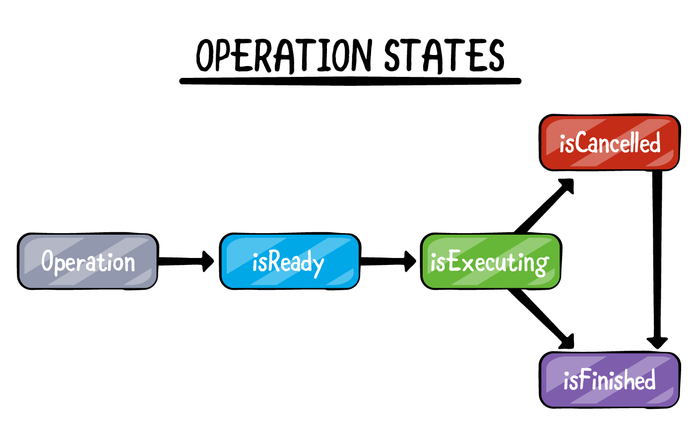
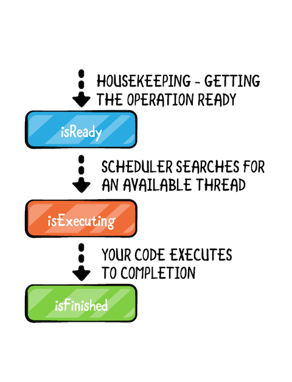
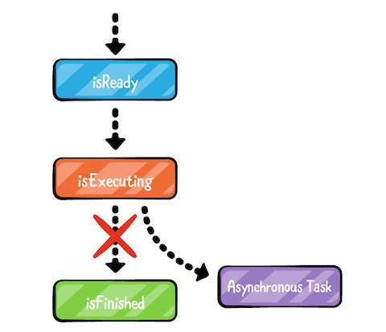
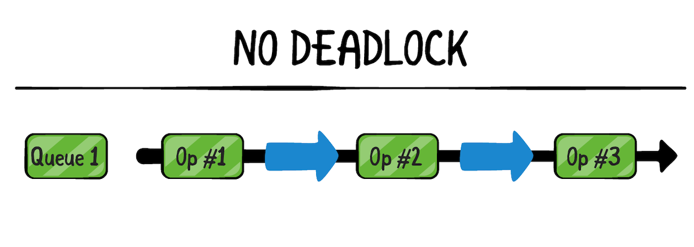
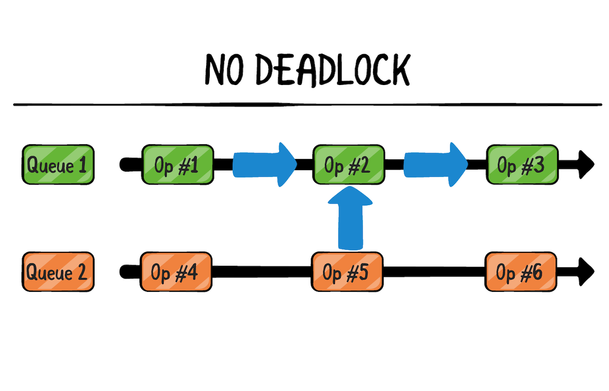
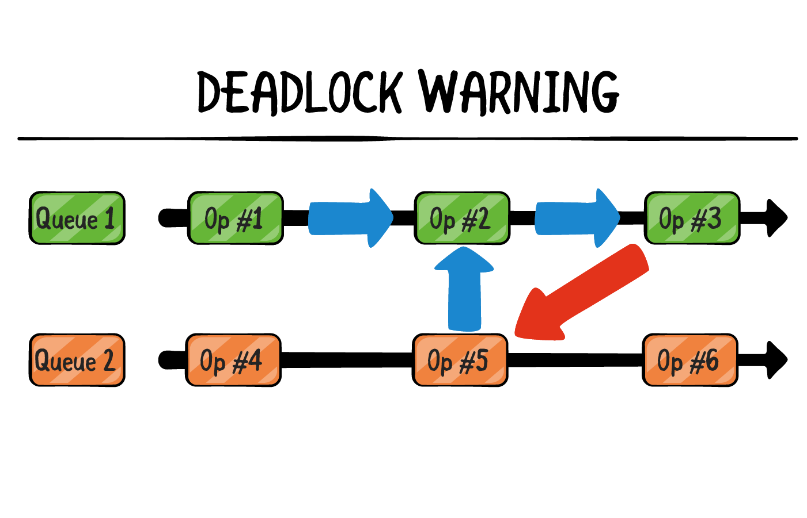

iOS、macOS 设备一般为多核，也就是可以同时执行多项任务。将代码分为多块，并发（Concurrency）执行可以提高 app 流程性。

iOS、macOS 提供了[Grand Central Dispatch](https://github.com/pro648/tips/wiki/Grand-Central-Dispatch%E7%9A%84%E4%BD%BF%E7%94%A8)（简称GCD）、Operations两种解决方案。我的另一篇文章[Grand Central Dispatch的使用](https://github.com/pro648/tips/wiki/Grand-Central-Dispatch%E7%9A%84%E4%BD%BF%E7%94%A8)已经介绍过GCD，这篇文章将介绍Operation、OperationQueue和BlockOperation。

## 1. Operations

`Operation`代表单个任务代码和数据的抽象类。

因为`Operation`是抽象类，所以不能直接使用。需继承后使用其子类，或使用系统提供的子类来执行任务。例如`NSInvocationOperation`和`NSBlockOperation`。尽管`Operation`是抽象类，但其实现了协调任务执行的逻辑，使用其子类时只需关注任务执行即可，无需关注任务与其他系统对象关系。

operation 对象只能执行一次。通常，将 operation 对象添加到`OperationQueue`类的实例中，`OperationQueue`类实例可以直接在辅助线程执行 operation，或者使用 GCD 执行。

#### 1.1 Operation 状态



`Operation`对象在内部维护了状态（state）信息，以便决定何时可以执行任务，以及通知外部客户当前任务的生命周期。子类需维护 state 信息，以确保正确执行代码中的操作。与`Operation`state 相关 key path 如下：

- isReady：`Operation`是否可以执行。可以执行时为 true，不能执行时为 false。大部分情况下，无需维护isReady。如果除 dependent 外还有其他条件约束是否可执行，则需要实现 isReady，并维护其状态。

- isExecuting：`Operation`是否正在执行任务。正在执行时为 true，否则为 false。

  如果实现了`start()`方法，则需实现 isExecuting 属性，并在状态变化时发送 KVO 通知。

- isFinished：标记 operation 成功执行完成，或取消退出。只有当 operation 的 isFinished 为 true 时，operation 对象才会移除 dependency，operation queue 才会出队 operation。因此，任务完成后将 operation 的 isFinished 标记为 true 至关重要。

  如果实现了`start()`方法，则需实现 isFinised 属性，并在状态变化时发送 KVO 通知。

- isCancelled：标记 operation 是否被取消。推荐但并非必须实现 isCancelled，其状态变化时没有必要发出 KVO 通知。

上述状态均是只读的，在任务执行过程中随时可以查询这些属性状态。`Operation`类自动维护这些状态。但你可以通过调用`start()`改变 isExecuting 状态，调用`cancel()`改变 isCancelled 状态。

#### 1.2 BlockOperation

`BlockOperation`是`Operation`的具体子类，用于管理一个、多个块的并发执行。使用`BlockOperation`类可以一次执行多个块，无需为每个块创建单独的 operation。当执行多个 block 时，只有所有 block 执行完毕时，`BlockOperation`才视为完成，这一点与[dispatch group](https://github.com/pro648/tips/wiki/Grand-Central-Dispatch%E7%9A%84%E4%BD%BF%E7%94%A8#9-%E4%BD%BF%E7%94%A8dispatch-group%E4%BF%AE%E5%A4%8D%E5%BC%B9%E7%AA%97%E8%BF%87%E6%97%A9%E9%97%AE%E9%A2%98)很像。

默认情况下，添加到`BlockOperation`中的 block 被调度到默认全局队列。Block 不应对运行环境做任何假设。

###### 1.2.1 单个 block 的BlockOperation

创建包含一个 block 的`BlockOperation`非常简单，只需为初始化方法传递 closure 即可。如下所示：

```
        let operation = BlockOperation {
            print("7 + 11 = \(7 + 11)")
        }
        operation.start()
```

###### 1.2.2 多 block 的 BlockOperation

调用`addExecutionBlock`方法可以向`BlockOperation`添加多个block。如果调用时，`BlockOperation`实例正在执行或已经完成，则会抛出`NSInvalidArgumentException`的异常。

```
    private func testMultipleBlockOperation() {
        let sentence = "The author of this article is pro648"
        let wordOperation = BlockOperation()
        
        for word in sentence.split(separator: " ") {
            wordOperation.addExecutionBlock {
                print(word)
            }
        }
        
        wordOperation.start()
    }
```

上述代码将sentence语句按空格分割，将每个单词添加到一个 closure。执行后每行输出一个单词，多次执行会发现其先后顺序不固定。

更新上述代码如下：

```
    private func testMultipleBlockOperation() {
        let sentence = "The author of this article is pro648"
        let wordOperation = BlockOperation()
        
        for word in sentence.split(separator: " ") {
            wordOperation.addExecutionBlock {
                print(word)
                sleep(2)
            }
        }
        
        let interval = duration {
            wordOperation.start()
        }
        print("Timeinterval: \(interval)")
    }
    
    private func duration(_ block: () -> ()) -> TimeInterval {
        let startTime = Date()
        block()
        return Date().timeIntervalSince(startTime)
    }
```

尽管每个操作后休眠2秒钟，但其总时间并不是14秒，如下所示：

```
author
of
this
The
is
article
pro648
Timeinterval: 4.002905011177063
```

`BlockOperation`与 DispatchGroup 有些相似，都可以很简单的获取所有任务完毕的消息。如果为 wordOperation 添加`completionBlock`，其会在所有任务执行完毕后调用。在调用`duration`前添加以下代码：

```
        wordOperation.completionBlock = {
            print("https://github.com/pro648/tips/wiki")
        }
```

运行后输出如下：

```
this
of
author
The
article
is
pro648
https://github.com/pro648/tips/wiki
Timeinterval: 4.002982020378113
```

#### 1.3 Operation 子类

`BlockOperation`类适用于简单任务，如果要执行复杂、复用的任务，需使用`Operation`的子类。

> 通过后续章节的练习，将实现如下图所示的demo：
>
> 
>
> 其从网络下载图片、添加滤镜，分别封装到不同 operation，且添加滤镜 operation 依赖图片下载 operation。
>
> 在<https://github.com/pro648/BasicDemos-iOS/tree/master/Operation&OperationQueue>下载demo源码。

更新`tableView(_:cellForRowAt:)`方法，使用`SepiaFilter`类的`applySepiaFilter(_:)`方法为图片添加滤镜：

```
    func tableView(_ tableView: UITableView, cellForRowAt indexPath: IndexPath) -> UITableViewCell {
        let cell = tableView.dequeueReusableCell(withIdentifier: "PhotoCell", for: indexPath) as! PhotoCell
        let inputImage = UIImage(named: "\(indexPath.row).png")!
//        cell.display(image: inputImage)
        
        guard let filteredImage = SepiaFilter().applySepiaFilter(inputImage) else {
            cell.display(image: nil)
            return cell
        }
        cell.display(image: filteredImage)
        
        return cell
    }
```

添加滤镜后滑动 app 可以看到明显掉帧。为了让 app 更流畅，需要将添加滤镜的操作转移到其他线程。

Core Image 相关操作会重复使用，应放到`Operation`子类中进行。子类需要inputImage和outputImage两个属性，inputImage应禁止修改。创建`FilterOperation`类，如下所示：

```
final class FilterOperation: Operation {
    var outputImage: UIImage?
    
    private let inputImage: UIImage
    
    init(image: UIImage) {
        inputImage = image
        super.init()
    }
}
```

如果将其设置为属性，则每个`FilterOperation`实例都会初始化一份 context。`CIContext`是线程安全的，应尽可能重复使用，static 关键字可以实现这一需求。在`SepiaFilter`类开始位置添加以下代码：

```
    private static let context = CIContext()
```

operation 开始时会调用`main()`方法。`main()`函数的默认实现不执行任何操作，重写此方法以执行所需任务，请勿在此方法中调用 super。更新后如下：

```
    override func main() {
        guard let filteredImage = SepiaFilter().applySepiaFilter(inputImage) else {
            print("Failed to apply sepia filter")
            return
        }
         outputImage = filteredImage
    }
```

现在，更新`tableView(_:cellForRowAt:)`方法，使用`FilterOperation`类添加滤镜：

```
    func tableView(_ tableView: UITableView, cellForRowAt indexPath: IndexPath) -> UITableViewCell {
        let cell = tableView.dequeueReusableCell(withIdentifier: "PhotoCell", for: indexPath) as! PhotoCell
        let inputImage = UIImage(named: "\(indexPath.row).png")!
        
        // 使用FilterOperation添加滤镜
        print("Filtering")
        let op = FilterOperation(image: inputImage)
        op.start()
        
        cell.display(image: op.outputImage)
        print("Done")
        
        return cell
    }
```

在上述代码中，手动调用`start()`方法执行 operation。运行demo后会发现性能没有发生变化，依然掉帧严重。

`Operation`对象默认是同步执行，即 operation 对象不会创建单独线程执行任务。当调用`start()`方法时，operation 在当前线程执行，当`start()`方法将控制权返回给调用者时，任务已经完成。在这里，operation 任务在主线程执行，并不能提升性能。

> 调用`start()`除在当前线程执行任务，如果 operation 状态不是 ready，还会引起闪退。通常，不会直接调用`start()`。

## 2. OperationQueue

`OperationQueue`根据队列中`Operation`优先级、是否可执行调度执行。添加到`OperationQueue`后，operation 一直处于队列中直到完成。不能直接将 operation 从 operation queue 移除。

> `OperationQueue`持有 operation，直到 operation 执行完成。queue 持有自身直到所有任务完成。operation 未完成时挂起 operation queue 可能产生内存泄漏。

使用`OperationQueue`处理`Operation`时，`Operation`的优势才得以体现。像 GCD 的 DispatchQueue 一样，`OperationQueue`类用于管理`Operation`调度、最大执行数量等。

有以下三种向`OperationQueue`添加任务方式：

- 传递 operation。
- 传递 closure。
- 传递 operation 数组。

#### 2.1 常用功能点

`OperationQueue`根据 operation 的`ready`、quality of service 和 denpendencies 决定执行顺序。一旦将 operation 添加到`OperationQueue`，其会一直执行，直到完成或取消。后续章节会介绍 dependencies 和 cancelling operation。

一旦将`Operation`添加到了`OperationQueue`，则不能将其添加到任何其他队列。`Operation`实例是一次性任务，这也是为什么将其写为子类，以便可以多次执行。

###### 2.1.1 waitUntilAllOperationsAreFinished

堵塞当前线程，直到 queue 正在执行、等待执行的所有任务执行完毕。在执行期间，当前线程不能向 queue 添加 operation，但其他线程可以。

当所有任务执行完毕，方法才会完成。如果 queue 中没有 operation，方法立即返回。

由于会堵塞当前线程，请勿在主线程中调用该方法。如果需要使用该方法需创建串行队列，以便安全的调用该方法。如果只需要等待部分 operation 完成，可以使用`addOperations(_:waitUntilFinished:)`方法。

###### 2.1.2 qualityOfService

该属性指定 queue 中 operation 默认优先级。如果 operation 对象已经设置了优先级，则采用 operation 对象的优先级。

该属性默认值与创建 queue 方式相关。使用`main()`方法创建的 queue，默认值为`NSOperationQualityOfServiceUserInteractive`，且不可更改；自己创建的队列默认值为`NSOperationQualityOfServiceBackground`。

Service level 决定 operation 可获得 CPU 时间、网络、磁盘资源的优先级。`qualityOfService`级越高，获得的资源越多，任务可以执行的越快。使用`qualityOfService`可以确保显式任务优先级高于次要任务。

###### 2.1.3 isSuspended

`isSuspended`用于标记 queue 是否正在调度 operation 的执行。

当`isSuspended`值为 false 时，queue 调度 operation 执行。其值为 true 时，将不再调度 operation 执行，但已开始的任务会继续执行。可以向已暂停的 queue 添加 operation，但直到`isSuspended`变为 true 才会开始执行。

使用 KVO 可以观察该属性。该属性默认为 false。

###### 2.1.4 underlyingQueue

`underlyingQueue`属性默认值为 nil。可以将已经存在的 dispatch queue 分配给该属性，以便 queue 中所有 operation 都在`underlyingQueue`指定的队列中执行。

只有当`OperationQueue`队列中没有 operation 时才可以设置该属性，当`operationCount`不为0时设置该属性会触发`invalidArgumentException`异常。不能将`dispatch_get_main_queue()`分配给`underlyingQueue`。

Dispatch queue 的`qualityOfService`会重写`OperationQueue`的`qualityOfService`。

#### 2.2 使用 OperationQueue

在`ViewController.swift`文件添加以下属性：

```
    private let queue = OperationQueue()
```

更新`tableView(_:cellForRowAt:)`方法如下：

```
    func tableView(_ tableView: UITableView, cellForRowAt indexPath: IndexPath) -> UITableViewCell {
        let cell = tableView.dequeueReusableCell(withIdentifier: "PhotoCell", for: indexPath) as! PhotoCell
        let inputImage = UIImage(named: "\(indexPath.row).png")!
        
        // 将Operation添加到OperationQueue
        let op = FilterOperation(image: inputImage)
        op.completionBlock = {
            DispatchQueue.main.async {
                guard let cell = tableView.cellForRow(at: indexPath) as? PhotoCell else { return }
                
                cell.isLoading = false
                cell.display(image: op.outputImage)
            }
        }
        queue.addOperation(op)
        
        return cell
    }
```

现在，将 operation 添加到了`OperationQueue`，其会自动在后台线程执行，不会堵塞当前线程。当 operation 执行完毕，会调用`compleitonBlock`。`completionBlock`不包含参数，没有返回值。

## 3. Asynchronous Operation

截至目前，operation 都是同步执行的。当 operation 变为 isReady 状态时，`OperationQueue`获知了这一改变，并开始搜索可用线程。

当调度查找到可用线程时，operation 变为`isExecuting`状态。此时，operation 开始执行。执行结束状态变为`isFinished`。



执行异步 operation 时，`main()`方法会调用异步任务，之后`main()`运行完成。但此时 operation 不应进入`isFinished`。



#### 3.1 创建 AsyncOperation

将异步方法封装进 operation 需要管理 state 变化。

现在，创建一个异步 operation 的基类，以后所有异步 operation 都可以继承自该类。

###### 3.1.1 State

由于`Operation`的 state 是只读的，需创建一种可读可写的记录状态方式。在`AsyncOperation`文件添加以下枚举：

```
    enum State: String {
        case ready, executing, finished
        
        fileprivate  var keyPath: String {
            return "is\(rawValue.capitalized)"
        }
    }
```

创建`State`属性，并添加 property observer。代码如下：

```
    var state = State.ready {
        willSet {
            willChangeValue(forKey: newValue.keyPath)
            willChangeValue(forKey: state.keyPath)
        }
        didSet {
            didChangeValue(forKey: oldValue.keyPath)
            didChangeValue(forKey: state.keyPath)
        }
    }
```

###### 3.1.2 Base Property

重写常见属性：

```
    override var isReady: Bool {
        return super.isReady && state == .ready
    }
    
    override var isExecuting: Bool {
        return state == .executing
    }
    
    override var isFinished: Bool {
        return state == .finished
    }
```

> `isReady`需先检查父类的`isReady`。

最后重写`isAsynchronous`属性：

```
    override var isAsynchronous: Bool {
        return true
    }
```

###### 3.1.3 start()

手动开始任务，或添加任务到 queue 后，最先调用的是`start()`方法。其负责调用`main()`方法。

```
    override func start() {
        main()
        state = .executing
    }
```

> 重写`start()`方法时，不能调用`super.start()`。

由于这里是异步 operation，`main()`方法立即返回，但其并未执行完毕，需将 state 设置为`.executing`。

> 如果 Swift 有抽象类的概念，AsyncOperation 就是这种类型。

#### 3.2 使用 AsyncOperation

目前，为本地图片添加滤镜，下面将其改为网络图片。

创建`NetworkImageOperation.swift`文件，用于下载资源。这里不仅可下载图片，还可作为可复用组建。其应满足以下四点：

1. 初始化方法传入 URL，或可转为 URL 的 String。
2. 从传入 URL 下载资源。
3. 如果有 completion handler，则调用。
4. 如果没有 completion handler 且为图片，设置图片。

使`NetworkImageOperation`继承自`AsyncOperation`，并声明所需变量：

```
import UIKit

typealias ImageOperationCompletion = ((Data?, URLResponse?, Error?) -> Void)?

final class NetworkImageOperation: AsyncOperation {
    var image: UIImage?
    
    private let url: URL
    private let completion: ImageOperationCompletion
}
```

初始化方法如下：

```
    init(url: URL, completion: ImageOperationCompletion = nil) {
        self.url = url
        self.completion = completion
        
        super.init()
    }
    
    convenience init?(string: String, completion: ImageOperationCompletion = nil) {
        guard let url = URL(string: string) else { return nil }
        self.init(url: url, completion: completion)
    }
```

重写`main()`方法，实现下载任务：

```
    override func main() {
        URLSession.shared.dataTask(with: url) { [weak self] (data, response, error) in
            guard let self = self else { return }
            
            defer {
                self.state = .finished
            }
            
            if let completion = self.completion {
                completion(data, response, error)
                return
            }
            
            guard error == nil, let data = data else { return }
            
            self.image = UIImage(data: data)
        }.resume()
    }
```

由于这里是异步任务，需使用 weak 解决任务还未完成对象已被释放的问题。使用`defer`确保任务始终会被标记为完成。

更新`tableView(_:cellForRowAt:)`，使用`NetworkImageOperation`下载网络图片：

```
    func tableView(_ tableView: UITableView, cellForRowAt indexPath: IndexPath) -> UITableViewCell {
        let cell = tableView.dequeueReusableCell(withIdentifier: "PhotoCell", for: indexPath) as! PhotoCell
        cell.display(image: nil)
        
        // 使用网络图片
        let op = NetworkImageOperation(url: urls[indexPath.row  ])
        op.completionBlock = {
            DispatchQueue.main.async {
                guard let cell = tableView.cellForRow(at: indexPath) as? PhotoCell else { return }
                
                cell.isLoading = false
                cell.display(image: op.image)
            }
        }
        queue.addOperation(op)
        
        return cell
    }
```

运行后可以看到从网络获取的图片。

## 4. Operation Dependencies

使用 dependencies 可以便捷管理 operation 执行顺序。使用`addDependency(_:)`和`removeDependency(_:)`方法管理依赖。operation 的所有 dependencies 都执行完毕后，operation 才会成为 ready。

operation 执行完毕或取消，都被认为完成。如果只有 dependencies 执行成功才执行 operation，则需添加额外代码跟踪执行情况。

Dependencies 有以下两个优点：

1. 只有特定 operation 执行完毕才开始执行当前 operation。
2. 提供了第一个 operation 与第二个 operation 间传递数据的简便方法。

`Operation`可以指定 dependencies 是选取`Operation`而非 GCD 的原因之一。

#### 4.1 模块原则

目前 demo 有下载图片 operation、添加滤镜 operation。也可以创建一个 operation，同时执行下载图片和添加滤镜，但这不是一个好的架构设计。

每个类应只执行一项任务，以便复用。如果将下载图片和添加滤镜合并到一个 operation，则不能为 bundle 内图片添加滤镜。也可以为初始化方法添加很多参数，用以区分使用本地图片和下载图片，但这会让类变得臃肿，难以维护。

#### 4.2 指定 dependencies

假设需要下载图片、解码、添加滤镜：

```
        let networkOp = NetworkImageOperation()
        let decryptOp  = DecryptOperation()
        let filterOp = FilterOperation()
        
        decryptOp.addDependency(networkOp)
        filterOp.addDependency(decryptOp)
```

如果需要移除 dependency，只需调用以下代码：

```
        filterOp.removeDependency(decryptOp)
```

`Operation`类也提供了只读数组类型的`dependencies`属性，用于返回接收者的依赖。

如果使用 GCD 解决上述问题，伪代码如下：

```
        let network = NetworkClass()
        network.onDownloaded { raw in
            guard let raw = raw else { return }
            
            let decrypt = DecryptClass(raw)
            decrypt.onDecrypted { decrypted in
                guard let decrypted = decrypted else { return }
                
                let tilt = TiltShiftClass(decrypted)
                tilt.onTiltShifted { tilted in
                    guard let tilted = tilted else { return }
                }
            }
        }
```

GCD 处理这一问题时，不易于处理每个操作的错误，也不利于后期维护。

#### 4.3 死锁

当 A 依赖 B，B 依赖 A 时，会产生死锁。如果依赖关系是直线型的，不会产生循环，则不会产生死锁。



一个 operation queue 的 operation 可以依赖另一个 queue 的 operation，只要没有循环，也不会产生 deadlock。



如果产生了循环，则会造成死锁：



在上图中，op2 依赖 op5，op5 依赖 op3，op3 依赖 op2。开始与结束 opaeration 相同，造成了死锁。

#### 4.4 Operation 间传递数据

Operation 的优势在于封装和复用。不同 operation 可能使用不同名字属性输出图片，使用 protocol 可以解决这一问题。

###### 4.4.1 Protocol

operation 执行完毕使用 protocol 提供可能存在的图片。

创建`ImageDataProvider.swift`文件，添加以下代码：

```
import UIKit

protocol ImageDataProvider {
    var image: UIImage? { get }
}
```

每个有输出图片的 operation 均需遵守`ImageDataProvider`协议。

###### 4.4.2 添加 extension

在`NetworkImageOperation`类底部实现`ImageDataProvider`协议：

```
extension NetworkImageOperation: ImageDataProvider {
    
}
```

由于`NetworkImageOperation`类输出图片名称和`ImageDataProvider`名称一致，这里无需处理。

在`FilterOperation`类底部实现`ImageDataProvider`协议：

```
extension FilterOperation: ImageDataProvider {
    var image: UIImage? {
        return outputImage
    }
}
```

extension 可以添加到任何位置、文件，使用 extension 可以修改第三方库。

###### 4.4.3 采用 dependencies

`FilterOperation`类初始化时需要传入图片，还可以通过 dependencies 查找图片。

更新`FilterOperation`类的`main()`方法、`init(image:)`方法，在参数 image 为空时从 dependencies 查找图片：

```
    private let inputImage: UIImage?
    
    init(image: UIImage? = nil) {
        inputImage = image
        super.init()
    }
    
    override func main() {
        let dependencyImage = dependencies.compactMap { ($0 as? ImageDataProvider)?.image }.first
        
        guard let inputImage = inputImage ?? dependencyImage else { return }
        
        guard let filteredImage = SepiaFilter().applySepiaFilter(inputImage) else {
            print("Failed to apply sepia filter")
            return
        }
         outputImage = filteredImage
    }
```

#### 4.5 使用 dependencies

使用前面的 download operation 下载图片，使用 filter operation 添加滤镜，并指定 filter operation 的依赖为 download operation。

更新`tableView(_:atIndexPathFor:)`方法如下：

```
    func tableView(_ tableView: UITableView, cellForRowAt indexPath: IndexPath) -> UITableViewCell {
        let cell = tableView.dequeueReusableCell(withIdentifier: "PhotoCell", for: indexPath) as! PhotoCell
        cell.display(image: nil)
        
        let downloadOp = NetworkImageOperation(url: urls[indexPath.row])
        let filterOp = FilterOperation()
        filterOp.completionBlock = {
            DispatchQueue.main.async {
                guard let cell = tableView.cellForRow(at: indexPath) as? PhotoCell else { return }
                
                cell.isLoading = false
                cell.display(image: filterOp.image)
            }
        }
        filterOp.addDependency(downloadOp)
        
        queue.addOperation(downloadOp)
        queue.addOperation(filterOp)
        
        return cell
    }
```

虽然指定了 filterOp 依赖 downloadOp，但双方都需添加到 queue。

## 5. 取消 Operation

将 operation 添加到 queue 后，queue 负责调度执行。如果不再需要执行可以取消 operation，以节省 CPU 时间。调用`cancel()`取消单个 operation，调用`cancelAllOperations()`取消`OperationQueue`的所有 operation。

任务取消后，`isCancelled`属性会立即变为 true，但并不会立即终止任务。`Operation`类默认支持取消。如果在调用`start()`函数前取消了任务，`start()`函数执行时会立即结束任务。

#### 5.1 执行前取消

这一部分更新`AsyncOperation`的`start()`方法，使其支持取消：

```
    override func start() {
        if isCancelled {
            state = .finished
            return
        }
        
        main()
        state = .executing
    }
```

更新后，operation 开始前可以取消。

#### 5.2 执行过程中取消

为了执行过程中取消，需多次检查`isCancelled`状态。

打开`NetworkImageOperation.swift`文件，在`main()`方法内`defer`后添加以下判断：

```
            guard !self.isCancelled else { return }
```

对于下载资源，只判断一次即可。

添加以下属性，以便取消网络任务：

```
    private var task: URLSessionDataTask?
```

更新`main()`方法，利用上述 task 下载资源：

```
    override func main() {
        task = URLSession.shared.dataTask(with: url) { [weak self] (data, response, error) in
            ...
        }
        task?.resume()
    }
```

最后，重写`cancel()`方法取消任务：

```
    override func cancel() {
        super.cancel()
        task?.cancel()
    }
```

> `FilterOperation`类也需支持取消，这里不再详述，可以在文章底部获取源码查看。

#### 5.3 具体应用

Table view cell 划出可见范围时，应取消 download operation、filter operation。

打开`ViewController.swift`文件，在`tableView(_:cellForRowAt:)`方法`return cell`前添加以下代码：

```
        if let exisingOperations = operations[indexPath] {
            for operation in exisingOperations {
                operation.cancel()
            }
        }
        operations[indexPath] = [downloadOp, filterOp]
```

如果 indexPath 对应 operation 已经存在，先取消。

cell 划出可见范围时，会调用`tableView(_:didEndDisplaying:cellForRowAt:)`方法，在该方法内取消划出cell的operation：

```
    func tableView(_ tableView: UITableView, didEndDisplaying cell: UITableViewCell, forRowAt indexPath: IndexPath) {
        if let exisingOperations = operations[indexPath] {
            for operation in exisingOperations {
                operation.cancel()
            }
        }
    }
```

运行demo，或许看不出太多变化，但划过的cell不会再继续下载图片、添加滤镜。

## 总结

GCD  和 Operations 都可以将代码块提交到单独线程上执行，但 operations 可以更好控制提交的任务。Operations 是在 GCD 基础上的封装，增加了额外的功能。例如，依赖其他操作，取消正在执行的操作。其更适用于会复用的操作。如果是一次性功能，请选择 GCD。

> 如果你对多线程、并发、锁还不了解，可以查看我的以下文章：
>
> 1. [多线程简述](https://github.com/pro648/tips/wiki/多线程简述)
> 2. [并发控制之线程同步](https://github.com/pro648/tips/wiki/并发控制之线程同步)
> 3. [并发控制之无锁编程](https://github.com/pro648/tips/wiki/并发控制之无锁编程)

Demo名称：Operation&OperationQueue  
源码地址：<https://github.com/pro648/BasicDemos-iOS/tree/master/Operation&OperationQueue>

参考资料：

1. [Operation](https://developer.apple.com/documentation/foundation/operation#1661231)
2. [OperationQueue](https://developer.apple.com/documentation/foundation/operationqueue)
3. [NSOperation](https://nshipster.com/nsoperation/)
4. [Operation and OperationQueue Tutorial in Swift](https://www.raywenderlich.com/5293-operation-and-operationqueue-tutorial-in-swift)


