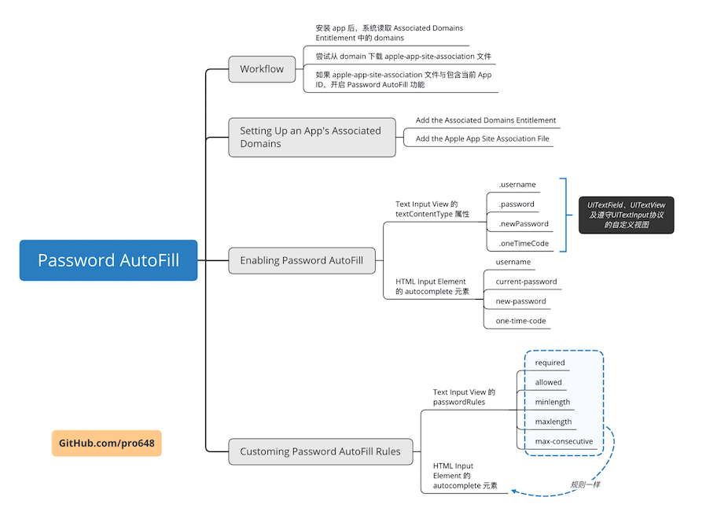

这篇文章将介绍密码自动填充（Password AutoFill）如何与 iOS 和网页应用交互。

## 1. Password AutoFill 工作流程

密码自动填充功能在以下几个事件与 app 配合使用：

- 用户首次安装 app，如已在 Safari 保存密码，可以直接点击 QuickType bar 账号信息登陆。
- 用户注册账号时，自动生成强密码，注册成功后保存到 iCloud Keychain。
- 输入短信验证码时，点击 QuickType bar 直接输入。

在 iOS 系统安装 app 后，系统会尝试将 app 与 Associated Domains Entitlement 文件列出的域名进行关联。

1. 系统获取 Associated Domains Entitlement 中每个域名。
2. 尝试下载每个域名中 Apple App Site Association 文件（apple-app-site-associatio）。
3. 如果上述步骤均成功，系统会将 app 与域名进行关联，并为该域的凭据（credential）开启 Password AutoFill 功能。

## 2. 设置 app、域名相互关联

使用关联域名（associated doumains）可以让你的 app 和网站共享共享凭据（credentials）。

一个域名是一个网站。有时可能会想让 app 和网站关联起来，因为网站和 app 可能有不同版本的内容，或其间想要共享数据。想要让 app 和网站关联起来，需要在网站放一个名称为*apple-app-site-association*文件，在 app 上添加一个 entitlement。

> 除共享 credentials 外，通用链接（universal link）、Handoff也需要用到 associated domains entitlement。

在开始这篇文章前，先下载[BasicDemos-iOS/PasswordAutoFill模版](https://github.com/pro648/BasicDemos-iOS/tree/master/PasswordAutoFill模版) ，在 Xcode 打开 PasswordAutofill.xcodeproj文件，并在真机运行。如下：

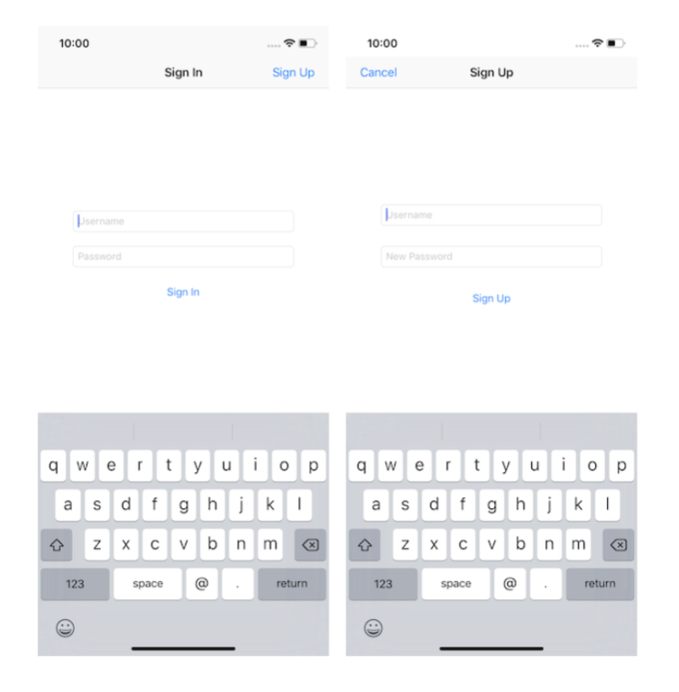

在 Login In 页面点击 Sign Up 按钮，在注册页面输入用户名、密码，点击 Sign Up 按钮，会出现错误提示。目前，app 后端还没有建立，无法注册、登陆。

在上面下载的文件中，[PasswordAutoFill-Server](https://github.com/pro648/BasicDemos-iOS/tree/master/PasswordAutoFill%E6%A8%A1%E7%89%88/PasswordAutoFill-Server)文件包含了 server app。这篇文章中，我们将把服务器部署在 Heroku，Heroku 提供了一种简单、免费的解决方案。如果你还没有 Heroku 账号，点击<https://signup.heroku.com/>注册即可。

#### 2.1 创建 Heroku App

注册账号后，访问<https://dashboard.heroku.com>并登陆。

点击右上角的 *New* 按钮，选择 *Create new app*。在下一个页面中，填写 app 名称，选择部署地区。如果不填写 app 名称，系统会自动生成。最后点击 *Create app* 按钮。

创建完成后，会进入 app 主页。选择 *Resources* 选项卡，在 *Add-ons* 部分，输入 postgre，选择 *Heroku Postgres* 选项：

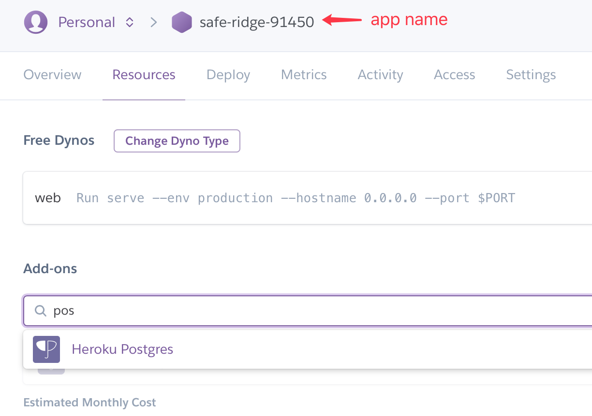

点击 *Heroku Postgres* 后会进入选择 database 类型页面，选择 *Hobby Dev - Free*，点击 *Provision* 按钮，Heroku 会自动进行创建工作。

完成后，数据库将显示在 *Resources* 选项卡下，表示 Web app 已经创建完成。

#### 2.2 App Identifier

描述文件（provisioning profile）使用 App ID 标志你的 app，App ID 由两部分组成，前缀是 Team ID，后缀是 Bundle ID，中间由句号 . 隔开。App ID中可以包含多个句号，每一部分都有重要用途。

App ID 有以下两种类型：

- 显式 App ID (explicit App ID)：用于单个 app。
- 通配符 App ID (wildcard App ID)：用于一组 app。

App 想要使用的服务都必须在 App ID 开启。可以在创建 App ID 时启用所需服务，也可以在之后修改。在 explicit App ID 中，Game Center 和 In-App Purchase 服务默认开启。

> 截止到 Xcode 10.1，Wildcard App ID 只能使用 Data Protection、iCloud、Inter-App Audio、Network Extensions、SiriKit、Wallet六项服务。Explicit App ID 可以使用所有服务。

要使用 Password AutoFill 功能，需要开启 Associated Domains 服务，因此只能使用 explicit App ID。既可以在 <https://developer.apple.com/account/ios/identifier/bundle/create> 创建 App ID ，也可以在 Xcode > General > Signing 部分选择 Team 直接创建。

在 https://developer.apple.com/account/ios/identifier/bundle 点击 app 名称，查看 Team ID 和 Bundle ID：

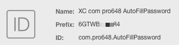

#### 2.3 添加 Apple App Site Association 文件

接下来，添加`apple-app-site-association`文件到你的网站。

创建一个名称为`apple-app-site-association`（没有扩展名）的文件，文件内容是 JSON 格式的词典。词典内容是网站想要关联应用的 app ID。如下所示：

```
{
    "webcredentials": {
        "apps": [
            "D3KQX62K1A.com.example.pro648",
            "D3KQX62K1A.com.example.pro648Demo"
        ]
    }
}
```

App Identifiers 格式如下：

```
<Team Identifier>.<Bundle Identifier>
```

将该文件放到网站的 .well-known 目录，或根目录， Apple 推荐放到 .well-known目录。如果放到 .well-known 目录，文件的 URL 格式如下：

```
https://<full qualified domain>/.well-knwon/apple-app-site-association
```

必须使用`https://`托管该文件，且证书在有效期内，同时不能使用重定向。

打开 Terminal，`cd`到 *PasswordAutoFill模版/PasswordAutoFill-Server* 目录。例如，如果将 *BasicDemos-iOS*文件仓库克隆到了桌面，你可以输入:

```
$ cd ~/Desktop/BasicDemos-iOS/PasswordAutoFill模版/PasswordAutoFill-Server
```

在 *PasswordAutoFill-Server* 内，创建 *Public* 目录，在 *Public*目录创建 *.well-known* 目录：

```
$ mkdir -p Public/.well-known/
```

继续输入如下命令：

```
$ echo '{"webcredentials": {"apps": ["<#Team ID#>.<#Bundle ID#>"]}}' > Public/.well-known/apple-app-site-association
```

> 使用你的 Team ID、Bundle ID 替换上述命令中  Team ID、Bundle ID。

进入 Finder，打开 *PasswordAutoFill-Server/Public/.well-known/apple-app-site-association* 文件，可以看到上述命令输入的 JSON 内容。如果不显示 *.well-known* 文件，使用 command+shift+. 显示隐藏文件夹。

#### 2.4 设置 Heroku CLI

已经设置好了 App ID，现在需要把 apple-app-site-association 上传到 web app。我们将使用 Heroku CLI 工具上传这些文件。

需要使用 Homebrew 安装 Heroku CLI。如果你的电脑没有安装 Homebrew，在 Terminal 输入如下命令：

```
$ /usr/bin/ruby -e "$(curl -fsSL https://raw.githubusercontent.com/Homebrew/install/master/install)"
```

如果需要更新 Homebrew ，输入如下命令：

```
$ brew update
```

使用 Homebrew 安装 Heroku CLI：

```
$ brew install heroku/brew/heroku
```

安装 Heroku CLI后，使用如下命令登陆 Heroku 账号：

```
$ heroku login
```

> 上述命令会在浏览器打开登陆页面。

登陆后可以使用如下命令确认是否登陆成功：

```
$ heroku auth:whoami
```

上述命令会返回登陆邮件信息。

#### 2.5 部署 Server App

Heroku 通过 Git 部署 server app，因此需要将 server app 放到 git 仓库。

继续在 Terminal 操作，输入如下命令：

```
$ git int
$ git add .
$ git commit -m "Vapor Server"
$ heroku git:remote -a <Heroku app name>
```

通过上述命令，已经把 server app 添加到本地 git repository。

> 因为 BasicDemos-iOS 已经是一个 git 仓库，如果你在该仓库中继续创建 git 仓库，会涉及到 git 仓库嵌套。如果你对嵌套 git 仓库不熟悉，可以把 server app 放到其他位置再创建 git 仓库。
>
> 如果你对 git 还不熟悉，可以查看我的另一篇文章：[教你系统学习Git](https://github.com/pro648/tips/wiki/%E6%95%99%E4%BD%A0%E7%B3%BB%E7%BB%9F%E5%AD%A6%E4%B9%A0Git)。

Heroku 使用 *Buildpack* 为 app 提供了构建方法。在 Terminal 输入如下命令为 app 设置 *Buildpack*：

```
$ heroku buildpacks:set https://github.com/vapor-community/heroku-buildpack
```

使用如下命令将 app 部署到 Heroku：

```
$ git push heroku master
```

上述命令会将本地 *master* 分支推送至 Heroku 远程仓库，整个过程可能持续几分钟。

> 如果 Heroku 当前部署堆栈版本与社区 buildpack 不兼容，会导致推送失败。错误消息将告诉你错误原因及解决方案。例如，错误提示可能会告诉你执行如下命令：
>
> ```
> $ heroku stack:set heroku-16 -a <your-application-name>
> ```
>
> 根据错误提示进行操作，最后再次 `push` 即可。

Heroku 通常会在完成构建后自动启动 app。但也可以使用如下命令手动启动 app：

```
$ heroku ps:scale web=1
```

要打开 web app，输入如下命令：

```
$ heroku open
```

也可以在 Heroku dashboard 的 Settings > Domains and certificates 部分查看 web app URL：

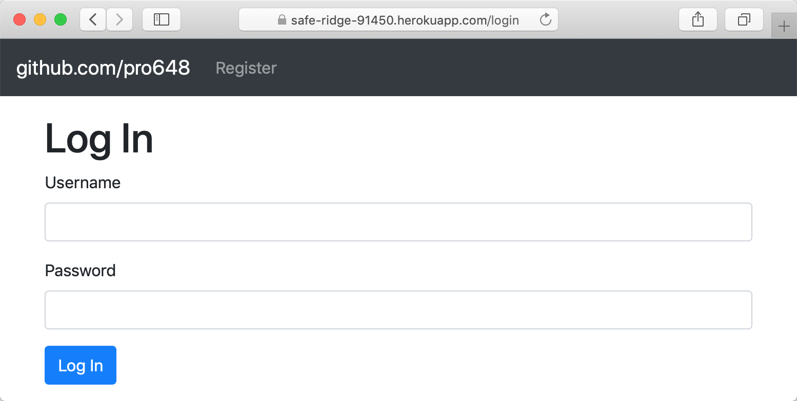

目前为止，你已拥有该网站。该网站提供的 apple-app-site-association 文件用于识别你的 app，也就是网站已经关联你的 app。你可以在 *https://[your-domain]/.well-known/apple-app-site-association* 查看该文件。

#### 2.6 添加 associated domains entitlement

现在配置 iOS app 识别你的网站，以完成相互关联。

在 Xcode 打开PasswordAutoFill，选取 target，打开 General 选项卡，确保 Bundle Identifier、Team 与 *apple-app-site-association* 中的一致。

选择 Capabilities 选项卡，找到 *Associated Domains* 选项并打开，点击 *+* 添加 Heroku app 域名：

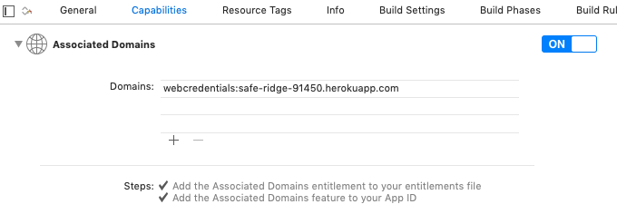

如果 App ID 的 Capabilities 设置正确，下面会出现两个对号标记。分别表示：

- 已为 app 添加 Associated Domains entitlement。
- 已为 App ID 开启 Associated Domains 功能。

Domains 前缀为服务名称，后缀为域名。其中，共享凭据（Shared web credentials）服务的前缀是`webcredentials`，通用链接（universal links）服务的前缀是`applinks`，Handoff服务前缀是`activitycontinuation`。格式如下：

```
// Shared web credentials
webcredentials:[your-domain]

// Universal links
applinks:[your-domain]

// Handoff
activitycontinuation:[your-domain]
```

现在，可以在 project navigator 看到 PasswordAutofill.entitlements 文件，Entitlements 文件以属性列表的格式包含了刚才输入的网址：

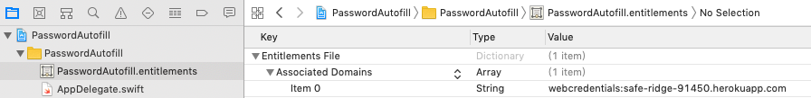

> iOS 和 macOS 使用 Entitlements 授予 app 特定功能或安全权限。通过设置 entitlement 值，可以开启 iCloud、[push notifications](https://github.com/pro648/tips/wiki/UserNotifications%E6%A1%86%E6%9E%B6%E8%AF%A6%E8%A7%A3)、Apple Pay 等功能。

现在，已经将 app 与网站关联起来了。

## 3. 为 Text Input View 开启密码自动填充

当用户选择了支持 Password AutoFill 功能的输入视图或 HTML 输入元素时，密码自动填充功能会将 QuickType bar 显示在键盘上方，并根据输入视图类型显示对应选项。

iOS 10.0 中增加的`textContentType`指示文本输入区域期望的文本类型。例如，`emailAddress`表示期望输入邮箱地址。当为文本输入区域提供这一信息后，系统有时会自动选择对应类型键盘、改善键盘校正，或实现其他功能。

每个 text-entry area 应尽可能的精准，因此不能为一个`textContentTyep`属性组合多个值。为了让 text input view 显示正确自动填充建议，需要为每个文本输入视图设置正确的`textContentType`属性。这篇文章将用到以下常量：

- `username`：iOS 11.0 中增加，期望输入账户名。
- `password`：iOS 11.0 中增加，期望输入密码。
- `newPassword`：iOS 12.0 中增加，期望输入新密码。
- `oneTimeCode`：iOS 12.0 中增加，期望输入短信验证码。

如果未标记输入类型，系统会使用启发式（heuristics）算法自动识别视图类型。显式声明视图`textContentType`，可以提高密码自动填充表现。例如：heuristics 默认用户名、密码在同一个页面。如果用户名、密码分布在多个页面，显式声明输入内容类型才可以让自动填充正确识别。

密码自动填充支持输入视图、HTML 输入元素。

打开 Xcode 中的`API.swift`文件，找到26行中的如下代码：

```
    static let baseURL = URL(string: "https://[your-domain]")
```

使用你的 Heroku app name 替换上面的`[your-domain]`。

> Heroku 域名格式为：`[your-app-name].herokuapp.com`，如：https://safe-ridge-91450.herokuapp.com/ 。

`API.swift`包含了与你的 server 通信的 API，例如：注册、登陆、修改密码、退出和随机返回名人名言。这些 API 都已集成到模板中，替换域名后，身份验证应正常工作。

#### 3.1 New Paswords

App 和 网站双向关联后，系统会为`textContentType`为`newPassword`的 text-entry area 自动创建强密码，

下面，将在代码中实现 strong password generation。进入`SignupViewController.swift`文件，更新如下：

```
    override func viewWillAppear(_ animated: Bool) {
        ...
        
        usernameField.textContentType = .username
        passwordField.textContentType = .newPassword
    }
```

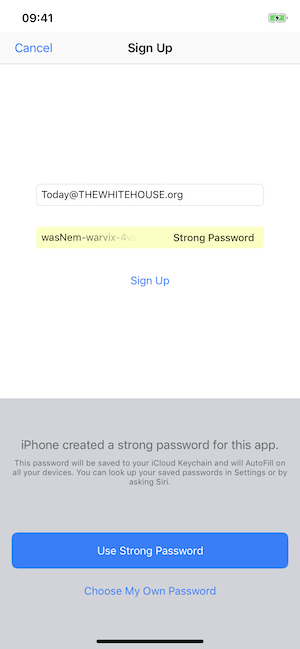

#### 3.2 User Names and Passwords

iOS 设备上保存至少一个密码，且开启密码自动填充时，QuickType Bar 才会出现。点击 Key 标志用户可以查看、选择设备上已有账号、密码，QuickType Bar 上会显示 app associated domains 账号信息。

进入`LoginViewController.swift`，更新如下：

```
    override func viewWillAppear(_ animated: Bool) {
        ...
        
        usernameField.textContentType = .username
        passwordField.textContentType = .password
    }
```

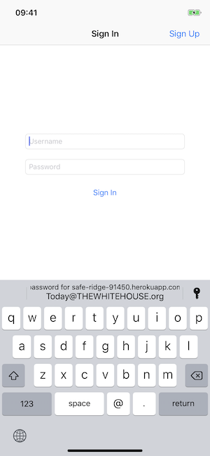

使用 Password AutoFill 生成的密码会自动添加到 Keychain，使用 iCloud 在设备间同步。手动输入的账号、密码会提示是否保存到 Keychain ：


想要让 iOS 系统识别出新的 credentials ，需要做到以下两点：

- 登陆成功后，将账号、密码文本框从视图层级移除。
- 只有当账号、密码文本框不在视图层级中时，才清空其内容。

由于，app dismiss 了登陆视图控制器，其自动满足了上述条件，但登陆失败时不要保存密码。

打开`SignupViewController.swift`文件，滑动到`viewWillDisappear(_:)`方法，更新如下：

```
    override func viewWillDisappear(_ animated: Bool) {
        super.viewWillDisappear(true)
        
        view.endEditing(true)
        if API.token == nil {
            usernameField.text = nil
            passwordField.text = nil
        } else {
            API.logout()
        }
    }
```

当登陆成功后，服务器会返回 token，`API.swift` 类保存该变量到`API.token`。如果`API.token`为`nil`，则登陆失败。这种情况下，在视图消失前，将`usernameField`和`passwordField`设置为`nil`，防止无效的密码保存到 keychain。

如果`API.token`不为`nil`，则为登陆成功。iOS 会自动保存 credentials 到用户 keychain。

#### 3.3 Security Code

如果系统可以识别出短信验证码，验证码会自动显示在QuickType bar上，最多显示三分钟。如果想要查看短信验证码在各种语言下是否可以正确识别，可以直接使用 Message 发送给自己。如果验证码有下划线，点击后出现「拷贝验证码」的提示，则系统可以识别该验证码。

进入`OneTimeCodeViewController.swift`文件，更新如下：

```
        override func viewWillAppear(_ animated: Bool) {
        ...
        
        oneTimeCodeField.textContentType = .oneTimeCode
    }
```

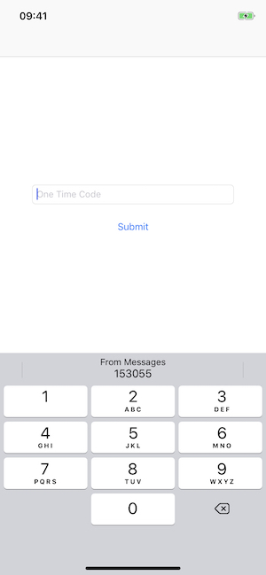

> 如果 app 使用自定义输入视图输入验证码，iOS 无法呈现 AutoFill UI，也就无法显示 one time code。

#### 3.4 点击 AutoFill Item

当用户点击 QuickType bar时，系统会要求其使用 Face ID 或 Touch ID 进行验证。当 Face ID 或 Touch ID 出现时，app 将进入 inactive 状态，触发 app delegate 的`applicationWillResignActive(_:)`和`applicationDidBecomeActive(_:)`方法。

在触发上述方法时，不要移除用户界面，否则系统将无法自动填充账号信息。

> 当 app 进入 inactive 状态时，有时需要隐藏敏感信息。但登陆前 app 不包含敏感信息，也就没有必要进行隐藏。

用户授权成功后，系统会将 first responder 设置为要自动填充的视图，即使 app 阻止修改 first responder。随后，自动填充对应视图。

文本内容变化后会发送通知。可以使用这些通知验证信息、更新用户界面。例如，用户名、密码不为空时启用登陆按钮。

对于 iOS apps，视图内容变化后系统会发送`textDidChangeNotification`通知。此外，还会根据视图类型，调用以下委托方法：

- `UITextField`：系统调用`UITextFieldDelegate`协议的`textField(_:shouldChangeCharactersIn:replacementString:)`方法。
- `UITextView`：系统调用`UITextViewDelegate`协议的`textView(_: shouldChangeTextIn:replacementText:)`方法。
- 遵守`UITextInput`协议的自定义视图：系统调用`UIKeyInput`协议中的`insertText(_:)`方法或`replace(_:withText:)`方法。

## 4. 为 HTML Input Element 开启密码自动填充

要确保 HTML input element 显示正确的自动填充建议，需要为输入元素设置`autocomplete`属性。

使用如下`autocomplete`属性：

| Credential    | Autocomplete Values |
| ------------- | ------------------- |
| User Name     | username            |
| Password      | current-password    |
| New Password  | new-password        |
| One-Time Code | one-time-code       |

与 text input view 一样，显式设置`autocomplete`属性可以确保 input element 被正确识别。

默认情况下，系统根据 input element autocomplete 值选择键盘类型，但可以通过组合设置输入元素 type 和 autocomplete 值来指定期望键盘类型。例如：如果用户名为邮件，设置 autocomplete 属性为 username，设置 type 属性为 email。如下：

```
      <input type="email" autocomplete="username" name="username" class="form-control" id="username"/>
      <input type="password" autocomplete="current-password" name="password" class="form-control" id="password"/>
```

当创建账号或修改密码时，使用`new-password`属性：

```
      <input type="password" autocomplete="current-password" name="oldPassword" class="form-control" id="oldPassword"/>
      <input type="password" autocomplete="new-password" minlength="10" passwordrules="required:upper; required:lower; required:digit; max-consecutive:2" name="newPassword" class="form-control" id="newPassword"/>
```

此外，还可以自动填充短信验证码：

```
<input id="single-factor-code-text-field" autocomplete="one-time-code"/>
```

## 5. 自定义密码规则

虽然Password AutoFill 自动生成的密码非常强大，但 app 有时需要指定自己的密码规则，以便符合其他要求。

要自定义密码规则，请使用`UITextInputTraits`协议中的`passwordRules`属性，或网页中 HTML input 元素中的`passwordrules`属性。密码规则必须符合如下格式：

```
required: (<identifier> | <character-class>), ..., (<identifier> | <character-class>); allowed: (<identifier> | <character-class>), ..., (<identifier> | <character-class>); max-consecutive: <non-negative-integer>
```

使用这些关键字指定规则：

- `required`或`allowed`：`required`表示所有密码必须都包含这些字符；`allowed`表示允许使用的字符。如果没有使用`allowed`，则只使用`requred`字符；如果没有使用`requred`，则只使用`allowed`字符；如果使用了两者，则所有`allowed`和`requred`字符均可使用；如果都没有使用，则所有 ASCII 可输出字符都可使用。
- Character Classes：upper表示 A-Z，lower 表示 a-z，digit 表示 0-9，special 表示 -~!@#$%^&*_+=`|(){}[:;"'<>,.? ] 和空格，ascii-printable 表示所有 ASCII 可输出字符，unicode 表示所有 unicode 字符。
- Maximum Length Key：使用`max-consecutive`限制密码中字符最多可以连续出现次数。如果规则中出现多次`max-consecutive`，则以最少的为准。使用`minlength`、`maxlength`限制密码长度。
- Custom Character Class：自定义字符类，使用方括号包围。例如：[abcd] 只允许"a"、“b"、"c"、"d"。
- Non-negative Integer Class：<non-negative-integer> 为非负整数。

如果没有设置`passwordRules`属性，则使用默认规则。即允许所有 ASCII 可输出字符，如下：

```
allowed:ascii-printable;
```

可以组合关键字来设置密码规则。如果有两个密码框，只需要为一个设置密码规则。

> 密码的长度不能少于12，且允许使用的字符至少包含以下两类：ASCII 大写字母、ASCII小写字母和数字。如果你的密码规则不符合上述要求，则会被忽略。

如果密码规则为：至少10位，包含大写、小写、数字，最多连续两位相同字符。可以为 HTML 添加以下标记：

```
<input type="password" minlength="10" passwordrules="required:upper; required:lower; requried:digit; max-consecutive:2">
```

如果`UITextField`密码规则为：字母、数字、特殊符号随意组合：

```
let newPasswordTextField = UITextField()
newPasswordTextField.passwordRules = UITextInputPasswordRules(descriptor:"allowed: uppper, lower, digit, [-().&@?’#,/&quot;+]; minlength: 8;")
```

使用多个 character classes 等价于单独指定一个集合所有 character classes 的容器类，但`required`例外:

```
allowed:upper; allowed:lower <=> allowed: upper, lower
required:upper; required: lower <=> required: upper; required:lower
```

Apple 提供了 [Password Rules Validation Tool](https://developer.apple.com/password-rules/) 来检查生成的密码是否符合 app 要求，也可以使用该工具创建自定义规则。

## 6. 调试 Associated Domains

在 iOS 设备安装你的 app 后，系统会从 entitlement 文件获取域名列表，并下载`apple-app-site-association`文件。对于每个 domain，iOS 拼接 /apple-app-site-association 或 /.well-known/apple-app-site-association 到域名，并从该 URL 下载文件，查看文件内容是否包含 App ID。

> 如果网站使用不同的子域（例如，example.com、www.example.com、support.example.com），需要在`Associated Domains Entitlement`文件单独列出每个子域，每个子域都要包含 apple-app-site-association 文件。

出现以下情况时关联会失败：

- JSON 文件无效，或不包含当前 App ID。
- 服务器返回错误代码为 300 - 499，即包含重定向。

如果 server 返回错误代码 500-599，即文件暂时不可访问。系统会三小时后再次尝试，最多尝试八次。在开发过程中，可以通过删除 app 让修改的 association file 立即生效。

如果下载 app 后关联失败，可以通过 macOS 上的 *控制台 console* 查看具体原因。打开 *console* ，在左上角选择设备名称，运行 demo，在控制台搜索栏输入SWCD，可以查看关联失败原因。

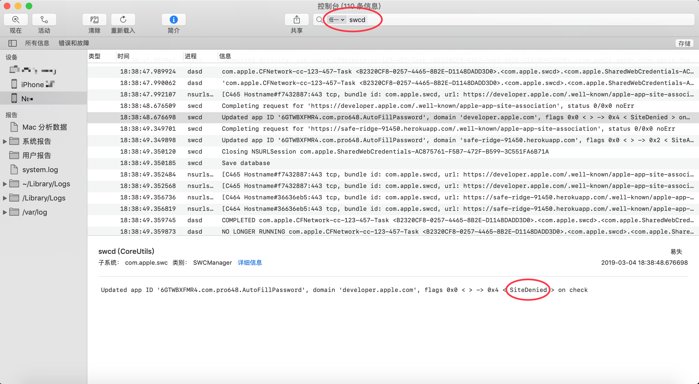

可以看到尝试关联 developer.apple.com 失败，原因在于其 apple-app-site-association 文件没有包含该 app ID。

Demo名称：PasswordAutoFill  
源码地址：<https://github.com/pro648/BasicDemos-iOS/tree/master/PasswordAutoFill>

参考资料：

1. [iOS 12 Password Tools: Improving User Security and Experience](https://www.raywenderlich.com/7162-ios-12-password-tools-improving-user-security-and-experience)
2. [Password AutoFill](https://developer.apple.com/documentation/security/password_autofill/)
3. [Introducing Password AutoFill for Apps](https://developer.apple.com/videos/play/wwdc2017/206)