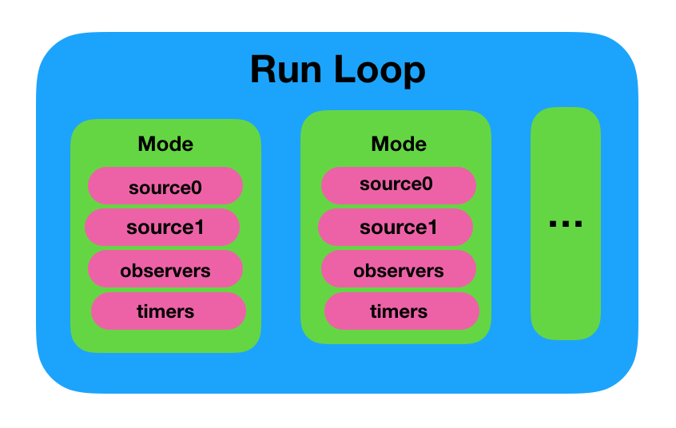
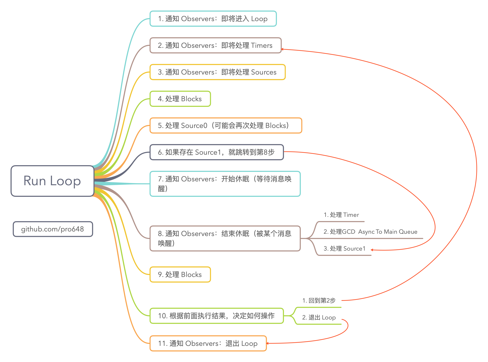
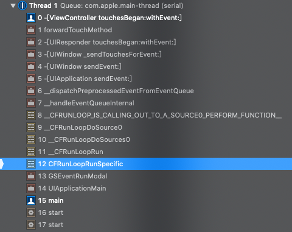

一个线程一次只能执行一个任务，执行完毕后就会退出。如果需要一个机制，让线程能随时处理事件，处理完毕后并不退出，代码逻辑是这样的：

```
function main
    initialize()
    while message != quit
        message := get_next_message()
        process_message(message)
    end while
end function
```

这种模型通常被称为[Event Loop](https://en.wikipedia.org/wiki/Event_loop)，Event loop 在很多系统和框架都有实现。例如：Node.js 的事件处理，Windows 程序的消息循环，macOS、iOS 的 Run Loop。这种模型的关键在于：如何管理事件/消息，如何让线程没有消息处理时休眠、有消息到来时立即被唤醒。这一篇文章将介绍 run loop。

## 1. 什么是 Run Loop

运行循环（Run Loop）是与线程相关的基础功能，用于计划工作和协调接收传入的事件。Run loop 的目的在于有工作时让线程忙碌，没有工作时让线程休眠。

Run loop 并非完全自动管理。你必须设计线程代码，以便在合适的时机开启 run loop，并响应传入事件。Cocoa、Cocoa Touch、Core Foundation 均提供了 run loop 对象，以便配置、管理线程的 run loop。辅助线程（secondary thread）需要显式启动 run loop。App 启动过程中，应用程序框架会自动在主线程上设置并启动 run loop。

macOS、iOS 系统中提供了两个这样的对象：`NSRunLoop`和`CFRunLoopRef`。

- `CFRunLoopRef`是 Core Foundation 框架内的，提供了纯 C 函数的 API，所有这些 API 都是线程安全的。
- `NSRunLoop`是基于`CFRunLoopRef`的封装，提供了面向对象的 API，但这些 API 不是线程安全的。

[Core Foundation](https://opensource.apple.com/tarballs/CF/)的源码是开源的，在这里可以看到[CFRunLoopRef](https://opensource.apple.com/source/CF/CF-855.17/CFRunLoop.c)的代码。此外，Apple 还开源了一个 swift 版本的[Foundation Project](https://github.com/apple/swift-corelibs-foundation/)。

## 2. 何时使用 Run Loop

只有在创建辅助线程时，才需要显式启动 run loop。app 启动过程中主线程会自动启动 run loop。即使用 Xcode 提供的模版创建 app，无需为主线程显式启动 run loop。

Run loop 用于需要与线程交互的情况。对于辅助线程，根据需要配置、启动 run loop，但并非所有线程都需要使用 run loop。例如，执行一些长时间运行的固定任务，则无需启动 run loop。如有以下需求，则需要启动 run loop：

- 使用端口或自定义 input source 与其他线程通讯。
- 在线程上使用计时器。
- 使用任一 performSelector 方法。
- 线程需要定期执行任务。

Run loop 的配置和启动也很简单，但需要在某些条件下退出 run loop。最好清理所有工作后退出 run loop，而非强制终止线程。

## 3. Run Loop 的组成

运行循环的用途就像其名字，其是线程进入的一个循环，用于响应传入事件、运行事件处理程序。在代码中需提供运行循环控制语句，即`while`或`for`循环。在循环内，使用运行循环对象处理事件接收、调用已安装的处理程序。

Run loop 从两种不同的源（source）接收事件：

- 输入源（Input source）：异步传递事件，通常是从其他线程、app 发送的消息。
- 计时器源（Timer source）：同步传递事件，这些事件在计划的时间、间隔触发。

两种类型的源都使用特定应用程序的处理程序来处理到达的事件。

下图显示了 run loop 和 source 的结构。Input source 传递异步事件到对应处理程序，并退出`runUntilDate:`方法。Timer source 传递事件到对应处理程序，但不会退出 run loop。

> `runUntilDate:`方法在指定时间到达前会保持 run loop 处于运行状态，run loop 运行时会处理 input source 的各种事件。


除处理 input source 传递的任务，run loop 还会发送其当前状态的通知。注册观察 run loop 状态变化，可以在状态变化时进行额外工作。使用 Core Foundation 的`CFRunLoopObserverCreate()`或`CFRunLoopObserverCreateWithHandler()`方法创建观察者，`CFRunLoopAddObserver()`方法添加观察者，最后使用`CFRelease()`释放observer。

#### 3.1 Run Loop Mode

Run loop mode 集合包含了要监控的 input source、timer，以及要通知的 observer。每次启动 run loop 时需要显式或隐式指定其运行的 mode。在运行期间，仅监视与该 mode 关联的 source，且只允许与该 mode 关联的 source 传递事件，同时 run loop 的进度也只通知与该 mode 关联的 observer。与其他 mode 关联的 source 持有事件，直到运行其 mode。

一个 run loop 包含若干个 mode，每个 mode 包含若干个 source、timer、observer。每次调用 run loop 函数时，只能指定一个 mode，这个 mode 被称作 currentMode。如果需要切换 mode，需退出 lool，重新进入要切换的 mode。这样做可以隔离不同组 source、timer、observer，让其互不影响。



在代码中，可以通过名称识别 mode。Cocoa、Cocoa Touch、Core Foundation 均提供了 default mode 和常用 mode，也可以通过为 mode 名称指定自定义字符串来创建自定义 mode。虽然 mode 名称可以任意指定，但 mode 内容不是任意的，必须提供 input source、timer、observer 中的一个或多个。

Mode 可用于过滤不需要的 source。大部分情况下，使用系统定义的 default mode 即可。`UIScrollView`滑动时主线程会进入`UITrackingRunLoopMode`。此时，只有与`UITrackingRunLoopMode`关联的 mode 可以向主线程传递事件。对于辅助线程，可以使用自定义 mode 来防止低优先级 source 在时间紧迫的操作期间传递事件。

> Mode 根据 source 区分事件，而非事件类型。例如，不会使用仅识别鼠标按下、敲击键盘事件的 mode。但可以使用 mode 监听一组端口，暂时暂停计时器，或者更改当前监视的 source、observer。

| Mode         | 函数名                                            | 描述                                                         |
| ------------ | ------------------------------------------------- | ------------------------------------------------------------ |
| Default      | `NSDefaultRunLoopMode`<br>`kCFRunLoopDefaultMode` | 最为常用的 mode。大部分情况下，使用此 mode 配置 run loop 即可。 |
| Tracking     | `UITrackingRunLoopMode`                           | `UIScrollView`滑动时，处于`UITrackingRunLoopMode`。          |
| Common modes | `NSRunLoopCommonModes`<br>`kCFRunLoopCommonModes` | 使用 common modes 做为模式添加到 run loop 的对象，会受 common modes 所有 mode 的监视。Default mode 和 tracking mode 均将自身标记为 commond modes。 |

Apple 公开提供的 mode 只有两个：`kCFRunLoopDefaultMode`（`NSDefaultRunLoopMode`）和`UITrackingRunLoopMode`。

> Source、timer、observer 可以在多个 mode 注册，但只有 run loop 运行在该 mode 时才会执行任务。Run loop 任一时间只能在一个 mode 运行，common modes 是一个集合、不是一个 mode。因此，run loop 不会运行在 common modes。当 mode 添加到 common modes 后，无法移除。

在[这里](https://iphonedevwiki.net/index.php/CFRunLoop)可以看到 Apple 内部使用的 mode。

#### 3.2 Input Source

Input source 异步将事件传递到线程。Input source 一般分为以下两种类型：

- 基于端口 Port-based input source：负责监控应用的 Mach port。
- 自定义输入源：监控自定义输入源。

Run loop 并不关心输入源是哪种类型。系统一般实现了上述两种 input source，其区别在于信号发送方式。Port-based source 由内核自动发送，custom source 需由其他线程手动发送。

创建 input source 时，可以将其分配给一种或多种 mode。mode 决定任一时刻监控哪些输入源。通常，在 default mode 运行 run loop，但也可以指定自定义 mode。如果 input source 不在当前监控的 mode，其产生的事件将被保留，等 run loop 在该 mode 运行时才传递。

###### 3.2.1 Port-Based Source

Cocoa、Cocoa Touch、Core Foundation 内置支持使用 port-related 对象和函数创建 port-based input source。

在 Cocoa、Cocoa Touch 中，无需直接创建 input source。只需创建`NSPort`对象，并添加到 run loop。port 对象会自动创建、配置 input source。在 Core Foundation 中，必须手动创建 port 和 run loop source。这两种方式都是使用对端口不透明函数（例如，`CFMachPortRef`、`CFMessagePortRef`、`CFSocketRef`）创建所需对象。

###### 3.2.2 Custom Input Source

要创建自定义输入源，需在 Core Foundation 中使用与`CFRunLoopSourceRef`不透明类型关联的函数，使用回调函数配置 custom input source。Core Foundation 会在不同时机调用不同函数，配置 source、处理事件、销毁 source 等。

除定义 custom input source  事件到达时的行为，还需定义事件传递机制。这一部分在单独线程运行，负责为 input source 提供数据，并在数据准备好时向其发出信号。事件传递机制由你决定，但不要太过复杂。

###### 3.2.3 Perform Selector Source

除基于端口的 source，系统还定义了 custom input source，以便在任何线程上执行 selector。与 port-based source 类似，selector 也在目标线程顺序执行，从而减少在一个线程执行多个函数的同步问题。perform selector source 执行完毕后会自动从 run loop 移出，这一点与 port-based source 不同。

在其他线程执行 selector 时，目标线程必须具有活跃的 run loop。如果是自己创建的线程，则需先显式启动 run loop。在调用`applicationDidFinishLaunching:`方法时，主线程已经启动 run loop，此时可以向主线程转发调用。Run loop 一次循环会处理队列中的所有 selector，而非一次循环执行一个 selector。

下面列出了`NSObject`在其他线程执行 selector 的方法。因为这些方法在`NSObject`中，可以在 Objective-C 任意线程、任意对象中使用，包括 POSIX thread。这些方法不会创建新线程执行 selector。

1. `performSelectorOnMainThread:withObject:waitUntilDone:`使用 default mode 在主线程下一个 run loop 调用 selector。 wait 参数决定在执行完 selector 前，是否堵塞当前线程。YES表示堵塞当前线程，NO会立即返回。如果当前线程为主线程，且 wait 参数为YES，selector 会立即执行。在同一线程多次调用同一方法，selector 会被加入到队列中，并按加入顺序执行。

2. `performSelectorOnMainThread:withObject:waitUntilDone:modes:`使用指定 mode 在主线程下一个 run loop 调用 selector。如果多个 selector 的 mode 不同，则只执行与当前 run loop mode 匹配的 selector，其他 selector 必须等到 run loop 切换到与其匹配的 mode 时才会执行。modes 数组至少包含一个字符串，如果 modes 数组为 nil 或空，该方法立即返回且不执行 selector。

3. `performSelector:onThread:withObject:waitUntilDone:`在指定线程 default mode 调用 selector。如果当前线程和目标线程相同，wait 参数为YES，则立即执行 selector；wait 参数为NO，则将消息添加到线程 run loop 队列（这一点与当前线程、目标线程不同时一样）。目标线程后续从队列取出并处理消息。

4. `performSelector:onThread:withObject:waitUntilDone:modes:`在指定线程指定 mode 调用 selector。其与`performSelector:onThread:withObject:waitUntilDone:`不同之处在于可以指定 mode。

5. `performSelector:withObject:afterDelay:`延迟一定时间后，使用 default mode 在当前线程上调用 selector。将 delay 指定为0并不会导致 selector 立即执行，而是将 selector 添加到当前线程的 run loop，并尽快执行。

   该方法在当前线程上设置计时器，计时器使用 default mode 配置。当计时器触发时，线程尝试从 run loop 队列出队消息并执行。如果 run loop 正在运行，且处于 default mode，成功执行；反之，计时器等待 run loop 进入 default mode。

6. `performSelector:withObject:afterDelay:inModes:`延迟一定时间后，使用指定 mode 在当前线程调用 selector。其与`performSelector:withObject:afterDelay:`不同之处在于可以指定 mode。

7. `cancelPreviousPerformRequestsWithTarget:`和`cancelPreviousPerformRequestsWithTarget:selector:object:`方法用于取消5、6两种方法提交的任务。该方法只取消当前 run loop 的请求，不是所有 run loop 的请求。

> Source 有两个版本，Source0 和 Source1。Source1 基于 port 通信，用于捕捉系统事件。例如，点击屏幕。Source0 只包含一个回调，用于处理事件。performSelector 系列方法调用的 Source0 处理任务。

#### 3.3 Timer Source

Timer source 在预设时间将事件同步传递到线程。Timer 是线程通知自己执行任务的一种方式。例如，用户在搜索框键入字符时，使用计时器间隔指定时间搜索一次，以便用户输入更多文字，也可以提高性能。

尽管 Timer 会产生基于时间的通知，但它不是实时的机制。与 input source 一样，timer 也与 run loop mode 关联。如果计时器触发时，run loop 正在执行其他回调，计时器会等待 run loop 执行其回调；如果 run loop 未运行，timer 永不触发。

计时器可以配置为一次性或重复生成事件。重复计时器会根据计划的触发时间，而非实际触发时间，自动重新计划自身。例如，计时器计划在指定时间触发，并每5秒触发一次，则触发时间永远会落在原始时间的5秒间隔上。如果触发时间被延误很多，导致缺少一个或多个触发时间，计时器将在错过的时间段内仅触发一次。此后，计时器将重新计划下一个计划的触发时间。

#### 3.4 Run Loop Observer

Run loop 在特定时刻发送状态变化通知。通过监听状态变化，可以在线程执行任务、进入睡眠之前进行准备。Run loop 可观察时间点有以下几个：

```
/* Run Loop Observer Activities */
typedef CF_OPTIONS(CFOptionFlags, CFRunLoopActivity) {
    kCFRunLoopEntry = (1UL << 0),           // 即将进入 loop
    kCFRunLoopBeforeTimers = (1UL << 1),    // 即将处理 Timer
    kCFRunLoopBeforeSources = (1UL << 2),   // 即将处理 Source
    kCFRunLoopBeforeWaiting = (1UL << 5),   // 即将进入休眠
    kCFRunLoopAfterWaiting = (1UL << 6),    // 刚从休眠中唤醒，但还未执行将其唤醒的任务。
    kCFRunLoopExit = (1UL << 7),            // 即将退出 loop
    kCFRunLoopAllActivities = 0x0FFFFFFFU   // 观察所有状态变化
};
```

使用 Core Foundation API 创建 run loop observer。先创建`CFRunLoopObserverRef`不透明实例，后添加到 run loop。该实例标记需要观察的 activity，观察到变化时进行回调、是否重复等。

```
    // 创建 observer
    CFRunLoopObserverRef observer = CFRunLoopObserverCreateWithHandler(kCFAllocatorDefault, kCFRunLoopAllActivities, YES, 0, ^(CFRunLoopObserverRef observer, CFRunLoopActivity activity) {
        switch (activity) {
            case kCFRunLoopEntry:
                NSLog(@"kCFRunLoopEntry -- %@", CFRunLoopCopyCurrentMode(CFRunLoopGetCurrent()));
                break;
            case kCFRunLoopBeforeTimers:
                NSLog(@"kCFRunLoopBeforeTimers");
                break;

            case kCFRunLoopBeforeSources:
                NSLog(@"kCFRunLoopBeforeSources");
                break;
            case kCFRunLoopBeforeWaiting:
                NSLog(@"kCFRunLoopBeforeWaiting");
                break;
            case kCFRunLoopAfterWaiting:
                NSLog(@"kCFRunLoopAfterWaiting");
                break;
            case kCFRunLoopExit:
                NSLog(@"kCFRunLoopExit");
                break;
            default:
                NSLog(@"default");
                break;
        }
    });
    // 将 observer 添加到主线程的 run loop 的 common modes
    CFRunLoopAddObserver(CFRunLoopGetMain(), observer, kCFRunLoopCommonModes);
    // 释放 observer
    CFRelease(observer);
```

运行后，在控制台可以看到状态变化。清空控制台，点击屏幕，可以再次看到 run loop 状态变化。

> 与计时器类似，run loop observer 可以设置为一次性或重复。一次性 observer 观察到变化后会将自身从 run loop 移除。

#### 3.5 Run Loop 内部逻辑

Run loop 每次启动会执行待处理的任务，并通知注册的 observer。其执行顺序如下：



Timer 和 input source 的 observer notification 在事件处理之前触发，因此通知和 timer、input source 事件之间可能有时间差。如果对时间精准度要求高，可以使用 sleep、awake-from-sleep 通知帮助关联事件实际时间。

运行 run loop 时会传递 timer 和其他定期事件，因此规避该循环会破坏这些事件的传递。例如，滑动 scroll view 时，主线程会进入`UITrackingRunLoopMode`，`NSTimer`默认添加到`NSDefaultRunLoopMode`，此时 timer 将停止触发事件，直到停止滑动 scroll view。

可以使用`CFRunLoopWakeUp`显式唤醒 run loop，其他事件也会导致 run loop 被唤醒。例如，添加非基于端口的输入源到 run loop 将唤醒 run loop，以便立即处理输入源，而不是等其他事件唤醒 run loop。

使用断点后，调用堆栈如下：



可以看到 run loop 从`CFRunLoopRunSpecific`开始。源码整理后如下：

```
/* rl, rlm are locked on entrance and exit */
static int32_t __CFRunLoopRun(CFRunLoopRef rl, CFRunLoopModeRef rlm, CFTimeInterval seconds, Boolean stopAfterHandle, CFRunLoopModeRef previousMode) {
    
    do {
        // 通知 observers：即将处理 timers
        __CFRunLoopDoObservers(rl, rlm, kCFRunLoopBeforeTimers);
        
        // 通知 observers：即将处理 sources
        __CFRunLoopDoObservers(rl, rlm, kCFRunLoopBeforeSources);
        
        // 处理 blocks
        __CFRunLoopDoBlocks(rl, rlm);
        
        // 处理 source0
        if (__CFRunLoopDoSources0(rl, rlm, stopAfterHandle)) {
            // 处理 blocks
            __CFRunLoopDoBlocks(rl, rlm);
        }
        
        // 判断有无 source1
        if (__CFRunLoopServiceMachPort(dispatchPort, &msg, sizeof(msg_buffer), &livePort, 0, &voucherState, NULL)) {
            // 如果有 source1，就跳转到 handle_msg
            goto handle_msg;
        }
        
        // 通知 observers：即将休眠
        __CFRunLoopDoObservers(rl, rlm, kCFRunLoopBeforeWaiting);
        
        __CFRunLoopSetSleeping(rl);
        
        // 等待消息唤醒当前线程
        __CFRunLoopServiceMachPort(waitSet, &msg, sizeof(msg_buffer), &livePort, poll ? 0 : TIMEOUT_INFINITY, &voucherState, &voucherCopy);
        
        // user callouts now OK again
        __CFRunLoopUnsetSleeping(rl);
        // 通知 observers：结束休眠
        __CFRunLoopDoObservers(rl, rlm, kCFRunLoopAfterWaiting);
        
    handle_msg:;
        
        if (被 timer 唤醒) {
            // 处理 timers
            __CFRunLoopDoTimers(rl, rlm, mach_absolute_time());
        }
        
        else if (被 GCD 唤醒) {
            // 处理 GCD
            __CFRUNLOOP_IS_SERVICING_THE_MAIN_DISPATCH_QUEUE__(msg);
            
        } else {    // 被 source1 唤醒
            // 处理 source1
            __CFRunLoopDoSource1(rl, rlm, rls, msg, msg->msgh_size, &reply) || sourceHandledThisLoop;
        }
        
        // 处理 blocks
        __CFRunLoopDoBlocks(rl, rlm);
        
        // 设置返回值
        if (sourceHandledThisLoop && stopAfterHandle) {
            retVal = kCFRunLoopRunHandledSource;
        } else if (timeout_context->termTSR < mach_absolute_time()) {
            retVal = kCFRunLoopRunTimedOut;
        } else if (__CFRunLoopIsStopped(rl)) {
            __CFRunLoopUnsetStopped(rl);
            retVal = kCFRunLoopRunStopped;
        } else if (rlm->_stopped) {
            rlm->_stopped = false;
            retVal = kCFRunLoopRunStopped;
        } else if (__CFRunLoopModeIsEmpty(rl, rlm, previousMode)) {
            retVal = kCFRunLoopRunFinished;
        }
    } while (0 == retVal);
    
    return retVal;
}

SInt32  (CFRunLoopRef rl, CFStringRef modeName, CFTimeInterval seconds, Boolean returnAfterSourceHandled) {     /* DOES CALLOUT */
    
    // 通知 observers: 进入 loop
    if (currentMode->_observerMask & kCFRunLoopEntry ) __CFRunLoopDoObservers(rl, currentMode, kCFRunLoopEntry);
    
    // 具体执行的任务
    result = __CFRunLoopRun(rl, currentMode, seconds, returnAfterSourceHandled, previousMode);
    
    // 通知 observers: 退出 loop
    __CFRunLoopDoObservers(rl, currentMode, kCFRunLoopExit);
    
    return result;
}
```

可以看到，run loop函数内部是一个 do-while 循环。当你调用`CFRunLoopRun()`时，线程会一直停留在这个循环里。直到超时或手动停止，该函数才会返回。

## 4. Run Loop 的使用

Run loop 对象提供了添加 input source、timer、observer 和启动接口。每个线程都有一个 run loop，并且是在第一次获取时创建的。在 Cocoa、Cocoa Touch 层，其是`NSRunLoop`类。在更底层，其是`CFRunLoopRef`不透明对象。

#### 4.1 获取 Run Loop

使用下面任一方法获取当前线程的 run loop：

- 使用`NSRunLoop`的`currentRunLoop`方法。
- 使用 Core Foundation 的`CFRunLoopGetCurrent()`函数。

尽管`NSRunLoop`和`CFRunLoopRef`不是免费的桥接类型，但可以从`NSRunLoop`对象获取`CFRunLoopRef`不透明类型。`NSRunLoop`类定义了`getCFRunLoop`方法，该方法返回`CFRunLoopRef`类型对象。由于两个对象都引用同一个 run loop，因此可以混合调用。

> 使用`NSRunLoop`的`mainRunLoop`方法、`CFRunLoop`的`CFRunLoopGetMain()`函数可以获取主线程的 run loop。

获取 run loop 内部的逻辑如下：

```
// 获取 pthread_t 线程对应的 run loop
CF_EXPORT CFRunLoopRef _CFRunLoopGet0(pthread_t t) {
    __CFLock(&loopsLock);
    
    // dictionary 不存在，则创建。
    if (!__CFRunLoops) {
        CFMutableDictionaryRef dict = CFDictionaryCreateMutable(kCFAllocatorSystemDefault, 0, NULL, &kCFTypeDictionaryValueCallBacks);
        
        // 创建全局 dict 后，先为主线程创建一个 RunLoop
        CFRunLoopRef mainLoop = __CFRunLoopCreate(pthread_main_thread_np());
        CFDictionarySetValue(dict, pthreadPointer(pthread_main_thread_np()), mainLoop);
    }
    
    // 直接从字典获取 run loop
    CFRunLoopRef loop = (CFRunLoopRef)CFDictionaryGetValue(__CFRunLoops, pthreadPointer(t));
    
    if (!loop) {    // 取不到 run loop,创建一个。
        CFRunLoopRef newLoop = __CFRunLoopCreate(t);
        
        // 在此获取 run loop
        loop = (CFRunLoopRef)CFDictionaryGetValue(__CFRunLoops, pthreadPointer(t));
        if (!loop) {
            // 保存创建的 run loop 到全局 dict
            CFDictionarySetValue(__CFRunLoops, pthreadPointer(t), newLoop);
            loop = newLoop;
        }
    }
    
    return loop;
}

// 获取主线程 run loop
CFRunLoopRef CFRunLoopGetMain(void) {
    return _CFRunLoopGet0(pthread_main_thread_np()); // no CAS needed
}

// 获取当前线程 run loop
CFRunLoopRef CFRunLoopGetCurrent(void) {
    return _CFRunLoopGet0(pthread_self());
}
```

上面是获取 run loop 的大致逻辑，具体实现更为复杂。但可以看出线程与 run loop 之间是一一对应，run loop 以线程为 key，保存到全局字典中。如果不主动获取，则一直不会创建 run loop。Run loop 的创建发生在第一次获取时，run loop 的销毁发生在线程结束时。除主线程外，其他线程只能在当前线程获取 run loop。

#### 4.2 配置 Run Loop

在辅助线程运行 run loop 前，需要添加 input source、timer、observer 中的至少一项。如果没有添加上述内容，run loop 启动后会立即退出。

下面代码显示了如何将 observer 添加到 run loop。由于这个示例仅为了展示如何创建 observer，这里的 observer 观察了所有 activity，并在 activity 变化时输出当前 activity 名称：

```
            // 创建 observer
            CFRunLoopObserverRef observer = CFRunLoopObserverCreateWithHandler(kCFAllocatorDefault, kCFRunLoopAllActivities, YES, 0, ^(CFRunLoopObserverRef observer, CFRunLoopActivity activity) {
                switch (activity) {
                    case kCFRunLoopEntry:
                        NSLog(@"kCFRunLoopEntry -- %@", CFRunLoopCopyCurrentMode(CFRunLoopGetCurrent()));
                        break;
                    case kCFRunLoopBeforeTimers:
                        NSLog(@"kCFRunLoopBeforeTimers");
                        break;
                        
                    case kCFRunLoopBeforeSources:
                        NSLog(@"kCFRunLoopBeforeSources");
                        break;
                    case kCFRunLoopBeforeWaiting:
                        NSLog(@"kCFRunLoopBeforeWaiting");
                        break;
                    case kCFRunLoopAfterWaiting:
                        NSLog(@"kCFRunLoopAfterWaiting");
                        break;
                    case kCFRunLoopExit:
                        NSLog(@"kCFRunLoopExit");
                        break;
                    default:
                        NSLog(@"default");
                        break;
                }
            });
            // 将 observer 添加到当前线程的 run loop 的 common modes
            CFRunLoopAddObserver(CFRunLoopGetCurrent(), observer, kCFRunLoopCommonModes);
            // 释放 observer
            CFRelease(observer);
```

配置长期存活的线程时，最好添加 input source 接收消息。尽管添加计时器也可进入 run loop，但定时器触发后run loop 会被销毁。添加重复计时器可以延长 run loop 存活时间，但会涉及定期触发定时器、唤醒线程，这实际上是轮询的另一种形式。相比之下，input source 会等待事件发生，且在事件发生前使线程保持睡眠状态。

#### 4.3 启动 Run Loop

辅助线程中的 run loop 必须显式启动。Run loop 至少包含 input source、timer 中的一个，否则会立即退出。

有以下三种启动 run loop 方法：

- `run`：此方法开启了一个无限循环，run loop 无法被终止。
- `runUntilDate:`在`NSDefaultRunLoopMode`运行 run loop 直到指定时间。在此期间，run loop 将处理所有 input source 传入任务。
- `runMode:beforeDate:`在指定 mode 运行 run loop 到指定时间。

> 从 run loop 手动移除所有已知 input source 和 timer 并不能保证 run loop 立即退出，macOS 可能会根据需要安装、删除其他输入源，以处理当前线程的其他请求，这些 source 可能阻止 run loop 退出。

下面代码显示了 run loop 基本结构。将 input source、timer 添加到 run loop，然后重复调用`CFRunLoopRunInMode()`以启动运行循环。每次 run loop 返回时检查运行结果，看是否需要添加 run loop。例如，run loop 没有 source 和 timer 时，会返回`kCFRunLoopRunFinished`。为了获得每次 run loop 结果，这里使用了 Core Foundation API。如果无需检查运行结果，也可以使用`NSRunLoop`类。

```
            // 上下文
            CFRunLoopSourceContext context = {0};
            
            // 创建 source
            CFRunLoopSourceRef source = CFRunLoopSourceCreate(kCFAllocatorDefault, 0, &context);
            
            // 添加 source 到 run loop
            CFRunLoopAddSource(CFRunLoopGetCurrent(), source, kCFRunLoopDefaultMode);
            
            // 销毁 source
            CFRelease(source);
            
            // 启动
            while (weakSelf && !weakSelf.stopped) {
                //第三个参数 returnAfterSourceHandled 设置为 true，代表执行完source后就退出当前loop
                // 设置为 false后，就不再需要 stopped 属性。
                SInt32 result = CFRunLoopRunInMode(kCFRunLoopDefaultMode, 1.0e10, true);
                
                if (result == kCFRunLoopRunStopped) {
                    NSLog(@"run stopped");
                } else if (result == kCFRunLoopRunFinished) {
                    weakSelf.stopped = YES;
                    NSLog(@"run finished");
                } else if (result == kCFRunLoopRunTimedOut) {
                    NSLog(@"run timeout");
                } else if (result == kCFRunLoopRunHandledSource) {
                    NSLog(@"run handle");
                }
            }
            
            NSLog(@"--- end");
```

可以递归运行 run loop，也就是可以从 input source、timer 的处理程序中调用`CFRunLoopRun`、`CFRunLoopRunInMode`或任何`NSRunLoop`方法启动 run loop。此时，可以使用任何 mode，包括任何外部 run loop 使用的 mode。

#### 4.4 退出 Run Loop

在处理事件之前，有以下两种退出 run loop 的方式：

- 启动时指定结束时间。
- `CFRunLoopStop()`方法终止 run loop。

采用超时自动结束是一种很好的方法，在退出前会通知所有 observer。使用`CFRunLoopStop()`函数终止 run loop  时，run loop 也会先通知所有 observer。

虽然，移除 run loop 的 input source 和 timer 也可能导致 run loop 退出，但其并不可靠。系统可能将 input source 添加到 run loop 处理事件，而程序可能不知道这些 input source 的存在，而无法移除它们，这将导致 run loop 无法退出。

#### 4.5 线程安全

是否线程安全因所用 API 而已。通常，Core Foundation API 线程安全，可以从任意线程调用。但是，如果操作会更改 run loop 配置，在 run loop 所在线程进行更改是一种好习惯。

`NSRunLoop`不是线程安全的。如果要配置 run loop，只能在 run loop 所在线程进行更改。将属于其他线程的 input source、timer 添加到 run loop 会导致崩溃或不可预期的行为。

## 5. 配置 Timer Source

要配置 timer source，只需创建 timer 对象并将其安排到 run loop。在 Cocoa Touch、Cocoa 中，使用`NSTimer`类创建 timer 对象；在 Core Foundation 中，使用`CFRunLoopTimerRef`不透明对象创建 timer 对象。在实现上，`NSTimer`类只是 Core Foundation 的扩展，并提供了一些便捷功能。例如，使用一个方法即可创建、安排计时器。

#### 5.1 自动添加到 Run Loop

在 Cocoa Touch、Cocoa 中，下面任一方法均可创建并安排计时器：

- `scheduledTimerWithTimeInterval:invocation:repeats:`
- `scheduledTimerWithTimeInterval:target:selector:userInfo:repeats:`
- `scheduledTimerWithTimeInterval:repeats:block:`

上述方法创建 timer，并添加到当前线程 run loop 的 default mode。

#### 5.2 手动添加到 Run Loop

如果想要手动安排计时器，可以使用以下方法创建，并使用`NSRunLoop`类的`addTimer:forMode:`方法添加到 run loop。

- `timerWithTimeInterval:repeats:block:`
- `timerWtihTimeInterval:target:selector:userInfo:repeats:`
- `timerWithTimeInterval:invocation:repeats:`
- `initWithFireDate:interval:repeats:block:`
- `initWithFireDate:interval:target:selector:userInfo:repeats:`

这两种技术作用相同，只是提供了不同等级的配置。例如，手动添加 timer 到 run loop 时，可以指定要添加到的 mode，而自动添加的只能添加到 default mode。

下面的代码演示了两种添加方式：

```
- (void)addTimer {
    // 1. 创建、配置 timer，并自动添加到当前线程 run loop
    [NSTimer scheduledTimerWithTimeInterval:0.2
                                    repeats:YES
                                      block:^(NSTimer * _Nonnull timer) {
        NSLog(@"timer 添加到了 NSDefaultRunLoopMode");
    }];
    
    // 2. 创建、配置 timer，手动添加到当前线程 run loop 的 common modes
    NSRunLoop *myRunLoop = [NSRunLoop currentRunLoop];
    NSTimer *timer = [NSTimer timerWithTimeInterval:1.0
                                            repeats:YES
                                              block:^(NSTimer * _Nonnull timer) {
        NSLog(@"timer 添加到了 NSRunLoopCommonModes");
    }];
    [myRunLoop addTimer:timer forMode:NSRunLoopCommonModes];
}
```

> 如果上述代码在主线程执行，滑动 scroll view 时，第一种方式的 timer 将停止触发事件。这是因为 scroll view 滑动时，主线程进入了`UITrackingRunLoopMode`模式，`NSDefaultRunLoopMode`模式的事件将不再处理。

#### 5.3 使用 CFRunLoopTimer 创建并配置 Timer

Core Foundation 的`CFRunLoopTimer`与 Cocoa Foundation 的`NSTimer`进行了免费桥接（toll-free bridged）。这意味着`CFRunLoopTimer`和`NSTimer`在方法、函数中可以互换。因此，在参数类型为`NSTimer`的方法中，可以传入`CFRunLoopTimerRef`；在参数类型为`CFRunLoopTimerRef`的函数中，可以传入`NSTimer`实例。

下面代码使用 Core Foundation API 创建并安排计时器：

```
    // 3.使用 Core Foundation 创建并安排 timer
    CFRunLoopRef runloop = CFRunLoopGetCurrent();
    CFRunLoopTimerContext context = {0, NULL, NULL, NULL, NULL};
    CFRunLoopTimerRef cfTimer = CFRunLoopTimerCreate(kCFAllocatorDefault, 0.1, 0.3, 0, 0, &myCFTimerCallback, &context);
    CFRunLoopAddTimer(runloop, cfTimer, kCFRunLoopCommonModes);
```

> 每个 run loop timer 只能添加到一个 run loop，但可以添加到多个 mode。

## 6. 系统使用 Run Loop 实现的功能

#### 6.1 AutoreleasePool

App 启动后，系统在主线程 run loop 里注册了两个 observer。

第一个 observer 监视 entry 事件，在回调内创建自动释放池。其具有最高优先级，确保创建释放池发生在其他所有回调之前。

第二个 observer 监视两个事件：BeforeWaiting 和 Exit。BeforeWaiting 时释放旧池并创建新池，Exit 时释放自动释放池。其具有最低优先级，确保释放池放生在其他所有回调之后。

主线程的代码通常写在事件、timer回调内，这些回调被 runloop 创建好的 AutoreleasePool 环绕着，会自动释放内存。因此，无需创建释放池。

#### 6.2 事件响应

Apple 注册了一个 source1（基于 mach-port）用来接收系统事件。当一个硬件事件（如触摸、锁屏、摇晃等）发生后，首先由`IOKit.framework`生成一个`IOHIDEvent`事件，并由 SpringBoard 接收。随后用 mach port 转发给对应 app。随后 source1 就会触发回调，并调用`_UIApplicationHandleEventQueue()`进行应用内分发。

`_UIApplicationHandleEventQueue()`会把`IOHIDEvent`处理并包装成`UIEvent`进行处理分发，其中包括识别 UIG gesture、处理屏幕旋转、发送给`UIWindow`等。通常，`UIButton`点击、touchesBegin、move、end、cancel 事件都是在这个回调中完成的。

#### 6.3 手势识别

当上面的`_UIApplicationHandleEventQueue()`识别了一个手势时，首先调用 cancel 将当前 touchBegin、move、end 系列回调打断。随后，系统将对应的`UIGestureRecognizer`标记为待处理。

系统注册了监听 BeforeWaiting 的 observer，其回调函数是`_UIGestureRecognizerUpdateObserver()`，在其内部会获取所有被标记为待处理的 GestureRecognizer，并执行 GestureRecognizer 的回调。

当有`UIGestureRecognizer`创建、销毁、状态改变时，这个回调都会进行相应处理。

#### 6.4 更新 UI

当操作 UI 时，如改变 frame，更新视图层级，或手动调用`setNeedsLayout`、`setNeedsDisplay`方法后，这个`UIView`、`CALayer`就被标记为待处理，并被提交到一个全局的容器。

Observer 监听到 BeforeWaiting、Exit 事件，回调执行一个很长的函数`_ZN2CA11Transaction17observer_callbackEP19__CFRunLoopObservermPv()`，这个函数会遍历所有待处理`UIView`、`CALayer`以执行实际的绘制和调整，并更新 UI 界面。

#### 6.5 定时器

`NSTimer`注册到 run loop 后，run loop 会为重复的时间点注册事件。例如，01秒、06秒、11秒、16秒等时间。Run loop 为了节省资源，并不会在非常准确的时间点回调 timer。

Timer 的`tolerance`可以指定到达指定时间后允许有多大误差。通常，至少设置为间隔时间的10%。即使其值非常小，也能显著节约电量、提高响应速度。Timer 只会在指定时间和指定时间加误差的范围内触发，不会早于指定时间。后续触发时间仍然根据原始时间安排，不会受误差影响。

#### 6.6 PerformSelector

当调用`NSObject`的`performSelector:afterDelay:`方法后，实际上内部会创建一个 timer，并添加到当前线程的 run loop。如果当前线程没有 run loop，则此方法不进行操作。

## 7. 使用 demo 演示如何使用

有任务时创建线程、任务完成销毁线程，这样会增加负担、降低性能。使用 run loop 可以保活线程，在有任务时，线程处理任务；没有任务时，线程睡眠。

下面的 demo 创建了单独的线程。在点击屏幕时，使用创建的线程执行任务；没有操作时，线程休眠；退出当前控制器，或点击 Stop 按钮时，停止 run loop。

其中启动 run loop 核心代码如下：

```
- (instancetype)init {
    self = [super init];
    if (self) {
        __weak typeof(self) weakSelf = self;
        self.innerThread = [[CustomThread alloc] initWithBlock:^{
            // 上下文
            CFRunLoopSourceContext context = {0};
            
            // 创建 source
            CFRunLoopSourceRef source = CFRunLoopSourceCreate(kCFAllocatorDefault, 0, &context);
            
            // 添加 source 到 run loop
            CFRunLoopAddSource(CFRunLoopGetCurrent(), source, kCFRunLoopDefaultMode);
            
            // 销毁 source
            CFRelease(source);
            
            // 启动
            while (weakSelf && !weakSelf.stopped) {
                //第三个参数 returnAfterSourceHandled 设置为 true，代表执行完source后就退出当前loop
                // 设置为 false后，就不再需要 stopped 属性。
                SInt32 result = CFRunLoopRunInMode(kCFRunLoopDefaultMode, 1.0e10, true);
                
                if (result == kCFRunLoopRunStopped) {
                    NSLog(@"run stopped");
                } else if (result == kCFRunLoopRunFinished) {
                    weakSelf.stopped = YES;
                    NSLog(@"run finished");
                } else if (result == kCFRunLoopRunTimedOut) {
                    NSLog(@"run timeout");
                } else if (result == kCFRunLoopRunHandledSource) {
                    NSLog(@"run handle");
                }
            }
            
            NSLog(@"--- end");
        }];
    }
    return self;
}
```

完整代码可以在[BasicDemos-iOS/tree/master/RunLoop]()获取。

> GCD 的线程没有使用 run loop。当 GCD 转发消息到`dispatch_get_main_queue`时，libDispatch 会向主线程发送消息，run loop 会被唤醒并从消息中取得 block，并在`__CFRUNLOOP_IS_SERVICING_THE_MAIN_DISPATCH_QUEUE__()`回调里执行 block。但这个逻辑仅限 dispatch 到主线程，dispatch 到其他线程仍然由 libDispatch 处理。

Demo名称：RunLoop  
源码地址：<https://github.com/pro648/BasicDemos-iOS/tree/master/RunLoop>

参考资料：

1. [深入理解RunLoop](https://blog.ibireme.com/2015/05/18/runloop/)

2. [iOS线下分享《RunLoop》by 孙源@sunnyxx]()

3. [Run Loops](https://developer.apple.com/library/archive/documentation/Cocoa/Conceptual/Multithreading/RunLoopManagement/RunLoopManagement.html#//apple_ref/doc/uid/10000057i-CH16-SW1)

4. [Run, RunLoop, Run!](https://bou.io/RunRunLoopRun.html)

5. [Understanding NSRunLoop](https://stackoverflow.com/questions/12091212/understanding-nsrunloop)

6. [need some clarifications about dispatch queue, thread and NSRunLoop](https://stackoverflow.com/questions/38000727/need-some-clarifications-about-dispatch-queue-thread-and-nsrunloop)

7. [Replacing Run-Loop Code](https://developer.apple.com/library/archive/documentation/General/Conceptual/ConcurrencyProgrammingGuide/ThreadMigration/ThreadMigration.html#//apple_ref/doc/uid/TP40008091-CH105-SW15)

   