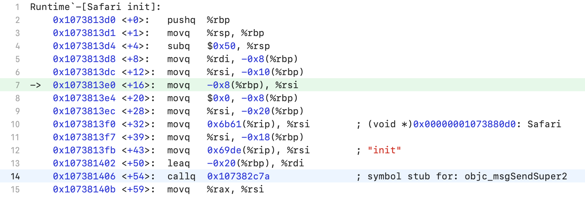

上一篇文章[Runtime从入门到进阶一](https://github.com/pro648/tips/wiki/Runtime%E4%BB%8E%E5%85%A5%E9%97%A8%E5%88%B0%E8%BF%9B%E9%98%B6%E4%B8%80)介绍了消息发送，以及与之相关的Object、Class、metaClass、Method等。这一篇文章将介绍动态方法解析、消息转发和 runtime 的具体应用。

在消息解析阶段找不到 selector，会进入动态方法解析、消息转发，这样可以捕获、响应未处理消息。即当有未处理消息时，提供了额外处理的机会，避免应用崩溃。

执行以下代码会发生什么？

```
    [engineer run];
```

如果`Engineer`实现了`run`方法，runtime 会查找到实现`run`方法的类并调用；当查找不到`run`方法时，会进入以下阶段：

1. 动态方法解析：runtime 查看该类的`resolveInstanceMethod:`方法，在该方法内使用`class_addMethod()`函数动态添加方法并返回`YES`。这时会再次进入消息发送阶段，并标记为已进行动态方法解析，即使找不到方法也不会再次进行动态方法解析。如果是类方法，在`resolveClassMethod:`方法内实现所需功能。
2. 快速转发：runtime 查看该类的`forwardingTargetForSelector:`方法。如果该方法返回值不为`nil`、`self`，返回的 target 进入处理消息阶段。
3. 消息转发：runtime 先查看`methodSignatureForSelector:`方法返回值，判断返回值、参数类型。如果 method signature 不为`nil`，runtime 创建描述消息的`NSInvocation`，并向对象发送`forwardInvocation:`；如果 method signature 为`nil`，表示彻底放弃处理消息，runtime 发送`doesNotRecognizeSelector:`消息。

## 1. 动态方法解析

Runtime 通过查找方法或`IMP`来发送消息，然后跳转到该方法。有时，将`IMP`动态的插入到类中，而非预先设置可能很有用。这样可以实现快速”转发“，因为解析之后，其将作为常规消息发送的一部分进行调用。缺点是其不够灵活，需要准备好要插入的`IMP`和其 type encoding。

```
void otherRun(id self, SEL _cmd) {
    NSLog(@"%s", __func__);
}

+ (BOOL)resolveInstanceMethod:(SEL)sel {
    if (sel == @selector(run)) {
        class_addMethod([self class], sel, (IMP)otherRun, "v@:");
        return YES;
    } else {
        return [super resolveInstanceMethod:sel];
    }
}
```

调用`run`方法，输出如下：

```
 // 调用 run
 [engineer run];
 
 // 输出如下
 otherRun
```

可以看到其并没有崩溃。如果要动态解析类方法，重写`resolveClassMethod:`即可。

事实上，动态解析之后返回`YES`和`NO`没有区别。源码如下：

```
/***********************************************************************
* _class_resolveMethod
* Call +resolveClassMethod or +resolveInstanceMethod.
* Returns nothing; any result would be potentially out-of-date already.
* Does not check if the method already exists.
**********************************************************************/
void _class_resolveMethod(Class cls, SEL sel, id inst)
{
    if (! cls->isMetaClass()) {
        // try [cls resolveInstanceMethod:sel]
        // 动态解析实例方法
        _class_resolveInstanceMethod(cls, sel, inst);
    } 
    else {
        // try [nonMetaClass resolveClassMethod:sel]
        // and [cls resolveInstanceMethod:sel]
        // 动态解析类方法
        _class_resolveClassMethod(cls, sel, inst);
        if (!lookUpImpOrNil(cls, sel, inst, 
                            NO/*initialize*/, YES/*cache*/, NO/*resolver*/)) 
        {
            _class_resolveInstanceMethod(cls, sel, inst);
        }
    }
}

/***********************************************************************
* _class_resolveInstanceMethod
* Call +resolveInstanceMethod, looking for a method to be added to class cls.
* cls may be a metaclass or a non-meta class.
* Does not check if the method already exists.
**********************************************************************/
static void _class_resolveInstanceMethod(Class cls, SEL sel, id inst)
{
    if (! lookUpImpOrNil(cls->ISA(), SEL_resolveInstanceMethod, cls, 
                         NO/*initialize*/, YES/*cache*/, NO/*resolver*/)) 
    {
        // Resolver not implemented.
        return;
    }

    BOOL (*msg)(Class, SEL, SEL) = (typeof(msg))objc_msgSend;
    // 拿到是否动态解析的返回值
    bool resolved = msg(cls, SEL_resolveInstanceMethod, sel);

    // Cache the result (good or bad) so the resolver doesn't fire next time.
    // +resolveInstanceMethod adds to self a.k.a. cls
    IMP imp = lookUpImpOrNil(cls, sel, inst, 
                             NO/*initialize*/, YES/*cache*/, NO/*resolver*/);
    
    // 使用返回值进行打印，并没有其他操作。
    if (resolved  &&  PrintResolving) {
        if (imp) {
            _objc_inform("RESOLVE: method %c[%s %s] "
                         "dynamically resolved to %p", 
                         cls->isMetaClass() ? '+' : '-', 
                         cls->nameForLogging(), sel_getName(sel), imp);
        }
        else {
            // Method resolver didn't add anything?
            _objc_inform("RESOLVE: +[%s resolveInstanceMethod:%s] returned YES"
                         ", but no new implementation of %c[%s %s] was found",
                         cls->nameForLogging(), sel_getName(sel), 
                         cls->isMetaClass() ? '+' : '-', 
                         cls->nameForLogging(), sel_getName(sel));
        }
    }
}
```

可以看到，只使用返回值进行了打印，没有进一步的操作。但推荐遵守文档规范，解析后返回`YES`；反之，返回`NO`。

## 2. 消息转发

如果在动态方法解析阶段未处理消息，则会进入消息转发阶段，其首先进入快速转发。

#### 2.1 快速转发

进入转发阶段后，runtime 首先会判断是否希望将消息完整转发给其他对象。这是常用的转发，开销相对小一些。

Runtime 会给`forwardingTargetForSelector:`发送消息，如果该方法返回`non-nil`、`non-self`对象，则返回的对象作为 receiver 接收消息；如果返回的是`self`，则会进入无限循环。如果在子类实现了该方法，但对某个 selector 没有对象可以返回，则需调用`super`实现。

在下面的代码中，`Engineer`只声明了`numberOfDaysInMonth:`方法，并未实现。`Student`类声明并实现了`numberOfDaysInMonth:`方法：

```
@interface Engineer : Person
- (int)numberOfDaysInMonth:(int)month;
@end

@implementation Engineer
@end

@interface Student : NSObject
- (int)numberOfDaysInMonth:(int)month;
@end

@implementation Student
- (int)numberOfDaysInMonth:(int)month {
    NSLog(@"%s", __func__);
    return 99;
}
@end
```

执行`[engineer numberOfDaysInMonth:3]`会崩溃，可以通过将`numberOfDaysInMonth:`消息转发给`Student`解决这一问题。

在`Engineer.m`实现部分添加以下代码：

```
// 快速转发
- (id)forwardingTargetForSelector:(SEL)aSelector {
    if (aSelector == @selector(numberOfDaysInMonth:)) {
        return [[Student alloc] init];
    } else {
        return [super forwardingTargetForSelector:aSelector];
    }
}
```

再次执行`[engineer numberOfDaysInMonth:3]`，输出如下：

```
 -[Student numberOfDaysInMonth:]
```

> 通过`forwardingTargetForSelector:`可以实现多重继承。

`forwardingTargetForSelector:`可以将未知消息转发给其他对象处理，其比`forwardInvocation:`更为轻量。如果只将消息转发给其他对象处理，这是一个很好的解决方案；如果想要捕获`NSInvocation`，获取转发消息的参数、返回值，则应使用`forwardInvocation:`方法。

#### 2.2 常规转发

动态方法解析、快速转发是转发的优化，可以进行快速转发。如果没有在上述阶段采取措施，就会进入常规消息转发。在常规消息转发时，会创建封装了消息信息的`NSInvocation`，`NSInvocation`包含 target、selector、参数，还可以控制返回值。

为了将参数封装到`NSInvocation`，runtime 需要知道参数数量、类型，返回值类型，这些信息封装到`NSMethodSignature`提供。通过`methodSignatureForSelector:`方法为其提供`NSMethodSignature`。

invocation 创建完成后，runtime 调用`forwardInvocation:`方法。在该方法内，可以进行任意操作。

假设没有在快速处理阶段处理`numberOfDaysInMonth:`方法，可以通过下面代码进行处理：

```
- (NSMethodSignature *)methodSignatureForSelector:(SEL)aSelector {
    if (aSelector == @selector(numberOfDaysInMonth:)) {
        return [NSMethodSignature signatureWithObjCTypes:"i@:i"];
    } else {
        return [super methodSignatureForSelector:aSelector];
    }
}

- (void)forwardInvocation:(NSInvocation *)anInvocation {
    NSLog(@"%@ %@", anInvocation.target, NSStringFromSelector(anInvocation.selector));
    [anInvocation invokeWithTarget:[[Student alloc] init]];
}
```

`invokeWithTarget:`方法可以更改消息的 target。

另外，`getArgument:atIndex:`方法可以获取 invocation 参数：

```
- (void)forwardInvocation:(NSInvocation *)anInvocation {
    ...
    int month;
    [anInvocation getArgument:&month atIndex:2];
    NSLog(@"%d", month + 10);
}
```

> `NSInvocation`第一个参数是 id 类型的`self`，第二个参数是 SEL 类型的`_cmd`。所以，上述方法的 month 参数 index 为2。

利用`forwardInvocation:`可以解决方法找不到的异常问题。

>Runtime 不仅对实例方法进行转发，也会对类方法进行转发，但 Xcode 不能自动补全`forwardingTargetForSelector:`、`methodSignatureForSelector:`、`forwardInvocation:`类方法。
>
>```
>// 快速转发
>+ (id)forwardingTargetForSelector:(SEL)aSelector {
>    if (aSelector == @selector(numberOfDaysInMonth:)) {
>        return [Student class];
>    } else {
>        return [super forwardingTargetForSelector:aSelector];
>    }
>}
>
>// 常规转发
>+ (NSMethodSignature *)methodSignatureForSelector:(SEL)aSelector {
>    if (aSelector == @selector(numberOfDaysInMonth:)) {
>        return [NSMethodSignature signatureWithObjCTypes:"i@:i"];
>    } else {
>        return [super methodSignatureForSelector:aSelector];
>    }
>}
>
>+ (void)forwardInvocation:(NSInvocation *)anInvocation {
>    NSLog(@"%@ %@", anInvocation.target, NSStringFromSelector(anInvocation.selector));
>    [anInvocation invokeWithTarget:[Student class]];
>    
>    int month;
>    [anInvocation getArgument:&month atIndex:2];
>    NSLog(@"%d", month + 10);
>}
>```

下面是消息查找的源码：

```

/***********************************************************************
* lookUpImpOrForward.
* The standard IMP lookup. 
* initialize==NO tries to avoid +initialize (but sometimes fails)
* cache==NO skips optimistic unlocked lookup (but uses cache elsewhere)
* Most callers should use initialize==YES and cache==YES.
* inst is an instance of cls or a subclass thereof, or nil if none is known. 
*   If cls is an un-initialized metaclass then a non-nil inst is faster.
* May return _objc_msgForward_impcache. IMPs destined for external use 
*   must be converted to _objc_msgForward or _objc_msgForward_stret.
*   If you don't want forwarding at all, use lookUpImpOrNil() instead.
**********************************************************************/
IMP lookUpImpOrForward(Class cls, SEL sel, id inst, 
                       bool initialize, bool cache, bool resolver)
{
    IMP imp = nil;
    // 首次进入，标记为未进行动态方法解析。
    bool triedResolver = NO;

    runtimeLock.assertUnlocked();

    // 缓存中如果存在，直接从缓存中取。
    if (cache) {
        imp = cache_getImp(cls, sel);
        if (imp) return imp;
    }

    // runtimeLock is held during isRealized and isInitialized checking
    // to prevent races against concurrent realization.

    // runtimeLock is held during method search to make
    // method-lookup + cache-fill atomic with respect to method addition.
    // Otherwise, a category could be added but ignored indefinitely because
    // the cache was re-filled with the old value after the cache flush on
    // behalf of the category.

    runtimeLock.read();

    if (!cls->isRealized()) {
        // Drop the read-lock and acquire the write-lock.
        // realizeClass() checks isRealized() again to prevent
        // a race while the lock is down.
        runtimeLock.unlockRead();
        runtimeLock.write();

        realizeClass(cls);

        runtimeLock.unlockWrite();
        runtimeLock.read();
    }

    if (initialize  &&  !cls->isInitialized()) {
        runtimeLock.unlockRead();
        _class_initialize (_class_getNonMetaClass(cls, inst));
        runtimeLock.read();
        // If sel == initialize, _class_initialize will send +initialize and 
        // then the messenger will send +initialize again after this 
        // procedure finishes. Of course, if this is not being called 
        // from the messenger then it won't happen. 2778172
    }

    
 retry:    
    runtimeLock.assertReading();

    // Try this class's cache.

    imp = cache_getImp(cls, sel);
    if (imp) goto done;

    // Try this class's method lists.
    {
        Method meth = getMethodNoSuper_nolock(cls, sel);
        if (meth) { // 从当前类的 method lists查找，找到后添加到缓存。
            log_and_fill_cache(cls, meth->imp, sel, inst, cls);
            imp = meth->imp;
            goto done;
        }
    }

    // 进入父类缓存、method lists查找
    // Try superclass caches and method lists.
    {
        unsigned attempts = unreasonableClassCount();
        for (Class curClass = cls->superclass;
             curClass != nil;
             curClass = curClass->superclass)
        {
            // Halt if there is a cycle in the superclass chain.
            if (--attempts == 0) {
                _objc_fatal("Memory corruption in class list.");
            }
            
            // Superclass cache.
            imp = cache_getImp(curClass, sel);
            if (imp) {
                if (imp != (IMP)_objc_msgForward_impcache) {    // 如果在父类缓存找到，添加到消息接收者缓存。
                    // Found the method in a superclass. Cache it in this class.
                    log_and_fill_cache(cls, imp, sel, inst, curClass);
                    goto done;
                }
                else {
                    // Found a forward:: entry in a superclass.
                    // Stop searching, but don't cache yet; call method 
                    // resolver for this class first.
                    break;
                }
            }
            
            // Superclass method list.
            Method meth = getMethodNoSuper_nolock(curClass, sel);
            if (meth) { // 在父类 method list 找到，添加到消息接收者缓存。
                log_and_fill_cache(cls, meth->imp, sel, inst, curClass);
                imp = meth->imp;
                goto done;
            }
        }
    }
    
    // 如果还没有动态解析过，进行动态方法解析。
    // No implementation found. Try method resolver once.
    if (resolver  &&  !triedResolver) {
        runtimeLock.unlockRead();
        _class_resolveMethod(cls, sel, inst);
        runtimeLock.read();
        // Don't cache the result; we don't hold the lock so it may have 
        // changed already. Re-do the search from scratch instead.
        // 标记为已动态解析，再次尝试消息发送。
        triedResolver = YES;
        goto retry;
    }
    
    // 没有找到imp，动态解析也没有找到，进行消息转发。
    // No implementation found, and method resolver didn't help. 
    // Use forwarding.
    imp = (IMP)_objc_msgForward_impcache;
    cache_fill(cls, sel, imp, inst);

 done:
    runtimeLock.unlockRead();

    return imp;
}
```

## 3. 具体应用

Runtime 应用场景非常多，下面介绍一些常用的场景。

#### 3.1 交换方法 Method Swizzling

Method swizzling 是改变现有 selector 的实现。

假设需要拦截`UIButton`点击事件。可以在每个`UIButton`的响应事件中拦截，但需要添加很多代码。继承自自定义的`UIButton`也是一种解决方案，但需要修改所有按钮，且后续需使用指定的 button。另一种解决方案是为`UIButton`创建分类，在分类中实现 method swizzling。

```
@implementation UIControl (Extension)

+ (void)load {
    static dispatch_once_t onceToken;
    dispatch_once(&onceToken, ^{
        Class cls = [self class];
        
        SEL originalSelector = @selector(sendAction:to:forEvent:);
        SEL swizzledSelector = @selector(pr_sendAction:to:forEvent:);
        
        Method originalMethod = class_getInstanceMethod(cls, originalSelector);
        Method swizzledMethod = class_getInstanceMethod(cls, swizzledSelector);
        
        BOOL didAddMethod = class_addMethod(cls, originalSelector, method_getImplementation(swizzledMethod), method_getTypeEncoding(swizzledMethod));
        if (didAddMethod) {
            class_replaceMethod(cls, swizzledSelector, method_getImplementation(originalMethod), method_getTypeEncoding(originalMethod));
        } else {
            method_exchangeImplementations(originalMethod, swizzledMethod);
        }
    });
}

- (void)pr_sendAction:(SEL)action to:(id)target forEvent:(UIEvent *)event {
    // 进行所需的处理
    NSLog(@"--- %@ --- %@ --- %@ ---", self, NSStringFromSelector(action), target);
    
    [self pr_sendAction:action to:target forEvent:event];
}

@end
```

> `UIButton`继承自`UIControl`，点击事件会调用`sendAction:to:forEvent:`，因此这里交换`endAction:to:forEvent:`。

###### 3.1.1 load vs initialize

交换方法应写在`load`方法中。

Objective-C 的 runtime 会自动调用`load`和`initialize`方法。类初次加载时调用`load`方法，调用类的第一个实例方法、类方法之前调用`initialize`方法。两个方法都是可选实现，并且仅在实现该方法时才执行。

由于，Method Swizzling 影响全局状态，应尽可能避免 [race condition](https://github.com/pro648/tips/wiki/%E5%A4%9A%E7%BA%BF%E7%A8%8B%E7%AE%80%E8%BF%B0#42-race-condition-%E7%9A%84%E5%8E%9F%E5%9B%A0)。类初始化期间确保会调用`load`方法，这样可以使全局行为一致。相反，`initialize`方法不能明确调用时间。如果没有消息发送给该类，`initialize`永远不会被调用。

###### 3.1.2 Method Swizzling 应在 dispatch_once 中进行

因为交换方法会改变全局状态，要尽可能确保其只执行一次。原子性就是这样一种预防措施，即使从不同线程调用它也可以确保只执行一次。[Grand Central Dispatch](https://github.com/pro648/tips/wiki/Grand-Central-Dispatch%E7%9A%84%E4%BD%BF%E7%94%A8) 的`dispatch_once`可以满足这种需求，在`dispatch_once`中执行交换方法应是标准操作。

> 类初次加载时会调用`load`方法，一般`load`只会执行一次。如果没有使用`dispatch_once`，手动调用`load`方法后会出现问题。

###### 3.1.3 调用自身

下面的代码看似会进入无限循环：

```
- (void)pr_sendAction:(SEL)action to:(id)target forEvent:(UIEvent *)event {
    // 进行所需的处理
    NSLog(@"--- %@ --- %@ --- %@ ---", self, NSStringFromSelector(action), target);
    
    [self pr_sendAction:action to:target forEvent:event];
}
```

事实证明其不会进入无限循环。`pr_sendAction:to:forEvent:`的`IMP`指针已经指向了`sendAction:to:forEvent:`实现。如果在上述方法内调用`sendAction:to:forEvent:`，则会进入无限循环。

> 分类方法一般需要添加前缀，以避免和系统方法重复。

###### 3.1.4 为何要先添加 method

既然`method_exchangeImplementations()`可以交换方法的`IMP`，为何不直接交换？为何还需要使用`class_addMethod()`、`class_replaceMethod()`函数。

`User`继承自`NSObject`，`PremiumUser`继承自`User`。`User`声明并实现了`happyBirthday`方法，`PremiumUser`没有重写`happyBirthday`方法。如果此时在`PremiumUser`类直接交换`happyBirthday`方法，会发生什么？

交换之后，子类方法实现指向父类，父类方法实现指向子类。但由于子类并未重写`happyBirthday`方法，如果父类此时调用`happyBirthday`方法，app 会抛出unrecognized selector sent to instance：

```
@implementation PremiumUser
+ (void)load {
    static dispatch_once_t onceToken;
    dispatch_once(&onceToken, ^{
        Class cls = [self class];
        SEL originalSelector = @selector(happyBirthday);
        SEL swizzledSelector = @selector(pr_happyBirthday);
        
        Method originalMethod = class_getInstanceMethod(cls, originalSelector);
        Method swizzledMethod = class_getInstanceMethod(cls, swizzledSelector);
        
        method_exchangeImplementations(originalMethod, swizzledMethod);
    });
}

- (void)pr_happyBirthday {
    NSLog(@"+++ %s +++", __func__);
    
    [self pr_happyBirthday];
}
@end

- (void)testMethodSwizzling {
    // 如果直接使用 method_exchangeImplementations(),调用父类的happyBirthday会闪退。
    User *user = [[User alloc] init];
    [user happyBirthday];
}
```

使用`class_addMethod()`添加到子类，即重写父类方法，可以解决方法找不到的问题：

```
        BOOL success = class_addMethod(cls, originalSelector, method_getImplementation(swizzledMethod), method_getTypeEncoding(swizzledMethod));
        if (success) {
            Method original = class_getInstanceMethod(cls, originalSelector);
            Method swizzle = class_getInstanceMethod(cls, swizzledSelector);
            
            IMP oriIMP = method_getImplementation(original);
            IMP swiIMP = method_getImplementation(swizzle);
            
            class_replaceMethod(cls, swizzledSelector, method_getImplementation(originalMethod), method_getTypeEncoding(originalMethod));
        }
```

`po`查看`oriIMP`、`swiIMP`指针会发现其现在指向同一`IMP`:

```
(lldb) po oriIMP
(Runtime`-[PremiumUser pr_happyBirthday] at PremiumUser.m:47)

(lldb) po swiIMP
(Runtime`-[PremiumUser pr_happyBirthday] at PremiumUser.m:47)
```

这时使用`class_replaceMethod()`替换`IMP`即可。

> 判断`class_addMethod()`是比较安全的写法。如果确定当前类存在要交换的方法，也可以直接使用`method_exchangeImplementations()`函数。

`method_exchangeImplementations()`函数可以看作是交换`IMP`，交换后会清空缓存。

###### 3.1.5 注意事项

Method swizzling 容易发生不可预测的行为和无法预料的后果，使用时需注意以下事项：

- 在交换方法内调用原始方法的`IMP`，除非有明确原因不进行这种操作。不调用原始实现，可能导致系统私有状态改变，app 其他功能失效等。
- 分类方法添加前缀，并确保没有其他方法（包括依赖库）使用相同名称。
- 即使你对`Foundation`、`UIKit`或其他系统API再熟悉，也应知道系统下一次的更新可能改变原来实现，导致交换方法失效。

> 还可以通过交换`NSMutableArray`的`insertObject:atIndex:`方法，解决向数组添加`nil`元素导致崩溃的问题。因为`NSString`、`NSDictionary`、`NSMutableArray`、`NSNumber`是类簇，真实类型是其他类型，需要注意交换方法的类名称。

###### 3.1.6 method_exchangeImplementations() 源码

`method_exchangeImplementations()`源码如下：

```
void method_exchangeImplementations(Method m1, Method m2)
{
    if (!m1  ||  !m2) return;

    rwlock_writer_t lock(runtimeLock);

    IMP m1_imp = m1->imp;
    m1->imp = m2->imp;
    m2->imp = m1_imp;

    // RR/AWZ updates are slow because class is unknown
    // Cache updates are slow because class is unknown
    // fixme build list of classes whose Methods are known externally?

    flushCaches(nil);

    updateCustomRR_AWZ(nil, m1);
    updateCustomRR_AWZ(nil, m2);
}
```

可以看到其只是交换`imp`，交换之后清空缓存。

#### 4. 关联对象 Associated Objects

关联对象（associated objects，也称为 associative references）允许对象在运行时关联任何值。其有以下三个函数：

- objc_setAssociatedObject：为指定对象、使用指定key关联值。值为`nil`时，用于清楚关联对象。
- objc_getAssociatedObject：取出指定对象使用指定key关联的值。
- objc_removeAssociatedObjects：清除指定对象的所有关联对象。主要用于将对象还原为「初始状态」，不应用于从对象中删除关联对象，因为它会删除所有对象添加到该对象的关联。通常，为`objc_setAssociatedObject`传值`nil`以清除关联。

使用 associated objects 可以为分类添加属性：

```
@interface UIView (DefaultColor)
@property (nonatomic, strong) UIColor *defaultColor;
@end

static void *kDefaultColorKey = &kDefaultColorKey;
@implementation UIView (DefaultColor)
- (UIColor *)defaultColor {
    return objc_getAssociatedObject(self, kDefaultColorKey);
}

- (void)setDefaultColor:(UIColor *)defaultColor {
    objc_setAssociatedObject(self, kDefaultColorKey, defaultColor, OBJC_ASSOCIATION_RETAIN_NONATOMIC);
}
@end
```

kDefaultColorKey 表示一个静态变量指向其自身，即一个唯一的常量。由于`SEL`也是唯一、常量，也可以使用`SEL`替换上述key。

###### 4.1 内存管理

`objc_AssociationPolicy`枚举类型决定关联值存储类型。

| objc_AssociationPolicy            | 对应property                 | 描述                         |
| --------------------------------- | ---------------------------- | ---------------------------- |
| OBJC_ASSOCIATION_ASSIGN           | @property(assign)            | 对关联对象弱引用。           |
| OBJC_ASSOCIATION_COPY             | @property(nonatomic, strong) | 对关联对象强引用，非原子性。 |
| OBJC_ASSOCIATION_COPY_NONATOMIC   | @property(nonatomic, copy)   | 复制关联对象，非原子性。     |
| OBJC_ASSOCIATION_RETAIN           | @property(atomic, strong)    | 对关联对象强引用，原子性。   |
| OBJC_ASSOCIATION_RETAIN_NONATOMIC | @property(atomic, copy)      | 复制关联对象，原子性。       |

###### 4.2 移除关联对象的值

不要使用`objc_removeAssociatedObjects()`函数移除关联对象，`objc_removeAssociatedObjects()`主要用于将对象还原为「初始状态」，开发者极少需要调用该函数。需要移除关联对象时，为为`objc_setAssociatedObject()`传值`nil`即可。

关联对象应作为万不得已的方法，而非遇到问题的首选解决方案。

#### 5. 创建类

使用 runtime 创建类与使用代码创建类效果一致，只是 runtime 会直接在内存中创建。可以向类添加方法、实例变量、协议等。

###### 5.1 创建类

使用`objc_allocateClassPair()`函数可以在运行时创建类，传入要创建类的父类、类名称、大小，返回创建的类：

```
    Class newCls = objc_allocateClassPair([NSObject class], "Dog", 0);
```

###### 5.2 添加方法

使用`class_addMethod()`函数向类添加方法。该函数有以下四个参数：

- cls：要添加方法的类。
- name：方法名称，即 selector。
- imp：要添加的方法的`IMP`。
- types：要添加方法的 type encoding。

如下所示：

```
    class_addMethod(newCls, @selector(run), (IMP)run, "v@:");
```

###### 5.3 添加成员变量

使用`class_addIvar()`函数添加成员变量。该函数有以下几个参数：

- cls：要添加成员变量的类。不能是元类，不支持向元类添加成员变量。
- name：成员变量名称。
- size：成员变量大小。如果成员变量是普通 C 类型，可以使用`sizeof()`获取其大小。
- alignment：成员变量对齐方式。表示成员变量的存储在内存中如何对齐，包括与上一个成员变量的padding。该参数一般是 alignment 的 log2，而非 alignment 本身。传入1表示边界是2，传入4表示 alignment 是16字节。由于大部分类型希望按照自身大小对齐，可以直接传入`log2(sizeof(type))`。
- types：添加的成员变量类型。可以通过`@encode()`指令获取。

如下所示：

```
    class_addIvar(newCls, "_age", sizeof(int), log2(sizeof(int)), @encode(int));
    class_addIvar(newCls, "_weight", sizeof(int), log2(sizeof(int)), @encode(int));
```

成员变量是只读的，位于 class_ro_t *ro，注册完成后不可变。

> 只能在`objc_allocateClassPair()`函数后、`objc_registerClassPair()`函数前，调用`objc_addIvar()`函数。不能使用`objc_addIvar()`向已经存在的类添加成员变量。

此外，使用`class_addProtocol()`函数声明类遵守某项协议，使用`class_addProperty()`函数为类添加属性。

###### 5.4 注册类

配置完毕后，必须注册类才可以使用。使用`objc_registerClassPair()`函数注册类：

```
    objc_registerClassPair(newCls);
```

###### 5.5 访问成员变量

访问成员变量时不能直接调用访问器方法，因为编译器甚至不知道该属性是否存在。

使用[键值编码](https://github.com/pro648/tips/wiki/KVC%E5%92%8CKVO%E5%AD%A6%E4%B9%A0%E7%AC%94%E8%AE%B0#2-%E9%94%AE%E5%80%BC%E7%BC%96%E7%A0%81)设值、取值。其会将基本类型转换为`NSValue`、`NSNumber`。

```
    [dog setValue:@10 forKey:@"_age"];
    [dog setValue:@20 forKey:@"_weight"];
    NSLog(@"%@ %@", [dog valueForKey:@"_age"], [dog valueForKey:@"_weight"]);
```

###### 5.6 使用类

注册之后，可以像其他类一样使用。

```
    id dog = [[newCls alloc] init];
    [dog run];
```

###### 5.7 销毁类

使用`objc_allocateClassPair()`创建的类，不再使用时需使用`objc_disposeClassPair()`函数销毁。但该类及其子类存在时，不能调用`objc_disposeClassPair()`，否则会抛出*Attempt to use unknown class*错误。

```
    // 当newClass类及子类存在时，不能调用objc_disposeClassPair()函数，否则会抛出Attempt to use unknown class错误。
    dog = nil;
    // 不需要的时候释放newCls。
    objc_disposeClassPair(newCls);
```

#### 6. 查看私有成员变量

系统提供的功能有时不能满足需求，需要修改系统控件的某些属性。如果没有可用API直接修改，可以通过`class_copyIvarList()`获取、遍历其私有成员变量。

修改`UITextField`占位符颜色需要使用`NSAttributedString`。如果使用私有成员变量应该如何修改呢？

```
    self.textField.placeholder = @"github.com/pro648";
    
    unsigned int count;
    Ivar *ivars = class_copyIvarList(self.textField.class, &count);
    for (int i=0; i<count; ++i) {
        Ivar ivar = ivars[i];
        NSLog(@"%s %s", ivar_getName(ivar), ivar_getTypeEncoding(ivar));
    }
    free(ivars);
```

上述代码会输出所有成员变量：

```
 ...
_clearButton @"UIButton"
_clearButtonOffset {CGSize="width"d"height"d}
_leftViewOffset {CGSize="width"d"height"d}
_rightViewOffset {CGSize="width"d"height"d}
_backgroundView @"UITextFieldBorderView"
_disabledBackgroundView @"UITextFieldBorderView"
_systemBackgroundView @"UITextFieldBackgroundView"
_textContentView @"_UITextFieldCanvasView"
_floatingContentView @"_UIFloatingContentView"
_contentBackdropView @"UIVisualEffectView"
_fieldEditorBackgroundView @"_UIDetachedFieldEditorBackgroundView"
_fieldEditorEffectView @"UIVisualEffectView"
_placeholderLabel @"UITextFieldLabel"
...
```

可以看到清空是`UIButton`，placeholderLabel 是`UITextFieldLabel`类型，通过`isKindOfClass`可以判断其是`UILabel`子类。因此，可以使用以下代码修改修改占位符颜色：

```
    id placeholderLabel = [self.textField valueForKeyPath:@"placeholderLabel"];
    if ([placeholderLabel isKindOfClass:UILabel.class]) {
        UILabel *label = (UILabel *)placeholderLabel;
        label.textColor = [UIColor redColor];
    }
```

> 由于占位符使用了懒加载，需先设值占位符，才能查看到占位符变量名称。

## 4. 问题

#### 4.1 super的本质

调用以下`init`方法，输出结果是什么？

```
@interface Browser : NSObject
@end
@implementation Browser
@end

@interface Safari : Browser
- (instancetype)init;
@end
@implementation Safari
- (instancetype)init
{
    self = [super init];
    if (self) {
        NSLog(@"[self class] = %@", [self class]);
        NSLog(@"[super class] = %@", [super class]);
        NSLog(@"[self superclass] = %@", [self superclass]);
        NSLog(@"[super superclass] = %@", [super superclass]);
    }
    return self;
}
@end
```

输出如下：

```
[self class] = Safari
[super class] = Safari
[self superclass] = Browser
[super superclass] = Browser
```

`class`、`superclass`的实现在`NSObject`中，源码如下：

```
+ (Class)class {
    return self;
}

- (Class)class {
    return object_getClass(self);
}

+ (Class)superclass {
    return self->superclass;
}

- (Class)superclass {
    return [self class]->superclass;
}
```

可以看到，`class`方法返回的`object_getClass(self)`，即消息接收者的类。`superclass`返回的是消息接收者的父类。

`objc_super`结构体如下，其定义了两个成员：消息接收者、父类。

```
/// Specifies the superclass of an instance. 
struct objc_super {
    /// Specifies an instance of a class.
    __unsafe_unretained _Nonnull id receiver;

    /// Specifies the particular superclass of the instance to message. 
#if !defined(__cplusplus)  &&  !__OBJC2__
    /* For compatibility with old objc-runtime.h header */
    __unsafe_unretained _Nonnull Class class;
#else
    __unsafe_unretained _Nonnull Class super_class;
#endif
    /* super_class is the first class to search */
};
```

`objc_msgSendSuper()`源码如下：

```
/** 
 * Sends a message with a simple return value to the superclass of an instance of a class.
 * 
 * @param super A pointer to an \c objc_super data structure. Pass values identifying the
 *  context the message was sent to, including the instance of the class that is to receive the
 *  message and the superclass at which to start searching for the method implementation.
 * @param op A pointer of type SEL. Pass the selector of the method that will handle the message.
 * @param ...
 *   A variable argument list containing the arguments to the method.
 * 
 * @return The return value of the method identified by \e op.
 * 
 * @see objc_msgSend
 */
OBJC_EXPORT id _Nullable
objc_msgSendSuper(struct objc_super * _Nonnull super, SEL _Nonnull op, ...)
```

可以看到superclass指定开始查找实现的起点。因此，`[super class]`只是指定从父类开始查找`class`的实现，消息接收者仍然是当前类。由于`class`在`NSObject`中实现，因此输出和`[self class]`一致。

在`self = [super init];`添加断点，运行至断点后选择Debug >> Debug Workflow >> Always Show Disassembly 查看汇编代码，可以看到其实质上调用的是`objc_msgSendSuper2`。



还可以通过 Product >> Perform Action >> Assemble "Safari.m" 将文件转变为汇编代码，如下所示：

```
	...
	.loc	3 15 12 prologue_end    ; Runtime/Q&A/Safari.m:15:12
	ldur	x0, [x29, #-8]
	mov	x1, #0
	stur	x1, [x29, #-8]
	stur	x0, [x29, #-32]
	ldr	x9, [x9]
	stur	x9, [x29, #-24]
	ldr	x1, [x8]
	sub	x0, x29, #32            ; =32
	bl	_objc_msgSendSuper2
	mov	x8, x0
	stur	x8, [x29, #-8]
	.loc	3 15 10 is_stmt 0       ; Runtime/Q&A/Safari.m:15:10
	...
```

> 如果当前选择的是模拟器，生成的汇编代码是 x86 架构的。调用 super 方式为`callq	_objc_msgSendSuper2`。

#### 4.2 isKindOf: isMemberOf:

下面代码打印结果是什么？

```
        BOOL res1 = [[NSObject class] isKindOfClass:[NSObject class]];
        BOOL res2 = [[NSObject class] isMemberOfClass:[NSObject class]];
        BOOL res3 = [[Safari class] isKindOfClass:[Safari class]];
        BOOL res4 = [[Safari class] isMemberOfClass:[Safari class]];
        
        NSLog(@"%i %i %i %i", res1, res2, res3, res4);
```

以下是`isMemberOfClass:`和`isKindOfClass:`区别：

- `isMemberOfClass:`判断当前实例对象、类对象的`isa`是否指向参数中的类、元类。
- `isKindOfClass:`判断当前实例对象、类对象的`isa`是否指向参数中的类、元类及其子类。

> 在上述方法中，如果调用者是实例对象，参数应为类对象；如果调用者是类对象，参数应为元类。

其源码如下：

```
+ (BOOL)isMemberOfClass:(Class)cls {
    return object_getClass((id)self) == cls;
}

- (BOOL)isMemberOfClass:(Class)cls {
    return [self class] == cls;
}

+ (BOOL)isKindOfClass:(Class)cls {
    for (Class tcls = object_getClass((id)self); tcls; tcls = tcls->superclass) {
        if (tcls == cls) return YES;
    }
    return NO;
}

- (BOOL)isKindOfClass:(Class)cls {
    for (Class tcls = [self class]; tcls; tcls = tcls->superclass) {
        if (tcls == cls) return YES;
    }
    return NO;
}
```

可以看到，`isMemberOf:`只是比较消息接收者的`isa`是否指向参数的类。`isKindOfClass:`判断消息接收者的`isa`是否指向参数的类及其子类。

查看以下代码：

```
    Engineer *engineer = [[Engineer alloc] init];
    BOOL res5 = [engineer isKindOfClass:[NSObject class]];
    BOOL res6 = [engineer isMemberOfClass:[NSObject class]];
    BOOL res7 = [engineer isKindOfClass:[Engineer class]];
    BOOL res8 = [engineer isMemberOfClass:[Engineer class]];
    NSLog(@"%i %i %i %i", res5, res6, res7, res8);
```

打印结果是：

```
1 0 1 1
```

`[NSObject class]`是类对象，右侧参数应为元类，`[Safari class]`也一样。

由于类的`isa`指向元类，元类的基类是`NSObject`的元类，`NSObject`元类的父类指向`NSObject`自身。所以，`NSObject`是所有类、元类的父类。因此，以下代码输出：1 0 0 0。

```
    BOOL res1 = [[NSObject class] isKindOfClass:[NSObject class]];
    BOOL res2 = [[NSObject class] isMemberOfClass:[NSObject class]];
    BOOL res3 = [[Safari class] isKindOfClass:[Safari class]];
    BOOL res4 = [[Safari class] isMemberOfClass:[Safari class]];
    NSLog(@"%i %i %i %i", res1, res2, res3, res4);
```

Demo名称：Runtime  
源码地址：<https://github.com/pro648/BasicDemos-iOS/tree/master/Runtime>

参考资料：

1. [Runtime Method Swizzling 实战](https://dandan2009.github.io/2018/04/08/runtime-method-swizzling/)
2. [Method Swizzling](https://nshipster.com/method-swizzling/)
3. [Associated Objects](https://nshipster.com/associated-objects/)
4. [Friday Q&A 2010-11-6: Creating Classes at Runtime in Objective-C](https://mikeash.com/pyblog/friday-qa-2010-11-6-creating-classes-at-runtime-in-objective-c.html)
5. [Digging Into the Objective-C Runtime](https://artandlogic.com/2014/01/digging-into-the-objective-c-runtime/)

