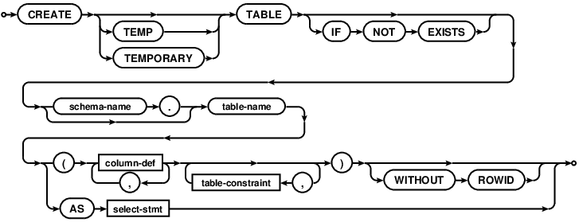
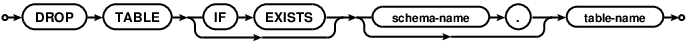
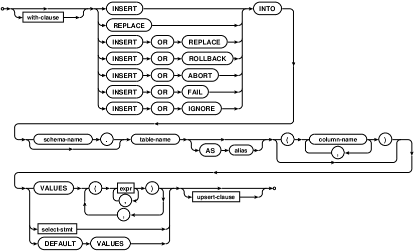
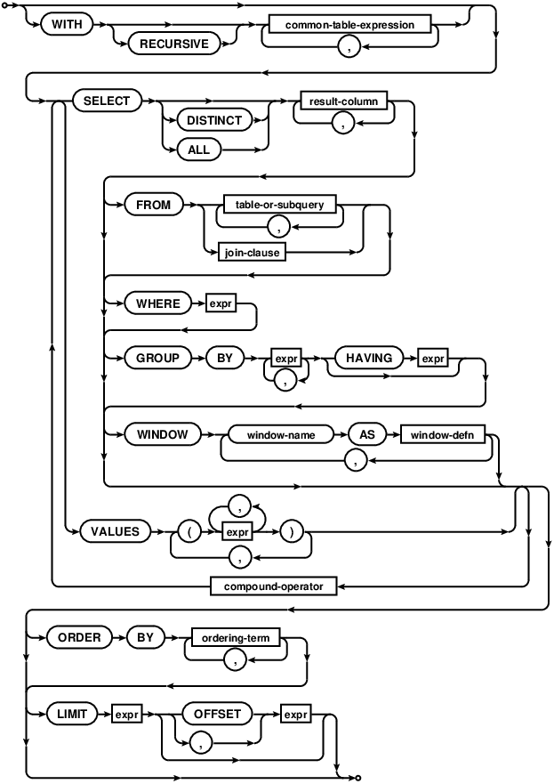
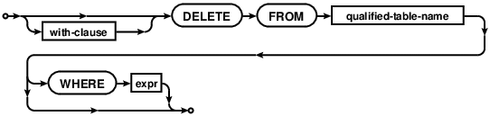

> 这是SQLite系列文章第一篇。
>
> 1. [SQLite的使用一](https://github.com/pro648/tips/wiki/SQLite%E7%9A%84%E4%BD%BF%E7%94%A8%E4%B8%80)
> 2. [SQLite的使用二](https://github.com/pro648/tips/wiki/SQLite%E7%9A%84%E4%BD%BF%E7%94%A8%E4%BA%8C)
> 3. [SQLite的使用三](https://github.com/pro648/tips/wiki/SQLite%E7%9A%84%E4%BD%BF%E7%94%A8%E4%B8%89)

SQLite 是遵守 ACID 的关系数据库管理系统（Relational database management system，简称RDBMS），包含在 C 库中。与其他数据库相比，SQLite 不是客户端、服务端数据库引擎，而是将其嵌入到客户端中。

这里将分为两篇文章介绍「SQLite的使用」，这一篇包含以下内容：

- 术语
  - 数据库
  - 数据库管理系统
  - 关系数据库管理系统
  - SQL
- SQLite 简介
- 安装 SQLite
- 数据类型
- 创建数据库
- 表
  - 创建表
  - 删除表
- 插入 INSERT
- 查询 SELECT
- 运算符
  - 算数运算符
  - 逻辑运算符
  - 比较运算符
- WHERE
- 更新 UPDATE
- 删除 DELETE

## 1. 术语

在学习 SQLite 之前，先了解几个与此相关的术语。

#### 1.1 数据库

数据库（database）是有组织的数据集合，通常在计算机系统中以电子的形式存储、查询。

#### 1.2 数据库管理系统

数据库管理系统（database management system，简称DBMS）是与数据库交互的软件。数据库、DBMS和关联的应用程序总和称为数据库系统。通常，数据库还用于宽泛的指代任何DBMS、数据库系统，或与数据库关联的应用程序。

#### 1.3 关系数据库管理系统

每个DBMS都有一个基础模型，该模型决定数据库的结构和恢复数据的方式。关系数据库管理系统是创建在关系模型基础上的数据库，借助集合代数等数学概念和方法来处理数据库中的数据。

关系模型由关系数据结构、关系操作集合、关系完整性约束三部分组成。

> RDBMS 以表的形式存储数据，DBMS 以文件的形式存储数据。
>
> DBMS 也可能使用表，但表之间没有关系。其数据通常以分层形式或导航形式存储。这意味着单个数据单元将具有一个父节点，零个、一个或多个子节点。
>
> 在 RDBMS 中，表具有称为主键（primary key）的标识符，数据以 table 的形式存储，这些数值之间的关系也将以 table 的形式存储。数值可以由系统更新，数据在物理和逻辑上是相互独立的。

常见 RDBMS 有 MySql、PostgreSQL、SQL Server Express、SQLite等。

#### 1.4 SQL

SQL 全称是 structured query language，指结构化查询语言。也就是 SQL 是用于访问和处理数据库的标准化的计算机语言。

虽然 SQL 是一门 ANSI 标准的计算机语言，但仍然存在着多种不同版本的 SQL 语言。为了与 ANSI 标准相兼容，它们必须以相似的方式共同支持一些主要的命令。例如，SELECT、UPDATE、DELETE、INSERT、WHERE等。

## 2. SQLite 简介

SQLite 是遵守 ACID 的关系数据库管理系统，它包含在 C 库中，实现了大多数 SQL 标准，通常遵循 PostgreSQL 语法。与其他数据库系统不同，SQLite 不是客户端/服务端数据库引擎，而是被集成到客户端中。

另外，SQLite 具有以下特点：

- 无需单独的服务器进程，或操作的系统（无服务器的）。
- 无需配置，也就是无需安装、管理。
- 一个完整的 SQLite 数据库是存储在一个单一的跨平台的磁盘文件。
- 文件小。完全配置时小于400kb，省略可选功能时小于250kb。
- 自给自足，无需任何外部依赖。
- 完全兼容ACID，允许从多个进程、线程安全访问。
- 支持SQL92 标准的大多数查询语言。
- 可在 UNIX（Linux、macOS、iOS、Android）和 Windows 中运行。
- 许可协议为公有领域（public domain）。

与其它 RDBMS 相比，SQLite 具有以下缺点：

- 没有用户管理和安全功能。
- 无法轻松扩展。
- 当数据量变大时，占用内存随之增多，且不易优化。
- 无法自定义。

SQLite 是嵌入式数据库软件的首选，是部署最广泛的数据库引擎之一，被主流浏览器、操作系统、移动设备所使用。

> ACID 是指 DBMS 在写入、更新资料过程中，为保证事务（transaction）是正确可靠的，所必须具备的四个特性：
>
> - 原子性 atomicity：一个事务中的所有操作，或者全部完成，或者全部不完成，不会结束在中间某个环节。事务在执行过程中发生错误，会被回滚（rollback）到事务开始前的状态，就像这个事务从来没有执行过一样。即，事务不可分割、不可约简。
> - 一致性 consistency：在事务开始之前和结束之后，数据库的完整性没有被破坏。即写入的资料完全符合预设约束、触发器、级联回滚等。
> - 隔离性 isolation：数据库允许多个并发事务同时对其数据进行读写和修改的能力，隔离性可以防止多个事务并发执行时，由于交叉执行而导致数据的不一致。
> - 持久性 durability：事务处理结束后，对数据的修改就是持久的，即便系统故障也不会丢失。
>
> 在数据库系统中，一个事务指：由一系列数据库操作组成的一个完整的逻辑过程。如银行转账，从原账户扣除金额、向目标账户添加金额，这两个数据库操作的总和构成一个完整的逻辑过程，不可拆分。这个过程被称为一个事务，具有ACID特性。

## 3. 安装 SQLite

在命令后输入`sqlite3`即可查看是否安装了`SQLite`：

```
$ sqlite3
SQLite version 3.28.0 2019-04-15 14:49:49
Enter ".help" for usage hints.
Connected to a transient in-memory database.
Use ".open FILENAME" to reopen on a persistent database.
sqlite> 
```

Linux 和 macOS 预装了 SQLite。如果你的操作系统没有预装 SQLite，访问[SQLite 下载页面](https://www.sqlite.org/download.html)根据提示安装即可。

## 4. 点命令

这一部分介绍 SQLite 的点命令，其不以分号结束。

输入`.help`可获取点命令清单。如下所示：

```
sqlite> .help
.databases               List names and files of attached databases
.mode MODE ?TABLE?       Set output mode
.quit                    Exit this program
.save FILE               Write in-memory database into FILE
.schema ?PATTERN?        Show the CREATE statements matching PATTERN
.show                    Show the current values for various settings
.stats ?on|off?          Show stats or turn stats on or off
.tables ?TABLE?          List names of tables matching LIKE pattern TABLE
.timeout MS              Try opening locked tables for MS milliseconds
.timer on|off            Turn SQL timer on or off
.width NUM1 NUM2 ...     Set column widths for "column" mode\
...
```

可以使用下面点命令自定义输出格式：

```
sqlite> .header on
sqlite> .mode column
sqlite> .timer on
```

上面设置将产生如下格式的输出：

```
ID          NAME        AGE         ADDRESS     SALARY    
----------  ----------  ----------  ----------  ----------
1           Paul        32          California  20000.0   
2           Allen       25          Texas       15000.0   
3           Teddy       23          Norway      20000.0   
4           Mark        25          Rich-Mond   65000.0   
5           David       27          Texas       85000.0   
6           Kim         22          South-Hall  45000.0   
7           James       24          Houston     10000.0   
Run Time: real 0.001 user 0.000113 sys 0.000087
```

## 5. 数据类型

SQLite 使用一个更普遍的动态类型系统，值的数据类型与值本身是相关的，与其容器无关。

#### 5.1 存储类

每个存储在 SQLite 数据库中的值都具有以下存储类之一：

| 存储类  | 描述                                                         |
| ------- | ------------------------------------------------------------ |
| NULL    | 值是一个 NULL 值。                                           |
| INTEGER | 值是一个带符号的整数。根据值大小存储在1、2、3、4、6或8个字节中。 |
| REAL    | 值是一个浮点值。存储为8个字节的 IEEE 浮点数字。              |
| TEXT    | 值是一个文本字符串，使用数据库编码（UTF-8、UTF-16BE或 UTF-16LE）存储。 |
| BLOB    | 完全根据输入存储。                                           |

存储类比数据类稍微普遍些。例如，INTEGER 存储类包含六种不同长度的整数数据类型。

#### 5.2 亲和类型 Affinity

SQLite 支持亲和类型概念，列内可以存储任何类型的数据。当数据插入时，该字段的数据将会优先采用亲缘类型作为该值的存储方式。目前支持以下五种亲缘类型：

| 亲和类型 | 描述                                                         |
| -------- | ------------------------------------------------------------ |
| TEXT     | 数值型数据在被插入之前，需要先被转换为文本格式再插入到目标字段中。 |
| NUMERIC  | 当文本数据被插入到亲缘性为NUMERIC的字段中时，如果转换操作不会导致信息丢失以及完全可逆，会将文本数据转换为INTEGER或REAL类型数据，如果转换失败，仍会以TEXT方式存储该数据；<br>NULL和BLOB类型数据，不做任何转换，直接存储；<br>浮点格式的常量文本，如`3000.0`。如果该值可以转换为INTEGER，同时又不丢失数值信息，则会转为INTEGER存储。 |
| INTEGER  | 规则与NUMERIC相同，唯一差别在执行CAST表达式。                |
| REAL     | 规则基本等同于NUMERIC。唯一差别是不会将`3000.0`这样的文本数据转换为INTEGER存储。 |
| NONE     | 不做任何转换，直接以该数据所属的数据类型进行存储。           |

#### 5.3 数据类型与亲和类型对照

下面列出了数据类型和亲和类型的对应关系：

| 亲和类型 | 数据类型                                                     |
| -------- | ------------------------------------------------------------ |
| INTEGER  | INT、INTEGER、TINYINT、SMALLINT、MEDIUMINT、BEGINT、UNSIGNED BIG INT、INT2、INT8 |
| TEXT     | CHARACTER(20)、VARCHAR(255)、VARYING CHARACTER(255)、NCHAR(55)、NATIVE CHARACTER(70)、NVARCHAR(100)、TEXT、CLOB |
| NONE     | BLOB、no datatype specified                                  |
| REAL     | REAL、DOUBLE、DOUBLE PRECISION、FLOAT                        |
| NUMERIC  | NUMERIC、DECIMAL(10.5)、BOOLEAN、DATEDATETIME                |

> SQLite 没有单独 Boolean 存储类。布尔值被存储为整数0和1。也没有日期、时间存储类，将日期、时间存储为TEXT、REAL或INTEGER值。

## 6. 创建数据库

#### 6.1 语法

使用`sqlite3`命令创建数据库，语法如下：

```
$ sqlite3 DatabaseName.db
```

#### 6.2 示例

如果想创建名称为`LearnDB.db`的数据库，命令如下：

```
$ sqlite3 LearnDB.sql
SQLite version 3.28.0 2019-04-15 14:49:49
Enter ".help" for usage hints.
sqlite> 
```

> 数据库名称应唯一。

与其他数据库管理系统不同，SQLite 不支持 DROP DATABASE 语句。如果想要删除数据库，直接删除文件即可。

## 7. 表 Table

#### 7.1 创建表

`CREATE TABLE`语句用于创建表。创建时指定表名称，定义列以及每列数据类型。

###### 7.1.1 语法



CREATE TABLE 语法如下：

```
CREATE TABLE table_name(
	column1 datatype PRIMARY KEY,
	column2 datatype,
	column3 datatype,
	...
	columnN datatype,
);
```

###### 7.1.2 示例

下面创建了一个 COMPANY 表，ID 作为主键，NOT NULL 约束标记字段不能为 NULL：

```
sqlite> CREATE TABLE COMPANY(
   ...> ID INT PRIMARY KEY NOT NULL,
   ...> NAME TEXT NOT NULL,
   ...> AGE INT NOT NULL,
   ...> ADDRESS CHAR(50),
   ...> SALARY REAL
   ...> );
```

再创建一个 CLASS 表，以便后续部分使用：

```
sqlite> CREATE TABLE CLASS(
   ...> ID INT PRIMARY KEY NOT NULL,
   ...> NAME TEXT NOT NULL,
   ...> CLASS_ID INT NOT NULL
   ...> );
```

`.tables`命令可以列出数据库中的所有表：

```
sqlite> .tables
CLASS    COMPANY
```

`.schema`命令可以查看表的完整信息：

```
sqlite> .schema
CREATE TABLE COMPANY(
ID INT PRIMARY KEY NOT NULL,
NAME TEXT NOT NULL,
AGE INT NOT NULL,
ADDRESS CHAR(50),
SALARY REAL
);
```

#### 7.2 删除表

DROP TABLE 语句删除使用 CREATE TABLE 语句创建的表，删除的表会彻底从数据库、文件中移除，不可恢复。表关联的索引、触发器、约束会被同步删除。

###### 7.2.1 语法



DROP TABLE 语句语法如下：

```
DROP TABLE IF EXISTS table-name
```

可选的 IF EXISTS 子句可抑制表不存在导致的错误。

###### 7.2.2 示例

先确认 CLASS 表存在，再将其删除：

```
sqlite> .tables
CLASS    COMPANY
sqlite> DROP TABLE IF EXISTS CLASS;
sqlite> .tables
COMPANY
```

现在已经无法找到 CLASS 表了。

## 8. 插入 INSERT

INSERT INTO 语句用于向表中添加新的行。

#### 8.1 语法



INSERT INTO 语句有两种语法，如下所示：

```
// 第一种
INSERT INTO TABLE_NAME [(column1, column2, column3, ... columnN)]
VALUES (value1, value2, value3, ... valueN);

// 第二种
INSERT INTO TABLE_NAME VALUES (value1, value2, value3, ... valueN);
```

column1、column2 是要插入数据列的名称。如果要为所有列添加值，可以使用第二种方式，但值顺序必须与列在表中的顺序一致。

#### 8.2 示例

LearnDB.sql 数据库中已经有了 COMPANY 表，如下所示：

```
sqlite> .schema
CREATE TABLE COMPANY(
ID INT PRIMARY KEY NOT NULL,
NAME TEXT NOT NULL,
AGE INT NOT NULL,
ADDRESS CHAR(50),
SALARY REAL
);
```

使用以下语句在表中创建七条记录：

```
sqlite> INSERT INTO COMPANY (ID, NAME, AGE, ADDRESS, SALARY)
   ...> VALUES (1, 'Paul', 32, 'California', 20000.00 );
sqlite> INSERT INTO COMPANY (ID, NAME, AGE, ADDRESS, SALARY)
   ...> VALUES (2, 'Allen', 25, 'Texas', 15000.00 );
sqlite> INSERT INTO COMPANY (ID, NAME, AGE, ADDRESS, SALARY)
   ...> VALUES (3, 'Teddy', 23, 'Norway', 20000.00 );
sqlite> INSERT INTO COMPANY (ID, NAME, AGE, ADDRESS, SALARY)
   ...> VALUES (4, 'Mark', 25, 'Rich-Mond', 65000.00 );
sqlite> INSERT INTO COMPANY (ID, NAME, AGE, ADDRESS, SALARY)
   ...> VALUES (5, 'David', 27, 'Texas', 85000.00 );
sqlite> INSERT INTO COMPANY (ID, NAME, AGE, ADDRESS, SALARY)
   ...> VALUES (6, 'Kim', 22, 'South-Hall', 45000.00 );
sqlite> INSERT INTO COMPANY VALUES (7, 'James', 24, 'Houston', 10000.00 );
```

目前表记录如下：

```
sqlite> SELECT * FROM COMPANY;
ID          NAME        AGE         ADDRESS     SALARY    
----------  ----------  ----------  ----------  ----------
1           Paul        32          California  20000.0   
2           Allen       25          Texas       15000.0   
3           Teddy       23          Norway      20000.0   
4           Mark        25          Rich-Mond   65000.0   
5           David       27          Texas       85000.0   
6           Kim         22          South-Hall  45000.0   
7           James       24          Houston     10000.0   
Run Time: real 0.001 user 0.000113 sys 0.000087
```

#### 8.3 使用一个表来填充另一个表

还可以通过在有一组字段的表上使用 select 语句，填充数据到另一个表中。如下所示：

```
sqlite> INSERT INTO target_table_name [(column1, column2, ... columnN)]
   ...> SELECT column1, column2, ... columnN
   ...> FROM source_table_name
   ...> [WHERE condition];
```

## 9. 查询 SELECT

SELECT 语句用于从数据库中获取数据，以表的形式返回数据。

#### 9.1 语法



SELECT 语句基本语法如下：

```
SELECT column1, column2, columnN FROM table_name;
```

column1、column2... 是表的字段，即想要获取的值。如果想要获取所有字段，使用下面语句：

```
SELECT * FROM table_name;
```

#### 9.2 示例

使用SELECT语句获取 COMPANY 表所有记录：

```
sqlite> SELECT * FROM COMPANY;
ID          NAME        AGE         ADDRESS     SALARY    
----------  ----------  ----------  ----------  ----------
1           Paul        32          California  20000.0   
2           Allen       25          Texas       15000.0   
3           Teddy       23          Norway      20000.0   
4           Mark        25          Rich-Mond   65000.0   
5           David       27          Texas       85000.0   
6           Kim         22          South-Hall  45000.0   
7           James       24          Houston     10000.0   
Run Time: real 0.000 user 0.000108 sys 0.000096
```

如果只想获取指定字段，使用以下语句：

```
sqlite> SELECT ID, NAME, ADDRESS FROM COMPANY;
ID          NAME        ADDRESS   
----------  ----------  ----------
1           Paul        California
2           Allen       Texas     
3           Teddy       Norway    
4           Mark        Rich-Mond 
5           David       Texas     
6           Kim         South-Hall
7           James       Houston   
Run Time: real 0.000 user 0.000145 sys 0.000109
```

#### 9.3 Schema 信息

点命令只能在 SQLite 提示符中使用，编程时如需列出数据库中所有的表，使用以下语句：

```
sqlite> SELECT tbl_name FROM sqlite_master WHERE type = 'table';
tbl_name  
----------
COMPANY   
Run Time: real 0.001 user 0.000101 sys 0.000142
```

如需获取 COMPANY 完整信息，使用以下语句：

```
sqlite> SELECT sql FROM sqlite_master WHERE type = 'table' AND tbl_name = 'COMPANY';
sql                                                                                                                     
--------------------------------------------------------------------------------------
CREATE TABLE COMPANY(
ID INT PRIMARY KEY NOT NULL,
NAME TEXT NOT NULL,
AGE INT NOT NULL,
ADDRESS CHAR(50),
SALARY REAL
)
Run Time: real 0.000 user 0.000082 sys 0.000073
```

## 10. 运算符

运算符是一个保留字、字符，主要用于 WHERE 子句中执行操作。

#### 10.1 算数运算符

支持的算数运算符有+、-、*、/、%五种，

#### 10.2 比较运算符

比较运算符支持以下类型：

- == 检查操作数值是否相等。如果相等则条件为真。
- = 与 == 一样。
- != 检查操作数值是否相等。如果不相等则条件为真。
- <> 与 != 一样。
- 此外，还支持>、<、>=、<=、!<、!>。

#### 10.3 逻辑运算符

逻辑运算符支持以下类型：

- AND：允许 WHERE 子句存在多个条件，均成立时，子句为真。
- BETWEEN：指定值范围。
- EXISTS：用于在满足一定条件的指定表中搜索行是否存在。
- IN：用于把指定值与一系列值进行比较。
- NOT IN：IN 的对立面。
- LIKE：将指定值与使用通配符的值进行比较。
- GLOB：与 LIKE 类似，但 GLOB 区分大小写。
- NOT：否定运算符，
- OR：允许 WHERE 子句存在多个条件，有一个成立即为真。
- IS NULL：与 NULL 比较。
- IS：与 = 相似。
- IS NOT：与 != 相似。
- || ：连接两个不同的字符串，得到一个新的字符串。
- UNIQUE：搜索表中的每一行，确保无重复。

## 11. WHERE

WHERE 指定获取数据的条件。表中每一行均会与 WHERE 表达式匹配，只有表达式为真时，才返回指定值。

#### 11.1 语法

带有 WHERE 子句的 SELECT 语句的基本语法如下：

```
SELECT column1, column2, columnN
FROM table_name
WHERE [condition]
```

#### 11.2 示例

下面的 SELECT 语句列出了 COMPANY 表 AGE 大于等于25且工资大于等于65000.00的所有记录：

```
sqlite> SELECT * FROM COMPANY WHERE AGE >= 25 AND SALARY >= 65000.00;
ID          NAME        AGE         ADDRESS     SALARY    
----------  ----------  ----------  ----------  ----------
4           Mark        25          Rich-Mond   65000.0   
5           David       27          Texas       85000.0   
Run Time: real 0.005 user 0.000316 sys 0.002061
```

下面 SELECT 语句列出了 COMPANY 表 NAME 以 'Ki' 开始的所有记录，‘Ki’之后字符不做限制：

```
sqlite> SELECT * FROM COMPANY WHERE NAME LIKE 'KI%';
ID          NAME        AGE         ADDRESS     SALARY    
----------  ----------  ----------  ----------  ----------
6           Kim         22          South-Hall  45000.0   
Run Time: real 0.000 user 0.000130 sys 0.000155
```

下面的 SELECT 语句，子查询查找 SALARY > 65000 的带有 AGE 字段的所有记录，后边的 WHERE 子句与 EXISTS 运算符一起使用，列出了外查询中的 AGE 存在于子查询返回的结果中的所有记录：

```
sqlite> SELECT AGE FROM COMPANY
   ...> WHERE EXISTS (SELECT AGE FROM COMPANY WHERE SALARY > 65000);
AGE       
----------
32        
25        
23        
25        
27        
22        
24        
Run Time: real 0.000 user 0.000112 sys 0.000128
```

> WHERE子句不仅可以用在 SELECT 语句中，还可以用在UPDATE、DELETE语句中。

## 12. 更新 UPDATE

UPDATE 语句用于修改表中的零行、多行的值。

#### 12.1 语法


UPDATE 语句基本语法如下：

```
UPDATE table_name
SET column1 = value1, column2 = value2 ..., columnN = valueN
WHERE [condition];
```

WHERE 子句可以组合使用运算符。如果没有 WHERE 子句，则修改所有行的值；反之，只修改 WHERE 子句为真的行。

SET 关键字后赋值语句决定修改哪些字段。每个赋值语句左侧指定要修改的字段，右侧指定值。如果单个字段名称出现多次，则只采取最后一次设置的值，并忽略前面所有赋值。未出现字段名称的行，值保持不变。WHERE 表达式可能引用要更新的行，此时会先评估所有表达式，再进行赋值。

#### 12.2 示例

下面语句会更新 ID 为6的客户地址：

```
sqlite> SELECT * FROM COMPANY;
ID          NAME        AGE         ADDRESS     SALARY    
----------  ----------  ----------  ----------  ----------
1           Paul        32          California  20000.0   
2           Allen       25          Texas       15000.0   
3           Teddy       23          Norway      20000.0   
4           Mark        25          Rich-Mond   65000.0   
5           David       27          Texas       85000.0   
6           Kim         22          South-Hall  45000.0   
7           James       24          Houston     10000.0   
Run Time: real 0.000 user 0.000145 sys 0.000097

sqlite> UPDATE COMPANY SET ADDRESS = 'Texas' WHERE ID = 6;
Run Time: real 0.004 user 0.000165 sys 0.003125

sqlite> SELECT * FROM COMPANY;
ID          NAME        AGE         ADDRESS     SALARY    
----------  ----------  ----------  ----------  ----------
1           Paul        32          California  20000.0   
2           Allen       25          Texas       15000.0   
3           Teddy       23          Norway      20000.0   
4           Mark        25          Rich-Mond   65000.0   
5           David       27          Texas       85000.0   
6           Kim         22          Texas       45000.0   
7           James       24          Houston     10000.0   
Run Time: real 0.000 user 0.000160 sys 0.000160
```

可以看到地址信息更新前为”South-Hall“，更新后为“Texas”。

## 13. 删除 DELETE

DELETE 语句用于删除表中已有记录。

#### 13.1 语法



```
DELETE FROM table_name
WHERE [condition];
```

如果没有 WHERE 子句，则删除所有记录；如果提供了 WHERE 子句，则仅删除子句表达式为true的行，表达式为false或NULL的行会被保留。

#### 13.2 示例

下面语句会删除 ID 为7的客户：

```
sqlite> DELETE FROM COMPANY WHERE ID = 7;
Run Time: real 0.002 user 0.000128 sys 0.001266

sqlite> SELECT * FROM COMPANY;
ID          NAME        AGE         ADDRESS     SALARY    
----------  ----------  ----------  ----------  ----------
1           Paul        32          California  20000.0   
2           Allen       25          Texas       15000.0   
3           Teddy       23          Norway      20000.0   
4           Mark        25          Rich-Mond   65000.0   
5           David       27          Texas       85000.0   
6           Kim         22          Texas       45000.0   
Run Time: real 0.001 user 0.000166 sys 0.000179
```

> 下一篇文章[SQLite的使用二](https://github.com/pro648/tips/wiki/SQLite%E7%9A%84%E4%BD%BF%E7%94%A8%E4%BA%8C)将继续介绍SQLite的用法。

