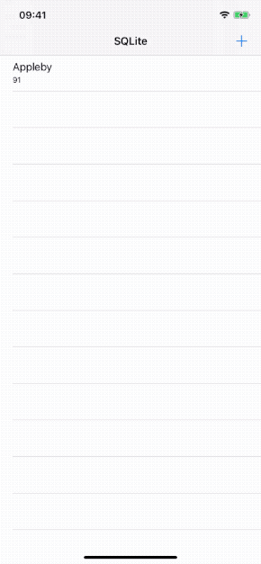

> 这是SQLite系列文章第三篇。
>
> 1. [SQLite的使用一](https://github.com/pro648/tips/wiki/SQLite%E7%9A%84%E4%BD%BF%E7%94%A8%E4%B8%80)
> 2. [SQLite的使用二](https://github.com/pro648/tips/wiki/SQLite%E7%9A%84%E4%BD%BF%E7%94%A8%E4%BA%8C)
> 3. [SQLite的使用三](https://github.com/pro648/tips/wiki/SQLite%E7%9A%84%E4%BD%BF%E7%94%A8%E4%B8%89)

[SQLite的使用一](https://github.com/pro648/tips/wiki/SQLite%E7%9A%84%E4%BD%BF%E7%94%A8%E4%B8%80)、[SQLite的使用二](https://github.com/pro648/tips/wiki/SQLite%E7%9A%84%E4%BD%BF%E7%94%A8%E4%BA%8C)这两篇文章主要介绍了 SQLite 的基本语句。这篇文章将介绍 Swift 中如何使用 SQLite，包含以下操作：

- 创建数据库。
- 创建表。
- 插入。
- 查询。
- 更新。
- 删除。
- 关闭。

完成后运行如下：



## 1. 创建数据库

首先，创建数据库：

```
    private func openDatabase() -> OpaquePointer? {
        let documentsPath = FileManager.default.urls(for: .documentDirectory, in: .userDomainMask).first
        let dbPath = documentsPath?.appendingPathComponent(dbName).path
        
        var db: OpaquePointer?
        if sqlite3_open(dbPath, &db) == SQLITE_OK {
            return db
        } else {
            defer {
                if db != nil {
                    sqlite3_close(db)
                }
            }
            
            let errorMes = String(cString: sqlite3_errmsg(db))
            print("Unable to open database  \(errorMes)")
            return nil
        }
    }
```

`sqlite3_open(const char *filename, sqlite3 **ppDb)`函数创建数据库（如果不存在）并建立连接。即使发生了错误，database connection 也通过 *ppDb 返回。只有当 SQLite 无法为对象分配内存时，才会将NULL写入 *ppDb，否则统一将 sqlite3 对象写入 *ppDb。当建立连接成功时，返回`SQLITE_OK`；反之，返回错误原因。使用`sqlite3_errmsg()`函数获取具体错误原因。

`OpaquePointer`是 Swift 类型 C pointer。

无论建立连接的过程中是否发生错误，使用 database connection 关联的指针均需使用`sqlite3_close()`函数释放。

很多 SQLite 函数都会返回 Int32 的状态码，一般为常量。例如，`SQLITE_OK`值为`0`。[文档](https://www.sqlite.org/rescode.html#ok)中可以查到所有状态码。

## 2. 创建表

这一部分使用代码创建表。表名称为`PersonInfo`，包含五列。id 列为主键，integer 类型，值自增；name列为 char(255)，不可为空。age 列为 char(255)，不可为空。最后两列记录时间，默认记录当前时间。如下所示：

```
    private func createTable(tbName: String) {
        let queryString = """
        CREATE TABLE IF NOT EXISTS \(tbName)
        ( id INTEGER PRIMARY KEY AUTOINCREMENT,
        name char(255) NOT NULL,
        age char(255) NOT NULL,
        createTime timestamp TimeStamp NOT NULL DEFAULT (datetime('now','localtime')),
        updateTime timestamp TimeStamp NOT NULL DEFAULT (datetime('now','localtime'))
        );
        """
        
        var createTableStatement: OpaquePointer?
        
        if sqlite3_prepare_v2(db, queryString, -1, &createTableStatement, nil) == SQLITE_OK {
            if sqlite3_step(createTableStatement) == SQLITE_DONE {
                print("\(tableName) table created")
            } else {
                print("\(tableName) is not created")
            }
        } else {
            print("Create table statement is not prepared")
        }
        
        sqlite3_finalize(createTableStatement)
    }
```

要执行的 SQL 语句，必须先使用`sqlite3_prepare_v2(sqlite3 *db, const char *zSql, int nByte, sqlite3_stmt **ppStmt, const char **pzTail)`函数编译为字节码程序。也就是，`sqlite3_prepare_v2()`函数是语句对象的构造函数。该函数各参数含义如下：

- db：之前调用`sqlite3_open()`函数获取的 database connection。
- zSql：使用UTF-8编码的执行语句。
- nByte：如果为负，则读取zSql到第一个终止符；如果为正，则表示要从zSql读取的字节数；如果为零，则不生成语句。如果调用者知道zSql字符串以nul终止，直接传递包含nul终止符的字节数可以提高性能。
- ppStmt：指向编译好的 prepared_statement，可以使用`sqlite3_step()`函数执行。
- pzTail：如果pzTail不为NULL，则 *pzTail 指向zSql中第一个SQL语句后的第一个字节。`sqlite3_prepare_v2()`仅编译一条语句，因此， *pzTail指向未编译的内容。

编译成功后返回`SQLITE_OK`；反之，返回错误码。

`sqlite3_step()`函数执行编译后的语句。

`int sqlite3_finalize(sqlite3_stmt *pStmp);`函数用于删除prepared_statement。如果最近一次执行未出现错误，或从未执行过，则返回`SQLITE_OK`；如果最近执行失败，则返回相应错误码。`sqlite3_finalize()`函数可以在任何时刻调用，即使在NULL指针上调用也不会产生危害。但如果没有调用，则会产生内存泄漏。调用之后再次使用prepared_statement会产生无法预期的后果。

> 也可以在外部创建数据库，导入后使用。

## 3. 插入数据

之前已经使用`sqlite3_prepare_v2()`函数编译语句，`?`符号标记执行时才提供具体值。这样可以提前编译、提高性能，也可以复用编译语句。

如下所示：

```
    func insert(contact: Contact) {
        let insertString = """
        INSERT INTO \(tableName) (name, age) VALUES(?, ?);
        """
        
        var insertStatement: OpaquePointer?
        if sqlite3_prepare_v2(db, insertString, -1, &insertStatement, nil) == SQLITE_OK {
            sqlite3_bind_text(insertStatement, 1, strdup(contact.name), -1, free)
            sqlite3_bind_text(insertStatement, 2, strdup(contact.age), -1, free)
            
            if sqlite3_step(insertStatement) == SQLITE_DONE {
                print("Successfully inserted row.")
            } else {
                print("Could not insert row.")
            }
        } else {
            print("INSERT statement is not prepared.")
        }
        
        sqlite3_finalize(insertStatement)
    }
```

与`sqlite3_bind_text()`函数功能类似的还有以下函数：

```
int sqlite3_bind_blob(sqlite3_stmt*, int, const void*, int n, void(*)(void*));
int sqlite3_bind_blob64(sqlite3_stmt*, int, const void*, sqlite3_uint64,
                        void(*)(void*));
int sqlite3_bind_double(sqlite3_stmt*, int, double);
int sqlite3_bind_int(sqlite3_stmt*, int, int);
int sqlite3_bind_int64(sqlite3_stmt*, int, sqlite3_int64);
int sqlite3_bind_null(sqlite3_stmt*, int);
int sqlite3_bind_text(sqlite3_stmt*,int,const char*,int,void(*)(void*));
int sqlite3_bind_text16(sqlite3_stmt*, int, const void*, int, void(*)(void*));
int sqlite3_bind_text64(sqlite3_stmt*, int, const char*, sqlite3_uint64,
                         void(*)(void*), unsigned char encoding);
int sqlite3_bind_value(sqlite3_stmt*, int, const sqlite3_value*);
int sqlite3_bind_pointer(sqlite3_stmt*, int, void*, const char*,void(*)(void*));
int sqlite3_bind_zeroblob(sqlite3_stmt*, int, int n);
int sqlite3_bind_zeroblob64(sqlite3_stmt*, int, sqlite3_uint64);
```

`sqlite3_bind_*()`第一个参数是指向`sqlite3_stmt`对象的指针。

第二个参数是要设置的SQL语句参数索引，最左侧索引为一。

第三个参数是要设置的值。如果为`sqlite3_bind_text()`、`sqlite3_bind_text16()`和`sqlite3_bind_blob()`设置NULL，则自动忽略第四个参数，且和`sqlite3_bind_null()`函数效果一致。

第四个参数为参数字节数，非字符数。`sqlite3_bind_text()`和`sqlite3_bind_text16()`函数第四个参数为负时，表示字符长度至第一个终止符。`sqlite3_bind_blob()`函数第四个参数为负时，结果将不可预期。`sqlite3_bind_text`、`sqlite3_bind_text16()`和`sqlite3_bind_text64()`函数第四个参数如果非负，则该参数必须是字符以NUL终止情况下其字节偏移量。如果NUL字符字节偏移量小于第四个参数的值，则结果字符串值将包含嵌入的NUL。涉及带有NUL字符串的表达式结果是不确定的。

BLOB和字符绑定接口的第五个参数是析构函数。用于在 SQLite 处理完毕 BLOB、字符串后，处理 BLOB、字符串。即使绑定失败，也会调用析构函数。

## 4. 查询

使用以下函数查询数据库：

```
    func query(uniqueId: Int32) -> ContactDetail? {
        let queryString = """
        SELECT id, name, age, createTime, updateTime FROM \(tableName)
        WHERE ID = '\(uniqueId)';
        """
        
        var queryStatement: OpaquePointer?
        if sqlite3_prepare_v2(db, queryString, -1, &queryStatement, nil) == SQLITE_OK {
            if sqlite3_step(queryStatement) == SQLITE_ROW {
                let id = sqlite3_column_int(queryStatement, 0)
                let queryResult2 = sqlite3_column_text(queryStatement, 1)
                let queryResult3 = sqlite3_column_text(queryStatement, 2)
                let queryResult4 = sqlite3_column_text(queryStatement, 3)
                let queryResult5 = sqlite3_column_text(queryStatement, 4)
                
                let name = String(cString: queryResult2!)
                let age = String(cString: queryResult3!)
                let insertDate = String(cString: queryResult4!)
                let updateDate = String(cString: queryResult5!)
                
                let detail = ContactDetail(id: id, name: name, age: age, insertDate: insertDate, updateDate: updateDate)
                sqlite3_finalize(queryStatement)
                return detail
            } else {
                print("Could not QUERY")
            }
        } else {
            print("QUERY is not prepared")
        }
        sqlite3_finalize(queryStatement)
        return nil;
    }
```

通过`sqlite3_column_int()`和`sqlite3_column_text()`函数提取查询结果中的值。这里索引从零开始。查询语句也可以使用`SELECT * FROM \(tableName) WHERE ID= '\(uniqueId)'`，但列出要查询的id、name、age等是一种更好的习惯，这样表后续发生变化时不会影响查询结果。

如果要查询所有记录，代码如下：

```
    func queryAllContacts() -> [Contact] {
        let queryAllString = """
        SELECT id, name, age FROM \(tableName);
        """
        
        let retval = NSMutableArray.init()
        var queryAllStatement: OpaquePointer?
        if sqlite3_prepare_v2(db, queryAllString, -1, &queryAllStatement, nil) == SQLITE_OK {
            while sqlite3_step(queryAllStatement) == SQLITE_ROW {
                let id = sqlite3_column_int(queryAllStatement, 0)
                let queryResult2 = sqlite3_column_text(queryAllStatement, 1)
                let queryResult3 = sqlite3_column_text(queryAllStatement, 2)
                
                let name = String(cString: queryResult2!)
                let age = String(cString: queryResult3!)
                let contact = Contact(id: id, name: name, age: age)
                
                retval.add(contact)
            }
        } else {
            print("SELECT ALL is not prepared.")
        }
        
        sqlite3_finalize(queryAllStatement)
        return retval as! [Contact]
    }
```

## 5. 更新

使用以下函数更新数据库：

```
    func update(contact: Contact) {
        let updateString = """
        UPDATE \(tableName) SET name = '\(contact.name)', age = '\(contact.age)', updateTime = datetime('now','localtime')
        WHERE id = '\(contact.id)';
        """
        
        var updateStatement: OpaquePointer?
        if sqlite3_prepare_v2(db, updateString, -1, &updateStatement, nil) == SQLITE_OK {
            if sqlite3_step(updateStatement) == SQLITE_DONE {
                print("Successfully update row \(contact.name).")
            } else {
                print("Couldn't update row \(contact.name).")
            }
        } else {
            print("UPDATE is not prepared.")
        }
        
        sqlite3_finalize(updateStatement)
    }
```

这里与前面的流程一致，也是prepare、step、finalize。

> 这里更新数据后，会同步更新 updateTime。

## 6. 删除

使用以下函数删除记录：

```
    func delete(contact: Contact) {
        let deleteString = """
        DELETE FROM \(tableName) WHERE id = '\(contact.id)';
        """
        
        var deleteStatement: OpaquePointer?
        if sqlite3_prepare_v2(db, deleteString, -1, &deleteStatement, nil) == SQLITE_OK {
            if sqlite3_step(deleteStatement) == SQLITE_DONE {
                print("Successfully delete row \(contact.name).")
            } else {
                print("Couldn't delete row \(contact.name).")
            }
        } else {
            print("DELETE is not prepared.")
        }
        sqlite3_finalize(deleteStatement)
    }
```

## 7. 关闭

不再需要数据库连接后，需手动将其关闭。

`sqlite3_close()`和`sqlite3_close_v2()`是sqlite3对象的析构函数。如果sqlite3对象已成功销毁，且所有资源都已释放，则该析构函数返回`SQLITE_OK`。

当 database connection 有未 finalize 的 prepare statement，或未完成的`sqlite3_backup`对象时，调用`sqlite3_close()`将返回`SQLITE_BUSY`，且数据库未关闭；如果调用`sqlite3_close_v2()`，则 database connection 将成为野指针，等最后一个 prepare statement、`sqlite3_back`完成后，自动释放 database connection。`sqlite3_close_v2()`用于具有垃圾回收、任意顺序调用析构函数的宿主语言。

> 如果事务正在进行时销毁了 sqlite3 对象，则该事务将自动回滚。

调用`sqlite3_close()`函数如下：

```
    deinit {
        sqlite3_close(db)
    }
```

现在，已经介绍了 SQLite 常见语句和在 Swift 中用法，但这里使用的 C API，[SQLite.swift](https://github.com/stephencelis/SQLite.swift)和[FMDB](https://github.com/ccgus/fmdb)封装了 SQLite，提供了 Ojbective-C、Swift接口。

> 上一篇：[SQLite的使用二](https://github.com/pro648/tips/wiki/SQLite%E7%9A%84%E4%BD%BF%E7%94%A8%E4%BA%8C)

Demo名称：SQLite  
源码地址：<https://github.com/pro648/BasicDemos-iOS/tree/master/SQLite>

参考资料：

1. [SQLite With Swift Tutorial: Getting Started](https://www.raywenderlich.com/6620276-sqlite-with-swift-tutorial-getting-started)
2. [Swift 4 + SQLite when inserting](https://stackoverflow.com/questions/52544093/swift-4-sqlite-when-inserting)
3. [Transaction Control Language](https://www.oreilly.com/library/view/using-sqlite/9781449394592/ch04s07.html)

