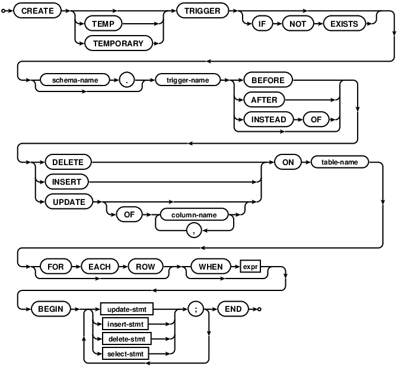
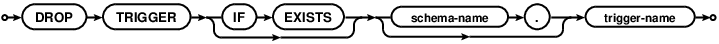
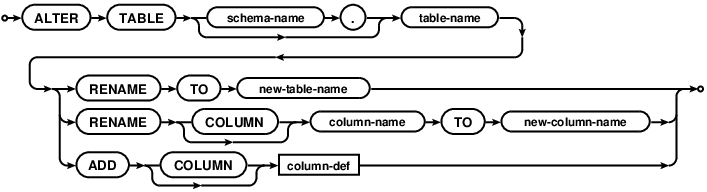
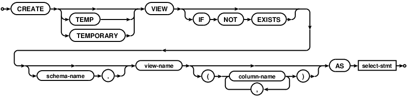
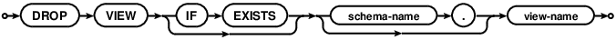

> 这是SQLite系列文章第二篇。
>
> 1. [SQLite的使用一](https://github.com/pro648/tips/wiki/SQLite%E7%9A%84%E4%BD%BF%E7%94%A8%E4%B8%80)
> 2. [SQLite的使用二](https://github.com/pro648/tips/wiki/SQLite%E7%9A%84%E4%BD%BF%E7%94%A8%E4%BA%8C)
> 3. [SQLite的使用三](https://github.com/pro648/tips/wiki/SQLite%E7%9A%84%E4%BD%BF%E7%94%A8%E4%B8%89)

这篇文章涉及以下内容：

- LIKE
- LIMIT
- ORDER BY
- GROUP BY
- HAVING
- DISTINCT
- 触发器 TRIGGER
  - 创建触发器
  - 列出触发器
  - 删除触发器
- ALTER
  - 重命名表
  - 重命名列
  - 添加列
- VIEW

## 1. LIKE

LIKE 运算符用来匹配包含通配符的文本。如果搜索表达式与模式表达式匹配，返回true；反之，返回false。

有以下两个通配符与 LIKE 运算符一起使用：

- 百分号 %：代表零个、一个或多个字符。
- 下划线 _ ：代表一个单一的字符。

通配符可以组合使用。

#### 1.1 语法

% 和 _ 基本语法如下：

```
SELECT column_list
FROM table_name
WHERE column LIKE '_XXX%'
```

#### 1.2 示例

下面的语句查找表中 AGE 以2开头的所有记录：

```
sqlite> SELECT * FROM COMPANY WHERE AGE LIKE '2%';
ID          NAME        AGE         ADDRESS     SALARY    
----------  ----------  ----------  ----------  ----------
2           Allen       25          Texas       15000.0   
3           Teddy       23          Norway      20000.0   
4           Mark        25          Rich-Mond   65000.0   
5           David       27          Texas       85000.0   
6           Kim         22          Texas       45000.0   
Run Time: real 0.000 user 0.000163 sys 0.000139
```

下面语句查找第二位是a，且以l结尾的记录：

```
sqlite> SELECT * FROM COMPANY WHERE NAME LIKE '_a%l';
ID          NAME        AGE         ADDRESS     SALARY    
----------  ----------  ----------  ----------  ----------
1           Paul        32          California  20000.0   
Run Time: real 0.000 user 0.000127 sys 0.000092
```

> GLOB 子句与 LIKE 十分相似，但其大小写敏感。
>
> GLOB 通配符如下：
>
> - 星号 *：代表零个、一个或多个字符。
> - 问号 ?：代表一个单一的字符。

## 2. LIMIT

LIMIT 子句用于限制 SELECT 语句返回行数的上限。

#### 2.1 语法

LIMIT 子句基本语法如下：

```
SELECT column1, column2, columnN
FROM table_name
LIMIT [no of rows]
```

LIMIT 子句可选设置 OFFSET，语法如下：

```
SELECT column1, column2, columnN
FROM table_name
LIMIT [n] OFFSET [m]
```

m 为整值，或可以计算出整值的表达式。如果使用了 OFFSET 子句，则查找结果的前 m 个会被忽略，m个之后的 n 个结果被返回。如果 SELECT 子句查找到的结果少于 m + n，前 m 个会被忽略，返回剩余部分。如果 OFFSET 值为负，则与设置为 0 没有区别。

#### 2.2 示例

下面 SELECT 语句从第三位开始，提取四个记录：

```
sqlite> SELECT * FROM COMPANY;
ID          NAME        AGE         ADDRESS     SALARY    
----------  ----------  ----------  ----------  ----------
1           Paul        32          California  20000.0   
2           Allen       25          Texas       15000.0   
3           Teddy       23          Norway      20000.0   
4           Mark        25          Rich-Mond   65000.0   
5           David       27          Texas       85000.0   
6           Kim         22          Texas       45000.0   
7           James       24          Houston     10000.0   
Run Time: real 0.000 user 0.000161 sys 0.000158

sqlite> SELECT * FROM COMPANY LIMIT 4 OFFSET 2;
ID          NAME        AGE         ADDRESS     SALARY    
----------  ----------  ----------  ----------  ----------
3           Teddy       23          Norway      20000.0   
4           Mark        25          Rich-Mond   65000.0   
5           David       27          Texas       85000.0   
6           Kim         22          Texas       45000.0   
Run Time: real 0.000 user 0.000137 sys 0.000095
```

## 3. ORDER BY

Order By 子句用来基于一个或多个列按升序或降序排列数据。

#### 3.1 语法

ORDER BY 子句基本语法如下：

```
SELECT column-list
FROM  table_name
[WHERE condition]
[ORDER BY column1, column2, ... columnN] [ASC | DESC];
```

如果 SELECT 语句未使用 ORDER BY 子句，返回结果包含多条记录时，记录顺序将无法确定。如果未指定升序（ASC）、降序（DESC），则默认使用 ASC。

#### 3.2 示例

下面语句将 SALARY 按照升序排列：

```
sqlite> SELECT * FROM COMPANY;
ID          NAME        AGE         ADDRESS     SALARY    
----------  ----------  ----------  ----------  ----------
1           Paul        32          California  20000.0   
2           Allen       25          Texas       15000.0   
3           Teddy       23          Norway      20000.0   
4           Mark        25          Rich-Mond   65000.0   
5           David       27          Texas       85000.0   
6           Kim         22          Texas       45000.0   
7           James       24          Houston     10000.0   
Run Time: real 0.001 user 0.000170 sys 0.000237

sqlite> SELECT * FROM COMPANY ORDER BY SALARY ASC;
ID          NAME        AGE         ADDRESS     SALARY    
----------  ----------  ----------  ----------  ----------
7           James       24          Houston     10000.0   
2           Allen       25          Texas       15000.0   
1           Paul        32          California  20000.0   
3           Teddy       23          Norway      20000.0   
6           Kim         22          Texas       45000.0   
4           Mark        25          Rich-Mond   65000.0   
5           David       27          Texas       85000.0   
Run Time: real 0.003 user 0.000204 sys 0.001374
```

> 如果记录的 ORDER BY 表达式相等，则其返回顺序是未知的。

## 4. GROUP BY

GROUP BY 子句与 SELECT 语句一起使用，来对相同的数据进行分组。

#### 4.1 语法

GROUP BY 基本语法如下：

```
SELECT column-list
FROM table_name
WHERE [ conditions ]
GROUP BY column1, column2 ... columnN
ORDER BY column1, column2 ... columnN
```

GROUP BY 子句必须放在 WHERE 之后，ORDER BY 之前。

#### 4.2 示例

如果想要获取每位员工工资总额，则可以使用 GROUP BY 查询：

```
sqlite> SELECT NAME, SUM(SALARY) FROM COMPANY GROUP BY NAME;
NAME        SUM(SALARY)
----------  -----------
Allen       15000.0    
David       85000.0    
James       10000.0    
Kim         45000.0    
Mark        65000.0    
Paul        20000.0    
Teddy       20000.0    
Run Time: real 0.001 user 0.000117 sys 0.000790
```

## 5. HAVING

HAVING 子句指定条件来过滤分组结果。

WHERE 子句在所选列上设置条件，HAVING 子句在由 GROUP BY 子句创建的分组上设置条件。

#### 5.1 语法

下面是 HAVING 子句在 SELECT 查询中的位置：

```
SELECT
FROM
WHERE
GROUP BY
HAVING
ORDER BY
```

在 SELECT 语句中，HAVING 子句必须在 GROUP BY 子句之后，在 ORDER BY 子句之前。

#### 5.2 示例

下面语句查询 address 计数小于2的所有记录：

```
sqlite> SELECT * FROM COMPANY;
ID          NAME        AGE         ADDRESS     SALARY    
----------  ----------  ----------  ----------  ----------
1           Paul        32          California  20000.0   
2           Allen       25          Texas       15000.0   
3           Teddy       23          Norway      20000.0   
4           Mark        25          Rich-Mond   65000.0   
5           David       27          Texas       85000.0   
6           Kim         22          Texas       45000.0   
7           James       24          Houston     10000.0   
Run Time: real 0.001 user 0.000144 sys 0.000100

sqlite> SELECT * FROM COMPANY GROUP BY address HAVING count(name) < 2;
ID          NAME        AGE         ADDRESS     SALARY    
----------  ----------  ----------  ----------  ----------
1           Paul        32          California  20000.0   
7           James       24          Houston     10000.0   
3           Teddy       23          Norway      20000.0   
4           Mark        25          Rich-Mond   65000.0   
Run Time: real 0.001 user 0.000215 sys 0.000115
```

下面语句查询 address 计数大于2的所有记录：

```
sqlite> SELECT * FROM COMPANY GROUP BY address HAVING count(name) >2;
ID          NAME        AGE         ADDRESS     SALARY    
----------  ----------  ----------  ----------  ----------
2           Allen       25          Texas       15000.0   
Run Time: real 0.001 user 0.000134 sys 0.000095
```

## 6. DISTINCT

DISTINCT 关键字与 SELECT 语句一起使用，消除所有重复记录。

#### 6.1 语法

用于消除重复记录的 DISTINCT 关键字基本语法如下：

```
SELECT DISTINCT column1, column2, ... columnN
FROM table_name
WHERE [condition]
```

没有使用 DISTINCT 时，默认使用 ALL 关键字。使用 DISTINCT 后，重复记录会被过滤。两个 NULL 值会被认为相等。如果有多个 column1、column2，则所有对应字段值都相等时，才会被过滤。

#### 6.2 示例

COMPANY 表如下所示：

```
sqlite> SELECT * FROM COMPANY;
ID          NAME        AGE         ADDRESS     SALARY    
----------  ----------  ----------  ----------  ----------
1           Paul        32          California  20000.0   
2           Allen       25          Texas       15000.0   
3           Teddy       23          Norway      20000.0   
4           Mark        25          Rich-Mond   65000.0   
5           David       27          Texas       85000.0   
6           Kim         22          Texas       45000.0   
7           James       24          Houston     10000.0   
8           James       24          Houston     10000.0   
Run Time: real 0.000 user 0.000154 sys 0.000135
```

下面语句将查询所有地址：

```
sqlite> SELECT ADDRESS FROM COMPANY;
ADDRESS   
----------
California
Texas     
Norway    
Rich-Mond 
Texas     
Texas     
Houston   
Houston   
Run Time: real 0.000 user 0.000103 sys 0.000099
```

使用 DISTINCT 关键字查询：

```
sqlite> SELECT DISTINCT ADDRESS FROM COMPANY;
ADDRESS   
----------
California
Texas     
Norway    
Rich-Mond 
Houston   
Run Time: real 0.000 user 0.000150 sys 0.000143
```

同时对比 NAME、AGE、ADDRESS，语句如下：

```
sqlite> SELECT DISTINCT NAME, AGE, ADDRESS FROM COMPANY;
NAME        AGE         ADDRESS   
----------  ----------  ----------
Paul        32          California
Allen       25          Texas     
Teddy       23          Norway    
Mark        25          Rich-Mond 
David       27          Texas     
Kim         22          Texas     
James       24          Houston   
Run Time: real 0.000 user 0.000124 sys 0.000122
```

这次只过滤了第8条数据。

## 7. 触发器 TRIGGER

#### 7.1 创建触发器 CREATE TRIGGER

CREATE TRIGGER 语句用于为数据库创建触发器。触发器是数据库级别的事件，在数据库触发相应操作时，会自动执行。

###### 7.1.1 语法



TRIGGER 基本语法如下：

```
CREATE TRIGGER [IF NOT EXISTS] trigger_name
	[BEFORE | AFTER | INSTEAD OF] [INSERT | UPDATE | DELETE]
	ON table_name
	[WHEN condition]
BEGIN
	statements;
END;
```

BEFORE 和 AFTER 关键字决定在 INSERT、UPDATE、DELETE 执行前或后触发。BEFORE 和 AFTER 用于 table；INSTEAD OF 用于 view。

每个 trigger 均需指定触发的操作类型：DELETE、INSERT、UPDATE。SQLite 只支持 FOR EACH ROW 触发器，没有 FOR EACH STATEMENT 触发器。因此，可选指定 FOR EACH ROW。

WHEN 子句和 trigger 响应都可以使用`NEW.column-name`和`OLD.column-name`获取 INSERTE、DELETE、UPDATE 的元素，其中 column-name 是触发 trigger 的关联名称。OLD 和 NEW 只能在特定事件中使用：

- INSERT：可以使用 NEW。
- UPDATE：NEW 和 OLD 都可以使用。
- DELETE：可以使用 OLD。

如果提供了 WHEN 子句，则只在 WHEN 子句为 true 时触发；如果没有提供 WHEN 子句，则所有语句执行时均触发。

触发操作的业务逻辑放在 `BEGIN END`block内。

###### 7.1.2 示例

创建一个 AUDIT 的表，每当 COMPANY 表插入记录时，日志信息将插入 AUDIT 中：

```
sqlite> CREATE TABLE AUDIT (
   ...> EMP_ID INT NOT NULL, 
   ...> ENTRY_DATE TEXT NOT NULL
   ...> );
Run Time: real 0.005 user 0.000276 sys 0.002578
```

这里ID是AUDIT记录的ID，EMP_ID 是来自 COMPANY 的ID，DATE记录插入记录的时间戳。

在 COMPANY 表上创建一个触发器，当年龄大于20时，将日志插入AUDIT。如下所示：

```
sqlite> CREATE TRIGGER audit_log 
   ...> AFTER INSERT ON COMPANY
   ...> WHEN new.age > 20
   ...> BEGIN
   ...> INSERT INTO AUDIT (EMP_ID, ENTRY_DATE) VALUES (new.ID, datetime('now'));
   ...> END;
Run Time: real 0.002 user 0.000215 sys 0.000981
```

向 COMPANY 表插入以下记录：

```
sqlite> INSERT INTO COMPANY (ID, NAME, AGE, ADDRESS, SALARY)
   ...> VALUES (9, 'Arya', 34, 'Bristol', 95000.0);
Run Time: real 0.004 user 0.000198 sys 0.001433
sqlite> INSERT INTO COMPANY (ID, NAME, AGE, ADDRESS, SALARY)
   ...> VALUES (10, 'Sansa', 15, 'Chesterton', 95000.0);
Run Time: real 0.003 user 0.000131 sys 0.001072
```

查询 AUDIT 表，如下所示：

```
sqlite> select * from audit;
EMP_ID      ENTRY_DATE         
----------  -------------------
9           2020-03-31 04:05:53
Run Time: real 0.000 user 0.000064 sys 0.000062
```

可以看到只记录了年龄大于20的第九条record。

#### 7.2 列出触发器

可以从 sqlite_master 表中列出所有触发器，如下所示：

```
sqlite> SELECT name FROM sqlite_master
   ...> WHERE type = 'trigger';
name      
----------
audit_log 
Run Time: real 0.001 user 0.000097 sys 0.000086
```

如果想要列出特定表上触发器，则使用 AND 子句连接表名。如下所示：

```
sqlite> SELECT name FROM sqlite_master
   ...> WHERE type = 'trigger' AND tbl_name = 'COMPANY';
name      
----------
audit_log 
Run Time: real 0.000 user 0.000102 sys 0.000088
```

#### 7.3 删除触发器

DROP TRIGGER 语句用于删除 CREATE TRIGGER 创建的触发器。删除之后，触发器将不存在于 sqlite_master、sqlite_temp_master表，也不会再被触发。



删除表时会自动删除表关联的触发器。

## 8. ALTER



SQLite 只支持 ALTER TABLE 有限的几种功能。

- 重命名表 ALTER TABLE RENAME。
- 重命名表中的列 ALTER TABLE RENAME COLUMN。
- 为已经存在的表添加列 ALTER TABLE ADD COLUMN。

#### 8.1 重命名表 ALTER TABLE RENAME

重命名表基本语法如下：

```
ALTER TABLE table-name RENAME TO new-table-name;
```

ALTER TABLE RENAME 语句用于修改表名称，不能用于 attached database 间移动表，只能用在同一数据库中重命名表。如果要重命名的表具有触发器或索引，重命名后触发器、索引仍保留在表中。

> 3.25.0 版本开始，trigger、view 中引用的表会同时被重命名。

下面的语句将 COMPANY 重命名为 OLD_COMPANY：

```
sqlite> ALTER TABLE COMPANY RENAME TO OLD_COMPANY;
Run Time: real 0.003 user 0.000618 sys 0.001001
sqlite> .tables
AUDIT        OLD_COMPANY
```

#### 8.2 重命名表中的列 ALTER TABLE RENAME COLUMN

重命名表中列的基本语法如下：

```
ALTER TABLE table-name RENAME COLUMN column-name TO new-column-name;
```

RENAME COLUMN TO 语句将 table-name 表中的 column-name 列重命名为 new-column-name。这会同时改变表定义、索引、触发器、视图中的column name。如果 column name 改变会在触发器中引起歧义，则会触发重命名失败。

下面语句将 NAME 重命名为 FIRSTNAME：

```
sqlite> ALTER TABLE OLD_COMPANY RENAME COLUMN NAME TO FIRSTNAME;
Run Time: real 0.006 user 0.000486 sys 0.001167
sqlite> SELECT * FROM OLD_COMPANY;
ID          FIRSTNAME   AGE         ADDRESS     SALARY    
----------  ----------  ----------  ----------  ----------
1           Paul        32          California  20000.0   
2           Allen       25          Texas       15000.0   
3           Teddy       23          Norway      20000.0   
4           Mark        25          Rich-Mond   65000.0   
5           David       27          Texas       85000.0   
6           Kim         22          Texas       45000.0   
7           James       24          Houston     10000.0   
8           James       24          Houston     10000.0   
9           Arya        34          Bristol     95000.0   
10          Sansa       15          Chesterton  95000.0   
11          Ps          31          Cali        20000.0   
Run Time: real 0.001 user 0.000109 sys 0.000107
```

#### 8.3 为已经存在的表添加列 ALTER TABLE ADD COLUMN

ADD COLUMN 基本语法如下：

```
ALTER TABLE table-name ADD COLUMN column-def;
```

ADD COLUMN 语句用于向已经存在的表添加新的列，添加的列为最后一列。添加的列需满足 CREATE TABLE 列要求，另外还需遵守以下限制：

- column 不能包含 PRIMARY KEY、UNIQUE。
- column 默认值不能为 CURRENT_TIME、CURRENT_DATE、CURRENT_TIMESTAMP 和圆括号表达式。
- 如果指定了 NOT NULL 限制，则必须包含非 NULL 的默认值。

现在，为 OLD_COMPANY 表中添加一个新的列，如下所示：

```
sqlite> ALTER TABLE OLD_COMPANY ADD COLUMN SEX char(1);
Run Time: real 0.002 user 0.000273 sys 0.000814

sqlite> SELECT * FROM OLD_COMPANY;
ID          FIRSTNAME   AGE         ADDRESS     SALARY      SEX       
----------  ----------  ----------  ----------  ----------  ----------
1           Paul        32          California  20000.0               
2           Allen       25          Texas       15000.0               
3           Teddy       23          Norway      20000.0               
4           Mark        25          Rich-Mond   65000.0               
5           David       27          Texas       85000.0               
6           Kim         22          Texas       45000.0               
7           James       24          Houston     10000.0               
8           James       24          Houston     10000.0               
9           Arya        34          Bristol     95000.0               
10          Sansa       15          Chesterton  95000.0               
11          Ps          31          Cali        20000.0               
Run Time: real 0.001 user 0.000118 sys 0.000106
```

ALTER TABLE 语句通过修改 sqlite_master_table 中的 schema 的 SQL 文本，并不修改表内容。因此，ALTER TABLE 语句执行速度与表数据量无关，表有一百万行内容和一行内容执行速度一样。

## 9. VIEW

#### 9.1 CREATE VIEW



CREATE VIEW 语句为预打包的 SELECT 语句分配名称，创建 view 后，可以在另一个 SELECT 语句的 FROM 子句中使用创建的 VIEW。

如果 CREATE 和 VIEW 中间使用了 TEMP 或 TEMPORARY 关键字，则 VIEW 只能用于创建它的 database connection，关闭 database connection 后会自动删除 VIEW。

SQLite 的 VIEW 是只读的，不能 DELETE、INSERT、UPDATE。

view-name 后的 column-name 决定 VIEW 的名称。如果忽略了 column-name，则会自动采用 SELECT 语句查询到的 name。推荐使用 column-name，如果要省略 column-name，需确保 SELECT 语句名称适合 VIEW 用途。此外，忽略 column-name 后自动采用 SELECT 语句名称并非公开接口，后续实现可能发生变化。

```
sqlite> CREATE VIEW IF NOT EXISTS COMPANY_VIEW (VID, VNAME, VAGE) AS
   ...> SELECT ID, FIRSTNAME, AGE
   ...> FROM OLD_COMPANY;
Run Time: real 0.004 user 0.000252 sys 0.001079
sqlite> SELECT * FROM COMPANY_VIEW;
VID         VNAME       VAGE      
----------  ----------  ----------
1           Paul        32        
2           Allen       25        
3           Teddy       23        
4           Mark        25        
5           David       27        
6           Kim         22        
7           James       24        
8           James       24        
9           Arya        34        
10          Sansa       15        
Run Time: real 0.000 user 0.000090 sys 0.000099
```

#### 9.2 DROP VIEW



DROP VIEW 语句用于移除 CREATE VIEW 语句创建的 VIEW。DROP VIEW 语句会从 database schema 移除 VIEW，但不会从底层的 table 移除任何数据。

如果找不到要移除的 VIEW，也没有使用 IF EXISTS，则会产生错误。

下面语句移除 COMPANY_VIEW：

```
sqlite> DROP VIEW IF EXISTS COMPANY_VIEW;
Run Time: real 0.002 user 0.000120 sys 0.000853
sqlite> .tables
AUDIT        OLD_COMPANY
```

> 上一篇：[SQLite的使用一](https://github.com/pro648/tips/wiki/SQLite%E7%9A%84%E4%BD%BF%E7%94%A8%E4%B8%80)
>
> 下一篇：[SQLite的使用三](https://github.com/pro648/tips/wiki/SQLite%E7%9A%84%E4%BD%BF%E7%94%A8%E4%B8%89)将介绍如何在 Swift 中使用 SQLite。

参考资料：

1. [SQLite vs MySQL – How Different They Are?](https://www.milesweb.com/hosting-faqs/sqlite-vs-mysql/)
2. [What is the difference between DBMS and RDBMS?](https://stackoverflow.com/questions/18419137/what-is-the-difference-between-dbms-and-rdbms)
3. [SQLite 教程](https://www.runoob.com/sqlite/sqlite-tutorial.html)
4. [SQLite Tutorial](https://www.sqlitetutorial.net)
5. [SQLite Documentation](https://www.sqlite.org/docs.html)