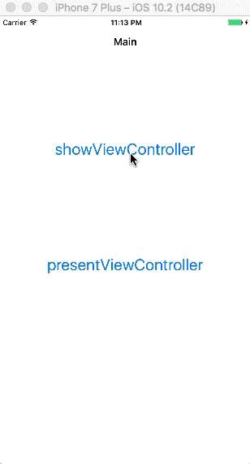

> 本文不够全面，建议查看[View Controller 转场](https://github.com/pro648/tips/wiki/View-Controller-%E8%BD%AC%E5%9C%BA)这篇文章。

在iOS中，segue的class为`UIStoryboardSegue`，用于storyboard中不同视图控制器间转场，即从一个视图控制器转场到另一个视图控制器。Segue的起点必须是一个view或者定义某些操作的对象，如：`UIBarButtonItem`、`UIControl`和`UIGestureRecognizer`。

Segue分为以下几种类型，其中Push、Modal、Popover和Replace已弃用。

- Show
- Show Detail
- Present Modally
- Present as Popover
- Custom
- ~~Push~~
- ~~Modal~~ 
- ~~Popover~~
- ~~Replace~~

在iPhone中有Show、Show Detail、Present Modally、Custom四种不同类型，iPad中有Show、Show Detail、Present Modally、Present as Popover、Custom五种不同类型。
#### Show
- 使用方法`showViewController: sender:`
- 该方法为视图控制器提供了自适应、灵活的呈现方式。
- 用在`UINavigationController`堆栈视图时，presentedViewController进入时由右向左，退出时由左向右。新压入的视图控制器有返回按钮，单击可以返回。
- 用在`UIViewController`实例时，和`presentViewController: animated: completion:`效果一致。

#### Show Detail
- 使用方法`showDetailViewController: sender:`
- 只适用于嵌入在`UISplitViewController`对象内的视图控制器，分割控制器用以替换详细控制器（DetailViewController)。
- 不提供返回按钮。
- 用于`UISplitViewController`以外的控制器时，和`showViewController:sender`用法一样。

#### Present Modally
- 使用方法`presentViewController: animated: completion:`
- 有多种不同呈现方式，可根据需要设置。在iPhone中，一般以动画的形式自下向上覆盖整个屏幕，用户无法与上一个视图交互，除非关闭当前视图；在iPad中，常见呈现为一个中心框，中心框以动画形式自下向上弹出，同时使底层视图控制器变暗。
- 不提供返回按钮。

#### Present as Popover
在iPad中，目标视图以浮动窗样式呈现，点击目标视图以外区域，目标视图消失；在iPhone中，默认目标视图以模态覆盖整个屏幕。

下面GIF演示了Show和Present在新页面出现方式的不同：

`presentViewController: animated: completion:` 是用另一个视图控制器替换自己，会根据`presentationStyle`选择呈现方式。退出时使用`dismissViewControllerAnimated: completion:` 方法。

`showDetailViewController: sender:`是一种自适应方法，会根据当前状态进行不同操作，对应退出方法也不同。

参考资料：

1. [View Controller 转场](https://github.com/pro648/tips/wiki/View-Controller-%E8%BD%AC%E5%9C%BA)
2. [View Controller Programming Guide for iOS---Using Segues](https://developer.apple.com/library/content/featuredarticles/ViewControllerPGforiPhoneOS/UsingSegues.html#//apple_ref/doc/uid/TP40007457-CH15-SW1)
3. [dismissViewController vs popViewController](http://stackoverflow.com/questions/19668328/consequences-of-bad-programming-dismissviewcontroller-vs-popviewcontroller)
4. [What's the difference between all the Selection Segues](http://stackoverflow.com/questions/25966215/whats-the-difference-between-all-the-selection-segues)

欢迎更多指正：<https://github.com/pro648/tips/wiki>

