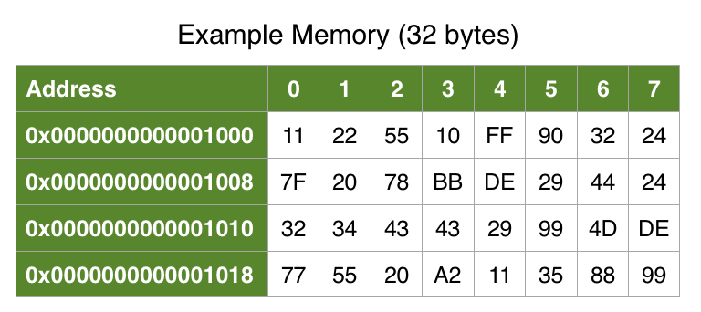

默认情况下，Swift是内存安全的，禁止直接访问内存空间，确保实体使用前已经初始化。同时，Swift也提供了一种不安全（unsafe）的方式，使用指针直接访问内存。

Unsafe不意味着危险的，无法正常工作的代码。相反，其意味着编译器不会保护你免于犯错，需要额外关注。

如果你需要与unsafe语言互操作（例如C语言）、提升运行时性能，或者只是想探究Swift内部实现，Swift提供的unsafe指针将会非常有用。这篇文章将会介绍如何使用指针，以及如何操作内存。

## 1. Unsafe Swift内存布局



Unsafe Swift直接与内存系统交互。内存可以被认为是一系列小方块，每个小方块包含了一个数字。

每个小方块有一个唯一的内存地址。最小的存储空间单位是字节（byte），每个字节包含8位。8位可以存储0-255数值，处理器可以高效的访问内存单元（word，也称为词），一个内存单元通常大于一byte。

在64位操作系统中，一个内存单元8字节、64位。下面使用[MemoryLayout](https://github.com/pro648/tips/blob/master/sources/enum%E5%86%85%E5%AD%98%E5%B8%83%E5%B1%80.md#1-memorylayout)查看Swift原生类型size、alignment：

```
MemoryLayout<Int>.size          // returns 8
MemoryLayout<Int>.alignment     // returns 8
MemoryLayout<Int>.stride        // returns 8

MemoryLayout<Int16>.size        // returns 2
MemoryLayout<Int16>.alignment   // returns 2
MemoryLayout<Int16>.stride      // returns 2

MemoryLayout<Bool>.size         // returns 1
MemoryLayout<Bool>.alignment    // returns 1
MemoryLayout<Bool>.stride       // returns 1

MemoryLayout<Float>.size        // returns 4
MemoryLayout<Float>.alignment   // returns 4
MemoryLayout<Float>.stride      // returns 4

MemoryLayout<Double>.size       // returns 8
MemoryLayout<Double>.alignment  // returns 8
MemoryLayout<Double>.stride     // returns 8
```

`MemoryLayout<Type>`是泛型类型，在编译时确定具体类型。用来确定类型`size`、`alignment`、`stride`，单位为byte。

`Int16`size是2。alignment也是2，这意味着内存地址起始值必须是偶数，即在`0x100`内存地址分配空间是合法的，但在`0x101`位置分配内存就违背了alignment。当多个`Int16`放到一起时，其以`stride`为间隔进行排布。

## 2. Struct内存布局

在playground中添加以下struct，查看其内存布局：

```
struct EmptyStruct {}

MemoryLayout<EmptyStruct>.size      // returns 0
MemoryLayout<EmptyStruct>.alignment // returns 1
MemoryLayout<EmptyStruct>.stride    // returns 1

struct SampleStruct {
    let number: UInt32
    let flag: Bool
}

MemoryLayout<SampleStruct>.size       // returns 5
MemoryLayout<SampleStruct>.alignment  // returns 4
MemoryLayout<SampleStruct>.stride     // returns 8
```

空structur占用大小为0，`alignment`是1，因此可以分配到任意内存地址。创建的任何对象都必须有单独的内存地址，因此其`stride`大小为1。

`SampleStruct`结构体的`size`是5，`alignment`是4，`stride`是8。

下面查看下类与结构体的区别：

```
class EmptyClass { }

MemoryLayout<EmptyClass>.size      // returns 8
MemoryLayout<EmptyClass>.stride    // returns 8
MemoryLayout<EmptyClass>.alignment // returns 8

class SampleClass {
    let number: Int64 = 0
    let flag = false
}

MemoryLayout<SampleClass>.size      // returns 8
MemoryLayout<SampleClass>.stride    // returns 8
MemoryLayout<SampleClass>.alignment // returns 8
```

类是引用类型，`MemoryLayout`查看的是引用指针的大小，为8个字节。

## 3. 指针pointer

指针封装了一个内存地址。直接访问内存地址的类型使用unsafe前缀，因此指针类型名称为`UnsafePointer`。

额外的`Unsafe`前缀可以提示开发者正在直接访问内存，编译器不会进行安全检查，操作不当可能导致不可预知的错误。

Swift提供了多个指针类型，分别提供不同功能。`UnsafePointer`提供类似于C语言中的`char *`。

指针名称表达了其用途特征，如是否可变，原始的还是有类型的，是否容器类型。总计下面八种类型：

| 指针名称                      | 不安全 | 可写入 | 容器类型 | 遵守Strideable | 有类型 |
| ----------------------------- | ------ | ------ | -------- | -------------- | ------ |
| UnsafePointer<T>              | YES    | NO     | NO       | YES            | YES    |
| UnsafeMutablePointer<T>       | YES    | YES    | NO       | YES            | YES    |
| UnsafeBufferPointer<T>        | YES    | NO     | YES      | NO             | YES    |
| UnsafeMutableBufferPointer<T> | YES    | YES    | YES      | NO             | YES    |
| UnsafeRawPointer              | YES    | NO     | NO       | YES            | NO     |
| UnsafeMutableRawPointer       | YES    | YES    | NO       | YES            | NO     |
| UnsafeRawBufferPointer        | YES    | NO     | YES      | NO             | NO     |
| UnsafeMutableRawBufferPointer | YES    | YES    | YES      | NO             | NO     |

名称规则是：`Unsafe[Mutable][Raw][Buffer]Pointer[<T>]`，mutable表示可以向内存写入，raw表示原始数据、无类型，buffer表示像容器一样是内存集合，<T>表示泛型数据类型。

## 4. Raw Pointer

这一部分使用unsafe pointer存储、加载两个整数，代码如下：

```
// 常用数据
let count = 2
let stride = MemoryLayout<Int>.stride
let alignment = MemoryLayout<Int>.alignment
let byteCount = stride * count

// 增加作用域，方便相同变量名称重复使用。
do {
    print("Raw pointers")
    
    // 初始化指定byte内存空间
    let pointer = UnsafeMutableRawPointer.allocate(byteCount: byteCount, alignment: alignment)
    // 确保释放分配的内存空间
    defer {
        pointer.deallocate()
    }
    
    // store、advance、load byte
    pointer.storeBytes(of: 42, as: Int.self)
    pointer.advanced(by: stride).storeBytes(of: 6, as: Int.self)
    pointer.load(as: Int.self)
    pointer.advanced(by: stride).load(as: Int.self)
    
    // 使用UnsafeRawBufferPointer像byte collection一样访问ponter变量的内存
    let bufferPointer = UnsafeRawBufferPointer(start: pointer, count: byteCount)
    for (index, byte) in bufferPointer.enumerated() {
        print("byte \(index): \(byte)")
    }
}
```

`UnsafeMutableRawPointer`遵守了`Strideable`协议，推进指针时，还可以使用指针算法。例如：`(pointer + stride).storeBytes(of: 6, as: Int.self)`。

使用`UnsafeRawBufferPointer`可以像查看容器一样查看内存，因此可以遍历、使用下标访问内存，也可以使用`filter`、`map`、`reduce`等方法。

## 5. Typed Pointer

使用有类型的指针可以简化存取操作，如下所示：

```
do {
    print("Typed pointers")
    
    let pointer = UnsafeMutablePointer<Int>.allocate(capacity: count)
    pointer.initialize(repeating: 0, count: count)
    defer {
        pointer.deinitialize(count: count)
        pointer.deallocate()
    }
    
    pointer.pointee = 42
    pointer.advanced(by: 1).pointee = 6
    pointer.pointee
    pointer.advanced(by: 1).pointee
    
    let bufferPointer = UnsafeBufferPointer(start: pointer, count: count)
    for (index, value) in bufferPointer.enumerated() {
        print("value \(index): \(value)")
    }
}
```

`UnsafeMutablePointer`的泛型标记存取的数据类型是`Int`。使用指针前必须先初始化，使用结束必须取消初始化。只有non-trivial类型需要取消初始化，但trivial类型添加了取消初始化会是好的编码习惯，后续修改了数据类型不会出现问题。编译器会处理额外的取消初始化。

> [Trivial类型](https://github.com/apple/swift-evolution/blob/main/proposals/0107-unsaferawpointer.md#trivial-types)赋值时只需要复制固定大小的连续字节，不会涉及到strong、weak引用等。以下类型都是trivial类型：
>
> - 整数、浮点数。
> - Bool
> - `Optional<T>`，其中`T`是trivial。
> - Struct类型，且元素都是trivial类型。
> - enum类型，且payload都是trivial类型。
>
> 简单理解，trivial类型要么是基本数据类型，要么是仅由基本数据类型组成的类型。Trivial类型存在的意义是该类型可以被当作基本数据类型，可以使用`memcpy`拷贝和移动，构造、析构时不需要进行额外操作，详细介绍可以点击[what is the difference between trivial and non trivial objects](https://stackoverflow.com/questions/61329240/what-is-the-difference-between-trivial-and-non-trivial-objects)查看。

有类型指针可以通过`pointee`进行取值、赋值。移动指针时，可以指定移动value，指针会根据数据类型计算移动字节数。`UnSafeMutablePointer`遵守了`Strideable`协议，也可以直接使用加号移动指针。

## 6. Raw pointer转换为Type pointer

可以将raw pointer转换为 type pointer，代码如下：

```
do {
    print("Converting raw pointers to typed pointers")
    
    let rawPointer = UnsafeMutableRawPointer.allocate(byteCount: byteCount, alignment: alignment)
    defer {
        rawPointer.deallocate()
    }
    
    let typedPointer = rawPointer.bindMemory(to: Int.self, capacity: count)
    typedPointer.initialize(repeating: 0, count: count)
    defer {
        typedPointer.deinitialize(count: count)
    }
    
    typedPointer.pointee = 42
    typedPointer.advanced(by: 1).pointee = 6
    typedPointer.pointee
    typedPointer.advanced(by: 1).pointee
    
    let bufferPointer = UnsafeBufferPointer(start: typedPointer, count: count)
    for (index, value) in bufferPointer.enumerated() {
        print("value \(index): \(value)")
    }
}
```

上述代码先创建raw pointer，通过`bindMemory(to:capacity:)`创建type pointer。创建type pointer后就可以使用`pointee`存取值。

> `UnsafeRawPointer`的初始化方法提供了根据type pointer创建的方法，即可以将type pointer转换为raw pointer。

Swift分配的内存可能处于以下任一状态：

- 未初始化的原始内存
- 未初始化已经绑定类型的内存
- 已经初始化绑定类型的内存

`UnsafeMutableRawPointer.allocate(bytes:alignedTo:)`方法返回的是未初始化的原始内存。`UnsafeMutablePointer<T>.allocate(capacity:)`方法返回的是未初始化、类型为`T`的内存。

- `bindMemory(to:capacity:)`将指针内存绑定为指定类型，返回type pointer，上面三种状态的任一状态的指针都可以使用该方法。新绑定类型必须与原来类型内存布局一致，且都是普通类型（trivial type）。绑定类型后编译器知道了内存数据类型，后续可以安全访问，但运行时不会有任何改变。

  该方法不会分配、初始化内存，仅仅改变内存绑定的类型。

- `assumingMemoryBound(to:)`：当已经知道raw pointer内存绑定数据类型时，可以通过`assumingMemoryBound(to:)`方法返回有类型指针。如果内存没有绑定到指定类型，使用type pointer可能导致无法预期的结果。

## 7. 查看实例内存

```
func withUnsafeBytes<T, Result>(of value: inout T, _ body: (UnsafeRawBufferPointer) throws -> Result) rethrows -> Result
```

方法可以查看实例内存存储数据，其有以下两个参数：

- value：要临时通过raw buffer pointer查看内存的实例，`inout`排他性规则意味着在body中，只能通过body指针参数访问，不能直接访问变量。
- body：闭包只有一个raw buffer pointer参数，如果闭包有返回值，则返回值也会作为`withUnsafeBytes(of:_:)`函数的返回值。buffer pointer仅在闭包执行期间有效。在闭包内不能将`UnsafeRawBufferPointer`转换为mutable pointer，这会导致不可预知的错误。如果需要改变指针值，应使用`withUnsafeMutableBytes(of:_:)`。

如下所示：

```
do {
    print("Getting the bytes of an instance")
    
    var sampleStruct = SampleStruct(number: 64, flag: true)
    
    withUnsafeBytes(of: &sampleStruct) { bytes in
        for byte in bytes {
            print(byte)
        }
    }
}
```

上述代码会打印出`SampleStruct`结构体实例的内存数据。

```
Getting the bytes of an instance
64
0
0
0
1
```

可以看到`UInt32`类型的`number`占用四个字节，`Bool`类型的`flag`占用1个字节。

`withUnsafeBytes(of:_:)`也可以用在`Array`和`Data`中。

## 8. 计算校验和

`withUnsafeBytes(of:_:)`方法可以返回一个值。例如，可以使用内存数据计算32位校验和。

如下所示：

```
do {
    print("Checksum the bytes of a struct")
    
    var sampleStruct = SampleStruct(number: 64, flag: true)
    
    let checksum = withUnsafeBytes(of: &sampleStruct) { (bytes) -> UInt32 in
        return ~bytes.reduce(UInt32(0)) { $0 + numericCast($1) }
    }
    
    print("checksum", checksum) // prints checksum 4294967230
}
```

`reduce`累加所有字节，`~`反转结果。虽然不能作为线上的错误检测使用，但其展示了如何使用`withUnsafeBytes(of:_:)`的概念。

## 9. Unsafe Swift注意事项

编写不安全代码容易导致未定义行为，以下是一些注意事项：

#### 9.1 withUnsafeBytes方法闭包不能返回指针

```
do {
    print("1. Don't return the pointer from withUnsafeBytes!")
    
    var sampleStruct = SampleStruct(number: 64, flag: true)
    
    let bytes = withUnsafeBytes(of: &sampleStruct) { bytes in
        return bytes // strange bugs here we come ☠️☠️☠️
    }
    
    print("Horse is out of the barn!", bytes) // undefined!!!
}
```

`withUnsafeBytes(of:_:)`闭包不能返回当前指针，即使当前代码运行起来没有问题，其可能触发其他bug。

#### 9.2 指针只能绑定一种类型

```
do {
    print("2. Only bind to one type at a time!")
    
    let count = 3
    let stride = MemoryLayout<Int16>.stride
    let alignment = MemoryLayout<Int16>.alignment
    let byteCount = count * stride
    
    let pointer = UnsafeMutableRawPointer.allocate(byteCount: byteCount, alignment: alignment)
    
    let typedPointer1 = pointer.bindMemory(to: UInt16.self, capacity: count)
    
    // Breakin' the Law... Breakin' the Law (Undefined behavior)
    let typedPointer2 = pointer.bindMemory(to: Bool.self, capacity: count * 2)
    
    // If you must, do it this way:
    typedPointer1.withMemoryRebound(to: Bool.self, capacity: count * 2) {
        (boolPointer: UnsafeMutablePointer<Bool>) in
        print(boolPointer.pointee) // See Rule #1, don't return the pointer
    }
}
```

永远不要将内存绑定为两种不同类型，即类型双关。如果必须绑定为其它类型，可以使用`withMemoryRebound(to:capacity:)`。

将trivial类型绑定为non-trivial类型也是禁止的。

#### 9.3 指针越界

```
do {
    print("3. Don't walk off the end... whoops!")
    
    let count = 3
    let stride = MemoryLayout<Int16>.stride
    let alignment = MemoryLayout<Int16>.alignment
    let byteCount =  count * stride
    
    let pointer = UnsafeMutableRawPointer.allocate(
        byteCount: byteCount,
        alignment: alignment)
    let bufferPointer = UnsafeRawBufferPointer(start: pointer, count: byteCount + 1)
    // OMG +1????
    
    for byte in bufferPointer {
        print(byte) // pawing through memory like an animal
    }
}
```

上述代码创建`UnsafeRawBufferPointer`时，count数量大于原始指针，遍历时会越界。

Demo名称：UnsafeSwift  
源码地址：<https://github.com/pro648/BasicDemos-iOS/tree/master/SwiftPointer>

参考资料：

1. [Unsafe Swift: Using Pointers and Interacting With C](https://www.kodeco.com/7181017-unsafe-swift-using-pointers-and-interacting-with-c)
2. [Swift 中的指针使用](https://onevcat.com/2015/01/swift-pointer/)
3. [UnsafeRawPointer assumingMemoryBound vs. bindMemory](https://stackoverflow.com/questions/47940167/unsaferawpointer-assumingmemorybound-vs-bindmemory)
4. [Unsafe memory pointers in Swift](https://theswiftdev.com/unsafe-memory-pointers-in-swift/)
