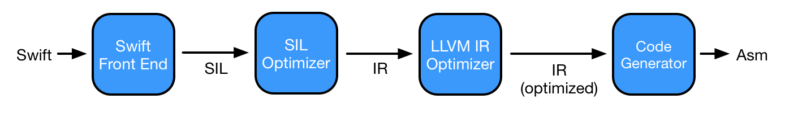

当宣布Swift时，Apple称其比Objective-C速度更快，Swift方法的调用方式对其速度有决定性影响。

先不谈方法调度对性能的影响，来关注下Swift如何调用方法。在查看Swift方法调度前，先来看下Objective-C如何调用方法。

## 1. Objective-C方法调用

编译过程中，Clang将每个方法调用转换为`objc_msgSend`方法或其变种，传入调用对象、selector、实参等。

例如，`[object message: param]`调用会被转换为`objc_msgSend(object, @selector(message:), param, nil)`。

在Objective-C中，`objc_msgSend`函数负责方法调度，`objc_msgSend`函数由汇编语言实现，并且已经[开源](https://opensource.apple.com/source/objc4/objc4-818.2/runtime/Messengers.subproj)。这里使用伪代码分析该函数的实现，如果你对ObjC方法调用还不了解，可以查看以下文章：[Runtime从入门到进阶一](https://github.com/pro648/tips/blob/master/sources/Runtime%E4%BB%8E%E5%85%A5%E9%97%A8%E5%88%B0%E8%BF%9B%E9%98%B6%E4%B8%80.md)、[Runtime从入门到进阶二](https://github.com/pro648/tips/blob/master/sources/Runtime%E4%BB%8E%E5%85%A5%E9%97%A8%E5%88%B0%E8%BF%9B%E9%98%B6%E4%BA%8C.md)。

```
id objc_msgSend ( id obj, SEL op, ... )
{
    Class c = object_getClass(obj);
    IMP imp = CacheLookup(c, op);
    if (!imp) {
        imp = class_getMethodImplementation(c, op);
    }
    jump imp(obj, op, ...);
}
```

首先，获取传入对象的类，时间复杂度为常数时间：

```
    Class c = object_getClass(obj);
```

然后尝试在类缓存中查找方法实现：

```
    IMP imp = CacheLookup(c, op);
```

在缓存中查找selector是一个很快的操作，像在哈希表中查找一样。当缓存中找不到后，就会调用`class_getMethodImplementation`，从该类、父类中查找方法实现，直到继承树的基类。

```
    if (!imp) {
        imp = class_getMethodImplementation(c, op);
    }
```

`class_getMethodImplementation`方法相对来说速度慢很多。

最后，`objc_msgSend`开辟堆栈帧，调用方法实现，传入调用对象、selector、行参。正因为如此，`objc_msgSend`常被称为蹦床，而非函数。

```
    jump imp(obj, op, ...);
```

在介绍Swift方法调度前，先介绍两个重要的概念：名字改编（name mangling）和编译（compilation）。

## 2. 名字改编

名字改编也称为名字修饰（name decoration）、名字重整，是现代计算机程序设计语言编译器用于解决程序实体名字必须唯一的一种技术。

下面看一下Swift的方法签名和对应的符号名称：

```
Matrix.AIProgram.speak (Matrix.AIProgram)(Swift.String) -> ()
Matrix.AIProgram.speak (Matrix.AIProgram)(Swift.Int) -> ()
```

上述方法定义在同一个类，有相同的名称。即进行了方法重载。Swift方法的第一个参数为`self`对象。

最终，上述方法的符号名称如下：

```
_TFC6Matrix9AIProgram5speakfS0_FSST_
_TFC6Matrix9AIProgram5speakfS0_FSiT_
```

第一个方法参数是`String`类型，在符号中使用`S`标记。第二个方法参数类型为`int`，在符号中使用`i`标记。

日常开发中，不需要关心上述符号。但如果需要将符号拆解为原代码，可以使用下面命令：

```
xcrun swift-demangle SYMBOL_NAME

swift demangle SYMBOL_NAME
```

如下所示：

```
$ swift demangle s7orchard6PersonC6myNameyyF
$s7orchard6PersonC6myNameyyF ---> orchard.Person.myName() -> ()
```

如果想了解更多关于方法重整的信息，可以查看这篇文章：[Friday Q&A 2014-08-08: Swift Name Mangling](https://mikeash.com/pyblog/friday-qa-2014-08-15-swift-name-mangling.html)

在介绍Swift方法调用前，先查看Swift如何将代码编译为二进制文件。

## 3. 编译

Swift编译包含以下几个阶段：



首先，Swift前端将Swift代码转为与平台无关的Swift中间语言（Swift Intermediate Language，简称SIL），使用`swiftc -emit-sil`命令可以将代码转换为SIL。其次，SIL 优化器在更高层级上将SIL转换为IR（Intermediate Representation，中间表示），IR是更低一级、与平台无关的语言，使用`swiftc -emit-ir`命令可以将代码转换为IR。IR还会被进一步优化。在最后一个阶段，代码生成器将优化后的IR生成机器码。使用`swiftc -S`命令可以将代码转换为机器码。

整个编译过程分为多个步骤，可以通过分析早期阶段代码，了解其底层实现。

## 4. Swift方法调度

方法调度指程序应执行哪个操作的机制。有时，希望在运行时确定方法行为。这一动机产生了不同机制的方法调度，每种机制的方法调度都有自己的优缺点。

#### 4.1 静态调用 Static Dispatch

- 静态调用也被称为直接调用（Direct Dispatch）。
- 静态调用的方法编译器在编译时期就能够确定要执行指令地址。因此当调用此类方法时，系统直接跳转到指定内存地址，调用该指令。这种类型的调用速度很快，编译器也可以进行相关优化，如内联。由于静态调用可以带来性能提升，编译管道中存在一个阶段，专门尝试将函数调用转为静态调用，这种优化称为虚拟化（devirtualization）。

#### 4.2 动态调用 Dynamic Dispatch

- 动态调用的方法直到运行时才会确定方法实现。
- 尽管static dispatch非常轻量级，但其限制了其灵活性，特别是对待多态时。这也就是为什么面向对象语言广发支持dynamic dispatch。
- 每种语言都有自身的机制来实现动态调用。Swift提供了两种实现动态调用方案：表调用（table dispatch）和[消息调用](https://github.com/pro648/tips/blob/master/sources/Runtime%E4%BB%8E%E5%85%A5%E9%97%A8%E5%88%B0%E8%BF%9B%E9%98%B6%E4%B8%80.md)（message dispatch）。

##### 4.2.1 表调用 Table Dispatch

- 编译型语言最常用调用方式就是table dispatch。类与一个虚表（virtual table）关联，虚表的数组元素是方法实现的函数指针。
- 虚表在编译时期生成。与static dispatch相比，vtable只增加了两部指令：read、jump。因此，表调用相对来说速度也很快。

##### 4.2.2 消息调用 Message Dispatch

- 消息机制是由Objective-C提供的，Swift直接调用Objective-C的运行时库。调用ObjC方法时，调用会被传递给`objc_msgSend`函数，该函数从当前类开始查找方法实现，如果找不到就会从父类查找。如果你对ObjC消息机制还不了解，可以查看这篇文章：[Runtime从入门到进阶一](https://github.com/pro648/tips/blob/master/sources/Runtime%E4%BB%8E%E5%85%A5%E9%97%A8%E5%88%B0%E8%BF%9B%E9%98%B6%E4%B8%80.md)、[Runtime从入门到进阶二](https://github.com/pro648/tips/blob/master/sources/Runtime%E4%BB%8E%E5%85%A5%E9%97%A8%E5%88%B0%E8%BF%9B%E9%98%B6%E4%BA%8C.md)。
- 与table dispatch不同，运行时可以修改方法实现。方法交换（method swizzle）就是利用了ObjC的这一特点。
- Static Dispatch、Table Dispatch和Message Dispatch中，消息调用动态性最强。尽管消息机制使用缓存来提升性能，但依然是性能最差的调用方式。
- 消息机制是Cocoa框架的基石。Swift的KVO也是使用方法交换实现的。

## 5. 如何判断方法调用方式

给定一个函数，如何判断其调用方式，如何进行验证。

#### 5.1 如何确定调度机制

提出一个假设很容易，但想要进行验证并不容易。Swift中间语言[SIL](https://github.com/apple/swift/blob/main/docs/SIL.rst)合理的解释了调度策略的存在。下面是调度方式总结：

- 如果函数使用table dispatch，函数存在`sil_vtable`中。如果是协议方法，则存在于`sil_witness_table`。

  ```
  sil_vtable Animal {
    #Animal.makeNoise: (Animal) -> () -> () : @main.Animal.makeNoise() -> ()	// Animal.makeNoise()
    #Animal.isAnnoying: (Animal) -> () -> () : @main.Animal.isAnnoying() -> ()	// Animal.isAnnoying()
    #Animal.init!allocator: (Animal.Type) -> () -> Animal : @main.Animal.__allocating_init() -> main.Animal	// Animal.__allocating_init()
    #Animal.deinit!deallocator: @main.Animal.__deallocating_deinit	// Animal.__deallocating_deinit
  }
  ```

- 如果函数通过消息机制调用，会用`foreign`和`objc_method`标记出使用Objective-C的runtime调用：

  ```
  %15 = objc_method %14 : $Animal, #Animal.sleep!foreign : (Animal) -> () -> (), $@convention(objc_method) (Animal) -> () // user: %16
  ```

- 如果上述两种都没有出现，则使用静态调用。

可以使用以下指令将Swift转换为SIL：

```
swiftc -emit-sil main.swift | xcrun swift-demangle > main.silgen
```

#### 5.2 具体示例

- 值类型的方法都是静态调用，因为值类型不能被重写。

- 显式声明

  - 带有`final`关键字的函数使用静态调用。
  - 带有`dynamic`关键字的函数使用消息机制。Swift 4之前，使用`dynamic`修饰的函数，对Objective-C隐式可见。Swift 4开始，要求必须显式使用`@objc`标记出。

- 未使用任何显式声明的extension中方法，默认使用静态调用。这就是重写extension中方法提示*Non-@objc method is declared in extension of xxx and cannot be overriden*的原因。如果想重写`extension`中方法，可以通过添加修饰词，将方法改为虚表调用、消息调用。例如添加`@objc`或`@objc dynamic`。

  ```
  extension Animal {
      func eat() { }    // STATIC
      @objc dynamic func getWild() { }    // MESSAGE
  }
  
  class Dog: Animal {
      override func eat() { }    // Non-@objc instance method 'eat()' is declared in extension of 'Animal' and cannot be overridden, Add '@objc' to make this declaration overridable
      @objc dynamic override func getWild() { }    // OK
  }
  ```

#### 5.3 协议调用

```
protocol Noisy {
    func makeNoise()    // TABLE
}
extension Noisy {
    func makeNoise() { }    // TABLE
    func isAnnoying() { }    // STATIC
}
class Animal: Noisy {
    func makeNoise() { }    // TABLE
    func isAnnoying() { } // TABLE
    @objc func sleep() { }    // Still TABLE
}
extension Animal {
    func eat() { }    // STATIC
    @objc dynamic func getWild() { }    // MESSAGE
}
```

- `Noisy.isAnnoying()`和`Animal.eat()`在extension中，且没有任何关键字修饰，因此使用静态调用。

- `Noisy.makeNoise()`尽管在extension中有默认实现，仍然使用表调度。

- `isAnnoying`方法的调度需要多加注意。

  ```
  let animal1 = Animal()
  animal1.isAnnoying()   // Value: false
  animal1.makeNoise()    // Value: false
  
  let animal2: Noisy = Animal()
  animal2.isAnnoying()  // Value: true
  animal2.makeNoise()   // Value: false
  ```

  `animal2.isAnnoying`调用extension中的实现，使用静态调用；`animal1.isAnnoying`使用表调用，调用`Animal`中的实现。

- `animal1`和`animal2`调用`makeNoise`时使用表调度。因此，都会调用`Animal`class中的`makeNoise`。

- `@objc func sleep()`中的`@objc`表示函数对Objective-C可见，并不表示会使用消息机制调用。查看SIL可以看到调用方式为`$@convention(method)`，即使用了Swift的方法调用。

  ```
  %15 = class_method %14 : $Animal, #Animal.sleep : (Animal) -> () -> (), $@convention(method) (@guaranteed Animal) -> () // user: %16
  ```

总的规则是：

- 优先使用静态调用。
- 如果需要重写或对Objective-C可见，使用表调度。
- 如果需要用到Objective-C的runtime，则使用消息机制。

|          | 静态调用      | 表表用     | 消息机制            |
| -------- | ------------- | ---------- | ------------------- |
| 显式声明 | final、static | --         | dynamic             |
| 值类型   | 所有方法      | --         | --                  |
| 协议     | Extension     | 初始化声明 | --                  |
| 类       | Extension     | 初始化声明 | 使用`@objc dynamic` |

## 总结

这篇文章介绍了Swift中的方法调度方式，通过SIL可以验证方法调度方式。

- 静态调用性能最佳，也是Swift性能优于Objective-C的地方。
- 尽管消息机制性能差于静态调用、表调用，但灵活性高，为方法交换、KVO等功能实现提供了技术支持。
- 理解方法调用不仅可以帮助写出性能更佳的app，还可以避免bug。
- 讨论上述内容的时候，我们没有涉及编译器优化。编译器能够如何优化代码，也和我们的编写方式有关。

参考资料：

1. [Method dispatch in Swift](https://trinhngocthuyen.github.io/posts/tech/method-dispatch-in-swift/)
2. [@objc and dynamic](https://swiftunboxed.com/interop/objc-dynamic/)
3. [Swift Method Dispatching — a summary of my talk at Swift Warsaw](https://blog.allegro.tech/2014/12/swift-method-dispatching.html)
4. [Swift Intermediate Language 初探](https://mp.weixin.qq.com/s?__biz=MzU3NTY3MTQzMg==&mid=2247485644&idx=1&sn=648137faded749e6bc67948906dbee7b&chksm=fd1ed52bca695c3d2345a907d295a545c73cf61e5ea7cb4063c3d063a0cd8903ad9f1a545424&scene=21#wechat_redirect)
5. [真实案例引发的iOS底层实现窥探](https://juejin.cn/post/6998055436532482062)

