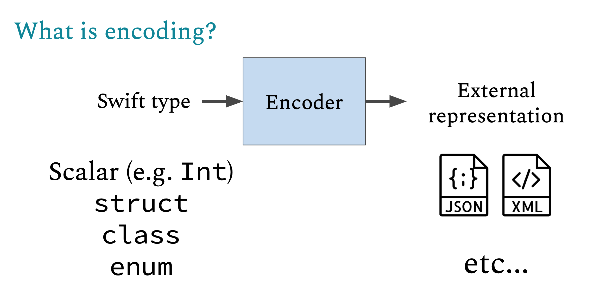
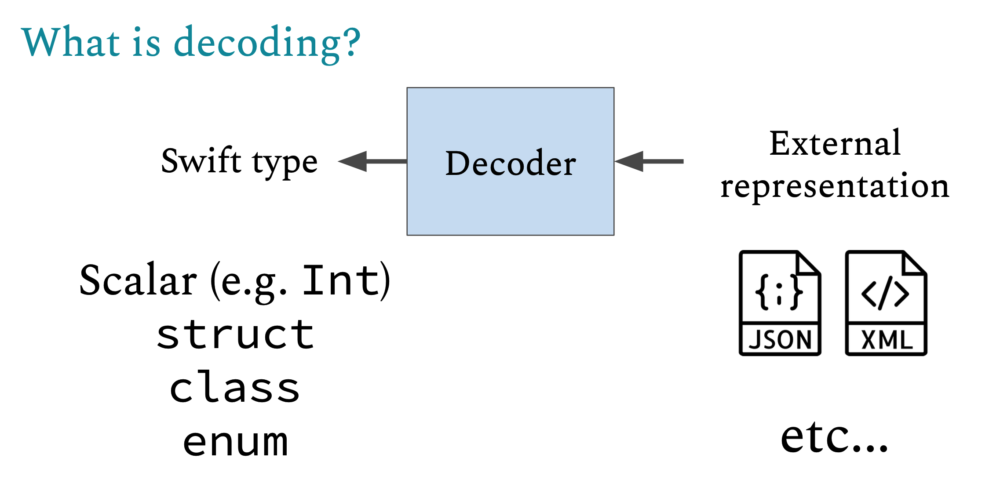
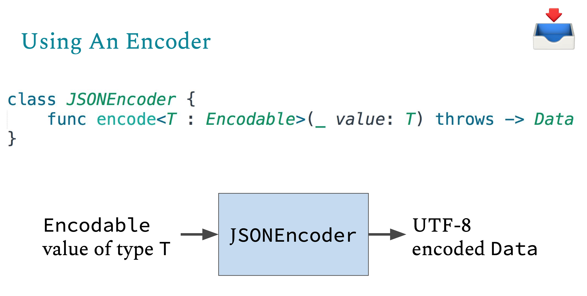
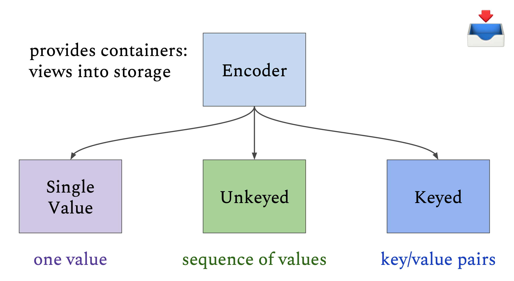

日常需求开发中，经常遇到调用后端服务、将数据写入磁盘，以及使用自定义模型实现app功能。在此过程中，需要将data与中间格式（JSON、Property List）来回转换。Swift提供了Encodable和Decodable协议处理数据编码、解码。通过遵守Encodable协议，可以将自定义类型编码为外部数据类型，例如JSON、Property List；反之，通过遵守Decodable协议，将外部数据类型解码为自定义模型。这篇文章主要介绍如何使用Encodable、Decodable。

## 编解码协议

### 编码协议Encodable

将自定义类型数据转换为其他呈现形式，如JSON、Property List，称为编码、序列化。自定义的类型遵守Encodable协议即可进行编码。



### 解码协议Decodable

将JSON、Property List转为自定义类型的过程称为解码、反序列化。自定义类型遵守Decodable协议即可进行解码。



### 编解码协议Codable

如需同时支持编码、解码能力，遵守`Codable`协议即可。

``` 
typealias Codable = Encodable & Decodable
```

## Swift标准库和Foundation框架中许多类型默认Codable

Swift标准库和Foundation框架提供的许多类型默认支持了Codable协议：

1. 基础类型
   1. String
   2. Int、Int8、Int16、Int32、Int64
   3. UInt、UInt8、UInt16、UInt32、UInt64
   4. Float、Double
   5. Bool
2. 集合类型
   1. Array：当元素类型也是Codable时
   2. Dictionary：当Key和Value也是Codable时
   3. Set：当元素类型是Codable时
3. 可选类型
   1. Optional：当Wrapped类型是Codable时
4. 其他类型
   1. Date
   2. Data
   3. URL
   4. Decimal
   5. CGFloat
   6. CGPoint、CGSize、CGRect

假设有以下地址类型：

```
struct Address {
    let street: String
    let city: String
    let zipCode: String
}
```

`Address`类型只需遵守`Codable`协议即可支持编解码：

```
struct Address: Codable {
    let street: String
    let city: String
    let zipCode: String
}
```

如果自定义类型的所有属性都支持编解码，那么该类型也天然支持编解码。例如，`Person`类型包含`Address`类型的属性，由于`Address`遵守`Codable`协议，`Person`也可以直接遵守`Codable`协议，支持编解码能力。

```
struct Person: Codable {
    let name: String
    let age: Int
    let address: Address
}
```

## JSONEncoder、JSONDecoder



JSONEncoder可以直接创建使用，可配置`dateEncodingStrategy`、`dataEncodingStrategy`、`keyEncodingStrategy`。其核心API只有一个：

```
func encode<T>(_ value: T) throws -> Data Where T: Encodable
```

只要自定义类型遵守`Encodable`，就可以使用JSONEncoder将其编码为其他类型（如Data），以便通过网络发送、写入磁盘。

将`Person`编码为Data：

``` 
let address = Address(street: "Winterfull", city: "The North", zipCode: "1234567")
let person = Person(name: "Arya Stark", age: 18, address: address)

let encoder = JSONEncoder()
let data = try encoder.encode(person)
```

将data转为JSON String进行打印：

```
if let jsonStr = String(data: data, encoding: .utf8) {
    print("jsonStr: \(jsonStr)")
}

// 打印内容为：
jsonStr: {"address":{"city":"The North","zipCode":"1234567","street":"Winterfull"},"age":18,"name":"Arya Stark"}
```

JSONDecoder与JSONEncoder类似。现在将data数据解码为`Person`类型模型：

```
do {
    let decoder = JSONDecoder()
    let decodePerson = try decoder.decode(Person.self, from: data)
} catch {
    print("err: \(error)")
}
```

## CodingKeys枚举自定义映射

如果需要自定义属性名与键名的映射关系，需要实现名称为`CodingKeys`、遵守`CodingKey`协议的枚举。

枚举的case为需要编解码的字段名称。如果需要排除特定属性，枚举中直接忽略该属性即可。如果自定义类型属性名称与JSON中键名称不同，枚举case的raw value使用自定义字符串即可。

```
struct Address: Codable {
    let street: String
    let city: String
    let zipCode: String
    
    enum CodingKeys: String, CodingKey {
        case street
        case city
        case zipCode = "zip_code"
    }
}
```

编译器编译时会自动根据`CodingKeys`生成`encode`和`init(from:)`的实现代码。

## 手动编解码

如果自定义类型与JSON结构不同，可以通过实现编码`encode(to: Encoder)`、解码`init(from coder: Decoder)`方法实现自定义编解码。

有以下自定义类型：

```
let address = Address(street: "Winterfull", city: "The North", zipCode: "1234567")
let person = Person(name: "Arya Stark", age: 18, address: address)
```

编码后JSON数据结构如下：

```
{
    "age": 18,
    "name": "Arya Stark",
    "street": "Winterfull",
    "city": "The North",
    "zip_code": "1234567"
}
```

JSON中的adress信息并没有嵌套在`Person`中，可以通过自定义`Person`编码方法实现：

```
struct Person: Codable {
    let name: String
    let age: Int
    let address: Address
    
    enum CodingKeys: String, CodingKey {
        case name
        case age
        case address
        
        case street
        case city
        case zipCode = "zip_code"
    }
    
    // 显式添加成员初始化器，因为实现了自定义 init(from decoder:) 后，编译器不会自动生成
    init(name: String, age: Int, address: Address) {
        self.name = name
        self.age = age
        self.address = address
    }
    
    init(from decoder: any Decoder) throws {
        let container = try decoder.container(keyedBy: CodingKeys.self)
        name = try container.decodeIfPresent(String.self, forKey: .name) ?? ""
        age = try container.decodeIfPresent(Int.self, forKey: .age) ?? 0
        
        let street = try container.decodeIfPresent(String.self, forKey: .street)  ?? ""
        let city = try container.decodeIfPresent(String.self, forKey: .city)  ?? ""
        let zipCode = try container.decodeIfPresent(String.self, forKey: .zipCode)  ?? ""
        
        address = Address(street: street, city: city, zipCode: zipCode)
    }
    
    func encode(to encoder: any Encoder) throws {
        var container = encoder.container(keyedBy: CodingKeys.self)
        try container.encodeIfPresent(name, forKey: .name)
        try container.encodeIfPresent(age, forKey: .age)
        try container.encodeIfPresent(address.street, forKey: .street)
        try container.encodeIfPresent(address.city, forKey: .city)
        try container.encodeIfPresent(address.zipCode, forKey: .zipCode)
    }
}
```

`Encoder`和`Decoder`提供了查看数据存储的容器，有以下三种类型容器：



- KeyedEncodingContainer、KeyedDecodingContainer
  - 上面示例中展示了如何如何使用KeyedEncodingContainer，下面不再重复。
- SingleValueEncodingContainer、SingleValueDecodingContainer
- UnkeyedEncodingContainer、UnkeyedDecodingContainer

### SingleValueEncodingContainer、SingleValueDecodingContainer

SingleValueEncodingContainer、SingleValueDecodingContainer用于包装单个值（包装类型、枚举raw value）:

```
enum Response: Codable {
    case success(String)
    case error(Int)
    
    init(from decoder: Decoder) throws {
        let container = try decoder.singleValueContainer()
        if let message = try? container.decode(String.self) {
            self = .success(message)
        } else if let code = try? container.decode(Int.self) {
            self = .error(code)
        } else {
            throw DecodingError.dataCorrupted(
                DecodingError.Context(codingPath: [], debugDescription: "Invalid data")
            )
        }
    }
    
    func encode(to encoder: Encoder) throws {
        var container = encoder.singleValueContainer()
        switch self {
        case .success(let message):
            try container.encode(message)
        case .error(let code):
            try container.encode(code)
        }
    }
}

let res = Response.success("Operation completed")
let res2 = Response.error(404)

let encoder = JSONEncoder()
let data1 = try encoder.encode(res)
let data2 = try encoder.encode(res2)

if let jsonString1 = String(data: data1, encoding: .utf8) {
    print("JSON1 输出：\(jsonString1)")
}
if let jsonString2 = String(data: data2, encoding: .utf8) {
    print("JSON2 输出：\(jsonString2)")
}
```

打印如下：

```
JSON1 输出："Operation completed"
JSON2 输出：404
```

### UnkeyedEncodingContainer、UnkeyedDecodingContainer

用于编码数组、序列等无键的有序值，使用方式如下：

```
struct ColorPalette: Codable {
    let colors: [String]
    
    init(colors: [String]) {
        self.colors = colors
    }
    
    init(from decoder: Decoder) throws {
        var container = try decoder.unkeyedContainer()
        var colorArray: [String] = []
        
        // 按顺序读取
        while !container.isAtEnd {
            let color = try container.decode(String.self)
            colorArray.append(color)
        }
        colors = colorArray
    }
    
    func encode(to encoder: Encoder) throws {
        // 获取无键容器
        var container = encoder.unkeyedContainer()
        
        // 按顺序写入值（无键名）
        for color in colors {
            try container.encode(color)
        }
    }
}

let colorPalette = ColorPalette(colors: ["red", "blue", "yellow"])
let encoder = JSONEncoder()
let data = try encoder.encode(colorPalette)
if let jsonStr = String(data: data, encoding: .utf8) {
    print("jsonStr: \(jsonStr)")
}
```

打印如下：

```
// 使用UnkeyedEncodingContainer编码后：
["red","blue","yellow"]

// 不使用UnkeyedEncodingContainer编码后
{"colors":["red","blue","yellow"]}
```

## 错误处理

### EncodingError

编码时遇到错误会抛出EncodingError，枚举值为`invalidValue`，提供编码错误信息。

### DecodingError

解码时遇到错误会抛出DecodingError，提供解码错误信息，枚举值有以下类型：

- dataCorrupted
- keyNotFound
- typeMismatch
- valueNotFound

## 总结

JSONEncoder、JSONDecoder可以直接映射到Codable模型，提供了类型安全的编解码能力，但只有Swift可用。JSONSerialization返回的是Any类型的[String: Any]、[Any]，需要进一步手动拆解、转换，容易出错。

JSONEncoder、JSONDecoder、JSONSerialization都是将数据加载到内存后再处理，均非流式、增量解析器。如果需要处理超大JSON，需要考虑使用分片式编解码策略。

Demo名称：Codable  
源码地址：https://github.com/pro648/BasicDemos-iOS/tree/master/Codable

参考资料：

1. [Encodable and Decodable in Swift 4](https://medium.com/@manojkarkie/encodable-and-decodable-in-swift-4-747328a7c7c5)
2. [Swift's Encoderand Decoder Protocols](https://kaitlin.dev/files/encoder_decoder_slides.pdf)
3. [Encoding, Decoding, and Serialization](https://developer.apple.com/documentation/swift/encoding-decoding-and-serialization)
