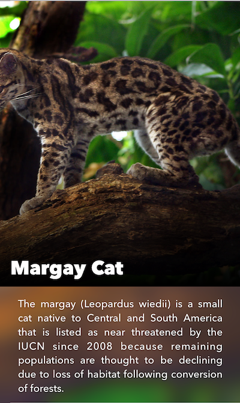
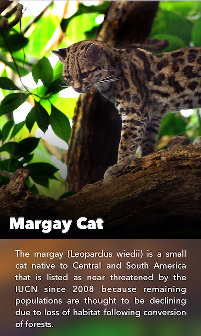

> 这是 Texture 文档系列翻译，其中结合了自己的理解和工作中的使用体会。如果哪里有误，希望指出。
>
> 1. [Texture 核心概念](https://github.com/pro648/tips/wiki/Texture%20%E6%A0%B8%E5%BF%83%E6%A6%82%E5%BF%B5)
>
> 2. [Texture 布局 Layout](https://github.com/pro648/tips/wiki/Texture%20%E5%B8%83%E5%B1%80%20Layout)
>
> 3. [Texture 便捷方法](https://github.com/pro648/tips/wiki/Texture%20%E4%BE%BF%E6%8D%B7%E6%96%B9%E6%B3%95)
>
> 4. [Texture 性能优化](https://github.com/pro648/tips/wiki/Texture%20%E6%80%A7%E8%83%BD%E4%BC%98%E5%8C%96)
>
> 5. [Texture 容器 Node Containers](https://github.com/pro648/tips/wiki/Texture%20%E5%AE%B9%E5%99%A8%20Node%20Containers)
>
> 6. [Texture 基本控件 Node](https://github.com/pro648/tips/wiki/Texture%20%E5%9F%BA%E6%9C%AC%E6%8E%A7%E4%BB%B6%20Node)
> 7. [Texture 中 Node 的生命周期](https://github.com/pro648/tips/wiki/Texture%20%E4%B8%AD%20Node%20%E7%9A%84%E7%94%9F%E5%91%BD%E5%91%A8%E6%9C%9F)

## ASDisplayNode

#### Node 基础知识

`ASDisplayNode`是对`UIView`和`CALayer`的抽象。`ASDisplayNode`初始化并拥有视图的方式与`UIView`创建并拥有`CALayer`的方式一致。

```
ASDisplayNode *node = [[ASDisplayNode alloc] init];
node.backgroundColor = [UIColor orangeColor];
node.bounds = CGRectMake(0, 0, 100, 100);

NSLog(@"Underlying view: %@", node.view);
```

node 拥有`UIView`的所有属性。因此，使用 node 时会发现其与`UIKit`很像。

view 和 layer 的属性均会转发给 node，可以轻松访问。

```
ASDisplayNode *node = [[ASDisplayNode alloc] init];
node.clipsToBounds = YES;				  // not .masksToBounds
node.borderColor = [UIColor blueColor];  //layer name when there is no UIView equivalent

NSLog(@"Backing layer: %@", node.layer);
```

从上述代码可以看到，属性命名规则与`UIView`保持一致，除非`UIView`没有对应属性。与处理`UIView`类似，也可以操作`CALayer`。

> Node 使用`position`而非`center`，这是唯一例外。

node 用在 node container 中时，node 所有属性均会在后台线程设置，并且会用该 node 收集的缓存属性延迟构造视图、图层。开发者无需担心跳转到后台线程，因为 Texture 会自动处理这些问题，但有必要知道这些是在后台线程处理的。

#### 封装视图

在某些情况下，希望为 node 初始化方法提供基于 view 的支持。view 通过 block 提供，这样可以延迟构造。这样创建的 node 同步绘制，因为只有封装的`_ASDisplayView`才可以异步绘制。

```
ASDisplayNode *node = [ASDisplayNode alloc] initWithViewBlock:^{
	SomeView *view  = [[SomeView alloc] init];
	return view;
}];
```

通过上述方法，可以将已经存在的`UIView`转换为`ASDisplayNode`。

## ASCellNode

`ASCellNode`是 Texture 中的 cell 类，可用于`ASTableNode`、`ASCollectionNode`、`ASPagerNode`。

#### 三种初始化 cell 方式

有以下三种初始化`ASCellNode`方式：

- 子类化`ASCellNode`
- 使用已有`ASViewController`初始化。
- 使用`UIView`、`CALayer`初始化。

通常需要实现以下方法：

- `init`：线程安全的初始化方法。
- `layoutSpecThatFits:`返回 cell 的布局规范。
- `didLoad`在主线程调用，用于添加手势、访问 view 的操作。
- `layout`在主线程调用，调用 super 后布局即已完成，可以进一步调整布局。

> 使用`ASViewController`和`UIView`初始化 cell 的方法在[Texture 容器 Node Containers](https://github.com/pro648/tips/wiki/Texture%20%E5%AE%B9%E5%99%A8%20Node%20Containers#使用ASViewController优化性能)这篇文章已经讲过。

## ASButtonNode

#### 基本用途

`ASButtonNode`继承自`ASControlNode`，这一点与`UIButton`继承自`UIControl`类似。但`ASButtonNode`通过开启 layer back 可以大幅减少主线程工作量。

#### Control State

如果你用过`setTitle:forControlState:`，那你已经知道如何使用`ASButtonNode`了。`ASButtonNode`额外增加了一些属性，方面进行自定义设置：

```
[buttonNode setTitle:@"Button Title Normal" withFont:nil withColor:[UIColor blueColor] forState:ASControlStateNormal];

// 可以把 title 设置为富文本
[self.buttonNode setAttributedTitle:attributedTitle forState:ASControlStateNormal];
```

#### Target-Action 对

与`UIKit`类似，可以添加 target-action 响应各种事件。

```
[buttonNode addTarget:self action:@selector(buttonPressed:) forControlEvents:ASControlNodeEventTouchUpInside];
```

#### Content Alignment

`ASButtonNode`提供了`contentVerticalAlignment`和`contentHorizontalAlignment`属性，可以方便设置 button node 中的 titleLabel 和 image。

> ```
> self.buttonNode.contentVerticalAlignment = ASVerticalAlignmentTop;
> self.buttonNode.contentHorizontalAlignment = ASHorizontalAlignmentMiddle;
> ```

> 如果`ASButtonNode`不同状态标题长度不同，button node 会自动拉伸、压缩自身大小。这是因为设置标题时，会调用`setNeedsLayout`。
>
> 如果想要点击 button node 后改变为选中状态，需要手动设置。

## ASTextNode

`ASTextNode`是 Texture 的主要文本 node，用以替换`UILabel`。`ASTextNode`支持富文本，继承自`ASControlNode`。也就是当只为`UIButton`设置`titleLabel`时，也可以使用`ASTextNode`。

#### 基本使用

`ASTextNode`与`UILabel`类似，但`ASTextNode`只接受富文本。

```
NSDictionary *attrs = @{ NSFontAttributeName: [UIFont fontWithName:@"HelveticaNeue" size:12.0f] };
NSAttributedString *string = [[NSAttributedString alloc] initWithString:@"Hey, here's some text." attributes:attrs];

_node = [[ASTextNode alloc] init];
_node.attributedText = string;
```

如上所示，想要创建`ASTextNode`只需 alloc、init、设置文本即可。

#### 截断

当要显示内容所需区域大于提供的展示区域时，会尽可能多的展示内容，并进行截断。使用`truncationAttributedText`可以替换截断标志。

```
    _textNode = [[ASTextNode alloc] init];
    _textNode.attributedText = string;
    _textNode.truncationAttributedText = [[NSAttributedString alloc] initWithString:@"¶¶¶"];
```

显示如下：


不设置`truncationAttributedText`时，使用默认截断字符“...“。

#### 链接

为了将文本块设置为链接，首先需要设置`linkAttributes`数组，该数组的元素作为设置链接的 key。当设置文本属性时，使用上述 key 标记 URL。

```
_textNode.linkAttributeNames = @[ kLinkAttributeName ];

NSString *blurb = @"kittens courtesy placekitten.com \U0001F638";
NSMutableAttributedString *string = [[NSMutableAttributedString alloc] initWithString:blurb];
[string addAttribute:NSFontAttributeName value:[UIFont fontWithName:@"HelveticaNeue-Light" size:16.0f] range:NSMakeRange(0, blurb.length)];
[string addAttributes:@{
                      kLinkAttributeName: [NSURL URLWithString:@"http://placekitten.com/"],
                      NSForegroundColorAttributeName: [UIColor grayColor],
                      NSUnderlineStyleAttributeName: @(NSUnderlineStyleSingle | NSUnderlinePatternDot),
                      }
              range:[blurb rangeOfString:@"placekitten.com"]];
_textNode.attributedText = string;
_textNode.userInteractionEnabled = YES;
```

链接为浅灰色，且带有下划线。如下所示：


#### ASTextNodeDelegate

遵守`ASTextNodeDelegate`协议可以对 text node 的事件进行响应。例如，对点击 URL 进行响应：

```
- (void)textNode:(ASTextNode *)richTextNode tappedLinkAttribute:(NSString *)attribute value:(NSURL *)URL atPoint:(CGPoint)point textRange:(NSRange)textRange
{
  // the link was tapped, open it
  [[UIApplication sharedApplication] openURL:URL];
}
```

另外，还可以对长按、高亮进行响应：

```
- (void)textNode:(ASTextNode *)textNode longPressedLinkAttribute:(NSString *)attribute value:(id)value atPoint:(CGPoint)point textRange:(NSRange)textRange;

- (BOOL)textNode:(ASTextNode *)textNode shouldHighlightLinkAttribute:(NSString *)attribute value:(id)value atPoint:(CGPoint)point;

- (BOOL)textNode:(ASTextNode *)textNode shouldLongPressLinkAttribute:(NSString *)attribute value:(id)value atPoint:(CGPoint)point;
```

#### ASImageNode

`ASImageNode`用以替换`UIImageView`，主要区别在于`ASImageNode`图片解码异步进行，另外也有更为高级的改进。例如，支持 GIF 和`imageModificationBlock`。

#### 基本使用

使用 image node 和使用 image view 类似：

```
ASImageNode *imageNode = [[ASImageNode alloc] init];

imageNode.image = [UIImage imageNamed:@"someImage"];
imageNode.contentMode = UIViewContentModeScaleAspectFill;
```

#### 图像变换

通常，改变图像外观对于主线程是一项昂贵操作，因此希望将其移动到后台线程进行。

通过为`imageNode`赋值`imageModificationBlock`，可以为图片指定一组需要异步执行的操作。例如，圆角、边框、图案叠加等。

点击[修改图像块 Image Modification Blocks](https://github.com/pro648/tips/wiki/Texture%20%E4%BE%BF%E6%8D%B7%E6%96%B9%E6%B3%95#修改图像块-Image-Modification-Blocks)查看详细内容。

#### 图像裁剪

当`ASImageNode`的`contentMode`设置为`UIViewContentModeScaleAspectFill`时，其会自动拉伸图片以占完可用空间，并裁剪掉超出区域。

默认情况下，拉伸后的图片以 image node 中心进行布局。以下图为例，猫的头部会被裁剪掉一部分：




通过设置`cropRect`属性，可以偏移图片裁剪区域。rect 单位为 unit rectangle，使用图片高宽的百分比。例如，`CGRectMake(0.5, 0, 0.5, 1.0)`会显示右半部分图片。默认为`CGRectMake(0.5, 0.5, 0.0, 0.0)`。如果想使图片左对齐，可以设置`cropRect`的`x`值为`0.0`，也就是图片的原点为`(0, 0)`。

```
self.animalImageNode.cropRect = CGRectMake(0, 0, 0.0, 0.0);
```

宽高设置为`0.0`表示图片不进行拉伸。



也可以设置`x`值为`1.0`，以使图像右对齐。

## ASNetworkImageNode

如果要显示远程图像，可以使用`ASNetworkImageNode`。只需为`ASNetworkImageNode`的`URL`属性设置 URL，图像将异步加载、显示。`ASNetworkImageNode`继承自`ASImageNode`。

```
ASNetworkImageNode *imageNode = [[ASNetworkImageNode alloc] init];
imageNode.URL = [NSURL URLWithString:@"https://raw.githubusercontent.com/wiki/pro648/tips/images/URLSessionPreview.png"];
```

#### 布局 ASNetworkImageNode

`ASNetworkImageNode`没有固有大小，因此需要显式设置如何布局`ASNetworkImageNode`。

###### 布局方式一：style.perferredSize

如果希望将 image node 设置为固定大小，则可以设置`style.preferredSize`属性。

```
- (ASLayoutSpec *)layoutSpecThatFits:(ASSizeRange)constraint
{
	imageNode.style.preferredSize = CGSizeMake(100, 200);
	...
	return finalLayoutSpec;
}
```

###### 布局方式二：ASRatioLayoutSpec

设置图片高宽比例（ratio），而非固定大小进行布局：

```
- (ASLayoutSpec *)layoutSpecThatFits:(ASSizeRange)constraint
{
	CGFloat ratio = 3.0/1.0;
	ASRatioLayoutSpec *imageRatioSpec = [ASRatioLayoutSpec ratioLayoutSpecWithRatio:ratio child:self.imageNode];
	...
	return finalLayoutSpec;
}
```

#### Under the Hood

如果使用 Texture 时不包括`PINRemoteImage`和`PINCache`依赖项，则将失去对渐进式图片（ progressive jpeg）的支持。同时需要提供遵守`ASImageCacheProtocol`协议的自定义缓存策略。

###### 渐进式图片 Progressive JPEG Support

因为 Texture 依赖于`PINRemoteImage`，网络图片支持加载 progressive JPEG。也就是说，如果服务器支持渐进式加载，则会先加载较低质量图片，随着其他数据到达再显示高质量图片。

想要启用渐进式加载，只需将`shouldRenderProgressImages`属性设置为`YES`即可。

```
networkImageNode.shouldRenderProgressImages = YES;
```

> 这里使用的是一张图片，渐进式加载。如果服务器只支持普通 JPEG 图片，但提供多个清晰度的版本，则应使用[ASMultiplexImageNode](https://texturegroup.org/docs/multiplex-image-node.html)。

#### 自动缓存

`ASNetworkImageNode`默认使用[PinCache](https://github.com/pinterest/PINCache)对网络图片进行缓存。

#### 支持播放 GIF

`ASNetworkImageNode`通过`PINRemoteImage`的 beta 版`PINAnimatedImage`提供 GIF 支持。除非将`shouldCacheImage`属性设置为`NO`，否则将不支持播放本地 GIF。

## ASVideoNode

`ASVideoNode`可以方便高效的播放视频。

#### 基本使用

最简单的使用方式就是为`ASVideoNode`设置`AVAsset`。

```
ASVideoNode *videoNode = [[ASVideoNode alloc] init];

AVAsset *asset = [AVAsset assetWithURL:[NSURL URLWithString:@"https://video-ssl.itunes.apple.com/itunes-assets/Video114/v4/3d/23/5f/3d235f2d-7f0d-716a-7d68-a1752a462d33/mzvf_8279490716204901151.640x480.h264lc.U.p.m4v"]];
videoNode.asset = asset;
```

#### 自动播放 循环播放 静音

通过设置简单的`BOOL`值，可以实现自动播放、循环播放和静音。

如果想要视频进入可见状态时自动播放，将`shouldAutoplay`设置为`YES`即可；将`shouldAutoRepeat`设置为`YES`视频将循环播放；将`muted`设置为`YES`视频将自动静音。

视频自动、静音、循环播放设置如下：

```
videoNode.shouldAutoplay = YES;
videoNode.shouldAutorepeat = YES;
videoNode.muted = YES;
```

#### 占位图

`ASVideoNode`继承自`ASNetworkImageNode`，可以通过`URL`属性添加占位图。如果不设置占位图，会自动解码视频的第一帧并设置为占位图。

#### ASVideoNodeDelegate

`ASVideoNodeDelegate`协议提供了视频状态变化。该协议内所有方法均为可选实现。如果想要在视频播放完毕时作出响应：

```
- (void)videoDidPlayToEnd:(ASVideoNode *)videoNode;
```

> 在`ASVideoNode.h`文件可以查看`ASVideoNodeDelegate`协议内所有方法。
>
> `ASVideoPlayerNode`在`ASVideoNode`基础上添加了播放控件，`ASVideoPlayerNode`继承自`ASDisplayNode`。

> 除上面提到的 node，Texture 还提供了[ASMapNode](https://texturegroup.org/docs/map-node.html)、[ASControlNode](https://texturegroup.org/docs/control-node.html)、[ASScrollNode](https://texturegroup.org/docs/scroll-node.html)、[ASEditableTextNode](https://texturegroup.org/docs/editable-text-node.html)、[ASMultiplexImageNode](https://texturegroup.org/docs/multiplex-image-node.html)，这里不再继续介绍。

> 上一篇：[Texture 容器 Node Containers](https://github.com/pro648/tips/wiki/Texture%20%E5%AE%B9%E5%99%A8%20Node%20Containers)
>
> 下一篇：[Texture 中 Node 的生命周期](https://github.com/pro648/tips/wiki/Texture%20%E4%B8%AD%20Node%20%E7%9A%84%E7%94%9F%E5%91%BD%E5%91%A8%E6%9C%9F)