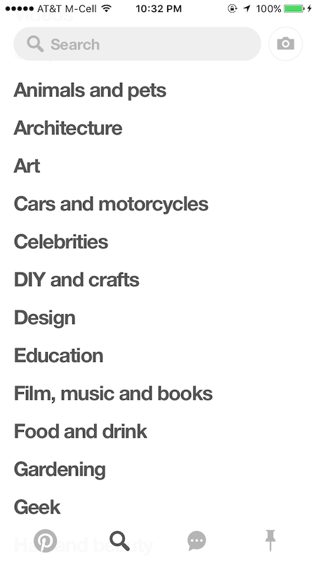
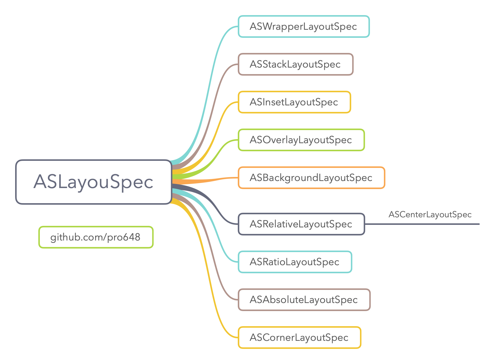
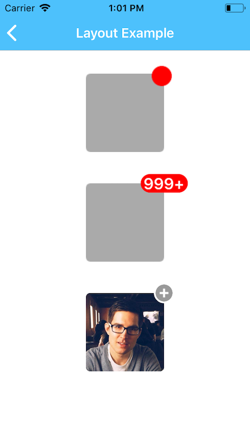
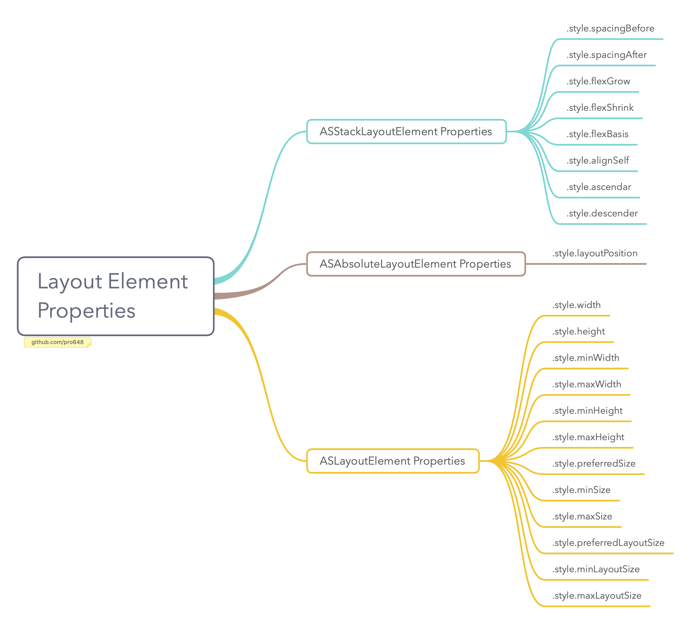
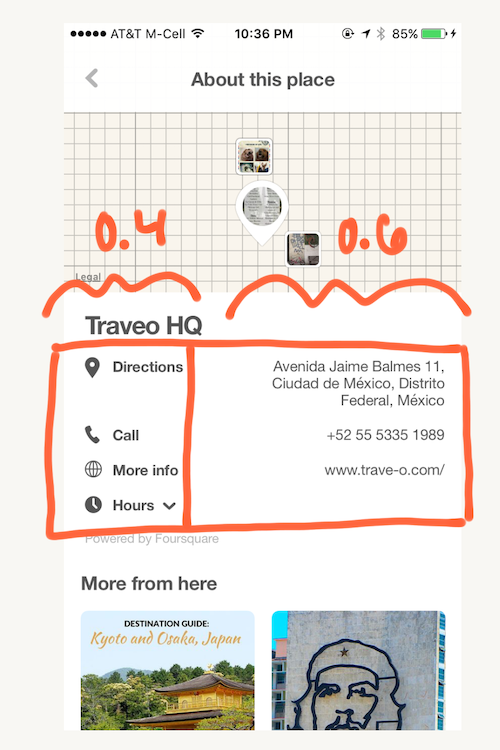

> 这是 Texture 文档系列翻译，其中结合了自己的理解和工作中的使用体会。如果哪里有误，希望指出。
>
> 1. [Texture 核心概念](https://github.com/pro648/tips/wiki/Texture%20%E6%A0%B8%E5%BF%83%E6%A6%82%E5%BF%B5)
>
> 2. [Texture 布局 Layout](https://github.com/pro648/tips/wiki/Texture%20%E5%B8%83%E5%B1%80%20Layout)
>
> 3. [Texture 便捷方法](https://github.com/pro648/tips/wiki/Texture%20%E4%BE%BF%E6%8D%B7%E6%96%B9%E6%B3%95)
>
> 4. [Texture 性能优化](https://github.com/pro648/tips/wiki/Texture%20%E6%80%A7%E8%83%BD%E4%BC%98%E5%8C%96)
>
> 5. [Texture 容器 Node Containers](https://github.com/pro648/tips/wiki/Texture%20%E5%AE%B9%E5%99%A8%20Node%20Containers)
>
> 6. [Texture 基本控件 Node](https://github.com/pro648/tips/wiki/Texture%20%E5%9F%BA%E6%9C%AC%E6%8E%A7%E4%BB%B6%20Node)
> 7. [Texture 中 Node 的生命周期](https://github.com/pro648/tips/wiki/Texture%20%E4%B8%AD%20Node%20%E7%9A%84%E7%94%9F%E5%91%BD%E5%91%A8%E6%9C%9F)

## 简介

#### Texture 布局的优势

Layout API 是为了替代 UIKit Auto Layout 的高性能布局方案。Auto layout 在布局复杂视图时，成本成倍增加。Texture 的 Layout API 具有许多优点：

- 快速：与手动布局一样快，比 auto layout 快很多。
- 异步和并发：布局在后台线程计算，不影响用户交互。
- 声明性（declarative）：布局用不可变数据结构声明。这使布局代码更易于开发、文档编写、代码审查、测试、调试、配置和维护。
- 可缓存：布局结果是不可变的数据结构，因此可以在后台对其预先计算并缓存，以提高用户感知性能。
- 可扩展：易于在类之间共享代码。

#### 受 CSS Flexbox 启发

如果你熟悉 Flexbox，会发现 Texture layout 和 Flexbox 有众多相似之处，然而 Texture Layout API 并未实现所有 CSS 功能。

#### 基本概念

Texture 的布局系统围绕两个基本概念：

1. 布局规范 Layout Specs。
2. 布局元素 Layout Elements。

###### 布局规范 Layout Specs

Layout spec 是 layout specification 的简称，没有物理存在。Layout spec 通过描述子布局元素相互关系来充当布局元素的容器。只能在`layoutSpecThatFits:`方法内创建、修改`ASLayoutSpec`，一旦将其传递回 ASDK，`ASLayoutSpec`的`isMutable`属性将被设置为 NO。此后尝试修改`ASLayoutSpec`会引起断言。

Texture 提供了多个`ASLayoutSpec`的子类，如`ASInsetLayoutSpec`、`ASStackLayoutSpec`、`ASBackgroundLayoutSpec`等。

###### 布局元素 Layout Elements

Layout spec 包含并排布 layout element。

`ASDisplayNode`和`ASLayoutSpec`遵守`ASLayoutElement`协议，这意味着可以将 node 和 layout spec 组成 layout spec。

`ASLayoutElement`协议有几个可用于创建复杂布局的属性。此外，layout spec 具有自己的属性集，可用于调整布局元素的位置。

#### 组合使用 layout spec 和 layout element 创建复杂 UI

通过下图可以看到如何将`ASTextNode`（黄色突出显示）、`ASVideoNode`（顶部图像）和`ASStackLayoutSpec`组合在一起以创建复杂的布局。


`ASVideoNode`上的播放按钮使用`ASCenterLayoutSpec`和`ASOverlayLayoutSpec`布局。


#### Node 大小

有些元素基于现有内容具有固有大小（intrinsic size）。例如，`ASTextNode`能够根据字符串计算自身大小。以下是具有 intrinsic size 的 node：

- `ASImageNode`
- `ASTextNode`
- `ASButtonNode`

其他 node 要么没有 intrinsic size，要么在加载外部资源前没有固有大小。例如，`ASNetworkImageNode`在从 URL 下载完图片前没有固有大小。以下是不具有固有大小的 node：

- `ASVideoNode`
- `ASVideoPlayerNode`
- `ASNetworkImageNode`
- `ASEditableTextNode`

这些缺少初始固有大小的 node，必须使用`ASRatioLayoutSpec`、`ASAbsoluteLayoutSpec`或`style`对象的`size`属性为其设置初始大小。

#### 布局调试

在`ASDisplay`和`ASLayoutSpec`上调用`asciiArtString`、`asciiArtName`，返回该类及其子类的`ascii-art`表现形式。如果为 node 或 layout spec 设置`.debugName`，该属性也会被显示到 ascii art 中。如下所示：

```
-----------------------ASStackLayoutSpec----------------------
|  -----ASStackLayoutSpec-----  -----ASStackLayoutSpec-----  |
|  |       ASImageNode       |  |       ASImageNode       |  |
|  |       ASImageNode       |  |       ASImageNode       |  |
|  ---------------------------  ---------------------------  |
--------------------------------------------------------------
```

你也可以输出`ASLayoutElement`的`style`对象，这在调试大小属性时特别有用。

```
(lldb) po _photoImageNode.style
Layout Size = min {414pt, 414pt} <= preferred {20%, 50%} <= max {414pt, 414pt}
```

## 布局示例

下面的示例摘取自[example project](https://github.com/texturegroup/texture/tree/master/examples/LayoutSpecExamples) demo。

#### 简单标题格式


实现上述布局方案：

- 垂直的`ASStackLayoutSpec`。
- 水平的`ASStackLayoutSpec`。
- 使用`ASInsetLayoutSpec`偏移整个 header。

下图显示了布局元素的组成（node 和 layout spec）:


```
- (ASLayoutSpec *)layoutSpecThatFits:(ASSizeRange)constrainedSize {
    // When the username / location text is too long,
    // shrink the stack to fit onscreen rather than push content to the right, offscreen
    ASStackLayoutSpec *nameLocationStack = [ASStackLayoutSpec verticalStackLayoutSpec];
    nameLocationStack.style.flexShrink = 1.0;
    nameLocationStack.style.flexGrow = 1.0;
    
    // If fetching post location data from server,
    // check if it is available yet and include it if so
    if (_postLocationNode.attributedText) {
        nameLocationStack.children = @[_usernameNode, _postLocationNode];
    } else {
        nameLocationStack.children = @[_usernameNode];
    }
    
    // Horizontal stack
    ASStackLayoutSpec *headerStackSpec = [ASStackLayoutSpec stackLayoutSpecWithDirection:ASStackLayoutDirectionHorizontal
                                                                                 spacing:40
                                                                          justifyContent:ASStackLayoutJustifyContentStart
                                                                              alignItems:ASStackLayoutAlignItemsCenter
                                                                                children:@[nameLocationStack, _postTimeNode]];
    
    // Inset the horizontal stack
    return [ASInsetLayoutSpec insetLayoutSpecWithInsets:UIEdgeInsetsMake(0, 10, 0, 10) child:headerStackSpec];
}
```

旋转设备可以查看间距变化。

#### 带有 inset 文字叠加的图片


实现上述布局方案：

- 使用`ASInsetLayoutSpec`inset 文本。
- 使用`ASOverlayLayoutSpec`将 inset 后的文本覆盖到图片上。

```
- (ASLayoutSpec *)layoutSpecThatFits:(ASSizeRange)constrainedSize {
    CGFloat photoDimension = constrainedSize.max.width / 4.0;
    _photoNode.style.preferredSize = CGSizeMake(photoDimension, photoDimension);
    
    // INFINITY is used to make the inset unbounded
    UIEdgeInsets insets = UIEdgeInsetsMake(INFINITY, 12, 12, 12);
    ASInsetLayoutSpec *textInsetSpec = [ASInsetLayoutSpec insetLayoutSpecWithInsets:insets child:_titleNode];
    
    return [ASOverlayLayoutSpec overlayLayoutSpecWithChild:_photoNode overlay:textInsetSpec];
}
```

#### 带有 outset 图标的图片


实现上述布局方案：

- 使用`ASCornerLayoutSpec`将图标放到图片边角。

```
- (ASLayoutSpec *)layoutSpecThatFits:(ASSizeRange)constrainedSize {
    _iconNode.style.preferredSize = CGSizeMake(40, 40);
    _photoNode.style.preferredSize = CGSizeMake(150, 150);
    
    return [ASCornerLayoutSpec cornerLayoutSpecWithChild:_photoNode
                                                  corner:_iconNode
                                                location:ASCornerLayoutLocationTopRight];
}
```

#### Inset 文本



实现上述布局方案：

- 使用`ASInsetLayoutSpec` inset 文本。
- 使用`ASCenterLayoutSpec`剧中文本。

```
- (ASLayoutSpec *)layoutSpecThatFits:(ASSizeRange)constrainedSize {
    UIEdgeInsets insets = UIEdgeInsetsMake(0, 12, 4, 4);
    ASInsetLayoutSpec *inset = [ASInsetLayoutSpec insetLayoutSpecWithInsets:insets
                                                                      child:_titleNode];
    
    return [ASCenterLayoutSpec centerLayoutSpecWithCenteringOptions:ASCenterLayoutSpecCenteringY
                                                      sizingOptions:ASCenterLayoutSpecSizingOptionMinimumX
                                                              child:inset];
}
```

#### 上下分割线


布局方案如下：

- 使用`ASInsetLayoutSpec` inset 文本。
- 使用垂直方向的`ASStackLayoutSpec`将分割线堆叠在文本的顶部和底部。

下图显示了布局方案的组成：


```
- (ASLayoutSpec *)layoutSpecThatFits:(ASSizeRange)constrainedSize {
   // flexGrow、flexShrink 均为 BOOL 类型
    _topSeparator.style.flexGrow = 1.0;
    _bottomSeparator.style.flexGrow = 1.0;
    
    ASInsetLayoutSpec *insetContentSpec = [ASInsetLayoutSpec insetLayoutSpecWithInsets:UIEdgeInsetsMake(20, 20, 20, 20)
                                                                                 child:_textNode];
    
    return [ASStackLayoutSpec stackLayoutSpecWithDirection:ASStackLayoutDirectionVertical
                                                   spacing:0
                                            justifyContent:ASStackLayoutJustifyContentCenter
                                                alignItems:ASStackLayoutAlignItemsStretch
                                                  children:@[_topSeparator, insetContentSpec, _bottomSeparator]];
}
```

## 布局规范 Layout Specs



可以使用以下`ASLayoutSpec`的子类组建复杂布局。

- `ASWrapperLayoutSpec`
- `ASStackLayoutSpec`
- `ASInsetLayoutSpec`
- `ASOverlayLayoutSpec`
- `ASBackgroundLayoutSpec`
- `ASRatioLayoutSpec`
- `ASRelativeLayoutSpec`
  - `ASCenterLayoutSpec`
- `ASAbsoluteLayoutSpec`
- `ASCornerLayoutSpec`

> `ASCenterLayoutSpec`继承自`ASRelativeLayoutSpec`。

可以通过继承`ASLayoutSpec`创建自定义布局规范。

#### ASWrapperLayoutSpec

`ASWrapperLayoutSpec`可以包装`ASLayoutElement`，并根据 layout element 大小计算子视图布局。

`ASWrapperLayoutSpec`适合于从`layoutSpecThatFits:`返回单个子节点，该子 node 可选设置大小。如果还需要设置位置信息，请使用`ASAbsoluteLayoutSpec`。

```
// return a single subnode from layoutSpecThatFits:
- (ASLayoutSpec *)layoutSpecThatFits:(ASSizeRange)constrainedSize {
    return [ASWrapperLayoutSpec wrapperWithLayoutElement:_subnode];
}

// set a size (but not position)
- (ASLayoutSpec *)layoutSpecThatFits:(ASSizeRange)constrainedSize {
    _subnode.style.preferredSize = CGSizeMake(constrainedSize.max.width,
                                              constrainedSize.max.height / 2.0);
    return [ASWrapperLayoutSpec wrapperWithLayoutElement:subnode];
}
```

#### ASStackLayoutSpec （Flexbox container）

在 Texture 的所有 layoutSpecs 中，`ASStackLayoutSpec`是最有用、最强大的。`ASStackLayoutSpec`使用 flexbox 算法确定子视图的位置和大小。Flexbox 旨在不同尺寸的屏幕上提供一致的布局，在堆栈布局中（stack layout），可以在垂直或水平方向对齐项目，Stack layout 可以嵌套使用。这使得可以使用 stack layout 创建几乎所有布局。

Stack layout 可以垂直或水平堆叠 children。初始布局时，children 在主轴方向无限大布局，交叉轴方向采用布局约束。在主轴方向所有 children 大小相加，如果和小于布局规范的最小值，设置了`flexGrow`的 children 将被拉伸；如果和大于布局规范的最大值，设置了`flexShrink`的 children 将被压缩；如果拉伸、压缩后仍然不符合布局规范，children 的`justifyContent`决定 children 布局方式。

例如：堆叠方向为垂直方向，min-width = 100, max-width = 300, min-height = 200, max-height = 500。初始布局时，所有 children 按照min-width = 100, max-width = 300, min-height = 0, max-height = INFINITY 布局。如果 children 高度和小于200，设置了`flexGrow`属性的 children 将会拉伸，如果 children 高度和大于500，设置了`flexShrink`属性的 children 将被压缩。每个 child 压缩高度为 总高度 - 500 / 可压缩 child 数量。如果压缩后高度依然大于500，`justifyContent`属性决定 children 布局方式。

`ASStackLayoutSpec`除了`ASLayoutElement`属性外，还具有以下属性：

- `direction`：设置 children 堆叠方向。如果设置了`verticalAlignment`或`horizontalAlignment`，将再次解析。从而导致`justifyContent`和`alignItems`相应地更新。
- `spacing`：child 间距。
- `horizontalAlignment`：指定 children 水平对齐方式。根据堆栈方向，设置对齐方式将导致`justifyContent`和`alignItems`被更新。后续堆栈方向改变时，此属性依然有效。
- `verticalAlignment`：指定 children 垂直对齐方式。根据堆栈方向，设置对齐方式将导致`justifyContent`和`alignItems`被更新。后续堆栈方向改变时，此属性依然有效。
- `justifyContent`：指定沿主轴的对齐方式。`justifyContent`属性决定了浏览器如何沿 flex 容器主轴和内连轴（inline axis）在内容项之间及其周围分配空间。采用该属性前会先根据`flexGrow`、`flexShrink`进行拉伸压缩，拉伸、压缩后依然超出、小于可用空间，会根据该属性进行布局。例如，`justifyContent`设置为`ASStackLayoutJustifyContentStart`时，如果最小占用空间超出规范大小，则超出部分在右下角；如果小于规范大小，则居左上角显示。点击[justify-content](https://developer.mozilla.org/en-US/docs/Web/CSS/justify-content)查看更为详细介绍。
- `alignItems`：指定 children 沿交叉轴的排列方式。
- `flexWrap`：children 排布在一列还是多列。默认排布为一列。
- `alignContent`：如果排布为多列，沿交叉轴排布方式。

```
- (ASLayoutSpec *)layoutSpecThatFits:(ASSizeRange)constrainedSize {
    ASStackLayoutSpec *mainStack = [ASStackLayoutSpec stackLayoutSpecWithDirection:ASStackLayoutDirectionHorizontal
                                                                           spacing:6.0
                                                                    justifyContent:ASStackLayoutJustifyContentStart
                                                                        alignItems:ASStackLayoutAlignItemsCenter
                                                                          children:@[_iconNode, _countNode]];
    
    // Set some constrained size to the stack
    mainStack.style.minWidth = ASDimensionMakeWithPoints(60.0);
    mainStack.style.maxHeight = ASDimensionMakeWithPoints(40.0);
    
    return mainStack;
}
```

> 可以查看[Flexbox playground](https://codepen.io/enxaneta/full/adLPwv)了解每个属性的具体布局方式。

#### ASInsetLayoutSpec

在布局传递期间，`ASInsetLayoutSpec`减去 inset 之后，将其 constrainedSize.max 传递给 child。child 确定其最终尺寸后，添加上 inset 即为最终尺寸。由于`ASInsetLayoutSpec`的布局是根据 child 尺寸确定的，因此 child 必须具有固有大小，或显式设置其大小。


如果`UIEdgeInsets`值设置为`INFINITY`，inset spec 将使用 child 的固有大小。

```
- (ASLayoutSpec *)layoutSpecThatFits:(ASSizeRange)constrainedSize {
    ...
    UIEdgeInsets *insets = UIEdgeInsetsMake(10, 10, 10, 10);
    ASInsetLayoutSpec *headerWithInset = [ASInsetLayoutSpec insetLayoutSpecWithInsets:insets child:textNode];
    ...
}
```

#### ASOverlayLayoutSpec

`ASOverlayLayoutSpec`布局 child（蓝色），并在其顶部拉伸另一个组件作为覆盖层（红色）。


Overlay 的大小根据 child 大小计算而来。在上图中，child 是蓝色部分，child 的大小作为`constrainedSize`传递给 overlay 布局元素。因此，child 必须具有固有大小，或显式设置大小。

```
- (ASLayoutSpec *)layoutSpecThatFits:(ASSizeRange)constrainedSize {
    _blueNode.style.preferredSize = CGSizeMake(150, 150);
    ASInsetLayoutSpec *redInsetLayoutSpec = [ASInsetLayoutSpec insetLayoutSpecWithInsets:UIEdgeInsetsMake(30, -30, -30, 30) child:_redNode];
    return [ASOverlayLayoutSpec overlayLayoutSpecWithChild:_blueNode overlay:redInsetLayoutSpec];
}
```

#### ASBackgroundLayoutSpec

`ASBackgroundLayoutSpec`布局一个组件 child（蓝色），并拉伸另一个组件作为背景（红色）。


背景组件的大小根据 child（蓝色）大小决定。布局时 child 大小会作为`constrainedSize`传递给背景组件（红色)。因此，child 必须具有固有大小，或显式设置大小。

```
- (ASLayoutSpec *)layoutSpecThatFits:(ASSizeRange)constrainedSize {
    _blueNode.style.preferredSize = CGSizeMake(150, 150);
    ASInsetLayoutSpec *redInsetLayoutSpec = [ASInsetLayoutSpec insetLayoutSpecWithInsets:UIEdgeInsetsMake(-30, 30, 30, -30) child:_redNode];
    return [ASBackgroundLayoutSpec backgroundLayoutSpecWithChild:_blueNode background:redInsetLayoutSpec];
}
```

> `ASBackgroundLayoutSpec`布局时，子节点添加的顺序会影响布局结果。必须先添加背景组件，后添加 child组件。使用自动子节点管理（automatic subnode management，简称ASM）并不能确保其添加顺序。

#### ASCenterLayoutSpec

`ASCenterLayoutSpec`将 child 布局于最大`constrainedSize`中。


如果没有限制`ASCenterLayoutSpec`的宽度、高度，则其会缩放到 child 大小。

`ASCenterLayoutSpec`包含以下属性：

- `centeringOptions`：确定 child 如何在 center spec 内居中，选项包括：none、X、Y、XY。
- `sizingOptions`：确定 center spec 占用空间。选项包括：Default、MinimumX、MinimumY、MinimumXY。

```
- (ASLayoutSpec *)layoutSpecThatFits:(ASSizeRange)constrainedSize {
    ASStaticSizeDisplayNode *subnode = ASDisplayNodeWithBackgroundColor([UIColor greenColor], CGSizeMake(70, 100));
    return [ASCenterLayoutSpec centerLayoutSpecWithCenteringOptions:ASCenterLayoutSpecCenteringXY
                                                      sizingOptions:ASCenterLayoutSpecSizingOptionDefault
                                                              child:subnode]
}
```

#### ASRatioLayoutSpec

`ASRatioLayoutSpec`用于固定组件纵横比，其可以缩放。`ASRatioLayoutSpec`必须提供宽度或高度，用以限制组件大小。


由于`ASNetworkImageNode`和`ASVideoNode`在服务器返回内容前没有固有大小，经常使用`ASRatioLayoutSpec`为`ASNetworkimageNode`和`ASVideoNode`提供固有大小。

```
- (ASLayoutSpec *)layoutSpecThatFits:(ASSizeRange)constrainedSize {
    // Half Ratio
    ASStaticSizeDisplayNode *subnode = ASDisplayNodeWithBackgroundColor([UIColor greenColor], CGSizeMake(100, 100));
    return [ASRatioLayoutSpec ratioLayoutSpecWithRatio:0.5
                                                 child:subnode];
}
```

#### ASRelativeLayoutSpec

`ASRelativeLayoutSpec`根据水平、垂直位置标志符在布局范围内进行布局。类似于九宫格图片，child 可以位于四角、边线中间或中心。

`ASRelativeLayoutSpec`类非常强大，可以查看`ASRelativeLayoutSpec`的`calculateLayoutThatFits:`方法了解具体实现细节：

```
- (ASLayoutSpec *)layoutSpecThatFits:(ASSizeRange)constrainedSize {
    ...
    ASDisplayNode *backgroundNode = ASDisplayNodeWithBackgroundColor([UIColor redColor]);
    ASStaticSizeDisplayNode *foregroundNode = ASDisplayNodeWithBackgroundColor([UIColor greenColor], CGSizeMake(70, 100));
    
    ASRelativeLayoutSpec *relativeSpec = [ASRelativeLayoutSpec relativePositionLayoutSpecWithHorizontalPosition:ASRelativeLayoutSpecPositionStart
                                                                                               verticalPosition:ASRelativeLayoutSpecPositionStart
                                                                                                   sizingOption:ASRelativeLayoutSpecSizingOptionDefault
                                                                                                          child:foregroundNode]
    
    ASBackgroundLayoutSpec *backgroundSpec = [ASBackgroundLayoutSpec backgroundLayoutSpecWithChild:relativeSpec background:backgroundNode];
    ...
}
```

#### ASAbsoluteLayoutSpec

`ASAbsoluteLayoutSpec`通过设置`layoutPosition`属性指定 children 具体位置。与其他布局方式相比，`ASAbsoluteLayoutSpec`不灵活且难以维护。

`ASAbsoluteLayoutSpec`只有一个属性：

- `sizing`：`ASAbsoluteLayoutSpecSizing`指定 spec 占用空间，`ASAbsoluteLayoutSpecSizingDefault`尽可能占用更多空间；`ASAbsoluteLayoutSpecSizingSizeToFit`计算出的大小是所有 frame 的和。

```
- (ASLayoutSpec *)layoutSpecThatFits:(ASSizeRange)constrainedSize {
    CGSize maxConstrainedSize = constrainedSize.max;
    
    // Layout all nodes absolute in a static layout spec
    guitarVideoNode.style.layoutPosition = CGPointMake(0, 0);
    guitarVideoNode.style.preferredSize = CGSizeMake(maxConstrainedSize.width, maxConstrainedSize.height / 3.0);
    
    nicCageVideoNode.style.layoutPosition = CGPointMake(maxConstrainedSize.width / 2.0, maxConstrainedSize.height / 3.0);
    nicCageVideoNode.style.preferredSize = CGSizeMake(maxConstrainedSize.width / 2.0, maxConstrainedSize.height / 3.0);
    
    simonVideoNode.style.layoutPosition = CGPointMake(0.0, maxConstrainedSize.height - (maxConstrainedSize.height / 3.0));
    simonVideoNode.style.preferredSize = CGSizeMake(maxConstrainedSize.width/2, maxConstrainedSize.height / 3.0);
    
    hlsVideoNode.style.layoutPosition = CGPointMake(0.0, maxConstrainedSize.height / 3.0);
    hlsVideoNode.style.preferredSize = CGSizeMake(maxConstrainedSize.width / 2.0, maxConstrainedSize.height / 3.0);
    
    return [ASAbsoluteLayoutSpec absoluteLayoutSpecWithChildren:@[guitarVideoNode, nicCageVideoNode, simonVideoNode, hlsVideoNode]];
}
```

#### ASCornerLayoutSpec

`ASCornerLayoutSpec`可以便捷的在四个角布局元素。将元素放置在角落的简单方法是使用声明性代码表达式，而非手动计算坐标。`ASCornerLayoutSpec`可以很方便的实现这项任务。



`ASCornerLayoutSpec`可以计算自身大小。`ASCornerLayoutSpec`的用途之一是为头像添加角标，这时无需担心超出头像部分的 frame 会影响整个布局大小。默认情况下，角标元素大小不会计算进布局大小；如果需要计算进去，手动设置`wrapsCorner`属性为`YES`。

```
- (ASLayoutSpec *)layoutSpecThatFits:(ASSizeRange)constrainedSize {
    ...
    // Layout the center of badge to the top right corner of avatar.
    ASCornerLayoutSpec *cornerSpec = [ASCornerLayoutSpec cornerLayoutSpecWithChild:self.avatarNode corner:self.badgeNode location:ASCornerLayoutLocationTopRight];
    // Slightly shift center of badge inside of avatar.
    cornerSpec.offset = CGPointMake(-3, 3);
    ...
}
```

#### ASLayoutSpec

`ASLayoutSpec`是所有布局方案的父类。其主要功能是管理所有 children，但也可用于创建子类。只有极少高级用户需要创建`ASLayoutSpec`的子类，尽可能利用上面提供的类组合创建复杂布局。

`ASLayoutSpec`的另一用途是为`ASStackLayoutSpec`提供空间，此时需要设置`flexGrow`或`flexShrink`。

```
- (ASLayoutSpec *)layoutSpecThatFits:(ASSizeRange)constrainedSize {
    ...
    // ASLayoutSpec as spacer
    ASLayoutSpec *spacer = [[ASLayoutSpec alloc] init];
    spacer.style.flexGrow = 1.0;
    
    stack.children = @[imageNode, spacer, textNode];
    ...
}
```

## 布局元素的属性



- ASStackLayoutElement Properties 可用于任何 node 或 layoutSpec，但只对 stack spec 的 child 有效。
- ASAbsoluteLayoutElement Properties 只对 absolute spec 的 child 有效。
- ASLayoutElement properties 对所有 node 和 layout spec 有效。

#### ASStackLayoutElement Properties

| 属性                                        | 描述                                                         |
| ------------------------------------------- | ------------------------------------------------------------ |
| CGFloat<br>.style.spacingBefore             | 在 stack 方向、该对象前面的额外空间。                        |
| CGFloat<br/>.style.spacingAfter             | 在 stack 方向、该对象后面的额外空间                          |
| CGFloat<br/>.style.flexGrow                 | 如果 stack 的和小于允许的最小值，该对象是否拉伸。            |
| CGFloat<br/>.style.flexShrink               | 如果 stack 的和大于允许的最大值，该对象是否压缩。            |
| ASDimension<br/>.style.flexBasis            | 在应用`flexGrow`、`flexShrink`属性并分配剩余空间前，在 stack 方向上的初始大小。 |
| ASStackLayoutAlignSelf<br/>.style.alignSelf | 对象沿交叉轴方向对齐方式，重写`alignItems`属性。选项包括：ASStackLayoutAlignSelfAuto、ASStackLayoutAlignSelfStart、ASStackLayoutAlignEnd、ASStackLayoutAlignSelfCenter、ASStackLayoutAlignSelfStretch。 |
| CGFloat<br/>.style.ascender                 | 用于基线对齐方式。从对象顶部至基线的距离。                   |
| CGFloat<br/>.style.descender                | 用于基线对齐方式。从对象基线至顶部的距离。                   |

#### ASAbsoluteLayoutElement Properties

| 属性                              | 描述                                                |
| --------------------------------- | --------------------------------------------------- |
| CGPoint<br/>.style.layoutPosition | 对象在`ASABsoluteLayoutSpec`规范中的`CGPoint`位置。 |

#### ASLayoutElement properties

| 属性                                        | 描述                                                         |
| ------------------------------------------- | ------------------------------------------------------------ |
| ASDimension<br/>.style.width                | `width`属性指定`ASLayoutElement`内容区域宽度，`minWidth`和`maxWidth`属性会重写`width`。即当`width`值小于`minWidth`时，以`minWidth`为准。默认为`ASDimensionAuto`。 |
| ASDimension<br/>.style.height               | `height`属性指定`ASLayoutElement`内容区域高度，`minHeight`和`maxHeight`属性会重写`width`。默认为`ASDimensionAuto`。 |
| ASDimension<br/>.style.minWidth             | `minWidth`属性用于设定给定元素的最小宽度。`minWidth`的值会重写`maxWidth`和`width`。默认为`ASDimensionAuto`。 |
| ASDimension<br/>.style.maxWidth             | `maxWidth`属性用于设定给定元素的最大宽度。`maxWidth`属性会阻止`width`的值大于`maxWidth`。`maxWidth`属性重写`width`，`minWidth`属性重写`maxWidth`。默认为`ASDimensionAuto`。 |
| ASDimension<br/>.style.minHeight            | `minHeight`属性用于设定给定元素的最小高度。`minHeight`属性会阻止`height`的值小于`minHeight`。`minHeight`会重写`maxHeight`和`height`。默认为`ASDimensionAuto`。 |
| ASDimension<br/>.style.maxHeight            | `maxHeight`属性用于设定给定元素的最大高度。`maxHeight`属性会阻止`height`的值大于`maxHeight`。`maxHeight`会重写`height`，`minHeight`会重写`maxHeight`。默认为`ASDimensionAuto`。 |
| CGSize<br/>.style.preferredSize             | 为布局元素设置推荐大小。如果设置了可选值`minSize`、`maxSize`，且`preferredSize`超过了其限制，则采用`minSize`、`maxSize`的值。如果未设置`preferredSize`，则默认采用`calculateSizeThatFits:`计算出的固有大小。<br/>该属性可选设置。如果 node 没有固有大小或需要设置为其他大小，则需要设置`preferredSize`属性。例如，为`ASDisplayNode`设置不同于图片大小的值。<br/>当 size 为相对大小时，调用`height`、`width`的取值方法会触发断言。 |
| CGSize<br/>.style.minSize                   | 为布局元素设置最小尺寸，可选属性。如果设置了该属性，则强制满足该属性。如果父视图最小尺寸小于子视图最小尺寸，则强制满足子视图最小尺寸，父视图尺寸会超出其自身限制。 |
| CGSize<br/>.style.maxSize                   | 为布局元素设置最大尺寸，可选属性。如果设置了该属性，则强制满足该属性。如果子视图最大尺寸小于父视图限制，则采用子视图尺寸限制。 |
| ASLayoutSize<br/>.style.preferredLayoutSize | 为布局元素提供相对大小，可选属性。`ASLayoutSize`使用百分比而非 point 指定大小。例如，宽度为父视图 50%。如果提供了可选的`minLayoutSize`、`maxLayoutSize`，且`preferredLayoutSize`超过了`minLayoutSize`、`maxLayoutSize`的限制，则采用`minLayoutSize`、`maxLayoutSize`属性的值。如果未提供，则采用`calculateSizeThatFits:`计算的固有大小。 |
| ASLayoutSize<br/>.style.minLayoutSize       | 为布局元素提供相对大小的最小值，可选属性。如果提供了该属性，则强制满足该限制。如果父级布局最小相对尺寸小于子级最小相对尺寸，则强制满足子级最小尺寸。 |
| ASLayoutSize<br/>.style.maxLayoutSize       | 为布局元素提供相对大小的最大值，可选属性。如果提供了该属性，则强制满足该限制。如果父级布局最大相对尺寸小于子级最大相对尺寸，则强制满足子级最大尺寸。 |

## 布局大小单位

下面介绍布局大小的相关单位。


#### Values（CGFloat，ASDimension）

`ASDimension`本质上是一个普通的`CGFloat`，其支持 point、百分比或自动值。

同一 API 支持固定值和相对值。

```
// dimension returned is relative (%)
ASDimensionMake(@"50%");
ASDimensionMakeWithFraction(0.5);

// dimension returned in points
ASDimensionMake(@"70pt");
ASDimensionMake(70);
ASDimensionMakeWithPoints(70);
```

`ASDimension`用于设置`ASStackLayoutSpec` child 的`flexBasis`属性。`flexBasis`指定 stack 轴向初始大小。

在下图中，水平 stack 左侧占比 50%，右侧占比 60%。



通过设置横向 stack children 的`flexBasis`属性可以实现上述需求。

```
self.leftStack.style.flexBasis = ASDimensionMake(@"40%");
self.rightStack.style.flexBasis = ASDimensionMake(@"60%");

[horizontalStack setChildren:@[self.leftStack, self.rightStack]];
```

#### Sizes(CGSize, ASLayoutSize)

`ASLayoutSize`与`CGSize`相似，但其宽度和高度可以使用 points 和百分比表示。高度和宽度可以是不同表示类型。

```
ASLayoutSizeMake(ASDimension width, ASDimension height);
```

`ASLayoutSize`用于设置布局元素的`preferredLayoutSize`、`minLayoutSize`和`maxLayoutSize`属性。其允许同一 API 同时使用固定大小和相对大小。

```
// Dimension type "Auto" indicates that the layout element may 
// be resolved in whatever way makes most sense given the circumstances
ASDimension width = ASDimensionMake(ASDimensionUnitAuto, 0);  
ASDimension height = ASDimensionMake(@"50%");

layoutElement.style.preferredLayoutSize = ASLayoutSizeMake(width, height);
```

如果不需要相对尺寸，可以使用`preferredSize`、`minSize`、`maxSize`属性。这些属性使用常规`CGSize`值。

```
layoutElement.style.preferredSize = CGSizeMake(30, 160);
```

通常情况下，不需同时设置高度和宽地。这种情况下可以使用`ASDimension`设置所需值。

```
layoutElement.style.width     = ASDimensionMake(@"50%");
layoutElement.style.minWidth  = ASDimensionMake(@"50%");
layoutElement.style.maxWidth  = ASDimensionMake(@"50%");

layoutElement.style.height    = ASDimensionMake(@"50%");
layoutElement.style.minHeight = ASDimensionMake(@"50%");
layoutElement.style.maxHeight = ASDimensionMake(@"50%");
```

#### Size Range（ASSizeRange）

`UIKit`没有提供最小、最大`CGSize`结构。因此，创建了`ASSizeRange`以支持最小和最大`CGSize`结构。

`ASSizeRange`通常用在布局API内部，但`layoutSpecThatFits:`的参数是`ASSizeRange`。

```
- (ASLayoutSpec *)layoutSpecThatFits:(ASSizeRange)constrainedSize;
```

传递给`layoutSpecThatFits:`的 constrainedSize 参数包含了 node 需满足的最小、最大尺寸，用以规范 node 尺寸。

> Texture 也可以使用动画，具体可以查看[Layout Transition API](https://texturegroup.org/docs/layout-transition-api.html)

> 上一篇：[Texture 核心概念](https://github.com/pro648/tips/wiki/Texture%20%E6%A0%B8%E5%BF%83%E6%A6%82%E5%BF%B5)
>
> 下一篇：[Texture 便捷方法](https://github.com/pro648/tips/wiki/Texture%20%E4%BE%BF%E6%8D%B7%E6%96%B9%E6%B3%95)