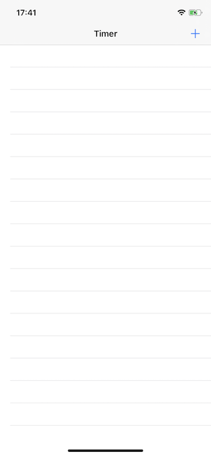
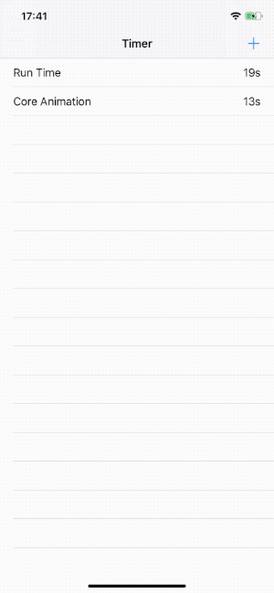
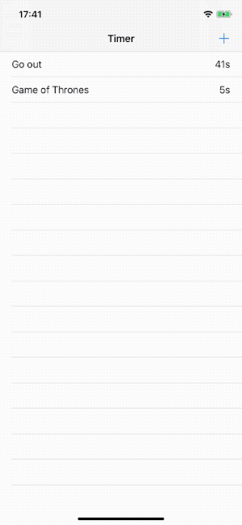
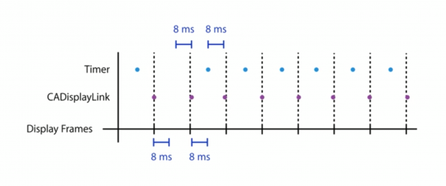

这篇文章将介绍计时器（Timer）如何使用，影响 UI 响应速度，对电量的影响，以及如何使用`CADisplayLink`处理动画。

## 1. 什么是计时器

`Timer`继承自`NSObject`，用以提供延迟（周期性）触发动作的方法。通常，定时器会在指定间隔后自动触发，向指定对象发送消息。如果 timer 是非重复定时器，则触发一次后自动失效，从而防止定时器再次触发；如果是重复定时器，则会在指定间隔后重复触发，需手动调用`invaliate()`方法使计时器无效。

这篇文章将创建一个 ToDo app。ToDo app 跟踪任务完成所用时间，所有任务都完成时 app 会弹出恭喜完成的动画。

下载这篇文章所用[模版](https://github.com/pro648/BasicDemos-iOS/tree/master/Timer模版)，运行后如下：



点击右上角 + 按钮创建任务，点击任务将其标记为完成，完成的任务名称会用横线提示。目前，任务的时间会一直显示为0s，不会增加。

## 2. 创建计时器

下面创建一个 timer。打开`ViewController.swift`文件，添加以下变量：

```
    var timer: Timer?
```

在文件底部添加一个 extension，并添加以下方法：

```
// MARK: - Timer
extension ViewController {
    func updateTimer() {
        if let fireDateDescription = timer?.fireDate.description {
            print(fireDateDescription)
        }
        
        guard let visibleRowsIndexPaths = tableView.indexPathsForVisibleRows else {
            return
        }
        
        for indexPath in visibleRowsIndexPaths {
            if let cell = tableView.cellForRow(at: indexPath) as? TaskTableViewCell {
                cell.updateTime()
            }
        }
    }
}
```

上述方法会更新所有可见 cell 的时间。

使用下面方法创建计时器：

```
    func createTimer() {
        if timer == nil {
            timer = Timer.scheduledTimer(timeInterval: 1.0,
                                         target: self,
                                         selector: #selector(updateTimer),
                                         userInfo: nil,
                                         repeats: true)
        }
    }
```

`timer`计时器每隔1秒钟触发一次。如果间隔小于等于0.0秒，计时器会采用0.1毫秒作为间隔。

在用户点击添加按钮时创建计时器。在`presentAlertController(_:)`方法第一行调用创建计时器方法：

```
        createTimer()
```

运行 demo 并添加任务，如下所示：



现在，cell 可以更新显示当前已用时间。

## 3. 优化计时器

#### 3.1 tolerance

随着 app 内计时器数量变多，app 响应会变慢、电量消耗会变快。这是因为`Timer`的`tolerance`默认为0，每个计时器都尽可能在精准时间触发。

使用`tolerance`属性可以减少电量消耗、提高响应速度。`Timer`可以在指定时间和指定时间加`tolerance`之间触发，timer 不会在指定时间之前触发。对于重复计时器，下一个触发时间根据原始触发时间计算得到，与`tolerance`无关。`tolerance`默认为0，但系统保留对某些计时器应用少量`tolerance`的权利。

开发者可以指定`tolerance`的值。通常，`tolerance`值至少为间隔的10%，即使很小的`tolerance`也会对性能产生积极影响。系统可能会限制`tolerance`的最大值。

在`createTimer()`方法内设置`tolerance`值：

```
            timer?.tolerance = 0.15
```

App 不会因此产生明显变化，但其可以提高响应速度、减少电量消耗。

#### 3.2 fireDate

如果计时器已经失效，`fireDate`属性返回计时器上次触发时间。

通过设置该属性可以修改 timer 的触发时间。尽管重设计时器的触发时间是一个昂贵的操作，但在某些情况下会相对高效。例如，想要重复某个操作多次，但`timeInterval`没有规律。这时可以创建多个 timer，分别添加到 run loop，使用完毕后销毁。相比之下，创建一个计时器，修改触发时间更为高效。

不能修改已经无效的 timer，包括已触发的单次计时器。另外，修改`fireDate`时，需在添加计时器的线程修改。修改之前使用`isValid`方法判断计时器是否有效。

```
        if timer.isValid {
            guard let fireDate = Calendar.current.date(byAdding: .minute, value: 1, to: Date()) else {
                return
            }
            timer.fireDate = fireDate
        }
```

上述代码可以将计时器设置为1分钟触发，其间隔保持不变。

## 4. Run Loop 与 Timer 关系

App 进入后台计时器是否还会工作？为了解这个问题，在`updateTimer()`方法添加以下代码，在计时器触发时输出当前时间：

```
        if let fireDateDescription = timer?.fireDate.description {
            print(fireDateDescription)
        }
```

运行demo并添加任务，此时可以看到控制台输出；将 app 置于后台，控制台停止输出；app 再次进入前台，输出继续。如下所示：

```
2020-01-20 12:55:33 +0000
2020-01-20 12:55:34 +0000
2020-01-20 12:55:35 +0000
2020-01-20 12:55:36 +0000
2020-01-20 20:55:37.584780+0800 Timer[7536:481577] [Snapshotting] Snapshotting a view (0x7fa1e2892600, UIKeyboardImpl) that is not in a visible window requires afterScreenUpdates:YES.
2020-01-20 20:55:40.913962+0800 Timer[7536:481577] Can't end BackgroundTask: no background task exists with identifier 1 (0x1), or it may have already been ended. Break in UIApplicationEndBackgroundTaskError() to debug.
2020-01-20 12:55:37 +0000
2020-01-20 12:55:41 +0000
2020-01-20 12:55:46 +0000
2020-01-20 12:55:47 +0000
```

#### 4.1 理解 Run Loop

运行循环（Run Loop）是与线程相关的基础功能，用于计划工作和协调接收传入的事件。Run loop 的目的在于有工作时让线程忙碌，没有工作时让线程休眠。

计时器与 run loop 配合使用，run loop 对计时器强引用。因此，在将计时器添加到 run loop 后，自己不必维护对计时器的强引用。想要在自己创建的线程上使用`Timer`，必须手动创建 run loop。如果你对 run loop 还不熟悉，可以查看[RunLoop从入门到进阶](https://github.com/pro648/tips/wiki/RunLoop%E4%BB%8E%E5%85%A5%E9%97%A8%E5%88%B0%E8%BF%9B%E9%98%B6)这篇文章。

在调用`applicationDidFinishLaunching(_:)`方法时，主线程已经启动 run loop。`Timer`必须添加到 run loop 才可以工作，其中，下面三种方法创建的计时器默认添加到当前线程的 default mode：

- `scheduledTimer(withTimeInterval:repeats:block:)`
- `scheduledTimer(withInterval:target:selector:userInfo:repeats)`
- `scheduledTimer(timeInterval:invocation:repeats:)`

下面五种方法创建的计时器需使用`add(_:forMode:)`方法手动添加到 run loop：

- `init(timeInterval:repeats:block:)`
- `init(timeInterval:target:selector:userInfo:repeats:)`
- `init(timeInterval:invocation:repeats:)`
- `init(fire; interval:repeats:block:)`
- `init(fireAt:interval:target:selector:userInfo:repeats:)`

主线程用于绘制用户界面、监听手势等。当主线程忙于其他工作时，滑动视图会出现掉帧。

当滑动 table view 时，计时器会停止工作。这是因为此时主线程 run loop 进入了`tracking`mode，而使用scheduledTimer方法创建的计时器添加到了 run loop `default`mode。

> 需要注意的是，`scheduledTimer`方式将 timer 添加到当前线程的 run loop，而非主线程的 run loop。如果当前线程没有手动添加 run loop，则计时器不会触发。
>
> ```
>         DispatchQueue.global(qos: .userInteractive).async {
>             // 添加到全局队列当前线程，由于当前线程没有runloop，下面计时器不会触发。
>             Timer.scheduledTimer(withTimeInterval: 1.0, repeats: true) { (timer) in
>                 print(timer.fireDate.description)
>             }
>         }
> ```
>
> GCD global 队列中线程没有使用 run loop，所以上述计时器不会触发。

#### 4.2 使用 Run Loop Mode

Run loop mode 集合包含了要监控的 input source、timer，以及要通知的 observer。每次启动 run loop 时需要显式或隐式指定其运行的 mode。在运行期间，仅监视与该 mode 关联的 source，且只允许与该 mode 关联的 source 传递事件，同时 run loop 的进度也只通知与该 mode 关联的 observer。与其他 mode 关联的 source 持有事件，直到运行其 mode。这样做可以隔离不同组 source、timer、observer，让其互不影响。

有以下三个公开 run loop mode：

- default：最为常用的 mode。大部分情况下，使用此 mode 配置 run loop 即可。
- tracking：`UIScrollView`滑动时，处于`UITrackingRunLoopMode`。
- common：使用 common modes 做为模式添加到 run loop 的对象，会受 common modes 所有 mode 的监视。Default mode 和 tracking mode 均将自身标记为 commond modes。

要解决 scroll view 滑动时，计时器无法工作，只需将计时器添加到 common mode 即可。

更新`createTimer()`，如下所示：

```
    func createTimer() {
        if timer == nil {
            let timer = Timer(timeInterval: 1.0,
                              target: self,
                              selector: #selector(updateTimer),
                              userInfo: nil,
                              repeats: true)
            RunLoop.current.add(timer, forMode: .common)
            timer.tolerance = 0.15
            
            self.timer = timer
        }
    }
```

运行 demo，滑动 table view 时，`Timer`会继续更新时间。

## 5. 使用 Timer 控制动画

当用户完成所有任务时，从屏幕底部向上弹出恭喜动画。

在`ViewController.swift`文件顶部添加以下变量：

```
    var animationTimer: Timer?
    var startTime: TimeInterval?, endTime: TimeInterval?
    let animationDuration = 3.0
    var height: CGFloat = 0
```

在`ViewController.swift`文件底部添加以下 extension：

```
// MARK: - Animation
extension ViewController {
    func showCongratulationAnimation() {
        height = UIScreen.main.bounds.height + balloon.frame.size.height
        balloon.center = CGPoint(x: UIScreen.main.bounds.width / 2, y: height + balloon.frame.size.height / 2)
        balloon.isHidden = false
        
        startTime = Date().timeIntervalSince1970
        endTime = animationDuration + startTime!
        
        animationTimer = Timer.scheduledTimer(withTimeInterval: 1 / 60, repeats: true, block: { (timer) in
            self.updateAnimation()
        })
    }
}
```

在上述代码中，使用计时器每秒60次更新 balloon 位置。

实现`updateAnimation()`方法，更新 balloon 位置：

```
    func updateAnimation() {
        guard let endTime = endTime,
        let startTime = startTime else { return }
        
        let now = Date().timeIntervalSince1970
        
        if now >= endTime {
            animationTimer?.invalidate()
            balloon.isHidden = true
        }
        
        let percentage = (now - startTime) * 100 / animationDuration
        let y = height - ((height + balloon.frame.height / 2) / 100 * CGFloat(percentage))
        
        balloon.center = CGPoint(x: balloon.center.x + CGFloat.random(in: -0.5...0.5), y: y)
    }
```

添加以下代码，在所有任务均完成时触发动画：

```
    func showCongratulationsIfNeeded() {
        if taskList.filter({ !$0.completed }).count == 0 {
            showCongratulationAnimation()
        }
    }
```

在`tableView(_:didSelectRowAt:)`方法内调用`showCongratulationsIfNeeded()`方法：

```
extension ViewController: UITableViewDelegate {
    func tableView(_ tableView: UITableView, didSelectRowAt indexPath: IndexPath) {
        ...
        showCongratulationsIfNeeded()
    }
}
```

运行demo，所有任务完成后会弹出如下动画：



## 6. 终止 Timer

所有任务均标记为完成后，控制台还在继续输出。因此，计时器还在触发事件。终止计时器可以节约电量。

在 Timer extension 添加以下方法：

```
    func cancelTimer() {
        timer?.invalidate()
        timer = nil
    }
```

`invalidate()`方法会停止计时器，并请求从 run loop 移除。`invalidate()`方法是将计时器从 run loop 移除的唯一方法。Run loop 会在`invalidate()`方法返回前、或稍后，将对 timer 的强引用移除。如果配置了 target、userInfo，计时器会移除对这些对象的强引用。

> 必须在安装`Timer`的线程调用`invalidate()`方法。如果在其他线程调用，timer 的[input source](https://github.com/pro648/tips/wiki/RunLoop%E4%BB%8E%E5%85%A5%E9%97%A8%E5%88%B0%E8%BF%9B%E9%98%B6#32-input-source)可能无法从 run loop 移除，进而导致线程无法正常退出。

更新`showCongratulationsIfNeeded()`方法：

```
    func showCongratulationsIfNeeded() {
        if taskList.filter({ !$0.completed }).count == 0 {
            cancelTimer()
            showCongratulationAnimation()
        } else {
            createTimer()
        }
    }
```

目前，用户完成所有任务时，app 先终止计时器后显示动画；反之，尝试创建计时器。

## 7. 使用 CADisplayLink 显示动画

`Timer`并不适合控制动画，其很容易出现掉帧。

目前，timer 间隔是1/60秒，即 timer 每16毫秒调用一次动画。



使用`Timer`时，无法掌握精准触发时间。其可能在 frame 开始时触发，也可能在结束时触发。为使问题简单，假设 timer 在每一帧中间触发（绿点位置）。由于很难知道计时器确切时间，因此只能确保每16毫秒收到一次回调。现在，只有8毫秒时间执行动画，这对于动画帧来说可能是不够的。通过上图可以看到，第二帧可能没有足够时间进行绘制，进而导致掉帧。可用时间也从16毫秒变为了8毫秒。

`CADisplayLink`每帧调用一次，并将尽可能与屏幕帧率同步。这样就可以拥有16毫秒可用时间，进而避免掉帧。即使在 ProMotion 显示屏且频率为 120Hz 的新款 iPad 上，也可以做到一帧不掉。

使用`CADisplayLink`替换`animationTimer`：

```
//    var animationTimer: Timer?
//    var startTime: TimeInterval?, endTime: TimeInterval?
    var displayLink: CADisplayLink?
    var startTime: CFTimeInterval?, endTime: CFTimeInterval?
```

`CADisplayLink`是与显示器绑定的计时器，这意味着 GPU 将停滞，直到屏幕准备好处理更多 GPU 命令为止。这样，可以确保动画更加流畅。使用`CFTimeInterval`替换`TimeInterval`，`CFTimeInterval`与`CADisplayLink`可以很好配合使用。

更新`showCongratulationAnimation()`如下：

```
func showCongratulationAnimation() {
        height = UIScreen.main.bounds.height + balloon.frame.size.height
        balloon.center = CGPoint(x: UIScreen.main.bounds.width / 2, y: height + balloon.frame.size.height / 2)
        balloon.isHidden = false
        
        startTime = Date().timeIntervalSince1970
        endTime = animationDuration + startTime!
        
        displayLink = CADisplayLink(target: self,
                                    selector: #selector(updateAnimation))
        displayLink?.add(to: RunLoop.main, forMode: .common)
    }
```

上面设置了displayLink，并添加到主线程运行循环的 common mode。

更新`updateAnimation()`方法如下：

```
    @objc func updateAnimation() {
        guard let endTime = endTime,
        let startTime = startTime else { return }
        
        let now = CACurrentMediaTime()
        
        if now >= endTime {
            displayLink?.isPaused = true
            displayLink?.invalidate()
            balloon.isHidden = true
        }
        
        let percentage = (now - startTime) * 100 / animationDuration
        let y = height - ((height + balloon.frame.height / 2) / 100 * CGFloat(percentage))
        
        balloon.center = CGPoint(x: balloon.center.x + CGFloat.random(in: -0.5...0.5), y: y)
    }
```

由于`CADisplayLink`需要 Objective-C selector方法，在`updateAnimation()`方法前添加了@objc。使用`CACurrentMediaTime`替换`Date()`。使用`CADisplayLink`暂停、终止动画，这样会将 displayLink 从 run loop 移除，并释放自身持有的 target。

再次运行demo，其会比使用`Timer`更为顺畅。

> 如果你对`CADisplayLink`不了解，可以查看我的另一篇文章：[计时器CADisplayLink](https://github.com/pro648/tips/blob/master/sources/%E8%AE%A1%E6%97%B6%E5%99%A8CADisplayLink.md)。

Demo名称：Timer  
源码地址：<https://github.com/pro648/BasicDemos-iOS/tree/master/Timer>

参考资料：

1. [定时器NSTimer的使用](https://github.com/darkjoin/Learning/wiki/%E5%AE%9A%E6%97%B6%E5%99%A8NSTimer%E7%9A%84%E4%BD%BF%E7%94%A8)
2. [iOS Timer Tutorial](https://www.raywenderlich.com/113835-ios-timer-tutorial)

