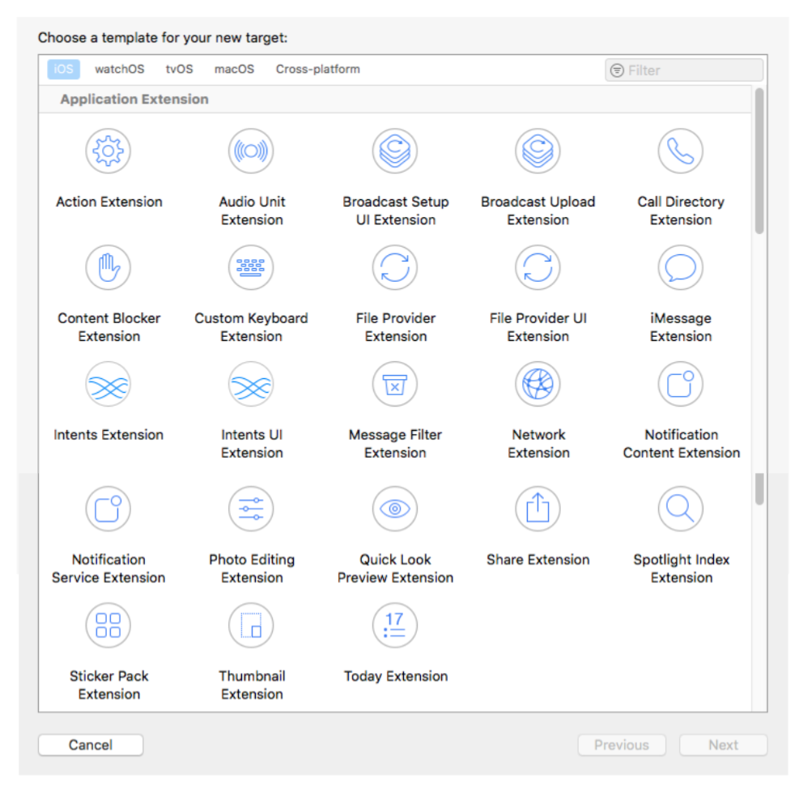
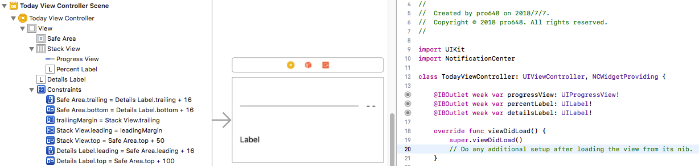
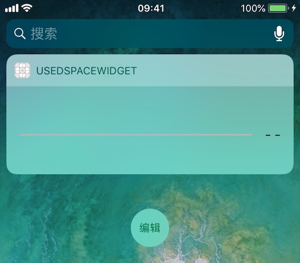
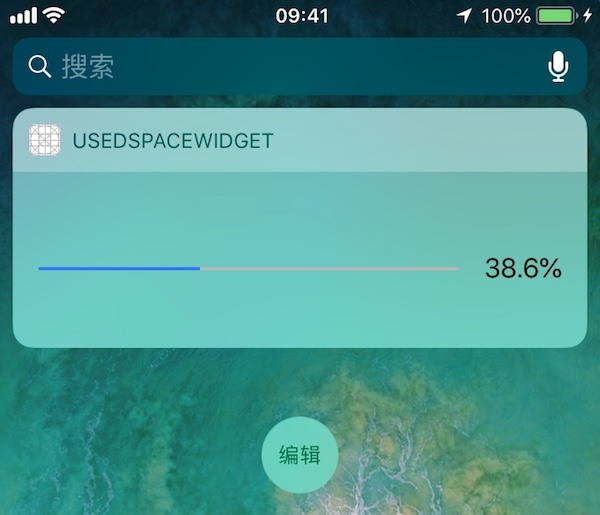
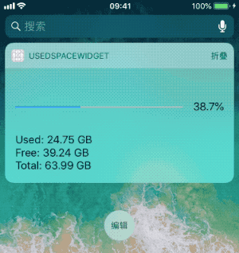
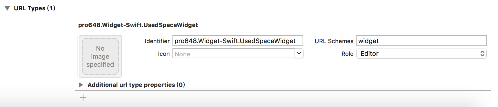
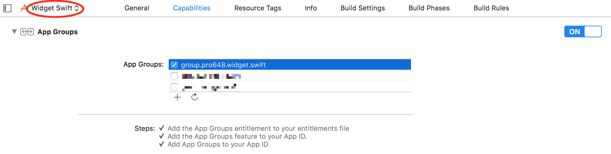

iOS 8中增加的广受欢迎的功能之一就是能够创建各种类型的扩展(Extensions)。通过使用App Extensions，可以让应用程序与其它应用程序、系统共享功能。

这篇文章中，我们主要介绍关于扩展的基本概念，并创建其中一种类型的扩展：widget。

## 1. 什么是扩展？

扩展是一个二进制文件，其不是完整app，必须包括在containing app中，同时containing app实现部分不能为空。Containing app可以是已有app，也可以是新创建的app。虽然扩展不能单独分发，但其与containing app有各自的沙盒。

Host app启动和控制扩展程序。例如，如果创建的是share extension，host app可能是Safari浏览器；如果创建的是widget extension，host app可能是系统的Today app。系统上每一个支持添加扩展的位置称为扩展点(extension point)。

为了创建扩展，需要为containing app添加target。Xcode提供的扩展模板包含了适用于每个extension point的框架，方便扩展与host app交互。

下面是Xcode 9.4.1 提供的模板：



## 2. Widget扩展

Widget（也称为Today Extension）是其中一种类型的扩展(extension)，可以在通知中心、锁屏界面显示少量、及时的信息，或提供特定功能。例如：新闻app的小组件显示头条新闻；日历app提供了两个小组件，一个widget显示今天的事件，一个widget显示接下来的事件；备忘录的widget显示最近的笔记、快速创建笔记等功能。Widgets可以高度自定义，可以包括按钮、文本、图片等，但不支持输入文字。

当在主屏幕使用3D Touch按压app图标时，窗口小部件会显示在快速操作列表上方。用户还会将其关心的widgets添加到搜索屏幕（从主屏幕、锁屏页面划到最左侧），我们的目标应当是设计一个用户想要添加到Search screen的widget。


> 确保Today扩展点适合你要提供的功能，一个好的widget会为用户提供快速更新，或启用简单任务。如果要创建多步任务的应用程序，或帮助用户执行冗长的任务（例如，上传、下载内容），则Today扩展点不是正确的选择。
>
> 你可以查看[扩展点](https://developer.apple.com/library/archive/documentation/General/Conceptual/ExtensibilityPG/index.html#//apple_ref/doc/uid/TP40014214-CH20-SW3)列表进行选择。

在iOS和macOS系统上，widget需要满足以下要求：

- 显示的内容永远是最新的。
- 合理响应用户交互。
- 性能良好。特别是在iOS中，如果widget没有合理使用内存，系统会结束掉该widget。

在iOS中，由于widget不允许使用键盘输入，因此用户需要containing app来配置widget内容和行为。例如，在Stocks widget中，用户可以在股价不同表示方式间切换，但必须打开Stocks应用程序来管理股票列表。

这篇文章将要创建一个显示硬盘使用情况的widget。

## 3. 添加target

打开Xcode，使用Simple View Application模板创建名称为*Widget Swift*的应用，点击File > New > Target添加target。Target类型选择Today Extension，名称为*UsedSpaceWidget*。Xcode会创建一个scheme，并请求激活该scheme，点击Activate激活该scheme。

Today Extension模板为主类(principal class)`TodayViewController`提供实现文件、Info.plist文件、storyboard文件。

Info.plist文件提供以下键和值：

```
<?xml version="1.0" encoding="UTF-8"?>
<!DOCTYPE plist PUBLIC "-//Apple//DTD PLIST 1.0//EN" "http://www.apple.com/DTDs/PropertyList-1.0.dtd">
<plist version="1.0">
<dict>
	<key>CFBundleDevelopmentRegion</key>
	<string>$(DEVELOPMENT_LANGUAGE)</string>
	<key>CFBundleDisplayName</key>
	<string>UsedSpaceWidget</string>
	<key>CFBundleExecutable</key>
	<string>$(EXECUTABLE_NAME)</string>
	<key>CFBundleIdentifier</key>
	<string>$(PRODUCT_BUNDLE_IDENTIFIER)</string>
	<key>CFBundleInfoDictionaryVersion</key>
	<string>6.0</string>
	<key>CFBundleName</key>
	<string>$(PRODUCT_NAME)</string>
	<key>CFBundlePackageType</key>
	<string>XPC!</string>
	<key>CFBundleShortVersionString</key>
	<string>1.0</string>
	<key>CFBundleVersion</key>
	<string>1</string>
	<key>NSExtension</key>
	<dict>
		<key>NSExtensionMainStoryboard</key>
		<string>MainInterface</string>
		<key>NSExtensionPointIdentifier</key>
		<string>com.apple.widget-extension</string>
	</dict>
</dict>
</plist>
```

在iOS中，如果你不想使用模版提供的storyboard，移除`NSExtensionMainStoryboard`key和对应value。添加`NSExtensionPrincipalClass`键，并设置对应视图控制器为键值。

## 4. 创建用户界面

由于Today视图空间有限、需要快速响应，因此，不要创建太大的widget。在iOS、macOS平台上，不能修改widget宽度，只能修改高度。

打开MainInterface.storyboard文件，删除内容为*Hello World*的`UILabel`，修改storyboard高度为`180`。

添加`UIProgressView`、两个`UILabel`，分别用来显示使用进度、使用百分比、磁盘详情，最后创建IBOutlet。如下所示：



> 如果你对自动布局不了解，可以查看[Auto Layout的使用](https://github.com/pro648/tips/wiki/Auto-Layout%E7%9A%84%E4%BD%BF%E7%94%A8)这篇文章。如果对布局细节有疑惑，[戳这里](https://github.com/pro648/BasicDemos-iOS/tree/master/Widget)获取源码。

选中*UsedSpaceWidget*target并运行，手机会自动切换到Today视图。如下所示：



旋转设备，或在其他设备运行demo，widget会自动调整大小。

> 如果没有显示*UsedSpaceWidget*，可以点击Today视图底部*编辑*按钮添加。

在设备上调试app extension时，需要设置项目、app extension的development target和iOS设备版本一致。如果app extension development target与设备版本不一致，Xcode并不会提醒，也不能在Xcode中调试扩展。

## 5. 显示数据 

Today extension point API可以更新widget内容，管理widget状态。尽管iOS和macOS平台间会有所不同，但其功能大致相同。

为保持widget显示最新内容，系统会定期捕获widget视图快照。当widget呈现时将显示最新snapshot，直到系统使用widget实时版本替换该快照。

想要在拍摄快照前更新窗口小部件状态，需要遵守`NCWidgetProviding`协议。系统会自动调用`NCWidgetProviding`协议中的`widgetPerformUpdate(completionHandler:)`方法，使用最新内容更新widget视图，最后使用`NCUpdateResult`以下常量调用完成处理程序：

- `newData`：有新数据需要显示。当显示新内容时，widget可能需要更新布局。
- `noData`：自上次更新后，没有新的内容需要显示。
- `failed`：更新过程中发生错误。

可以使用`FileManager`、`URL`类获取设备空间使用信息。进入`TodayViewController.swift`文件，添加以下代码：

```
// 设备总空间
    var totalDiskSpaceInBytes: Int64 {
        guard let systemAttributes = try? FileManager.default.attributesOfFileSystem(forPath: NSHomeDirectory() as String),
            let space = (systemAttributes[FileAttributeKey.systemSize] as? NSNumber)?.int64Value else { return 0 }
        return space
    }
    
    // 还未使用空间
    var freeDiskSpaceInBytes: Int64 {
        if #available(iOS 11.0, *) {
            // iOS 11中增加了volumeAvailableCapacityForImportantUsageKey、volumeAvailableCapacityForOpportunisticUsageKey。
            if let space = try? URL(fileURLWithPath: NSHomeDirectory() as String).resourceValues(forKeys: [URLResourceKey.volumeAvailableCapacityForImportantUsageKey]).volumeAvailableCapacityForImportantUsage {
                return space ?? 0
            } else {
                return 0
            }
        } else {
            if let space = try? URL(fileURLWithPath: NSHomeDirectory() as String).resourceValues(forKeys: [URLResourceKey.volumeAvailableCapacityKey]).volumeAvailableCapacity {
                return Int64(space ?? 0)
            } else {
                return 0
            }
        }
    }
    
    // 已使用空间
    var usedDiskSpaceInBytes: Int64 {
        return totalDiskSpaceInBytes - freeDiskSpaceInBytes
    }
    
    // byte转换为GB
    func convertByteToGB(_ bytes:Int64) -> String {
        let formatter:ByteCountFormatter = ByteCountFormatter()
        formatter.countStyle = .file
        
        return formatter.string(fromByteCount: Int64(bytes))
    }
```

在保存大量数据到本机前，一般先查看设备剩余容量。在上面代码中，我们使用这些方法查询磁盘使用情况。

`URLResourceKey`常量中关于磁盘容量key如下：

- `volumeAvailableCapacityKey`：查看磁盘剩余容量。
- `volumeAvailableCapacityForImportantUsageKey`：在保存用户请求数据，或者软件运行所需数据前查询磁盘剩余容量。例如，用户将要观看的视频，或下一关游戏的资源。该key为iOS 11中增加。
- `volumeAvailableCapacityForOpportunisticUsageKey`：根据用户过往行为预测可能需要的资源时使用。例如，下载用户最近观看的影视剧最新剧集。该key为iOS 11中增加。
- `volumeTotalCapacityKey`：磁盘总容量。

> 以上key返回数据单位均为bytes，且为只读。

## 6. 更新界面

#### 6.1 在viewDidLoad中更新界面

因为widget是一个视图控制器，可以在`viewDidLoad`方法中更新界面，在`TodayViewController.swift`文件中添加`updateUI()`方法更新UI，并在`viewDidLoad`中调用该方法：

```
override func viewDidLoad() {
        super.viewDidLoad()
        // Do any additional setup after loading the view from its nib.
        
        updateUI()
    }
    
    func updateUI() {
        let rate: Double = Double(usedDiskSpaceInBytes) / Double(totalDiskSpaceInBytes)
        
        percentLabel.text = String(format: "%.1f%%", rate * 100)
        progressView.progress = Float(rate)
        
        detailsLabel.text = String(format: "Used:\t%@\nFree:\t%@\nTotal:\t%@", convertByteToGB(usedDiskSpaceInBytes), convertByteToGB(freeDiskSpaceInBytes), convertByteToGB(totalDiskSpaceInBytes))
    }
```

通常情况下使用系统字体，文字颜色使用`blackColor`、`darkGrayColor`。iOS 10，应避免修改widget背景颜色，系统提供的浅淡、模糊背景可以更好和Notification Center背景保持一致性。永远不要使用图片作为背景，因为其可能与锁屏界面、主屏幕壁纸发生冲突。

#### 6.2 调用widgetPerformUpdate(completionHandler:)更新界面

iOS 8.1 beta的发行说明关于`widgetPerformUpdate(completionHandler:)`方法描述如下：

>The schedule and intended use of widgetPerformUpdateWithCompletionHandler: is intended as a convenient home for all data/model update logic. If implemented, the system will call at opportune times for the widget to update its state, both when Notification Center is visible, as well as in the background. An implementation is required to enable background updates. It’s expected that the widget will perform the work to update asynchronously and off the main thread as much as possible.
>
>`widgetPerformUpdateWithCompletionHandler: `方法预期用于更新数据/模型。如果实现了该方法，系统会在适当时候调用widget，以便在通知中心可见时、或处于后台时更新其状态。只有实现了该方法才可以后台更新widget。Widget应尽可能在其它线程、异步执行更新。

更新`widgetPerformUpdate(completionHandler:)`方法如下：

```
    func widgetPerformUpdate(completionHandler: (@escaping (NCUpdateResult) -> Void)){
        // Perform any setup necessary in order to update the view.
        
        // If an error is encountered, use NCUpdateResult.Failed
        // If there's no update required, use NCUpdateResult.NoData
        // If there's an update, use NCUpdateResult.NewData
        
        updateUI()
        completionHandler(NCUpdateResult.newData)
    }
```

Widget的生命周期非常短，几乎每次进入通知中心，`TodayViewController`的`viewDidLoad`方法都会被调用。随后，系统会在适当的时刻调用`widgetPerformUpdate(completionHandler:)`方法执行更新，在没有内容更新时，应当返回`noData`。

可以使用`UserDefaults`缓存上次更新时磁盘使用rate，如果下次更新时容量变化没有大于0,01%，将不执行更新操作，这样更为高效。首先在`updateUI()`方法中保存上次磁盘使用情况：

```
    func updateUI() {
        let rate: Double = Double(usedDiskSpaceInBytes) / Double(totalDiskSpaceInBytes)
        
        // 缓存使用比例
        UserDefaults.standard.set(rate, forKey: "rate")
        ...
    }
```

在`widgetPerformUpdate(completionHandler:)`方法更新界面前，先判断容量变化是否大于0.0001。如下：

```
    func widgetPerformUpdate(completionHandler: (@escaping (NCUpdateResult) -> Void)){
        // Retrieve the attributes from FileManager.
        let rate = UserDefaults.standard.double(forKey: "rate")
        let newRate: Double = Double(usedDiskSpaceInBytes) / Double (totalDiskSpaceInBytes)
        
        if fabs(rate - newRate) < 0.0001 {
            // 如果容量变化小于0.0001，将不更新界面。
            completionHandler(NCUpdateResult.noData)
        } else {
            // 只有容量变化大于0.0001时，才更新界面、缓存。
            updateUI()
            completionHandler(NCUpdateResult.newData)
        }
    }
```

在上面代码中，我们重新计算了磁盘使用情况。如果与上次使用有明显不同，需要更新缓存和界面，最后告诉系统内容发生了变化；如果没有明显不同，则没有必要生成新的快照。在这个示例中，没有使用到`failed`这种情况。

运行demo，如下所示：



可以看到widget没有显示*detailLabel*.

## 7. NCWidgetDisplayMode

#### 7.1 设置支持的display mode

在widget中，有以下两种模式用来显示数据：

1. `compact`：标准模式下，Widget高度为110；开启「更大字体」后，高度会随之变化。
2. `expanded`：根据内容显示widget高度。

> 感谢 [wolf调](https://www.jianshu.com/u/abf319bdd291) 指出compact mode 下 Widget 高度会随系统字体大小变化而变，并非固定 110。

Widget根据当前所处状态决定右上角显示展开(Show More)还是折叠(Show Less)按钮。在compact mode，显示展开按钮；在expanded mode，显示折叠按钮。

```
    override func viewDidLoad() {
        super.viewDidLoad()
        // Do any additional setup after loading the view from its nib.

        self.extensionContext?.widgetLargestAvailableDisplayMode = .expanded
        
        updateUI()
    }
```

`widgetLargestAvailableDisplayMode`属性指定widget支持的最大显示模式为`expanded`。

- 当设置为`compact`时，app将只支持compact mode，不支持展开和折叠功能。
- 当设置为`expanded`时，app将同时支持compact mode和expanded mode，展开和折叠功能也将可用。

> 在iOS 8和iOS 9中，系统并没有提供展开、折叠功能，而需要开发者根据内容高度调整约束实现。

#### 7.2 根据display mode调整widget高度

`NCWidgetProviding`协议中的`widgetActiveDisplayModeDidChange(_: maxSize:)`方法用来处理不同display mode下widget高度。

在`TodayViewController.swift`文件中实现`widgetActiveDisplayModeDidChange(_: maxSize:)`代理方法：

```
    func widgetActiveDisplayModeDidChange(_ activeDisplayMode: NCWidgetDisplayMode, withMaximumSize maxSize: CGSize) {
        if activeDisplayMode == .compact {
            self.preferredContentSize = maxSize
            detailsLabel.isHidden = true
        } else {
            self.preferredContentSize = CGSize(width: 0, height: 180)
            detailsLabel.isHidden = false
        }
    }
```

在expanded mode，widget最大高度不能超过Notification Center提供给widgets的可见高度。

> Widget的宽度由设备决定，即使旋转设备也保持不变。系统也没有提供改变宽度的方法。

运行demo：



## 8. 打开containing app

Widget应当能够独立运行。但是，如果用户需要做一些widget没有提供的功能，应当在用户点击对应内容时跳转到containing app，不要为此添加额外的按钮，占用有限可用空间。例如，在日历小部件中，可用点击事件以在日历app中将其打开。切勿使用小部件打开其它应用。

在extension中使用`open(_ URL:, completionHandler:)`方法打开containing app。每个extension point决定是否支持该方法，或者那种情况下支持该方法。iOS中，Today和iMessage应用扩展点支持该方法。iMessage应用扩展点只支持打开parent应用，且parent应用必须在主屏幕中。

更新`viewDidLoad`方法如下：

```
    override func viewDidLoad() {
        super.viewDidLoad()
        // Do any additional setup after loading the view from its nib.
        
        let tapGestureGesture = UITapGestureRecognizer(target: self, action: #selector(handleSingleTap(_:)))
        tapGestureGesture.numberOfTapsRequired = 1
        self.view.addGestureRecognizer(tapGestureGesture);
        detailsLabel.numberOfLines = 3

        self.extensionContext?.widgetLargestAvailableDisplayMode = .expanded
        
        updateUI()
    }
```

实现对应点击手势响应方法：

```
    @objc func handleSingleTap(_ sender: UITapGestureRecognizer) {
        let url = URL(string: "widget://first/word?From%20Widget%20To%20First%20VC")!
        extensionContext?.open(url, completionHandler: { (completed) in
            print("Successfully open \(String(describing: url.query?.removingPercentEncoding))")
        })
    }
```

一定要在containing应用URL Types部分定义url scheme。首先，在项目导航器中选中项目名称；其次，打开containing app target，选择Info一栏底部的URL Types，如下：



当扩展打开containing app时，在`AppDelegate`的`application(_ : url: sourceApplication: annotation: )`方法中处理后续操作：

```
    func application(_ app: UIApplication, open url: URL, options: [UIApplicationOpenURLOptionsKey : Any] = [:]) -> Bool {
        if url.host == "first", url.path == "/word" {
            tabBarController.selectedIndex = 0
            let firstVC: FirstVC = tabBarController.selectedViewController as! FirstVC
            firstVC.label.text = url.query?.removingPercentEncoding
            return true
        } else {
            return false
        }
    }
```

> Containing app由`UITabBarController`构成，其包含两个`UIViewController`。

## 9. 通过App Groups共享数据

尽管扩展程序bundle嵌套在其containing app bundle中，但其处于各自沙盒中，不能直接访问彼此容器，也就无法直接在扩展程序和containing app间共享数据。如需共享数据，需要使用App Groups。

打开Xcode中Capacities一栏，将containing app和extension app添加到同一app groups。



将Containing app和extension添加到同一app groups中才可以共享数据。

> Containing app必须和extension在同一开发者账号下才可以使用app groups共享数据。

要在containing app和app extension间共享数据，需要使用`UserDefaults`中的`suiteName`，而非`standard`。

更新`TodayViewController.swift`文件中的`handleSingleTap(_ :)`，`AppDelegate.swift`文件中`application(_ : url: sourceApplication: annotation: )`方法，以便在点击widget时，跳转到*FirstVC*或*SecondVC*，如下所示：

```
    @objc func handleSingleTap(_ sender: UITapGestureRecognizer) {
        let firstURL = NSURL(string: "widget://first/word?From%20Widget%20To%20First%20VC")
        let secondURL = NSURL(string: "widget://second/word?From%20Widget%20To%20Second%20VC")
        
        // 从app groups读取数据。
        let userDefaults = UserDefaults(suiteName: "group.pro648.widget.swift")
        let isFirst = userDefaults?.bool(forKey: "isFirst")

        var url: NSURL

        guard let first = isFirst else { return  }

        if first {
            url = secondURL!
        } else {
            url = firstURL!
        }

        extensionContext?.open(url as URL, completionHandler: { (completed) in
            print("Successfully open \(String(describing: url.query?.removingPercentEncoding))")
        })
    }
        
    func application(_ app: UIApplication, open url: URL, options: [UIApplicationOpenURLOptionsKey : Any] = [:]) -> Bool {
        let userDefaults = UserDefaults(suiteName: "group.pro648.widget.swift")
        if url.host == "first", url.path == "/word" {
            tabBarController.selectedIndex = 0
            let firstVC: FirstVC = tabBarController.selectedViewController as! FirstVC
            firstVC.label.text = url.query?.removingPercentEncoding
            
            // 保存数据到app groups.
            userDefaults?.set(true, forKey: "isFirst")
            return true
        } else if url.host == "second", url.path == "/word" {
            tabBarController.selectedIndex  = 1
            let secondVC: SecondVC = tabBarController.selectedViewController as! SecondVC
            secondVC.label.text = url.query?.removingPercentEncoding
            
            // 保存数据到app groups.
            userDefaults?.set(false, forKey: "isFirst")
            return true
        } else {
            return false
        }
    }
```

运行demo，点击widget，将会跳转到*FirstVC*、*SecondVC*。

## 10. 从containing app中显示、隐藏Widget

Widget和containing app都可以使用`NCWidgetController`类对象操作widget是否有内容需要显示。例如，机票类应用在没有行程时隐藏widget。因为`NCWidgetController`类可以协调widget和containing app决定小部件是否有内容需要显示，所以在widget和containing app间没有通信时将不需要使用`NCWidgetController`类。

一般，widget有内容时显示在Today视图。如果widget没有要显示的内容，可以通过调用`NCWidgetController`类的`setHasContent(_:forWidgetWithBundleIdentifier:)`方法隐藏小部件。如果containing app稍后检测到有内容需要显示，containing app可以通过调用`setHasContent(_:forWidgetWithBundleIdentifier:)`方法显示widget，即使此时widget没有运行。

`NCWidgetController`类不能子类化(subclassed)。

在*FirstVC*的storyboard中添加`UIButton`，实现其响应方法`handleButtonTapped(_:)`：

```
    @IBAction func handleButtonTapped(_ sender: UIButton) {
        if sender.titleLabel?.text == "Show Widget" {
            NCWidgetController().setHasContent(true, forWidgetWithBundleIdentifier: "pro648.Widget-Swift.UsedSpaceWidget")
            sender.setTitle("Hide Widget", for: .normal)
        } else {
            NCWidgetController().setHasContent(false, forWidgetWithBundleIdentifier: "pro648.Widget-Swift.UsedSpaceWidget")
            sender.setTitle("Show Widget", for: .normal)
        }
    }
```

> 虽然Widget和containing app都可以实现`setHasContent(_:forWidgetWithBundleIdentifier:)`方法显示、隐藏widget，但通过parent app隐藏的widget只能通过parent app显示。

## 11. 通过framework共享代码

你可以创建一个嵌入式framework用来在app extension和containing app间共享代码。例如，把处理照片滤镜代码放入framework，在app extension和containing app的target中导入framework。

## 12. App Extension中不能包含的代码

由于app extension对功能的定位，应用程序扩展不能执行某些任务，如下：

- 接触[shared](https://developer.apple.com/documentation/uikit/uiapplication/1622975-shared)对象，因此，也不能调用该对象的任何相关方法。

- 在头文件中任何以`NS_EXTENSION_UNAVAILABLE`宏声明的API，或类似不可用宏，或者是不可用framework中API。

  例如，在iOS 8.0中，app extension不可以使用`HealthKit`框架和`EventKit` UI框架。

- 调用iOS设备上摄像头、麦克风。但iMessage app在配置了`NSCameraUsageDescription`和`NSMicrophoneUsageDescription` `Info.plist`keys后可以使用这些资源。

- 执行长时间后台任务，这项限制刻度因平台而异。

- 使用AirDrop接收数据。但通过使用`UIActivityViewController`，应用扩展可以像app一样使用AirDrop发送数据。

## 总结

虽然对于这样一个任务，这些逻辑似乎过于复杂，也不太实用。但你现在将熟悉创建Today Extension的完整过程。在设置和构建窗口小部件时，请牢记这些原则，保持简单，性能良好。

Demo名称：Widget  
源码地址：<https://github.com/pro648/BasicDemos-iOS>

参考资料：

1. [iOS 8: Creating a Today Widget](https://code.tutsplus.com/tutorials/ios-8-creating-a-today-widget--cms-22379)
2. [All you need to know about Today Extensions (Widget) in iOS 10](https://hackernoon.com/app-extensions-and-today-extensions-widget-in-ios-10-e2d9fd9957a8)
3. [Widgets](https://developer.apple.com/design/human-interface-guidelines/ios/extensions/widgets/)
4. [What is the purpose of widgetPerformUpdateWithCompletionHandler in iOS 8 Today Widget?](https://stackoverflow.com/questions/25168950/what-is-the-purpose-of-widgetperformupdatewithcompletionhandler-in-ios-8-today-w)
5. [Creating a Compelling Today Widget](https://pspdfkit.com/blog/2017/today-widget/)