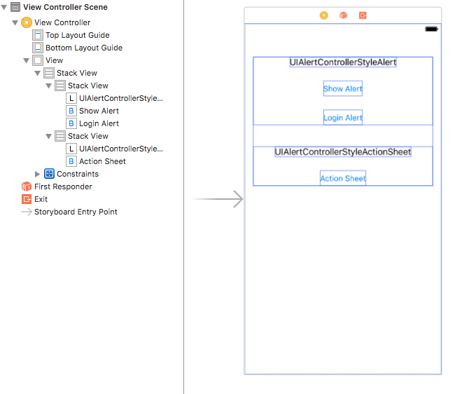
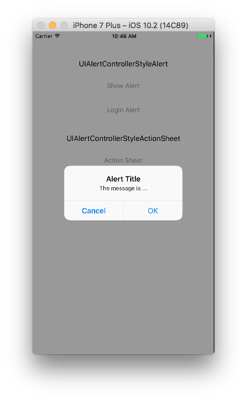
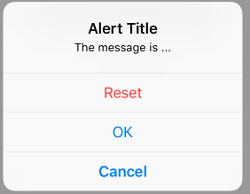
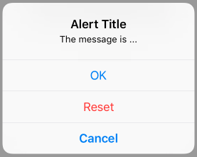
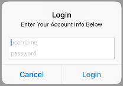
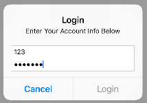
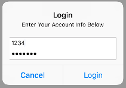
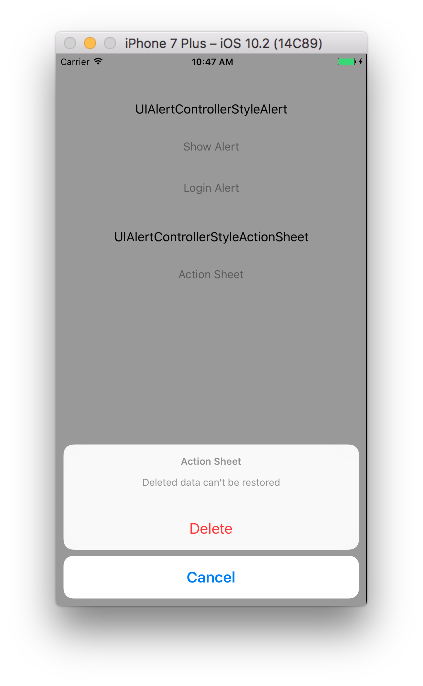
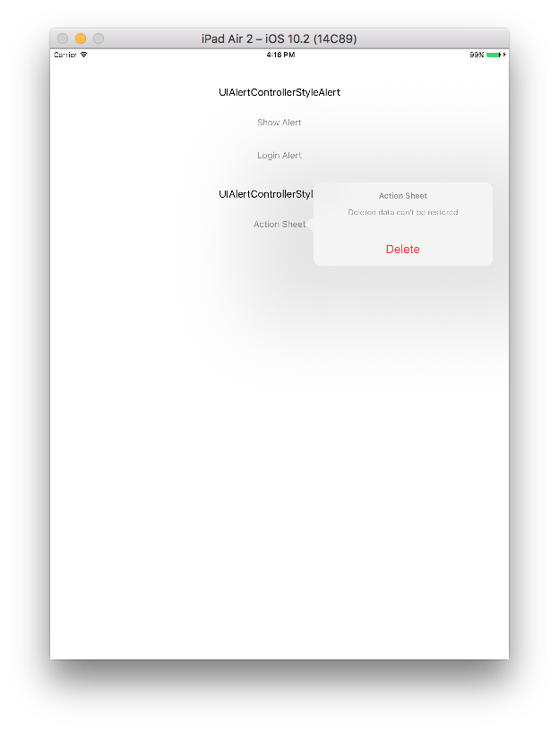

当你的应用程序需要向用户呈现重要信息，或提示用户重要选择时，可以使用警告框（Alert View）和操作表（Action Sheet）。下图左侧部分是警告框，右侧部分是操作表。


自iOS 8开始，Apple用继承自`UIViewController`的`UIAlertController`取代了`UIAlertView`和`UIAlertSheet`。

警报控制器（UIAlertController）虽然有警告框和操作表两种形式，但其创建步骤是一样的。如下所示：

1. 创建`UIAlertController`，指定警报控制器样式。
2. 向警报控制器添加按钮。
3. 显示`UIAlertController`。

## 1. 创建demo

下面通过demo来学习一下。

打开Xcode，点击File > New > Project…，选择iOS > Application > Single View Application模板，点击*Next*；在*Product Name*中填写`AlertController`，点击*Next*；选择文件，点击*Create*创建工程。

打开刚创建工程的*storyboard*，在*storyboard*中自上而下依次添加以下控件，内容为*UIAlertControllerStyleAlert*的`UILabel`，名称为*Show Alert*的`UIButton`，名称为*Login Alert*的`UIButton`，内容为*UIAlertControllerStyleActionSheet*的`UILabel`，名称为*Action Sheet*的`UIButton`。如下图：



把`UIButton`拖拽到`ViewController.m`的接口部分，类型为`IBAction`。完成后代码如下：

```
#import "ViewController.h"

@interface ViewController ()

- (IBAction)showAlertView:(UIButton *)sender;
- (IBAction)showLoginAlertView:(UIButton *)sender;
- (IBAction)showActionSheet:(UIButton *)sender;

@end
```

## 2. 简单对话框样式

### 2.1 创建警报控制器

创建`UIAlertController`非常简单，不需要设置代理、不需要指定按钮。

下面先在`showAlertView: `方法中，创建`UIAlertController`。

```
- (IBAction)showAlertView:(UIButton *)sender
{
    // 1.创建UIAlertController
    UIAlertController *alertController = [UIAlertController alertControllerWithTitle:@"Alert Title"
                                                                             message:@"The message is ..."
                                                                      preferredStyle:UIAlertControllerStyleAlert];
}
```

这里的`preferredStyle: `参数有`UIAlertControllerStyleAlert`和`UIAlertControllerStyleActionSheet`两种，这里我们要创建的是*Alert View*，所以使用第一种。

### 2.2 添加按钮

使用`actionWithTitle: style: handler: `方法创建`UIAlertAction`对象，之后把对象添加到警报控制器。

`UIAlertAction`对象由标题、样式和用户单击该按钮时运行的代码块三部分组成。`UIAlertActionStyle`有三种样式，样式一`UIAlertActionStyleCancel`，用于取消操作、不作任何修改，就是常见的*取消*按钮；样式二`UIAlertActionStyleDefault`，按钮的默认样式；第三种是`UIAlertActionStyleDestructive`，用于对数据进行更改或删除的操作，这种样式的按钮标题会自动使用红色显示。

在`showAlertView: `方法中添加*Cancel*按钮和*OK*按钮。

```
- (IBAction)showAlertView:(UIButton *)sender
{
    ...
    // 2.创建并添加按钮
    UIAlertAction *okAction = [UIAlertAction actionWithTitle:@"OK" style:UIAlertActionStyleDefault handler:^(UIAlertAction * _Nonnull action) {
        NSLog(@"OK Action");
    }];
    UIAlertAction *cancelAction = [UIAlertAction actionWithTitle:@"Cancel" style:UIAlertActionStyleCancel handler:^(UIAlertAction * _Nonnull action) {
        NSLog(@"Cancel Action");
    }];

    [alertController addAction:okAction];           // A
    [alertController addAction:cancelAction];       // B
}
```

### 2.3 显示`UIAlertController`

显示`UIAlertController`。

```
- (IBAction)showAlertView:(UIButton *)sender
{
    ...
    // 3.呈现UIAlertContorller
    [self presentViewController:alertController animated:YES completion:nil];
}
```

点击*Show Alert*按钮，视图控制器显示如下：



改变上面`addAction: `方法顺序，运行app，你会发现Alert View中按钮顺序不变。当Alert View样式中有*Cancel*按钮时，*Cancel*按钮总是显示在左侧，与添加按钮的顺序无关。

在`showAlertView: `方法中再添加一个`UIAlertActionStyleDestructive`样式的*Reset*按钮。

```
- (IBAction)showAlertView:(UIButton *)sender
{
    ...
    UIAlertAction *resetAction = [UIAlertAction actionWithTitle:@"Reset" style:UIAlertActionStyleDestructive handler:^(UIAlertAction * _Nonnull action) {
        NSLog(@"Reset Action");
    }];
    [alertController addAction:resetAction];        // C
    [alertController addAction:okAction];           // A
    [alertController addAction:cancelAction];       // B
    ...
}
```

运行demo，显示如下：



当Alert View中存在一个或两个按钮时，按钮会水平排布；按钮大于两个时会像Action Sheet那样竖列展示。把上面`addAction: `方法顺序改变为B、A、C，运行app，视图控制器显示如下：



可以看到只要上面有`UIAlertActionStyleCancel`样式的按钮，该按钮总是在最底部，其他按钮顺序由添加顺序决定。如果包含`UIAlertActionStyleDestructive`样式的按钮，一般先添加，以便在第一个位置显示。每一个警报控制器只能包含一个*Cancel*按钮，如果你添加了两个或多个，在运行时会抛出`NSInternalInconsistencyException`的异常。

## 3. 登录文本框

`UIAlerController`的另一个用途是我们可以向警报控制器中添加任意数量的`UITextField`作为警报控制器内容视图中的一部分。比如常见的登陆框。



为创建一个如上图的登录框，我们需要为警报控制器添加两个文本框。每一个文本框添加合适的占位符以提示需要输入文本信息类型，并为需要输入密码的文本框启用安全文本，以确保密码安全。更新后的`showLoginAlertView: `代码如下：

```
- (IBAction)showLoginAlertView:(UIButton *)sender
{
    // 1.创建UIAlertController
    UIAlertController *alertController = [UIAlertController alertControllerWithTitle:@"Login"
                                                                             message:@"Enter Your Account Info Below"
                                                                      preferredStyle:UIAlertControllerStyleAlert];
    
    // 2.1 添加文本框
    [alertController addTextFieldWithConfigurationHandler:^(UITextField * _Nonnull textField) {
        textField.placeholder = @"username";
    }];
    [alertController addTextFieldWithConfigurationHandler:^(UITextField * _Nonnull textField) {
        textField.placeholder = @"password";
        textField.secureTextEntry = YES;
    }];
}
```

继续在`showLoginAlertView: `方法中添加*Cancel*按钮和*Login*按钮，在点击*Login*按钮时获取文本框中的账号和密码并输出到控制台。

```
- (IBAction)showLoginAlertView:(UIButton *)sender
{
    ...
    // 2.2  创建Cancel Login按钮
    UIAlertAction *cancelAction = [UIAlertAction actionWithTitle:@"Cancel" style:UIAlertActionStyleCancel handler:^(UIAlertAction * _Nonnull action) {
        NSLog(@"Cancel Action");
    }];
    UIAlertAction *loginAction = [UIAlertAction actionWithTitle:@"Login" style:UIAlertActionStyleDefault handler:^(UIAlertAction * _Nonnull action) {
        UITextField *userName = alertController.textFields.firstObject;
        UITextField *password = alertController.textFields.lastObject;
        
        // 输出用户名 密码到控制台
        NSLog(@"username is %@, password is %@",userName.text,password.text);
    }];
}
```

上面的代码中，`UIAlertController`内`textFields` 数组内元素顺序和添加顺序一致。

最后添加按钮，显示警报控制器。

```
- (IBAction)showLoginAlertView:(UIButton *)sender
{
    ...
    // 2.3 添加按钮
    [alertController addAction:cancelAction];
    [alertController addAction:loginAction];
    
    // 3.显示警报控制器
    [self presentViewController:alertController animated:YES completion:nil];
}
```

现在运行app，在第一个文本框中输入`pro648`，在第二个文本框内输入`x`，点击*Login*按钮，控制台输出如下：

```
username is pro648, password is x
```

在实际应用中我们一般会对用户名和密码长度进行限制，当长度不足时应该禁用*Login*按钮。我们可以通过为文本框添加一个`UIControllEventEditingChanged`响应事件来实现。记得在添加按钮前先禁用按钮。更新后代码如下：

```
- (IBAction)showLoginAlertView:(UIButton *)sender
{
    ...
    // 2.1 添加文本框
    [alertController addTextFieldWithConfigurationHandler:^(UITextField * _Nonnull textField) {
        textField.placeholder = @"username";
        
        [textField addTarget:self action:@selector(alertUserAccountInfoDidChange:) forControlEvents:UIControlEventEditingChanged];     // 添加响应事件
    }];
    [alertController addTextFieldWithConfigurationHandler:^(UITextField * _Nonnull textField) {
        textField.placeholder = @"password";
        textField.secureTextEntry = YES;
        
        [textField addTarget:self action:@selector(alertUserAccountInfoDidChange:) forControlEvents:UIControlEventEditingChanged];     // 添加响应事件
    }];
    
    ...
    // 2.3 添加按钮
    loginAction.enabled = NO;   // 禁用Login按钮
    [alertController addAction:cancelAction];
    [alertController addAction:loginAction];
    ...
}

- (void)alertUserAccountInfoDidChange:(UITextField *)sender
{
    UIAlertController *alertController = (UIAlertController *)self.presentedViewController;
    
    if (alertController)
    {
        NSString *userName = alertController.textFields.firstObject.text;
        NSString *password = alertController.textFields.lastObject.text;
        UIAlertAction *loginAction = alertController.actions.lastObject;
        
        if (userName.length > 3 && password.length > 6)
            // 用户名大于3位，密码大于6位时，启用Login按钮。
            loginAction.enabled = YES;
        else
            // 用户名小于等于3位，密码小于等于6位，禁用Login按钮。
            loginAction.enabled = NO;
    }
}
```

> `UIAlertController`中的`textFields`和`actions`均是数组类型，添加的第一个对象index为`0`。之后按照添加的顺序index依次加1，虽然前面说到*Cancel*按钮一般显示在左侧（横排）或底部（竖排），但并不代表它在数组中的位置是第一个或最后一个，其index是由添加的顺序决定。你可以根据`username`字符串长度来禁用*Login*按钮进行测试。

现在只有在用户名大于三位、密码大于六位时，*Login*按钮才可以点击。

     

## 4. 操作表Action Sheet

操作表一般用于为用户提供一组可供选择的操作选项，如删除、恢复等。一般根据设备尺寸大小决定呈现形式，在iPhone上，操作表由底部滑出；在iPad上，操作表以弹出框（popover)形式出现。

创建操作表的方法与警告框类似，唯一不同在于`preferredStyle: `参数的选择。在`showActionSheet: `方法中创建操作表。

```
- (IBAction)showActionSheet:(UIButton *)sender
{
    // 1.创建UIAlertController
    UIAlertController *alertController = [UIAlertController alertControllerWithTitle:@"Action Sheet"
                                                                             message:@"Deleted data can't be restored"
                                                                      preferredStyle:UIAlertControllerStyleActionSheet];
}
```

下面创建并添加按钮，最后呈现警报控制器。

```
- (IBAction)showActionSheet:(UIButton *)sender
{
    ...
    // 2.1 创建按钮
    UIAlertAction *deleteAction = [UIAlertAction actionWithTitle:@"Delete" style:UIAlertActionStyleDestructive handler:^(UIAlertAction * _Nonnull action) {
        NSLog(@"Delete Action");
    }];
    UIAlertAction *cancelAction = [UIAlertAction actionWithTitle:@"Cancel" style:UIAlertActionStyleCancel handler:^(UIAlertAction * _Nonnull action) {
        NSLog(@"Cancel Action");
    }];
    
    // 2.2 添加按钮
    [alertController addAction:deleteAction];
    [alertController addAction:cancelAction];
    
    // 3.显示警报控制器
    [self presentViewController:alertController animated:YES completion:nil];
}
```

运行app，操作表展示如下：



如果`Action Sheet`中有取消按钮，取消按钮每次都会在底部显示，其他按钮会按照添加的顺序显示。在Action Sheet内不能添加文本框。如果你添加了文本框，在运行时会抛出下面的异常提醒：

>*** Terminating app due to uncaught exception 'NSInternalInconsistencyException', reason: 'Text fields can only be added to an alert controller of style UIAlertControllerStyleAlert'

如上面说到的，在iPad中Action Sheet以弹出框的形式呈现。弹出框总是需要一个锚点，锚点可以是源视图，也可以是按钮。在这个demo中，我们用按钮触发弹出框，所以这里将把按钮作为锚点。`showActionSheet: `方法更新后如下：

```
- (IBAction)showActionSheet:(UIButton *)sender
{
    ...
    UIPopoverPresentationController *popover = alertController.popoverPresentationController;
    if (popover)
    {
        popover.sourceView = sender;
        popover.sourceRect = sender.bounds;
        popover.permittedArrowDirections = UIPopoverArrowDirectionAny;
    }
    
    // 3.显示警报控制器
    [self presentViewController:alertController animated:YES completion:nil];
}
```

如果在iPad中没有添加上面方法，运行时会出现下面崩溃提示：

> *** Terminating app due to uncaught exception 'NSGenericException', reason: 'Your application has presented a UIAlertController (<UIAlertController: 0x7f88c85221f0>) of style UIAlertControllerStyleActionSheet. The modalPresentationStyle of a UIAlertController with this style is UIModalPresentationPopover. You must provide location information for this popover through the alert controller's popoverPresentationController. You must provide either a sourceView and sourceRect or a barButtonItem.  If this information is not known when you present the alert controller, you may provide it in the UIPopoverPresentationControllerDelegate method -prepareForPopoverPresentation.'

现在，Action Sheet以触发它的按钮为锚点，以弹出框形式展现。



> 当Action Sheet以弹出框形式展现时，`UIKit`会取消显示*Cancel*按钮。此时，点击popover以外任何区域和点击*Cancel*按钮效果一致，同时会调用取消按钮的完成处理程序。

## 5. 退出警报控制器

警报控制器会在用户点击按钮后自动消失，但在app进入后台时，警告框和选择表并不会自动退出。此时，我们需要通过代码实现退出警报控制器。

在[通知中心](https://github.com/pro648/tips/wiki/%E5%A7%94%E6%89%98%E3%80%81%E9%80%9A%E7%9F%A5%E4%BC%A0%E5%80%BC%E7%9A%84%E7%94%A8%E6%B3%95%E4%B8%8E%E5%8C%BA%E5%88%AB)进行注册，当接收到app进入后台的通知时退出警报控制器。更新后的`viewDidLoad`如下：

```
- (void)viewDidLoad
{
    [super viewDidLoad];
    
    // app 进入后台后隐藏警报控制器
    [[NSNotificationCenter defaultCenter] addObserverForName:UIApplicationDidEnterBackgroundNotification object:nil queue:nil usingBlock:^(NSNotification * _Nonnull note) {
        [self.presentedViewController dismissViewControllerAnimated:YES completion:nil];
    }];
}

- (void)dealloc
{
    // 移除观察者
    [[NSNotificationCenter defaultCenter] removeObserver:self name:UIApplicationDidEnterBackgroundNotification object:nil];
}
```

> 最后一定记得移除观察者，否则会引起崩溃。

## 总结

下面总结下Alert View和Action Sheet的异同。

警告框Alert View：

- 一般显示在当前视图控制器的中心，点击警告框以外区域不能隐藏警告控制器。
- 可以添加任意数量文本框。
- 有一个或两个按钮时，横向排布，如果有*Cancel*按钮，则*Cancel*按钮显示在左侧；有两个以上按钮时，竖列排布，如果有*Cancel*按钮，则*Cancel*按钮显示在最底部。其他按钮按照添加顺序排布。

操作表Action Sheet：

- 在iPhone中自下而上滑出显示在当前控制器的底部，点击action sheet以外区域可以隐藏`UIAlertController`。
- 在iPad中以popover方式、以源视图为锚点显示，点击选择表以外的区域可以隐藏警告控制器。
- 不能添加文本框。
- 按钮竖列排布，在iPhone中，*Cancel*按钮默认在底部显示；在iPad中，*Cancel*按钮默认不显示。

`UIAlertController`类只能原样使用，不支持子类化。该类的视图层次结构是私有的，不能修改。最后，需要注意的是，警告框和操作表向用户显示信息时会中断应用的当前流程，请只在需要的时候使用，切勿滥用。

Demo名称：AlertController   
源码地址：<https://github.com/pro648/BasicDemos-iOS>

参考资料：

1. [UIAlertController Changes in iOS 8](https://useyourloaf.com/blog/uialertcontroller-changes-in-ios-8/)
2. [UIAlertController](https://developer.apple.com/documentation/uikit/uialertcontroller?language=objc)

