`UICollectionView`是我们常说的集合视图，它在iOS 6中引入，是iOS开发者中最受欢迎的UI元素之一。其布局灵活、可变，可用于显示有序数据项集，最常见的用途是以类似于网格的形式呈现item，除此之外还可以通过子类化`UICollectionViewLayout`类，精准地控制可视化元素布局，并动态改变布局。因此，可以实现网格、堆栈、圆形、动态变化等形式布局，以及其它任何你可以想象出的布局。

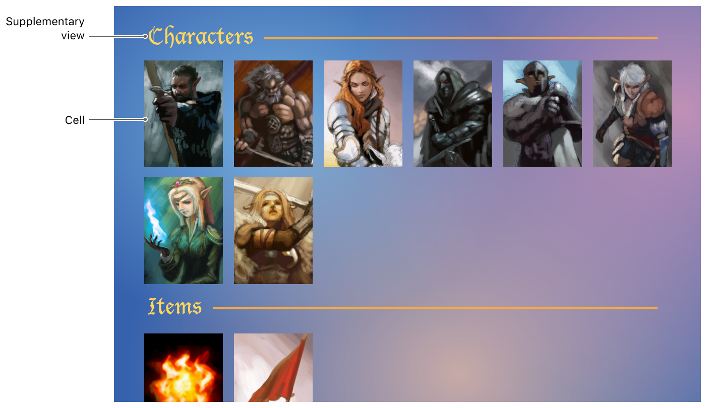

`UICollectionView`将数据源和用于呈现数据的视觉元素进行了严格的分离。下图显示了`UICollectionView`与相关对象关系：

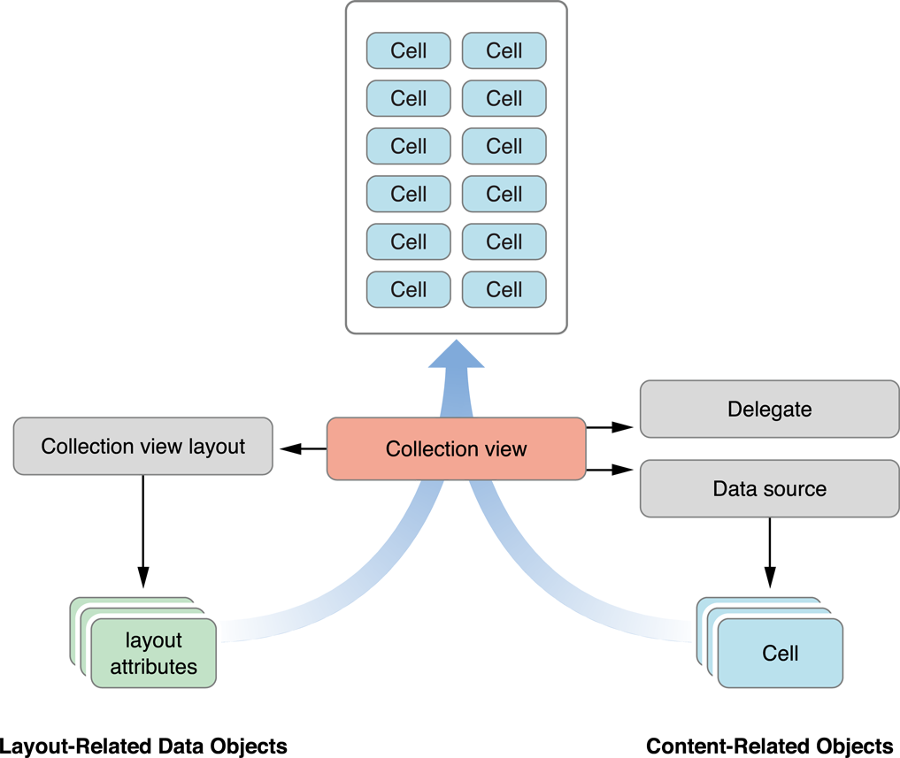

其中，data source提供用于呈现数据的视图对象，collection view layout提供视图布局信息，而collection view负责将数据和布局信息合并后呈现到屏幕上。需要注意的是，在创建`UICollectionView`时，必须传递一个`UICollectionViewLayout`对象，这里的`UICollectionViewLayout`是一个*抽象基类abstract base class*，不能直接使用，必须使用其子类。例如，在创建网格布局时一般使用`UICollectionViewFlowLayout`*具体concrete*类。

下面表格列出了`UIKit`中与集合视图相关的类，并按照各自扮演的角色进行分类：

| 用途           | 类/协议                                     | 描述                                       |
| ------------ | ---------------------------------------- | ---------------------------------------- |
| 集合视图和集合视图控制器 | `UICollectionView` <br/><br/> `UICollectionViewController` | `UICollectionView`派生自`UIScrollView`，定义集合视图内容区域，将`dataSource`的数据与`layout`提供的布局信息合并后呈现到屏幕上。 <br/><br/> `UICollectionViewController`为集合视图提供了控制器级别支持，`UICollectionViewController`的使用是可选的。 |
| 内容控制         | `UICollectionViewDataSource`协议 <br/><br/> `UICollectionViewDelegate`协议 | `dataSource`为集合视图提供数据，是`UICollectionView`中最重要、必须提供的对象。要实现`dataSource`中的方法，必须创建一个遵守`UICollectionViewDataSource`协议的对象。<br/><br/> 通过`UICollectionView`的`delegate`对象可以监听集合视图状态、自定义视图。例如，使用`delegate`跟踪item是否高亮、选中。与数据源对象不同，代理对象不是必须实现。 |
| 呈现视图         | `UICollectionReusableView` <br/><br/> `UICollectionViewCell` | `UICollectionView`中显示的所有视图都必须是`UICollectionReusableView`类的实例，该类支持回收机制（循环使用视图，而非创建新的视图），以便提高性能，特别是在滑动屏幕时。<br/><br/> `UICollectionViewCell`用来显示主要数据，也是可重用视图。 |
| 布局           | `UICollectionViewLayout` <br/><br/> `UICollectionViewLayoutAttributes` <br/><br/> `UICollectionViewUpdateItem` | 使用`UICollectionViewLayout`的子类为集合视图内元素提供位置、大小、视觉属性等布局信息。 <br/><br/> 在布局过程中，`layout`对象创建`UICollectionViewLayoutAttributes`实例，用以告知特定item如何布局。 <br/><br/> 当collection view的数据源发生插入、删除、移动变化时，`UICollectionView`会创建`UICollectionViewUpdateItem`类的实例，并发送给`layout`的`prepareForCollectionViewUpdates: `方法，`layout`会为即将到来的布局变化作出准备。你不需要创建该类的实例。 |
| Flow layout  | `UICollectionViewFlowLayout` <br/><br/> `UICollectionViewDelegateFlowLayout`协议 | `UICollectionViewFlowLayout`类是用于实现网格或其它基于行布局的具体类，可以直接使用，也可以将其与`UICollectionViewDelegateFlowLayout`代理结合使用，以便自定义布局。 |

> 注意：上面的`UICollectionViewLayout`、`UICollectionViewReusableView`类必须子类化才可以使用，其它类可以直接使用。

另外，`UICollectionView`自iOS 6引入以来，其功能也是不断丰富的：

- iOS 9中为集合视图添加了交互式重新排序功能。
- iOS 10中为集合视图添加了预加载cell数据功能，这在获取cell内容非常耗时（例如网络请求）的情况下非常有用。
- iOS 11增加了系统范围的*拖放操作drag and drop*，让用户可以快速简单的将文本、图像和文件从一个app移动到另一个app。

现在我们就通过这篇文章，对`UICollectionView`进行全面的学习。

## 1.创建demo

这篇文章将使用纯代码创建一个`UICollectionView`，用来学习集合视图。效果如下：

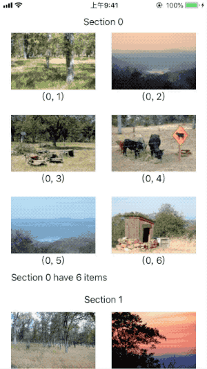

打开Xcode，点击File > New > Project...，选择iOS > Application > Single View App模板，点击*Next*；*Product Name*为`CollectionView`，*Language*为`Objective-C`，点击*Next*；选择文件位置，点击*Create*创建工程。

## 2.添加`UICollectionView`

为视图控制器添加`UICollectonView`，进入`ViewController.m`，在接口部分添加以下声明：

```
@interface ViewController ()

@property (strong, nonatomic) UICollectionView *collectionView;
@property (strong, nonatomic) UICollectionViewFlowLayout *flowLayout;

@end
```

在实现部分初始化`UICollectionViewFlowLayout`、`UICollectionView`对象。

```
- (UICollectionViewFlowLayout *)flowLayout {
    if (!_flowLayout) {
        // 初始化UICollectionViewFlowLayout对象，设置集合视图滑动方向。
        _flowLayout = [[UICollectionViewFlowLayout alloc] init];
        _flowLayout.scrollDirection = UICollectionViewScrollDirectionVertical;
    }
    return _flowLayout;
}

- (UICollectionView *)collectionView {
    if (!_collectionView) {
        // 设置集合视图内容区域、layout、背景颜色。
        _collectionView = [[UICollectionView alloc] initWithFrame:self.view.bounds collectionViewLayout:self.flowLayout];
        _collectionView.backgroundColor = [UIColor whiteColor];
        
        // 设置代理。
//        _collectionView.dataSource = self;
//        _collectionView.delegate = self;
    }
    return _collectionView;
}
```

最后添加`self.collectionView`到视图控制器。

```
- (void)viewDidLoad {
    [super viewDidLoad];
    
    // 添加collection view。
    [self.view addSubview:self.collectionView];
}
```

## 3.重用视图以提高性能

`UICollectionView`使用了视图回收机制以提高性能。当视图被滑出屏幕外时，从视图层级结构中移除的视图不会直接删除，而是置于重用队列中。当`UICollectionView`显示新的内容时，将从重用队列中获取视图、填充新的内容。为便于回收和重用，`UICollectionView`显示的所有视图必须派生自`UICollectionReusableView`。

`UICollectionView`支持三种不同类型的可重用视图，每种视图都有特定的用途：

- *集合视图单元格UICollectionViewCell*：显示集合视图的主要内容。cell必须是`UICollectionViewCell`类的实例。cell默认支持管理自身*高亮highlight*、*选中selection*状态。
- *补充视图Supplementary View*：显示关于`section`的信息。和`cell`一样supplementary view也是数据驱动的，但与`cell`不同的是supplementary view的使用不是必须的，`layout`控制supplementary view的位置和是否使用。例如，*流式布局UICollectionViewFlowLayout*可以选择性添加*页眉section header*和*页脚section footer*补充视图。
- *装饰视图Decoration View*：由`layout`完全拥有的装饰视图，且不受数据源的束缚。例如，`layout`可以使用装饰视图自定义集合视图背景。

与`UITableView`不同，`UICollectionView`不会在数据源提供的cell和supplementary view 上施加特定的样式，只提供空白的画布。你需要为其构建视图层次结构、显示图像，也可以动态绘制内容。

`UICollectionView`的数据源对象负责提供cell和supplementary view，但`dataSource`从来不会直接创建cell、supplementary view。当需要展示新的视图时，数据源对象使用集合视图的`dequeueReusableCellWithReuseIdentifier: forIndexPath: `或`dequeueReusableSupplementaryViewOfKind: withReuseIdentifier: forIndexPath: `方法出列所需类型的视图。如果队列存在所需类型的视图，则会直接出列所需视图；如果队列没有所需视图，则会利用提供的nib文件、storyboard或代码创建。

现在，添加`UICollectionReusableView`类，在重用视图上添加`UILabel`用以显示header、footer相关内容。

创建一个新的文件，选择iOS > Source > Cocoa Touch Class模板，点击*Next*；*Class*内容为`CollectionReusableView`，*Subclass of*一栏选择`UICollectionReusableView`，点击*Next*；选择文件位置，点击*Create*创建文件。

进入`CollectionReusableView.h`，声明一个label属性。

```
@interface CollectionReusableView : UICollectionReusableView

@property (strong, nonatomic) UILabel *label;

@end
```

进入`CollectionReusableView.m`，在实现部分初始化`UILabel`对象：

```
- (instancetype)initWithFrame:(CGRect)frame {
    self = [super initWithFrame:frame];
    if (self) {
        // 初始化label，设置文字颜色，最后添加label到重用视图。
        _label = [[UILabel alloc] initWithFrame:CGRectMake(20, 0, self.bounds.size.width-40, self.bounds.size.height)];
        _label.textColor = [UIColor blackColor];
        [self addSubview:_label];
    }
    return self;
}
```

## 4.数据源方法

`UICollectionView`必须有*数据源data source*，数据源对象为`UICollectionView`提供展示的内容。数据源对象可能来自于app的data model，也可能来自管理`UICollectionView`的视图控制器。数据源对象必须遵守`UICollectionViewDataSource`协议，并为`UICollectionView`提供以下内容：

- 通过实现`numberOfSectionsInCollectionView:`方法获取集合视图包含的section数量。如果没有实现该方法，section数量默认为1。
- 通过实现`collectionView: numberOfItemsInSection:`方法获取指定section所包含的item数量。
- 通过实现`collectonView: cellForItemAtIndexPath:`方法返回指定item所使用的视图类型。

Section和item是`UICollectionView`基本组织结构。`UICollectionView`至少包含一个section，每个section包含零至多个item。Item用来显示主要内容，section将这些item分组显示。

要实现`UICollectionViewDataSource`数据源方法，必须遵守`UICollectionViewDataSource`协议。在`ViewController.m`的`interface`声明遵守`UICollectionViewDataSource`协议：

```
@interface ViewController ()<UICollectionViewDataSource>
```

将数据源委托给当前控制器，需要将`collectionView`初始化方法中的`_collectionView.dataSource = self`代码取消注释。

下面实现`UICollectionViewDataSource`协议方法：

```
- (NSInteger)numberOfSectionsInCollectionView:(UICollectionView *)collectionView {
    return 2;
}

- (NSInteger)collectionView:(UICollectionView *)collectionView numberOfItemsInSection:(NSInteger)section {
    return 6;
}

- (UICollectionViewCell *)collectionView:(UICollectionView *)collectionView cellForItemAtIndexPath:(nonnull NSIndexPath *)indexPath {
    UICollectionViewCell *cell = [collectionView dequeueReusableCellWithReuseIdentifier:cellIdentifier forIndexPath:indexPath];
    // randomColor为UIColor类扩展方法。
    cell.backgroundColor = [UIColor randomColor];
    return cell;
}

- (UICollectionReusableView *)collectionView:(UICollectionView *)collectionView viewForSupplementaryElementOfKind:(NSString *)kind atIndexPath:(NSIndexPath *)indexPath {
    CollectionReusableView *reusableView;
    if ([kind isEqualToString:UICollectionElementKindSectionHeader]) {
        // 设置header内容。
        reusableView = [collectionView dequeueReusableSupplementaryViewOfKind:UICollectionElementKindSectionHeader withReuseIdentifier:headerIdentifier forIndexPath:indexPath];
        reusableView.label.textAlignment = NSTextAlignmentCenter;
        reusableView.label.text = [NSString stringWithFormat:@"Section %li",indexPath.section];
    } else {
        // 设置footer内容。
        reusableView = [collectionView dequeueReusableSupplementaryViewOfKind:UICollectionElementKindSectionFooter withReuseIdentifier:footerIdentifier forIndexPath:indexPath];
        reusableView.label.textAlignment = NSTextAlignmentNatural;
        reusableView.label.text = [NSString stringWithFormat:@"Section %li have %li items",indexPath.section,[collectionView numberOfItemsInSection:indexPath.section]];
    }
    return reusableView;
}
```

> `NSTextAlignmentNatural`会使用app当前本地化方式对齐文本。如果默认从左到右对齐，则为`NSTextAlignmentLeft`；如果默认从右到左对齐，则为`NSTextAlignmentRight`。

通过上面代码可以看到，`collectionView`有两个section，每个section有6个item。`randomColor`为`UIColor`分类扩展方法。

现在添加`UIColor`扩展文件，点击File > New > File...，选择iOS > Source > Objective-C File模板，点击*Next*；在*File*名称一栏填写`RandomColor`，*File Type*选取`Category`，*Class*选取`UIColor`，点击*Next*；选择文件位置，点击*Create*创建文件。

进入`UIColor+RandomColor.h`方法，添加以下类方法：

```
@interface UIColor (RandomColor)

+ (UIColor *)randomColor;

@end
```

进入`UIColor+RandomColor.m`，在实现部分添加以下代码：

```
+ (UIColor *)randomColor {
    CGFloat red = arc4random_uniform(255)/255.0;
    CGFloat green = arc4random_uniform(255)/255.0;
    CGFloat blue = arc4random_uniform(255)/255.0;
    return [UIColor colorWithRed:red green:green blue:blue alpha:1.0];
}
```

在调用`dequeueReusableCellWithReuseIdentifier: forIndexPath: `方法前，必须使用`registerClass: forCellWithReuseIdentifier: `或`registerNib: forCellWithIdentifier: `方法告知集合视图如何创建指定类型cell。当重用队列中没有指定类型cell时，collection view会使用上述注册方法自动创建cell。如果你想要取消注册，可以将class指定为`nil`。注册时的标志符不能为`nil`和空字符串。

注册supplementary view时，还需要额外指定一个称为*类型字符串kind string*的附加标志符。`layout`负责定义各自支持的补充视图种类。例如，`UICollectionViewFlowLayout`支持两种补充视图：section header、section footer。为了识别这两种类型视图，flow layout定义了`UICollectionElementKindSectionHeader`和`UICollectionElementKindSectionFooter`字符串常量。在布局时，集合视图将包括类型字符串和其它布局属性的`layout`发送给数据源，数据源使用*类型字符串kind string*和*重用标志符reuse identifier*决定出列视图。

注册是一次性操作，且必须在尝试出列cell、supplementary view前注册。注册之后，可以根据需要出列任意次数cell、supplementary view，无需再次注册。不建议出列一个或多个视图后更改注册信息，最好一次注册，始终使用。

下面注册cell、header、footer：

```
static NSString * const cellIdentifier = @"cellIdentifier";
static NSString * const headerIdentifier = @"headerIdentifier";
static NSString * const footerIdentifier = @"footerIdentifier";

@implementation ViewController

- (void)viewDidLoad {
    ...
    
    // 注册cell、headerView。
    [self.collectionView registerClass:[UICollectionViewCell class] forCellWithReuseIdentifier:cellIdentifier];
    [self.collectionView registerClass:[CollectionReusableView class] forSupplementaryViewOfKind:UICollectionElementKindSectionHeader withReuseIdentifier:headerIdentifier];
    [self.collectionView registerClass:[CollectionReusableView class] forSupplementaryViewOfKind:UICollectionElementKindSectionFooter withReuseIdentifier:footerIdentifier];
}
```

现在运行demo，显示如下：

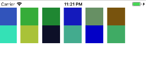

虽然是网格布局，但cell大小、间距均需修改，且没有显示section header、section footer，这些内容由`UICollectionViewDelegateFlowLayout`协议定义。

## 5.使用Flow Layout

`UICollectionViewDelegate`是一个可选但推荐实现的协议，用于管理与内容呈现、交互相关的问题。其主要工作是管理cell的高亮、选中，但可以为其扩展其它功能。例如，流布局`UICollectionViewDelegateFlowLayout`协议增加了控制cell大小、间距功能。

Flow Layout实现了基于行的中断布局，即`layout`将cell放置在线性路径上，并尽可能多的沿着该路径排布cell。如果当前路径空间不足，`layout`将创建一个新路径并继续布局。下图显示了垂直滚动的流布局。在这种情况下，cell横向放置，新增加的路径位于之前路径下方。Section可以选择性的添加section header、section
 footer视图。

 

 Flow Layout除了实现网格布局，还可以实现许多不同设计。例如：通过调整cell间距`minimumInteritemSpacing`、大小`itemSize`来创建在滚动方向只有一个cell的布局。cell大小也可以不同，这样会产生比传统网格更不对称的布局。

 可以通过Xcode中的Interface Builder，或纯代码配置flow layout。步骤如下：

  1. 创建flow layout，并将其分配给`UICollectionView`。
  2. 配置cell大小`itemSize`。如果没有设置，默认宽高均为`50`。
  3. 配置cell行`minimumLineSpacing`、cell间`minimumInteritemSpacing`间距，默认值为`10.0`。
  4. 如果用到了section header、section footer，配置其大小`headerReferenceSize`、`footerReferenceSize`。默认值为(0,0)。
  5. 指定`layout`滑动方向`scrollDirection`。默认滑动方向为`UICollectionViewScrollDirectionVertical`。

`UICollectionView`所使用的`layout`与应用程序视图层级结构中使用的[自动布局Auto Layout](https://github.com/pro648/tips/wiki/Auto-Layout的使用)不同，不要混淆集合视图内`layout`对象与父视图内重新定位子视图的`layoutSubviews`。`layout`对象从不直接触及其管理的视图，因为实质上`layout`并不拥有任何视图。相反，`layout`只生成集合视图中cell、supplementary view、decoration view的位置、大小和可视外观属性，并将这些属性提供给`UICollectionView`，由`UICollectionView`将这些属性应用于实际视图对象。

声明`ViewController`遵守`UICollectionViewDelegate`、`UICollectionViewDelegateFlowLayout`协议。将`delegate`赋给当前控制器，即取消`collectionView`初始化方法中`_collectionView.delegate = self;`的注释。

### 5.1设置cell大小`itemSize`

所有cell大小一致，最为快捷方式是为`itemSize`属性赋值，如果cell大小不同，则必须使用`collectionView: layout: sizeForItemAtIndexPath: `方法。

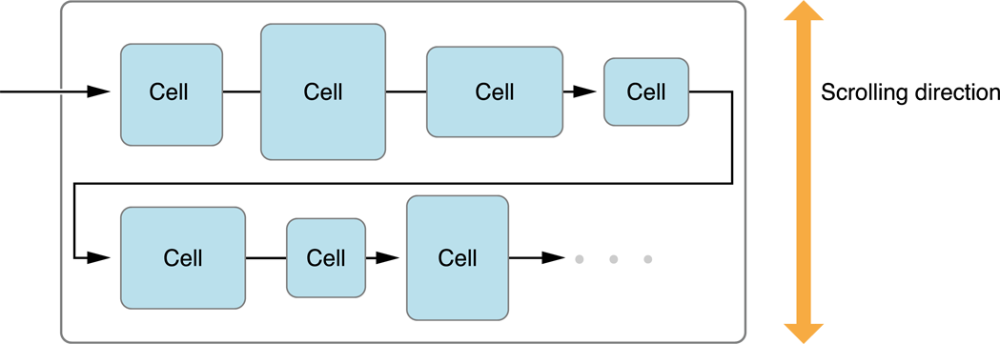

> 如果cell大小不同，则每行cell数量可能不同。

进入`ViewController.m`，在实现部分添加以下代码，配置cell大小。

```
// 设置item大小。
- (CGSize)collectionView:(UICollectionView *)collectionView layout:(UICollectionViewLayout *)collectionViewLayout sizeForItemAtIndexPath:(NSIndexPath *)indexPath {
    return CGSizeMake(153, 128);
}
```

运行demo，如下所示：

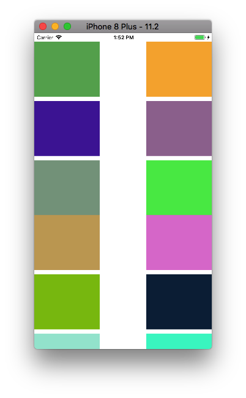

### 5.2设置section header和section footer大小

在布局section header、section footer时，只有与滑动方向相同的值会被采用。例如，垂直滚动的`UICollectionView`，`layout`只使用`colllectionView: layout: referenceSizeForHeaderInSection: `、`collectionView: layout: referenceSizeForFooterInSection: `、`headerReferenceSize`、`footerReferenceSize`提供的高，宽会被设置为`UICollectionView`的宽。如果滑动方向的长度被设置为`0`，则supplementary view不可见。

进入`ViewController.m`，在实现部分添加以下代码，设置section header、section footer大小。

```
// 设置section header大小。
- (CGSize)collectionView:(UICollectionView *)collectionView layout:(UICollectionViewLayout *)collectionViewLayout referenceSizeForHeaderInSection:(NSInteger)section {
    return section == 0 ? CGSizeMake(40, 40) : CGSizeMake(45, 45);
}

// 设置section footer大小。
- (CGSize)collectionView:(UICollectionView *)collectionView layout:(UICollectionViewLayout *)collectionViewLayout referenceSizeForFooterInSection:(NSInteger)section {
    return CGSizeMake(35, 35);
}
```

运行demo，如下所示：

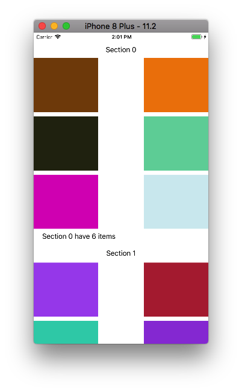

### 5.3设置item间距`minimumInteritemSpacing`

利用flow layout可以指定cell间、行间最小间距，但其实际间距可能大于最小间距。当布局时，flow layout将cell添加到当前行，直到没有足够的空间来放置另一个cell。如果刚好可以排布整数个cell，那么cell间的间距等于最小间距。如果行尾有额外的空间，又不能放下另一个cell，flow layout将增加cell间距，直到cell在行内均匀排布，这时cell间距将大于`minimumInteritemSpacing`。

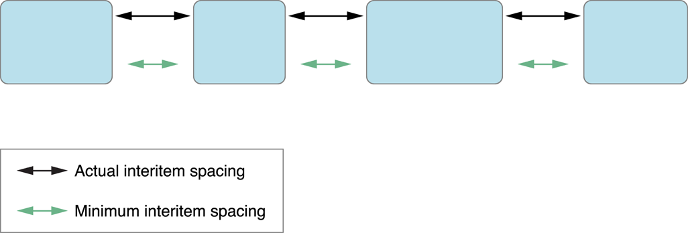

进入`ViewController.m`，在实现部分添加以下代码，设置item间距。

```
// 设置item间距。
- (CGFloat)collectionView:(UICollectionView *)collectionView layout:(UICollectionViewLayout *)collectionViewLayout minimumInteritemSpacingForSectionAtIndex:(NSInteger)section {
    return 20;
}
```

运行demo，如下所示：

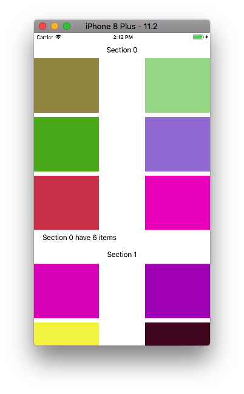

这里每行只能排布两个cell，所以实际间距大于设置的最小间距`20`。

### 5.4设置行间距`minimumLineSpacing`

对于行间距，flow layout采用与设置cell间距一样技术。如果所有cell大小相同，flow layout会严格遵守最小间距设置，即每一行的cell在同一条线上，相邻行cell间距等于`minimumLineSpacing`。

如果cell大小不同，flow layout会在滑动方向选取每行最大cell。例如，在垂直方向滑动，flow layout会选取每行高最大的cell，随后设置这些高最大的cell间距为`minimumLineSpacing`。如果这些高最大的cell位于行不同位置，行间距看起来会大于`minimumLineSpacing`。如下所示：

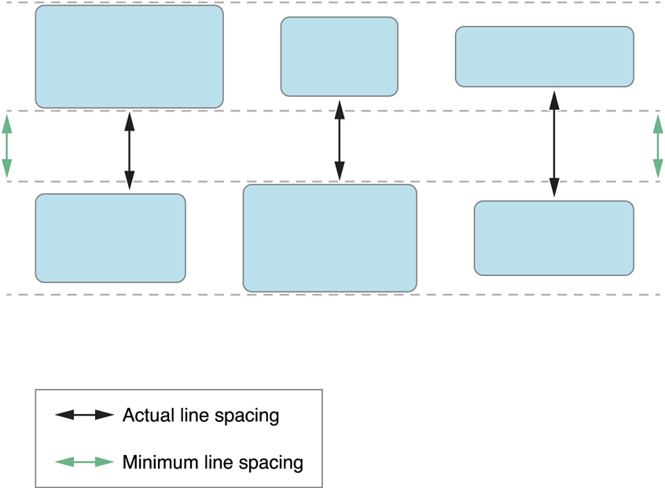

进入`ViewController.m`，在实现部分添加以下代码，设置item行间距。

```
// 设置行间距。
- (CGFloat)collectionView:(UICollectionView *)collectionView layout:(UICollectionViewLayout *)collectionViewLayout minimumLineSpacingForSectionAtIndex:(NSInteger)section {
    return 20;
}
```

运行demo，如下所示：

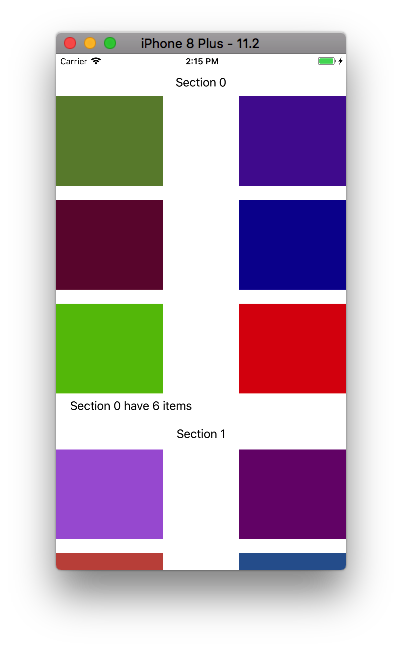

这个demo中所有cell大小相同，所以这里的`minimumLineSpacing`会严格遵守设置的`minimumLineSpacing`间距`20`。

### 5.5使用section inset设置内容边距

使用`sectionInset`可以调整可供放置cell区域大小，如增加section header、section footer与cell间距，增加行首、行尾间距。下图显示了`sectionInset`如何影响垂直滚动的`UICollectionView`。

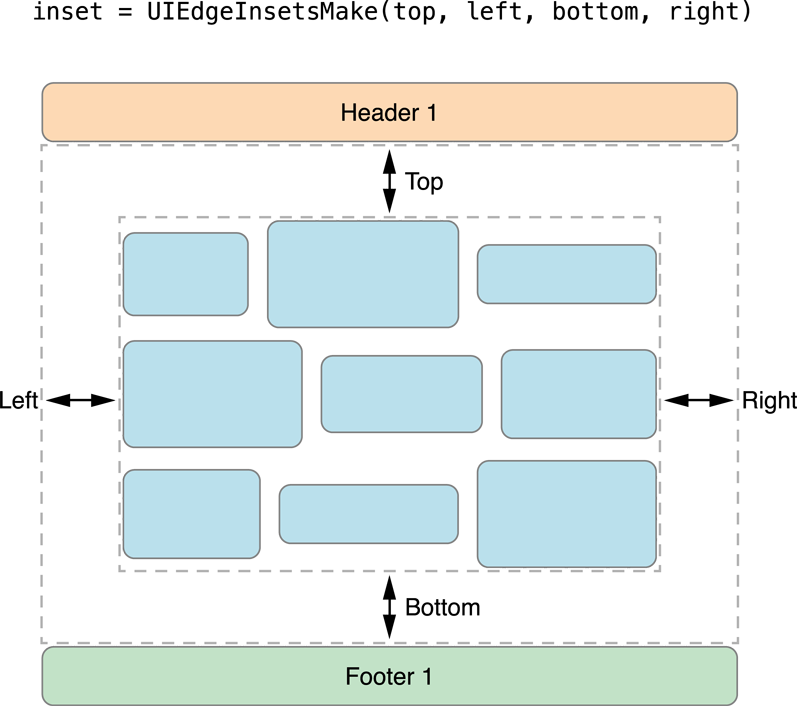

因为`sectionInset`减少了可供放置cell的空间，可以用此属性限制每行cell数量。例如，在非滑动方向设置inset，可以减少每行可用空间，同时配合设置`itemSize`，可以控制每行cell数量。

继续在`ViewController.m`实现部分添加以下代码，设置`sectionInset`。

```
// 设置页边距。
- (UIEdgeInsets)collectionView:(UICollectionView *)collectionView layout:(UICollectionViewLayout *)collectionViewLayout insetForSectionAtIndex:(NSInteger)section {
    return UIEdgeInsetsMake(0, 20, 0, 20);
}
```

运行demo，如下所示：

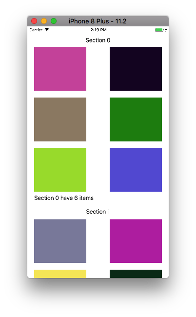

使用`UICollectionViewDelegateFlowLayout`协议可以动态调整布局信息。例如，不同item大小不同，不同section内item间距不同。如果没有提供代理方法，flow layout会使用通过属性设置的值。上面代码除设置section header大小部分，均可使用属性进行设值，如下所示：

```
- (UICollectionViewFlowLayout *)flowLayout {
    if (!_flowLayout) {
        ...
        // 通过属性设值。
        _flowLayout.itemSize = CGSizeMake(153, 128);
        _flowLayout.footerReferenceSize = CGSizeMake(35, 35);
        _flowLayout.minimumLineSpacing = 20;
        _flowLayout.minimumInteritemSpacing = 20;
        _flowLayout.sectionInset = UIEdgeInsetsMake(0, 20, 0, 20);
    }
    return _flowLayout;
}
```

现在运行app，如下所示：

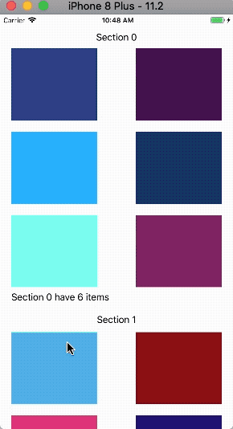

## 6.数据模型

高性能的数据源使用section和item来组织其底层数据对象，这样会使数据源方法更易实现。数据源方法会被频繁调用，所以在数据源检索数据时必须足够快。

一个简单的解决办法（但不是唯一的）是让数据模型使用一组嵌套数组，嵌套数组内元素为section的数组，section数组内元素为该section内item。检索某个item就变成了先检索其section数组，再在该section数组内检索该item。这种模式适合于中等规模的数据模型。

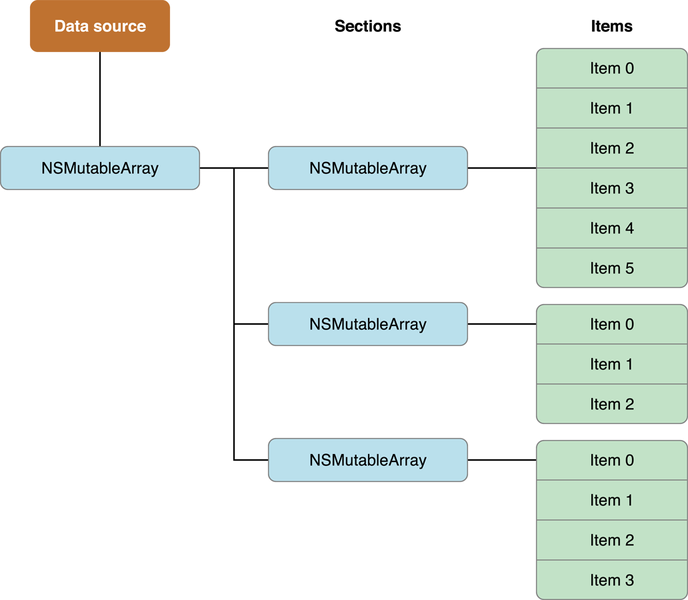

当设计数据结构时，始终可以从简单数组开始，根据需要迁移到更高效结构。通常，数据对象不应成为性能瓶颈。`UICollectionView`通过访问数据对象以获得共有多少个对象，并获取当前屏幕上显示对象的视图。如果`layout`仅依赖于数据对象，当数据对象包含数千个对象时，性能会受到严重影响。

现在，为这个demo添加一个数据模型。

打开Xcode，选择File > New > File...，在弹出窗口选择iOS > Source > Cocoa Touch Class模板，点击*Next*；*Class*一栏填写`SimpleModel`，*Subclass of*选择`NSObject`，点击*Next*；选择文件位置，点击*Create*创建文件。

进入`SimpleModel.h`文件，声明一个可变数组`model`。

```
@interface SimpleModel : NSObject

@property (strong, nonatomic) NSMutableArray *model;

@end
```

进入`SimpleModel.m`文件，设置`model`可变数组包含另外两个可变数组`section1`、`section2`，这两个可变数组分别包含六个元素。

```
- (instancetype)init {
    self = [super init];
    if (self) {
        NSMutableArray *section1 = [NSMutableArray arrayWithObjects:@"1",@"2",@"3",@"4",@"5",@"6", nil];
        NSMutableArray *section2 = [NSMutableArray arrayWithObjects:@"A",@"B",@"C",@"D",@"E",@"F", nil];
        _model = [NSMutableArray arrayWithObjects:section1,section2, nil];
    }
    return self;
}
```

打开*Assets.xcassets*，添加[github/pro648/BasicDemos-iOS](https://github.com/pro648/BasicDemos-iOS/tree/master/CollectionView/CollectionView/Assets.xcassets)这里的照片，也可以通过文章底部的源码链接下载源码获取。

## 7.自定义`UICollectionViewCell`子类

自定义`UICollectionViewCell`子类，并为其添加`UIImageView`和`UILabel`对象的属性。

打开Xcode，选择File > New > File...，在弹出窗口选择iOS > Source > Cocoa Touch Class，点击*Next*；*Class*一栏填写`CollectionViewCell`，*Subclass of*选择`UICollectionViewCell`，点击*Next*；选择文件位置，点击*Create*创建文件。

进入`CollectionViewCell.h`文件，声明一个`imageView`和一个`label`属性。

```
@interface CollectionViewCell : UICollectionViewCell

@property (strong, nonatomic) UIImageView *imageView;
@property (strong, nonatomic) UILabel *label;

@end
```

进入`CollectionViewCell.m`文件，初始化`imageView`和`label`属性。

```
- (instancetype)initWithFrame:(CGRect)frame {
    self = [super initWithFrame:frame];
    if (self) {
        // 1.初始化imageView、label。
        CGFloat cellWidth = self.bounds.size.width;
        CGFloat cellHeight = self.bounds.size.height;
        _imageView = [[UIImageView alloc] initWithFrame:CGRectMake(0, 0, cellWidth, cellHeight * 4/5)];
        _label = [[UILabel alloc] initWithFrame:CGRectMake(0, cellHeight * 4/5, cellWidth, cellHeight * 1/5)];
        _label.textAlignment = NSTextAlignmentCenter;
        
        // 2.添加imageView、label到cell。
        [self.contentView addSubview:_imageView];
        [self.contentView addSubview:_label];
    }
    return self;
}
```

进入`ViewController.m`文件，导入`CollectionViewCell.h`和`SimpleModel.h`文件，声明类型为`SimpleModel`的`simpleModel`属性。

```
#import "CollectionViewCell.h"
#import "SimpleModel.h"

@interface ViewController ()<UICollectionViewDelegate, UICollectionViewDataSource, UICollectionViewDelegateFlowLayout>

...
@property (strong, nonatomic) SimpleModel *simpleModel;

@end
```

更新cell注册方法，并初始化`simpleModel`属性。

```
- (void)viewDidLoad {
    ...
    // 更新cell注册方法。
    [self.collectionView registerClass:[CollectionViewCell class] forCellWithReuseIdentifier:cellIdentifier];
    ...
    
    // 初始化simpleModel
    self.simpleModel = [[SimpleModel alloc] init];
}
```

现在更新数据源方法。

```
- (NSInteger)numberOfSectionsInCollectionView:(UICollectionView *)collectionView {
    return self.simpleModel.model.count;
}

- (NSInteger)collectionView:(UICollectionView *)collectionView numberOfItemsInSection:(NSInteger)section {
    return [self.simpleModel.model[section] count];
}

- (CollectionViewCell *)collectionView:(UICollectionView *)collectionView cellForItemAtIndexPath:(nonnull NSIndexPath *)indexPath {
    CollectionViewCell *cell = [collectionView dequeueReusableCellWithReuseIdentifier:cellIdentifier forIndexPath:indexPath];
    
    // 设置imageView图片，label文字。
    NSString *imageName = [self.simpleModel.model[indexPath.section] objectAtIndex:indexPath.item];
    cell.imageView.image = [UIImage imageNamed:imageName];
    NSString *labelText = [NSString stringWithFormat:@"(%li, %li)",indexPath.section, indexPath.item];
    cell.label.text = labelText;
    
    return cell;
}
```

> `dataSource`必须返回一个有效的视图，不能为`nil`，即使由于某种原因该视图不该被显示。`layout`期望返回有效视图，如果返回`nil`视图会导致app终止。

运行app，如下所示：

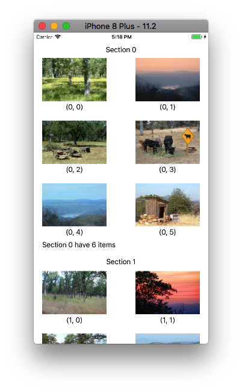

## 8.重新排序cell

自iOS 9，Collection View允许根据用户手势重新排序cell。如需支持重新排序功能，需要添加手势识别器跟踪用户手势与集合视图的交互，同时更新数据源中item位置。


为`UICollectionView`添加长按手势识别器，并实现响应方法。

```
- (void)viewDidLoad {
    ...
    // 为collectionView添加长按手势。
    UILongPressGestureRecognizer *longPressGesture = [[UILongPressGestureRecognizer alloc] initWithTarget:self action:@selector(reorderCollectionView:)];
    [self.collectionView addGestureRecognizer:longPressGesture];
}

// 长按手势响应方法。
- (void)reorderCollectionView:(UILongPressGestureRecognizer *)longPressGesture {
    switch (longPressGesture.state) {
        case UIGestureRecognizerStateBegan:{
            // 手势开始。
            CGPoint touchPoint = [longPressGesture locationInView:self.collectionView];
            NSIndexPath *selectedIndexPath = [self.collectionView indexPathForItemAtPoint:touchPoint];
            if (selectedIndexPath) {
                [self.collectionView beginInteractiveMovementForItemAtIndexPath:selectedIndexPath];
            }
            break;
        }
            
        case UIGestureRecognizerStateChanged:{
            // 手势变化。
            CGPoint touchPoint = [longPressGesture locationInView:self.collectionView];
            [self.collectionView updateInteractiveMovementTargetPosition:touchPoint];
            break;
        }
            
        case UIGestureRecognizerStateEnded:{
            // 手势结束。
            [self.collectionView endInteractiveMovement];
            break;
        }
            
        default:{
            [self.collectionView cancelInteractiveMovement];
            break;
        }
    }
}
```

长按手势响应步骤如下：

- 要开始交互式移动item，Collection View调用`beginInteractiveMovementForItemAtIndexPath: `方法；
- 当手势识别器跟踪到手势变化时，集合视图调用`updateInteractiveMovementTargetPosition: `方法报告最新触摸位置；
- 当手势结束时，`UICollectionView`调用`endInteractiveMovement`方法结束交互并更新视图；
- 当手势中途取消或识别失败，`UICollectionView`调用`cancelInteractiveMovement`方法结束交互。

> 如果想要对手势识别器进行更全面了解，可以查看[手势控制：点击、滑动、平移、捏合、旋转、长按、轻扫](https://github.com/pro648/tips/wiki/手势控制：点击、滑动、平移、捏合、旋转、长按、轻扫)这篇文章。

在交互过程中，Collection view会动态的使布局无效，以反映当前item最新布局。默认的`layout`会自动重新排布item，你也可以自定义布局动画。

> `UICollectionViewController`默认安装了长按手势识别器，用来重新排布集合视图中cell，如果需要禁用重新排布cell手势，设置`installStandardGestureForInteractiveMovement`属性为`NO`。

当交互手势结束时，如果item位置放生了变化，`UICollectionView`会调用以下方法更新数据源。

```
// 是否允许移动item。
- (BOOL)collectionView:(UICollectionView *)collectionView canMoveItemAtIndexPath:(NSIndexPath *)indexPath {
    return YES;
}

// 更新数据源。
- (void)collectionView:(UICollectionView *)collectionView moveItemAtIndexPath:(NSIndexPath *)sourceIndexPath toIndexPath:(NSIndexPath *)destinationIndexPath {
    NSString *sourceObject = [self.simpleModel.model[sourceIndexPath.section] objectAtIndex:sourceIndexPath.item];
    [self.simpleModel.model[sourceIndexPath.section] removeObjectAtIndex:sourceIndexPath.item];
    [self.simpleModel.model[destinationIndexPath.section] insertObject:sourceObject atIndex:destinationIndexPath.item];
    // 重新加载当前显示的item。
    [collectionView reloadItemsAtIndexPaths:[collectionView indexPathsForVisibleItems]];
}
```

集合视图会先调用`collectionView: canMoveItemAtIndexPath: `方法，看当前item是否允许移动。如果没有实现该方法，但实现了`collectionView: moveItemAtIndexPath: toIndexPath: `方法，集合视图会允许所有item被移动。当交互手势结束时，`UICollectionView`会自动调用`collectionView: moveItemAtIndexPath: toIndexPath: `，如果该方法没有实现，则移动cell请求会被忽略。

运行app，移动item。

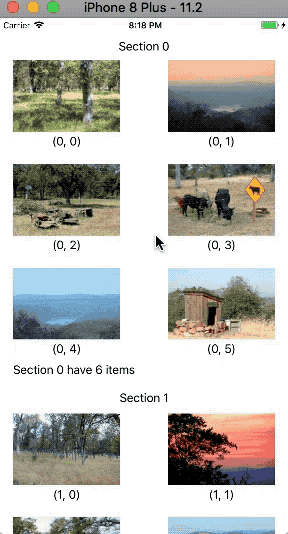

在更新数据源时，按照以下步骤操作：

1. 更新数据源中数据。
2. 调用`UICollectionView`方法进行插入、删除、移动section或item操作。

必须先更新数据源，后更改`UICollectionView`。`UICollectionView`中方法会假定当前数据源包含正确数据，如果数据有误，集合视图可能会得到错误数据，也可能请求不存在的数据，导致app崩溃。

以编程的方式添加、删除、移动单个item时，collection view会自动创建动画以反映更改。如果你想要将多个插入、删除、移动操作合并为一个动画，则必须将这些操作放到一个块内，并将该块传递给`performBatchUpdates: completion: `方法。批量更新会在同一时间更新所有操作。

> 在`performBatchUpdates: completion: `方法中，删除操作会在插入操作之前进行。也就是说，删除操作的index是collection view在执行*批量更新batch update*前的index，插入操作的index是collection view在执行完批量更新中删除操作后的index。

## 9.使用drag and drop排序

iOS 11增加了系统范围的*拖放操作drag and drop*，让用户可以快速简单的将文本、图像和文件从一个app移动到另一个app，只需轻点并按住即可提取其内容，拖放到其它位置。

`UICollectionView`通过专用API支持drag和drop，我们可以使用drag和drop来重新排序cell。

- 为了支持drag操作，定义一个drag delegate对象，并将其赋值给collection view的`dragDelegate`，该对象必须遵守`UICollectionViewDragDelegate`协议；
- 为了支持drop操作，定义一个drop delegate对象，并将其赋值给collection view的`dropDelegate`，该对象必须遵守`UICollectionViewDropDelegate`协议。

注释掉上一部分使用长按手势重新排序cell的代码，现在使用drag and drop重新排序。

> 所有*拖放drag and drop*功能都可以在iPad上使用。在iPhone上，拖放功能只能在应用内使用，不可在应用间拖放。
>
> app可以只遵守`UICollectionViewDragDelegate`、`UICollectionViewDropDelegate`中的一个协议。

进入`ViewController.m`文件，声明视图控制器遵守`UICollectionViewDragDelegate`、`UICollectionViewDropDelegate`协议。同时，将视图控制器赋值给`dragDelegate`、`dropDelegate`属性。

```
@interface ViewController ()<UICollectionViewDelegate, UICollectionViewDataSource, UICollectionViewDelegateFlowLayout, UICollectionViewDragDelegate, UICollectionViewDropDelegate>

- (void)viewDidLoad {
    ...
    // 开启拖放手势，设置代理。
    self.collectionView.dragInteractionEnabled = YES;
    self.collectionView.dragDelegate = self;
    self.collectionView.dropDelegate = self;
}
```

### 9.1从集合视图中拖起item

`UICollectionView`管理大部分与拖动相关的交互，但你需要指定要拖动的item。当拖动手势发生时，集合视图创建一个拖动会话，调用`collectionView:itemsForBeginningDragSession:atIndexPath:`代理方法。如果该方法返回非空数组，则集合视图将开始拖动指定item。如果不允许拖动指定索引路径的item，则返回空数组。

在实现`collectionView:itemsForBeginningDragSession:atIndexPath:`方法时，按照以下步骤操作：

1. 创建一个或多个`NSItemProvider`，使用`NSItemProvider`传递集合视图item内容。
2. 将每个`NSItemProvider`封装在对应`UIDragItem`对象中。
3. 考虑为每个`dragItem`的`localObject`分配要传递的数据。这一步骤是可选的，但在同一app内拖放时，`localObject`可以加快数据传递。
4. 返回`dragItem`。

在`ViewController.m`文件中，实现上述方法：

```
- (NSArray <UIDragItem *>*)collectionView:(UICollectionView *)collectionView itemsForBeginningDragSession:(id<UIDragSession>)session atIndexPath:(NSIndexPath *)indexPath {
    NSString *imageName = [self.simpleModel.model[indexPath.section] objectAtIndex:indexPath.item];
    NSItemProvider *itemProvider = [[NSItemProvider alloc] initWithObject:imageName];
    UIDragItem *dragItem = [[UIDragItem alloc] initWithItemProvider:itemProvider];
    dragItem.localObject = imageName;
    return @[dragItem];
}
```

如果需要支持一次拖动多个item，还需要实现`collectionView:itemsForAddingToDragSession:atIndexPath:point:`方法，其实现代码与上面部分相同。

运行app，如下所示：

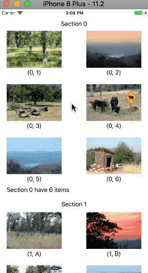

使用`collectionView:dragPreviewParametersForItemAtIndexPath:`方法，可以自定义拖动过程中cell外观。如果没有实现该方法，或实现后返回`nil`，collection view将使用cell原样式呈现。

在该方法的实现部分，创建一个`UIDragPreviewParameters`对象，并更新指定item的预览信息。使用`UIDragPreviewParameters`可以指定cell的可视部分，或改变cell背景颜色，如下所示：

```
// 设置拖动预览信息。
- (nullable UIDragPreviewParameters *)collectionView:(UICollectionView *)collectionView dragPreviewParametersForItemAtIndexPath:(NSIndexPath *)indexPath {
    // 预览图为圆角，背景色为clearColor。
    UIDragPreviewParameters *previewParameters = [[UIDragPreviewParameters alloc] init];
    CollectionViewCell *cell = (CollectionViewCell *)[collectionView cellForItemAtIndexPath:indexPath];
    previewParameters.visiblePath = [UIBezierPath bezierPathWithRoundedRect:cell.bounds cornerRadius:10];
    previewParameters.backgroundColor = [UIColor clearColor];
    return previewParameters;
}
```

运行app，如下所示：

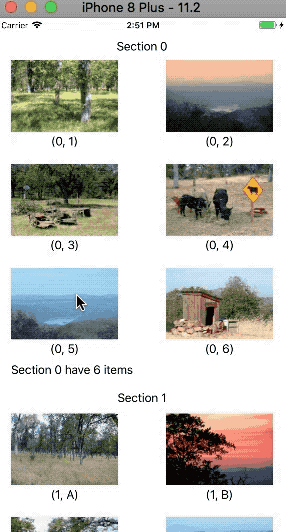

可以看到，预览cell为圆角。

### 9.2 接收拖动cell内容

当内容被拖入集合视图边界内时，集合视图会调用`collectonView:canHandleDropSession:`方法，查看当前数据模型是否可以接收拖动的内容。如果可以接收拖动的内容，集合视图会继续调用其它方法。

当用户手指移动时，集合视图跟踪手势，检测可能的drop位置，并通知`collectionView:dropSessionDidUpdate:withDestinationIndexPath:`代理方法。该方法可选实现，但一般推荐实现。实现该方法后，`UICollectonView`会及时反馈将如何合并、放置拖动的cell到当前视图。该方法会被频繁调用，实现过程要尽可能快速、简单。

当手指离开屏幕时，`UICollectionView`会调用`collectionView:performDropWithCoordinator:`方法，必须实现该方法以接收拖动的数据。实现步骤如下：

1. 枚举coordinator的`items`属性。
2. 不同类型item，采取不同接收方法：
   - 如果item的`sourceIndexPath`存在，则item始于集合视图，可以使用*批量更新batch update*从当前位置删除item，插入到新的位置。
   - 如果item的`localObject`属性存在，则item始于app其它位置，必须插入item到数据模型。
   - 前面两种均不满足时，使用`NSItemProvider`的`itemProvider`属性，异步提取数据，插入到数据模型。
3. 更新数据模型，删除、插入collection view中item。

继续在`ViewController.m`中添加以下代码：

```
// 是否接收拖动的item。
- (BOOL)collectionView:(UICollectionView *)collectionView canHandleDropSession:(id<UIDropSession>)session {
    return [session canLoadObjectsOfClass:[NSString class]];
}

// 拖动过程中不断反馈item位置。
- (UICollectionViewDropProposal *)collectionView:(UICollectionView *)collectionView dropSessionDidUpdate:(id<UIDropSession>)session withDestinationIndexPath:(NSIndexPath *)destinationIndexPath {
    UICollectionViewDropProposal *dropProposal;
    if (session.localDragSession) {
        // 拖动手势源自同一app。
        dropProposal = [[UICollectionViewDropProposal alloc] initWithDropOperation:UIDropOperationMove intent:UICollectionViewDropIntentInsertAtDestinationIndexPath];
    } else {
        // 拖动手势源自其它app。
        dropProposal = [[UICollectionViewDropProposal alloc] initWithDropOperation:UIDropOperationCopy intent:UICollectionViewDropIntentInsertAtDestinationIndexPath];
    }
    return dropProposal;
}

- (void)collectionView:(UICollectionView *)collectionView performDropWithCoordinator:(id<UICollectionViewDropCoordinator>)coordinator {
    // 如果coordinator.destinationIndexPath存在，直接返回；如果不存在，则返回（0，0)位置。
    NSIndexPath *destinationIndexPath = coordinator.destinationIndexPath ? coordinator.destinationIndexPath : [NSIndexPath indexPathForItem:0 inSection:0];

    // 在collectionView内，重新排序时只能拖动一个cell。
    if (coordinator.items.count == 1 && coordinator.items.firstObject.sourceIndexPath) {
        NSIndexPath *sourceIndexPath = coordinator.items.firstObject.sourceIndexPath;

        // 将多个操作合并为一个动画。
        [collectionView performBatchUpdates:^{
            // 将拖动内容从数据源删除，插入到新的位置。
            NSString *imageName = coordinator.items.firstObject.dragItem.localObject;
            [self.simpleModel.model[sourceIndexPath.section] removeObjectAtIndex:sourceIndexPath.item];
            [self.simpleModel.model[destinationIndexPath.section] insertObject:imageName atIndex:destinationIndexPath.item];

            // 更新collectionView。
            [collectionView moveItemAtIndexPath:sourceIndexPath toIndexPath:destinationIndexPath];
        } completion:nil];
        
        // 以动画形式移动cell。
        [coordinator dropItem:coordinator.items.firstObject.dragItem toItemAtIndexPath:destinationIndexPath];
    }
}
```

现在运行app，如下所示：


对于必须使用`NSItemProvider`检索的数据，需要使用`dropItem:toPlaceHolderInsertedAtIndexPath:withReuseIdentifier:cellUpdateHandler:`方法先将*占位符placeholder*插入，之后异步检索数据，具体方法这里不再介绍。

> iOS 11也为`UITableView`增加了drag和drop功能，其API非常相似。

## 10. 总结

`UICollectionView`非常强大，除系统提供的这些布局风格，你还可以使用*自定义布局custom layout*满足你的各种需求。

如果觉得从数据源获取数据很耗时，可以使用`UICollectionViewDataSourcePrefetching`协议，该协议会协助你的数据源在还未调用`collectionView:cellForItemAtIndexPath:`方法时进行预加载。详细内容可以查看[文档](https://developer.apple.com/documentation/uikit/uicollectionviewdatasourceprefetching/prefetching_collection_view_data?language=objc)进一步学习。

Demo名称：CollectionView  
源码地址：<https://github.com/pro648/BasicDemos-iOS>

参考资料：

1. [About iOS Collection Views](https://developer.apple.com/library/content/documentation/WindowsViews/Conceptual/CollectionViewPGforIOS/Introduction/Introduction.html)
2. [Supporting Drag and Drop in Collection Views](https://developer.apple.com/documentation/uikit/views_and_controls/collection_views/supporting_drag_and_drop_in_collection_views?language=objc)