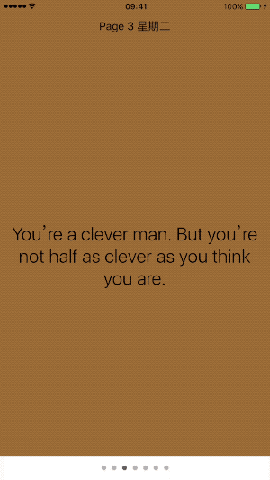

`UIPageViewController`是一个用来管理内容页之间导航的容器控制器(container view controller)，其中每个子页面由子视图控制器管理。内容页间导航可以由用户手势触发，也可以由代码控制。在页面之间导航时，`UIPageViewController`使用其初始化时指定的transition style动画。

在应用程序启动时，我们可以使用`UIPageViewController`来实现引导图的效果，以告知用户app的基本功能。

这篇文章将讲述如何使用`UIPageViewController`，让用户在不同页面间滑动。

## 1. 创建demo

创建一个Simple View Application模板的工程，名称为[PageViewController](https://github.com/pro648/BasicDemos-iOS/tree/master/PageViewController)。创建两个继承自`UIViewController`的控制器，名称分别为`RootViewController`、`DataViewController`；另外创建一个名称为`Model`继承自`NSObject`的类。

> Xcode提供了Page-Based App模板，其包含一个基于`UIPageViewController`的功能齐全的应用程序。但这个模板有点复杂，需要花更多时间来清理模版。除此之外，从头开始更易于理解`UIPageViewController`背后的概念。

demo完成后效果如下：




## 2. 页面布局

进入`DataViewController.h`文件，在接口部分添加以下属性：

```
@interface DataViewController : UIViewController

@property (nonatomic, assign) NSUInteger itemIndex;
@property (nonatomic, strong) NSString *day;
@property (nonatomic, strong) NSString *quote;

@end
```

进入`DataViewController.m`文件，声明两个`UILabel`用来显示页码和内容，同时使用懒加载初始化，并添加到`view`，如下：

```
@interface DataViewController ()

@property (nonatomic, strong) UILabel *dayLabel;
@property (nonatomic, strong) UILabel *quoteLabel;

@end
```

```
#pragma mark - Getters & Setters

- (UILabel *)dayLabel {
    if (!_dayLabel) {
        _dayLabel = [[UILabel alloc] initWithFrame:CGRectMake(0, 30, CGRectGetWidth(self.view.bounds), 20)];
        _dayLabel.font = [UIFont preferredFontForTextStyle:UIFontTextStyleBody];
        _dayLabel.textAlignment = NSTextAlignmentCenter;
    }
    return _dayLabel;
}

- (UILabel *)quoteLabel {
    if (!_quoteLabel) {
        _quoteLabel = [[UILabel alloc] initWithFrame:CGRectMake(0, 50, CGRectGetWidth(self.view.bounds), CGRectGetHeight(self.view.bounds) - 50)];
        _quoteLabel.frame = CGRectInset(_quoteLabel.frame, 16, 0);
        _quoteLabel.font = [UIFont preferredFontForTextStyle:UIFontTextStyleTitle1];
        _quoteLabel.textAlignment = NSTextAlignmentCenter;
        _quoteLabel.numberOfLines = 0;
    }
    return _quoteLabel;
}
```

```
- (void)viewDidLoad {
    [super viewDidLoad];
    // Do any additional setup after loading the view.
    
    [self.view addSubview:self.dayLabel];
    [self.view addSubview:self.quoteLabel];
}
```

最后，在`viewWillAppear:`中将`itemIndex`、`day`和`quote`显示到`UILabel`：

```
- (void)viewWillAppear:(BOOL)animated {
    [super viewWillAppear:animated];
    
    self.dayLabel.text = [NSString stringWithFormat:@"Page %lu %@",self.itemIndex + 1, [self.day description]];
    self.quoteLabel.text = self.quote;
}
```

## 3. UIPageViewControllerDataSource

为支持手势导航，必须为视图控制器提供data source，它会根据需要提供内容视图控制器，data source必须遵守`UIPageViewControllerDataSource`协议。

一般，`UIPageViewControllerDataSource`会根据传入的视图控制器来决定要显示的内容，以此创建所需的视图控制器。在视图控制器中添加诸如页码之类的信息很有帮助，可以简化确定显示内容的任务。

进入`Model.h`文件，声明`Model`类遵守`UIPageViewControllerDataSource`协议，并添加以下方法：

```
#import <Foundation/Foundation.h>
#import <UIKit/UIKit.h>
@class DataViewController;

@interface Model : NSObject <UIPageViewControllerDataSource>

- (DataViewController *)viewControllerAtIndex:(NSUInteger)index;

@end
```

进入`Model.m`文件，声明两个数组，用于每页显示的内容，如下：

```
@interface Model ()

@property (nonatomic, strong, readonly) NSArray *days;
@property (nonatomic, strong, readonly) NSArray *quotes;

@end
```

在初始化方法中，创建数据模型：

```
- (instancetype)init {
    self = [super init];
    if (self) {
        // 创建数据模型。
        NSDateFormatter *dateFormatter = [[NSDateFormatter alloc] init];
        _days = [[dateFormatter weekdaySymbols] copy];
        
        _quotes = @[@"Everyone who isn’t us is an enemy.",
                    @"When you play the game of thrones you win or you die. There is no middle ground.",
                    @"You’re a clever man. But you’re not half as clever as you think you are.",
                    @"Nobody cares what your father once told you.",
                    @"Everywhere in the world, they hurt little girls.",
                    @"I choose violence.",
                    @"What is Dead May Never Die"
                    ];
    }
    return self;
}
```

实现接口部分声明的方法：

```
- (DataViewController *)viewControllerAtIndex:(NSUInteger)index {
    // 返回指定index的视图控制器。
    if (self.days.count == 0 || index >= self.days.count) {
        return nil;
    }
    
    DataViewController *dataVC = [[DataViewController alloc] init];
    dataVC.itemIndex = index;
    dataVC.day = self.days[index];
    dataVC.quote = self.quotes[index];
    return dataVC;
}
```

`UIPageViewControllerDataSource`协议共有四个方法，其中`pageViewController:viewControllerBeforeViewController:`方法和`pageViewController:viewControllerAfterViewController`方法必须实现。

```
- (UIViewController *)pageViewController:(UIPageViewController *)pageViewController viewControllerBeforeViewController:(UIViewController *)viewController {
    // 返回上一个视图控制器。
    NSUInteger index = ((DataViewController *)viewController).itemIndex;
    if (index == 0 || index == NSNotFound) {
        return nil;
    }
    
    --index;
    return [self viewControllerAtIndex:index];
}

- (UIViewController *)pageViewController:(UIPageViewController *)pageViewController viewControllerAfterViewController:(UIViewController *)viewController {
    // 返回下一个视图控制器。
    NSUInteger index = ((DataViewController *)viewController).itemIndex;
    if (index == self.days.count - 1 || index == NSNotFound) {
        return nil;
    }
    
    ++index;
    return [self viewControllerAtIndex:index];
}
```

如果同时实现了`presentationCountForPageViewController:`和`presentationIndexForPageViewController:`可选实现协议方法，同时`UIPageViewController`的transition style被指定为`UIPageViewControllerTransitionStyleScroll`，navigationOrientation被指定为`UIPageViewControllerNavigationOrientationHorizontal`，则会在视图控制器底部显示page indicator。

```
// 初始页。
- (NSInteger)presentationIndexForPageViewController:(UIPageViewController *)pageViewController {
    NSUInteger currentPage = 2;
    
    if (currentPage >= self.days.count) {
        currentPage = 0;
    }
    
    DataViewController *dataVC = (DataViewController *)pageViewController.viewControllers.firstObject;
    dataVC.itemIndex = currentPage;
    dataVC.day = self.days[currentPage];
    dataVC.quote = self.quotes[currentPage];
    return currentPage;
}

// 共多少页。
- (NSInteger)presentationCountForPageViewController:(UIPageViewController *)pageViewController {
    return self.days.count;
}
```

如果默认显示第一页，则`presentationIndexForPageViewController:`方法可以直接返回`0`，而无需做其他操作。

>在调用`setViewControllers:direction:animated:completioin:`方法后，会调用上面配置page control的方法。通过手势在页面间导航时，将不再调用上述方法，`currentPage`的index会被自动更新，视图控制器的数量应为常量。

## 4. 配置UIPageViewController

进入`RootViewController.m`文件，声明一个`UIPageViewController`类型的属性，另外声明一个`Model`类型的实例。

```
#import "RootViewController.h"
#import "DataViewController.h"
#import "Model.h"

@interface RootViewController () 

@property (nonatomic, strong) UIPageViewController *pageViewController;
@property (nonatomic, strong) Model *model;

@end
```

> 记得导入`DataViewController`和`Model`类。

在`viewDidLoad`方法中配置`UIPageViewController`，更新后如下：

```
- (void)viewDidLoad {
    [super viewDidLoad];
    
    // 初始化并配置pageViewController。
    self.pageViewController = [[UIPageViewController alloc] initWithTransitionStyle:UIPageViewControllerTransitionStyleScroll
                                                          navigationOrientation:UIPageViewControllerNavigationOrientationHorizontal
                                                                        options:@{UIPageViewControllerOptionInterPageSpacingKey : @20}];
    DataViewController *dataVC = [self.model viewControllerAtIndex:0];
    [self.pageViewController setViewControllers:@[dataVC]
                                      direction:UIPageViewControllerNavigationDirectionForward
                                       animated:YES
                                     completion:nil];
    
    // 设置代理。
    self.pageViewController.dataSource = self.model;
    self.pageViewController.delegate = self;
    
    // 设置pageViewController inset。
    CGRect pageViewRect = self.view.bounds;
    if ([UIDevice currentDevice].userInterfaceIdiom == UIUserInterfaceIdiomPad) {
        pageViewRect = CGRectInset(pageViewRect, 40, 40);
    }
    self.pageViewController.view.frame = pageViewRect;
    
    // 添加视图控制器、视图。
    [self addChildViewController:self.pageViewController];
    [self.view addSubview:self.pageViewController.view];
    
    [self.pageViewController didMoveToParentViewController:self];
    
    // 设置page indicator颜色。
    UIPageControl *pagecontrol = UIPageControl.appearance;
    pagecontrol.pageIndicatorTintColor = [UIColor lightGrayColor];
    pagecontrol.currentPageIndicatorTintColor = [UIColor darkGrayColor];
}

// 初始化model
- (Model *)model {
    if (!_model) {
        _model = [[Model alloc] init];
    }
    return _model;
}
```

`initWithTransitionStyle:navigationOrientation:options:`方法用来初始化`UIPageViewController`，其参数如下：

- transition style参数：可以为滚动样式`UIPageViewControllerTransitionStyleScroll`和翻页样式`UIPageViewControllerTransitionPageCurl`。

- navigationOrientation：可以为横向`UIPageViewControllerNavigationOrientationHorizontal`和纵向`UIPageViewControllerNavigationOrientationVertical`。

- options：该参数为词典。key为`UIPageViewControllerOptionInterPageSpacingKey`和`UIPageViewControllerOptionSpineLocationKey`。

  - Key为`UIPageViewControllerOptionInterPageSpacingKey`时，值应为封装在`NSNumber`中的`CGFloat`类型。默认值为`0`。只有在transition style为`UIPageViewControllerTransitionStyleScroll`时才会生效。

  - Key为`UIPageViewControllerOptionSpineLocationKey`时，值为以下枚举类型：

    ```
    typedef enum UIPageViewControllerSpineLocation : NSInteger {
        UIPageViewControllerSpineLocationNone = 0,
        UIPageViewControllerSpineLocationMin = 1,
        UIPageViewControllerSpineLocationMid = 2,
        UIPageViewControllerSpineLocationMax = 3
    } UIPageViewControllerSpineLocation;
    ```

    当transition style为`UIPageViewControllerTransitionPageCurl`时，该值默认为`UIPageViewControllerSpineLocationMin`；否则，该值默认为`UIPageViewControllerSpineLocationNone`。另外，使用该值时应当将其封装在`NSNumber`对象中使用。

初始化`UIPageViewController`后，使用`setViewControllers:direction:animated:completion:`方法设置其内容视图。可以指定一次显示一个或两个视图控制器，其由`spineLocation`、`doubleSided`属性决定。动画结束后将显示传递给该方法的`viewControllers`。如果transition style为`UIPageViewControllerTransitionStylePageCurl`，传递给该方法的viewControllers将由`spineLocation`、`doubleSided`属性决定。

| spineLocation                                                | doubleSided | viewControllers参数                                          |
| ------------------------------------------------------------ | ----------- | ------------------------------------------------------------ |
| UIPageViewControllerSpineLocationMid                         | YES         | 传入左侧和右侧需要显示的视图控制器                           |
| UIPageViewControllerSpineLocationMin<br>或<br>UIPageViewControllerSpineLocationMax | YES         | 传入正面、背面两侧显示的视图控制器。<br><br>背面视图控制用于翻页动画 |
| UIPageViewControllerSpineLocationMin<br>或<br>UIPageViewControllerSpineLocationMax | NO          | 传入正面需要显示的视图控制器                                 |

## 5. UIPageViewControllerDelegate

`UIPageViewController`的委托必须遵守`UIPageViewControllerDelegete`协议，该协议中的方法允许委托在设备方向改变、用户导航到新页面时接收通知。对于page-curl style transition，可以在用户界面改变时提供不同的脊柱位置(spine location)。

在`RootViewController.m`文件中，添加两个`NSUInteger`类型的属性，分别用来保存当前页码、下一页码。

```
@interface RootViewController () <UIPageViewControllerDelegate>

...
@property (nonatomic, assign) NSUInteger currentIndex;
@property (nonatomic, assign) NSUInteger nextIndex;

@end
```

实现`UIPageViewControllerDelegete`的协议方法，在用户滑动时更新页面内容：

```
// 手势导航开始前调用该方法。
- (void)pageViewController:(UIPageViewController *)pageViewController willTransitionToViewControllers:(NSArray<UIViewController *> *)pendingViewControllers {
    // 如果用户终止了滑动导航，transition将不能完成，页面也将保持不变。
    
    DataViewController *dataVC = (DataViewController *)pendingViewControllers.firstObject;
    if (dataVC) {
        self.nextIndex = dataVC.itemIndex;
        
        // 输出滑动方向
        if (self.currentIndex < self.nextIndex) {
            NSLog(@"Forward");
        } else {
            NSLog(@"Backward");
        }
    }
}

// 手势导航结束后调用该方法。
- (void)pageViewController:(UIPageViewController *)pageViewController didFinishAnimating:(BOOL)finished previousViewControllers:(NSArray<UIViewController *> *)previousViewControllers transitionCompleted:(BOOL)completed {
    // 使用completed参数区分成功导航和中止导航。
    if (completed) {
        self.currentIndex = self.nextIndex;
    }
}
```

运行demo，滑动上面视图或点击底部`UIPageControl`，如下所示：


虽然在初始化时指定了page间距，但上面的gif中并没有显示，这是因为`RootViewController`和`DataViewController`背景颜色一致所致，设置`DataViewController`视图背景颜色为brown color，再次运行demo：


更新`RootViewController.m`中的`viewDidLoad`方法，设置transition style为page curl：

```
- (void)viewDidLoad {
    ...
    // page curl
    self.pageViewController = [[UIPageViewController alloc] initWithTransitionStyle:UIPageViewControllerTransitionStylePageCurl
                                                         navigationOrientation:UIPageViewControllerNavigationOrientationHorizontal
                                                                            options:@{UIPageViewControllerOptionSpineLocationKey : @(UIPageViewControllerSpineLocationMin)}];
    
    ...
}
```

另外，实现`UIPageViewControllerDelegate`协议中的`pageViewController: spineLocationForInterfaceOrientation:`方法，根据设备状态调整spine location。

```
- (UIPageViewControllerSpineLocation)pageViewController:(UIPageViewController *)pageViewController spineLocationForInterfaceOrientation:(UIInterfaceOrientation)orientation {
    if (UIInterfaceOrientationIsPortrait(orientation) || ([UIDevice currentDevice].userInterfaceIdiom == UIUserInterfaceIdiomPhone)) {
        // 设备为phone，或portrait状态时，设置UIPageViewControllerSpineLocation为Min。

        DataViewController *currentVC = self.pageViewController.viewControllers.firstObject;
        [self.pageViewController setViewControllers:@[currentVC]
                                          direction:UIPageViewControllerNavigationDirectionForward
                                           animated:YES
                                         completion:nil];
        self.pageViewController.doubleSided = NO;
        return UIPageViewControllerSpineLocationMin;
    } else {
        // 在landscape orientation时，设置spine为mid，pageViewController展示两个视图控制器。

        DataViewController *currentVC = self.pageViewController.viewControllers.firstObject;
        NSUInteger indexOfCurrentVC = currentVC.itemIndex;

        NSArray *viewControllers = [NSArray array];

        if (indexOfCurrentVC == 0 || indexOfCurrentVC % 2 == 0) {
            // 如果当前页为偶数，则显示当前页和下一页。
            UIViewController *nextVC = [self.model pageViewController:self.pageViewController viewControllerAfterViewController:currentVC];
            viewControllers = @[currentVC, nextVC];
        } else {
            // 如果当前页为奇数，则显示上一页和当前页。
            UIViewController *previousVC = [self.model pageViewController:self.pageViewController viewControllerBeforeViewController:currentVC];
            viewControllers = @[previousVC, currentVC];
        }
        [self.pageViewController setViewControllers:viewControllers
                                          direction:UIPageViewControllerNavigationDirectionForward
                                           animated:YES
                                         completion:nil];

        return UIPageViewControllerSpineLocationMid;
    }
}
```

运行demo，如下所示：


另外，`UIPageViewControllerDelegate`协议中还有`pageViewControllerSupportedInterfaceOrientations:`方法，用来指定支持的全部方向。`pageViewControllerPreferredInterfaceOrientationForPresentation:`方法返回页面视图控制器的首选呈现方向。

`UIPageViewController`类一般原样使用(used as-is)，但也可以继承。

Demo名称：PageViewController  
源码地址：<https://github.com/pro648/BasicDemos-iOS>

参考资料：

1. [UIPageViewController](https://developer.apple.com/documentation/uikit/uipageviewcontroller?language=objc)
2. [Get user swiping direction in UIPageViewController](https://stackoverflow.com/questions/27931961/get-user-swiping-direction-in-uipageviewcontroller)