在iOS中，滚动视图`UIScrollView`用于查看大于屏幕的内容。Scroll View有两个主要目的：

- 让用户拖动视图以显示更多内容区域。
- 让用户使用捏合手势放大或缩小所显示的内容。

下图显示了`UIScrollView`拖动要显示的内容区域，以显示不同内容。`UIScrollView`上添加一个子视图`UIImageView`，`UIImageView`上显示一个男孩的图片。当手指在屏幕上滑动时，屏幕上显示的内容随之移动，滚动条开始显示；当手指离开屏幕，滚动条消失。

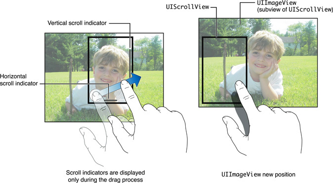

`UIScrollView`不包含任何视图用以显示其内容，只能滚动其子视图。另外，`UITableView`、`UICollectionView`和`UITextView`均继承自`UIScrollView`。

这篇文章将使用纯代码来学习`UIScrollView`，使用*Interface Builder*添加滚动视图和添加其他视图没有区别，这里不再介绍。

## 1. `UIScrollView`初体验

`UIScrollView`创建后需要添加到其他视图控制器或视图层级中，要使用滚动视图，必须配置以下两项：

- 必须设定`contentSize`属性。`contentSize`属性用于指定滚动视图可以滚动的区域。
- 必须为滚动视图添加一个或多个视图，滚动视图用这些视图显示内容和实现滚动。

其他属性均是可选实现，如：`scrollsToTop`、`pagingEnabled`、`bounces`、`refreshControl`等。

> 自iOS10开始，`UIScrollView`增加了`refreshControl`属性，用于把配置好的`UIRefreshControl`赋值给该属性，这样`UIScrollView`就有了下拉刷新功能。在此之前，只能在`UITableViewController`中使用系统提供的下拉刷新功能，想了解具体使用方法可以查看我的另一篇文章：[在UIScrollView、UICollectionView和UITableView中添加UIRefreshControl实现下拉刷新](https://github.com/pro648/tips/wiki/%E5%9C%A8UIScrollView%E3%80%81UICollectionView%E5%92%8CUITableView%E4%B8%AD%E6%B7%BB%E5%8A%A0UIRefreshControl%E5%AE%9E%E7%8E%B0%E4%B8%8B%E6%8B%89%E5%88%B7%E6%96%B0)

打开Xcode，创建新的工程。选取iOS一栏下*Application*中的*Single View Application*模板，点击*Next*。在*Product Name*中填写*ScrollView*，点击*Next*选择文件位置，点击*Create*创建工程。

在开始之前，点击[这里](https://github.com/pro648/BasicDemos-iOS/blob/master/ScrollView/ScrollView/Assets.xcassets/image.imageset/image.png)下载图片，将其添加到*Assets.xcassets*。打开`ViewController.m`，添加以下声明。

```
@interface ViewController ()

@property (strong, nonatomic) UIScrollView *scrollView;
@property (strong, nonatomic) UIImageView *imageView;

@end
```

使用懒加载初始化以上属性。

```
- (UIImageView *)imageView {
    if (!_imageView) {
        UIImage *image = [UIImage imageNamed:@"image"];
        // 1.初始化imageView
        _imageView = [[UIImageView alloc] initWithImage:image];
    }
    return _imageView;
}

- (UIScrollView *)scrollView {
    if (!_scrollView) {
        // 2.初始化、配置scrollView
        _scrollView = [[UIScrollView alloc] initWithFrame:self.view.bounds];
        _scrollView.backgroundColor = [UIColor blackColor];
        _scrollView.contentSize = self.imageView.frame.size;
        _scrollView.autoresizingMask = UIViewAutoresizingFlexibleWidth | UIViewAutoresizingFlexibleHeight;
    }
    return _scrollView;
}
```

上述代码分步说明如下：

1. 使用`initWithImage: `方法初始化`imageView`。用这种方法初始化的图片视图其大小与图片大小一致，这里图片大小为2000*1500。
2. 初始化`scrollView`时，指定`scrollView`的`frame`与当前控制器视图大小、位置一致。设定`contentSize`为整个`imageView`的大小。最后设定`scrollView`的`autoresizingMask`为`UIViewAutoresizingFlexibleWidth`和`UIViewAutoresizingFlexibleHeight`，这样在屏幕旋转时，`scrollView`就可以自动调整布局。

进入`viewDidLoad`，把`scrollView`添加到控制器视图，把`imageView`添加到`scrollView`。

```
- (void)viewDidLoad {
    [super viewDidLoad];
    
    [self.view addSubview:self.scrollView];
    [self.scrollView addSubview:self.imageView];
}
```

运行demo，现在可以拖动视图查看图像的不同部分。

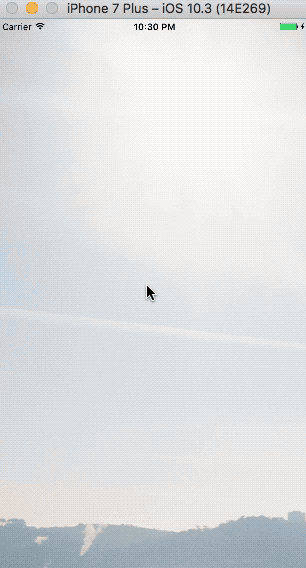

当滑动到屏幕边缘时再继续滑动(如上面GIF中开始部分），如果`bounces`属性为`YES`(默认值)，则会反弹；反之，则直接不可滑动。另外，点击状态栏(status bar)，滚动视图会直接回到顶部，这是因为`scrollsToTop`属性默认值为`YES`。但如果存在多个滚动视图，`scrollsToTop`属性均为默认值，点击状态栏时将没有任何效果。如果想要获得滑到顶部效果，必须设置其他`scrollsToTop`属性为`NO`，只能有一个`scrollsToTop`属性为`YES`。

滚动视图的`origin`可以在内容视图上移动，滚动视图按照自身`frame`裁剪内容视图。滚动视图跟踪手指的移动并相应调整`origin`，内容视图会根据新的`origin`绘制内容。滚动视图自身只绘制滚动条，除此之外不绘制任何其他内容。

运行demo时，图片原点显示在`scrollView`左上角。如果想要修改内容视图显示的内容，需要修改滚动视图的`origin`。`UIScrollView`中的`contentOffset`属性用于指定内容视图的`origin`偏离滚动视图`origin` 的点。默认值为`CGPointZero`。

在`scrollView`的懒加载方法底部，添加以下代码：

```
- (UIScrollView *)scrollView {
    if (!_scrollView) {
        ...
        _scrollView.contentOffset = CGPointMake(1000, 450);
    }
    return _scrollView;
}
```

运行demo，可以看到滚动视图已经移动到照片的其他部分。因此，你可以决定加载视图时显示滚动视图的哪一部分。

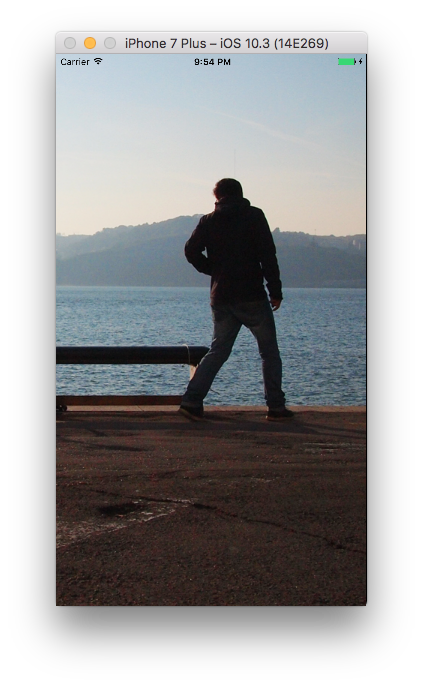

## 2. 缩放

我们添加了一个`UIScrollView`，使用户可以浏览超出屏幕大小的内容视图。如果用户可以放大和缩小视图，将会更加实用。

为支持缩放功能，定义的类必须遵守`UIScrollViewDelegate`协议，必须实现`viewForZoomingInScrollView: `代理方法，在该代理方法中返回要缩放的视图。另外，还需要使用`maximumZoomScale`和`minimumZoomScale`指定可应用于滚动视图的最大、最小缩放比。这两个属性的默认值均为`1.0`。

视图控制器遵守`UIScrollViewDelegate`协议，更新`ViewController.m`如下：

```
#import "ViewController.h"
@interface ViewController () <UIScrollViewDelegate>
```

在实现部分添加以下代理方法，指定可以缩放的视图为`imageView`。

```
- (UIView *)viewForZoomingInScrollView:(UIScrollView *)scrollView {
    return self.imageView;
}
```

在`scrollView`的懒加载方法中，将当前控制器设置为`scrollView`的代理，`scrollView`的最小、最大缩放比分别为`0.1`、`4.0`，当前缩放比`zoomScale`为`1.0`，`zoomScale`默认值为`1.0`。

```
- (UIScrollView *)scrollView {
    if (!_scrollView) {
        ...
        
        _scrollView.delegate = self;
        _scrollView.minimumZoomScale = 0.1;
        _scrollView.maximumZoomScale = 4.0;
        _scrollView.zoomScale = 1.0;
    }
    return _scrollView;
}
```

运行demo，图片将与之前的显示一样。此时，`zoomScale`为`1.0`。当缩放视图时，可以缩放到`minimumZoomScale`和`maximumZoomScale`设定的比例。当图片放大到四倍时，图像会变的模糊 (如下图)。

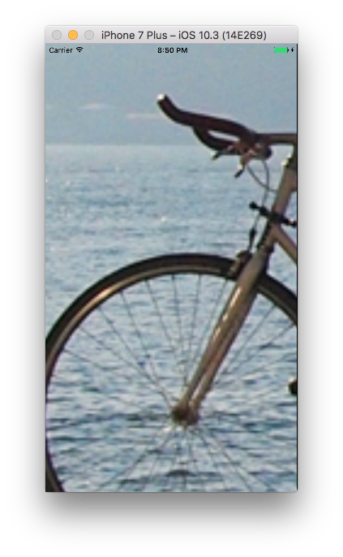

当我们把图片缩小到最小时（此时，`zoomScale`为`0.1`），会产生一个很小的图像，并在屏幕上产生大量的空白，如下图。

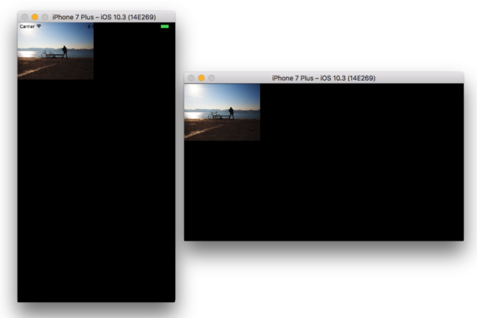

我们想要让图像在完整显示的前提下，尽可能多的填充`scrollView`，即`imageView`使用`UIViewContentModeScaleAspectFit`效果。为此，我们将使用滚动视图和图像视图大小的比例来计算最小比例因子(scale factor)。

首先移除`scrollView`懒加载中的以下代码：

```
        _scrollView.minimumZoomScale = 0.1;
        _scrollView.maximumZoomScale = 4.0;
        _scrollView.zoomScale = 1.0;
```

在实现部分添加以下方法。先取得`scrollView`和`imageView`宽、高比，将`minimumZoomScale`设置为其中小的值。这里没有设定`maximumZoomScale`，所以只能放大到默认值`1.0`，和初始`zoomScale`默认值相同。


```
- (void)setZoomScale {
    CGFloat widthScale = CGRectGetWidth(self.scrollView.frame) / CGRectGetWidth(self.imageView.frame);
    CGFloat heightScale = CGRectGetHeight(self.scrollView.frame) / CGRectGetHeight(self.imageView.frame);
    
    self.scrollView.minimumZoomScale = MIN(widthScale, heightScale);
}
```

最后在`viewDidLoad`底部调用该方法。

```
- (void)viewDidLoad {
    ...
    [self setZoomScale];
}
```

重写`viewWillLayoutSubviews`方法如下：

```
- (void)viewWillLayoutSubviews {
    [super viewWillLayoutSubviews];
    
    // 1.移除子视图
    for (UIView *view in self.scrollView.subviews) {
        [view removeFromSuperview];
    }
    
    // 2.初始化imageView 将其添加到scrollView 设置contentSize
    self.imageView = [[UIImageView alloc] initWithImage:[UIImage imageNamed:@"image"]];
    [self.scrollView addSubview:self.imageView];
    self.scrollView.contentSize = self.imageView.frame.size;
    
    // 3.重设minimumZoomScale
    [self setZoomScale];
}
```

上述代码的分步说明如下：

1. 移除`scrollView`的所有子视图。
2. 使用图片`image`初始化`imageView`，并将其添加到`scrollView`，最后重新设定`scrollView`的可滑动区域`contentSize`。这样做是为了在设备旋转时，重新计算`imageView`的位置、大小，同时更新`scrollView`内容视图大小。
3. 最后再次调用`setZoomScale`方法，设定最小缩放比。

运行app，当缩小`imageView`时，`imageView`会尽可能占用屏幕上空间，同时可以看到完整的图像视图。

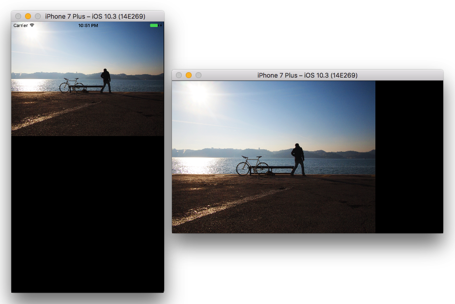

从上面图像可以看到，图像位于屏幕的左上角，我们希望图像位于屏幕的中心。在代理方法`scrollViewDidZoom: `中添加以下代码：

```
- (void)scrollViewDidZoom:(UIScrollView *)scrollView {
    // 计算imageView缩小到最小时 imageView与屏幕边缘距离
    CGFloat horizontalPadding = CGRectGetWidth(self.imageView.frame) < CGRectGetWidth(scrollView.frame) ? (CGRectGetWidth(scrollView.frame) - CGRectGetWidth(self.imageView.frame)) / 2 : 0 ;
    CGFloat verticalPadding = CGRectGetHeight(self.imageView.frame) < CGRectGetHeight(scrollView.frame) ? (CGRectGetHeight(scrollView.frame) - CGRectGetHeight(self.imageView.frame)) / 2 : 0 ;
    scrollView.contentInset = UIEdgeInsetsMake(verticalPadding, horizontalPadding, verticalPadding, horizontalPadding);
}
```

每次缩放操作后，系统都会调用该方法用以告诉滚动视图`zoomScale`已改变。在上面的代码中，我们先计算出图片与屏幕间的填充。对于顶部和底部，先判断`imageView`的高是否小于`scrollView`的高，在`imageView`的高小于`scrollView`的高时，填充高度为两个视图高之差的二分之一，否则，填充为`0`；水平方向的填充与此类似。最后设定`scrollView`的`contentInset`属性，该属性用于指定内容视图与滚动视图边缘的距离，单位为point，默认值为`UIEdgeInsetsZero`。

运行demo，在缩小视图至最小时，视图应当位于屏幕的中心。

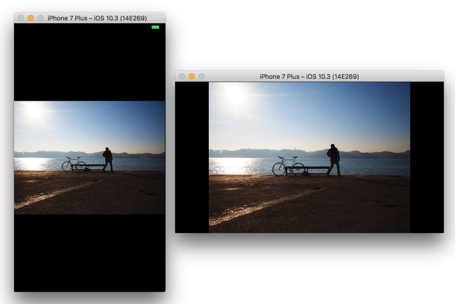

在获取视图的宽、高时应当使用`CGRectGetWidth()`和`CGRectGetHeight()`方法，避免使用`self.view.bounds.width`直接从`CGRect`中读取、操作数据。这是因为`CGRect`数据结构中的宽、高有可能是负数值。比如A矩形`CGRectMake(0, 0, 100, 100)`与b矩形`CGRectMake(100, 100, -100, -100)`位置、尺寸完全一致。宽、高中正数值表示向右、向下方向，负数值表示向左、向上方向。通过调用`CGRectGetWidth`和`CGRectGetHeight`方法获得width、height为正数值。

> 滚动视图默认支持了`UIPanGestureRecognizer`和`UIPinchGestureRecognizer`。想要了解更多手势使用，查看我的另一篇文章：[手势控制：点击、滑动、平移、捏合、旋转、长按、轻扫](https://github.com/pro648/tips/wiki/%E6%89%8B%E5%8A%BF%E6%8E%A7%E5%88%B6%EF%BC%9A%E7%82%B9%E5%87%BB%E3%80%81%E6%BB%91%E5%8A%A8%E3%80%81%E5%B9%B3%E7%A7%BB%E3%80%81%E6%8D%8F%E5%90%88%E3%80%81%E6%97%8B%E8%BD%AC%E3%80%81%E9%95%BF%E6%8C%89%E3%80%81%E8%BD%BB%E6%89%AB)

## 3. 捏合手势

添加几行代码就可以让`UIScrollView`支持捏合手势。在*iOS Human Interface Guidlines*中建议双击放大或缩小视图，但这一约定默认了视图只有一个缩放等级，如在相册应用中双击把图片放大至最大，再次双击把图片缩小至最小。或者双击会将视图放大至最大，一旦放大到最大后再次双击，视图将缩小至全屏。但也有一些应用在使用双击放大这一功能时会有特殊需求，例如地图应用。地图应用需要双击放大视图，再次双击继续放大视图。为了缩小视图，需要两个手指在屏幕上滑动，当手指靠近时视图缩小。

为了让应用支持点击缩放功能，需要在遵守`UIScrollViewDelegate`协议的类中添加响应手势的方法。当该类检测到点击、双击、两个手指触摸动作时，会触发对应响应操作。

在这个demo将实现以下功能：当视图最小时，双击视图放大至`maximumZoomScale`；否则，双击缩小视图至`minimumZoomScale`。与日常使用中的相册应用一致。

在`viewDidLoad`中为`scrollView`添加双击手势。

```
- (void)viewDidLoad {
    ...
    // 添加双击手势
    UITapGestureRecognizer *doubleTap = [[UITapGestureRecognizer alloc] initWithTarget:self action:@selector(handleDoubleTap:)];
    doubleTap.numberOfTapsRequired = 2;
    [self.scrollView addGestureRecognizer:doubleTap];
}
```

在实现部分添加双击手势响应方法。

```
- (void)handleDoubleTap:(UITapGestureRecognizer *)doubleTap {
    if (self.scrollView.zoomScale > self.scrollView.minimumZoomScale) {
        // 视图大于最小视图时 双击将视图缩小至最小
        [self.scrollView setZoomScale:self.scrollView.minimumZoomScale animated:YES];
    }
    else
    {
        // 视图为最小时 双击将视图放大至最大
        [self.scrollView setZoomScale:self.scrollView.maximumZoomScale animated:YES];
    }
}
```

在上面代码中，我们根据当前`zoomScale`进行放大或缩小视图的操作。

运行demo，可以通过双击放大、缩小视图。


观察上面GIF你会发现，使用双击放大手势点击`scrollView`任意位置，图像均以自身的中心为基点进行放大操作，而不是以点击位置为中心进行放大。我们在查看照片时，更希望视图以点击位置为中心进行放大。

下面实现以点击位置为中心放大图片。更新`handleDoubleTap: `方法如下：

```
- (void)handleDoubleTap:(UITapGestureRecognizer *)doubleTap {
    ...
    else
    {
        /*
        // 视图为最小时 双击将视图放大至最大
        [self.scrollView setZoomScale:self.scrollView.maximumZoomScale animated:YES];
        */
        
        // 1.获取点击位置
        CGPoint touchPoint = [doubleTap locationInView:self.imageView];
        // 2.获取要显示的imageView区域
        CGRect zoomRect = [self zoomRectForScrollView:self.scrollView withScale:self.scrollView.maximumZoomScale withCenter:touchPoint];
        // 5.将要显示的imageView区域显示到scrollView
        [self.scrollView zoomToRect:zoomRect animated:YES];
    }
}

- (CGRect)zoomRectForScrollView:(UIScrollView *)scrollView withScale:(CGFloat)scale withCenter:(CGPoint)center {
    // 3.声明一个区域 滚动视图的宽除以放大倍数可以得到要显示imageView宽度
    CGRect zoomRect;
    zoomRect.size.width = CGRectGetWidth(scrollView.frame) / scale;
    zoomRect.size.height = CGRectGetHeight(scrollView.frame) / scale;
    
    // 4.点击位置x坐标减去1/2图像宽度，可以得到要显示imageView的原点x坐标 y坐标类似
    zoomRect.origin.x = center.x - zoomRect.size.width / 2;
    zoomRect.origin.y = center.y - zoomRect.size.height / 2;
    
    return zoomRect;
}
```

上述代码分布说明如下：

1. 获取点击位置在`imageView`坐标系统中的位置。
2. 调用`zoomRectForScrollView: withScale: withCenter: `方法，获取要显示的`imageView`区域。
3. 先声明一个区域用以表示要返回的`imageView`可见区域。`scrollView`的宽除以放大倍数得到要显示的`imageView`原图的宽，即`zoomRect`的宽。取得高的方法也是如此。
4. 点击位置x坐标减去1/2要显示`imageView`宽(即zoomRect的宽），可以得到`zoomRect`原点x坐标。y坐标取得过程类似。
5. 使用`zoomRect: animated: `方法把要显示的`imageView`上`zoomRect`区域发送给`scrollView`。这里的`zoomRect`一定是`imageView`坐标系统上的区域。

> `zoomToRect:animated:`的rect参数必须为`viewForZoomingInScrollView:`方法返回视图的坐标系统，如果rect大小与content view大小不同，会自动调整`zoomScale`。
>
> `scrollRectToVisible:animated:`的rect参数使用scroll view坐标系统。如果rect视图已经显示在当前屏幕，则该方法什么也不做。

运行demo，点击不同位置，查看放大效果。


## 4. 翻页浏览

`UIScrollView`支持分页模式。在该模式下，用户每滑动一次手指，移动单个屏幕内所有内容。该模式一般用在电子书或引导页中。

除了像上面那样配置滚动视图，还需要把BOOL类型的`pagingEnabled`属性设置为`YES`。该属性用于指定滚动视图是否开启分页。`contentSize`属性中的高为滚动视图的高，宽为滚动视图的宽乘页数。另外，一般滚动视图的滚动条会被禁用，如果想要显示进度，可以使用`UIPageControl`。下图显示了开启分页模式的滚动视图滑动过程。

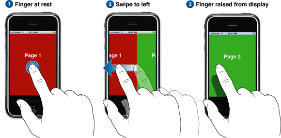

使用快捷键command+N添加文件，选取弹出框中iOS一栏下*Source*中的*Cocoa Touch Class*模板，点击*Next*，*Class*为*PageViewController*，*Subclass of*为*UIViewController*，点击*Next*。选择文件位置，点击*Create*创建文件。我们将在这个文件内实现翻页浏览功能。

在这一部分我们将在`PageViewController`上添加一个滚动视图，水平滑动显示上一页、下一页视图，滚动视图上显示当前页的图片，页面底部将会显示`UIPageControl`。

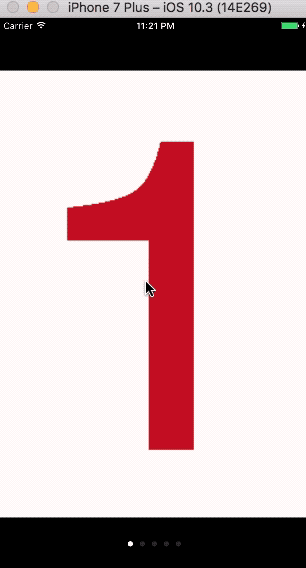

开始之前先添加这一部分所需五张图片，可以通过文章底部的网址下载源码获取。

进入`PageViewController.m`，添加以下声明。

```
@interface PageViewController ()

@property (strong, nonatomic) UIScrollView *scrollView;
@property (strong, nonatomic) NSArray *contentList;
@property (strong, nonatomic) UIPageControl *pageControl;

@end
```

其中，数组`contentList`内包含要显示照片名称。

在实现部分前添加预定义，用于指定`pageControl`的高，同时也是`scrollView`与顶部距离。

```
#define pageControlHeight 70
```

使用懒加载初始化`scrollView`和`pageControl`。

```
- (UIScrollView *)scrollView {
    if (!_scrollView) {
        _scrollView = [[UIScrollView alloc] initWithFrame:CGRectMake(0, pageControlHeight, CGRectGetWidth(self.view.frame), CGRectGetHeight(self.view.frame) - 2*pageControlHeight)];
        _scrollView.contentSize = CGSizeMake(CGRectGetWidth(self.view.frame) * self.contentList.count, CGRectGetHeight(self.view.frame) - 2*pageControlHeight);
        _scrollView.backgroundColor = [UIColor whiteColor];
        _scrollView.pagingEnabled = YES;
        _scrollView.delegate = self;
        _scrollView.showsHorizontalScrollIndicator = NO;
    }
    return _scrollView;
}

- (UIPageControl *)pageControl {
    if (!_pageControl) {
        _pageControl = [[UIPageControl alloc] initWithFrame:CGRectMake(0, CGRectGetHeight(self.view.frame) - pageControlHeight, CGRectGetWidth(self.view.frame), pageControlHeight)];
        _pageControl.numberOfPages = self.contentList.count;
        _pageControl.currentPage = 0;
    }
    return _pageControl;
}
```

`scrollView`的`frame`就是上面GIF图中的白色背景部分，这里设定`contentSize`时其宽度为滚动视图宽度的整数倍，整数由页数决定。最后把`pagingEnabled`属性设置为`YES`。

`pageControl`的总页数由数组`contentList`内元素个数决定。开始时，默认显示第一页，即`currentPage`属性为`0`。

此时，系统会在`_scrollView.delegate = self`一行处发出内容为*Assigning to 'id<UIScrollViewDelegate>_Nullable'from incompatible type 'PageViewController *const _strong'*的警告，这是因为我们没有遵守`UIScrollDelegate`协议。在`PageViewController.m`的interface添加该协议。

```
@interface PageViewController () <UIScrollViewDelegate>
```

在`viewDidLoad`方法中初始化数组，添加`scrollView`和`pageControl`到控制器视图，为`scrollView`每一页添加图片。更新后如何：

```
- (void)viewDidLoad {
    [super viewDidLoad];
    
    // 1.初始化数组
    self.contentList = @[@"one", @"two", @"three", @"four", @"five"];
    
    // 2.将scrollView和pageControl添加到view 设定控制器背景颜色
    [self.view addSubview:self.scrollView];
    [self.view addSubview:self.pageControl];
    self.view.backgroundColor = [UIColor blackColor];
    
    // 3.为scrollView每一页添加图片
    for (NSUInteger i=0; i<self.contentList.count; ++i) {
        UIImageView *imageView = [[UIImageView alloc] initWithFrame:CGRectMake(CGRectGetWidth(self.scrollView.frame) * i, 0, CGRectGetWidth(self.scrollView.frame), CGRectGetHeight(self.scrollView.frame))];
        imageView.contentMode = UIViewContentModeScaleAspectFit;
        imageView.image = [UIImage imageNamed:self.contentList[i]];
        [self.scrollView addSubview:imageView];
    }
}
```

上述代码分步说明如下：

1. 设定数组内元素，这些元素会在后面用作每一页图片的名称。
2. 将`scrollView`和`pageControl`添加到控制器视图，设定背景颜色为黑色。
3. 使用for循环为每一页内容添加图片。每一页图片的宽和高与`scrollView`的宽高相同，原点x为滚动视图宽乘`i`，因为要添加的图片在滚动视图内，其坐标系统为滚动视图，所以原点坐标y为`0`。设定`imageView`的`contentMode`为`UIViewContentModeScaleAspectFit`。之后为`imageView`添加图片。最后添加`imageView`到`scrollView`。

在代理方法`scrollViewDidEndDecelerating: `中，根据当前位置计算出当前视图所处的页数，最后更新`pageControl`的当前页码`currentPage`。

```
- (void)scrollViewDidEndDecelerating:(UIScrollView *)scrollView {
    CGFloat pageWidth = CGRectGetWidth(self.scrollView.frame);
    NSUInteger page = floor((scrollView.contentOffset.x - pageWidth/2)/pageWidth) + 1;
    self.pageControl.currentPage = page;
}
```

开启分页后，`scrollView`的偏移坐标x只有在超过了该页的中点后，才会进入新的一页，否则将会停留在上一页。计算出当前所处页后更新`pageControl`的`currentPage`属性。

在运行demo前，先指定`PageViewController`为根视图控制器，否则，运行结果还是前一部分的视图。

打开`AppDelegate.m`，导入`PageViewController.h`，并在`application: didFinishLaunchingWithOptions: `方法中设定根控制器。

```
- (BOOL)application:(UIApplication *)application didFinishLaunchingWithOptions:(NSDictionary *)launchOptions {
    
    // 设置PageViewController为根控制器
    self.window = [[UIWindow alloc] initWithFrame:[UIScreen mainScreen].bounds];
    self.window.rootViewController = [[PageViewController alloc] init];
    [self.window makeKeyAndVisible];
    
    return YES;
}
```

添加上面代码后运行demo。

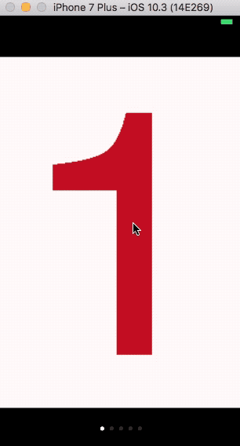

可以看到，上面的demo存在这两个问题：

1. 因为背景色为黑色，导致顶部状态栏的时间、运营商等信息完全看不清。
2. 点击`pageControl`时，虽然`currentPage`属性会自动更新，但滚动视图中的图片并没有更新。

首先添加以下代码，将状态栏的文字改为白色。

```
- (UIStatusBarStyle)preferredStatusBarStyle {
    return UIStatusBarStyleLightContent;
}
```

在`pageControl`中添加点击事件，当接收到`UIControlEventValueChanged`事件时，更新滚动视图中图片。

```
- (UIPageControl *)pageControl {
    if (!_pageControl) {
        ...
        [_pageControl addTarget:self action:@selector(changePage:) forControlEvents:UIControlEventValueChanged];
    }
    return _pageControl;
}

- (void)changePage:(id)sener {
    NSUInteger page = self.pageControl.currentPage;
    CGRect bounds = self.scrollView.bounds;
    bounds.origin.x = CGRectGetWidth(bounds) * page;
    bounds.origin.y = self.scrollView.frame.origin.y;
    [self.scrollView scrollRectToVisible:bounds animated:YES];
}
```

在点击事件的响应方法`changePage: `中，根据当前的`currentPage`计算出目前页码的`frame`，该`frame`的坐标系统为`scrollView`。最后使用`scrollRectToVisible: ` 方法滑动当前视图到该区域。

完成后运行如下：


在上面的视图中，内容视图上内容很少，我们可以在一个视图上（即滚动视图的`contentSize`)一次绘制所有内容。这样很简单，但在处理内容视图上有很多内容(如电子书有成千上万页)，或内容视图的绘制非常耗费时间时，就会变得非常低效。这时你需要使用多个视图，每个视图只显示一页内容。如一个视图显示当前页内容，一个视图显示上一页内容，另一个视图显示下一页内容，当用户滑动视图时，循环使用这些视图。这里不再详细说明，想要详细了解可以[点击这里](https://developer.apple.com/library/content/samplecode/PageControl/Introduction/Intro.html#//apple_ref/doc/uid/DTS40007795)查看。

## 5. 嵌套滚动视图

为提供更丰富的使用体验，可以在应用中嵌套使用`UIScrollView`。

嵌套的滚动视图，可以分为相同方向滚动和滚动方向相差90度的滚动。如下图：

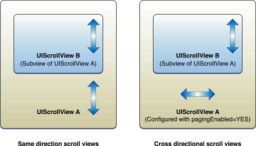

嵌套类滚动视图的一个应用示例是股票类应用程序。在使用嵌套滚动视图时，我们不需要做任何额外操作，系统默认支持该功能。

Demo名称:ScrollView  
源码地址：<https://github.com/pro648/BasicDemos-iOS>

参考资料：

1. [A Beginner’s Guide to UIScrollView](https://www.appcoda.com/uiscrollview-introduction/)
2. [About Scroll View Programming](https://developer.apple.com/library/content/documentation/WindowsViews/Conceptual/UIScrollView_pg/Introduction/Introduction.html#//apple_ref/doc/uid/TP40008179-CH1-SW1)
3. [PageControl](https://developer.apple.com/library/content/samplecode/PageControl/Introduction/Intro.html#//apple_ref/doc/uid/DTS40007795)
4. [CGGeometry](https://developer.apple.com/documentation/coregraphics/cggeometry?language=objc)


