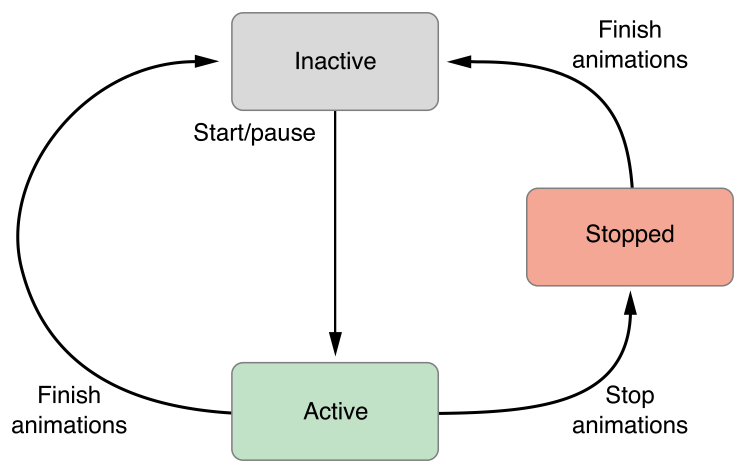
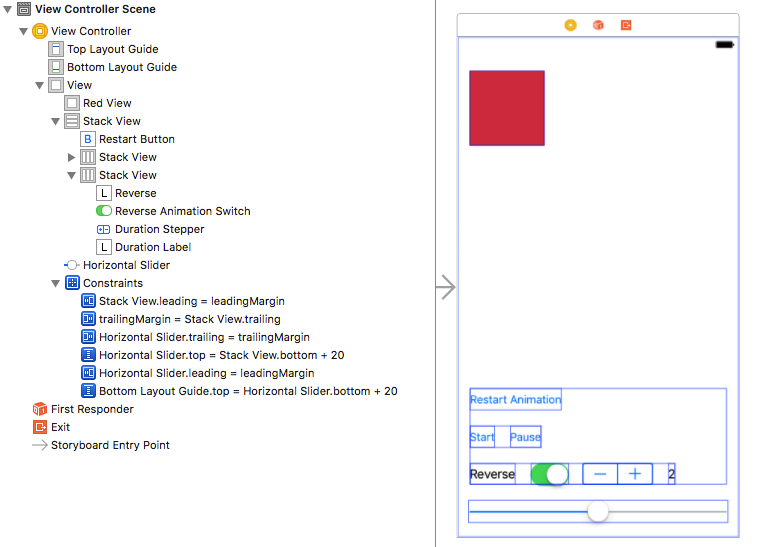
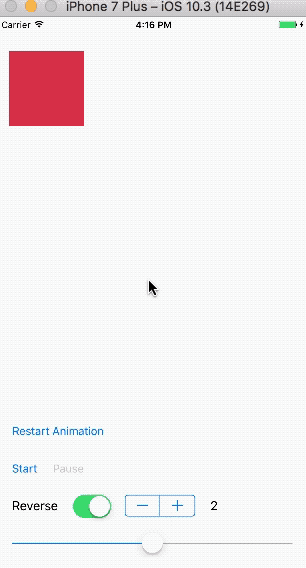
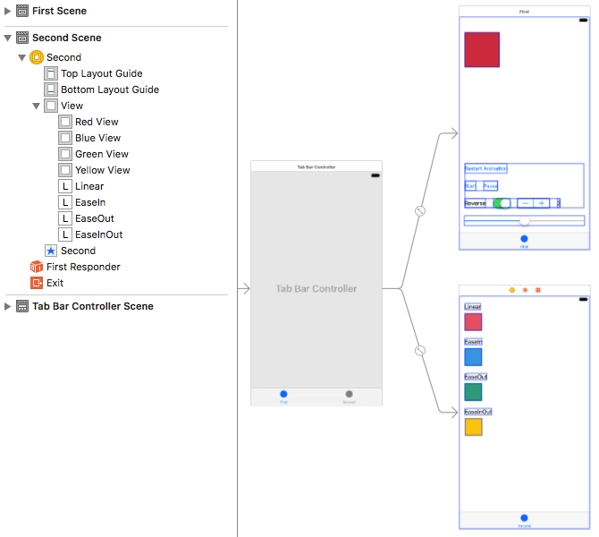
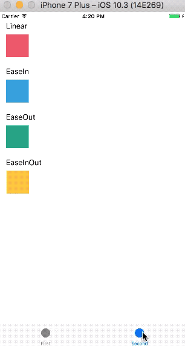
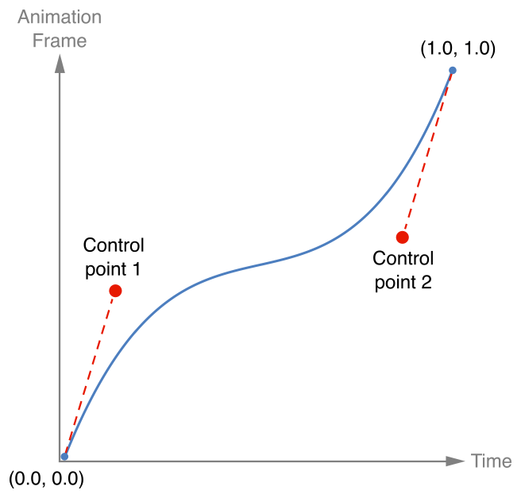
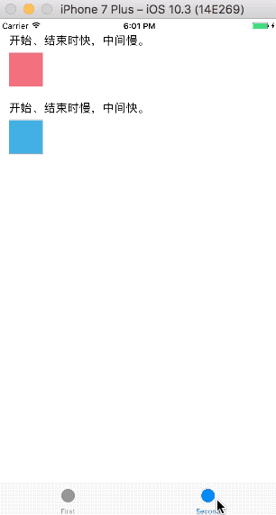
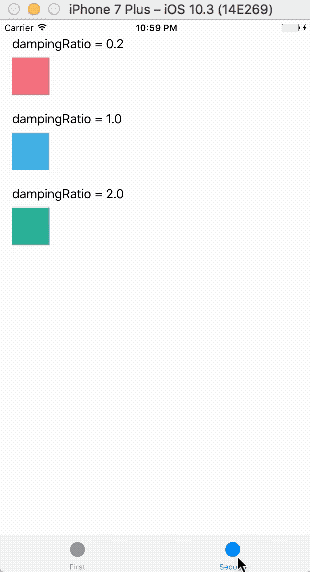

在iOS 10之前，执行动画可以使用`UIView`以下三个类方法：

- `animateWithDuration: animations:`
- `animateWithDuration: animations: completion:`
- `animateWithDuration: delay: options: animations: completion:` 

上面创建动画块(animations: )的均是类方法，所以这些动画块没有绑定任何视图。因此，可以使用这些方法创建一个单一的动画，应用于多个视图。

下面代码演示了在1秒钟内淡出`firstView`、淡入`secondView`的操作。

```
    [UIView animateWithDuration:1.0 animations:^{
        self.firstView.alpha = 0.0;
        self.secondView.alpha = 1.0;
    }];
```

使用上述类方法操纵动画过程中，`firstView`和`secondView`两个视图将暂时禁用用户交互，即用户不能与正在运行动画的视图交互。如果想要实现更复杂的功能，需要使用`CoreAnimation`框架。虽然使用`CoreAnimation`框架可以对动画进行暂停、恢复、停止等操作，但会产生大量代码，需要大量工作，可以使用[pop](https://github.com/facebook/pop)一类的第三方库。

## 1. UIViewPropertyAnimator

在iOS 10，Apple在`UIKit`中增加了`UIViewPropertyAnimator`类，使用该类实现的动画可以在结束前进行暂停、恢复、停止等操作。`UIViewPropertyAnimator`类对象通过操作视图的属性来产生所需动画，但不是所有属性的改变都会产生动画，可产生动画的属性包括`frame`、`center`、`alpha`和`transform`。

`UIViewPropertyAnimator`类遵守了`UIViewAnimating`和`UIViewImplicitlyAnimating`协议。`UIViewAnimating`协议中方法用于控制动画的状态，包括开始`startAnimation`、暂停`pauseAnimation`、结束`stopAnimation: `动画，也有一些属性用于反映当前动画状态。动画运行时，这些状态随之更新。`UIViewPropertyAnimator`对象（后面称为animator)在处理动画期间会经历`UIViewAnimatingStateInactive`、`UIViewAnimatingStateActive`、`UIViewAnimatingStateStopped`不同状态。下图显示了animator状态变化。



Inactive状态是animator的初始状态。每一个新创建的animator均处于inactive状态，animator在动画结束后返回到inactive状态。在非活跃状态配置的动画，其运行持续时间为指定的完整持续时间；使用`addAnimations: `方法添加的动画，添加后立即开始执行，与其它动画同时结束，即运行时间为剩余持续时间，非完整持续时间。

当调用`startAnimation`或`pauseAnimation`方法后，animator变为active状态。处于active状态的animator可能正在运行动画，也可能将动画暂停，以便修改动画。当动画运行到指定位置结束后，animator将返回到inactive状态，以便重新配置动画。

调用`stopAnimation: `方法后，将停止所有正在运行的动画，并将相应视图属性的值更新为调用`stopAnimation: `方法时的值。当`stopAnimation: `参数为`YES`时，animator状态直接改变为`UIViewAnimatingStateInactive`，且不再执行任何动作；当`stopAnimation: `参数为`NO`时，animator状态改变为`UIViewAnimatingStateStopped`，随后，可以调用`finishAnimationAtPosition: `方法执行animator的最终动作。例如，执行completion块。对`finishAnimationAtPosition: `方法的调用不是必须的，也可以在调用`finishAnimationAtPosition: `方法前先执行其它动画。

`UIViewImplicitlyAnimating`协议用于在动画进行过程中修改动画，如添加动画`addAnimations: `、添加completion块`addCompletion: `等。

## 2. 示例1

下面通过一个demo来学习`UIViewPropertyAnimator`。

创建*Single View Application*模板的应用，demo名称为*PropertyAnimator*。在*storyboard*中添加一个`UIView`、三个`UIButton`、两个`UILabel`、一个`UISwitch`、一个`UIStepper`和一个`UISlider`。布局如下：



> 使用Auto Layout、Stack View对视图进行自动布局，通过上图可以看到所添加的约束，其中Stack View的spacing均为`20`。如果你对自动布局不熟悉，可以查看[Auto Layout的使用](https://github.com/pro648/tips/wiki/Auto-Layout%E7%9A%84%E4%BD%BF%E7%94%A8)和[Auto Layout中Stack View的使用](https://github.com/pro648/tips/wiki/Auto-Layout%E4%B8%ADStack-View%E7%9A%84%E4%BD%BF%E7%94%A8)两篇文章。

从*storyboard*向`ViewController.m`添加IBOutlet属性。如下所示：

```
@interface ViewController ()

@property (weak, nonatomic) IBOutlet UIView *redView;
@property (weak, nonatomic) IBOutlet UIButton *restartButton;
@property (weak, nonatomic) IBOutlet UIButton *startStopButton;
@property (weak, nonatomic) IBOutlet UIButton *pauseButton;
@property (weak, nonatomic) IBOutlet UISwitch *reverseAnimationSwitch;
@property (weak, nonatomic) IBOutlet UIStepper *durationStepper;
@property (weak, nonatomic) IBOutlet UILabel *durationLabel;

@end
```

最后再添加以下三个属性。

```
@interface ViewController ()

...
@property (strong, nonatomic) UIViewPropertyAnimator *propertyAnimator;
@property (assign, nonatomic) NSTimeInterval duration;
@property (assign, nonatomic) CGRect startFrame;

@end
```

现在添加一个`setupAnimator`的方法，用于配制动画。

```
- (void)setupAnimator {
    // 1.动画初始位置。
    self.redView.frame = self.startFrame;
    
    // 2.动画终点位置。
    CGFloat margin = 16.0;
    CGFloat screenWidth = CGRectGetWidth(self.view.frame);
    CGFloat finalX = screenWidth - CGRectGetWidth(self.redView.frame) - margin;
    CGRect finalRect = CGRectMake(finalX, self.redView.frame.origin.y, self.redView.frame.size.width, self.redView.frame.size.height);
    
    // 3.初始化动画。
    self.propertyAnimator = [[UIViewPropertyAnimator alloc] initWithDuration:self.duration
                                                                       curve:UIViewAnimationCurveEaseIn
                                                                  animations:^{
                                                                      self.redView.frame = finalRect;
                                                                  }];
    
    // 4.为动画添加完成块。
    ViewController * __weak weakSelf = self;
    ViewController *vc = weakSelf;
    if (vc) {
        [self.propertyAnimator addCompletion:^(UIViewAnimatingPosition finalPosition) {
            [vc.startStopButton setTitle:@"Start" forState:UIControlStateNormal];
            vc.startStopButton.enabled = NO;
            vc.pauseButton.enabled = NO;
            vc.restartButton.enabled = YES;
        }];
    }
    vc = nil;
}
```

在上面的代码中，注释3部分用于初始化动画，其中`initWithDuration: `的参数为动画持续时间；`curve: `参数用来设定动画曲线。这里有以下四种可选曲线：

- UIViewAnimationCurveEaseInOut：这种曲线的动画开始缓慢，在其持续时间的中间加速，然后在完成之前再次减慢。这是大多数动画的默认曲线。
- UIViewAnimationCurveEaseIn：动画开始时缓慢，然后加速，直到动画结束。这里选用这种类型动画曲线。
- UIViewAnimationCurveEaseOut：动画开始时速度很快，在结束前开始减速。
- UIViewAnimationCurveLinear：在动画持续时间内，动画匀速运行。

最后在动画块内配置动画。注释4部分，为动画块添加完成回调函数。这里需要注意避免形成循环引用，使用`__weak`声明的`weakSelf`替代`self`，因为块内多次用到`weakSelf`，可能在第一次调用`weakSelf`时`weakSelf`存在，但后面再次调用`weakSelf`时，`weakSelf`已被释放，所以这里再次将其转换为强引用类型`vc`，不再需要`vc`时，需要手动释放。

> 想要了解更多关于块的用法，查看[Block的用法](https://github.com/pro648/tips/wiki/Block%E7%9A%84%E7%94%A8%E6%B3%95)一文。

从*storyboard*中选中`UIStepper`控件，拖拽到代码中，以添加响应事件。

```
- (IBAction)stepperValueChanged:(UIStepper *)sender {
    // 1.设置动画持续时间为UIStpper的值。
    self.duration = sender.value;
    
    // 2.同步更新到label。
    self.durationLabel.text = [NSString stringWithFormat:@"%.1f",sender.value];
}
```

上述代码用于设定动画持续时间。

在*storyboard*中选中*Start*按钮，拖拽到`ViewController.m`实现部分，以添加响应事件，响应事件方法名称为`startStopPause`。在*storyboard*中选中*Pause*按钮，也拖拽到`startStopPause: `响应事件，以便在点击*Start*或*Pause*任一按钮时，均调用`startStopPause: `方法。

```
- (IBAction)startStopPause:(UIButton *)sender {
    // 1.禁用restartButton，propertyAnimator不存在时，配置propertyAnimator。
    self.restartButton.enabled = NO;
    if (!self.propertyAnimator) {
        [self setupAnimator];
    }
    
    if (sender == self.pauseButton) {
        // 2.点击Pause按钮时，根据当前动画状态更新视图。
        self.propertyAnimator.isRunning ? [self.propertyAnimator pauseAnimation] : [self.propertyAnimator startAnimation];
        NSString *title = self.propertyAnimator.isRunning ? @"Pause" : @"Unpause";
        [self.pauseButton setTitle:title forState:UIControlStateNormal];
        self.startStopButton.enabled = self.propertyAnimator.isRunning;
    }
    else
    {
        // 3.点击Start按钮时，根据当前动画状态更新视图。
        switch (self.propertyAnimator.state) {
            case UIViewAnimatingStateInactive:
                [self.propertyAnimator startAnimation];
                [self.startStopButton setTitle:@"Stop" forState:UIControlStateNormal];
                self.pauseButton.enabled = YES;
                NSLog(@"UIViewAnimatingStateInactive");
                break;
                
            case UIViewAnimatingStateActive:
                if (self.propertyAnimator.isRunning) {
                    [self.propertyAnimator stopAnimation:NO];
                    [self.propertyAnimator finishAnimationAtPosition:UIViewAnimatingPositionCurrent];
                    [self.startStopButton setTitle:@"Start" forState:UIControlStateNormal];
                    self.pauseButton.enabled = NO;
                }
                else
                {
                    [self.propertyAnimator startAnimation];
                    [self.startStopButton setTitle:@"Stop" forState:UIControlStateNormal];
                    self.pauseButton.enabled = YES;
                }
                NSLog(@"UIViewAnimatingStateActive");
                break;
                
            case UIViewAnimatingStateStopped:
                NSLog(@"UIViewAnimatingStateStopped");
                break;
                
            default:
                break;
        }
    }
}
```

上面代码根据所点击的按钮，进行不同的响应操作。当点击的是*Start*按钮时，根据`propertyAnimator`所处的状态执行不同操作。

从*storyboard*中拖拽`UISwitch`控件到代码中，以创建响应事件。

```
- (IBAction)reverseAnimationSwitchValueChanged:(UISwitch *)sender {
    if (self.propertyAnimator && self.propertyAnimator.isRunning) {
        // 在propertyAnimator存在，且正在运行时，根据UISwitch的值调整propertyAnimator的方向。
        self.propertyAnimator.reversed = sender.isOn;
    }
}
```

从*storyboard*中拖拽*Restart Animation*按钮到代码中，以创建响应事件。

```
- (IBAction)restartAnimation:(UIButton *)sender {
    // 点击RestartAnimation按钮时，重新配置动画，启用Start按钮，将reverseAnimationSwitch设置为关闭状态。
    [self setupAnimator];
    self.startStopButton.enabled = YES;
    self.reverseAnimationSwitch.on = NO;
}
```

可以通过为`fractionComplete`属性赋值，设置动画进度百分比。从*storyboard*中拖拽`UISlider`控件到代码中，创建响应事件。

```
- (IBAction)scrubAnimation:(UISlider *)sender {
    if (!self.propertyAnimator) {
        [self setupAnimator];
    }
    
    // 1.当propertyAnimator正在运行时，暂停该动画，否则在停止拖动UISlider后，动画会继续运行。
    if (self.propertyAnimator.isRunning) {
        [self.propertyAnimator pauseAnimation];
    }
    
    // 2.设置动画百分比。
    self.propertyAnimator.fractionComplete = sender.value;
}
```

最后，记得设置`startFrame`位置、`pauseButton`初始状态。

```
- (void)viewDidLoad {
    [super viewDidLoad];
    
    // 设置startFrame位置，pauseButton状态。
    self.startFrame = CGRectMake(16, 45, 100, 100);
    self.pauseButton.enabled = NO;
}
```

现在运行demo，效果如下。



## 3. 示例2

`UIViewPropertyAnimator`除了可以使用原有的`UIViewAnimationCurve`时间曲线函数，还新增了`UISpringTimingParameters`、`UICubicTimingParameters`两个时间曲线函数。

添加*Cocoa Touch Class*模版的文件，其父类为`UIViewController`，名称为`TimingCurvesViewController`。在*storyboard*中添加`UIViewController`，并设置其父类为`TimingCurvesViewController`。

在刚添加的视图控制器上添加四个`UIView`、四个`UILabel`。同时选中两个视图控制器，添加`UITabBarController`，如下所示：



为`TimingCurvesViewController`上的`UIView`创建IBOutlet连接，并添加以下几个属性。

```
#import "TimingCurvesViewController.h"

@interface TimingCurvesViewController ()

@property (weak, nonatomic) IBOutlet UIView *redView;
@property (weak, nonatomic) IBOutlet UIView *blueView;
@property (weak, nonatomic) IBOutlet UIView *greenView;
@property (weak, nonatomic) IBOutlet UIView *yellowView;
@property (assign, nonatomic) CGRect redStartFrame;
@property (assign, nonatomic) CGRect blueStartFrame;
@property (assign, nonatomic) CGRect greenStartFrame;
@property (assign, nonatomic) CGRect yellowStartFrame;
@property (strong, nonatomic) UIViewPropertyAnimator *redAnimator;
@property (strong, nonatomic) UIViewPropertyAnimator *blueAnimator;
@property (strong, nonatomic) UIViewPropertyAnimator *greenAnimator;
@property (strong, nonatomic) UIViewPropertyAnimator *yellowStartAnimator;
@property (strong, nonatomic) NSTimer *timer;
@property (assign, nonatomic) NSTimeInterval durationOfAnimation;

@end
```

在`TimingCurvesViewController.m`的`viewDidLoad`方法中，设置四个`UIView`的初始位置和`durationOfAnimation`值。

```
- (void)viewDidLoad {
    [super viewDidLoad];
    
    // 1.设置UIView初始位置。
    self.redStartFrame = CGRectMake(16, 50, squareSize, squareSize);
    self.blueStartFrame = CGRectMake(16, 150, squareSize, squareSize);
    self.greenStartFrame = CGRectMake(16, 250, squareSize, squareSize);
    self.yellowStartFrame = CGRectMake(16, 350, squareSize, squareSize);
    
    // 2.为durationOfAnimation赋初始值2.0。
    self.durationOfAnimation = 2.0;
}
```

### 3.1 UIViewAnimationCurve

UIViewAnimationCurve时间曲线函数分为`UIViewAnimationCurveEaseInOut`、`UIViewAnimationCurveEaseIn`、`UIViewAnimationCurveEaseOut`和`UIViewAnimationCurveLinear`四种。

在`TimingCurvesViewController.m`实现部分添加以下代码来使用上述四种时间曲线。

```
// Default Curves
- (void)startAnimationsWithDefaultCurves {
    // 1.四个视图使用不同类型时间曲线函数。
    self.redAnimator = [self animatorForView:self.redView startFrame:self.redStartFrame curve:UIViewAnimationCurveLinear];
    self.blueAnimator = [self animatorForView:self.blueView startFrame:self.blueStartFrame curve:UIViewAnimationCurveEaseIn];
    self.greenAnimator = [self animatorForView:self.greenView startFrame:self.greenStartFrame curve:UIViewAnimationCurveEaseOut];
    self.yellowAnimator = [self animatorForView:self.yellowView startFrame:self.yellowStartFrame curve:UIViewAnimationCurveEaseInOut];
}

- (UIViewPropertyAnimator *)animatorForView:(UIView *)view startFrame:(CGRect)startFrame curve:(UIViewAnimationCurve)curve {
    // 2.视图初始位置，动画结束时视图位置。
    view.frame = startFrame;
    CGRect finalRect = [self finalRectWithStartFrame:startFrame];
    
    // 3.配置动画。
    UIViewPropertyAnimator *animator = [[UIViewPropertyAnimator alloc] initWithDuration:self.durationOfAnimation curve:curve animations:^{
        view.frame = finalRect;
    }];
    return animator;
}

#pragma mark Help Methods

- (CGRect)finalRectWithStartFrame:(CGRect)startFrame {
    // 4.计算出动画结束时位置。
    CGFloat margin = 16;
    CGFloat screenWidth = CGRectGetWidth(self.view.frame);
    CGFloat finalX = screenWidth - margin - squareSize;
    CGRect finalRect = CGRectMake(finalX, startFrame.origin.y, squareSize, squareSize);
    return finalRect;
}
```

上述代码非常简单，在注释1部分使用`UIViewAnimationCurveLinear`、`UIViewAnimationCurveEaseIn`、`UIViewAnimationCurveEaseOut`和`UIViewAnimationCurveEaseInOut`四种时间曲线。注释4的方法后面会多次用到。

在`TimingCurvesViewController.m`实现部分添加`viewDidAppear: `方法，用定时器触发动画。

```
- (void)viewDidAppear:(BOOL)animated {
    [super viewDidAppear:animated];
    
    // 1.在1.5倍durationOfAnimation时间后，触发动画。
    self.timer = [NSTimer scheduledTimerWithTimeInterval:self.durationOfAnimation*1.5 repeats:YES block:^(NSTimer * _Nonnull timer) {
        // 2.动画使用默认时间曲线函数。
        [self startAnimationsWithDefaultCurves];
        
        // 启动动画。
        [self.redAnimator startAnimation];
        [self.blueAnimator startAnimation];
        [self.greenAnimator startAnimation];
        [self.yellowAnimator startAnimation];
    }];
}
```

如果使用标准方法（initWith方法）创建动画，必须通过调用`startAnimation`方法开始动画；如果想要创建动画后立即开始执行动画，请使用`runningPropertyAnimatorWithDuration: delay: options: animations: completion: `方法。

运行demo，如下所示：



通过上面代码可以看到：

- UIViewAnimationCurveEaseInOut：这种曲线的动画开始缓慢，在其持续时间的中间加速，然后在完成之前再次减慢。这是大多数动画的默认曲线。
- UIViewAnimationCurveEaseIn：动画开始时缓慢，然后加速，直到动画结束。
- UIViewAnimationCurveEaseOut：动画开始时速度很快，在结束前开始减速。
- UIViewAnimationCurveLinear：在动画持续时间内，动画匀速运行。

### 3.2 UICubicTimingParameters

`UICubicTimingParameters`允许通过多个控制点来定义三阶贝塞尔曲线，该贝塞尔时间曲线起点为(0,0)，终点为(1,1)，曲线形状由两个控制点决定。每个时间点线的斜率定义了此时动画速度。曲线越陡峭，动画运行速度越快；曲线越平缓，动画运行速度越慢。

下图的时间曲线表示动画在开始和结束时速度很快，中间运行较慢。



> 控制点范围为0.0至1.0。

`UICubicTimingParameters`遵守`UITimingCurveProvider`协议，为遵守`UIViewAnimating`协议的对象提供时间曲线（timing curves），如`UIViewPropertyAnimator`。

继续更新`TimingCurvesViewController.m`内代码，使用`UICubicTimingParameters`作为动画时间参数。

```
- (void)viewDidAppear:(BOOL)animated {
    [super viewDidAppear:animated];
    
    // 1.在1.5倍durationOfAnimation时间后，触发动画。
    self.timer = [NSTimer scheduledTimerWithTimeInterval:self.durationOfAnimation*1.5 repeats:YES block:^(NSTimer * _Nonnull timer) {
        // 2.动画使用默认时间曲线函数。
//        [self startAnimationsWithDefaultCurves];
        
        // 3.使用UICubicTimingParameters
        [self startAnimationWithCubicCurves];
        
        // 启动动画。
        [self.redAnimator startAnimation];
        [self.blueAnimator startAnimation];
        [self.greenAnimator startAnimation];
        [self.yellowAnimator startAnimation];
    }];
}

// UICubicTimingParameters
- (void)startAnimationWithCubicCurves {
    // 1.中间慢，开始、结尾快。
    UICubicTimingParameters *redCubicTimingParameters = [[UICubicTimingParameters alloc] initWithControlPoint1:CGPointMake(0.45, 1.0) controlPoint2:CGPointMake(0.55, 0)];
    // 2.中间快，开始、结尾慢。
    UICubicTimingParameters *blueCubicTimingParameters = [[UICubicTimingParameters alloc] initWithControlPoint1:CGPointMake(1.0, 0.45) controlPoint2:CGPointMake(0, 0.55)];
    self.redAnimator = [self animatorForView:self.redView startFrame:self.redStartFrame timingParameters:redCubicTimingParameters];
    self.blueAnimator = [self animatorForView:self.blueView startFrame:self.blueStartFrame timingParameters:blueCubicTimingParameters];
}

- (UIViewPropertyAnimator *)animatorForView:(UIView *)view startFrame:(CGRect)startFrame timingParameters:(UICubicTimingParameters *)cubicTimingParameters {
    view.frame = startFrame;
    CGRect finalRect = [self finalRectWithStartFrame:startFrame];
    UIViewPropertyAnimator *animator = [[UIViewPropertyAnimator alloc] initWithDuration:self.durationOfAnimation timingParameters:cubicTimingParameters];
    [animator addAnimations:^{
        view.frame = finalRect;
    }];
    return animator;
}
```

其中，`startAnimationWithCubicCurves`方法内，注释1中的控制点决定动画曲线，动画在中间慢，开始和结尾处快。注释2相反。这里只使用了`redView`和`blueView`两个视图。

运行如下：



### 3.3 UISpringTimingParameters

由`UISpringTimingParameters`提供的时间曲线会让动画行为与弹簧相似。视图会加速向目标点运动，然后围绕该目标点震荡，直到停止。

`UISpringTimingParameters`遵守`UITimingCurveProvider`协议，为遵守`UIViewAnimating`协议的对象提供时间曲线，如`UIViewPropertyAnimator`。`UISpringTimingParameters`一般用于移动屏幕上的视图，也可用于视图的其它属性，以获取类似的动画效果。

继续更新`TimingCurvesViewController.m`内代码，使用`UISpringTimingParameters`作为动画运行时间参数。

```

- (void)viewDidAppear:(BOOL)animated {
    [super viewDidAppear:animated];
    
    // 1.在1.5倍durationOfAnimation时间后，触发动画。
    self.timer = [NSTimer scheduledTimerWithTimeInterval:self.durationOfAnimation*1.5 repeats:YES block:^(NSTimer * _Nonnull timer) {
        // 2.动画使用默认时间曲线函数。
//        [self startAnimationsWithDefaultCurves];
        
        // 3.使用UICubicTimingParameters。
//        [self startAnimationWithCubicCurves];
        
        // 4.使用UISpringTimingParameters。
        [self startAnimationWithSpringCurves];
        
        // 启动动画。
        [self.redAnimator startAnimation];
        [self.blueAnimator startAnimation];
        [self.greenAnimator startAnimation];
        [self.yellowAnimator startAnimation];
    }];
}

// UISpringTimingParameters
- (void)startAnimationWithSpringCurves {
    // dampingRatio值分别为0.2 1.0 2.0。
    CGFloat underDamped = 0.2;
    CGFloat criticalDamped = 1.0;
    CGFloat overDamped = 2.0;
    self.redAnimator = [self animatorForView:self.redView startFrame:self.redStartFrame dampingRatio:underDamped];
    self.blueAnimator = [self animatorForView:self.blueView startFrame:self.blueStartFrame dampingRatio:criticalDamped];
    self.greenAnimator = [self animatorForView:self.greenView startFrame: self.greenStartFrame dampingRatio:overDamped];
}

- (UIViewPropertyAnimator *)animatorForView:(UIView *)view startFrame:(CGRect)startFrame dampingRatio:(CGFloat)dampingRatio {
    view.frame = startFrame;
    CGRect finalRect = [self finalRectWithStartFrame:startFrame];
    UIViewPropertyAnimator *animator = [[UIViewPropertyAnimator alloc] initWithDuration:self.durationOfAnimation dampingRatio:dampingRatio animations:^{
        view.frame = finalRect;
    }];
    return animator;
}
```

另外，也可以使用`initWithMass: stiffness: damping: initialVelocity: `方法，该方法会把阻尼系数（damping）、质量参数（mass）、刚性系数（stiffness）和初始速度（initial velocity）带入给定公式，以获取更为真实的效果。

运行demo，如下所示：



> `UIDynamicAnimator`中的`UISnapBehavior`也可以产生弹簧（spring）效果，`UISnapBehavior`是移动到指定点point，如下图所示。想要全面了解`UIKitDynamicAnimator`，可以查看[一篇文章学会使用UIKit Dynamics](https://github.com/pro648/tips/wiki/%E4%B8%80%E7%AF%87%E6%96%87%E7%AB%A0%E5%AD%A6%E4%BC%9A%E4%BD%BF%E7%94%A8UIKit-Dynamics)。


Demo名称：PropertyAnimator  
源码地址：<https://github.com/pro648/BasicDemos-iOS>

参考资料：

1. [iOS10 – UIViewPropertyAnimator](http://www.swiftification.org/2016/08/04/ios10-uiviewpropertyanimator-tutorial/)
2. [iOS 10 Day by Day :: Day 4 :: UIViewPropertyAnimator](https://www.shinobicontrols.com/blog/ios-10-day-by-day-day-4-uiviewpropertyanimator)
3. [QUICK GUIDE: ANIMATIONS WITH UIVIEWPROPERTYANIMATOR](http://www.thinkandbuild.it/quick-guide-animations-with-uiviewpropertyanimator/)

