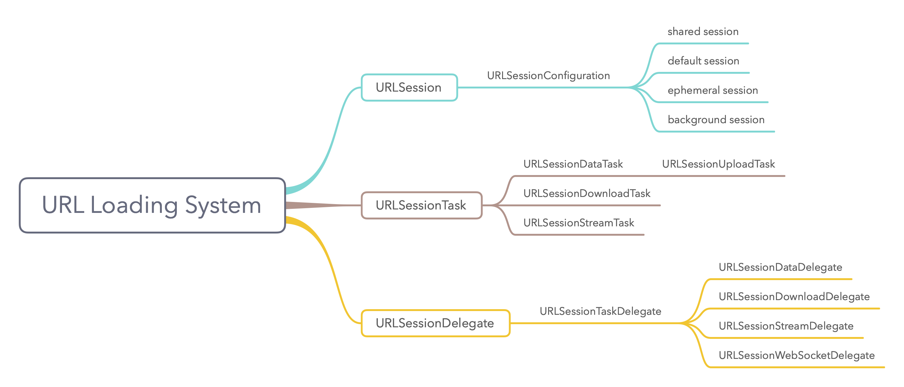
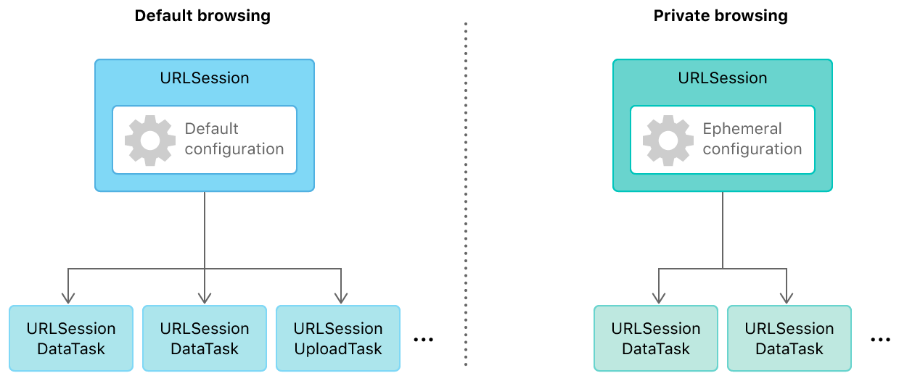
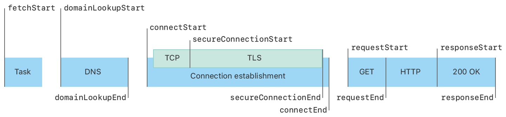
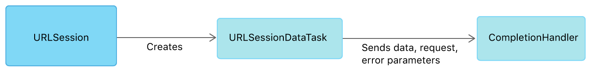
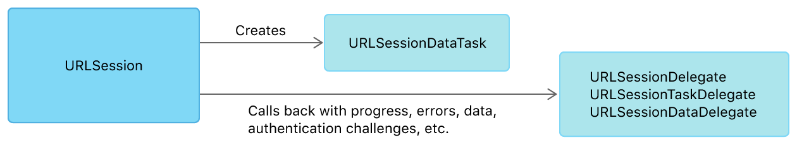
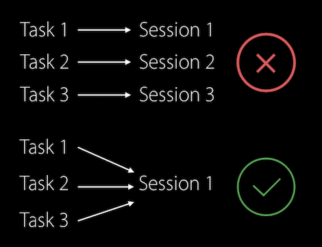

这篇文章介绍了 URL Loading System 相关知识，涉及以下内容：

- `URLSession`类型。
- `URLSessionTask`类型
- `URLSessionDelegate`、`URLSessionTaskDelegate`、`URLSessionDataDelegate`、`URLSessionDownloadDelegate`四种协议。
- 使用`URLSessionDataTask`请求数据。
- 使用`URLSessionDownloadTask`下载、暂停、恢复下载视频。支持断点续传、后台下载，下载完成后自动保存到相册。



URL 加载系统（URL Loading System）使用标准协议（如 https）或自定义协议提供对 URL 标识资源进行访问。URL Loading System 是异步执行的，这样 app 可以保持响应，并在 response 到达时处理数据或错误。

使用`URLSession`实例创建一个或多个`URLSessionTask`实例，`URLSessionTask`实例可以拉取数据并将数据返回到 app、下载文件，或将文件、数据上传到远程服务器。使用`URLSessionConfiguration`对象配置`URLSession`的实例 session（会话），`URLSessionConfiguration`对象可以配置 caches、cookies 策略，以及是否允许使用数据流量等。

可以使用一个 session 重复创建 task。例如，浏览器为正常浏览和无痕模式使用单独的 session，无痕浏览不会保存数据到磁盘。下图显示了具有这些配置的两个 session 如何创建多个 task：



每个 session 关联一个 delegate 以接收定期更新或错误。默认情况下，delegate 调用完成处理程序块；如果提供了自定义的 delegate，则不会调用完成处理程序块。

可以将 session 配置为后台会话，以便在 app 处于非活跃状态时继续下载数据，下载完成后唤醒 app 并提供结果。

## 1. URLSession

配置和创建 session，使用 session 创建 task 并与 URL 交互。

`URLSession`和相关类提供的 API 可以从指定 URL 下载，或上传数据到指定 URL。该 API 允许 app 未运行时执行后台下载。在 iOS 中，允许 app 处于 suspend 状态时继续下载。另外，还提供了一组丰富的委托方法以支持身份验证、重定向通知等。

通过`URLSession` API，可以创建一个或多个 session，每个 session 协调一组数据传输任务。例如，如果你在开发浏览器，可以为每个标签或窗口创建一个会话，也可以一个 session 用于交互、一个 session 用于后台下载。app 向一个 session 添加一系列 task，每个任务代表一个指向特定 URL 的 request。

## 2. URLSessionConfiguration

`URLSessionConfiguration`对象定义了使用`URLSession`上传、下载时要使用的行为和策略。使用`URLSession`时要先创建`URLSessionConfiguration`。`URLSessionConfiguration`对象定义了单个主机最大同时连接数、是否允许通过蜂窝网络进行连接、超时时长和缓存策略等。

在使用配置初始化会话前，必须配置好`URLSessionConfiguration`对象。使用`URLSessionConfiguration`初始化会话时，session 会复制一份`URLSessionConfiguration`对象。一旦配置完成，session 将忽略任务对`URLSessionConfiguration`对象的修改。如果需要改变传输策略，需要更新 session configuration 对象，并用更新后的 session configuration 创建一个新的 session。

> 某些情况下，configuration 指定的策略会被任务的`URLRequest`对象重写。默认采用 request 指定的策略，除非 session 的策略更为严格。例如，sesseion configuration 指定禁止使用蜂窝网络，则`URLRequest`对象不能使用蜂窝网络进行请求。

URL session 的行为和能力很大程度上取决于创建会话的配置。

单例会话（singleton shared session）没有配置对象，一般用于基本请求。单例会话不能像自己创建的会话一样进行配置，但如果需求非常有限，其是一个很好的起点。通过调用`shared`类方法获取单例会话。

#### 2.1 default

Default session 和 shared session 类似，但允许自定义配置，且可以通过 delegate 获取增量数据；默认使用基于磁盘的持久缓存（下载文件除外），并将凭据（credential）保存到用户 keychain，还会将 cookie 保存到共享的 cookie store。通过调用`URLSessionConfiguration`类的`default`方法创建 default session 配置。

#### 2.2 ephemeral

Ephemeral session 与 shared session 类似，但会将 cache、cookie 和 credential 等会话相关数据保存到 RAM，而非写入磁盘。只有在告诉会话将数据写入文件时，ephemeral 类型会话才会将数据写入磁盘。通过调用`NSURLSessionConfiguration`类的`ephemeral`方法创建 ephemeral session 配置。

> 也可以自定义 default configuration 以获得与 ephemeral configuration 相同的功能，但直接使用 ephemeral configuration 更为方便。

使用 ephemeral session 的主要优点在于保护隐私。通过将敏感数据保存到 RAM 取代写入磁盘，避免数据被拦截、它用。因此，ephemeral session 非常适合浏览器无痕浏览模式。

由于 ephemeral session 不会将缓存数据保存到磁盘，缓存大小会受限于可用 RAM。这一限制决定了可缓存数据大小，也会影响 app 性能。用户退出并重新启动 app，所有缓存会被清空。

App 使会话无效时，将自动清除所有临时会话数据。此外，在 iOS 中，app 处于 suspend 状态时缓存不会被清空；app 终止或内存不足时，可能会清空缓存数据。

#### 2.3 background

Background session 允许 app 未活跃时执行 HTTP 和 HTTPS 上传、下载任务。Background session 将下载任务提交给系统，下载会在单独进程执行。

通过调用`URLSessionConfiguration`类的`backgroundSessionConfiguration(_:)`方法创建 background session，Session identifier 需要在 app 内唯一。

iOS app 被系统终止并再次启动后，app 可以使用同一 identifier 创建 configuration、session，用来获取 app 终止时数据传输进度，但只适用于系统终止 app 运行；如果用户从多任务中心终止 app，系统会取消该 app 的所有后台任务，且不会自动唤醒应用。用户手动打开 app 后才可以进行传输任务。

## 3. URLSessionTask

`URLSessionTask`类是 URL 会话任务的基类，task 始终是 session 的一部分。`URLSessionTask`共有以下四个具体类：

- `URLSessionDataTask`：使用`dataTask(with:)`方法创建`URLSessionDataTask`实例，data task 用于请求资源，将服务器的响应作为一个或多个`NSData`对象返回到内存中。Default、ephemeral、shared session 支持`URLSessionDataTask`，background session 不支持`URLSessionDataTask`。

- `URLSessionUploadTask`：使用`uploadTask(with:from:)`方法创建`URLSessionUploadTask`实例，`URLSessionUploadTask`继承自`URLSessionDataTask`。使用`URLSessionUploadTask`可以很方便为 request 提供 body（例如，POST 或 PUT），还可以在收到 response 前上传数据。此外，upload task 支持后台会话。

  > 在 iOS 中，为 background session 创建 upload task 时，系统会将文件复制到临时目录，然后从临时目录上传。

- `URLSessionDownloadTask`：使用`downloadTask(with:)`方法创建`URLSessionDownloadTask`实例，download task 将资源直接下载到磁盘上的文件。Download task 支持任何类型的会话。

- `URLSessionStreamTask`：使用`streamTask(withHostName:port:)`或`streamTask(with:)`方法创建`URLSessionStreamTask`实例。流任务（stream task）从主机、端口或网络服务建立 TCP/IP连接。

创建任务后，调用`resume()`方法启动任务。在任务完成或失败前，session 会强引用 task。如果没有特别用途，不需要维护对任务的引用。

>Task 还有`progress`、`countOfBytesReceived`、`currentRequest`、`response`等属性，且所有属性支持KVO。
>
>如果你对观察者还不熟悉，可以查看我的另一篇文章：[KVC和KVO学习笔记](https://github.com/pro648/tips/wiki/KVC%E5%92%8CKVO%E5%AD%A6%E4%B9%A0%E7%AC%94%E8%AE%B0)

## 4. URLSessionDelegate

`URLSessionDelegate`协议定义了 URL session 实例调用 delegate 处理 session 级事件的方法。例如，session 生命周期改变。

除实现`URLSessionDelegate`协议内方法，大部分 delegate 还需要实现`URLSessionTaskDelegate`、`URLSessionDataDelegate`、`URLSessionDownloadDelegate`中的一个或多个协议，以便处理 task 级事件，例如，task 开始或结束，data task、download task 定期进度更新。

`urlSession(_:didBecomeInvalidWithError:)`方法用以通知 URL session 该 session 已失效。如果通过调用`finishTasksAndInvalidate()`方法使会话无效，会话会在最后一个 task 完成或失败后调用该方法；如果通过调用`invalidateAndCancel()`方法使会话无效，会话立即调用该方法。

`urlSession(_:didReceive:completionHandler:)`方法响应来自远程服务器的会话级身份验证请求。遇到以下两种情况时会调用该方法：

- 远程服务器请求客户端证书，或 Windows NT LAN Manager（NTLM）认证时会调用该方法以提供适当的凭据。
- 当 session 与使用 SSL 或 TLS 的远程服务器首次建立连接时，使用该方法验证服务器的证书链。

如果未实现该方法，session 会调用`URLSessionTaskDelegate`协议中`urlSession(_:task:didReceive:completionHandler:)`方法，采用 task 级认证。

## 5. URLSessionTaskDelegate

`URLSessionTaskDelegate`协议定义了 URL Session 实例调用 delegate 处理 task 级事件的方法。`URLSessionTaskDelegate`继承自`URLSessionDelegate`。

如果你在使用 download task，同时需要实现`URLSessionDownloadDelegate`协议内方法；如果你在使用data task 或 upload task，同时需要实现`URLSessionDataDelegate`协议内方法。

#### 5.1 处理 task 任务生命周期变化

Task 数据传输完成时会调用`urlSession(_:task:didCompleteWithError:)`方法，如果发生错误，则 error 参数会包含失败原因。Error 参数不包含服务端错误，只包含客户端错误。例如无法解析主机名、无法连接主机。

#### 5.2 处理重定向

远程服务器请求 HTTP 重定向时会调用`urlSession(_:task:willPerformHTTPRedirection:newRequest:completionHandler:)`方法。只有 default session 和 ephemeral session 中的 task 会调用该方法，background session 中 task 会直接重定向。

在该方法内必须调用 completion handler。如果允许重定向，为 completion handler 传入 request 参数；如果需要修改重定向，传入修改后的 request 对象；如果禁止重定向，则参数传 nil，此时得到的 response 就是重定向。

#### 5.3 处理 upload task

上传文件时会定期调用`urlSession(_:task:didSendBodyData:totalBytesSent:totalBytesExpectedToSend:)`方法，以提供上传进度。

URL loading system 通过以下三种方式获取 totalBytesExpectedToSend：

- Upload body 中的`NSData`的长度。
- Upload task 中的 upload body 中磁盘文件的长度。
- 如果为 request 显式设置了 Content-Length，则也可以从此获取。

另外，totalBytesSend 和 totalBytesExpectedToSend 参数也可以从`URLSessionTask`的`countOfBytesSend`和`countOfBytesExpectedToSend`属性获取。由于`URLSessionTask`支持`ProgressReporting`，还可以使用 task 的`progress`属性，这样更简洁。

#### 5.4 处理 authentication challenge

`urlSession(_:task:didReceive:completionHandler:)`方法响应服务端身份验证请求，该方法用于处理 task 级验证请求。根据 authentication challenge 类型决定调用 session 级还是 task 级方法处理：

- 当`NSURLProtectionSpace`常量类型为`NSURLAuthenticationMethodNTLM`、`NSURLAuthenticationMethodNegotiate`、`NSURLAuthenticationMethodClientCertificate`、`NSURLAuthenticationMethodServerTrust`类型时，`URLSession`实例调用会话级`urlSession(_:didReceive:completionHandler:)`方法响应；如果 app 没有实现会话级 authentication challenge 方法，`URLSession`实例会调用`URLSessionTaskDelegate`协议的`urlSessoin(_:task:didReceive:completionHandler:)`方法处理挑战（challenge）。
- 对于非会话级 challenge，`URLSession`对象调用`URLSessionTaskDelegate`协议的`urlSession(_:task:didReceive:completionHandler:)`方法响应挑战。如果 app 实现了该方法，则必须在 task 级处理 challenge，或提供一个显式调用会话的任务级完成处理程序。对于非会话级挑战，不会调用`URLSessionDelegate`的`urlSession(_:didReceive:completionHandler:)`方法。

#### 5.5 处理 delayed waiting 

在 iOS 10 中，没有网络时`URLSession`请求会立即失败。iOS 11 中 configuration 增加了 `waitsForConnectivity`属性，其值为 true 时会等有网络了才发起连接。

```
        configuration.timeoutIntervalForResource = 300
        configuration.waitsForConnectivity = true
```

网络连接可能由于多种原因不可用。例如，设备只有数据网络，但`allowsCellularAccess`属性为`NO`；设备需要 VPN，但没有可用 VPN。如果此属性的值为`true`，同时连接不可用，则会话会调用`urlSession(_:taskIsWaitingForConnectivity:)`方法，并等待网络可用。网络可用后任务像往常一样执行。

如果`waitsForConnectivity`属性为`false`，且网络不可用，连接会立即失败，错误为 `NSURLErrorNotConnectedToInternet`。

`waitsForConnectivity`属性只对建立连接过程有效。如果建立连接后失去网络，则会立即失败，错误为 `NSURLErrorNetworkConnectionLost`。

后台会话会忽略`waitsForConnectivity`属性，默认等待连接。

`timeoutIntervalForResource`默认为7天，这里将其设置为5分钟。使用此配置的会话内所有任务资源超时间隔均为300秒。`timeoutIntervalForResource`资源超时间隔指从请求发起至请求完成或超时。

> `timeoutIntervalForRequest`属性决定使用此配置的会话中所有任务的请求超时间隔。请求超时间隔指任务在放弃前等待其他数据到达的时间，单位为秒。当新数据到达时，与该值相关联的定时器将被重置。当计时器达到指定时间间隔而没有接收到任何新数据时触发超时。`timeoutIntervalForRequest`属性默认60秒。

```
    func urlSession(_ session: URLSession, taskIsWaitingForConnectivity task: URLSessionTask) {
        // Waiting for connectivity, update UI, etc.
        print(task.currentRequest?.url?.absoluteString ?? "")
    }
```

可以使用该方法更新 UI。例如，显示呈现离线模式、仅蜂窝网络模式。每个任务最多调用一次此方法，并且仅在建立连接不可用时调用。后台会话不会调用该方法，因为后台会话会忽略`waitsForConnectivity`属性。

#### 5.6 采集数据

收集完毕 task 的指标（metrics）会调用`urlSession(_:task:didFinishCollecting:)`方法。该方法的 metrics 参数封装了 session task 的指标。

每个`URLSessionTaskMetrics`对象都包含`taskInterval`和`redirectCount`，以及任务执行过程中进行的每个 request、response 交互。

`URLSessionTaskMetrics`类包含以下三个属性：

- taskInterval：任务发起至任务完成的时间。
- redirectCount：任务执行过程中重定向次数。
- transactionMetrics：数组内元素为任务执行期间每个 request-response 事务度量标准。元素类型为`URLSessionTaskTransactionMetrics`。

`URLSessionTaskTransactionMetrics`对象封装执行会话任务期间收集的性能指标。每个`URLSessionTaskTransactionMetrics`对象包含了一个 request 和 response 属性，对应于 task 的 request 和 response。其也包含时间指标（temporal metrics），以`fetchStartDate`开始，以`responseEndDate`结束，以及其他特性，例如：`networkProtocolName`和`resourceFetchType`。

下图显示了URL会话任务的事件序列，这些事件对应于`URLSessionTaskTransactionMetrics`捕获的时间指标。



对于具有开始日期和结束日期的所有指标，如果任务的某个方面未完成，则相应指标结束日期为 nil。在解析域名时，操作超时、失败，或客户端在解析成功前取消了任务，则可能发生这种情况。在此情况下，`domainLookupEndDate`属性为 nil，其后所有指标均为 nil。

```
    func urlSession(_ session: URLSession, task: URLSessionTask, didFinishCollecting metrics: URLSessionTaskMetrics) {
        print("metrics: \(metrics.transactionMetrics)")
    }
```

输出如下：

```
metrics: [(Request) <NSURLRequest: 0x6000004e1730> { URL: https://audio-ssl.itunes.apple.com/itunes-assets/AudioPreview118/v4/ae/b9/f4/aeb9f43d-4bf2-3468-7163-d067ea0e38cb/mzaf_5189374696281070786.plus.aac.p.m4a }
(Response) <NSHTTPURLResponse: 0x60000066daa0> { URL: https://audio-ssl.itunes.apple.com/itunes-assets/AudioPreview118/v4/ae/b9/f4/aeb9f43d-4bf2-3468-7163-d067ea0e38cb/mzaf_5189374696281070786.plus.aac.p.m4a } { Status Code: 200, Headers {
    "Accept-Ranges" =     (
        bytes
    );
    "Access-Control-Allow-Origin" =     (
        "*"
    );
    "Cache-Control" =     (
        "public, max-age=1296000"
    );
    "Content-Length" =     (
        1134323
    );
    "Content-Type" =     (
        "audio/x-m4a"
    );
    Date =     (
        "Sat, 21 Sep 2019 03:34:49 GMT"
    );
    Etag =     (
        "\"4960EBB73736A6F72AF3281A6A757CE1\""
    );
    "Last-Modified" =     (
        "Tue, 30 Oct 2018 20:22:39 GMT"
    );
    "access-control-allow-credentials" =     (
        false
    );
    "access-control-allow-headers" =     (
        range,
        range
    );
    "access-control-allow-methods" =     (
        "HEAD, GET, PUT"
    );
    "access-control-max-age" =     (
        3000
    );
    cdnuuid =     (
        "bd23a6ea-a182-4f5c-b93c-92f2d7bd9b95-280232078"
    );
    "x-apple-ms-content-length" =     (
        1134323
    );
    "x-apple-request-uuid" =     (
        "e882fdc4-336e-4417-ac38-7c414c88d6c8",
        "e882fdc4-336e-4417-ac38-7c414c88d6c8"
    );
    "x-cache" =     (
        "TCP_MISS from a23-210-215-36.deploy.akamaitechnologies.com (AkamaiGHost/9.8.2-27247474) (-)"
    );
    "x-cache-remote" =     (
        "TCP_MISS from a23-210-215-166.deploy.akamaitechnologies.com (AkamaiGHost/9.8.0.1-27187836) (-)",
        "TCP_HIT from a23-210-215-166.deploy.akamaitechnologies.com (AkamaiGHost/9.8.0.1-27187836) (-)"
    );
    "x-icloud-availability" =     (
        "[DL, L, B]"
    );
    "x-icloud-content-length" =     (
        1134323
    );
    "x-icloud-versionid" =     (
        "8c4145e0-dc81-11e8-b031-248a071e6524"
    );
    "x-responding-server" =     (
        "massilia_protocol_020:620000704:qs36p01if-zteh13063901.qs.if.apple.com:8083:19R7:nocommit"
    );
} }
(Fetch Start) 2019-09-21 03:34:48 +0000
(Domain Lookup Start) 2019-09-21 03:34:48 +0000
(Domain Lookup End) 2019-09-21 03:34:48 +0000
(Connect Start) 2019-09-21 03:34:48 +0000
(Secure Connection Start) 2019-09-21 03:34:49 +0000
(Secure Connection End) 2019-09-21 03:34:49 +0000
(Connect End) 2019-09-21 03:34:49 +0000
(Request Start) 2019-09-21 03:34:49 +0000
(Request End) 2019-09-21 03:34:49 +0000
(Response Start) 2019-09-21 03:34:50 +0000
(Response End) 2019-09-21 03:34:53 +0000
(Protocol Name) h2
(Proxy Connection) NO
(Reused Connection) NO
(Fetch Type) Network Load
]
```

可以使用上述方法查看请求各阶段所占用的时间，优化性能。

## 6. URLSessionDataDelegate

`URLSessionDataDelegate`协议定义了 URL session 实例处理 data task、upload task 任务级事件方法。`URLSessionDataDelegate`继承自`URLSessionTaskDelegate`协议。

如果需要处理所有 task 类型共有的 task 级事件，还需要实现`URLSessionTaskDelegate`协议内方法；如果需要处理 session 级事件，则需要实现`URLSessionDelegate`协议内方法。

Data task 接收到服务器的初始回复（header）时，会调用`urlSession(_:dataTask:didReceive:completionHandler:)`方法，该方法可选实现，只有在接收到 response header 后需要取消任务，或将任务转变为 download task 时才需要实现该方法。未实现该方法时，默认允许继续传输数据。

如果需要支持相当复杂的 multipart / x-mixed-replace 内容类型，则需实现`urlSession(_:dataTask:didReceive:completionHandler:)`方法。在该方法内，为 completionHandler 传入`URLSession.ResponseDisposition`常量。该常量有以下三个值：

- `URLSession.ResponseDisposition.allow`：任务继续作为 data task 执行。
- `URLSession.ResponseDisposition.cancel`：取消任务。
- `URLSession.ResponseDisposition.becomeDownload`：调用`urlSession(_:dataTask:didBecome:)`方法，创建一个 download task 取代当前的 data task。

Data task 接收到数据时会调用`urlSession(_:dataTask:didReceive:)`方法。该方法可能被调用多次，每次调用提供上次调用后的数据，你的 app 负责将所需数据拼接起来。

Data task 或 upload task 在接收完所有数据后会调用`urlSession(_:dataTask:willCacheResponse:completionHandler:)`方法，以决定是否将响应存储到缓存中。如果没有实现该方法，则根据会话的 configuration 决定是否保存。该方法的主要用途在于阻止指定 URL 缓存响应，或修改缓存的 userInfo 字典。实现该方法后必须调用 completionHandler，传入 proposed response 或修改后的 response 缓存数据，或`nil`禁止缓存 response。

只有在`URLProtocol`协议允许缓存 response 时，才会调用该方法。下面所有条件均成立时才会缓存响应：

- 请求是 HTTP 或 HTTPS 类型，也可以是支持缓存的自定义网络协议。
- 请求成功，即状态码在200至299区间。
- response 来自服务器，而非缓存。
- 会话配置允许缓存。
- `URLRequest`缓存策略允许缓存。
- 服务器响应中与缓存相关的 header 允许缓存。
- 响应大小足够小，能够进行缓存。例如，如果提供磁盘缓存，则响应不得大于磁盘缓存大小的5%。

## 7. URLSessionDownloadDelegate

`URLSessionDownloadDelegate`协议定义了 URL session 实例处理 download task 任务级事件方法。`URLSessionDownloadDelegate`继承自`URLSessionTaskDelegate`协议。

## 8. 使用完成处理程序接收数据

获取数据最简单的方法是创建 data task，并用 completion handler 处理数据。task 会将服务器的 response、data及可能的错误传递给 completion handler。

下图显示了 session 与 task 关系，以及如何将结果传递给 completion handler。



使用`dataTask(with:)`方法创建使用完成处理程序的 data task。完成处理程序需要处理以下三件事情：

1. 验证 error 参数是否为 nil。如果不为 nil，则传输时发生错误。此时应处理错误并退出。
2. 检查响应的状态码（status code）是否指示成功，以及 MIME 类型是否为预期值。如果不符合，处理服务器错误并退出。
3. 根据需要使用返回的 data。

下面的代码使用 iTunes Search API 搜索音乐：

```
    func getSearchResult(searchTerm: String, completion: @escaping QueryResult) {
        dataTask?.cancel()
        
        if var urlComponents = URLComponents(string: "https://itunes.apple.com/search") {
            urlComponents.query = "media=music&entity=song&term=\(searchTerm)"
            
            guard let url = urlComponents.url else {
                return
            }
            
            dataTask = URLSession.shared.dataTask(with: url, completionHandler: { [weak self] (data, response, error) in
                defer {
                    self?.dataTask = nil
                }
                
                if let error = error {
                    print("DataTask error: " + error.localizedDescription + "\n")
                    return
                }
                
                guard let httpResponse = response as? HTTPURLResponse,
                    (200...299).contains(httpResponse.statusCode),
                    let mimeType = httpResponse.mimeType,
                    mimeType == "text/javascript" else {
                        print("Status code or mime type error \n")
                        return
                }
                
                if let data = data {
                    // 处理数据
                    ...
                    
                    DispatchQueue.main.async {
                        // 更新UI
                        ...
                    }
                }
            })
            
            dataTask?.resume()
        }
    }
```

Completion handler 在 [Grand Central Dispatch](https://github.com/pro648/tips/wiki/Grand-Central-Dispatch%E7%9A%84%E4%BD%BF%E7%94%A8) 其他队列调用，与创建 task 队列不同。如果需要更新 UI，需切换至主队列。

可以在[github.com/pro648/BasicDemos-iOS](https://github.com/pro648/BasicDemos-iOS/tree/master/URLSession)下载这篇文章的demo。运行后如下：


## 9. 通过 delegate 接收数据传递详情和结果

为了更细粒度获取任务执行信息，在创建 task 时可以为 session 设置 delegate，而非使用完成处理程序。



使用上述方法，数据到达时会传递给`URLSessionDataDelegate`协议的`urlSession(_:dataTask:didReceive:)`方法，直到传输完成或失败。传输过程中 delegate 也会收到其他类型事件。

下面的代码使用URLSessionDataDelegate接收数据，且只缓存 itunes.apple.com 相关域名的 response。

```
    var receivedData: Data?
    
    func getSearchResult(searchTerm: String) {
        if var urlComponents = URLComponents(string: "https://itunes.apple.com/search") {
            urlComponents.query = "media=music&entity=song&term=\(searchTerm)"
            
            guard let url = urlComponents.url else {
                return
            }
            
            receivedData = Data()
            let task = session.dataTask(with: url)
            task.resume()
        }
    }
    
    // delegate methods
    
    func urlSession(_ session: URLSession, dataTask: URLSessionDataTask, didReceive response: URLResponse,
                    completionHandler: @escaping (URLSession.ResponseDisposition) -> Void) {
        guard let response = response as? HTTPURLResponse,
            (200...299).contains(response.statusCode),
            let mimeType = response.mimeType,
            mimeType == "text/html" else {
                completionHandler(.cancel)
                return
        }
        completionHandler(.allow)
    }
    
    func urlSession(_ session: URLSession, dataTask: URLSessionDataTask, didReceive data: Data) {
        self.receivedData?.append(data)
    }
    
    func urlSession(_ session: URLSession, task: URLSessionTask, didCompleteWithError error: Error?) {
        DispatchQueue.main.async {
            if let error = error {
                handleClientError(error)
            } else if let receivedData = self.receivedData,
                // 处理接收到的数据
            }
        }
    }
    
    func urlSession(_ session: URLSession, dataTask: URLSessionDataTask, willCacheResponse proposedResponse: CachedURLResponse, completionHandler: @escaping (CachedURLResponse?) -> Void) {
        if proposedResponse.response.url?.host == "itunes.apple.com" {	// 只缓存itunes.apple.com 相关域名的 response
            completionHandler(proposedResponse)
        } else {
            completionHandler(nil)
        }
    }
```

在实践中切勿使用一个 session 对应一个 task 的模型，应该使用一个 session 多个 task。这样有助于提高性能，更好管理内存使用。



## 10. 将数据下载到文件系统

对于已存储为文件（如图片和文稿）的网络资源，可以使用 download task 直接将这些资源提取到本地文件系统。

#### 10.1 简单下载使用完成处理程序接收数据

要下载文件，从`NSURLSession`创建`NSURLSessionDownloadTask`对象。如果下载过程中不需要接收下载进度，也无需处理委托回调，则可以使用完成处理程序。任务下载完成或失败时会调用完成处理程序。

完成处理程序可能收到客户端错误，用以指示本地问题。如果没有收到 client error，则会收到`URLResponse`，此时应检查确认是否为成功的请求，且内容类型符合预期。

如果下载成功，completion handler 会提供下载的文件在文件系统的临时路径。该存储是临时的，如果需要保存文件，则必须将文件复制、移动到其它目录。

> 如果你对文件系统还不了解，可以查看我的另一篇文章：[使用NSFileManager管理文件系统](https://github.com/pro648/tips/wiki/%E4%BD%BF%E7%94%A8NSFileManager%E7%AE%A1%E7%90%86%E6%96%87%E4%BB%B6%E7%B3%BB%E7%BB%9F)

下面的代码创建了一个 download task，使用 completion handler 接收数据。下载成功后，将文件移动到 cacheDirectory 目录。

```
    override func viewDidLoad() {
        super.viewDidLoad()
        // Do any additional setup after loading the view.
        
        download(remoteURL: URL(string: "https://devstreaming-cdn.apple.com/videos/streaming/examples/img_bipbop_adv_example_ts/master.m3u8")!)
    }
    
    func download(remoteURL: URL) {
        let downloadTask = URLSession.shared.downloadTask(with: remoteURL) { (location, response, error) in
            if let error = error {
                print("error" + error.localizedDescription)
                return
            }
            
            guard let httpURLResponse = response as? HTTPURLResponse,
                (200...299).contains(httpURLResponse.statusCode) else {
                    print("server error")
                    return
            }
            
            guard let mimeType = httpURLResponse.mimeType,
                mimeType == "audio/mpegurl" else {
                    print("mimeType is not audio/mpegurl")
                    return
            }
            
            guard let location = location else {
                return
            }
            
            do {
                let documentsURL = try FileManager.default.url(for: .cachesDirectory, in: .userDomainMask, appropriateFor: nil, create: false)
                let savedURL = documentsURL.appendingPathComponent(location.lastPathComponent)
                try FileManager.default.moveItem(at: location, to: savedURL)
            } catch {
                print("file error: \(error)")
            }
        }
        
        downloadTask.resume()
    }
```

#### 10.2 使用 delegate 接收下载进度更新

如果想要接收进度更新，必须使用 delegate，实现`URLSessionTaskDelegate`、`URLSessionDownloadDelegate`协议内方法。

创建`URLSession`实例，设置 delegate。下面代码显示了一个懒惰实例化的 downloadsSession 属性，该属性将 self 设置为其委托。

```
    lazy var downloadsSession: URLSession = {
        let configuration = URLSessionConfiguration.default
        return URLSession(configuration: configuration, delegate: self, delegateQueue: nil)
    }()
```

想要开始下载文件，使用`downloadsSession`创建`URLSessionDownloadTask`，调用`resume()`开始下载。

```
    func startDownload(_ track: Track) {
        let download = MusicItem(track: track)
        download.task = downloadsSession.downloadTask(with: track.previewURL)
        download.task?.resume()
        download.isDownloading = true
        activeDownloads[download.track.previewURL] = download
    }
```

##### 10.2.1 接收进度更新

下载开始后，通过`URLSessionDownloadDelegate`中的`urlSession(_:downloadTask:didWriteData:totalBytesWritten:totalBytesWritten:totalBytesExpectedToWrite:)`方法获取进度更新，可以使用该函数中的回调更新下载进度的UI。

下面的代码演示了如何实现该回调方法。在该方法内计算进度百分比，用以更新 UI。需要注意的是，在未知的 Grand Central Dispatch 队列中调用该方法，更新 UI 时必须切换到主队列：

```
    func urlSession(_ session: URLSession, downloadTask: URLSessionDownloadTask, didWriteData bytesWritten: Int64, totalBytesWritten: Int64, totalBytesExpectedToWrite: Int64) {
        guard let url = downloadTask.originalRequest?.url,
            let download = downloadService.activeDownloads[url] else {
                return
        }
        
        download.progress = Float(totalBytesWritten) / Float(totalBytesExpectedToWrite)
        let totalSize = ByteCountFormatter.string(fromByteCount: totalBytesExpectedToWrite, countStyle: .file)
        
        DispatchQueue.main.async {
            if let trackCell = self.tableView.cellForRow(at: IndexPath(row: download.track.index,
                                                                       section: 0)) as? TrackCell {
                trackCell.updateDisplay(progress: download.progress, totalSize: totalSize)
            }
        }
    }
```

> 如果下载期间需要执行的唯一 UI 更新是`UIProgressView`，则可以直接使用 task 的`progress`属性，而非自行计算。`progress`属性是`Progress`的实例。在创建 task 任务时，将 task 的`progress`属性分配给`UIProgressView`对象的`observedProgress`属性，任务下载过程中将会自动更新下载进度 UI。
>
> ```
>         let downloadTask = URLSession.shared.downloadTask(with: remoteURL)
>         progressView.observedProgress = downloadTask.progress;
>         downloadTask.resume()
> ```

##### 10.2.2 处理下载完成或失败

使用`urlSession(_:downloadTask:didFinishDownloadingTo:)`方法处理下载完成或失败。先检查 downloadTask 的`response`属性的状态码，确认下载成功。下载成功后该方法提供的 location 参数提供了文件存储的位置。此位置只在回调完成前有效，这意味着必须立即读取文件，或在回调完成前将其移动到另一个位置。

下面代码显示了如何保存下载的文件：

```
    func urlSession(_ session: URLSession, downloadTask: URLSessionDownloadTask, didFinishDownloadingTo location: URL) {
        guard let httpURLResponse = downloadTask.response as? HTTPURLResponse,
            (200...299).contains(httpURLResponse.statusCode) else {
                print("Status Code")
                return
        }
        
        guard let sourceURL = downloadTask.originalRequest?.url else { return }
        
        let download = downloadService.activeDownloads[sourceURL]
        downloadService.activeDownloads[sourceURL] = nil
        
        let destinationURL = localFilePath(for: sourceURL)
        print(destinationURL)
        
        let fileManager = FileManager.default
        try? fileManager.removeItem(at: destinationURL)
        
        do {
            try fileManager.copyItem(at: location, to: destinationURL)
            download?.track.downloaded = true
        } catch let error {
            print("Could not copy file to disk: \(error.localizedDescription)")
        }
        
        if let index = download?.track.index {
            DispatchQueue.main.async { [weak self] in
                self?.tableView.reloadRows(at: [IndexPath(row: index, section: 0)], with: .automatic)
            }
        }
    }
```

如果发生 client 错误，会回调`urlSession(_:task:didCompleteWithError:)`方法。如果下载成功，则会先调用`urlSession(_:downloadTask:didFinishDownloadingTo:)`方法，后调用`urlSession(_:task:didCompleteWithError:)`方法，且此方法的 error 为 nil。

更新后运行如下：


##### 10.2.3 暂停下载

用户有时需要取消正在下载的任务并在稍后恢复下载。通过支持断点续传，可以节省用户时间和宽带。

还可以使用此技术恢复由于暂时失去网络连接导致的下载失败。

通过调用`cancelByProducingResumeData:`方法取消`URLSessionDownloadTask`，取消完成后会调用该方法的完成处理程序。如果完成处理程序的 resumeData 参数不为 nil，则稍后使用 resumeData 恢复下载。

下面代码演示了如何取消下载，并存储 resume data：

```
    func pauseDownload(_ track: Track) {
        guard let download = activeDownloads[track.previewURL],
            download.isDownloading else { return }
        
        download.task?.cancel(byProducingResumeData: { (data) in
            download.resumeData = data
        })
        
        download.isDownloading = false
    }
```

并非所有下载任务均可恢复，download task 需满足以下条件才可以恢复下载：

- 自上次请求后，资源未发生改变。
- Task 是 HTTP 或 HTTPS GET 请求。
- 服务器的响应包含 ETag 或 Last-Modified header，也可以同时包含两者。
- 服务器支持 byte-range 请求。
- 已下载的数据未被删除。

##### 10.2.4 下载失败时，保存已下载的数据

还可以恢复因暂时失去网络而失败的下载。例如，用户走出 Wi-Fi 覆盖区域。

下载失败时会调用`urlSession(_:task:didCompleteWithError:)`方法。如果 error 不为 nil，读取 error 的 userInfo 字典，查看字典`NSURLSessionDownloadTaskResumeData`键是否存在。如果 key 存在，保存其 value 用以恢复下载。如果 key 不存在，则不能恢复下载。

```
    func urlSession(_ session: URLSession, task: URLSessionTask, didCompleteWithError error: Error?) {
        guard let error = error else {
            // Handle success case.
            return
        }
        
        let userInfo = (error as NSError).userInfo
        if userInfo[NSLocalizedDescriptionKey] as? String == "cancelled" {  // 手动取消的下载不需要保存
            return
        }
        
        if let resumeData = userInfo[NSURLSessionDownloadTaskResumeData] as? Data,
            let sourceURL = task.currentRequest?.url,
            let download = downloadService.activeDownloads[sourceURL]
            {
            download.resumeData = resumeData
            download.isDownloading = false
            
            DispatchQueue.main.async { [weak self] in
                self?.tableView.reloadRows(at: [IndexPath(row: download.track.index, section: 0)], with: .automatic)
            }
        }
    }
```

> `URLSessionTask`的`currentRequest`表示 task 当前的 url request，`originalRequest`表示 task 的初始 url request。通常两者相同，但服务器重定向了初始请求时两者会不同。另外，如果任务是通过 resume data 恢复的，`originalRequest`为 nil，`currentRequest`代表当前使用的 url request。

##### 10.2.5 使用存储的数据恢复下载

需要恢复下载时，调用`URLSession`的`downloadTask(withResumeData:)`或`downloadTask(withResumeData:completionHandler:)`方法，传入上一部分保存的数据，并调用`resume()`方法，这样即可实现断点续传。

```
func resumeDownload(_ track: Track) {
        guard let download = activeDownloads[track.previewURL] else { return }
        
        if let resumeData = download.resumeData {
            download.task = downloadsSession.downloadTask(withResumeData: resumeData)
        } else {
            download.task = downloadsSession.downloadTask(with: download.track.previewURL)
        }
        
        download.task?.resume()
        download.isDownloading = true
    }
```

恢复下载任务后会调用`urlSession(_:downloadTask:didResumeAtOffset:expectedTotalBytes:)`方法。如果文件的缓存策略、最近修改日期禁止使用已下载内容恢复下载任务，则 fileOffset 参数为零；反之，fileOffset 参数为无需下载的数据大小。

> 在某些情况下，恢复开始位置会在结束位置前面。

```
    func urlSession(_ session: URLSession, downloadTask: URLSessionDownloadTask, didResumeAtOffset fileOffset: Int64, expectedTotalBytes: Int64) {
        print("fileOffset: \(fileOffset) \(expectedTotalBytes)")
    }
```

运行后如下：


## 11. 后台下载

对于非紧急、需长时间传输的任务，可以创建后台任务。即使应用程序处于非活跃状态，下载也会继续进行，从而允许 app 恢复、重启时访问下载的文件。

#### 11.1 配置后台会话

要在 iOS 中执行后台下载，需要将`URLSession`配置为后台操作：

1. 使用`URLSessionConfiguration`对象的`background(withIdentifier:)`类方法创建配置，提供 app 内唯一的标志符。由于大多数 app 只需要几个后台会话（通常为一个），因此可以使用固定字符串做为 identifier，而非动态生成。
2. 要让系统在任务完成且 app 处于后台时唤醒 app，请确保`sessionSendsLaunchEvents`属性设置为`true`。该属性默认为`true`。
3. 对于非紧急任务，将`isDiscretionary`属性设置为`true`，以便系统可以在最佳条件时执行传输。例如，设备插入电源、连接 Wi-Fi。
   - 该属性只对后台任务有效。
   - 传输大量数据时，推荐将该属性设置为`ture`，这样系统将在合适时机执行任务。`isDiscretionary`属性默认为`false`。
   - 只有 app 处于前台发起的传输任务才会采用`isDiscretionary`属性。对于 app 处于后台时发起的任务，系统假定此属性为`true`，并忽略你指定的任何值。
4. 使用配置好的 configuration 创建`URLSession`对象，提供 delegate 以接收后台传输事件。

创建后台会话：

```
    lazy var downloadsSession: URLSession = {
        let configuration = URLSessionConfiguration.background(withIdentifier: "github.com/pro648")
        configuration.isDiscretionary = true
        configuration.sessionSendsLaunchEvents = true
        return URLSession(configuration: configuration,
                          delegate: self,
                          delegateQueue: nil)
    }()
```

#### 11.2 创建并计划下载任务

通过`downloadTask(with:)`创建 download task，还可以设置以下属性以帮助系统优化其行为：

- 设置`earliestBeginDate`属性将下载安排在将来特定时间开始。下载不会精确在这个时间开始，但不会早于这个时间。
- 设置`countOfBytesClientExpectsToSend`和`countOfBytesClientExpectsToReceice`属性可以帮助系统有效地调度网络活动。属性值是猜测预期字节数的上限，需要考虑 header 和 body。

为了方便测试，下面的代码将下载任务计划到 15 秒后。计划发送 3 KB数据，接收 60 MB数据。

```
        let task = backgroundDownloadSession.downloadTask(with: remoteURL)
        task.earliestBeginDate = Date().addingTimeInterval(15)  // Added a delay for demonstration purposes only
        task.countOfBytesClientExpectsToSend = 3 * 1024
        task.countOfBytesClientExpectsToReceive = 60 * 1024 * 1024
        task.resume()
```

设置`earliestBeginDate`属性后，任务将要开始时会调用`urlSession(_:task:willBeginDelayedRequest:completionHandler:)`方法。completion handler 有以下两个参数：

- DelayedRequestDisposition：要采取的措施。
  - cancel：取消任务。传递 cancel 参数等效于 task 调用`cancel()`。
  - continueLoading：继续执行原来的 request。
  - useNewRequest：执行第二个参数提供的新 request。
- URLRequest：只有在 disposition 为 useNewRequest 时才会使用该参数。

只有在等待下载的过程中连接可能失效，才需要实现该方法。

#### 11.3 处理 app 处于后台状态

不同的 app 状态会影响 app 与后台任务的互动方式。在 iOS 中，app 可能处于前台、后台状态，也可能已被系统终止。

如果 app 处于后台状态，系统在其他进程执行下载的过程中，app 可能已被系统挂起（suspend）。这种情况下，下载完成后系统会唤醒 app 并调用`UIApplicationDelegate`协议的`application(_:handleEventsForBackgroundURLSession:completionHandler:)`方法，该方法会提供创建该下载任务的 identifier。

该代理方法还会接收到 completion handler，将该 handler 存储为 app delegate 的属性，或实现`URLSessionDownloadDelegate`协议类的属性。在下面的代码中，将 completion handler 存储为BackgroundDownloadService类的属性。

```
    func application(_ application: UIApplication, handleEventsForBackgroundURLSession identifier: String, completionHandler: @escaping () -> Void) {
        BackgroundDownloadService.shared.backgroundCompletionHandler = completionHandler
    }
```

当所有事件都已传递时，系统会调用`URLSessionDelegate`协议的`urlSessionDidFinishEvents(forBackgroundURLSession:)`方法。在该方法内，获取在上一步保存的 backgroundCompletionHandler 并执行。

```
    func urlSessionDidFinishEvents(forBackgroundURLSession session: URLSession) {
        DispatchQueue.main.async {
            self.backgroundCompletionHandler?()
            self.backgroundCompletionHandler = nil
        }
    }
```

> 因为`urlSessionDidFinishEvents(forBackgroundURLSession:)`方法是在辅助队列调用，handler 是在 UIKit 获取到的。因此，需要切换到主队列执行 handler。

#### 11.4 获取下载的文件，并移动到永久位置

一旦唤醒的 app 调用了完成处理程序，download task 就会完成其工作并调用`urlSession(_:downloadTask:didFinishDownloadingTo:)`方法。此时，文件已完成下载，且在方法结束前均可以访问该文件。这里与 app 处于前台时下载文件一致。

#### 11.5 App 被终止后恢复会话

如果 app 在挂起时被系统终止，下载完成后系统会在后台重新启动应用程序。作为启动设置的一部分，使用相同的 identifier 重新创建后台会话，以允许系统将后台下载任务与会话重新关联。这样可以确保无论 app 是由用户还是系统启动的，后台会话时刻准备就绪。一旦 app 重新启动，一系列事件就像 app 挂起、恢复一样。

更新`AppDelegate.swift`文件中`application(_:handleEventsForBackgroundURLSession:completionHandler:)`方法，如下所示：

```
    func application(_ application: UIApplication, handleEventsForBackgroundURLSession identifier: String, completionHandler: @escaping () -> Void) {
        
        BackgroundDownloadService.shared.backgroundCompletionHandler = completionHandler
        
        _ = BackgroundDownloadService.shared.backgroundDownloadSession      // Make sure we have one
    }
```

#### 11.6 用户手动终止 app

如果正在进行后台下载，用户手动结束 app，则所有正在下载、已计划的任务均会取消，且系统不会唤醒 app。用户打开 app 再次执行后台下载时，会调用`urlSession(_session:task:didCompleteWithError:)`方法，可以在 error 参数中提取已下载的数据，根据需要决定是否恢复下载。如下所示：

```
    func urlSession(_ session: URLSession, task: URLSessionTask, didCompleteWithError error: Error?) {
        guard let error = error else {
            // Handle success case.
            return
        }
        
        let userInfo = (error as NSError).userInfo
        
        if let resumeData = userInfo[NSURLSessionDownloadTaskResumeData] as? Data,
            let sourceURL = task.currentRequest?.url,
            let videoItem = context.loadVideoItem(withURL: sourceURL)
        {
            videoItem.resumeData = resumeData
            
            // 恢复上次手动取消的任务
            let task = backgroundDownloadSession.downloadTask(withResumeData: resumeData)
            task.resume()
        }
    }
```

#### 11.7 遵守后台下载的限制

后台会话由独立于 app 的单独进程执行。由于启动 app 的进程相当昂贵，因此某些功能不可用，从而导致以下限制：

- 会话必须提供事件传递的 delegate。对于 download、upload，delegate 的行为与进程内传输行为相同。
- 只支持 HTTP 和 HTTPS 协议，不支持自定义协议。
- 始终允许重定向。因此，即便实现了`urlSession(_:task:willPerformHTTPRedirection:newRequest:completionHandler:)`方法，也不会被调用。
- Upload task 仅支持从文件上传。从 data 或 stream 上传会因 app 终止而失败。

#### 11.8 高效的使用后台会话

当系统恢复或重启应用时，其会使用速率限制器来防止滥用后台会话。app 在后台开启的下载任务，需要经过一个延迟才会开始下载；每次系统恢复或启动应用时，延迟都会增加。

因此，如果 app 启动单个后台下载，在下载完成后系统唤醒时提交新的下载，会大大增加延迟。推荐使用少量后台会话（通常只使用一个），一次创建许多下载任务。这样允许系统一次执行多个下载，并在完成后恢复 app。

每个 task 都有自己的开销（overhead）。如果需要启动几千个下载任务，请将方案更改为更少次数、一次传输大量数据的方案。

> 用户启动 app 时，延迟会重置为0；如果延迟时间已经过去，系统没有恢复、重启 app，延迟也会重置为0。

## 12. Protocol Support

`URLSession`原生支持 data、file、ftp、http、https URL scheme，并且透明支持用户偏好设置中的代理服务器、SOCKS 网关配置。

`URLSession`支持 HTTP/1.1 和 HTTP/2 协议，HTTP/2 需要服务器支持 Application-Layer Protocol Negotiation（ALPN）。

还可以通过继承`URLProtocol`来添加自定义网络协议和 URL scheme。

## 13. Thread Safety

URL session 自身 API 是线程安全的，可以在任意进程创建 session、task。当 delegate 调用完成处理程序时，其会自动在正确的队列执行。

> 系统会在辅助线程调用`urlSessionDidFinishEvents(forBackgroundURLSession:)`方法。在 iOS 中，实现该方法时需要调用`application(_:handleEventsForBackgroundURLSession:completionHandler:)`中的完成处理程序，而`UIApplicationDelegate`中的方法必须在主线程调用。

Demo名称：URLSession  
源码地址：<https://github.com/pro648/BasicDemos-iOS/tree/master/URLSession>

参考资料：

1. [URL Loading System](https://developer.apple.com/documentation/foundation/url_loading_system)

2. [URLSession Tutorial: Getting Started](https://www.raywenderlich.com/3244963-urlsession-tutorial-getting-started)

3. [Programming-iOS-Book-Examples Background Download](https://github.com/mattneub/Programming-iOS-Book-Examples/blob/master/bk2ch24p846backgroundDownload/ch37p1100backgroundDownload/AppDelegate.swift)

4. [KEEPING THINGS GOING WHEN THE USER LEAVES](https://williamboles.me/keeping-things-going-when-the-user-leaves-with-urlsession-and-background-transfers/)

5. [URLSession Waiting For Connectivity](https://useyourloaf.com/blog/urlsession-waiting-for-connectivity/)

   