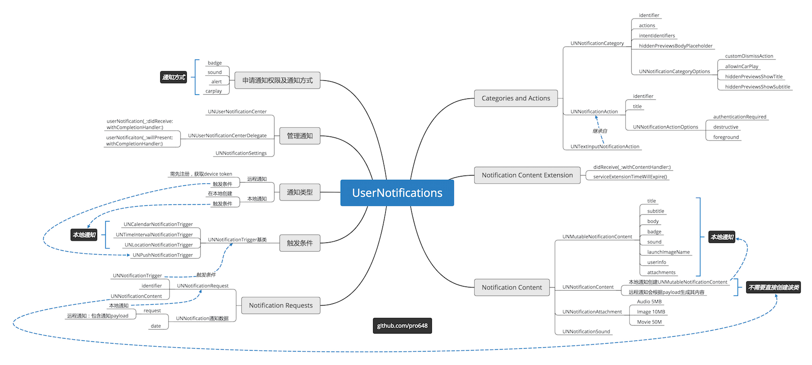

无论设备处于锁定状态还是使用中，都可以使用通知提供及时、重要的信息。无论app处于foreground、background或suspended状态，都可以使用通知发送信息。例如：体育类app可以使用通知告诉用户最新比分，还可以使用通知告诉app下载数据更新界面。通知的方式有显示横幅(banner)、播放声音和标记应用程序图标。

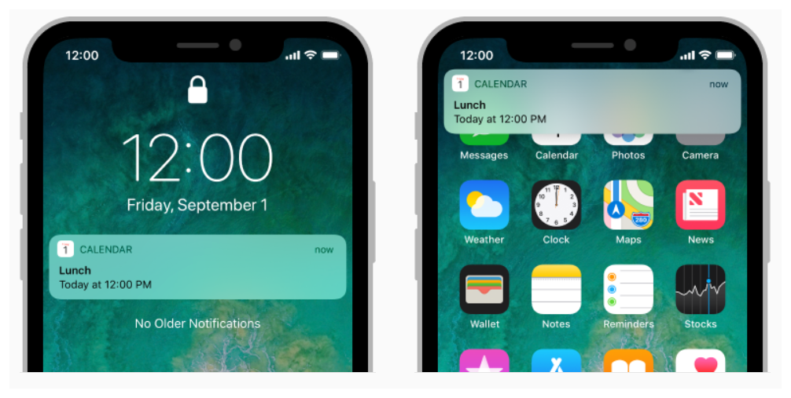

可以从应用程序本地生成通知，也可以从服务器远程生成通知。对于本地通知，app会创建通知内容，并指定触发通知条件，如日期、倒计时或位置变化。远程通知(remote notifications，也称为推送通知push notifications)需要服务器生成，由Apple Push Notification service (简称APNs)发送到用户设备。

iOS 10 以前通知相关API在`UIApplication`或`UIApplicationDelegate`中。app在前台时，远程推送无法直接显示，需要先捕获远程通知，然后再发起一个本地通知才能完成显示。除此之外，app运行时和非运行时捕获通知的路径不同。

iOS 10 将通知集中到`UserNotifications.framework`框架，绝大部分之前通知相关API都已被标记为弃用(deprecated)。这篇文章将通过一些例子来展示iOS 10 SDK中通知相关API功能及使用方式。

## 1. 申请通知权限

通知会打扰到用户，必须先取得用户授权。一般，可以在app启动时请求通知权限。

获取`UNUserNotificationCenter`对象，调用`requestAuthorization(options:completionHandler:)`方法，指定通知所需互动类型。如下：

```
func application(_ application: UIApplication, didFinishLaunchingWithOptions launchOptions: [UIApplicationLaunchOptionsKey: Any]?) -> Bool {
        // Request notifications authorization.
        let center = UNUserNotificationCenter.current()
        center.requestAuthorization(options: [.alert, .badge, .sound, .carPlay]) { (granted, error) in
            print("Permission granted:\(granted)")
            // Enable or disable features based on authorization.
        }
        
        return true
    }
```

在上面代码中请求使用横幅(alert)、徽标(badge)、声音、驾驶模式通知(carPlay)四种权限。

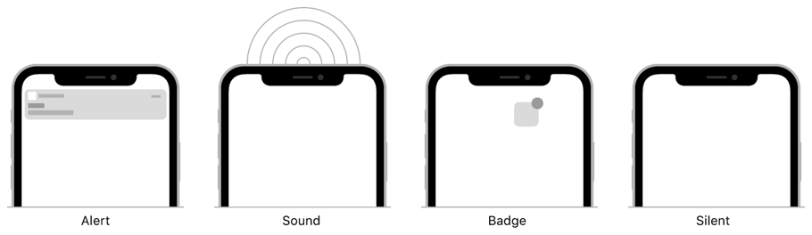

app第一次请求通知权限时，系统会弹窗提醒，并记录用户的响应。随后再次申请通知权限时，系统将不再提示用户。

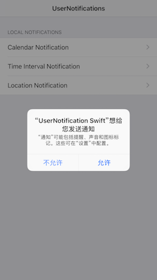


`UNUserNotificationCenter`用于管理app和app extension通知相关任务。你可以在任意线程同时调用该方法，该方法会根据任务发起时间串行执行。

当然，在使用`UserNotifications`相关API时，需要导入`UserNotifications`框架：

```
import UserNotifications
```

## 2. 本地通知

一般使用本地通知引起用户注意。例如，后台app可以在任务完成时显示通知。始终使用本地通知传达与用户相关的重要信息。

系统会按照app指定的触发条件（如时间、位置）来传递通知。如果发送通知时，app处于background或suspend，系统会代替app与用户交互；如果app处于foreground，系统会将通知递交至app进行处理。

#### 2.1 创建通知内容

要为本地通知指定payload，需要创建`UNMutableNotificationContent`对象。使用`UNMutableNotificationContent`对象为banner指定title、subtitle、body，通知声音，以及app徽标数值。

```
        // Configure the notificaiton's payload.
        let content = UNMutableNotificationContent()
        content.title = "Calendar Title"
        content.subtitle = "This is subtitle"
        content.body = "This is body"
        content.sound = UNNotificationSound.default()
        content.badge = 1
```

通知中显示的文本应当进行本地化。尽管本地化时可以使用`NSLocalizedString`宏，但更好的选择是使用`NSString`对象的`localizedUserNotificationString(forKey:argumentse)`方法。该方法可以在改变系统语言后，更新已显示通知语言。

```
        content.title = NSString.localizedUserNotificationString(forKey: "Calendar Title", arguments: nil)
```

#### 2.2 指定本地通知触发条件

本地通知触发条件有以下三种：

- UNCalendarNotificationTrigger
- UNTimeIntervalNotificationTrigger
- UNLocationNotificationTrigger

每个触发条件需要不同的参数。例如，基于日历的触发器需要指定发送通知的日期和时间。

###### 2.2.1 UNCalendarNotificationTrigger

使用`UNCalendarNotificationTrigger`对象可以在指定日期和时间触发本地通知，使用`NSDateComponents`对象指定相关日期信息。系统会在指定日期、时间传递通知。

下面创建了一个每天早7点30分的提醒：

```
        var date = DateComponents()
        date.hour = 7
        date.minute = 30
        let trigger = UNCalendarNotificationTrigger(dateMatching: date, repeats: true)
```

上面的`repeats`参数指定每天7点30分进行提醒。

也可以根据用户选择的Date Picker设置trigger：

```
@IBAction func datePickerDidSelectNewDate(_ sender: UIDatePicker) {
        let date = sender.date
        let calendar = Calendar(identifier: .chinese)
        let components = calendar.dateComponents(in: .current, from: date)
        let newComponents = DateComponents(calendar: calendar, timeZone: .current, month: components.month, day: components.day, hour: components.hour, minute: components.minute)

        let trigger = UNCalendarNotificationTrigger(dateMatching: newComponents, repeats: false)
    }
```

> 关于`UNCalendarNotificationTrigger`的使用，可以参考demo中`CalendarViewController.swift`部分内容。
>
> 如果你在用Objective-C ，可以下载demo获取Objective-C版本代码。文章底部源码地址包含了Swift和Objective-C两种demo。

###### 2.2.2 UNTimeIntervalNotificationTrigger

指定时间流逝(elapse)后触发通知，计时器使用这种类型的触发器。

下面创建一个2分钟后提醒一次的触发器：

```
let trigger = UNTimeIntervalNotificationTrigger(timeInterval: 2*60, repeats: false)
```

> 关于`UNTimeIntervalNotificationTrigger`的使用，可以参考demo中`TimeIntervalViewController.swift`部分内容。

###### 2.2.3 UNLocationNotificationTrigger

当用户设备进入或离开指定地理区域时触发通知。例如，iPhone中*提醒事项*app的*在指定位置提醒我*功能。系统对所添加基于位置触发器数量有限制。

> 使用位置触发器前，你的app必须取得使用Core Location定位的权限。事实上，系统负责监控是否进入、离开指定地理区域。
>
> 虽然[文档](https://developer.apple.com/documentation/usernotifications/unlocationnotificationtrigger)要求只取得*使用期间when-in-use*获取地理位置的权限即可，但经测试和[搜索](https://stackoverflow.com/a/41835750)，必须获得*始终 always*获取地理位置的权限。如果是我的错误，特别感谢[反馈](https://github.com/pro648/tips/issues)指出。

配置region时，使用`notifyOnEntry`和`notifyOnExit`属性指定进入或离开时触发提醒，也可以两者都提醒。下面代码指定离开时进行提醒：

```
        // Creating a location-based trigger.
        let center = CLLocationCoordinate2DMake(39.9042, 116.4074)
        let region = CLCircularRegion(center: center, radius: 500, identifier: "Headquarters")
        region.notifyOnExit = true
        region.notifyOnEntry = false
        let trigger = UNLocationNotificationTrigger(region: region, repeats: false)
```

> Demo中使用的是当前设备位置，具体内容可以查看`LocationViewController.swift`部分。

基于地理区域的通知并不会在设备刚刚离开区域边界时触发。系统使用启发式(heuristic)方法确保设备离开指定区域，而非定位有误导致。

#### 2.3 创建并注册UNNotificationRequest

使用上面的`UNMutableNotificationCentent`和触发器创建`UNNotificationRequest`对象，并通过`add(_:withCompletionHandler:)`方法将通知传递至系统。

```
        // Create the request.
        let request = UNNotificationRequest(identifier: "calendar", content: content, trigger: trigger)
        
        // Schedule the request with the system.
        UNUserNotificationCenter.current().add(request) { (error) in
            if let error = error {
                print("Failed to add request to notification center. error:\(error)")
            }
        }
```

Demo中触发器创建通知如下：

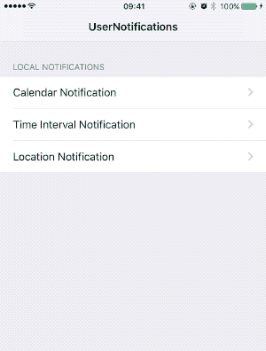

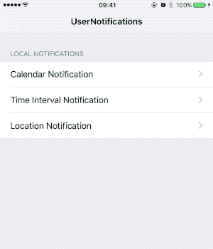

> 通知到达时app若处于前台，默认不会弹出alert。因此，需要设置通知后立即进入后台。

#### 2.4 取消未展示、已展示通知

通知请求提交后将保持活跃状态，直到满足其触发条件，或显式取消。通常，在条件变化时取消、更新通知。例如，用户提前完成了提醒，你将取消与该提醒相关的所有通知请求；用户更改了提醒，你将更新其触发条件。

使用`UNUserNotificationCenter`调用`removePendingNotificationRequests(withIdentifiers:)`方法取消通知请求。如需更新通知，只需使用相同标志符创建request即可。

- 取消还未展示的通知：使用`UNUserNotificationCenter`调用`removePendingNotificationRequests(withIdentifiers:)`方法
- 更新未展示通知：使用对应request标志符创建新通知。
- 取消已展示的通知：使用`UNUserNotificationCenter`调用`removeDeliveredNotifications(withIdentifiers:)`方法。
- 更新已展示通知：使用对应request标志符创建新通知。

## 3. 远程通知

通过支持远程通知，可以向用户提供最新信息，即时app并未运行。为了能够接收和处理远程通知，需遵守以下步骤：

1. 开启远程通知
2. 在Apple Push Notification service (APNs)注册并接收app的device token.
3. 发送device token至提供通知的服务器。
4. 对传入的通知进行处理。

#### 3.1 开启远程通知

只有付费的开发者账号才可以使用远程通知。点击Project navigation中工程名称，选择Capacities选项卡，开启*Push Notifications*功能：

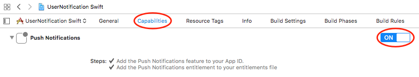

> 未付费开发者账号不显示 Push Notifications选项。

开启该选项后，Xcode会自动添加entitlement，你可以登录[开发者中心](https://developer.apple.com/account/ios/identifier/bundle)查看app IDs，会显示应用Push Notifications 待配置。

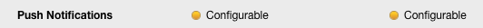

点击底部*edit*按钮，滑动到Push Notifications部分：

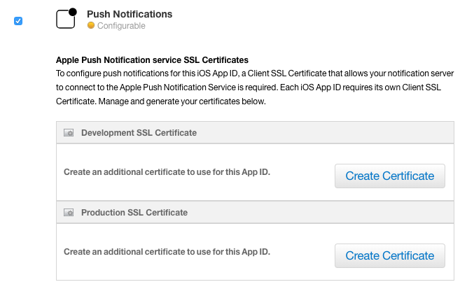

在*Development SSL Certificate*部分，点击*Create Certificate*按钮，根据提示创建CSR。根据提示用上一步创建的CSR生成你的证书，最后下载生成的证书并导入到Keychain：

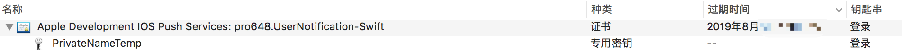

返回到开发者账号Identifiers > App IDs部分，应用push notifications Development已经可用：

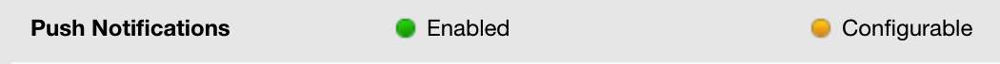

现在，使用Keychain证书就可以发送通知了。

#### 3.2 在APNs注册并接收device token

每次app启动，都需要在APNs注册。不同平台注册方法稍有不同，但其步骤是相似的：

1. app请求在APNs注册。
2. 注册成功后，APNs发送针对该app的device token至该设备。
3. 系统调用app中delegate方法，并将device token传递给该方法。
4. app将device token传递至服务器。

应用程序的device token是全局唯一的，标志特定app、设备的组合。收到device token后，需要由你将device token及其他相关数据（例如，用户身份信息）发送至服务器。稍后发送远程通知时，必须附带device token和通知payload。

不要在app内缓存device token，每次需要时调用系统方法获取。出现以下情况时，APNs会向你的app发出新的device token：

- 用户从备份中恢复系统。
- 用户在新设备安装了你的app。
- 用户重新安装了操作系统。

当设备令牌没有发生变化时，获取设备令牌的方法会快速返回。

> 当device token变化后，用户必须打开你的app，以便获取更新后的device token，APNs才可以向你的设备发送远程通知。

watchOS设备中app不需要注册获取远程通知，其依靠与其配对的iPhone转发远程通知。当iPhone处于锁定或屏幕处于关闭状态，Apple Watch在用户手腕中且未锁定时，iPhone会自动转发通知至Apple Watch。

在iOS和tvOS中，通过调用`UIApplication`对象的`registerForRemoteNotifications`方法来向APNs注册。通常，在启动时调用此方法作为正常启动序列的一部分。app第一次调用此方法时会联系APNs，请求该app在此设备的device token。随后系统会异步调用下面两个方法之一：

- `application(_:didRegisterForRemoteNotificationsWithDeviceToken:)`：成功获取device token后，系统调用该方法。在该方法内，处理device token并转发至服务器。
- `application(_:didFailToRegisterForRemoteNotificationsWithError:)`：获取失败时，系统调用该方法。可以在该方法内禁用远程通知相关功能。

> APNs的device token长度可变，不要硬编码其大小。

```
func application(_ application: UIApplication, didFinishLaunchingWithOptions launchOptions: [UIApplicationLaunchOptionsKey: Any]?) -> Bool {
        // Request notifications authorization.
        let center = UNUserNotificationCenter.current()
        center.requestAuthorization(options: [.alert, .badge, .sound, .carPlay]) { (granted, error) in
            print("Permission granted:\(granted)")
            guard granted else { return }
            
            // Register for push notification.
            UIApplication.shared.registerForRemoteNotifications()
        }
        return true
    }
    
        func application(_ application: UIApplication, didRegisterForRemoteNotificationsWithDeviceToken deviceToken: Data) {
        // Receive device token
        let token = deviceToken.map { data -> String in
            return String(format: "%02.2hhx", data)
        }.joined()
        print("Device Token:\(token)")
        
        // Forward token to server.
        // Enable remote notification features.
    }
    
    func application(_ application: UIApplication, didFailToRegisterForRemoteNotificationsWithError error: Error) {
        print("Fail to register for remote notifications. error:\(error)")
        
        // Disable remote notification features.
    }
```

在设备中运行，输出如下：

```
Permission granted:true
Device Token:7720b86184fa24100375f2e773b9bd201130eb41aaf2a28fae1157593d1592f0
```

#### 3.3 发送远程通知至APNs

远程通知从你公司服务器开始，由服务器决定何时向用户发送通知。远程通知包含通知数据和用户设备唯一标志符的请求。将远程通知转发给APNs，APNs负责将通知传递至用户设备。收到通知后，用户设备的操作系统会处理用户交互，并将通知传递给app。

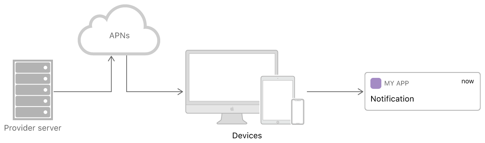

配置服务器部分不在这篇文章范围内，你可以查看[Setting Up a Remote Notification Server](https://developer.apple.com/documentation/usernotifications/setting_up_a_remote_notification_server?language=objc)这篇文档。

###### 使用Pusher发送远程通知

发送推送通知需要与APNs建立SSL链接，并使用刚创建的证书，Pusher可以完成这一任务。这篇文章中将使用Pusher向设备发送远程通知，你可以根据[这里](https://github.com/noodlewerk/NWPusher)的介绍安装使用。

启动Pusher，Pusher会自动检查Keychain中证书，并在下拉菜单中列举。详细步骤如下：

1. 从下拉菜单中选择证书。

2. 将控制台输出的device token粘贴至*Device push token*文本框。

3. 修改远程推送请求如下：

   ```
   {
       "aps":{
           "alert":{
               "title":"This is Title",
               "body":"This is Body"
           },
           "badge":1,
           "sound":"default"
       }
   }
   ```

4. 打开运行*UserNotification Swift*的设备，将app放到后台，或锁定设备屏幕，否则会不显示通知。

5. 点击Pusher的*Push*按钮。

   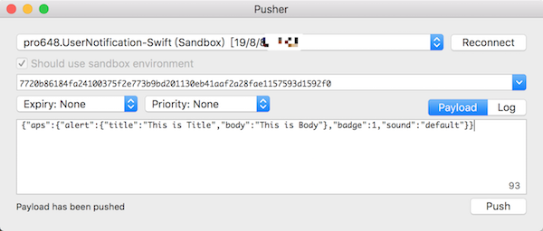

现在，你收到了第一条远程通知。

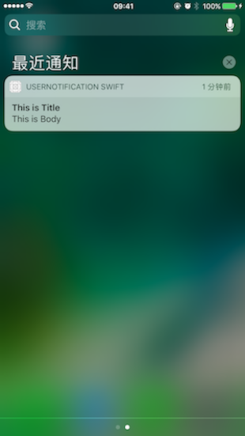

## 4. Payload

每个通知都需要提供payload和device token，以及呈现通知的细节。Payload是在服务器上创建的JSON字典对象。JSON字典必须包含`aps`键，其值是通知的数据。`aps`键的内容决定系统使用那种样式呈现通知：

- 弹出横幅。
- 为应用图标增加徽标。
- 播放声音。
- 以静默方式发送通知。

在`aps`字典之外，JSON词典还可以使用自定义key、value。自定义的value必须使用JSON结构，并仅使用基本类型(primitive type)，如dictionary、array、string、number和Boolean。请勿在payload中包含敏感数据，除非该数据已被加密，或只对当前应用环境有效。例如，payload可以包含一个会话标志符，即时消息app使用该标志符定位相应用户对话。通知中的数据永远不应具有破坏性，也就是说，app不应使用通知来删除用户设备上的数据。

#### 4.1 APS词典Keys

Apple使用`aps`词典内键传递通知至用户设备，`aps`词典中键内容决定通知与用户的交互方式。下表列出了`aps`词典可用的key，除此之外的`key`都会被系统忽略。

| Key                 | Value type           | Comment                                                      |
| ------------------- | -------------------- | ------------------------------------------------------------ |
| `alert`             | Dictionary or String | 使用该key弹出横幅。<br/><br/>该键的首选值是字典类型，该字典可选key在下一部分。如果指定字符串作为此key的值，则该字符串将显示为横幅的消息文本。<br/><br/>alert中文本不支持`\U`表示法，请使用UTF-8。 |
| `badge`             | Number               | 使用该key修改应用图标徽标。<br/><br/>如果没有包含该key，则badge不变。要移除badge，设置其值为`0`。 |
| `sound`             | String               | 使用该key播放声音，其值为app main bundle或Library/Sounds目录声音文件名称。如果无法找到该文件，或指定为`default`，系统播放默认声音。<br/><br/>更多关于通知声音文件信息，可以查看[Preparing Custom Alert Sounds](https://developer.apple.com/library/archive/documentation/NetworkingInternet/Conceptual/RemoteNotificationsPG/SupportingNotificationsinYourApp.html#//apple_ref/doc/uid/TP40008194-CH4-SW10) |
| `content-available` | Number               | 包含该key，并将值设置为`1`，用于设置后台更新通知。当该通知到达时，系统会唤醒你的应用，并将通知传递给app。<br/><br/>更多关于background update notifications的信息，查看[Configuring a Background Update Notification](https://developer.apple.com/library/archive/documentation/NetworkingInternet/Conceptual/RemoteNotificationsPG/CreatingtheNotificationPayload.html#//apple_ref/doc/uid/TP40008194-CH10-SW8) |
| `category`          | String               | 该键的字符串表示通知交互类型，该键值的字符串对应app注册的category。 |
| `thread-id`         | String               | 该key用于分组通知内容。可以在Notification Content app extension中，使用该键的值将通知分组。对于本地通知，使用`UNNotificationContent`对象的`threadIdentifier`属性。 |
| `mutable-content`   | Number               | Notification service扩展。当值为`1`时，系统将通知传递给notification service扩展，使用notification service扩展修改通知内容。 |

用户设备中关于通知的设置最终决定是否使用alert、badge和sound进行提醒。

#### 4.2 Alert Keys

下表列出了`alert`词典接收的key，及相应value类型。

| Key               | Value type                   | Comment                                                      |
| ----------------- | ---------------------------- | ------------------------------------------------------------ |
| `title`           | String                       | 描述通知的简短信息。                                         |
| `body`            | String                       | Alert通知内容。                                              |
| `title-loc-key`   | String 或 `null`             | 使用该key本地化Title字符串，其值在`Localizable.strings`文件中。key字符串可以使用`%@`和`%n$@`格式符，以获取`title-loc-args`数组中的变量。 |
| `title-loc-args`  | 元素为字符串的数组 或 `null` | 替换`title-loc-key`中变量。                                  |

## 5. 可操作(Actionable)通知发送和处理

Actionable notifications允许用户直接响应通知，而无需启动app。其他类型通知只显示通知信息，用户唯一的操作是启动app。对于可操作的通知，除通知界面外，系统还会显示一个或多个按钮。点击按钮会将所选操作发送到app，然后app在后台处理操作。

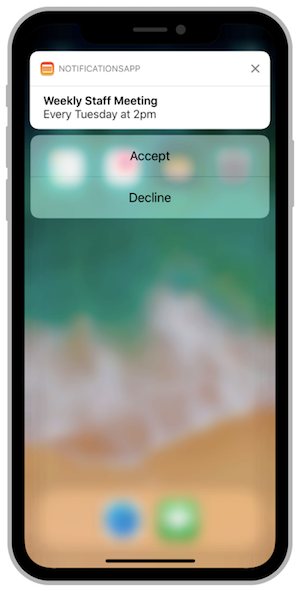

可交互式通知是通过将一簇`UNNotificationAction`放到一个`UNNotificationCategory`中，在app启动时注册category，发送通知时将要使用category标志符添加到payload中实现的。

#### 5.1 注册可交互式通知

`UNNotificationCategory`定义app支持的交互式操作类型，`UNNotificationAction`定义每种category可操作按钮。

使用`init(identifier:actions:intentIdentifiers:options)`方法创建category，其中`identifier`属性是category最重要部分，当生成通知时，payload必须包含该标志符。系统使用该`identifier`属性定位category和对应action。

使用`init(identifier:title:options:)`创建action，当用户点击按钮时，系统将`identifier`转发给你的app，`options`参数指定按钮行为。例如：执行删除内容操作时，使用`destructive`样式；需要启动app时，使用`foreground`样式；只允许未锁定设备上执行，使用`authenticationRequired`样式。

下面为`CalendarViewController`添加稍后提醒操作：

```
private func registerNotificationCategory() {
        // calendarCategory
        let completeAction = UNNotificationAction(identifier: "markAsCompleted",
                                                  title: "Mark as Completed",
                                                  options: [])
        let remindMeIn1MinuteAction = UNNotificationAction(identifier: "remindMeIn1Minute",
                                                           title: "Remind me in 1 Minute",
                                                           options: [])
        let remindMeIn5MinutesAction = UNNotificationAction(identifier: "remindMeIn5Minutes",
                                                            title: "Remind me in 5 Minutes",
                                                            options: [])
        
        let calendarCategory = UNNotificationCategory(identifier: "calendarCategory",
                                                      actions: [completeAction, remindMeIn5MinutesAction, remindMeIn1MinuteAction],
                                                      intentIdentifiers: [],
                                                      options: [.customDismissAction])
        UNUserNotificationCenter.current().setNotificationCategories([calendarCategory])
    }
```

记得在`application(_:didFinishLaunchingWithOptions:)`方法调用上述方法。

> 所有action对象都必须具有唯一标志符。处理action时，标志符是区分一个操作与另一个操作的唯一方法。

#### 5.2 payload中添加category

只有payload中包含有效category identifier，通知才会显示action。系统使用payload中category identifier在已注册category和action中查找，使用查找到的信息为通知添加action按钮。

要为本地通知添加category，将相应字符串分配给`UNMutableNotificationContent`对象的`categoryIdentifier`属性。

为上面创建的`CalendarViewController`添加category：

```
        content.categoryIdentifier = "calendarCategory"
```

> 详细内容，可以查看demo中`CalendarViewController.swift`部分内容。

运行如下：

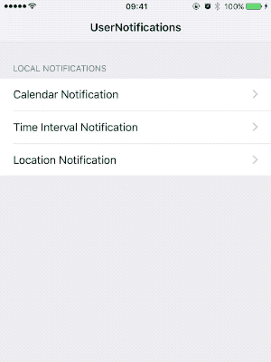

要为远程通知添加category，只需为JSON payload中`aps`字典添加`category`key即可。

## 6. 响应通知

目前为止，点击通知alert只会打开app，Action中按钮也无法点击；app处于前台时也无法收到通知。

`UNUserNotificationCenterDelegate`协议中的方法用来处理与通知的交互，以及app处于前台时如何响应通知。

- `userNotification(_:didReceive:withCompletionHandler:)`： app处于后台、未运行时，系统会调用该方法，可以在该方法内响应actionable通知，以及用户点击通知时执行的操作。例如，打开指定页面。
- `userNotificationCenter(_:willPresent:withCompletionHandler:)`：app处于前台时，系统会调用该方法，在该方法内决定如何处理通知。

#### 6.1 处理actionable通知

当用户点击通知中action时，系统会在后台启动你的app，并调用`userNotification(_:didReceive:withCompletionHandler:)`方法，在该方法内将`response`的`actionIdentifier`与注册action标志符进行匹配。如果用户使用系统默认交互打开app，或清除通知，系统会自动匹配`UNNotificationDefaultActionIdentifier`和`UNNotificationDismissActionIdentifier`。

下面实现了`CalendarViewController`中actionable通知：

```
    // Use this method to process the user's response to a notification.
    func userNotificationCenter(_ center: UNUserNotificationCenter, didReceive response: UNNotificationResponse, withCompletionHandler completionHandler: @escaping () -> Void) {
        
        if response.actionIdentifier == UNNotificationDefaultActionIdentifier {
            print("Default Action")
        } else if (response.actionIdentifier == UNNotificationDismissActionIdentifier){
            print("Dismiss action")
        }else if (response.notification.request.content.categoryIdentifier == "calendarCategory") {
            handleCalendarCategory(response: response)
        }
        
        UIApplication.shared.applicationIconBadgeNumber = 0
        
        completionHandler()
    }
    
    private func handleCalendarCategory(response: UNNotificationResponse) {
        if response.actionIdentifier == "markAsCompleted" {
            
        } else if response.actionIdentifier == "remindMeIn1Minute" {
            // 1 Minute
            let newDate = Date(timeInterval: 60, since: Date())
            scheduleNotification(at: newDate)
        } else if response.actionIdentifier == "remindMeIn1Minute" {
            // 5 Minutes
            let newDate = Date(timeInterval: 60*5, since: Date())
            scheduleNotification(at: newDate)
        }
    }
```

运行demo，`CalendarViewController`通知中的*Mark as Completed*、*Remind me in 1 Minute*和*Remind me in 5 Minutes*按钮将可以使用。

如果是actionable通知，用户*清楚*通知，或通过通知打开app时，会调用系统预定义的`UNNotificationDismissAction`或`UNNotificationDefaultActionIdentifier`。

> 关于`categoryIdentifier`和`actionIdentifier`的使用，可以参考demo中`NotificationHandler.swift`部分内容。

#### 6.2 应用内展示通知

现在，app处于后台或杀死时可以显示通知，并响应actionable通知。但app处于前台时，收到的通知是无法显示的。如果希望在应用内也显示通知的话，需要额外工作。

当app处于前台时，通知到达时系统会调用`UNNotificationCenterDelegate`协议的`userNotificationCenter(_:willPresent:withCompletionHandler:)`方法，使用该方法处理通知，并使用`completionHandler()`告知系统所需的提醒方式。

设置Calendar通知只有app处于后台时才显示，其它通知直接显示。

```
    func userNotificationCenter(_ center: UNUserNotificationCenter, willPresent notification: UNNotification, withCompletionHandler completionHandler: @escaping (UNNotificationPresentationOptions) -> Void) {
        let identifier = notification.request.identifier
        let options: UNNotificationPresentationOptions
        
        if identifier == "calendar" {
            options = []
        } else {
            options = [.alert, .sound]
        }
        
        completionHandler(options)
    }
```

如果你的app注册使用了`PushKit`，`PushKit`类型的通知会直接发送至app，不会直接显示给用户。如果app处于foreground或background，系统会为你的应用提供处理通知的时间；如果你的应用未运行，系统会在后台启动你的应用，以便app可以处理通知。

#### 6.3 设置代理对象

实现`UNUserNotificationCenterDelegate`协议方法后，将其分配给`UNUserNotificationCenter`对象的`delegate`属性。

```
    let notificationHandler = NotificationHandler()
    
    func application(_ application: UIApplication, didFinishLaunchingWithOptions launchOptions: [UIApplicationLaunchOptionsKey: Any]?) -> Bool {
        ...
        UNUserNotificationCenter.current().delegate = notificationHandler
        
        return true
    }
```

> 在app启动完毕前，必须将代理对象分配给`UNUserNotificationCenter`对象。例如，在iOS应用中，必须在`applicaiton(_:willFinishLaunchingWithOptions:)`或`application(_:didFinishLaunchingWithOptions:)`方法之一设置代理。在此之后设置代理，可能导致应用错过通知。

## 7. Notification Service Extension

有时需要在用户iOS设备上修改远程通知内容：

- 在服务器推送payload中加入加密文本，在客户端接收到通知后进行解密，以便完成端到端(end-to-end)的加密。
- 使用HTTP/2发送的payload，大小不得超过4KB。可以通过在payload中添加url，显示通知前下载附件解决这一问题。
- 显示通知前，使用用户设备上数据，更新通知内容。

想要修改远程通知内容，需要使用notification service应用扩展。在用户收到通知之前，Notification service app extension有约30秒时间来处理远程通知。

> Notification service app extensions只修改远程通知的内容。如果用户禁用了app通知，或payload只使用sound、badge提醒用户，或通知为silent通知，该扩展不会响应。
>
> 如果你还不了解扩展，可以查看[Today Extension(widget)的使用](https://github.com/pro648/tips/wiki/Today-Extension(widget)%E7%9A%84%E4%BD%BF%E7%94%A8)这篇文章。

#### 7.1 为工程添加service extension

和其它扩展一样，notification service app extension在你的iOS应用中处于独立bundle。添加该扩展步骤如下：

1. 选择Xcode中的 File > New > Target...
2. 选取 iOS > Application Extension 中的Notification Service Extension。点击*Next*。
3. 指定扩展名称和其它信息。点击*Finish*。

Xcode中Notification Service Extension模板提供了`NotificationService.swift`文件和`info.plist`文件。在`info.plist`文件中，已自动为`NSExtensionPointIdentifier`键设*com.apple.usernotifications.service*值。

#### 7.2 实现扩展的handler methods

Notification service应用扩展提供了以下方法用于修改远程通知内容：

- `didReceive(_:withContentHandler:)`：该方法必须实现。通过重写该方法修改远程通知的`UNNotificationContent`。修改通知内容后调用content handler块。如果决定放弃修改通知内容，在调用`contentHandler`块时传入`request`原始内容。
- `serviceExtensionTimeWillExpire()`：该方法可选实现，但强烈推荐实现。`didReceive(_:withContentHandler:)`方法占用太长时间执行任务时，系统会在单独线程调用该方法，以便提供最后一次修改通知的机会。此时，应当尽快调用`contentHandler`。例如，如果扩展正在下载图片，你可以更新通知alert文本，提示用户有正在下载的图片。如果你没有及时调用`didReceive(_:withContentHandler:)`方法中的完成处理程序，系统会显示通知的原始内容。

进入`NotificationService.swift`文件，实现`didReceive(_:withContentHandler:)`方法：

```
    override func didReceive(_ request: UNNotificationRequest, withContentHandler contentHandler: @escaping (UNNotificationContent) -> Void) {
        self.contentHandler = contentHandler
        bestAttemptContent = (request.content.mutableCopy() as? UNMutableNotificationContent)
        
        bestAttemptContent?.body = "\(bestAttemptContent?.body ?? "Default Body") pro648"
        contentHandler(bestAttemptContent)
    }
```

#### 7.3 配置payload

当远程通知满足以下条件时，系统才会调用notification service app extension：

- Payload必须包含`mutable-content`key，且其值为`1`。
- Payload的alert字典需包含title、subtitle或body这些信息，即通知必须显示banner。

远程通知payload如下：

```
{
    "aps" : {
        "alert" : {
        "title" : "This is title",
        "body" : "This is body",
        },
        "badge" : 2,
        "sound" : "default",
        "mutable-content" : 1,
    },
}
```

发送通知，如下所示：


使用notification service app extension，可以修改通知中任何内容。可以下载图片、视频，并将其作为attachment添加至通知content。你也可以修改alert内容，但不能移除alert内容。如果通知content不包含alert，系统会忽略你的修改，直接原样呈现。

在payload中发送图片网址，以附件方式显示图片：

```
{
    "aps" : {
        "alert" : {
        "title" : "This is title",
        "body" : "This is body",
        },
        "badge" : 2,
        "sound" : "default",
        "mutable-content" : 1,
    },
    "media-url" : "https://raw.githubusercontent.com/wiki/pro648/tips/images/UNA.jpg",
}
```

更新`didReceive(_:withContentHandler:)`方法如下：

```
    override func didReceive(_ request: UNNotificationRequest, withContentHandler contentHandler: @escaping (UNNotificationContent) -> Void) {
        self.contentHandler = contentHandler
        bestAttemptContent = (request.content.mutableCopy() as? UNMutableNotificationContent)
        
        // Dig in the payload to get the attachment-url.
        guard let bestAttemptContent = bestAttemptContent,
            let attachmentURLAsString = request.content.userInfo["media-url"] as? String,
            let attachmentURL = URL(string: attachmentURLAsString) else {
                return
        }
        
        // Download the image and pass it to attachments if not nil.
        downloadImageFrom(url: attachmentURL) {(attachment) in
            
            if attachment != nil {
                bestAttemptContent.attachments = [attachment!]
                contentHandler(bestAttemptContent)
            }
        }
    }
    
extension NotificationService {
    private func downloadImageFrom(url: URL, with completionHandler: @escaping (UNNotificationAttachment?) -> Void) {
        let task = URLSession.shared.downloadTask(with: url) { (location, response, error) in
            // 1. Test URL and escape if URL not OK
            guard let location = location else {
                completionHandler(nil)
                return
            }
            
            // 2. Get current's user temporary directory path
            var urlPath = URL(fileURLWithPath: NSTemporaryDirectory())
            // 3. Add proper ending to url path, in the case .jpg (The system validates the content of attached files before scheduling the corresponding notification request. If an attached file is corrupted, invalid, or of an unsupported file type, the notificaiton request is not scheduled for delivery.)
            let uniqueURLString = ProcessInfo.processInfo.globallyUniqueString + ".png"
            urlPath = urlPath.appendingPathComponent(uniqueURLString)
            
            // 4. Move downloadUrl to newly created urlPath
            try? FileManager.default.moveItem(at: location, to: urlPath)
            
            // 5. Try adding the attachement and pass it to the completion handler
            do {
                let attachment = try UNNotificationAttachment(identifier: "picture", url: urlPath, options: nil)
                completionHandler(attachment)
            }
            catch {
                completionHandler(nil)
            }
        }
        task.resume()
    }
}
```

运行demo，发送远程通知。如下：

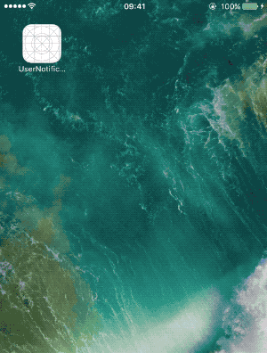

扩展修改通知内容、调用`contentHandler`方法的时间不得超过30秒。如果没有及时调用`contentHandler`方法，系统会调用`serviceExtensionTimeWillExpire()`方法，这是你最后一次修改content的机会。

```
    override func serviceExtensionTimeWillExpire() {
        // Called just before the extension will be terminated by the system.
        if let contentHandler = contentHandler, let bestAttemptContent = bestAttemptContent {
            bestAttemptContent.title = "Incoming Image"
            contentHandler(bestAttemptContent)
        }
    }
```

## 8. UserNotificationsUI

当iOS设备收到通知时，系统分两个阶段显示alert。

- 最初，其会显示一个标题、副标题，以及两到四行正文。
- 用户用力按压alert，或下划alert时，iOS将显示完整通知，包含响应按钮。

系统提供略缩alert界面，你可以使用`UserNotificationUI`自定义完整通知界面。


添加notification content extension方法步骤和notification service extension。选择Xcode中 File > New > Target...，选择 iOS > Application Extension > Notification Content Extonension模板。

#### 8.1 Info.plist文件

一个工程可以添加多个notification content service，但每一个扩展至少支持一个单独category。在`Info.plist`文件中使用`UNNotificationExtensionCategory`key声明所支持category。其value默认为String类型。如果要支持多个category，可以将其修改为Array类型。

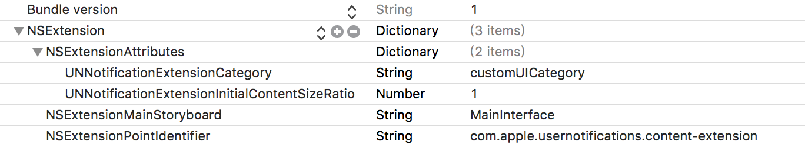

这里将`UNNotificationExtensionCategory`key的value设置为`customUICategory`。

Notification content app extension中`Info.plist`键如下：

| Key                                                          | Value                                                        |
| ------------------------------------------------------------ | ------------------------------------------------------------ |
| UNNotificationExtensionCategory <br/> (Required)             | 字符串，或包含字符串的数组。字符串为使用`UNNotificationCategory`类声明category的标志符。 |
| UNNotificationExtensionInitialContentSizeRatio<br/>(Required) | 浮点值类型，表示视图控制器视图初始大小，为高度与宽度的比率。在加载扩展时，系统使用此值设置视图控制器初始大小。例如，值为`0.5`时，视图控制器高度为其宽度的一半。加载扩展后也可以更改视图控制器大小。 |
| UNNotificationExtensionDefaultContentHidden                  | 布尔类型，默认为`NO`。设置为`YES`时，系统只显示自定义通知界面；设置为`NO`时，系统会显示默认通知界面。自定义action按钮和取消按钮会永远显示。 |
| UNNotificationExtensionOverridesDefaultTitle                 | 布尔类型，默认为`NO`。设置为`YES`时，系统将控制器的title设置为通知title；设置为`NO`时，系统将app名称设置为通知title。 |

下图左侧为未隐藏default notification interface，右侧为隐藏后界面：

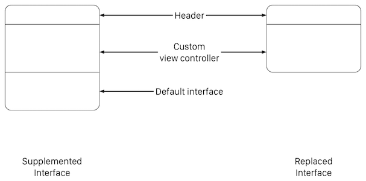

#### 8.2 添加视图

Notification content extension 模板包含一个storyboard，通过为storyboard添加视图来构建自定义通知界面。例如，使用`UILabel`显示通知title、subtitle和body。还可以添加图片、视频等非交互式内容，无需为视图提供任何初始内容。

在iOS 12及以后，还可以通过为`Info.plist`添加`UNNotificationExtensionUserInteractionEnabled`key，启用交互式控件，如`UIButton`、`UISwitch`。该key为Boolean类型，值为`YES`时支持交互式控件。

> 不要添加多个视图控制器，notification content app extension 只支持使用一个视图控制器。

设置storyboard高度为`160`，并添加`UILabel`，如下：

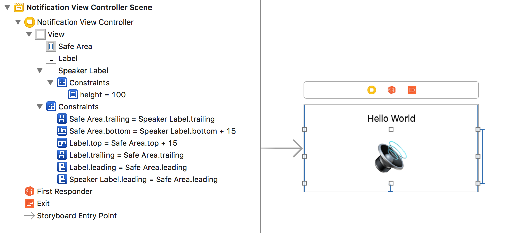

#### 8.3 UNNotificationExtension协议

`UNNotificationContentExtension`协议为notification content app extension提供了入口，用于提供自定义通知页面。Notification Content Extension模板提供的`NotificationViewController`类遵守该协议。该协议方法如下：

- `didReceive(_:)`：该方法必须实现。在该方法内使用notification content配置视图控制器。在视图控制器可见时，该方法可能会被调用多次。具体的说，新到达通知与已经显示通知`threadIdentifier`相同时，会再次调用该方法。该方法在扩展程序的主线程中调用。
- `didReceive(_:completionHandler:)`：该方法可选实现。用户点击自定义按钮时会调用该方法。该方法的`UNNotificationResponse`参数可以用来区分用户点击的按钮。处理完毕任务后，必须调用`completion`块。如果你实现了该方法，则必须处理所有category的所有action。如果没有实现该方法，用户点击按钮后系统会将通知转发给你的app。

只可以修改`NotificationViewController`视图的高度，不可修改其宽度。

实现`didReceive(_:)`方法，根据通知内容设置通知标题：

```
    func didReceive(_ notification: UNNotification) {
//        title = "pro648"
        self.label?.text = String("Content Extension:\(notification.request.content.body)")
    }
```

如下所示：


可以看到，自定义视图高度与宽度相等。修改`UNNotificationExtensionInitialContentSizeRatio`值为`0.5`，设置`UNNotificationExtensionDefaultContentHidden`值为`YES`，设置`UNNotificationExtensionOverridesDefaultTitle`值为`YES`，并取消上述代码中设置视图控制器title代码，运行并发送远程通知：

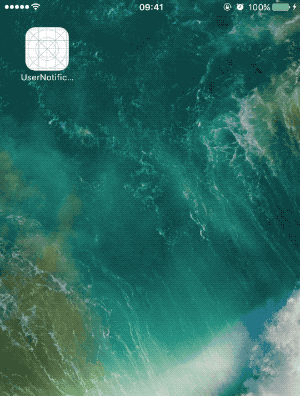

更新`didReceive(_:)`方法，在显示通知自定义界面时，摇动`speakerLabel`；实现`didReceive(_:completionHandler:)`方法，点击*Stop*按钮时，停止摇动`speakerLabel`，*Comment*按钮为`UNTextInputNotificationAction`类型：

```
    func didReceive(_ notification: UNNotification) {
        title = "pro648"
        self.label?.text = String("Content Extension:\(notification.request.content.body)")
        speakerLabel.shake()
    }
    
    func didReceive(_ response: UNNotificationResponse, completionHandler completion: @escaping (UNNotificationContentExtensionResponseOption) -> Void) {
        if response.actionIdentifier == "stop" {
            speakerLabel.text = "🔇"
            speakerLabel.cancelShake()
            completion(.doNotDismiss)
        } else if response.actionIdentifier == "comment" {
            completion(.dismissAndForwardAction)
        } else {
            completion(.dismiss)
        }
    }
}

extension UIView {
    func shake() {
        let animation = CAKeyframeAnimation(keyPath: "transform.translation.x")
        animation.timingFunction = CAMediaTimingFunction(name: kCAMediaTimingFunctionLinear)
        animation.duration = 1
        animation.repeatCount = .infinity
        animation.values = [-20.0, 20.0, -20.0, 20.0, -10.0, 10.0, -5.0, 5.0, 0.0]
        layer.add(animation, forKey: "shake")
    }
    
    func cancelShake() {
        layer.removeAnimation(forKey: "shake")
    }
}
```

运行如下：

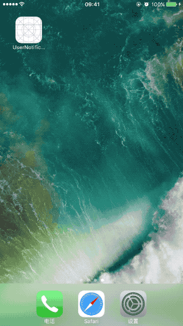

> 注册`customUICategory`category和注册`calendarCategory`类似，可以查看源码`AppDelegate.swift`部分。

## 9. 关于用户体验

- 使用完整的句子，正确的标点符号，提供有价值信息。不要截断通知中的信息，虽然在信息过长时，系统会进行这样的操作。避免告诉用户导航到特别页面，点击特定按钮，或执行其它难以记住的任务。
- 即时用户没有响应通知，也不要为同一任务发送多个通知。用户会在方便时处理通知，如果你的app为同一件事情发送多个通知，会占用通知中心整个界面，用户可能会关闭你的app通知功能。
- 通知中不要包含app名称和icon。系统会自动在每个通知顶部显示这些信息。
- 考虑提供详细视图。通过详细视图，可以在当前环境对通知进行操作，无需打开app。此视图应易识别、包含有价值信息，就像app正常扩展。其可以包含图片、视频和其它内容，并可以在显示时动态更新。
- 避免提供破坏性功能。提供破坏性操作前，需要确保用户对该操作有清晰认识，不存在误解。destructive类型操作会用红色显示。

Demo名称：UserNotifications  
源码地址：<https://github.com/pro648/BasicDemos-iOS/tree/master/UserNotifications>

参考资料：

1. [Push Notifications Tutorial: Getting Started](https://www.raywenderlich.com/584-push-notifications-tutorial-getting-started)
2. [iOS 10 rich push notifications with media attachments](https://medium.com/@tsif/ios-10-rich-push-notifications-with-media-attachments-a54dc86586c2)
3. [Local and Remote Notification Programming Guide](https://developer.apple.com/library/archive/documentation/NetworkingInternet/Conceptual/RemoteNotificationsPG/)
4. [活久见的重构 - iOS 10 UserNotifications 框架解析](https://onevcat.com/2016/08/notification/)
5. [iOS 10 Day by Day :: Day 6 :: Notification Content Extensions](https://www.shinobicontrols.com/blog/ios-10-day-by-day-day-6-notification-content-extensions)
6. [UNLocationNotificationTrigger- Not working in simulator](https://stackoverflow.com/questions/40628095/unlocationnotificationtrigger-not-working-in-simulator/41835750#41835750)
7. [How can I convert my device token (NSData) into an NSString?](https://stackoverflow.com/questions/9372815/how-can-i-convert-my-device-token-nsdata-into-an-nsstring/16411517#16411517)
8. [Introduction to Notifications](https://developer.apple.com/videos/play/wwdc2016/707/)

