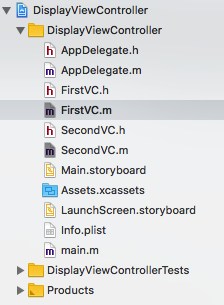
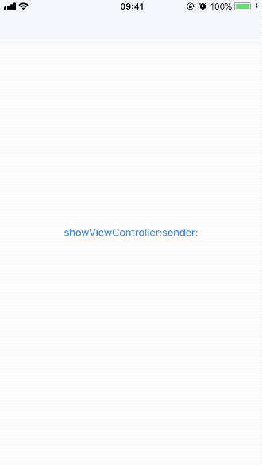
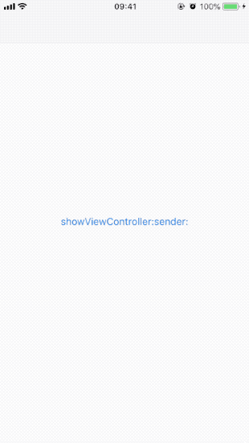
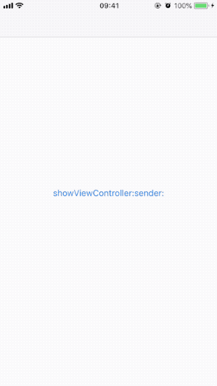
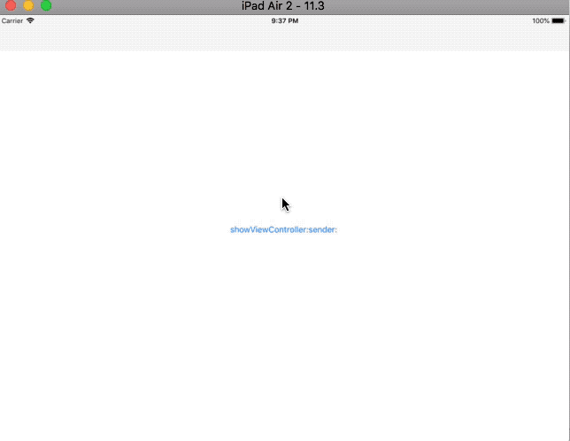
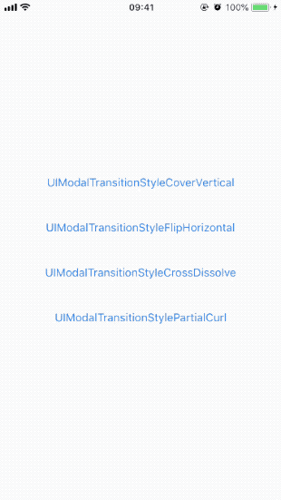

`UIViewController`类内置支持呈现其他视图控制器。你可以从任何视图控制器呈现其他视图控制器，但`UIKit`可能会将请求重新路由到不同视图控制器。源视图控制器（称为presenting view controller）和要显示的视图控制器（称为presented view controller）之间构成了视图控制器层次结构的一部分。

有以下几种方式呈现视图控制器：

- 使用segue自动显示视图控制器，segue会使用你在Interface Builder中配置的信息实例化并呈现视图控制器。下面是segue的几种类型：
  - Show：此segue调用`showViewController: sender:`方法显示新内容。对于大多数视图控制器，show segue 在源视图控制器上以modal方式呈现新内容。但`UISplitViewController`和`UINavigationController`类会重写`showViewController: sender:`方法，以根据自身设计处理呈现方式。如在`UINavigationController`中，视图控制器会被push到其导航堆栈。
  - Show Detail：此segue调用`showDetailViewController: sender:`方法显示新内容。Show Detail segue仅与嵌入在`UISplitViewController`对象内的视图控制器相关，此时分割视图用新内容替换detail controller。在其他视图控制器中，show detail会以modal形式呈现新内容。
  - Present Modally：此segue使用指定presentation styel和transition style以modal形式呈现新内容。
  - Present as Popover：在horizontally regular environment，视图控制器显示在弹出窗口中；在horizontally compact environment，视图控制器使用全屏模式显示。

    > Push、Modal、Popover、Replace这四种segue已经不推荐使用。
- 使用`showViewController:sender:`或`showDetailViewController:sender:`方法呈现视图控制器。该方法为视图控制器提供了自适应（adaptive）、灵活的呈现方式。这些方法让presenting view controller决定如何呈现视图控制器。例如：容器视图控制器会以子视图控制器的形式呈现新的控制器，而非默认的modal形式。
- 使用`presentViewController:animated:completion:`方法总是以modal形式呈现视图控制器。调用该方法的视图控制器可能不是最终处理呈现过程的视图控制器。例如：必须由全屏控制器呈现全屏控制器，如果当前presenting view controller不是全屏，UIKit将遍历视图层次结构，直到找到合适视图控制器。呈现完成后，UIKit更新`presentingViewController`、`presentedViewController`属性。

## 1. Showing View Controllers

使用`showViewController:sender:`和`showDetailViewController:sender:`方法呈现视图控制器步骤如下：

1. 创建并设置要呈现的视图控制器。
2. 设置刚创建的视图控制器的`modalPresentationStyle`属性，指定显示样式。最终显示时，可能不采用该属性。
3. 设置刚创建的视图控制器的`modalTransitionStyle`属性，指定界面切换样式。最终显示时，可能不采用该属性。
4. 调用`showViewController:sender:`和`showDetailViewController:sender:`方法。


创建Single View App模板的demo，demo名称为`DisplayViewController`，创建两个继承自`UIViewController`的控制器，名称分别为`FirstVC`、`SecondVC`。完成后project navigator如下：



进入`FirstVC.m`文件，添加如下代码：

```
- (void)viewDidLoad {
    [super viewDidLoad];
    
    // 初始化showVCButton。
    UIButton *showVCButton = [UIButton buttonWithType:UIButtonTypeSystem];
    showVCButton.frame = CGRectMake(0, 0, self.view.bounds.size.width, 30);
    showVCButton.center = self.view.center;
    [showVCButton setTitle:@"showViewController:sender:" forState:UIControlStateNormal];
    [showVCButton addTarget:self action:@selector(showVCButtonClicked:) forControlEvents:UIControlEventTouchUpInside];
    [self.view addSubview:showVCButton];
}

- (void)viewDidAppear:(BOOL)animated {
    [super viewDidAppear:animated];
    NSLog(@"FirstVC did appear");
}

- (void)viewDidDisappear:(BOOL)animated {
    [super viewDidDisappear:animated];
    NSLog(@"FirstVC did disappear");
}

- (void)showVCButtonClicked:(UIButton *)sender {
    // 初始化presented view controller。
    SecondVC *secVC = [[SecondVC alloc] init];
    secVC.color = [UIColor lightGrayColor];
    
    // show presented view controller.
    [self showViewController:secVC sender:sender];
}
```

进入`SecondVC.h`文件，声明`color`属性，并在`SecondVC.m`文件`viewDidLoad`方法中设置视图背景为`color`。

```
@property (strong, nonatomic) UIColor *color;
```

运行demo，点击*showViewController:sender:*按钮，`SecondVC`自下而上弹出，覆盖整个视图控制器。

现在，无法从presented view controller返回到presenting view controller，更新`SecondVC.m`代码如下：

```
- (void)viewDidLoad {
    [super viewDidLoad];
    
    // 设置背景颜色。
    self.view.backgroundColor = self.color;
    
    // 添加退出当前视图控制器按钮。
    UIButton *dismissVCButton = [UIButton buttonWithType:UIButtonTypeSystem];
    dismissVCButton.frame = CGRectMake(0, 0, self.view.bounds.size.width, 30);
    dismissVCButton.center = self.view.center;
    [dismissVCButton setTitle:@"dismissViewControllerAnimated:completion:" forState:UIControlStateNormal];
    [dismissVCButton addTarget:self action:@selector(dismissVCButtonClicked:) forControlEvents:UIControlEventTouchUpInside];
    [self.view addSubview:dismissVCButton];
}

- (void)viewDidAppear:(BOOL)animated {
    [super viewDidAppear:animated];
    
    NSLog(@"SecondVC did appear");
}

- (void)viewDidDisappear:(BOOL)animated {
    [super viewDidDisappear:animated];
    
    NSLog(@"SecondVC did disappear");
}

- (void)dismissVCButtonClicked:(UIButton *)sender {
    // 退出当前控制器。
    [self dismissViewControllerAnimated:YES completion:^{
        NSLog(@"Dismiss SecondVC Completion");
    }];
}
```

运行demo，如下所示：



可以看到：呈现`SecondVC`时，视图自下而上弹出；退出`SecondVC`时，视图自上而下退出。

另外，通过控制台可以看到`dismissViewController:completion:`方法的完成处理程序会在`SecondVC`调用`viewDidDisappear:`方法后执行。

`showViewController:sender:`方法还可以在`UINavigationController`中使用。更新`FirstVC.m`文件中的`showVCButtonClicked:`方法如下：

```
- (void)showVCButtonClicked:(UIButton *)sender {
    ...
    // show presented view controller.
//    [self showViewController:secVC sender:sender];
    [self.navigationController showViewController:secVC sender:sender];
}
```

因为当前视图控制器是`UIViewController`实例，`self.navigationController`为`nil`，所以不执行跳转操作。

打开*Main.storyboard*，将`FirstVC`嵌入到导航视图控制器。运行demo：



可以看到，现在点击*showViewController:sender:*按钮时，`SecondVC`自右向左压入导航堆栈视图。点击`SecondVC`中*dismissViewControllerAnimated:completion:*按钮，没有执行任何操作。这是因为`dismissViewControllerAnimated:completion:`方法只能退出以modal呈现的视图控制器。在导航堆栈视图，一般通过点击左上角返回按钮，或触发`UIScreenEdgePanGestureRecognizer`左侧手势返回。也可以调用`popViewControllerAnimated:`方法弹出导航视图控制器顶部视图，更新`SecondVC.m`后如下：

```
- (void)viewDidLoad {
    ...
    // 添加弹出当前堆栈视图控制器顶部控制器按钮。
    UIButton *popVCButton = [UIButton buttonWithType:UIButtonTypeSystem];
    popVCButton.frame = CGRectMake(0, 0, self.view.bounds.size.width, 30);
    popVCButton.center = CGPointMake(self.view.center.x, self.view.center.y + 50);
    [popVCButton setTitle:@"popViewControllerAnimated:" forState:UIControlStateNormal];
    [popVCButton addTarget:self action:@selector(popVCButtonClicked:) forControlEvents:UIControlEventTouchUpInside];
    [self.view addSubview:popVCButton];
}

- (void)popVCButtonClicked:(UIButton *)sender {
    // 弹出顶部视图控制器。
    [self.navigationController popViewControllerAnimated:YES];
}
```

运行demo，如下所示：



> `showViewController:sender:`和`showDetailViewController:sender:`方法是呈现视图控制器的首选方式。视图控制器可以在不知道其层次结构时调用该方法，如果处于堆栈视图中，该方法会将新视图压入堆栈中；如果处于`UIViewController`实例中，该方法会以modal形式呈现视图控制器。
>
> 所以，上面呈现`SecondVC`控制器的代码可以使用`[self showViewController:secVC sender:sender]`方法，这样可以更灵活的在app不同部分重用视图控制器，而不需添加各种判断。

弹出视图控制器方法如下：

- `popViewControllerAnimated:`：该方法弹出并返回导航视图控制器堆栈最顶层视图控制器。如果最顶层视图控制器是根视图控制器，则该方法不执行任何操作，即不能弹出导航控制器堆栈最后一个控制器。
- `popToRootViewControllerAnimated:`：只保留根视图控制器（即最后一个视图控制器），移除堆栈中其他视图控制器。该方法会返回一个包含所有被弹出视图控制器的数组。
- `popToViewController:animated:`：移除视图控制器，直到显示指定视图控制器。该方法会返回一个包含所有被弹出视图控制器的数组。需要注意的是，指定的视图控制器必须已经存在于堆栈中，否则程序会崩溃。

## 2. pushViewController:animated:

除使用iOS 8中增加的`showViewController: sender:`方法将视图控制器压入堆栈，还可以使用iOS 2中的`pushViewController:animated:`方法。

`pushViewController:animated:`方法只能用于导航堆栈控制器中，不能用在`UIViewController`实例。`showViewController: sender:`、`showDetailViewController: sender:`为自适应方法，可以根据当前视图控制器层级结构处理。

show和push用在导航堆栈视图控制器时没有区别。在storyboar中，push segue已不推荐使用。所以，如果你不需要支持iOS 7，应当使用自适应性强、Apple推荐的`showViewController: sender:`、`showDetailViewController: sender:`方法。

## 3. presentViewController:animated:completion:

在水平常规时（in a horizontally regular environment），`presentViewController:animated:completion:`方法使用`modalPresentationStyle`属性指定的值呈现视图控制器；在水平紧凑时（in a horizontally compact environment），默认使用全屏模式呈现视图控制器。

1. 创建并设置要呈现的视图控制器。
2. 设置刚创建视图控制器的`modalPresentationStyle`属性，指定显示样式。最终显示时，可能不采用该属性。如果`modalPresentationStyle`为`UIModalPresentationPopover`，还需要配置以下属性：
   - 将presented view controller的`preferredContentSize`属性设置为所需大小。
   - 使用`UIPopoverPresentationController`对象设置anchor，可以通过获取presented view controller的`popoverPresentationController`属性获得该对象，并设置下列选项之一：
     - 设置`UIPopoverPresentationController`对象的`barButtonItem`属性为指定`UIBarButtonItem`。
     - 设置`UIPopoverPresentationController`对象的`sourceView`属性、`sourceRect`属性为视图上指定区域。
3. 设置刚创建视图控制器的`modalTransitionStyle`属性，指定界面切换样式。最终显示时，可能不采用该属性。
4. 调用`presentViewController:animated:completion:`方法。

更新`FirstVC.m`文件中的`showVCButtonClicked:`方法：

```
- (void)showVCButtonClicked:(UIButton *)sender {
    // 初始化presented view controller。
    SecondVC *secVC = [[SecondVC alloc] init];
    secVC.color = [UIColor lightGrayColor];
    
    // 设置modalPresentationStyle、大小。
    secVC.modalPresentationStyle = UIModalPresentationPopover;
    secVC.preferredContentSize = CGSizeMake(self.view.bounds.size.height/3, self.view.bounds.size.width/2);
    
    UIPopoverPresentationController *popoverVC = secVC.popoverPresentationController;
    if (popoverVC) {
        // 设置sourceView为点击的按钮，sourceRect为按钮边框，arrow方向为上。
        popoverVC.sourceView = sender;
        popoverVC.sourceRect = sender.bounds;
        popoverVC.permittedArrowDirections = UIPopoverArrowDirectionUp;
    }
    
    [self presentViewController:secVC animated:YES completion:^{
        NSLog(@"Present sevVC completion");
    }];
}
```

如果在iPhone中运行demo，其会以modal形式自下而上弹出视图控制器；如果在iPad中运行，则以弹框形式呈现：



`modalPresentationStyle`属性值还可被设置为`UIModalPresentationFullScreen`、`UIModalPresentationPageSheet`等。

## 4. modalTransitionStyle

呈现视图控制器时过度样式有以下四种：

- `UIModalTransitionStyleCoverVertical`：当视图控制器呈现时，其视图从屏幕底部向上滑动；退出时，其视图从顶部向底部滑动。这也是默认的transition style。
- `UIModalTransitionStyleFlipHorizontal`：呈现视图控制器时，当前视图控制器使用从右向左水平3D翻转，产生一种presented view controller在presenting view controller背面的效果。在退出时，从左向右翻转返回到presenting view controller。
- `UIModalTransitionStyleCrossDissolve`：当呈现视图控制器时，presenting view controller溶解淡出，与此同时presented view controller淡入。退出时使用类似的交叉溶解。
- `UIModalTransitionStylePartialCurl`：呈现视图控制器时，presenting view controller视图一角卷起，显露出presented view controller视图。退出时动画与卷起时相反。该效果只能在`modalPresentationStyel`属性为`UIModalPresentationStyleFullScreen`时才可以使用，否则会触发异常。

下面GIF图显示了四种切换方式区别：



> 上面GIF使用了storyboard segue进行跳转，如果你不熟悉如何使用，可以下载demo查看。

Demo名称：DisplayViewController   
源码地址：<https://github.com/pro648/BasicDemos-iOS>

参考资料：

1. [Presenting a View Controller](https://developer.apple.com/library/content/featuredarticles/ViewControllerPGforiPhoneOS/PresentingaViewController.html#//apple_ref/doc/uid/TP40007457-CH14-SW1)
2. [showViewController v.s pushViewController](https://medium.com/@Archie.Chang/showviewcontroller-v-s-pushviewcontroller-7760b96f3116)


