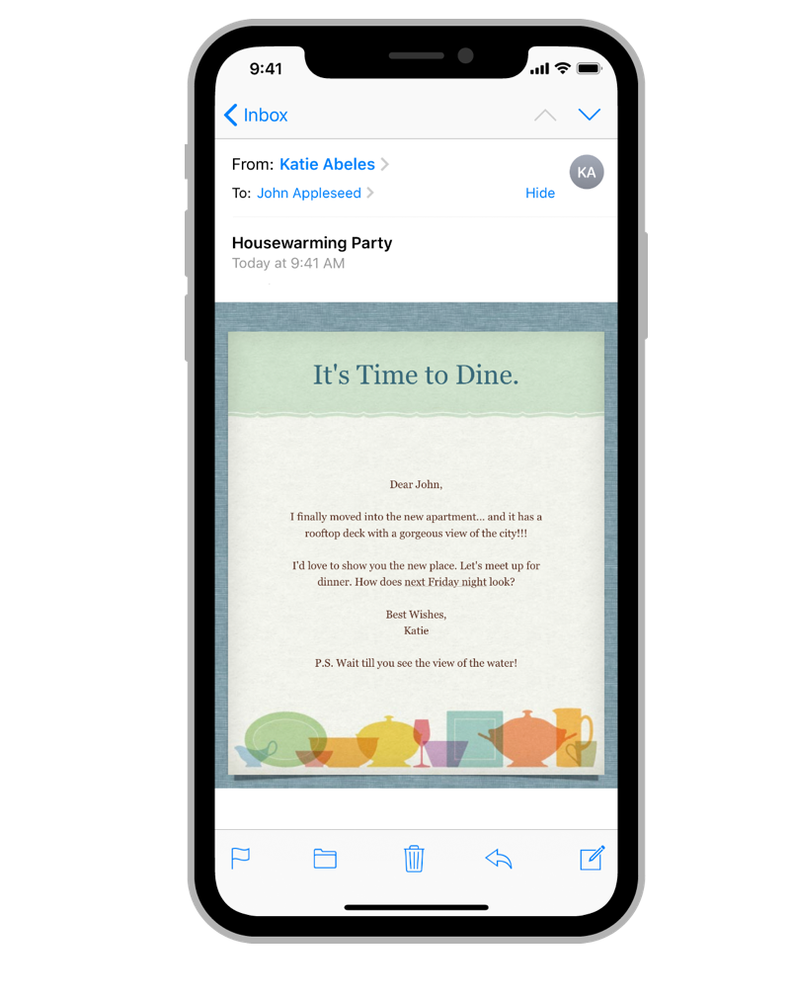
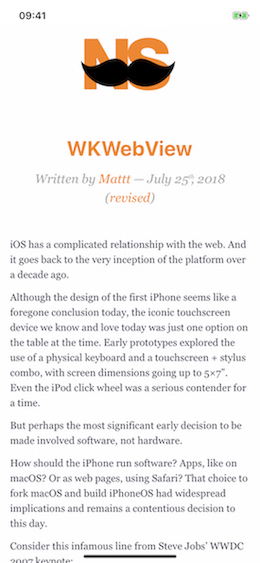
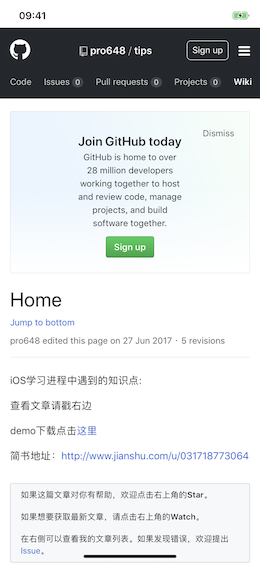
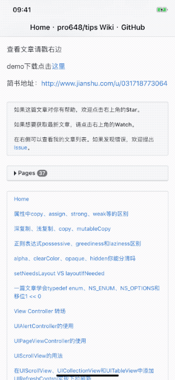
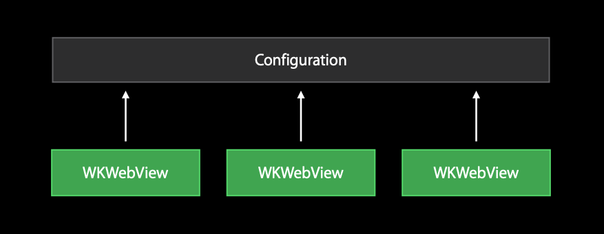
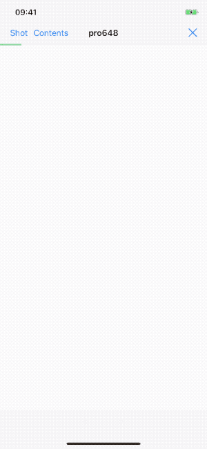

Web view 用于加载和显示丰富的网络内容。例如，嵌入 HTML 和网站。Mail app 使用 web view 显示邮件中的 HTML 内容。



iOS 8 和 macOS 10.10 中引入了WebKit framework，用以取代`UIWebView`和`WebView`。同时，在两个平台上提供同一API。与`UIWebView`相比，WebKit 有以下优势：使用了与 Safari 一样的 JavaScript engine，在运行脚本前，将脚本编译为机器代码，速度更快；支持多进程架构，Web 内容在单独的线程中运行，`WKWebView`崩溃不会影响 app运行；能够以60fps滑动。另外，在 iOS 12 和 macOS 10.14中，`UIWebView`和`WebView`已经被正式弃用。

WebKit  framework 提供了多个类和协议，用于在窗口中显示网络内容，并实现类似浏览器功能。例如，点击链接时显示链接内容，维护前进、后退列表，维护最近访问列表。加载网页内容时，异步从 HTTP 服务器请求内容，其响应 (response) 可能以增量、随机顺序到达，也可能因网络原因部分到达，而 WebKit 极大简化了这些过程。WebKit 框架还简化了显示各种 MIME 类型内容过程，以及管理视图中各元素滚动条。

> WebKit 框架中的方法、函数只能在主线程或主队列中调用。

## 1. WKWebView

`WKWebView`是 WebKit framework 的核心。在 app 内使用`WKWebView`插入网络内容步骤如下：

1. 创建`WKWebView`对象。
2. 将`WKWebView`设置为要显示的视图。
3. 向`WKWebView`发送加载 Web 内容的请求。

使用`initWithFrame:configuration:`方法创建`WKWebView`，使用`loadHTMLString:baseURL:`加载本地HTML文件，或使用`loadRequest:`方法加载网络内容。如下：

```
    // Local HTMLs
    WKWebView *webView = [[WKWebView alloc] initWithFrame:self.view.bounds configuration:self.webConfiguration];
    self.view = webView;
    NSURL *htmlURL = [[NSBundle mainBundle] URLForResource:@"WKWebView - NSHipster" withExtension:@"htm"];
    NSURL *baseURL = [htmlURL URLByDeletingLastPathComponent];
    NSString *htmlString = [NSString stringWithContentsOfURL:htmlURL
                                                    encoding:NSUTF8StringEncoding
                                                       error:NULL];
    [webView loadHTMLString:htmlString baseURL:baseURL];
    
    // Web Content
    WKWebView *webView = [[WKWebView alloc] initWithFrame:self.view.bounds configuration:self.webConfiguration];
    self.view = webView;
    NSURL *myURL = [NSURL URLWithString:@"https://github.com/pro648/tips/wiki"];
    NSURLRequest *request = [NSURLRequest requestWithURL:myURL
                                             cachePolicy:NSURLRequestUseProtocolCachePolicy
                                         timeoutInterval:30];
    [webView loadRequest:request];
```

> 本地HTML文件可以在demo源码中获取：<https://github.com/pro648/BasicDemos-iOS/tree/master/WebKit>

如图所示：





设置`allowsBackForwardNavigationGestures`属性可以开启、关闭横向滑动触发前进、后退导航功能：

```
self.webView.allowsBackForwardNavigationGestures = YES;
```

#### 1.1 KVO

`WKWebView`中的`title`、`URL`、`estimatedProgress`、`hasOnlySecureContent`和`loading`

属性支持键值观察，可以通过添加观察者，获得当前网页标题、加载进度等。

> 根据文档`serverTrust`属性也支持KVO，但截至目前，在iOS 12.1 (16B91)中使用观察者观察该属性，运行时会抛出*this class is not key value coding-compliant for the key serverTrust*的异常。

将网页标题显示出来可以帮助用户了解当前所在位置，显示当前导航进度能够能够让用户感受到加载速度，另外，还可以观察`hasOnlySecureContent`查看当前网页所有资源是否均通过加密连接传输。在`viewDidLoad`中添加以下代码：

```
    [self.webView addObserver:self forKeyPath:@"hasOnlySecureContent" options:NSKeyValueObservingOptionNew context:webViewContext];
    [self.webView addObserver:self forKeyPath:@"title" options:NSKeyValueObservingOptionNew context:webViewContext];
    [self.webView addObserver:self forKeyPath:@"estimatedProgress" options:NSKeyValueObservingOptionNew context:webViewContext];
```

实现`observerValueForKeyPath:ofObject:change:context:`方法，在观察到值变化时进行对应操作：

```
- (void)observeValueForKeyPath:(NSString *)keyPath ofObject:(id)object change:(NSDictionary<NSKeyValueChangeKey,id> *)change context:(void *)context {
    if ([keyPath isEqualToString:@"hasOnlySecureContent"]) {
        BOOL onlySecureContent = [[change objectForKey:NSKeyValueChangeNewKey] boolValue];
        NSLog(@"onlySecureContent:%@",onlySecureContent ? @"YES" : @"NO");
    } else if ([keyPath isEqualToString:@"title"]) {
        self.navigationItem.title = change[NSKeyValueChangeNewKey];
    } else if ([keyPath isEqualToString:@"estimatedProgress"]) {
        self.progressView.hidden = [change[NSKeyValueChangeNewKey] isEqualToNumber:@1];
        
        CGFloat progress = [change[NSKeyValueChangeNewKey] floatValue];
        self.progressView.progress = progress;
    } else {
        [super observeValueForKeyPath:keyPath ofObject:object change:change context:context];
    }
}
```

> 如果你对键值观察、键值编码还不熟悉，可以查看我的另一篇文章：[KVC和KVO学习笔记](https://github.com/pro648/tips/wiki/KVC%E5%92%8CKVO%E5%AD%A6%E4%B9%A0%E7%AC%94%E8%AE%B0)

运行demo，如下所示：



控制台会输出如下内容：

```
onlySecureContent:YES
```

`WKWebView`调用`reload`、`stopLoading`、`goBack`、`goForward`可以实现刷新、返回、前进等功能：

```
- (void)refreshButtonTapped:(id)sender {
    [self.webView reload];
}

- (void)stopLoadingButtonTapped:(id)sender {
    [self.webView stopLoading];
}

- (IBAction)backButtonTapped:(id)sender {
    [self.webView goBack];
}

- (IBAction)forwardButtonTapped:(id)sender {
    [self.webView goForward];
}
```

还可以通过观察`loading`属性，在视图加载完成时，更新后退、前进按钮状态：

```
- (void)viewDidLoad {
    ...
    
    [self.webView addObserver:self forKeyPath:@"loading" options:NSKeyValueObservingOptionNew context:webViewContext];
}
    
- (void)observeValueForKeyPath:(NSString *)keyPath ofObject:(id)object change:(NSDictionary<NSKeyValueChangeKey,id> *)change context:(void *)context {
    ...
    if (context == webViewContext && [keyPath isEqualToString:@"loading"]) {
        BOOL loading = [change[NSKeyValueChangeNewKey] boolValue];
        // 加载完成后，右侧为刷新按钮；加载过程中，右侧为暂停按钮。
        self.navigationItem.rightBarButtonItem = loading ? self.stopLoadingButton : self.refreshButton;
        
        self.backButton.enabled = self.webView.canGoBack;
        self.forwardButton.enabled = self.webView.canGoForward;
    } else {
        [super observeValueForKeyPath:keyPath ofObject:object change:change context:context];
    }
}
```

#### 1.2 截取网页视图

在iOS 11和macOS High Sierra中，WebKit framework增加了`takeSnapshotWithConfiguration:completionHandler:` API用于截取网页视图。截取网页可见部分视图方法如下：

```
- (IBAction)takeSnapShot:(UIBarButtonItem *)sender {
    WKSnapshotConfiguration *shotConfiguration = [[WKSnapshotConfiguration alloc] init];
    shotConfiguration.rect = CGRectMake(0, 0, self.webView.bounds.size.width, self.webView.bounds.size.height);
    
    [self.webView takeSnapshotWithConfiguration:shotConfiguration
                              completionHandler:^(UIImage * _Nullable snapshotImage, NSError * _Nullable error) {
                                  // 保存截图至相册，需要在info.plist中添加NSPhotoLibraryAddUsageDescription key和描述。
                                  UIImageWriteToSavedPhotosAlbum(snapshotImage, NULL, NULL, NULL);
                              }];
}
```

此前，截取网页视图需要结合图层和graphics context。现在，只需要调用单一API。

#### 1.3 执行JavaScript

可以使用`evaluateJavaScript:completionHandler:`方法触发web view JavaScript。下面方法触发输出web view userAgent:

```
    [self.webView evaluateJavaScript:@"navigator.userAgent" completionHandler:^(id _Nullable userAgent, NSError * _Nullable error) {
        NSLog(@"%@",userAgent);
    }];
```

在iOS 12.1.2 (16C101) 中，输出如下：

```
Mozilla/5.0 (iPhone; CPU iPhone OS 12_1_2 like Mac OS X) AppleWebKit/605.1.15 (KHTML, like Gecko) Mobile/16C101
```

## 2. WKWebViewConfiguration

`WKWebViewConfiguration`是用于初始化Web视图属性的集合。通过`WKWebViewConfiguration`类，可以设置网页渲染速度，视频是否自动播放，HTML5 视频是否一帧一帧播放，如何与本地代码通信等。

`WKWebViewConfiguration`属性有偏好设置`preference`、线程池`processPool`和用户内容控制器`userContentController`等。

Web view 初始化时才需要`WKWebViewConfiguration`对象，`WKWebView`创建后无法修改其configuration。多个`WKWebView`可以使用同一个configuration。



例如，设置网页中最小字体为`30`，自动检测电话号码：

```
- (WKWebViewConfiguration *)webConfiguration {
    if (!_webConfiguration) {
        _webConfiguration = [[WKWebViewConfiguration alloc] init];
        
        // 偏好设置 设置最小字体
        WKPreferences *preferences = [[WKPreferences alloc] init];
        preferences.minimumFontSize = 30;
        _webConfiguration.preferences = preferences;
        
        // 识别网页中的电话号码
        _webConfiguration.dataDetectorTypes = WKDataDetectorTypePhoneNumber;
        
        // Web视图内容完全加载到内存之前，禁止呈现。
        _webConfiguration.suppressesIncrementalRendering = YES;
    }
    return _webConfiguration;
}
```

`suppressesIncrementalRendering`属性是布尔值，决定Web视图内容在完全加载到内存前是否显示，默认为`NO`，即边加载边显示。例如，Web视图中有文字和图片，会先显示文字后显示图片。

## 3. Scripts

用户脚本 (User Scripts) 是文档开始加载或加载完成后注入 Web 页面的 JS。User Scripts非常强大，其能够通过客户端设置网页，允许注入事件监听器，甚至可以注入脚本，这些脚本又可以回调 native app 。

#### 3.1 WKUserScript

`WKUserScript`对象表示可以注入网页的脚本。`initWithSource:injectionTime:forMainFrameOnly:`方法返回可以添加到`userContentController`控制器的脚本。其中，source 参数为 script 源码；injectionTime为`WKUserScriptInjectionTimeAtDocumentStart`、`WKUserScriptInjectionTimeAtDocumentEnd`，

其参数如下：

- `source`: script 源码。
- `injectionTime`: user script注入网页时间，为`WKUserScriptInjectionTime`枚举常量。`WKUserScriptInjectionTimeAtDocumentStart`在创建文档元素之后，加载任何其他内容之前注入。`WKUserScriptInjectionTimeAtDocumentEnd`在加载文档后，但在加载其他子资源之前注入。
- `forMainFrameOnly`:  布尔值，`YES`时只注入main frame，`NO`时注入所有 frame。

下面代码将隐藏 Wikipedia toc、mw-panel 脚本注入网页，同时使用 JS 提取网页 toc 表格内容：

```
        // 隐藏wikipedia左边缘和contents表格
        NSURL *hideTableOfContentsScriptURL = [[NSBundle mainBundle] URLForResource:@"hide" withExtension:@"js"];
        NSString *hideTableOfContentsScriptString = [NSString stringWithContentsOfURL:hideTableOfContentsScriptURL
                                                                             encoding:NSUTF8StringEncoding error:NULL];
        WKUserScript *hideTableOfContentsScript = [[WKUserScript alloc] initWithSource:hideTableOfContentsScriptString
                                                                         injectionTime:WKUserScriptInjectionTimeAtDocumentStart
                                                                      forMainFrameOnly:YES];
        
        // 获取contents表格内容
        NSString *fetchTableOfContentsScriptString = [NSString stringWithContentsOfURL:[[NSBundle mainBundle] URLForResource:@"fetch" withExtension:@"js"] encoding:NSUTF8StringEncoding error:NULL];
        WKUserScript *fetchTableOfContentsScript = [[WKUserScript alloc] initWithSource:fetchTableOfContentsScriptString
                                                                          injectionTime:WKUserScriptInjectionTimeAtDocumentEnd
                                                                       forMainFrameOnly:YES];
```

> 本文中的 js 和 HTML 均可通过文章底部源码链接获取。要使用 JavaScript 提取内容的网页为：https://en.wikipedia.org/w/index.php?title=San_Francisco&mobileaction=toggle_view_desktop 

#### 3.2 WKUserContentController

`WKUserContentController`对象为 JavaScript 提供了发送消息至 native app，将 user scripts 注入 Web 视图方法。

将 user script 添加到`userContentController`才可以注入网页中：

```
        WKUserContentController *userContentController = [[WKUserContentController alloc] init];
        [userContentController addUserScript:hideTableOfContentsScript];
        [userContentController addUserScript:fetchTableOfContentsScript];
```

要监听 JavaScript 消息，需要先注册要监听消息名称。添加监听事件方法为`addScriptMessageHandler:name:`，参数如下：

- `scriptMessageHandler`: 处理监听消息，该类需要遵守`WKMessageHandler`协议。
- `name`: 要监听消息名称。

使用该方法添加监听事件后，JavaScript 的 window.webkit.messageHandlers.name.postMessage(messageBody) 函数将被定义在使用了该`userContentController`网页视图的所有frame。

监听fetch.js中 *didFetchTableOfContents* 消息：

```
        [userContentController addScriptMessageHandler:self name:@"didFetchTableOfContents"];
        
        // 最后，将userContentController添加到WKWebViewConfiguration
        _webConfiguration.userContentController = userContentController;
```

#### 3.3 WKScriptMessageHandler

监听 script message 的类必须遵守`WKMessageHandler`协议，实现该协议唯一且必须实现的`userContentController:didReceiveScriptMessage:`方法。Webpage 接收到脚本消息时会调用该方法。

```
- (void)userContentController:(WKUserContentController *)userContentController didReceiveScriptMessage:(WKScriptMessage *)message {
    if ([message.name isEqualToString:@"didFetchTableOfContents"]) {
        id body = message.body;
        if ([body isKindOfClass:NSArray.class]) {
            NSLog(@"messageBody:%@",body);
        }
    }
}
```

如下所示：


JavaScript 消息是`WKScriptMessage`对象，该对象属性如下：

- `body`：消息内容，可以是`NSNumber`、`NSString`、`NSDate`、`NSArray`、`NSDictionary`、`NSNull`类型。
- `frameInfo`：发送该消息的frame。
- `name`：接收消息对象名称。
- `webView`：发送该消息的网页视图。

最终，我们成功的将事件从 iOS 转发到 JavaScript，并将 JavaScript 转发回 iOS。

## 4. WKNavigationDelegate

用户点击链接，使用前进、后退手势，JavaScript 代码(例如，window.location = ' https://github.com/pro648 ')，使用代码调用`loadRequest:`等均会让网页加载内容，即action引起网页加载；随后，web view 会向服务器发送request，接收response，可能会是positive response，也可能请求失败；之后接收数据。我们的应用可以在action后、request前，或者response后、data前自定义网页加载，决定继续加载，或取消加载。


`WKNavigationDelegate`协议内方法可以自定义Web视图接收、加载和完成导航请求过程的行为。

首先，声明遵守`WKNavigationDelegate`协议：

```
@interface ViewController () <WKNavigationDelegate>
```

其次，指定遵守`WKNavigationDelegate`协议的类为 web view 代理：

```
self.webView.navigationDelegate = self;
```

最后，根据需要实现所需`WKNavigationDelegate`方法。

`webView:decidePolicyForNavigationAction:decisionHandler:`方法在action后响应，`webView:decidePolicyForNavigationResponse:decisionHandler:`方法在response后响应。

根据前面的配置，`WKWebView`会自动识别网页中电话号码。截至目前，电话号码只能被识别，无法点击。可以通过实现`webView:decidePolicyForNavigationAction:decisionHandler:`方法，调用系统Phone app拨打电话：

```
- (void)webView:(WKWebView *)webView decidePolicyForNavigationAction:(WKNavigationAction *)navigationAction decisionHandler:(void (^)(WKNavigationActionPolicy))decisionHandler {
    if (navigationAction.navigationType == WKNavigationTypeLinkActivated && [navigationAction.request.URL.scheme isEqualToString:@"tel"]) {
        [UIApplication.sharedApplication openURL:navigationAction.request.URL options:@{} completionHandler:^(BOOL success) {
            NSLog(@"Successfully open url:%@",navigationAction.request.URL);
        }];
        decisionHandler(WKNavigationActionPolicyCancel);
    } else {
        decisionHandler(WKNavigationActionPolicyAllow);
    }
}
```

实现了该方法后，必须调用`decisionHandler`块。该块参数为`WKNavigationAction`枚举常量。`WKNavigationActionPolicyCancel`取消导航，`WKNavigationActionPolicyAllow`继续导航。

`WKNavigationAction`对象包含引起本次导航的信息，用于决定是否允许本次导航。其属性如下：

- `request`：本次导航的request。
- `sourceFrame`：`WKFrameInfo`类型，请求本次导航frame信息。
- `targetFrame`：目标frame。如果导航至新窗口，则`targetFrame`为`nil`。
- `navigationType`：`WKNavigationType`枚举类型，为以下常量：
  - `WKNavigationTypeLinkActivated`：用户点击href链接。
  - `WKNavigationTypeFormSubmitted`：提交表格。
  - `WKNavigationTypeBackForward`：请求前进、后退列表中item。
  - `WKNavigationTypeReload`：刷新网页。
  - `WKNavigationTypeFormResubmitted`：因后退、前进、刷新等重新提交表格。
  - `WKNavigationTypeOther`：其他原因。

`WKFrameInfo`对象包含了一个网页中的frame信息，其只是一个描述瞬时状态 (transient) 的纯数据 (data-only) 对象，不能在多次消息调用中唯一标志某个frame。

如果需要在response后操作导航，需要实现`webView:decidePolicyForNavigationResponse:decisionHandler:`方法。`WKNavigationResponse`对象包含navigation response信息，用于决定是否接收response。其属性如下：

- `canShowMIMEType`：布尔类型值，指示WebKit是否显示MIME类型内容。
- `forMainFrame`：布尔类型值，指示即将导航至的frame是否为main frame。
- `response`：`NSURLResponse`类型。

实现了该方法后，必须调用`decisionHandler`块，否则会在运行时抛出异常。`decisionHandler`块参数为`WKNavigationResponsePolicy`枚举类型。`WKNavigationResponseCancel`取消导航，`WKNavigationResponseAllow`继续导航。

Navigation action 和 navigation response 既可以在处理完毕后立即调用`decisionHandler`，也可以异步调用。

## 5. WKUIDelegate

`WKWebView`与 Safari 类似，尽管前者在一个窗口显示内容。如果需要打开多个窗口、监控打开、关闭窗口，修改用户点击元素时显示哪些选项，需要使用`WKUIDelegate`协议。

首先，声明遵守`WKUIDelegate`协议：

```
@interface ViewController () <WKUIDelegate>
```

其次，指定遵守`WKUIDelegate`协议的类为 web view 代理：

```
self.webView.uiDelegate = self;
```

最后，根据需要实现`WKUIDelegate`协议内方法。

#### 5.1 新窗口打开

如何响应 JavaScript 的打开新窗口函数、或`target="_blank"`标签？有以下三种方法：

1. 创建新的`WKWebView`，并在新的页面打开。
2. 在 Safari 浏览器打开。
3. 捕捉 JS ，在同一个`WKWebView`加载。

当 URL 为 mail、tel、sms 和 iTunes链接时交由系统处理。此时，系统会交由对应 app 处理。其他情况在当前 web view 加载。

```
- (WKWebView *)webView:(WKWebView *)webView createWebViewWithConfiguration:(WKWebViewConfiguration *)configuration forNavigationAction:(WKNavigationAction *)navigationAction windowFeatures:(WKWindowFeatures *)windowFeatures {
    if (navigationAction.targetFrame == nil) {
        NSURL *url = navigationAction.request.URL;
        NSString *itunes = @"^https?:\\/\\/itunes\\.apple\\.com\\/\\S+";
        NSString *mail = @"^mailto:\\S+";
        NSString *tel = @"^tel:\\/\\/\\+?\\d+";
        NSString *sms = @"^sms:\\/\\/\\+?\\d+";
        NSString *pattern = [NSString stringWithFormat:@"(%@)|(%@)|(%@)|(%@)",itunes, mail, tel, sms];
        if ([self validatePath:url.absoluteString withPattern:pattern]) {
            [UIApplication.sharedApplication openURL:url
                                             options:@{}
                                   completionHandler:nil];
        } else {
            [webView loadRequest:navigationAction.request];
        }
    }
    return nil;
}

- (BOOL)validatePath:(NSString *)path withPattern:(NSString *)pattern {
    NSError *error = nil;
    NSRegularExpression *regex = [NSRegularExpression regularExpressionWithPattern:pattern
                                                                           options:NSRegularExpressionCaseInsensitive
                                                                             error:&error];
    if (error) {
        return NO;
    }
    
    NSRange range = [regex rangeOfFirstMatchInString:path
                                             options:NSMatchingReportCompletion
                                               range:NSMakeRange(0, path.length)];
    
    if (range.location == NSNotFound) {
        return NO;
    } else {
        return YES;
    }
}
```

#### 5.2 响应 JavaScript 弹窗

在响应 JavaScript 时，可以通过`WKUIDelegate`协议使用 native UI呈现，有以下三种方法：

- `webView:runJavaScriptAlertPanelWithMessage:initiatedByFrame:completionHandler:`：为了用户安全，在该方法的实现中需要需要标志出提供当前内容的网址，最为简便的方法便是`frame.request.URL.host`，响应面板应只包含一个OK按钮。当 alert panel 消失后，调用`completionHandler`。
- `webView:runJavaScriptConfirmPanelWithMessage:initiatedByFrame:completionHandler:`：为了用户安全，在该方法的实现中需要需要标志出提供当前内容的网址，最为简便的方法便是`frame.request.URL.host`，响应面板包括两个按钮，一般为`OK`和`Cancel`。当 alert panel 消失后，调用`completionHandler`。如果用户点击的是`OK`按钮，为`completionHandler`传入`YES`；如果用户点击的是`Cancel`按钮，为`completionHandler`传入`NO`。
- `webView:runJavaScriptTextInputPanelWithPrompt:defaultText:initiatedByFrame:completionHandler:`：为了用户安全，在该方法的实现中需要需要标志出提供当前内容的网址，最为简便的方法便是`frame.request.URL.host`，响应面板包括两个按钮（一个OK按钮，一个Cancel按钮）和一个输入框。当面板消失时调用`completionHandler`，如果用户点击的是`OK`按钮，传入文本框文本；否则，传入`nil`。

例如，输入账号、密码前点击登陆按钮，大部分网页会弹出警告框。在 JavaScript 中，会弹出 alert 或 confirm box。

```
- (void)webView:(WKWebView *)webView runJavaScriptAlertPanelWithMessage:(NSString *)message initiatedByFrame:(WKFrameInfo *)frame completionHandler:(void (^)(void))completionHandler {
    NSString *msg = [NSString stringWithFormat:@"%@ %@",message, frame.request.URL.absoluteString];
    UIAlertController *alertController = [UIAlertController alertControllerWithTitle:@"Alert Panel"
                                                                             message:msg
                                                                      preferredStyle:UIAlertControllerStyleAlert];
    UIAlertAction *okAction = [UIAlertAction actionWithTitle:@"OK"
                                                       style:UIAlertActionStyleDefault
                                                     handler:^(UIAlertAction * _Nonnull action) {
                                                         completionHandler();
                                                     }];
    [alertController addAction:okAction];
    [self presentAlertController:alertController];
}

- (void)webView:(WKWebView *)webView runJavaScriptConfirmPanelWithMessage:(NSString *)message initiatedByFrame:(WKFrameInfo *)frame completionHandler:(void (^)(BOOL))completionHandler {
    NSString *msg = [NSString stringWithFormat:@"%@ %@",frame.request.URL.absoluteString, message];
    UIAlertController *alertController = [UIAlertController alertControllerWithTitle:@"Confirm Panel"
                                                                             message:msg
                                                                      preferredStyle:UIAlertControllerStyleAlert];
    UIAlertAction *cancelAction = [UIAlertAction actionWithTitle:@"Cancel"
                                                           style:UIAlertActionStyleCancel
                                                         handler:^(UIAlertAction * _Nonnull action) {
                                                             completionHandler(NO);
                                                         }];
    UIAlertAction *okAction = [UIAlertAction actionWithTitle:@"OK"
                                                       style:UIAlertActionStyleDefault
                                                     handler:^(UIAlertAction * _Nonnull action) {
                                                         completionHandler(YES);
                                                     }];
    [alertController addAction:cancelAction];
    [alertController addAction:okAction];
    [self presentAlertController:alertController];
}

- (void)webView:(WKWebView *)webView runJavaScriptTextInputPanelWithPrompt:(NSString *)prompt defaultText:(NSString *)defaultText initiatedByFrame:(WKFrameInfo *)frame completionHandler:(void (^)(NSString * _Nullable))completionHandler {
    UIAlertController *alertController = [UIAlertController alertControllerWithTitle:@"Text Input Panel"
                                                                             message:prompt
                                                                      preferredStyle:UIAlertControllerStyleAlert];
    [alertController addTextFieldWithConfigurationHandler:^(UITextField * _Nonnull textField) {
        textField.text = defaultText;
    }];
    UIAlertAction *cancelAction = [UIAlertAction actionWithTitle:@"Cancel"
                                                           style:UIAlertActionStyleCancel
                                                         handler:^(UIAlertAction * _Nonnull action) {
                                                             completionHandler(nil);
                                                         }];
    UIAlertAction *okAction = [UIAlertAction actionWithTitle:@"OK"
                                                       style:UIAlertActionStyleDefault
                                                     handler:^(UIAlertAction * _Nonnull action) {
                                                         UITextField *textField = alertController.textFields.firstObject;
                                                         completionHandler(textField.text);
                                                     }];
    [alertController addAction:cancelAction];
    [alertController addAction:okAction];
    [self presentAlertController:alertController];
}

- (void)presentAlertController:(UIAlertController *)alertController {
    UIViewController *vc = UIApplication.sharedApplication.keyWindow.rootViewController;
    [vc presentViewController:alertController
                     animated:YES
                   completion:nil];
}
```

> JavaScript alert 会堵塞当前进程，调用`completionHandler`后 JavaScript 才会继续执行。

## 6. WKURLSchemeHandler

`UIWebView`支持自定义`NSURLProtocol`协议。如果想要加载自定义 URL 内容，可以通过创建、注册`NSURLProtocol`子类实现。此后，任何调用自定义 scheme (例如，hello world://) 的方法，都会调用`NSURLProtocol`子类，在`NSURLProtocol`子类处理自定义 scheme ，这将非常实用。例如，在 book 中加载图片、视频等。

`WKWebView`不支持`NSURLProtocol`协议，因此不能加载自定义 URL Scheme。在 iOS 11 中，Apple 为 WebKit framework 增加了`WKURLSchemeHandler`协议，用于加载自定义 URL Scheme。

`WebKit`遇到无法识别的 URL时，会调用`WKURLSchemeHandler`协议。该协议包括以下两个必须实现的方法：

- `webView:startURLSchemeTask:`：加载资源时调用。
- `webView:stopURLSchemeTask:`：WebKit 调用该方法以终止 (stop) 任务。调用该方法后，不得调用`WKURLSchemeTask`协议的任何方法，否则会抛出异常。

使用`WKURLSchemeHandler`协议处理完毕任务后，调用`WKURLSchemeTask`协议内方法加载资源。`WKURLSchemeTask`协议包括`request`属性，该属性为`NSURLRequest`类型对象。还包含以下方法：

1. `didReceiveResponse:`：设置当前任务的 response。每个 task 至少调用一次该方法。如果尝试在任务终止或完成后调用该方法，则会抛出异常。
2. `didReceiveData:`：设置接收到的数据。当接收到任务最后的 response 后，使用该方法发送数据。每次调用该方法时，新数据会拼接到先前收到的数据中。如果尝试在发送 response 前，或任务完成、终止后调用该方法，则会引发异常。
3. `didFinish`：将任务标记为成功完成。如果尝试在发送 response 前，或将已完成、终止的任务标记为完成，则会引发异常。
4. `didFailWithError:`：将任务标记为失败。如果尝试将已完成、失败，终止的任务标记为失败，则会引发异常。

在`WKURLSchemeHandler`协议方法内，可以获取到请求的`request`。因此，可以提取 URL 中任何内容，并将数据转发给`WKWebView`进行加载。

下面的方法分别使用 url 、custom URL Scheme加载网络图片和相册图片：

```
- (void)webView:(WKWebView *)webView startURLSchemeTask:(id<WKURLSchemeTask>)urlSchemeTask {
    dispatch_async(dispatch_get_global_queue(QOS_CLASS_USER_INTERACTIVE, 0), ^{
        NSURL *url = urlSchemeTask.request.URL;
        if ([url.absoluteString containsString:@"custom-scheme"]) {
            NSArray<NSURLQueryItem *> *queryItems = [NSURLComponents componentsWithURL:url resolvingAgainstBaseURL:YES].queryItems;
            for (NSURLQueryItem *item in queryItems) {
                
                // example: custom-scheme://path?type=remote&url=https://placehold.it/120x120&text=image1
                if ([item.name isEqualToString:@"type"] && [item.value isEqualToString:@"remote"]) {
                    for (NSURLQueryItem *queryParams in queryItems) {
                        if ([queryParams.name isEqualToString:@"url"]) {
                            NSString *path = queryParams.value;
                            path = [path stringByReplacingOccurrencesOfString:@"\\" withString:@""];
                            
                            // 获取图片
                            NSURLSession *session = [NSURLSession sharedSession];
                            NSURLSessionDataTask *task = [session dataTaskWithURL:[NSURL URLWithString:path] completionHandler:^(NSData * _Nullable data, NSURLResponse * _Nullable response, NSError * _Nullable error) {
                                [urlSchemeTask didReceiveResponse:response];
                                [urlSchemeTask didReceiveData:data];
                                [urlSchemeTask didFinish];
                            }];
                            [task resume];
                        }
                    }
                } else if ([item.name isEqualToString:@"type"] && [item.value isEqualToString:@"photos"]) { // example: custom-scheme://path?type=photos
                    dispatch_async(dispatch_get_main_queue(), ^{
                        self.imagePicker = [[ImagePicker alloc] init];
                        [self.imagePicker showGallery:^(BOOL flag, NSURLResponse * _Nonnull response, NSData * _Nonnull data) {
                            if (flag) {
                                [urlSchemeTask didReceiveResponse:response];
                                [urlSchemeTask didReceiveData:data];
                                [urlSchemeTask didFinish];
                            } else {
                                NSError *error = [NSError errorWithDomain:urlSchemeTask.request.URL.absoluteString code:0 userInfo:NULL];
                                [urlSchemeTask didFailWithError:error];
                            }
                        }];
                    });
                }
            }
        }
    });
}

- (void)webView:(WKWebView *)webView stopURLSchemeTask:(id<WKURLSchemeTask>)urlSchemeTask {
    NSError *error = [NSError errorWithDomain:urlSchemeTask.request.URL.absoluteString code:0 userInfo:NULL];
    [urlSchemeTask didFailWithError:error];
}
```

实现上述方法的类必须遵守`WKURLSchemeHandler`协议。另外，必须在`WKWebView`的配置中注册所支持的 URL Scheme：

```
        // 添加要自定义的url scheme
        [_webConfiguration setURLSchemeHandler:self forURLScheme:@"custom-scheme"];
```

运行如下：



其中，image1 通过普通 URL 加载，120*120 和相册图片使用自定义 URL Scheme 加载。

## 总结

`WebKit`为 iOS 、macOS 开发人员提供了一套强大的开发工具，可以直接在 app 网页视图中操作 JavaScript，使用 user script 将 JavaScript 注入网页，使用`WKScriptMessageHandler`协议接收 JavaScript 消息。使用`WKNavigationDelegate`协议自定义网页导航，使用`WKUIDelegate`在网页上呈现 native UI，使用`WKURLSchemeHandler`加载自定义 URL Scheme 内容。

如果只是简单呈现网页视图，推荐使用 iOS 9 推出的`SFSafariViewController`，几行代码就可实现与 Safari 一样的体验。`SFSafariViewController`还提供了自动填充、欺诈网站监测等功能。

Demo名称：WebKit  
源码地址：<https://github.com/pro648/BasicDemos-iOS/tree/master/WebKit>

参考资料：

1. [Introducing the Modern WebKit API](https://developer.apple.com/videos/play/wwdc2014/206/)
2. [A Look at the WebKit Framework – Part 1](https://www.appcoda.com/webkit-framework-intro/)
3. [Tips For WKWebView That Will Keep You From Going Troubles](https://medium.com/@dakeshi/tips-for-wkwebview-that-will-keep-you-from-going-troubles-c1990851385c)
4. [Why is WKWebView not opening links with target=“_blank”?](https://stackoverflow.com/questions/25713069/why-is-wkwebview-not-opening-links-with-target-blank)
5. [Tips For WKWebView That Will Keep You From Going Troubles](https://medium.com/@dakeshi/tips-for-wkwebview-that-will-keep-you-from-going-troubles-c1990851385c)
6. [JavaScript Manipulation on iOS Using WebKit](https://medium.com/capital-one-tech/javascript-manipulation-on-ios-using-webkit-2b1115e7e405)