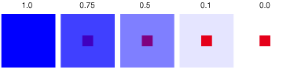
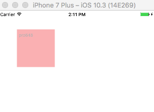
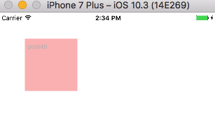
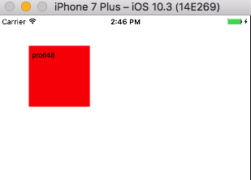
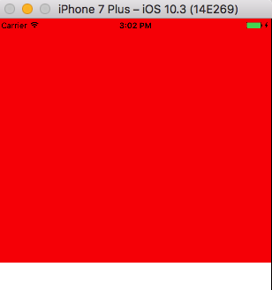
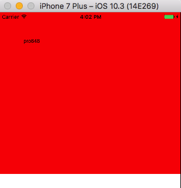

## 1. alpha

### 1.1 alpha基本介绍

`alpha`属性值为浮点类型，范围是`0.0`至`1.0`，`0.0`代表完全透明，`1.0`代表完全不透明。

下图显示了大矩形`alpha`值分别为1.0、0.75、0.5、0.1、0.0时的情况：



下面，我们通过一段代码看下`alpha`值对视图的影响：

```
    UIView *aView = [[UIView alloc] initWithFrame:CGRectMake(0, 0, self.view.frame.size.width, self.view.frame.size.height/2)];
    [self.view addSubview:aView];
    UITextView *textView = [[UITextView alloc] initWithFrame:CGRectMake(50, 50, 100, 100)];
    textView.text = @"pro648";
    [aView addSubview:textView];
    
    textView.alpha = 0.25;
    aView.backgroundColor = [UIColor whiteColor];
    textView.backgroundColor = [UIColor redColor];
```

<a id="1"></a>

运行结果：



在上面的代码中，我们首先添加一个`UIView`对象`aView`到视图控制器的上半部分，然后在`aView`中添加`UITextView`对象`textView`。设置`aView`背景颜色为白色，`textView`背景颜色为红色，并设置`textView`的`alpha`值为`0.25`。在运行结果中我们可以看到`alpha`不仅影响视图的backgroundColor，也会影响视图上的文字。

### 1.2 改变父视图alpha的值，子视图alpha值不会改变。


```
    UIView *aView = [[UIView alloc] initWithFrame:CGRectMake(0, 0, self.view.frame.size.width, self.view.frame.size.height/2)];
    [self.view addSubview:aView];
    UITextView *textView = [[UITextView alloc] initWithFrame:CGRectMake(50, 50, 100, 100)];
    textView.text = @"pro648";
    [aView addSubview:textView];
    
    aView.alpha = 0.5;
    
    NSLog(@"aView alpha is:%f",aView.alpha);
    NSLog(@"textView alpha is:%f",textView.alpha);
```

运行后输出如下：

```
aView alpha is:0.500000
textView alpha is:1.000000
```

可以看到改变`aView`的`alpha`值，子视图`textView`的`alpha`值不会改变。

### 1.3 改变父视图alpha的值，子视图alpha值虽然不会改变，但视图绘制效果是由该视图及其父视图`alpha`值的乘积决定。

更新代码如下：

```
    UIView *aView = [[UIView alloc] initWithFrame:CGRectMake(0, 0, self.view.frame.size.width, self.view.frame.size.height/2)];
    [self.view addSubview:aView];
    UITextView *textView = [[UITextView alloc] initWithFrame:CGRectMake(50, 50, 100, 100)];
    textView.text = @"pro648";
    [aView addSubview:textView];
    
    aView.alpha = 0.5;
    textView.alpha = 0.5;
    aView.backgroundColor = [UIColor whiteColor];
    textView.backgroundColor = [UIColor redColor];
    
    NSLog(@"aView alpha is:%f",aView.alpha);
    NSLog(@"textView alpha is:%f",textView.alpha);
```

上面代码里设置`aView`和`textView`的`alpha`值均为`0.5`，所以视图最终显示的`alpha`值为：0.5*0.5=0.25。

运行结果如下：



仔细观察，你会发现该视图显示效果与[1](#1) 中的视图显示效果一致，均为0.25。但是视图本身的`alpha`值并没有被改变，控制台输出结果如下所示：

```
aView alpha is:0.500000
textView alpha is:0.500000
```

### 1.4 如果只想设定视图背景颜色的alpha值而不影响其他视图的显示效果，可以使用`colorWithRed: green: blue: alpha: `方法定义一个有着特定alpha值的颜色来作为视图的背景颜色。


```
    UIView *aView = [[UIView alloc] initWithFrame:CGRectMake(0, 0, self.view.frame.size.width, self.view.frame.size.height/2)];
    [self.view addSubview:aView];
    UITextView *textView = [[UITextView alloc] initWithFrame:CGRectMake(50, 50, 100, 100)];
    textView.text = @"pro648";
    [aView addSubview:textView];
    
    aView.backgroundColor = [UIColor colorWithRed:255/255.0f green:255/255.0f blue:255/255.0f alpha:0.3];
    textView.backgroundColor = [UIColor redColor];
    
    NSLog(@"aView alpha is:%f",aView.alpha);
    NSLog(@"textView alpha is:%f",textView.alpha);
```

运行后显示如下：



可以看到，子视图`textView`的显示完全不受影响。控制台输出结果为：

```
aView alpha is:1.000000
textView alpha is:1.000000
```

### 1.5 当`alpha`为零时，视图将完全不可见，且不能响应触摸事件。

更新代码如下：

```
- (void)viewDidLoad {
    [super viewDidLoad];
    
    UIView *aView = [[UIView alloc] initWithFrame:CGRectMake(0, 0, self.view.frame.size.width, self.view.frame.size.height/2)];
    [self.view addSubview:aView];
    UITextView *textView = [[UITextView alloc] initWithFrame:CGRectMake(50, 50, 100, 100)];
    textView.text = @"pro648";
    [aView addSubview:textView];
    
    textView.alpha = 0;
    aView.backgroundColor = [UIColor redColor];
    textView.backgroundColor = [UIColor greenColor];
    [textView addGestureRecognizer:[[UITapGestureRecognizer alloc] initWithTarget:self action:@selector(handleTapGesture:)]];
    
    NSLog(@"aView alpha is:%f",aView.alpha);
    NSLog(@"textView alpha is:%f",textView.alpha);
}

- (void)handleTapGesture:(UITapGestureRecognizer *)tapGesture {
    NSLog(@"Single Tap");
}
```

把`textView`视图`alpha`设定为零，并添加点击手势。运行后如下：



可以看到`textView`视图和文本都没有显示，且点击`CGRectMake(50, 50, 100, 100)`区域，控制台没有任何输出。

事实上，iOS上不可见的视图均不可响应事件。

> 另外，改变`alpha`值的过程也可以使用动画。

## 2. clearColor

`backgroundColor`是出现在`UIView`背面颜色的特殊色调，`clearColor`的grayscale和alpha值都是`0.0`，即没有背景颜色，像玻璃一样可以透过当前视图显示下面视图。

```
- (void)viewDidLoad {
    [super viewDidLoad];
    
    UIView *aView = [[UIView alloc] initWithFrame:CGRectMake(0, 0, self.view.frame.size.width, self.view.frame.size.height/2)];
    [self.view addSubview:aView];
    UITextView *textView = [[UITextView alloc] initWithFrame:CGRectMake(50, 50, 100, 100)];
    textView.text = @"pro648";
    [aView addSubview:textView];
    
    aView.backgroundColor = [UIColor redColor];
    textView.backgroundColor = [UIColor clearColor];
//    textView.backgroundColor = nil;	// 即不设置背景颜色。
    [textView addGestureRecognizer:[[UITapGestureRecognizer alloc] initWithTarget:self action:@selector(handleTapGesture:)]];
    
    NSLog(@"aView alpha is:%f",aView.alpha);
    NSLog(@"textView alpha is:%f",textView.alpha);
}

- (void)handleTapGesture:(UITapGestureRecognizer *)tapGesture {
    NSLog(@"Single Tap");
}
```

运行后如下图：



设置为`clearColor`的`textView`没有颜色，直接透过显示后面`aView`视图的颜色，所以`clearColor`就像一层玻璃。另外`clearColor`视图上的文字是可见的。点击`textView`上文本区域，控制台会输出*Single Tap*，说明视图会响应触摸事件。

`backgroundColor`默认值是`nil`，这时视图也是透明的背景颜色，但其与`clearColor`不同。`textView`背景色为`nil`时，使用`NSLog(@"%@",textView.backgroundColor)`输出，控制台输出为（null）；`textView`背景色为`clearColor`时，使用`NSLog(@"%@",textView.backgroundColor)`输出，控制台输出为*UIExtendedGrayColorSpace 0 0*。

## 3. opaque

`opaque`不透明的，该属性是BOOL类型，用于确定视图是否不透明。

该属性为绘图系统提供了如何处理视图的提示。如果设置为`YES`，绘图系统将视图视为完全不透明，这样可以使绘图系统优化一些绘图操作，并提高性能；如果设置为`NO`，则绘图系统会把该视图与其他视图合成，形成最终视图。默认值为`YES`。

一个不透明的视图其内容将会是完全不透明，也就是内容的`alpha`值应为`1.0`。如果视图为部分透明或完全透明，需要把`opaque`设为`NO`；如果设置为`YES`将产生不可预期的结果。

只需要为`UIView`的子类在使用`drawRect: `方法时设定`opaque`属性，`opaque`对系统提供的类(如:UIButton、UILabel、UITableViewCell等)没有效果。

## 4. hidden

`hidden`属性是BOOL类型，用于确定视图是否隐藏。设置为`YES`时，隐藏视图；设置为`NO`时，显示视图。

被设置为隐藏的视图，会从窗口中消失，不能接收输入事件。但它仍然存在于视图层级中，并像往常一样参与自动布局调整。如果被隐藏的视图有子视图，其子视图也会一起隐藏。

如果被隐藏的视图处于第一响应，则下一有效视图自动成为新的第一响应。

此属性的值仅反映接收者的状态，并不考虑视图层级中父视图的状态。因此，如果视图`hidden`属性是`NO`，但父视图被隐藏，则该视图仍然被隐藏。

> `alpha`值为`0`、`hidden`属性为`YES`都可以隐藏视图，其不同之处在于：使用`alpha`隐藏视图其过程可以是动画的，而使用`hidden`属性则不可以。

参考资料：

1. [UIView alpha vs. UIColor alpha](https://stackoverflow.com/questions/20423390/uiview-alpha-vs-uicolor-alpha)
2. [What is the impact of view.alpha = 0 vs view.hidden = YES?](https://stackoverflow.com/questions/5146947/what-is-the-impact-of-view-alpha-0-vs-view-hidden-yes)
3. [opaque](https://developer.apple.com/documentation/uikit/uiview/1622622-opaque)
4. [alpha](https://developer.apple.com/documentation/uikit/uiview/1622417-alpha?language=objc)
5. [hidden](https://developer.apple.com/documentation/uikit/uiview/1622585-hidden?language=objc)
