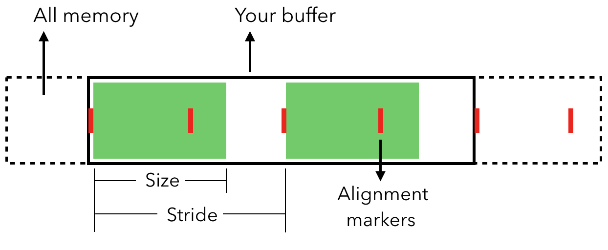

这篇文章是我学习Swift中enum的记录，主要涉及enum在内存中是如何布局的，占用多少内存，Raw Value和Associated Value是否影响内存占用。

## 1. MemoryLayout

`MemoryLayout`描述实体占用内存大小、分配内存大小、对齐方式。

- size：实体占用连续内存大小。单位byte。
- stride：分配内存大小，从上一个实体的开始到下一个实体的开始字节数。单位byte。
- alignment：默认对齐方式。单位byte。



其用法比较简单，一种类方法，一种实例方法。类方法入参是对象`MemoryLayout<T>.size/stride/alignment`，实例方法入参是实例`MemoryLayout.size/stride/alignment(ofValue: instance)`。

如下示例声明了`Point`结构体，包含`x`、`y`、`isFilled`属性。

```
struct Point {
    let x: Double
    let y: Double
    let isFilled: Bool
}
```

`size`、`stride`和`alignment`可以通过`MemoryLayout<Point>`的类属性查看：

```
MemoryLayout<Point>.size // 17
MemoryLayout<Point>.stride // 24
MemoryLayout<Point>.alignment // 8
```

分配内存或计算实例之间内存时，永远使用实体的`stride`，而非`size`。下面的示例开辟了4个`Point`实体大小内存：

```
let count = 4
let pointPointer = UnsafeMutableRawPointer.allocate(byteCount: count * MemoryLayout<Point>.stride, alignment: MemoryLayout<Point>.alignment)
```

## 2. enum内存占用

Swift中的`enum`与C语言中的共用体（union）很像，内存大小为最大case占用内存加标记位大小。

#### 2.1 无原始值和关联值内存占用

```
enum Direction {
    case east, west, south, north
}
```

`size`、`stride`和`alignment`如下：

```
MemoryLayout<Direction>.size    // 1
MemoryLayout<Direction>.stride  // 1
MemoryLayout<Direction>.alignment   // 1
```

其只有一个标记位，占用一个字节。

#### 2.2 原始值内存占用

枚举可以包含原始值（rawValue）:

```
enum MyEnum: Int {
    case a = 0
    case b = 1
    case c = 2
}
```

使用`MemoryLayout`查看其内存：

```
let myEnum = MyEnum.b
MemoryLayout.size(ofValue: myEnum)    // 1
MemoryLayout.stride(ofValue: myEnum)  // 1
MemoryLayout.alignment(ofValue: myEnum)   // 1
```

`rawValue`并没有占用自身内存。因为其内部实现类似这样：

```
enum MyEnum: Int {
    case a = 0
    case b = 1
    case c = 2
    
    var rawValue: Int {
        switch self {
        case .a:
            return 0
        case .b:
            return 1
        case .c:
            return 2
        }
    }
}
```

#### 2.3 关联值内存占用

如下枚举包含关联值：

```
enum MyEnum2 {
    case mostCommonlyUsed
    case somewhatCommon (Int,Int)
    case prettyRare (Int,Int,Int,Int,Int)
}
```

使用`MemoryLayout`查看其内存：

```
MemoryLayout<MyEnum2>.size    // 41
MemoryLayout<MyEnum2>.stride  // 48
MemoryLayout<MyEnum2>.alignment   // 8
```

其占用内存大小是41字节，这意味着枚举tag位于数据的尾部。如果tag位于数据的开始部分，其需要额外的7个字节作为padding。但stride仍然为48，以便满足内存对齐。

如果枚举最大值占用内存比2的幂数小一，则枚举可以少占用七个字节内存。如果你对内存占用要求很高，则可以考虑这种优化。

#### 2.4 递归枚举 Recursive Enumeration

递归枚举是枚举的一个或多个case的关联值是枚举自身。在case前使用`indirect`标记出，编译器根据`indirect`插入转发层。

添加`indirect`后，内联存储的case会指向单独的内存空间：

```
enum MyEnum2 {
    case mostCommonlyUsed
    case somewhatCommon (Int,Int)
    indirect case prettyRare (Int,Int,Int,Int,Int)
}

MemoryLayout<MyEnum2>.size    // 17
MemoryLayout<MyEnum2>.stride  // 24
MemoryLayout<MyEnum2>.alignment   // 8
```

> 在enum前添加`indirect`可以给所有有关联值的case增加indirection。

参考资料：

1. [Memory used by enums](https://forums.swift.org/t/memory-used-by-enums/2060)
2. [Enum Memory Usage](https://stackoverflow.com/questions/35912242/enum-memory-usage)
3. [When exactly do I need "indirect" with writing recursive enums?](https://stackoverflow.com/questions/70392579/when-exactly-do-i-need-indirect-with-writing-recursive-enums)
