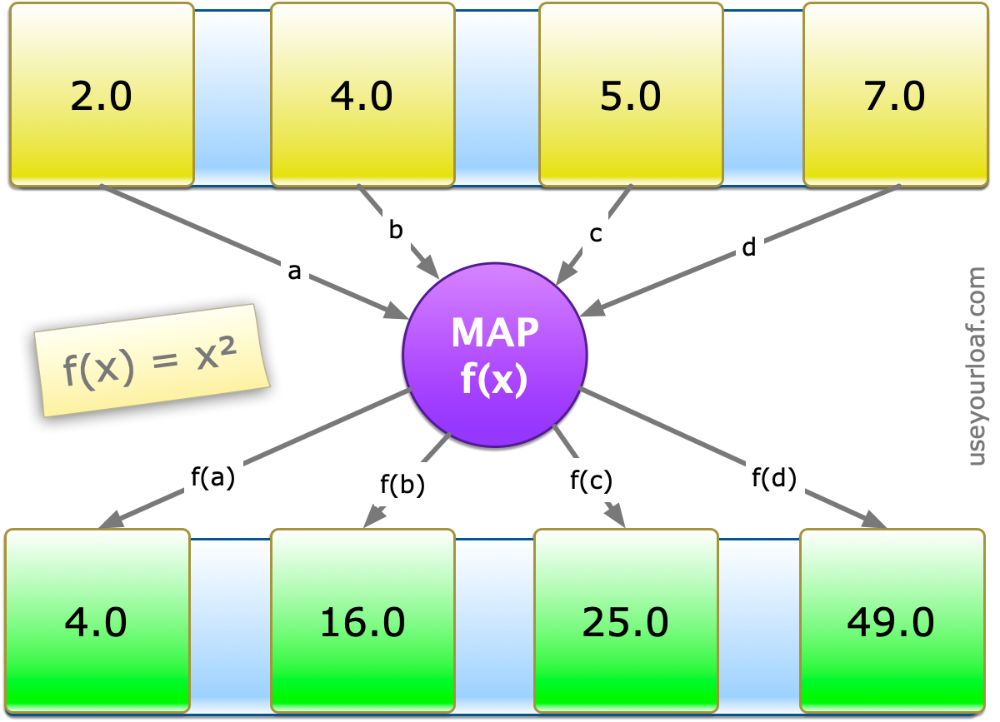
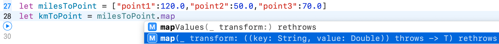
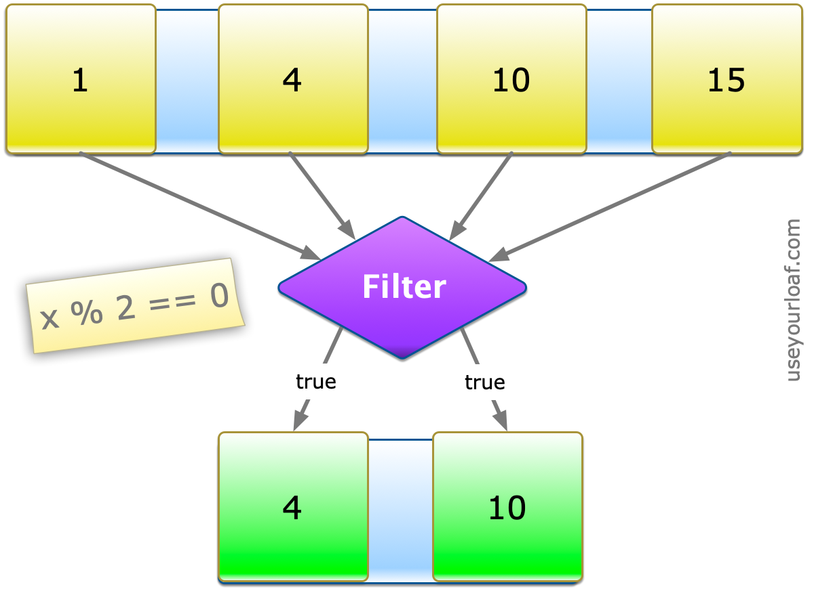
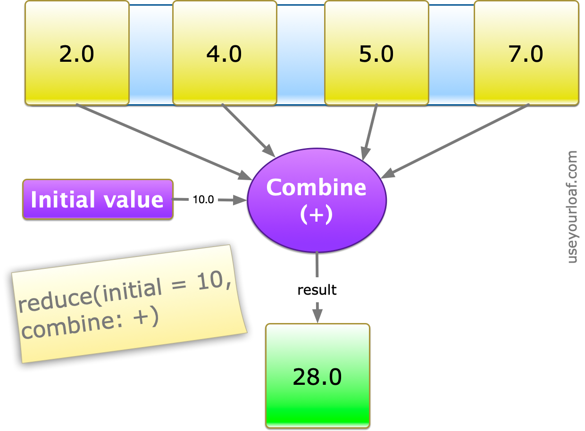

Swift中的`map`、`filter`、`reduce`可以对Array、Dictionary等集合进行操作。如果你没有函数式编程经验，你可能更习惯于使用for-in遍历。这一篇文章将介绍`map`、`filter`、`reduce`、`flatMap`和`compactMap`的用法。

Swift中的`map`、`reduce`和`filter`函数来自于函数式编程（functional programming），被称为高阶函数（high-order function）。高阶函数是至少满足下列一个条件的函数：

- 接受一个或多个函数作为输入
- 输出一个函数

在数学中，也叫做算子。微积分中的导数就是常见的例子，它会映射一个函数到另一个函数。

## 1. Map

```
func map<T>(_ transform: (Self.Element) throws -> T) rethrows -> [T]
```

`map`用于遍历序列（sequence），并对每个元素执行相同操作。`map`函数对所有元素执行完映射或转换后，返回一个包含所有元素的数组，元素类型可以是原来的类型，也可以是新类型。



我们可以使用`for-in`循环计算数组元素的平方，如下：

```
let values = [2.0, 4.0, 5.0, 7.0]
var squares: [Double] = []
for value in values {
    squares.append(value*value)
}
```

`for-in`可以解决问题，但代码有些冗余。需要声明指定类型的数组，以便在循环时添加元素；数组还需为变量。使用`map`实现如下：

```
let squares2 = values.map {$0 * $0}
```

与`for-in`相比，`map`有了很大的提升。`squares2`是一个常量，Swift可以自动推断其类型。

刚接触简写的闭包语法时，可能不易理解。`map`函数只有一个参数，即尾随闭包（一个函数）。`map`遍历集合元素时调用闭包，闭包接收传入的元素，并返回一个结果。`map`函数以数组的形式返回最终结果。

`map`函数完整格式如下：

```
let squares3 = values.map({
    (value: Double) -> Double in
    return value * value
})
```

闭包包含一个参数：`(value: Double)`，返回一个`Double`类型的值，Swift的自动推断可以推断出这些。由于`map`只包含一个参数，且是闭包，`(` `)`也可以省略。闭包内只有一行代码时，`return`也可以省略。更新后如下：

```
let squares4 = values.map {value in value * value}
```

`in`关键字将闭包的参数和主体分开，这里可以进一步将参数省略，使用带编号的参数：

```
let squares5 = values.map { $0 * $0 }
```

`map`返回数组数据类型可以和原数组不一致。下面将数值类型转换为字符串类型：

```
let scores = [0, 28, 648]
let words = scores.map { NumberFormatter.localizedString(from: $0 as NSNumber, number: .spellOut) }
// ["zero", "twenty-eight", "six hundred forty-eight"]
```

`map`函数除了用于数组，还可用于其他集合类型，例如字典、Set，但返回结果永远是数组。如下所示：

```
let milesToPoint = ["point1":120.0,"point2":50.0,"point3":70.0]
let kmToPoint = milesToPoint.map { $1 * 1.6093 }
// [193.11599999999999, 80.465, 112.651]
```

上面遍历字典时，闭包的两个参数分别为key和value。如果无法区分出参数类型，可以查看Xcode自动补全的提示：



## 2. Filter

```
func filter(_ isIncluded: (Self.Element) throws -> Bool) rethrows -> [Self.Element]
```

`filter`函数返回符合指定条件的有序数组。`isIncluded`是一个闭包，接收序列的元素，返回`Bool`类型值，以指示该元素是否应包含在返回的数组中。`filter`复杂度为`O(n)`，n为序列的长度。



`filter`函数只包含一个参数，即闭包。在闭包内添加需满足的条件，返回值为`Bool`类型。`true`表示会把元素添加到结果的数组中；`false`表示不会添加。

下面使用`filter`过滤奇数，只把偶数添加到数组中：

```
let digits = [1,4,10,15]
let even = digits.filter { $0 % 2 == 0 }
// [4, 10]
```

## 3. Reduce

`reduce`将集合中的所有元素合并为一个新的值。



`reduce`函数声明如下：

```
func reduce<Result>(_ initialResult: Result, _ nextPartialResult: (Result, Element) throws -> Result) rethrows -> Result
```

- `initialResult`：作为初始值，首次调用闭包时传递给`nextPartialResult`。
- `nextPartialResult`：闭包内将已经组合的值与新的元素合并，并在下一次调用`nextPartialResult`闭包时使用，最后返回给调用方。如果集合没有元素，返回结果为`initialResult`。

`reduce(_:_:)`复杂度为`O(n)`。

下面将数组元素值与初始值10相加：

```
let items = [2.0, 4.0, 5.0, 7.0]
let total = items.reduce(10.0) { partialResult, value in
    partialResult + value
}
// 28.0
```

闭包可以进一步简化：

```
let total = items.reduce(10.0, +)
```

`reduce`也可用于拼接数组中的字符串：

```
let codes = ["abc","def","ghi"]
let text = codes.reduce("1", +)
1abcdefghi
```

## 4. FlatMap和CompactMap

`flatMap`和`compactMap`是`map`的变体，适用于以下三种场景：

#### 4.1 `flatMap`用于处理序列，并返回序列

```
Sequence.flatMap<S>(_ transform: (Element) -> S)
    -> [S.Element] where S : Sequence
```

序列调用`flatMap`后，每个元素都会执行闭包逻辑，并返回 flatten 结果：

```
let results = [[5,2,7], [4,8], [9,1,3]]
let allResults = results.flatMap { $0 }
// [5, 2, 7, 4, 8, 9, 1, 3]

let passMarks = results.flatMap { $0.filter { $0 > 5} }
// [7, 8, 9]
```

#### 4.2 `flatMap`处理可选项

闭包接收可选类型中的非nil值，返回可选类型：

```
Optional.flatMap<U>(_ transform: (Wrapped) -> U?) -> U?
```

如果可选类型为`nil`，`flatMap`也会返回`nil`：

```
let input: Int? = Int("8")
let passMark: Int? = input.flatMap { $0 > 5 ? $0 : nil }
// Optional(8)
```

#### 4.3 `compactMap`处理序列，返回可选类型

```
Sequence.compactMap<U>(_ transform: (Element) -> U?) -> U?
```

这种用途的`flatmap`在Swift 4.1（Xcode 9.3）被重命名为`compactMap`。为移除数组中的`nil`元素提供了一种简便操作：

```
let keys: [String?] = ["Tom", nil, "Peter", nil, "Harry"]
let validNames = keys.compactMap { $0 }
validNames
// ["Tom", "Peter", "Harry"]

let counts = keys.compactMap { $0?.count }
counts
// [3, 5, 5]
```

## 5. 链式使用

可以将`map`、`filter`和`reduce`组合使用。例如，计算数组中元素值大于等于5之和，可以先`filter`，再`reduce`。如下所示：

```
let marks = [6, 4, 8, 2, 9, 7]
let totalPass = marks.filter{$0 >= 5}.reduce(0, +)
// 30
```

计算数组元素值平方，并返回偶数。因为奇数的平方仍然是奇数，可以先过滤掉奇数，再做转换：

```
let numbers = [648, 17, 35, 4, 12]
let evenSquares = numbers.filter{$0 % 2 == 0}.map{$0 * $0}
// [419904, 16, 144]
```

## 总结

以后遇到`for-in`遍历集合时，可以考虑是否可以使用`map`、`filter`、`reduce`替换：

- `map`：将sequence元素转换后，以数组形式返回。
- `filter`：只有满足条件的元素会被放到数组返回。
- `reduce`：每个元素都会调用 combine closure，首次调用时与`initialResult`组合。

参考资料：

1. [Swift Guide to Map Filter Reduce](https://useyourloaf.com/blog/swift-guide-to-map-filter-reduce/)
2. [Map, Reduce and Filter in Swift](https://learnappmaking.com/map-reduce-filter-swift-programming/)

