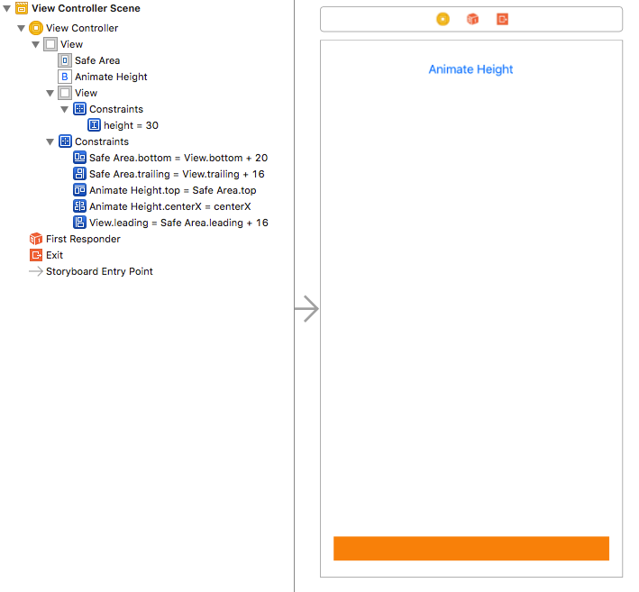
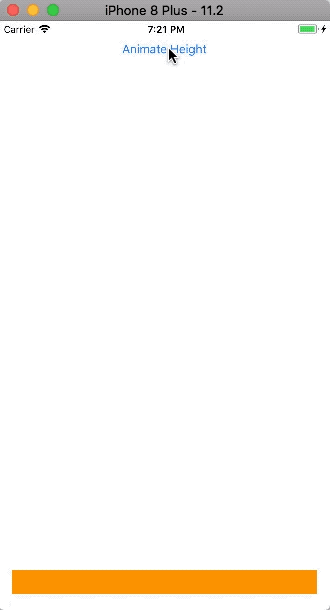
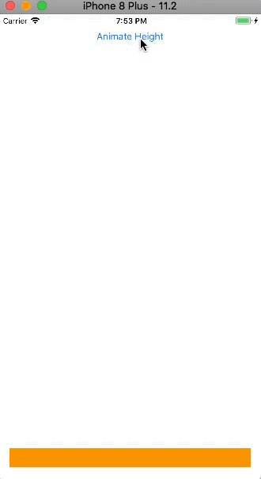
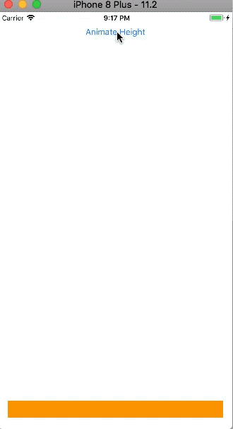

这篇文章主要讨论`setNeedsLayout`和`layoutIfNeeded`的差异，在这个过程中我们将用动画（通过修改视图约束实现）来展示其不同之处。在此之前，首先了解下iOS应用程序的main run loop、[Auto Layout](https://github.com/pro648/tips/wiki/Auto-Layout%E7%9A%84%E4%BD%BF%E7%94%A8)。

作为正常启动过程的一部分，iOS中的`UIApplication`在主线程上运行app的main run loop。主运行循环处理事件（如用户触摸）和基于视图的界面更新。当事件（如触摸、位置更新、多媒体控制、motion等）发生时，run loop会找到事件的相应处理程序，调用对应方法。在某一时刻，所有事件都已被处理，控制返回到run loop，将这一刻称为更新周期（update cycle），这也是Apple在文档中的做法。你也可以使用其他术语对其进行概念化，例如：动作中断(a break in the action)、重绘周期(redraw cycle)、空闲时刻(a free moment)。

当事件正在处理和分发时更改视图，这些操作并不会立即执行。相反，系统会记录更改，并将视图标记为需要重绘，在下一更新周期重新布局视图。因为所有这些发生的都很快，一般在用户看来并不需要等待重新绘制。知道处理事件和更新布局之间有时间间隔，有助于理解`setNeedsLayout`和`layoutIfNeeded`。

现在，可以通过引用上面的update cycle来查看这两种方法之间的区别。

- `setNeedsLayout`：当需要调整`UIView`子视图布局时，需要在主线程调用该方法。该方法记录请求并立即返回(即异步执行)，等待下一个更新周期更新视图。因此，可以将多个视图布局更新合并到一个update cycle，这样有助于提高性能。需要注意的是，我们无法知道下个update cycle在何时发生。
- `layoutIfNeeded`：强制视图立即更新其布局，即[同步](https://github.com/pro648/tips/wiki/Grand-Central-Dispatch%E7%9A%84%E4%BD%BF%E7%94%A8#14-%E5%90%8C%E6%AD%A5synchronous)执行。当使用Auto Layout时，布局引擎根据约束的变化更新视图的位置。该方法的接收者将作为根视图，布局时也将从视图树的根视图开始。如果没有待处理的布局更新，则此方法将直接退出，而不会修改布局，或调用任何与布局有关的方法。

在开始demo前，有一个关于Auto Layout和update cycle的概念。实际上布局和绘制视图时有三个阶段：

1. 第一阶段更新约束(constraint pass)，这发生在底部。
2. 第二阶段布局视图和子视图(layout pass)，其自上到下发生，且和约束设置有关。
3. 第三阶段显示视图(display pass)，根据布局信息(layout pass)重新绘制视图。

## 1. 创建demo

创建Single View Application模版的demo，在storyboard中添加一个`UIView`，设置其背景色为`orangeColor`，添加一个`UIButton`用来更新视图高度的约束。如下所示：



## 2. layoutIfNeeded

创建视图高度约束的IBOutlet；创建`UIButton`的响应方法，用来修改视图高度约束。这样当点击按钮时，视图高度将变大或变小。代码如下：

```
@interface ViewController ()

@property (weak, nonatomic) IBOutlet NSLayoutConstraint *orangeViewHeight;  // 默认高度约束为30。

@end

@implementation ViewController

- (IBAction)buttonTapped:(UIButton *)sender {
	// 任何在等待update cycle中的更新现在都会被立即执行，Apple认为这是一个最佳实践。
    [self.view layoutIfNeeded];
    
    // 修改高度的约束。
    if (self.orangeViewHeight.constant == 30) {
        self.orangeViewHeight.constant = self.view.bounds.size.height - 100;
    } else {
        self.orangeViewHeight.constant = 30;
    }
    
    //
    [UIView animateWithDuration:2.0 animations:^{
    	// view需要立即重新布局。
        [self.view layoutIfNeeded];
    }];
}
```

当修改高度约束后，会自动执行`setNeedsLayout`等价操作，其会自动在下一个update cycle更新视图，而不需要显式调用`setNeedsLayout`方法。但这一更新过程不是动画形式。在上面的代码中，使用了一个2秒钟的动画，在动画中使用`layoutIfNeeded`强制立即刷新。因为这一布局过程是同步执行，视图约束的变化会被动画捕捉到。

运行demo，效果如下：



## 3. setNeedsLayout

在动画中，使用`setNeedsLayout`替换`layoutIfNeeded`方法。如下所示：

```
- (IBAction)buttonTapped:(UIButton *)sender {
    ...
    [UIView animateWithDuration:2.0 animations:^{
    	// 标记view需要重新布局。
        [self.view setNeedsLayout];
    }];
}
```

动画中的`setNeedsLayout`只是标记视图需要重新布局，且标记后立即返回，即在block内视图没有变化，因此，也不会产生动画。

点击按钮，视图会根据约束迅速变化，但不会有动画。



> 注释掉动画部分代码，运行不会有变化。

动画是在自身线程执行，而非在update cycle所在的主线程。此外，动画在下一个update cycle时被触发。在动画过程中，进度更新会被发送到主线程，这些增量产生了动画。动画中的`setNeedsLayout`不会对视图进行更改，并发送更新以供显示。相反，一旦代码在IBAction中完成，并且没有更多事件需要处理，则会发生更新周期。此时，不通过任何动画立即更新布局。

更新代码如下所示，可以更清晰看出其区别：

```
- (IBAction)buttonTapped:(UIButton *)sender {
    // 任何在等待update cycle中的更新现在都会被立即执行，Apple认为这是一个最佳实践。
    [self.view layoutIfNeeded];
    
    // 修改高度的约束。
    if (self.orangeViewHeight.constant == 30) {
        self.orangeViewHeight.constant = self.view.bounds.size.height - 100;
    } else {
        self.orangeViewHeight.constant = 30;
    }
    
    // 立即更新布局。
    [self.view layoutIfNeeded];     // 该布局更新没有动画。
    
    //
    [UIView animateWithDuration:2.0 animations:^{
        // 修改约束，并立即重新布局。
        self.orangeViewHeight.constant = 200;
        [self.view layoutIfNeeded];     // 该布局更新会以动画形式呈现。
    }];
}
```

运行demo，如下所示：




## 4. layoutSubviews

在iOS 5.1之后，`layoutSubviews`默认使用你设置的约束来确定子视图的大小和位置。

子类根据需要重写此方法，以执行更为精确的子视图布局。只有在子视图的autoresizing和约束不能满足布局要求时，才应该重写`layoutSubviews`。重写该方法时，可以直接设置子视图的frame。

不要直接调用`layoutSubviews`方法。如果要强制更新布局，使用`setNeedsLayout`方法；如果需要立即更新布局，调用`layoutIfNeeded`方法。

> `layoutSubviews`就像重新绘制中的`drawRect:`。`layoutSubviews`用来布局，`drawRect:`用来绘制。

iOS中缓存视图用的非常多，通常视图只绘制一次，而不需要更新。

当`UIView`的`contentMode`属性被设置为`UIViewContentModeRedraw`常量时，修改`bounds`属性视图会进行重绘；`contentMode`属性设置为其他常量时，修改视图`bounds`，或者其他视图覆盖当前视图，视图只会进行重新布局，不会进行重绘。

参考资料：

1. [setNeedsLayout vs layoutIfNeeded Explained](http://www.iosinsight.com/setneedslayout-vs-layoutifneeded-explained/)

2. [What is the relationship between UIView's setNeedsLayout, layoutIfNeeded and layoutSubviews?](https://stackoverflow.com/questions/2807137/what-is-the-relationship-between-uiviews-setneedslayout-layoutifneeded-and-lay)

   ​