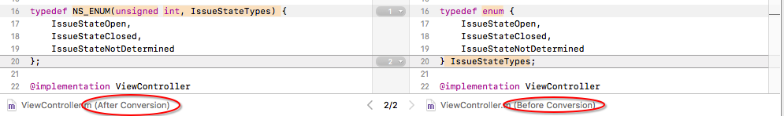

如果你是一个游戏开发者，你会经常需要描述一个属性的不同变量。无论是攻击类型（近战、冰块、火焰、毒气等），还是敌人状态（空闲、惊动、追逐、攻击、休息等）都需要使用很多变量。最基础的实现方法如下：

```
    static NSInteger NONE = 0;
    static NSInteger MELEE = 1;
    static NSInteger FIRE = 2;
    static NSInteger ICE = 3;
    static NSInteger POISON = 4;
    NSInteger attackType = NONE;
```

这种方法的缺点是你不能控制赋给`attackType`值，其可以是任何整数值，你也可能使用`++attackType`这种愚蠢的方法。

Objective-C和Swift中的枚举（enumeration，缩写为enum）可以很好的解决这个问题：

```
    typedef NS_ENUM (NSInteger, AttackType) {
        None,
        Melee,
        Fire,
        Ice,
        Posion
    };
```

这一篇文章我们首先介绍`enum`、`typedef`，然后介绍Apple目前推荐的`NS_ENUM`和`NS_OPTIONS`枚举方式。

## 1. 定义枚举

常见的枚举语句如下：

```
enum IssueStateTypes {
  IssueStateOpen,
  IssueStateClosed,
  IssueStateNotDetermined
};
```

上面的语句定义了`IssueStateTypes`枚举类型数据，`IssueStateTypes`类型对象只能赋值为`IssueStateOpen`、`IssueStateClosed`或`IssueStateNotDetermined`。如果赋其他值，编译器会发出警告。

声明`enum IssueStateTypes`类型变量时，需要用到关键字`enum`，如下所示：

```
enum IssueStateTypes IssueState;
// 赋值
IssueState = IssueStateOpen;
```

> 定义枚举类型时，必须确保枚举标志符与相同作用域内变量名和其他标志符不同。

## 2. typedef语句

通过使用typedef语句，可以为数据类型另外指派一个名称。

```
// 定义名称Counter和int等效。
typedef int Counter;
```

现在声明`Counter`类型的变量：

```
Counter m, n;
// 与下面声明相同。
int m, n;
```

typedef也可以定义枚举类型、结构类型。下面语句定义的`enum IssueStateTypes`和`IssueStateTypes1`等效。

```
    // 1. 定义IssueStateTypes1和enum IssueStateTypes等效。
    typedef enum IssueStateTypes IssueStateTypes1;
    IssueStateTypes1 IssueState1;
    
    // 2. 与1等效。
    enum IssueStateTypes IssueState2;
    
    // 3. 赋值
    IssueState1 = IssueStateOpen;
    IssueState2 = IssueStateClosed;
```

使用typedef可以增加变量的可读性，清晰看出这些变量的使用目的。

另外，定义枚举类型、变量可以合并在一起，如下：

```
typedef enum IssueStateTypes {
    IssueStateOpen,
    IssueStateClosed,
    IssueStateNotDetermined
} IssueStateTypes;

// 和下面效果一致。
enum IssueStateTypes {
    IssueStateOpen,
    IssueStateClosed,
    IssueStateNotDetermined
};
typedef IssueStateTypes IssueStateTypes;
```

## 3. 定义匿名枚举

如果你不需要使用`enum IssueState`，可以省略枚举类型名称，即声明为匿名（anonymous）枚举类型。

```
typedef enum {
    IssueStateOpen,
    IssueStateClosed,
    IssueStateNotDetermined
} IssueStateTypes;

// 赋值
IssueStateTypes IssueState = IssueStateClosed;
```

这里声明`IssueStateTypes`为匿名枚举类型的名称，其声明的变量只能设置为枚举中的值。

## 4. 声明枚举值的类型

定义枚举类型时，可以将整数类型和枚举名称对应起来。这样，在赋值、使用switch枚举常量时，可以进行类型检查。

```
typedef enum IssueStateTypes : NSUInteger {
    IssueStateOpen,
    IssueStateClosed,
    IssueStateNotDetermined
} IssueStateTypes;

// 枚举类型名称可以省略。
typedef enum : NSUInteger {
    IssueStateOpen,
    IssueStateClosed,
    IssueStateNotDetermined
} IssueStateTypes;
```

事实上，enum的标志符均是整数。第一个标志符被设置为`0`，第二个被设置为`1`，其后依次递增。另外，也可以显式的为标志符指定值，其后标志符在指定值的基础上依次递增。

```
    enum direction {    // 值分别为
        up,             // 0
        down,           // 1
        left = 10,      // 10
        right,          // 11
    };
```

另外，枚举标志符可以共享相同的值：

```
enum UIStatusBarStyle {
    UIStatusBarStyleDefault = 0,
    UIStatusBarStyleLightContent = 1,
    UIStatusBarStyleBlackTranslucent = 1,
    UIStatusBarStyleBlackOpaque = 2
};
```

`UIStatusBarStyleLightContent`和`UIStatusBarStyleBlackTranslucent`值相同，使用时效果一致。

> 通过使用枚举，可以把整数值和有象征意义的名称对应起来。所以，在使用枚举类型时，尽量不要把枚举值当作整数这个事实。如果需要修改整数值，只能在定义枚举的地方修改。

绝大部分情况下，使用上面的enum就可以了，但enum还有更高级用法。

## 5. 按位掩码bitmask及按位运算符bitwise operator

上面的标准枚举方法中，每个标志符只能包含一个值。但如果我们在近战（melee）过程中使用火焰（fire）呢？为了解决这个问题，可以使用按位掩码（bitmask）对整型值进行编码。按位掩码运算符有按位（bitmise）与（&）、按位或（bitmise |）、一次求返（～）等。

```
    typedef enum : NSUInteger {
        None    = 0,
        Melee   = 1,
        Fire    = 2,
        Ice     = 4,
        Posion  = 8
    } AttackType;
    AttackType attackType = Melee | Fire;
```

在上面的例子中，`attackType`包含`Melee`和`Fire`两个值，在查看如何提取`attackType`值前，我们先看下其工作原理。

Enum内类型都是整型，其值与二进制数如下：

```
    typedef enum : NSUInteger {
        //     十进制        // 二进制
        None    = 0,        // 0000 0000
        Melee   = 1,        // 0000 0001
        Fire    = 2,        // 0000 0010
        Ice     = 4,        // 0000 0100
        Posion  = 8         // 0000 1000
    } AttackType;
    AttackType attackType = Melee | Fire;
```

可以看到，在二进制中每个值只有一个数字1，而且都处于不同的位。这样就可以把`attackType`看作一系列位（bit），每个位表示是否包括某个属性。如果第一位（从右侧开始）是1，为`Melee`，如果第二位是1，为`Fire`，如果第三位是1，表示`Ice`，以此类推。需要注意的是，每个值的二进制必须只包括一个数字1，稍后会有简便方法实现这一需求。

> 如果设备是32位的，枚举类型不能超过32个。如果设备是64位的，枚举类型不能超过64个。

Bitmask本质上是一个整数值，其中，二进制属性（1是/0否）独立存在于位中。要想对其进行操作，我们需要了解位运算符（bitwise operator）。

##### 5.1 按位或OR（符号为`|`）

在对两个值执行按位或运算时，会逐位比较两个值的二进制数，只要有一位值是1，结果对应位即为1。

按位或用来设置位值，可以增加新技能。

```
    AttackType attackType = Melee | Fire;
    //                  二进制   十进制
    // Melee            000001   1
    // Fire             000010   2
    // Melee | Fire     000011   3
```

##### 5.2 按位与AND（符号为`&`）

执行与运算时，会逐位比较两个值的二进制数，只有在对应位上都为1时，结果对应位上才是1。

按位或用来设置位值，按位与用来解除之前保存位的值。可以用来解除该技能外所有技能。

```
    //                      二进制   十进制
    // Ice:                 000100 = 4
    // MeleeAndFire:        000011 = 3
    // MeleeAndFire & Ice:  000000 = 0
    
    // Fire:                000010 = 2
    // MeleeAndFire:        000011 = 3
    // MeleeAndFire & Fire: 000010 = 2
```

> 与运算符`&`优先级高于或运算符`|`。

##### 5.3 一次求返bitwise not（符号为`～`）

一次求返运算符是一元运算符，其他运算符均为两元运算符。其将位中的1翻转为0，位中的0翻转为1。

这个会非常实用，如将近战火焰改为近战冰块。

```
    AttackType attackType;
    attackType = Melee | Fire;
    
    // 1
    attackType &= ~Fire;
    // 2
    attackType |= Ice;
```

上述代码分步说明如下：

1. 通过对`Fire`一次求返后，除`Fire`位（第二位）为0，其他位均为1。与`attackType`按位与运算后会取消`Fire`，但其它位不变。
2. 添加冰块攻击。

##### 5.4 按位异或运算符XOR（符号为`^`）

逐位比较两个运算数的二进制，只有在一个位是1，另一个数对应位不是1时，结果的对应位才是1。

XOR可以用来关闭值。

```
    AttackType attackType;
    attackType = Melee | Fire | Posion;
    
    attackType ^= Fire;    // 关闭Fire
    attackType ^= Posion;  // 关闭Posion
```

##### 5.5 向左移位运算符（符号为`<<`）

对值进行向左移动，超出数据项的高位将丢失，低位移入的值总为0，该操作需要说明位移动数目。

通过该运算，可以简洁的创建bitmask所需的数值。

```
    typedef enum AttackType : NSUInteger {
        //                         二进制     十进制
        None    = 0,            // 000000      0
        Melee   = 1 << 0,       // 000001      1
        Fire    = 1 << 1,       // 000010      2
        Ice     = 1 << 2,       // 000100      4
        Posion  = 1 << 3        // 001000      8
    } AttackType;
```

> 还有向右移位`>>`运算符，从值的低位移出的值将丢失。无符号的值向右移位总是在高位（左侧）移入0，对于有符号值而言，左侧移入1还时0取决于被移动数字的符号，还取决于该操作在系统中的实现方式。
>
> 如果符号位是0（即值为正数），都移入0；如果符号位是1，则有些计算机将移入1，有些计算机将移入0。前者称为算数右移，后者称为逻辑右移。
>
> 对于系统会使用算数右移还是逻辑右移，我们不能进行任何猜测，否则运行时会出错。

## 6. NS_ENUM NS_OPTIONS宏

`NS_ENUM`和`NS_OPTIONS`宏使用了C语言的新特性，提供了一种简洁的方法定义enumerations和options，可以显式指定enumerations和options中类型。`NS_ENUM`的枚举可以被自动转换为Swift类型。

使用`NS_ENUM`宏定义：

```
    typedef NS_ENUM (NSInteger, IssueStateTypes) {
        IssueStateOpen,
        IssueStateClosed,
        IssueStateNotDetermined
    };
    // 赋值
    IssueStateTypes IssueState = IssueStateNotDetermined;
```

使用`NS_OPTIONS`宏定义：

```
    typedef NS_OPTIONS (NSInteger, AttackType) {
        None    = 0,
        Melee   = 1 << 0,
        Fire    = 1 << 1,
        Ice     = 1 << 2,
        Posion  = 1 << 3
    };
    // 赋值
    AttackType attackType = Posion;
```

`NS_ENUM`和`NS_OPTIONS`是一种更现代的枚举方式，文档中也在使用。

```
typedef NS_ENUM(NSInteger, UIViewAnimationTransition) {
    UIViewAnimationTransitionNone,
    UIViewAnimationTransitionFlipFromLeft,
    UIViewAnimationTransitionFlipFromRight,
    UIViewAnimationTransitionCurlUp,
    UIViewAnimationTransitionCurlDown,
};

typedef NS_OPTIONS(NSUInteger, UIViewAutoresizing) {
    UIViewAutoresizingNone                 = 0,
    UIViewAutoresizingFlexibleLeftMargin   = 1 << 0,
    UIViewAutoresizingFlexibleWidth        = 1 << 1,
    UIViewAutoresizingFlexibleRightMargin  = 1 << 2,
    UIViewAutoresizingFlexibleTopMargin    = 1 << 3,
    UIViewAutoresizingFlexibleHeight       = 1 << 4,
    UIViewAutoresizingFlexibleBottomMargin = 1 << 5
};
```

## 7. 转换枚举

如果你的代码中已经使用enum枚举，可以通过Xcode工具将其转换为更现代的枚举。

点击Xcode中的Edit > Convert > To Modern Objective-C Syntax…，可以将代码中的enum转换为`NS_ENUM`和`NS_OPTIONS`类型。另外，也可以将`id`转换为`instancetype`。



`NS_ENUM`和`NS_OPTIONS`都是Objective-C和Swift开发中提升开发体验的新特性，也再次展示了这门语言在对象化和过程化之间的辩证关系。

参考资料：

1. [What is a typedef enum in Objective-C?](https://stackoverflow.com/questions/707512/what-is-a-typedef-enum-in-objective-c)
2. [Enum, Flags and bitwise operators](http://www.alanzucconi.com/2015/07/26/enum-flags-and-bitwise-operators/)
3. [Enumeration Macros](https://developer.apple.com/library/content/releasenotes/ObjectiveC/ModernizationObjC/AdoptingModernObjective-C/AdoptingModernObjective-C.html)
4. [Declaring and checking/comparing (bitmask-)enums in Objective-C](https://stackoverflow.com/questions/16166895/declaring-and-checking-comparing-bitmask-enums-in-objective-c)