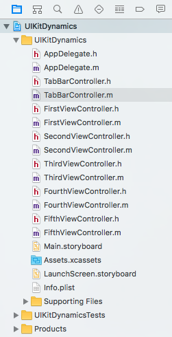
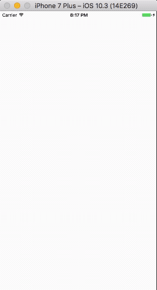
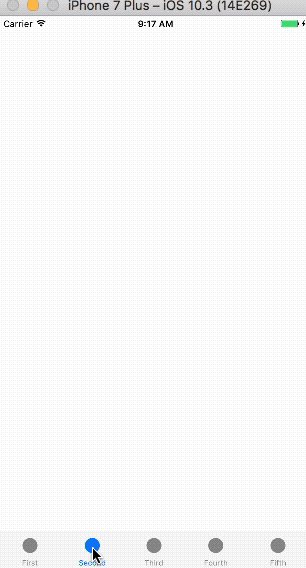
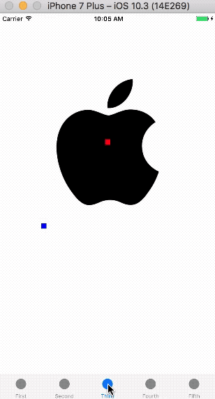
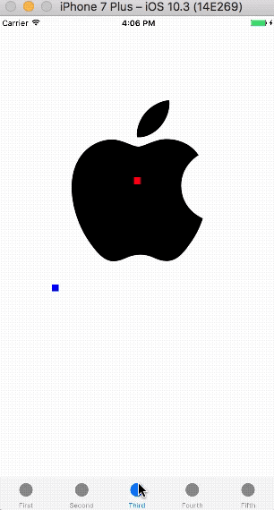
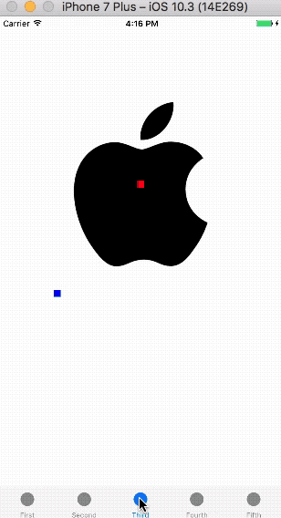
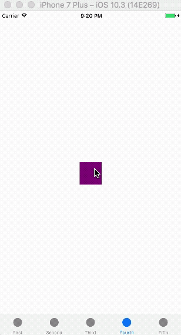
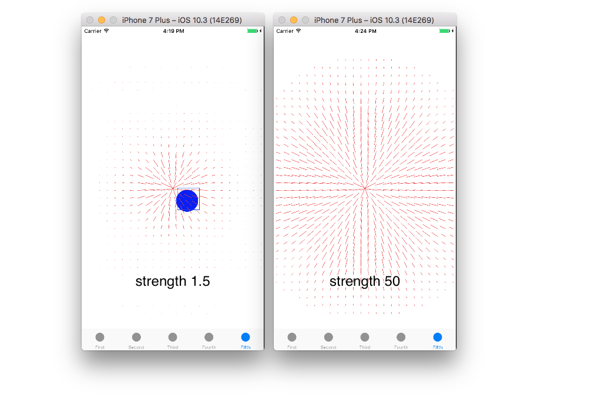
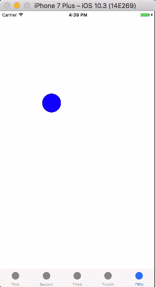

iOS 7增加了UIKit Dynamics库，其集成于`UIKit`框架中，将2D物理引擎引入了`UIKit`，提供了以最简单方式实现真实物理动画功能。`UIKit`动力学的引入，并不是为了替代`CoreAnimation`或`UIView`动画，绝大多数情况下，`CA`或`UIView`动画仍然是最优方案，只有在需要引入逼真交互设计的时候，才需要使用`UIKit`动力学。如果你在开发电子游戏，那么应该使用`SpritKit`。

动力项(UIDynamicItem)是任何遵守`UIDynamicItem`协议的对象，相当于现实世界中的一个基本物体。自iOS 7开始，`UIView`和`UICollectionViewLayoutAttributes`默认实现了上述协议，你也可以自行实现该协议以便在自定义的类中使用动力效果动画(UIDynamicAnimator)，但很少需要这样做。

动力行为(UIDynamicBehavior)为动力项(UIDynamicItem)提供不同的2D物理动画，即指定`UIDynamicItem`应该如何运动、适用哪些物理规则。在这里`UIDynamicBehavior`类似一个抽象类，没有实现具体行为，因此一般使用这个类的子类来对一组`UIDynamicItem`应遵守的行为规则进行描述。`UIDynamicBehavior`可以独立作用，多个动力行为同时作用时遵守力的合成。

UIKit Dynamics库的核心在于`UIDynamicAnimator`，其封装了底层iOS物理引擎，是动力行为(UIDynamicBehavior)的容器，动力行为添加到容器内才会发挥作用，为动力项(UIDynamicItem)提供物理相关的功能和动画。

> 当所有item处于暂停时，`animator`自动暂停，并且当动力行为参数改变、添加或移除动力行为或动力项时自动恢复。

使用动力学(dynamics)的步骤是：配置一个或多个`UIDynamicBehavior`，其中为每个`UIDynamicBehavior`指定一个或多个`UIDynamicItem`，最后添加这些`UIDynamicBehavior`到`UIDynamicAnimator`。

`UIDynamciBehavior`有以下六个子类：

1. UIGravityBehavior：重力行为，重力的大小和方向可以配置，并会同等作用于所有关联对象。
2. UICollisionBehavior：碰撞行为，提供两个或多个视图对象碰撞的能力，或视图对象和边界碰撞的能力。
3. UIPushBehavior：对一个或多个动力项施加连续(continuous)或瞬时(instantaneous)力的行为，导致这些动力项改变位置。
4. UIAttachmentBehavior：描述一个view和一个锚点相连接的情况，也可以描述view和view之间的连接情况。
5. UISnapBehavior：将view通过动画吸附到某个点上。吸附的过程类似弹簧作用，使动力项朝向目标点甩出，到达目标点后其初始运动随着时间的推移而减弱，最终物体停止在目标点。
6. UIFieldBehavior：将基于场的物理学应用于动力项对象。场的行为定义了可以应用诸如磁力(magnetism)、拖拽(dragging)、电场(electric)、漩涡(vortex)、辐射(radial)、线性重力(linear gravity)、噪声(noise)、涡流(turbulence)、弹簧场(SpringField)等力的区域。

还有另外一个重要的类是`UIDynamicItemBehavior`，用于修改指定动力项的以下属性：

- allowsRotation：BOOL型值，用于指定`UIDynamicItem`是否旋转。默认值是`YES`。
- angularResistance：旋转阻力，物体旋转过程的阻力大小。值的范围是`0`到`CGFLOAT_MAX`，值越大，阻力越大。
- density：动力项的密度（density）和动力项大小（size），决定了其参与`UIKit`动力行为（包括摩擦、碰撞、推动等）的表现。例如，假设有两个相同密度但不同大小的动态项目，item1是100\*100points，item2是100\*200points，即item2的有效质量是item1的二倍，在弹性碰撞时，item1和item2会展现出与自然界相同的动量守恒。一个100p * 100p的动力项，`density`为`1.0`，施加`1.0`的力，会产生100points每平方秒的加速度。
- elasticity：弹力。范围是`0`到`1.0`，`0`表示没有弹性，`1.0`表示完全弹性碰撞。默认值为`0`。
- friction：摩擦力。默认值`0`表示没有摩擦力，`1.0`表示很强摩擦。为了取得更大摩擦力，可以使用更大值。
- resistance：线性阻力。物体移动过程中受到的阻力。默认值`0`表示没有线性阻力，上限`CGFLOAT_MAX`为完全阻力。如果此属性值为`1.0`，则动态项一旦没有作用力会立即停止。
- anchored：BOOL型值，指定动力项是否固定在当前位置。被固定的动力项参与碰撞时不会被移动，而是像边界一样参与碰撞。默认值是`NO`。

目前为止，对UIKit Dynamics的整体介绍已经结束，下一步将通过demo学习具体使用。

## 1. 创建demo

和往常一样，将在创建的demo上添加代码来学习UIKit Dynamics。

打开Xcode，点击File > New > File…，选择iOS > Application > Single View Application模板，点击*Next*；在*Product Name*中填写`UIKitDynamics`，*Language*为*Objective-C*，点击*Next*；选择文件位置，点击*Create*创建工程。

该demo将分为五个部分，为此把`UITabBarController`设置为根控制器。每一部分作为单独视图控制器添加到`UITabBarController`。

选中`ViewController.h`和`ViewController.m`并删除。使用快捷键command+N添加文件，选择iOS > Source > Cocoa Touch Class模板，点击*Next*；*Class*名称为*FirstViewController*，*Subclass of*为`UIViewController`，点击*Next*；选择文件位置，点击*Create*创建文件。

重复上面添加文件步骤，依次添加下面名称文件：

- SecondViewController
- ThirdViewController
- FourthViewController
- FifthViewController

最后添加一个*Class*为*TabBarController*，*Subclass of*为`UITabBarController`的文件。完成后*Project Navigator* 如下图：



进入`AppDelegate.m`，导入`TabBarController.h`，在`application: didFinishLaunchingWithOptions: `方法中设定根控制器为`TabBarController`。

```
- (BOOL)application:(UIApplication *)application didFinishLaunchingWithOptions:(NSDictionary *)launchOptions {
    
    //  设定根控制器
    self.window = [[UIWindow alloc] initWithFrame:[UIScreen mainScreen].bounds];
    self.window.backgroundColor = [UIColor whiteColor];
    self.window.rootViewController = [[TabBarController alloc] init];
    [self.window makeKeyAndVisible];
    
    return YES;
}
```

进入`TabBarController.m`，导入之前添加的五个视图控制器，并将其添加到`TabBarController`，同时设定各视图控制器标题。

```
#import "TabBarController.h"

// 导入视图控制器
#import "FirstViewController.h"
#import "SecondViewController.h"
#import "ThirdViewController.h"
#import "FourthViewController.h"
#import "FifthViewController.h"
```

```
- (void)viewDidLoad {
    [super viewDidLoad];
    
    // 初始化视图控制器 设定标题 tabBarItem图片
    UIImage *image = [UIImage imageNamed:@"circle"];
    FirstViewController *firstVC = [[FirstViewController alloc] init];
    firstVC.title = @"First";
    firstVC.tabBarItem.image = image;
    
    SecondViewController *secVC = [[SecondViewController alloc] init];
    secVC.title = @"Second";
    secVC.tabBarItem.image = image;
    
    ThirdViewController *thirdVC = [[ThirdViewController alloc] init];
    thirdVC.title = @"Third";
    thirdVC.tabBarItem.image = image;
    
    FourthViewController *fourthVC = [[FourthViewController alloc] init];
    fourthVC.title = @"Fourth";
    fourthVC.tabBarItem.image = image;
    
    FifthViewController *fifthVC = [[FifthViewController alloc] init];
    fifthVC.title = @"Fifth";
    fifthVC.tabBarItem.image = image;
    
    // 设置标签栏控制器的根视图
    [self setViewControllers:@[firstVC, secVC, thirdVC, fourthVC, fifthVC] animated:YES];
}
```

上面的代码非常简单，记得添加图片到*Assets.xcassets*，可以通过文章底部链接下载源码获取。

## 2. 重力行为、碰撞行为之初体验

### 2.1 重力行为 UIGravityBehavior

为了体现重力行为作用，我们在`FirstViewController`添加一个圆，填充颜色以使其看起来像一个球。最后为其添加`UIGravityBehavior`。

进入`FirstViewController.m`文件，在私有接口部分声明以下属性：

```
@interface FirstViewController ()

@property (strong, nonatomic) UIDynamicAnimator *animator;
@property (strong, nonatomic) UIView *orangeBall;

@end
```

第一个声明的为`UIDynamicAnimator`对象。之前已经说过，`UIDynamicAnimator`自身不能工作，添加其他行为后才可以，稍后添加重力行为。声明的`UIView`对象用于演示重力行为。

打开`FirstViewController.m`，进入`viewDidLoad`方法中，配置刚声明的两个属性。

```
- (void)viewDidLoad {
    [super viewDidLoad];
    
    // 1.初始化、配置orangeBall
    self.orangeBall = [[UIView alloc] initWithFrame:CGRectMake(self.view.bounds.size.width/2-25, 100, 50, 50)];
    self.orangeBall.backgroundColor = [UIColor orangeColor];
    self.orangeBall.layer.cornerRadius = 25;
    [self.view addSubview:self.orangeBall];
    
    // 2.初始化animator
    self.animator = [[UIDynamicAnimator alloc] initWithReferenceView:self.view];
}
```

上述代码分步说明：

1. 初始化、配置`orangeBall`。圆形由`self.orangeBall.layer.cornerRadius = 25;`代码生成。
2. 初始化`animator`。初始化时需要Reference View，相当于力学参考系，只有当想要添加力学的`UIView`是Reference View的子视图时，`UIDynamicAnimator`才发生作用。

在`FirstViewController.m`底部添加以下方法，并在其中初始化`UIGravityBehavior`。

```
- (void)testGravity {
    // 1.初始化重力行为
    UIGravityBehavior *gravity = [[UIGravityBehavior alloc] initWithItems:@[self.orangeBall]];
    
    // 2.添加重力行为到UIDynamicAnimator
    [self.animator addBehavior:gravity];
}
```

上述代码分步说明：

1. 初始化`UIGravityBehavior`，它的参数为`NSArray`类型，可以把所有需要添加重力作用的视图添加到该数组。在这个示例中，只需要添加`orangeBall`。
2. 如果想要让行为有效，必需添加行为到`UIDynamicAnimator`容器。使用`animator`对象的`addBehavior: `方法添加重力行为。

进入到`viewDidLoad`方法，调用上述方法。

```
- (void)viewDidLoad {
    ...
    // 调用testGravity方法
    [self testGravity];
}
```

在模拟器运行app，如下所示：



现在重力效果带动`orangeBall`向下跌落。事实上，`orangeBall`在跌出可见区域后，仍然在继续下滑，下面进行验证。

`UIDynamicBehavior`类有`void(^action)(void)`块属性，其子类也会继承该属性。`animator`会在每步(step)动画调用该块，也就是`action`中添加的代码会在动力动画运行过程中不断执行。在`testGravity`方法初始化`graviy`后添加以下代码：

```
- (void)testGravity {
    ...
    gravity.action = ^{
        NSLog(@"%f",self.orangeBall.center.y);
    };
    ...
}
```

在上面的代码中，把块赋值给重力行为`gravity`的`action`属性，在块中用`NSLog`输出`orangeBall`中心的y坐标，用以表示其位置。运行app，可以在控制台看到不断输出的数字，并且相邻值的差不断增大，在`orangeBall`离开可见区域后，控制台继续输出。事实上，此时`orangeBall`正在做自由落体运动。

> 如果对块不熟悉，可以查看我的另一篇文章：[Block的用法](https://github.com/pro648/tips/wiki/Block%E7%9A%84%E7%94%A8%E6%B3%95)

### 2.2 碰撞行为 UICollisionBehavior

通过上面代码，我们为`orangeBall`添加了`UIGravityBehavior`，但让视图在重力行为作用下无限下滑没有意义。如果`orangeView`在撞到tar bar顶部后开始弹跳，最终停止会更有用途，就像生活中的球跌落到地上。

`UICollisionBehavior`可以实现碰撞功能。使用`UICollisionBehavior`的步骤是初始化碰撞行为并制定碰撞边界，添加碰撞行为到`animator`。更新后代码如下：

```
- (void)testGravity {
    ...
    // 3.初始化碰撞行为、制定边界
    UICollisionBehavior *collision = [[UICollisionBehavior alloc] initWithItems:@[self.orangeBall]];
    [collision addBoundaryWithIdentifier:@"tabbar" fromPoint:self.tabBarController.tabBar.frame.origin toPoint:CGPointMake(self.tabBarController.tabBar.frame.origin.x + self.tabBarController.tabBar.frame.size.width, self.tabBarController.tabBar.frame.origin.y)];
    [self.animator addBehavior:collision];
}
```

在初始化时指定`orangeBall`为`UICollisionBehavior`的作用对象，使用`addBoundaryWithIdentifier: fromPoint: toPoint: `方法添加tab bar上部为边界。最后添加`collision`到`animator`。

除上面的添加边界方法外，还有以下三种添加边界的方法：

- `translatesReferenceBoundsIntoBoundary`：BOOL类型值，指定是否把reference view作为碰撞边界。默认为`NO`。
- `addBoundaryWithIdentifier: forPath: `：添加指定Bezier Path作为碰撞边界。
- `setTranslatesReferenceBoundsIntoBoundaryWithInsets: `：设定某一区域作为碰撞边界。

运行demo，如下所示：


现在`orangeBall`遇到边界会弹跳，不会直接穿过。我们在开始部分介绍到`UIDynamicItemBehavior`用于修改动力项属性，现在初始化一个`UIDynamicItemBehavior`，修改其`elasticity`属性。更新后`testGravity`方法如下：

```
- (void)testGravity {
    ...
    // 4.初始化UIDynamicItemBehavior 修改elasticity
    UIDynamicItemBehavior *ballBehavior = [[UIDynamicItemBehavior alloc] initWithItems:@[self.orangeBall]];
    ballBehavior.elasticity = 0.7;
    [self.animator addBehavior:ballBehavior];
}
```

`elasticity`默认值为`0`，范围是`0`到`1.0`，`0`表示没有弹性，`1.0`表示完全弹性碰撞。这里把值设为`0.7`。

运行app，显示如下：


现在已经了解了`UIDynamicItemBehavior`的使用方法，你可以尝试一下其他属性。

`UICollisionBehavior`类遵守`UICollisionBehaviorDelegate`协议，该协议内有以下方法：

- `collisionBehavior: beganContactForItem: withBoundaryIdentifier: atPoint: `动力项与边界碰撞开始时被调用。
- `collisionBehavior: beganContactForItem: withItem: atPoint: `动力项与动力项之间碰撞开始时被调用。
- `collisionBehavior: endedContactForItem: withBoundaryIdentifier: `动力项与边界碰撞结束时调用。
- `collisionBehavior: endedContactForItem: withItem: `动力项与动力项之间碰撞结束时调用。

实际使用中，可以根据上面代理方法执行其他操作。

## 3. 重力行为、碰撞行为和推动行为具体应用

通过第一部分的学习，我们已经基本了解了UIKit Dynamics的使用，但这个弹跳球在实际中没有太大用途。基于此，在第二部分将创建一个更有实用价值的示例。

在显示、隐藏菜单组件时，使用UIKit Dynamics可以获得更好的动画效果。这一部分示例想要达到的效果为：使用`UISwipeGestureRecognizer`手势自左向右滑，从左侧弹出一个占据半个屏幕的菜单。使用同样手势自右向左滑动，隐藏弹出菜单。在弹出菜单后面，另一个半透明的视图将会显示在主视图之上，防止误点击到主视图；当弹出菜单隐藏时，半透明视图隐藏。如下所示：



上面弹出菜单中的选项将不可使用，只需要实现显示、隐藏功能。

为实现弹出、隐藏菜单功能我们添加一个`UIView`，而没有添加另一个视图控制器。对于整个app的菜单，你应该创建一个视图控制器，以便于你可以从任何视图控制器访问菜单。这里将不会这样做，因为这已成为自定义视图控制器转换，不再符合这里要说明的问题。

弹出菜单中的选项将使用`UITableView`显示。最终，菜单视图、表视图和背景视图共同用于显示弹出项，`UIDynamicAnimator`处理所有动画。

进入`SecondViewController.m`，声明以下属性。

```
#import "SecondViewController.h"

@interface SecondViewController ()

@property (strong, nonatomic) UIView *menuView;
@property (strong, nonatomic) UIView *backgroundView;
@property (strong, nonatomic) UITableView *menuTable;
@property (strong, nonatomic) UIDynamicAnimator *animator;

@end
```

在实现部分前，添加以下预定义，用于指定`menuView`的宽度为视图控制器视图宽度的二分之一。

```
@end

#define menuWidth self.view.frame.size.width/2

@implementation SecondViewController
```

在实现部分使用懒加载初始化刚声明的属性。

```
// 1.设置背景视图
- (UIView *)backgroundView {
    if (!_backgroundView) {
        _backgroundView = [[UIView alloc] initWithFrame:self.view.frame];
        _backgroundView.backgroundColor = [UIColor lightGrayColor];
        _backgroundView.alpha = 0.0;
    }
    return _backgroundView;
}

// 2.设置菜单视图
- (UIView *)menuView {
    if (!_menuView) {
        _menuView = [[UIView alloc] initWithFrame:CGRectMake(-menuWidth, 20, menuWidth, self.view.frame.size.height - self.tabBarController.tabBar.frame.size.height)];
        _menuView.backgroundColor = [UIColor colorWithRed:0.2 green:0.2 blue:0.2 alpha:1.0];
    }
    return _menuView;
}

// 3.设置表视图
- (UITableView *)menuTable {
    if (!_menuTable) {
        _menuTable = [[UITableView alloc] initWithFrame:self.menuView.bounds style:UITableViewStylePlain];
        _menuTable.backgroundColor = [UIColor clearColor];
        _menuTable.alpha = 1.0;
        _menuTable.scrollEnabled = NO;
        _menuTable.separatorStyle = UITableViewCellSeparatorStyleNone;
        
        _menuTable.delegate = self;
        _menuTable.dataSource = self;
    }
    return _menuTable;
}

// 4.初始化UIDynamicAnimator
- (UIDynamicAnimator *)animator {
    if (!_animator) {
        _animator = [[UIDynamicAnimator alloc] initWithReferenceView:self.view];
    }
    return _animator;
}
```

上述代码的分步说明如下：

1. 背景视图大小与当前视图大小一致，设置为透明色。
2. 菜单视图宽度为窗口宽度一半，初始化时使其位于左侧不可见区域。
3. 设置表视图大小和菜单视图大小一致，初始化完成后将其添加到菜单视图。
4. 初始化`UIDynamicAnimator`。

上面的代码都很简单，就不再详细说明。Xcode此时会发出警告，这是因为我们已经将我们的类设置为表视图的委托和数据源，但却没有遵守各自的协议。在interface后添加协议后代码如下：

```
@interface SecondViewController () <UITableViewDelegate, UITableViewDataSource>
```

遵守上述协议后，Xcode会提示没有实现必需实现的协议方法。现在实现所有我们需要的方法，其中表视图共五行，每行一个选项，点击每行时其状态从选中变为取消选中。

```
#pragma mark - UITableViewDataSource

- (NSInteger)numberOfSectionsInTableView:(UITableView *)tableView {
    return 1;
}

- (NSInteger)tableView:(UITableView *)tableView numberOfRowsInSection:(NSInteger)section {
    return 5;
}

- (UITableViewCell *)tableView:(UITableView *)tableView cellForRowAtIndexPath:(NSIndexPath *)indexPath {
    UITableViewCell *cell = [tableView dequeueReusableCellWithIdentifier:reuseIdentifier forIndexPath:indexPath];
    
    cell.textLabel.text = [NSString stringWithFormat:@"Option %li",indexPath.row + 1];
    cell.textLabel.textColor = [UIColor lightGrayColor];
    cell.textLabel.font = [UIFont preferredFontForTextStyle:UIFontTextStyleBody];
    cell.textLabel.textAlignment = NSTextAlignmentCenter;
    cell.backgroundColor = [UIColor clearColor];
    
    return cell;
}

#pragma mark - UITableViewDelegate

- (CGFloat)tableView:(UITableView *)tableView heightForRowAtIndexPath:(NSIndexPath *)indexPath {
    return 50;
}

- (void)tableView:(UITableView *)tableView didSelectRowAtIndexPath:(NSIndexPath *)indexPath {
    [[tableView cellForRowAtIndexPath:indexPath] setSelected:NO];
}
```

开始下一步之前，在实现部分前定义cell的标识符如下：

```
@end

#define menuWidth self.view.frame.size.width
static NSString * const reuseIdentifier = @"CellIdentifier";

@implementation SecondViewController
```

进入`viewDidLoad`方法，将背景视图和菜单视图添加到视图控制器视图，将表视图添加到菜单视图，最后注册cell。更新后如下：

```
- (void)viewDidLoad {
    [super viewDidLoad];
    
    // 添加背景视图 菜单视图 表视图
    [self.view addSubview:self.backgroundView];
    [self.view addSubview:self.menuView];
    [self.menuView addSubview:self.menuTable];
    
    // 注册cell
    [self.menuTable registerClass:[UITableViewCell class] forCellReuseIdentifier:reuseIdentifier];
}
```

`backgroundView`和`menuView`添加到视图控制器视图上，`menuTable`添加到`menuView`上。

现在开始实现弹出、隐藏动画部分。如果我们仔细考虑一下，你会发现菜单视图弹出和隐藏的动画是相同的，只是方向相反。这意味着可以在一个方法内定义动力行为，其方向根据`menuView`所处状态而定。

在实现之前，先看一下要显示菜单的动力行为。首先，需要一个碰撞行为，以便让视图在指定边界发生碰撞，而不是从屏幕一边滑动到另一边。其次，添加方向向右的重力行为，以便让`menuView`看起来像被边界拖拽着滑动。再添加一个`UIDynamicItemBehavior`属性中的`elasticity`，这样看起来就很好了。但还可以添加一个`UIPushBehavior`让`menuView`移动的快一些。在隐藏`menuView`时使用相同动力行为，只是方向相反。

我们将在实现部分添加以下方法，用于实现动画的主要部分。

```
- (void)toggleMenu:(BOOL)shouldOpenMenu {
    // 移除所有动力行为
    [self.animator removeAllBehaviors];
    
    // 根据参数shouldOpenMenu 获取重力方向 推力方向 边界位置
    CGFloat gravityDirectionX = shouldOpenMenu ? 1.0 : -1.0;
    CGFloat pushMagnitude = shouldOpenMenu ? 20.0 : -20.0;
    CGFloat boundaryPointX = shouldOpenMenu ? menuWidth : -menuWidth;
    
    // 添加重力行为
    UIGravityBehavior *gravityBehavior = [[UIGravityBehavior alloc] initWithItems:@[self.menuView]];
    gravityBehavior.gravityDirection = CGVectorMake(gravityDirectionX, 0);
    [self.animator addBehavior:gravityBehavior];
    
    // 添加碰撞行为
    UICollisionBehavior *collisionBehavior = [[UICollisionBehavior alloc] initWithItems:@[self.menuView]];
    [collisionBehavior addBoundaryWithIdentifier:@"menuBoundary" fromPoint:CGPointMake(boundaryPointX, 20) toPoint:CGPointMake(boundaryPointX, self.tabBarController.tabBar.frame.origin.y)];
    [self.animator addBehavior:collisionBehavior];
    
    // 添加推力行为
    UIPushBehavior *pushBehavior = [[UIPushBehavior alloc] initWithItems:@[self.menuView] mode:UIPushBehaviorModeInstantaneous];
    pushBehavior.magnitude = pushMagnitude;
    [self.animator addBehavior:pushBehavior];
    
    // 设置menuView的elasticity属性
    UIDynamicItemBehavior *menuViewBehavior = [[UIDynamicItemBehavior alloc] initWithItems:@[self.menuView]];
    menuViewBehavior.elasticity = 0.4;
    [self.animator addBehavior:menuViewBehavior];
    
    //  设置backgroundView alpha值
    self.backgroundView.alpha = shouldOpenMenu ? 0.5 : 0;
}
```

上述代码每一步都很简单，这里有以下几点需要注意：

1. 在代码开始部分，移除`animator`内所有动力行为。因为当使用相反手势，隐藏`menuView`时，需要添加的行为与已存在的行为冲突，同时存在动画不能正常运行。
2. 初始化推力行为中参数`mode: `有两个可用参数，`UIPushBehaviorModeInstantaneous`表示施加瞬时力，即一个冲量；`UIPushBehaviorModeContinuous`表示施加连续的力。
3. `backgroundView`的`alpha`由现在所处状态决定。

> 如果你想要施加的重力需要结合物体自身质量，请使用后面讲到的`UIFieldBehavior`，场行为支持线性和径向引力场，其引力大小和动力项自身质量有关，且力大小与距场行为中心远近相关，导致施加到不同物体上的力大小不同。

在主屏幕上使用手势右滑，`menuView`出现；在`menuView`上左滑，`menuView`隐藏。最方便的方法就是当手势触发时调用同一个方法，在调用方法内根据手势方向调用`toggleMenu: `方法，并设置对应参数。

进入`viewDidLoad`，添加手势。

```
- (void)viewDidLoad {
    ...
    // 添加右滑手势
    UISwipeGestureRecognizer *showMenuGesture = [[UISwipeGestureRecognizer alloc] initWithTarget:self action:@selector(handleGesture:)];
    showMenuGesture.direction = UISwipeGestureRecognizerDirectionRight;
    [self.view addGestureRecognizer:showMenuGesture];
    
    // 添加左滑手势
    UISwipeGestureRecognizer *hideMenuGesture = [[UISwipeGestureRecognizer alloc] initWithTarget:self action:@selector(handleGesture:)];
    hideMenuGesture.direction = UISwipeGestureRecognizerDirectionLeft;
    [self.menuView addGestureRecognizer:hideMenuGesture];
}
```

上面添加手势的代码有两点不同。其一，手势方向相反；其二，手势添加到的视图不同，右滑手势添加到`view`，左滑手势添加到`menuView`。你也可以在视图控制器视图上再添加一个左滑手势，方便用户在主视图上左滑隐藏`menuView`，如果遇到问题，可以通过文章底部网址下载demo源码查看。

在实现部分实现手势中`handleGesture: `方法，根据手势方向为`toggleMenu: `设置不同参数。

```
- (void)handleGesture:(UISwipeGestureRecognizer *)gesture {
    if (gesture.direction == UISwipeGestureRecognizerDirectionRight) {
        [self toggleMenu:YES];
    } else {
        [self toggleMenu:NO];
    }
}
```

现在运行app，尝试使用手势弹出、隐藏`menuView`，也可以自行修改其他属性。


> 这篇文章将多次用到手势识别器(UIGestureRecognizer)，如果你还不熟悉，可以查看我的另一篇文章：[手势控制：点击、滑动、平移、捏合、旋转、长按、轻扫](https://github.com/pro648/tips/wiki/%E6%89%8B%E5%8A%BF%E6%8E%A7%E5%88%B6%EF%BC%9A%E7%82%B9%E5%87%BB%E3%80%81%E6%BB%91%E5%8A%A8%E3%80%81%E5%B9%B3%E7%A7%BB%E3%80%81%E6%8D%8F%E5%90%88%E3%80%81%E6%97%8B%E8%BD%AC%E3%80%81%E9%95%BF%E6%8C%89%E3%80%81%E8%BD%BB%E6%89%AB)

## 4. 附着行为`UIAttachmentBehavior`

在这一部分，将添加`UIPushBehavior`、`UIAttachmentBehavior`和`UIDynamicItemBehavior`几种动力行为到`image`，随后拖动`image`产生如下效果：



### 4.1 构建界面

下载[图片](https://github.com/pro648/BasicDemos-iOS/blob/master/UIKitDynamics/UIKitDynamics/Assets.xcassets/AppleLogo.imageset/AppleLogo.jpg)并添加到*Assets.xcassets*。进入到`ThirdViewController.m`，添加以下声明。

```
@interface ThirdViewController ()

@property (strong, nonatomic) UIImageView *imageView;
@property (strong, nonatomic) UIView *redView;
@property (strong, nonatomic) UIView *blueView;
@property (assign, nonatomic) CGRect orangeBounds;
@property (assign, nonatomic) CGPoint orangeCenter;
@property (strong, nonatomic) UIDynamicAnimator *animator;
@property (strong, nonatomic) UIAttachmentBehavior *attachmentBehavior;
@property (strong, nonatomic) UIPushBehavior *pushBehavior;
@property (strong, nonatomic) UIDynamicItemBehavior *itemBehavior;

@end
```

`redView`和`blueView`用于表示`UIDynamics`物理引擎动画的点，`blueView`表示触摸开始的点，`redView`表示表示手指触摸点，也是`imageView`的锚点。

使用懒加载初始化、配置前三个视图属性。

```
- (UIImageView *)imageView {
    if (!_imageView) {
        CGPoint center = self.view.center;
        _imageView = [[UIImageView alloc] initWithFrame:CGRectMake(0, 0, 240, 240)];
        _imageView.center = CGPointMake(center.x, center.y*2/3);
        _imageView.image = [UIImage imageNamed:@"AppleLogo.jpg"];
        _imageView.userInteractionEnabled = YES;
    }
    return _imageView;
}

- (UIView *)redView {
    if (!_redView) {
        _redView = [[UIView alloc] initWithFrame:CGRectMake(0, 0, 10, 10)];
        _redView.center = CGPointMake(self.view.center.x, self.view.center.y*2/3);
        _redView.backgroundColor = [UIColor redColor];
    }
    return _redView;
}

- (UIView *)blueView {
    if (!_blueView) {
        _blueView = [[UIView alloc] initWithFrame:CGRectMake(80, 400, 10, 10)];
        _blueView.backgroundColor = [UIColor blueColor];
    }
    return _blueView;
}
```

将上面初始化的属性添加到`view`。

```
- (void)viewDidLoad {
    [super viewDidLoad];
    
    [self.view addSubview:self.imageView];
    [self.view addSubview:self.redView];
    [self.view addSubview:self.blueView];
}
```

在`viewDidLoad`中为`imageView`添加平移手势识别器`UIPanGestureRecognizer`，用于拖动图片视图。

```
- (void)viewDidLoad {
    ...
    // 为imageView添加平移手势识别器
    UIPanGestureRecognizer *pan = [[UIPanGestureRecognizer alloc] initWithTarget:self action:@selector(handleAttachmentGesture:)];
    [self.imageView addGestureRecognizer:pan];
}
```

在`imageView`识别到平移手势时，会调用以下方法。在该方法内用`view`和`imageView`不同坐标系统输出当前手势位置。

```
- (void)handleAttachmentGesture:(UIPanGestureRecognizer *)panGesture {
    CGPoint location = [panGesture locationInView:self.view];
    CGPoint boxLocation = [panGesture locationInView:self.imageView];
    
    switch (panGesture.state) {
        // 手势开始
        case UIGestureRecognizerStateBegan:
            NSLog(@"Touch started position: %@",NSStringFromCGPoint(location));
            NSLog(@"Location in image started is %@",NSStringFromCGPoint(boxLocation));
            break;
            
        // 手势结束
        case UIGestureRecognizerStateEnded:
            NSLog(@"Touch ended position: %@",NSStringFromCGPoint(location));
            NSLog(@"Location in image ended is %@",NSStringFromCGPoint(boxLocation));
            break;
            
        default:
            break;
    }
}
```

现在运行app，拖动视图上的Apple logo，可以看到控制台输出如下：

```
Touch started position: {237.66665649414062, 294.66665649414062}
Location in image started is {150.66665649414062, 169.33332316080728}
Touch ended position: {144, 288.66665649414062}
Location in image ended is {57, 163.33332316080728}
```

### 4.2 添加`UIDynamicAnimator`和`UIAttachmentBehavior`

现在要做的就是通过使用`UIAttachmentBehavior`让`imageView`随手指移动。在此之前，先将`imageView`的frame保存到属性中。更新后`viewDidLoad`方法如下：

```
- (void)viewDidLoad {
    [super viewDidLoad];
    
    self.orangeBounds = self.imageView.bounds;
    self.orangeCenter = self.imageView.center;
    ...
}
```

当手势识别器识别到手势开始时，初始化`UIAttachmentBehavior`，更新`redView`和`blueView`位置。最后添加`UIAttachmentBehavior`到`UIDynamicAnimator`。更新后的`handleAttachmentGesture: `方法如下：

```
- (void)handleAttachmentGesture:(UIPanGestureRecognizer *)panGesture {
    ...
    switch (panGesture.state) {
        // 手势开始
        case UIGestureRecognizerStateBegan:
//            NSLog(@"Touch started position: %@",NSStringFromCGPoint(location));
//            NSLog(@"Location in image started is %@",NSStringFromCGPoint(boxLocation));
            // 1.移除所有动力行为
            [self.animator removeAllBehaviors];
                
            // 2.通过改变锚点移动imageView
            UIOffset centerOffset = UIOffsetMake(boxLocation.x - CGRectGetMidX(self.imageView.bounds), boxLocation.y - CGRectGetMidY(self.imageView.bounds));
            self.attachmentBehavior = [[UIAttachmentBehavior alloc] initWithItem:self.imageView offsetFromCenter:centerOffset attachedToAnchor:location];
            
            // 3.redView中心设置为attachmentBehavior的anchorPoint  blueView的中心设置为手势手势开始的位置
            self.redView.center = self.attachmentBehavior.anchorPoint;
            self.blueView.center = location;
            
            // 4.添加附着行为到animator
            self.animator = [[UIDynamicAnimator alloc] initWithReferenceView:self.view];
            [self.animator addBehavior:self.attachmentBehavior];
            
            break;
            
        // 手势结束
        ...
}
```

上述代码分布说明如下：

1. 首先移除已存在的动力行为，不然动力行为间会产生冲突。
2. 先计算出手势与`imageView`中心偏移，初始化`attachmentBehavior`。
3. `redView`中心设置为`attachmentBehavior`的`anchorPoint`，`blueView`的中心设置为手势手势开始的位置`location`。
4. 初始化`animator`时指定其坐标系统为`self.view`，添加附着行为到`animator`。

现在让`anchorPoint`跟随手指移动，在上面代码后添加如下代码：

```
- (void)handleAttachmentGesture:(UIPanGestureRecognizer *)panGesture {
        ...  
        // 手势改变
        case UIGestureRecognizerStateChanged:
            self.attachmentBehavior.anchorPoint = [panGesture locationInView:self.view];
            self.redView.center = self.attachmentBehavior.anchorPoint;
            break;
            
        // 手势结束
        ...
}
```

上面的代码可以让`anchorPoint`和`redView`中心与当前手指位置一致，当手指移动时，手势识别器调用该方法更新`anchorPoint`，`animator`会自动动态更新视图位置。如果手动更新了动力项位置，则需要使用`animator`调用`updateItemUsingCurrentState: `方法更新动力项位置。

运行demo，拖拽图片，显示如下：



在拖拽结束后，让`imageView`恢复到原来位置更美观一些。在实现部分添加如下方法：

```
- (void)resetDemo {
    [self.animator removeAllBehaviors];
    
    [UIView animateWithDuration:0.5 animations:^{
        self.imageView.bounds = self.originalBounds;
        self.imageView.center = self.originalCenter;
        self.imageView.transform = CGAffineTransformIdentity;
    }];
}
```

在`handleAttachmentGesture: `方法`UIGestureRecognizerStateEnded`部分调用该方法。

```
- (void)handleAttachmentGesture:(UIPanGestureRecognizer *)panGesture {
        ...    
        // 手势结束
        case UIGestureRecognizerStateEnded:
//            NSLog(@"Touch ended position: %@",NSStringFromCGPoint(location));
//            NSLog(@"Location in image ended is %@",NSStringFromCGPoint(boxLocation));
            [self resetDemo];
            break;
            
        default:
            break;
    }
}
```

运行demo，这次拖拽完毕`imageView`会自动回到初始位置。



### 4.3 添加`UIPushBehavior` 

在这一部分，需要在停止拖动时分离`imageView`，并施加冲量，以便在释放时可以继续其轨迹。

在实现部分前添加以下两个常量。

```
@end

static CGFloat const ThrowingThreshold = 1000;
static CGFloat const ThrowingVelocityPadding = 15;

@implementation ThirdViewController
```

`ThrowingThreshold`表示`imageView`要想继续移动而不立即返回到原始位置所需要的最低速度。`ThrowingVelocityPadding`是一个魔术数字，用于影响推力大小。

继续在`handleAttachmentGesture: `方法，更新`UIGestureRecognizerStateEnded`内代码后如下：

```
- (void)handleAttachmentGesture:(UIPanGestureRecognizer *)panGesture {
        ...   
        // 手势结束
        case UIGestureRecognizerStateEnded:
//            NSLog(@"Touch ended position: %@",NSStringFromCGPoint(location));
//            NSLog(@"Location in image ended is %@",NSStringFromCGPoint(boxLocation));
            // 1.移除attachmentBehavior
            [self.animator removeBehavior:self.attachmentBehavior];
            
            // 2.当前运行速度 推动行为力向量大小
            CGPoint velocity = [panGesture velocityInView:self.view];
            CGFloat magnitude = sqrtf(velocity.x * velocity.x + velocity.y * velocity.y);
            
            if (magnitude > ThrowingThreshold) {
                // 3.添加pushBehavior
                UIPushBehavior *pushBehavior = [[UIPushBehavior alloc] initWithItems:@[self.imageView] mode:UIPushBehaviorModeInstantaneous];
                pushBehavior.pushDirection = CGVectorMake(velocity.x / 10, velocity.y / 10);
                pushBehavior.magnitude = magnitude / ThrowingVelocityPadding;
                
                self.pushBehavior = pushBehavior;
                [self.animator addBehavior:self.pushBehavior];
                
                // 4.修改itemBehavior属性 以便让imageView产生飞起来的感觉
                NSInteger angle = arc4random_uniform(20) - 10;
                
                self.itemBehavior = [[UIDynamicItemBehavior alloc] initWithItems:@[self.imageView]];
                self.itemBehavior.friction = 0.2;
                self.itemBehavior.allowsRotation = YES;
                [self.itemBehavior addAngularVelocity:angle forItem:self.imageView];
                [self.animator addBehavior:self.itemBehavior];
                
                // 5.一定时间后 imageView回到初始位置
                [self performSelector:@selector(resetDemo) withObject:nil afterDelay:0.3];
            }
            else
            {
                [self resetDemo];
            }
            
            break;
            
        default:
            break;
    }
}
```

上述代码的分布说明如下：

1. 移除`attachmentBehavior`，否则手势停止时`imageView`会立即停止。这里的移除不需要判断被移除项是否存在，如果被移除项为`nil`，或不是该`animator`的动力项，`animator`会自动忽略该移除方法。
2. 通过手势获得当前速度，计算出力大小。
3. 若`imageView`与手势分离时的速度大于`ThrowingThreshold`，添加`UIPushBehavior`。这里的推力为瞬时力，所以`mode: `参数为`UIPushBehaviorModeInstantaneous`。力的方向根据向量的`x`和`y`决定。最后添加`pushBehavior`到`animator`。
4. 这一部分设置`UIDynamicItemBehavior`属性，让`imageView`产生飞起来的感觉。你可以自行修改其他属性，体会各种属性产生的不同效果。
5. 通过`performSelector: withObject: afterDelay: `方法，在一定时间后，让`imageView`回归到初始位置。

运行demo，可以看到效果如下：


## 5. 吸附行为`UISnapBehavior`

使用`UISnapBehavior`可以把视图吸附到一个新位置，视图移动的过程就像受弹簧拉力而动。在这一部分，我们将通过点击屏幕将视图吸附到点击处。

进入到`FourthViewController.m`，声明以下属性。

```
@interface FourthViewController ()

@property (strong, nonatomic) UIView *purpleView;
@property (strong, nonatomic) UIDynamicAnimator *animator;
@property (strong, nonatomic) UISnapBehavior *snapBehavior;

@end
```

初始化`purpleView`和`animator`，并设置`purpleView`背景颜色为`purpleColor`。

```
- (UIView *)purpleView {
    if (!_purpleView) {
        _purpleView = [[UIView alloc] initWithFrame:CGRectMake(0, 0, 50, 50)];
        _purpleView.center = self.view.center;
        _purpleView.backgroundColor = [UIColor purpleColor];
    }
    return _purpleView;
}

- (UIDynamicAnimator *)animator {
    if (!_animator) {
        _animator = [[UIDynamicAnimator alloc] initWithReferenceView:self.view];
    }
    return _animator;
}
```

在`viewDidLoad`方法中添加点击手势识别器，手指点击的位置用于吸附`purpleView`。在添加点击手势前，添加`purpleView`到`view`。

```
- (void)viewDidLoad {
    [super viewDidLoad];
    
    [self.view addSubview:self.purpleView];
    
    // 添加点击手势
    UITapGestureRecognizer *tapGesture = [[UITapGestureRecognizer alloc] initWithTarget:self action:@selector(handleTapGesture:)];
    [self.view addGestureRecognizer:tapGesture];
}
```

当用户点击屏幕时，点击手势识别器会调用`handleTapGesture: `方法，下面实现该方法。

```
- (void)handleTapGesture:(UITapGestureRecognizer *)tapGesture {
    // 1.获得点击屏幕位置
    CGPoint touchPoint = [tapGesture locationInView:self.view];
    
    // 2.snapBehavior存在时 移除
    if (self.snapBehavior) {
        [self.animator removeBehavior:self.snapBehavior];
    }
    
    // 3.初始化snapBehavior 设定damping值
    self.snapBehavior = [[UISnapBehavior alloc] initWithItem:self.purpleView snapToPoint:touchPoint];
    self.snapBehavior.damping = 0.3;
    [self.animator addBehavior:self.snapBehavior];
}
```

上述代码的分布说明如下：

1. 获得点击屏幕位置。
2. 因为只能存在一个激活的`snapBehavior`，当`snapBehavior`存在时，将其从`animator`移除。这里也可不做判断直接移除。
3. 初始化`snapBehavior`，初始化时指定动力项为`purpleView`，`snapToPoint: `参数指定吸附点为屏幕点击位置。减震系数`damping`值范围是`0.0`至`1.0`，值越小震动幅度越大，默认值是`0.5`。最后添加`snapBehavior`到`animator`。

运行demo，点击屏幕任意位置查看效果。



## 6. 场行为`UIFieldBehavior`

`UIFieldBehavior`将基于场的物理学应用于动力项对象，场行为定义了可以应用诸如重力(gravity)、磁力(magnetism)、阻力(drag)、速度(velocity)、湍流(turbulence)等力的区域。使用`UIFieldBehavior`时，要先创建所需场行为，之后配置场强度（strength）属性和其他所需属性。

创建`UIFieldBehavior`后，使用`addItem: `方法将该场行为与动力项关联起来。对于很多场行为，你还必须为动力项配置`UIDynamicItemBehavior`属性以便让场可以对其施加作用，如`density`属性。最后将配置好的`UIFieldBehavior`添加到`UIDynamicAnimator`以便在用户界面执行动画。

场行为的`position`属性用于定义场行为在用户界面中的位置，场行为的`region`属性定义了场行为作用的区域。`region`区域以`position`为中心，`region`可以是圆形或长方形，也可以用不同方式组建区域复杂的`region`。

所有场行为都有`strength`属性，用于定义场强度。大部分场行为也会用到`falloff`属性，使场强随距离变化。根据场的类型和需要配置其他属性，如`minimumRadius`、`direction`、`smoothness`和`animationSpeed`等属性。

在这里将创建`radialGravityField`和`vortexField`两个场行为，并与`UIView`对象`blueView`关联起来。因这里场行为的类型，需要使用`UIDynamicItemBehavior`对象配置`blueView`的`density`属性。

进入`FifthViewController.m`，声明以下属性。

```
@interface FifthViewController ()

@property (strong, nonatomic) UIView *blueView;
@property (strong, nonatomic) UIDynamicAnimator *animator;
@property (strong, nonatomic) UIFieldBehavior *radialGravityField;
@property (strong, nonatomic) UIFieldBehavior *vortexField;

@end
```

使用懒加载配置`blueView`和`animator`，初始化后在`viewDidLoad`方法中将`blueView`添加到`view`。

```
- (UIView *)blueView {
    if (!_blueView) {
        _blueView = [[UIView alloc] initWithFrame:CGRectMake(0, 0, 50, 50)];
        _blueView.center = CGPointMake(self.view.center.x*2/3, self.view.center.y*2/3);
        _blueView.layer.cornerRadius = _blueView.frame.size.width/2;
        _blueView.layer.backgroundColor = [UIColor blueColor].CGColor;
    }
    return _blueView;
}

- (UIDynamicAnimator *)animator {
    if (!_animator) {
        _animator = [[UIDynamicAnimator alloc] initWithReferenceView:self.view];
    }
    return _animator;
}
```

使用懒加载初始化`radialGravityField`。

```
- (UIFieldBehavior *)radialGravityField {
    if (!_radialGravityField) {
        // 1.使用类方法初始化radialGravityField
        _radialGravityField = [UIFieldBehavior radialGravityFieldWithPosition:self.view.center];
        // 2.指定radialGravityField区域
        _radialGravityField.region = [[UIRegion alloc] initWithRadius:300];
        // 3.设置场强
        _radialGravityField.strength = 1.5;
        // 4.场强随距离变化
        _radialGravityField.falloff = 4.0;
        // 5.场强变化的最小半径
        _radialGravityField.minimumRadius = 50.0;
    }
    return _radialGravityField;
}
```

上述代码分步说明如下：

1. 使用类方法`radialGravityFieldWithPosition: `初始化`radialGravityBehavior`，模拟地心引力，指定场行为的位置在视图的中心。
2. `region`指定场行为作用区域为半径300point的圆。`radialGravityBehavior`对区域外动力项不能施加作用。
3. 设定场强为`1.5`，`strength`的默认值为`1.0`。相同`strength`值在不同类型场行为中有不同作用力大小，确定该值最佳方法是尝试不同值，直到获得所需的效果。
4. `fallOff`定义了场强`strength`随距离场行为中心距离增加而减小的速度。距离每超过`minimumRadius`时，`falloff`会施加一次作用。该属性默认值是`0`，产生场强不会随距离变化的均匀区域。在这里，设置`fallOff`值为`4.0`。
5. 开始计算场强度新值的最小距离。距离小于`minimumRadius`时，按照等于`minimumRadius`计算。除此之外，只有到达最小距离时`falloff`才会有效。`minimumRadius`默认值很小，但不为零。在这里，设置`minimumRadius`值为`50.0`。

初始化`vortexField`。

```
- (UIFieldBehavior *)vortexField {
    if (!_vortexField) {
        // 1.初始化vortexField
        _vortexField = [UIFieldBehavior vortexField];
        // 2.设置position为视图中心
        _vortexField.position = self.view.center;
        
        _vortexField.region = [[UIRegion alloc] initWithRadius:200];
        _vortexField.strength = 0.005;
    }
    return _vortexField;
}
```

上述代码的分布说明如下：

1. 使用类方法`vortexField`初始化`vortexField`，模拟涡流力。
2. 设定`vortexField`的`position`为视图控制器中心。

在`viewDidAppear: `方法添加动力项到动力行为，将动力行为添加到`animator`。

```
- (void)viewDidAppear:(BOOL)animated {
    [super viewDidAppear:animated];
    
    // 1.开启调试模式
    [self.animator setValue:[NSNumber numberWithBool:YES] forKey:@"debugEnabled"];
    
    // 2.配置动力项密度
    UIDynamicItemBehavior *blueViewBehavior = [[UIDynamicItemBehavior alloc] initWithItems:@[self.blueView]];
    blueViewBehavior.density = 0.5;
    [self.animator addBehavior:blueViewBehavior];
    
    // 3.添加动力项到动力行为
    [self.vortexField addItem:self.blueView];
    [self.radialGravityField addItem:self.blueView];
    
    // 4.添加动力行为到animator
    [self.animator addBehavior:self.vortexField];
    [self.animator addBehavior:self.radialGravityField];
}
```

在1中开启调试模式，可以让我们看到场行为的强度和方向(下图中红线)。强度越大，红色虚线越显著。下图1`strength`为`1.5`，图2`strength`为`50`，其他属性相同。



运行demo，显示如下：



你可以添加其他场行为到`blueView`，查看各种场行为的效果。

## 总结

UIKit Dynamics是一个非常有用的库，利用系统提供的各种动力行为并设置适当的属性，可以为UI添加很多逼真动画。使用物理引擎是要耗费一定CPU资源的，特别是在碰撞检测时。使用中可以组合使用多种动力行为，但不要让彼此冲突。UIKit Dynamics可以与他动画结合使用，以创建更复杂的UI动画。

Demo名称：UIKitDynamics  
源码地址：<https://github.com/pro648/BasicDemos-iOS>

参考资料：

1. [iOS 7 UIKit Dynamic 学习总结](http://vit0.com/blog/2014/03/08/ios-7-uikit-dynamic-xue-xi-zong-jie/)
2. [WWDC 2013 Session笔记 - UIKit Dynamics入门](https://onevcat.com/2013/06/uikit-dynamics-started/)
3. [Adding Animated Effects to iOS App Using UIKit Dynamics](https://www.appcoda.com/intro-uikit-dynamics-tutorial/)
4. [How To Toss Views Using UIKit Dynamics](https://www.raywenderlich.com/71828/uikit-dynamics-tutorial-tossing-views)
5. [Add Snap Behaviour Tutorial in iOS8 with Swift](https://www.ioscreator.com/tutorials/add-snap-behaviour-tutorial-ios8-swift)
6. [Dynamic animations: UIFieldBehavior](https://www.invasivecode.com/weblog/dynamic-animation-uifieldbehavior?doing_wp_cron=1498382078.5607669353485107421875)


