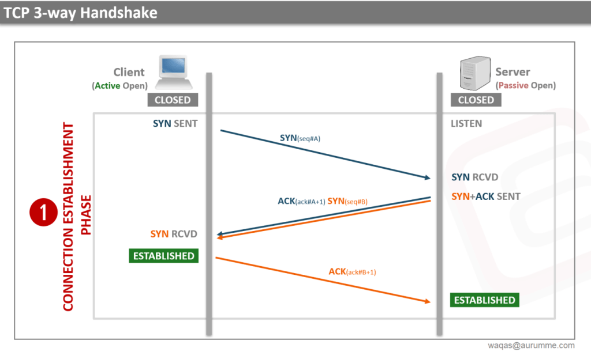
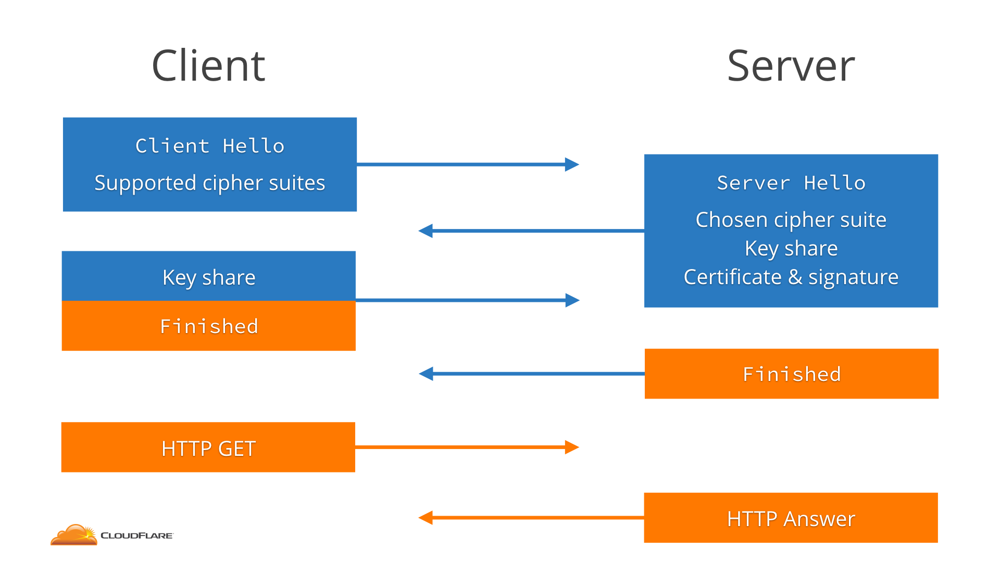
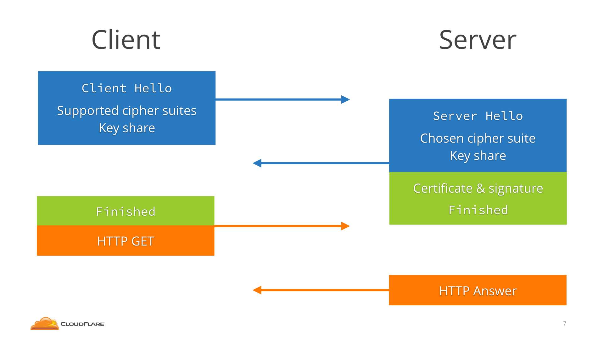
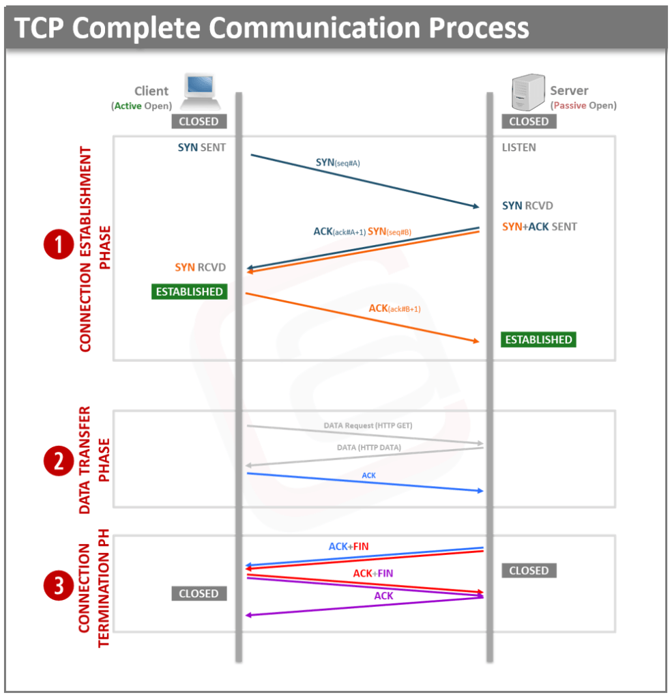

TCP/IP 传输协议的 TCP 协议是面向连接的，也就是传输数据之前，必须建立可靠的连接。建立连接的过程中，需交换信息（如选取哪种协议、协议版本等），这个过程称为*握手 handshaking*。

握手过程中会协商后续通信使用的参数，如传输速率、编码方式、校验，以及其他协议选取、硬件支持的功能等。握手是两个实体之间的通信，但在 TCP/IP 中握手常指 TCP 的三次握手。

## 1. 三次握手

TCP 中的数据传输、连接建立与终止都由特定控制参数管理，控制参数有以下这些：

| 参数    | 用途                                                         |
| ------- | ------------------------------------------------------------ |
| SYN     | 用于启动和建立连接时，同步设备之间的序列号。0到2^32 - 1的随机数。 |
| ACK     | 向另一端确认已经收到 SYN，数值为收到 SYN 增一。              |
| SYN-ACK | 确认之前收到了 SYN，数值为自定义值。                         |
| FIN     | 终止连接。                                                   |
| RST     | 重置连接。                                                   |

建立 TCP 连接需要三次握手：

1. 客户端想要连接服务端时，向服务端发送 SYN message。Message 还包含 sequence number（32位的随机数），ACK 为0，window size、最大 segment 大小。例如，如果 window size 是 2000 bits，最大 segment 大小是 200 bits，则最大可传输 segments 是 10 data。
2. 服务端收到客户端 synchronization request 后，回复客户端 SYN 和 ACK。ACK 数值是收到的 SYN 加一。例如客户端发送的 SYN 是 1000，则服务端回复的 ACK 是 1001。如果服务端也想建立连接，回复中还会包括一个 SYN，这里的 SYN 是另一随机数，与客服端的 SYN 不相同。这一阶段完成时，客户端与服务端的连接已经建立。
3. 收到服务端的 SYN 后，客户端回复 ACK，ACK 值是 SYN 值加一。这一过程完成后，服务端与客户端的连接也建立了起来。

TCP 连接的双方通过三次握手确定 TCP 连接的初始序列号、窗口大小以及最大数据段，这样通信双方就能利用连接中的初始序列号保证双方数据段的不重不漏，通过窗口大小控制流量，并使用最大数据段避免 IP 协议对数据包分片。

换个角度看为什么需要三次握手？客户端和服务端通信前要进行连接，三次握手就是为了确保自己和对方的收发能力是正常的。

1. 第一次握手：客户端发送、服务端接收网络包，服务端可以得出：客户端发送能力、服务端接收能力是正常的。
2. 第二次握手：服务端发送、客户端接收网络包。从客户端的视角来看，我接收到了服务端发送的响应数据包，说明服务端收到了第一次握手时我发出的网络包，且收到请求后进行了响应，这说明服务端的接收、发送能力正常，我的发送、接收能力正常。
3. 第三次握手：客户端发送、服务端接收网络包，这样服务端就能得出结论：客户端的接收、发送能力正常，服务端的发送、接收能力正常。第一次、二次握手后，服务端并不知道客户端的接收能力，以及自己的发送能力是否正常。第三次握手后，这些能力才得以确认。

三次握手后，客户端、服务端才确认了自己的接收、发送能力均是正常的。

## 2. 七次握手

HTTP 协议中的数据是明文传输的，任何中间人（man-in-the-middle）都可以读取传输的数据，因此 HTTP 是一种不安全的协议。

#### 2.1 SSL/TLS 预览

HTTPS 是 HyperText Transfer Protocol Secure 的缩写。但 HTTPS 协议自身不能加密数据，它需要借助 SSL 或 TLS 协议层进行加密。

> 后面会介绍 SSL、TLS  协议的区别，目前使用 TLS 指代加密协议。

HTTP 协议和 TLS 协议都位于 application layer。TCP 三次握手建立连接后，使用 TLS 握手建立安全连接，后续使用协商的加密算法先对数据进行加密，再通过 HTTP 传输。

数据加密后，中间人即使获得了数据，也无法读取数据内容，进而避免了中间人攻击（man-in-the-middle-attack）。

HTTP 协议和 TLS 协议一起使用时，称为 HTTPS 协议。App 想要使用 TLS 加密通信，只需网址使用 https:// 前缀即可。

要了解 TLS 工作原理，需先了解加密的工作原理，以及各种加密算法。加密就是将数据从一种格式编码为另一种格式，编码时使用一些数学算法、秘密参数。使用相同算法、参数，可以解密数据，这个过程中的参数称为密钥（key）。

#### 2.2 非对称加密算法 Asymmetric Key Algorithm

非对称加密算法有两个 key：

- 公钥（public key）：公开可见，用于加密数据。
- 私钥（private key）：只自己可见，用于解密。

最流行的非对称加密算法是 RSA 加密算法，广泛用于密钥交换和数字签名验证。但现在正逐步迁移至更安全高效的 Diffie-Hellman （缩写为 D-H）算法。

> RSA 的 private key 也可以用于加密数据，使用 public key 解密。生成和验证数字签名时就是用的这种方式。

非对称加密算法通常速度慢，更耗费 CPU，且 key、数据越长，加密、解密耗费时间也越长。因此，数据量大时不要使用非对称加密，而应使用对称加密（symmetric key cryptography），对称加密速度更快、性能更高。非对称加密用于传输对称加密密钥。

#### 2.3 对称加密算法 Symmetric Key Algorithm

对称加密算法也称为共享密钥加密（shared key），它使用相同的 key 加密、解密。

对称加密算法主要用于受信任两者之间建立加密通道。因为第三方无法获取对称密钥，因此只有建立通道的双方才可以解密数据。

最流行的对称加密算法是 AES（Advanced Encryption Standard 的缩写，即高级加密标准），

#### 2.4 SSL （Secure Sockets Layer）协议

SSL 协议由 Netscape 团队设计，于1995年发布 SSL 2.0版本，之后发布了 SSL 3.0版本，IETF 已于2015年不推荐使用 SSL 3.0。

目前，TLS 协议已经替代了 SSL 协议，SSL 协议已不再使用。

> 当我们说 SSL 时，事实上说的是 TLS。SSL 证书实质上是 TLS 证书，SSL v3.1、SSL v4 是 TLS 1.0+ 的别称。

#### 2.5 TLS（Transport Security Layer）协议

TLS 是旨在提供安全通信的加密协议，使用 TLS 可以加密与服务器的所有通信。当前使用最广的是 TLS 1.2、TLS 1.3。

TLS 1.3 发布于2018年，是对 TLS 1.2 的全面修订，在性能和安全性方面都有很大提升，并且减少了建立安全连接所需的握手次数。

TLS 1.3 只支持 Diffie-Hellman 非对称加密算法，移除了 RSA 算法。

#### 2.6 使用 TLS 1.2 握手

使用 HTTPS 发送 HTTP 请求时，首先使用三次握手建立可靠的 TCP 连接，之后就通过 TLS 四次握手交换双方的密钥。

下面介绍 TLS 1.2 连接建立过程：

1. 客户端向服务端发送 Client Hello 消息。消息携带客户端支持的协议版本、加密算法、压缩算法，以及客户端生成的随机数。
2. 服务端收到客户端消息后：
   1. 向客户端发送 Server Hello 消息，并携带选取的协议版本、加密方法、session id，以及服务端生成的随机数。
   2. 向客户端发送 Certificate 消息，即服务端的证书链，其中包含证书支持的域名、发行方和有效期等信息。
   3. 向客户端发送 Server Key Exchange 消息，传递公钥、签名等信息。
   4. 向客户端发送可选的 CertificateRequest 消息，验证客户端证书。
   5. 向客户端发送 Server Hello Done 消息，通知已经发送了全部的信息。
3. 客户端收到服务端的协议版本、加密方法、session id 和证书等信息后，验证服务端证书。
   1. 向服务端发送 Client Key Exchange 消息，包含使用服务端公钥加密的随机字符串，即预主密钥（Pre Master Secret）。
   2. 向服务端发送 Change Cipher Spec 消息，通知服务端后续数据会加密传输。
   3. 向服务端发送 Finished 消息，其中包含加密后的握手信息。
4. 服务端收到 Change Cipher Spec 和 Finished 消息后：
   1. 向客户端发送 Change Cipher Spec 消息，通知客户端后续数据会加密传输。
   2. 向客户端发送 Finished 消息，验证客户端的 Finished 消息并完成 TLS 握手。

TLS 握手的关键在于利用通信双方生成的随机字符串和服务端的公钥生成一个双方经过协商后的密钥，通信双方后续使用这个对称密钥加密数据，防止中间人监听和攻击，保障通信安全。

在 TLS 1.2 中，需要 2-RTT（Round-Trip Time，往返延迟）才能建立 TLS 连接。在 TLS 1.3 中，客户端不仅发送 ClientHello、支持的协议、加密算法，还尝试猜测服务器将选择哪种密钥协商算法，并为此发送共享密钥。这样服务端选取加密算法后，因为已经有了 client key，可以立即生成 key，进而减少一次 RTT。

## 3. 四次挥手

建立连接时需要发送三个 packet，但终止连接时需要四个 packet，也称为四次挥手。因为 TCP 连接是全双工的，每个方向都必须独立终止。

终止 TCP 连接的四次挥手：

1. 第一次挥手：客户端想要终止连接时，向服务端发送 FIN。该 segment 有两个功能：
   - FIN 用于告诉服务端不会再向其发送数据。
   - FIN 中的 ACK 标记要终止的连接。
2. 第二次挥手：服务端收到客户端终止请求后，回复 ACK 确认 FIN。
3. 第三次挥手：TCP 的连接是相互独立的。因此，服务端也需要向客户端发送 FIN。
4. 第四次挥手：客户端收到服务端的 FIN 后，回复 ACK 确认，序列号增一。

在第二次挥手时，如果服务端也想终止连接，可以为 FIN 设置不同于客户端 FIN 的序列号。客户端收到 FIN 后，发送 ACK，它的 acknowledgement number 为 FIN sequence number 加一。这一过程结束后，服务端与客户端的连接也终止了，这样的话整个过程进行了三次挥手。

## 总结

客户端想要通过 HTTP 请求访问服务端时，需要经过三次握手；通过 HTTPS 访问服务端时，需要额外增加四次握手。

总结一下 HTTP 建立连接、终止连接：

- TCP 协议需要通过三次握手建立可靠连接。
- 想要建立 HTTPS 安全连接，需要在 TCP 可靠连接基础上使用 TLS 协议。TLS 协议需要四次握手才能建立安全连接。
- 终止 TCP 可靠连接时需要四次挥手。

需要注意的是，本文所说的三次握手、七次握手、四次挥手都是基于特定版本的协议，不同版本的协议所需握手次数可能不同。HTTP/3 就是一个例子，它使用基于 UDP 的 QUIC 协议进行握手，将 TCP 和 TLS 握手过程结合起来，握手次数从七次减少到了三次。

参考资料：

1. [“三次握手，四次挥手”你真的懂吗？](https://zhuanlan.zhihu.com/p/53374516)
2. [什么是 TLS 握手？](https://www.cloudflare.com/zh-cn/learning/ssl/what-happens-in-a-tls-handshake/)
3. [为什么 HTTPS 需要 7 次握手以及 9 倍时延](https://draveness.me/whys-the-design-https-latency/)
4. [TCP 3-way Handshake Process](https://aurumme.com/atech/tcp-3-way-handshake-process/)
5. [What is a TCP 3-way handshake process?](https://afteracademy.com/blog/what-is-a-tcp-3-way-handshake-process)
6. [Explanation of the three-way handshake via TCP/IP](https://docs.microsoft.com/en-us/troubleshoot/windows-server/networking/three-way-handshake-via-tcpip)
7. [Handshaking](https://en.wikipedia.org/wiki/Handshaking)
8. [An overview of TLS 1.3 and Q&A](https://blog.cloudflare.com/tls-1-3-overview-and-q-and-a/)

